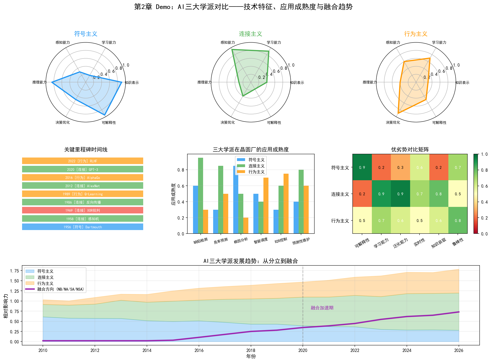
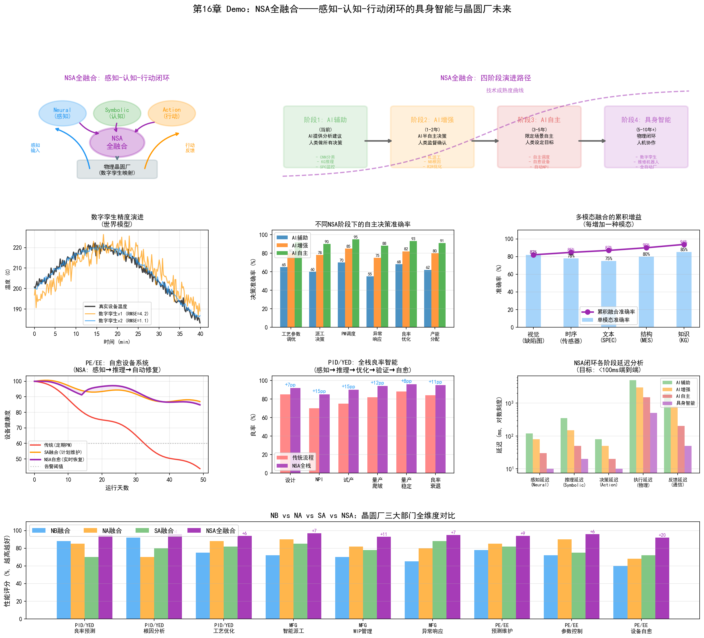

<div align="center">

# 📖 AI在半导体晶圆厂的应用

*AI Applications in Semiconductor Wafer Fabs · AI在半導體晶圓廠的應用*

---

### 🌐 选择语言 · Choose Your Language · 選擇語言

|  |  |  |
| :---: | :---: | :---: |
| 🇨🇳 **简体中文**<br><sub>Simplified Chinese</sub> | 🇹🇼 **繁體中文**<br><sub>Traditional Chinese</sub> | 🇬🇧 **English**<br><sub>英文</sub> |
| **[📘 阅读简体版 →](README.md)** | **[📗 閱讀繁體版 →](zh-TW/README.md)** | **[📙 Read in English →](en/README.md)** |

</div>

---

> 从1956年达特茅斯会议到Palantir帮三星提升良率——一本系统梳理人工智能在半导体制造中落地实践的开源技术书。

半导体制造是人类工业皇冠上最精密的明珠，一座先进制程晶圆厂的造价超过150亿美元，一片晶圆上承载着数千亿颗晶体管。在这个良率每提升1%就意味着数千万美元利润的产业里，AI正在从实验室走向产线，从论文走向车间。

本书以**晶圆厂三大核心部门**为业务主线，以**AI三大流派**为技术主线，双线交织，系统讲解AI技术如何真正在半导体晶圆厂中落地。

<div align="center">

   

</div>

---

## ✨ 为什么值得读

- **双线交织的独特结构**：以晶圆厂三大核心部门（PID/YED、MFG、PE/EE）为业务主线、AI三大流派（符号/连接/行为）为技术主线，两条线逐章交叉推进，避免"技术讲义"与"行业报告"两张皮
- **27章体系化覆盖**：从AI简史到三大流派，从三大部门到关键业务场景，从三大主义融合（NB/NA/SA/NSA）到 LLM / Agent / Ontology，一路讲到晶圆厂AI的前沿
- **20+ 可运行 Demo**：每个核心概念都配有基于真实数据形态的可视化脚本（Python + Matplotlib），跑一跑就能直观看到"缺陷检测长什么样""RL调度如何工作"
- **大量真实产业案例**：台积电、三星、Intel、SK海力士/Gauss Labs、美光、格罗方德、Palantir、NVIDIA、KLA、ASML……书中引用的都是公开报道与论文中的真实落地实践
- **三语同步出版**：简体中文、繁体中文、英文三版同步维护，适合不同语言背景的读者
- **开源协作、持续修订**：全书以 CC BY-NC-SA 4.0 许可开放，欢迎任何人参与修订、补充案例与翻译

## 🗺️ 内容速览

| 维度 | 覆盖内容 |
| --- | --- |
| 技术主线 | 符号主义 → 连接主义 → 行为主义 → NB/NA/SA/NSA 融合 → LLM / Agent / Ontology |
| 业务主线 | 三大部门 → 关键业务场景（良率爬坡/产能爬坡）→ 业务三阶段（建设期/成熟期/转型期） |
| 落地任务 | 良率分析、虚拟量测、缺陷检测、智能排程、预测性维护、能源管理、NPI协同、数据安全、供应链透明化 |
| 产业案例 | 台积电、三星、Intel、SK海力士、美光、格罗方德、Palantir、NVIDIA、KLA、ASML |

> **本书数据**：27 章 · 3 种语言 · 20+ Demo 脚本 · 21 个动手实验 · 47 张配图 · 100+ 产业案例引用

## 🖥️ Demo 可视化

本书每一章都配有可运行的可视化 Demo，下面是几个代表性截图：

<table align="center">
<tr>
<td align="center"><br><sub>三大流派对比（第2章）</sub></td>
<td align="center"><br><sub>良率爬坡 S 曲线（第9章）</sub></td>
</tr>
<tr>
<td align="center"><br><sub>成熟期三任务（第12章）</sub></td>
<td align="center"><br><sub>NSA 全融合闭环（第21章）</sub></td>
</tr>
</table>

所有脚本位于 [`zh-CN/demos/`](zh-CN/demos/)，运行方式见下文"快速开始"。

---

## 本书结构

```
第一部分  基石篇
├── 第 1 章  为什么是 AI × 半导体晶圆厂
└── 第 2 章  AI 简史——从 1956 年达特茅斯会议说起

第二部分  AI 技术三大流派
├── 第 3 章  符号主义——从规则到知识
├── 第 4 章  连接主义——从感知机到深度学习
└── 第 5 章  行为主义——从控制论到强化学习

第三部分  半导体晶圆厂三大核心部门
├── 第 6 章  工艺整合（PID）与良率工程（YED）
├── 第 7 章  制造部（MFG）
└── 第 8 章  制程工程（PE）与设备工程（EE）

第三部分b  关键业务场景专题
├── 第 9 章  良率爬坡——半导体制造的"死亡之谷"
└── 第 10 章 产能爬坡与产能规划——从"做得对"到"做得多"

第三部分c  建设期与爬坡期
└── 第 11 章 建设期与爬坡期——从"建厂"到"产能爬坡"

第三部分d  成熟量产期
└── 第 12 章 成熟量产期——稳定运营中的效率与韧性

第三部分e  代工服务转型期
└── 第 13 章 代工服务转型期——从"制造"到"服务"

第四部分  AI 三大流派在晶圆厂的交叉应用
├── 第 14 章 符号主义在晶圆厂的应用
├── 第 15 章 连接主义在晶圆厂的应用
├── 第 16 章 行为主义在晶圆厂的应用
├── 第 17 章 融合概论——三大主义的交叉与统一
├── 第 18 章 NB（Neural + Symbolic）——神经符号融合在晶圆厂的应用
├── 第 19 章 NA（Neural + Action）——神经行为融合在晶圆厂的应用
├── 第 20 章 SA（Symbolic + Action）——符号行为融合在晶圆厂的应用
└── 第 21 章 NSA 全融合——具身智能与晶圆厂未来

第五部分  LLM 与 Agent
├── 第 22 章 大语言模型（LLM）在晶圆厂的应用
└── 第 23 章 Agent 系统在晶圆厂的实践

第六部分  Ontology 专章
├── 第 24 章 Palantir 与本体论——从击毙本拉登到三星良率飞跃
├── 第 25 章 Ontology 在半导体晶圆厂的构建与应用
└── 第 26 章 具身智能的应用——当AI走进晶圆厂的物理世界

第七部分  动手实验实验室
└── 第 27 章 动手实验实验室——把关键概念跑起来（21 个可运行实验）
```

### 双线交织结构

```
                    业务主线                          技术主线
                    ┌─────────────────────┐          ┌─────────────────────────┐
                    │                     │          │                         │
  第一部分 基石篇    │  晶圆厂为什么需要AI  │◄────────►│  AI 从哪里来（1956-今）  │
                    │                     │          │                         │
                    ├─────────────────────┤          ├─────────────────────────┤
                    │                     │          │                         │
  第二部分 技术流派  │  （技术主线主导）    │◄────────►│  符号/连接/行为 三大流派 │
                    │                     │          │                         │
                    ├─────────────────────┤          ├─────────────────────────┤
                    │                     │          │                         │
  第三部分 业务部门  │  PID/YED MFG PE/EE  │◄────────►│  （业务主线主导）        │
                    │                     │          │                         │
                    ├─────────────────────┤          ├─────────────────────────┤
                    │                     │          │                         │
  第三部分b 业务场景 │  良率/产能爬坡专题  │◄────────►│  三大流派 × 关键场景     │
                    │                     │          │                         │
                    ├─────────────────────┤          ├─────────────────────────┤
                    │                     │          │                         │
  第三部分c 建设期   │  良率/量测/缺陷检测 │◄────────►│  数据稀缺下的AI加速      │
                    │                     │          │                         │
                    ├─────────────────────┤          ├─────────────────────────┤
                    │                     │          │                         │
  第三部分d 成熟期   │  排程/维护/能源管理 │◄────────►│  ROI导向的AI优化        │
                    │                     │          │                         │
                    ├─────────────────────┤          ├─────────────────────────┤
                    │                     │          │                         │
  第三部分e 转型期   │  NPI/数据安全/供应链│◄────────►│  信任驱动的AI基础设施    │
                    │                     │          │                         │
                    ├─────────────────────┤          ├─────────────────────────┤
                    │                     │          │                         │
  第四部分 交叉应用  │  PID/YED MFG PE/EE  │◄────────►│  三流派 × 三部门 × 融合   │
                    │                     │          │                         │
                    ├─────────────────────┤          ├─────────────────────────┤
                    │                     │          │                         │
  第五部分 LLM/Agent │  各部门 LLM 应用    │◄────────►│  LLM 与 Agent 技术      │
                    │                     │          │                         │
                    ├─────────────────────┤          ├─────────────────────────┤
                    │                     │          │                         │
  第六部分 Ontology  │  晶圆厂数字本体     │◄────────►│  Palantir Ontology      │
                    │                     │          │                         │
                    └─────────────────────┘          └─────────────────────────┘
```

---

## 🎯 你将学到什么

- **看懂AI的底层逻辑**：三大流派（符号/连接/行为）各自擅长什么、局限在哪，为什么必然走向融合（NB/NA/SA/NSA）
- **理解晶圆厂的业务全景**：从 PID/YED、MFG、PE/EE 三大部门，到良率爬坡、产能爬坡，再到建设期、成熟量产期、代工服务转型期等关键业务阶段
- **掌握AI落地的具体打法**：良率预测怎么做、虚拟量测怎么部署、RL调度怎么训练、知识图谱怎么辅助根因分析、LLM如何检索工艺文档……
- **了解产业前沿**：LLM 如何进入晶圆厂、Agent 系统如何协同、Palantir Ontology 如何帮三星提升良率
- **获得可直接运行的代码**：20+ 个 Demo 脚本覆盖全部核心概念，配套 47 张可视化配图

---

## 适合谁读

- **半导体工程师**——想了解AI如何在自己所在的工艺、良率、制造、设备领域落地
- **AI算法工程师**——想理解半导体制造场景的特殊性，找到有价值的工业AI应用方向
- **Fab管理层与IT负责人**——想知道哪些AI技术值得投资，哪些还在概念验证阶段
- **高校研究生与研究者**——需要一本将AI理论与半导体实践结合的参考书
- **技术投资人**——想看懂半导体AI赛道的底层逻辑

---

## 阅读建议

| 你的背景               | 建议路径                                              |
| ---------------------- | ----------------------------------------------------- |
| 半导体工程师，AI新手   | 第一部分 → 第三部分 → 第二部分 → 第四部分            |
| AI工程师，半导体新手   | 第一部分 → 第二部分 → 第三部分 → 第四部分            |
| 管理层/投资人          | 第一部分 → 第六部分 → 第五部分 → 第四部分（选读）     |
| 系统学习               | 从头到尾按顺序读                                      |

---

## 🚀 快速开始

### 在线阅读

在 GitHub 上直接浏览 [`zh-CN/chapters/`](zh-CN/chapters/) 下的 Markdown 源码（英文版见 [`en/chapters/`](en/chapters/)，繁体版见 [`zh-TW/chapters/`](zh-TW/chapters/)）。

### 本地阅读

```bash
git clone <仓库地址>
# 中文版正文: zh-CN/chapters/  英文版: en/chapters/  繁体版: zh-TW/chapters/
```

### 运行 Demo

需要 Python 3.8+，依赖 `numpy`、`matplotlib`（部分脚本另需 `scikit-learn`、`networkx`）：

```bash
pip install numpy matplotlib scikit-learn networkx
cd zh-CN/demos
python demo_ch9_yield_ramp.py        # 良率爬坡 S 曲线
python demo_ch15_cnn_detection.py    # CNN 晶圆缺陷检测
python demo_ch23_agent_system.py     # 多智能体协同框架
```
### 运行动手实验（第27章）

21 个可运行的完整实验项目位于 `zh-CN/demos/experiments/`，详见第27章。以依赖最轻的 Ontology Text2SQL 为例：

```bash
cd zh-CN/demos/experiments/fab_ontology_text2sql
pip install -r requirements.txt
streamlit run app.py
```

### 生成 PDF

```bash
pip install markdown fpdf2
python generate_pdf.py               # 生成简体版 PDF（输出到 zh-CN/）
python generate_en_pdf.py            # 生成英文版 PDF（输出到 en/）
```

## 📂 项目结构

项目按语言版本组织为三个一级目录，各语言内部结构完全一致：

```
├── zh-CN/   # 简体中文版（默认）
│   ├── chapters/   # 27章正文（Markdown）
│   ├── demos/      # 20+ Demo可视化脚本 + 21个动手实验（experiments/）
│   ├── images/     # 配图（Demo图 + 流程图）
│   └── OUTLINE.md  # 详细目录大纲
├── en/      # 英文版（结构同上）
├── zh-TW/   # 繁体中文版（结构同上）
├── generate_pdf.py      # 简体版 PDF 生成脚本
├── generate_en_pdf.py   # 英文版 PDF 生成脚本
└── README.md            # 本文件
```

---

## 项目状态

本书正在持续写作中，采用开源协作方式，所有内容在GitHub上公开。

| 部分       | 状态           |
| ---------- | -------------- |
| 第一部分   | 已完成         |
| 第二部分   | 已完成         |
| 第三部分   | 已完成         |
| 第三部分b  | 已完成         |
| 第三部分c  | 已完成         |
| 第三部分d  | 已完成         |
| 第三部分e  | 已完成         |
| 第四部分   | 已完成         |
| 第五部分   | 已完成         |
| 第六部分   | 已完成         |
| 第七部分   | 已完成         |

全书27章初稿已完成，持续修订中。

---

## 📅 写作历程

- **15章框架**——基石篇、三大流派、三大部门、交叉应用、LLM与Agent、Ontology 专章
- **扩展至20章**——新增三大主义融合篇（NB / NA / SA / NSA 全融合，第12-16章）
- **扩展至26章**——新增第26章具身智能的应用（当AI走进晶圆厂的物理世界）
- **扩展至27章（当前）**——新增第27章动手实验实验室，配套 21 个可运行实验项目（LLM/Agent/良率/调度/专家系统等）

全书处于持续修订中，欢迎通过 Issues 提出建议。

---

## 贡献指南

欢迎通过以下方式参与：

- **内容贡献**——发现错误、补充案例、撰写章节，提交 Pull Request
- **问题反馈**——在 Issues 中提出建议或指出问题
- **案例分享**——如果你在晶圆厂有AI落地经验，欢迎匿名分享
- **翻译**——欢迎将内容翻译为英文、日文等

---

## 许可证

本书内容采用 [CC BY-NC-SA 4.0](https://creativecommons.org/licenses/by-nc-sa/4.0/) 许可协议。

- **署名**——必须注明来源
- **非商业**——不得用于商业目的
- **相同方式共享**——衍生作品须采用相同许可

---

## 📖 引用本书

如果你在论文、报告或课程中引用了本书，可以使用以下格式（作者、年份、仓库地址请以实际发布信息为准）：

**APA 格式：**

> Zhu, Dawson. (2026). *AI在半导体晶圆厂的应用：从三大学派到融合智能* [开源图书]. 

**BibTeX：**

```bibtex
@book{zhu2026ai,
  title       = {AI在半导体晶圆厂的应用：从三大学派到融合智能},
  author      = {Dawson Zhu},
  year        = {2026},
  howpublished= {\url{<仓库地址>}},
  note        = {开源图书, CC BY-NC-SA 4.0}
}
```

---

## Star 趋势

如果觉得有帮助，欢迎 Star 支持持续写作。
