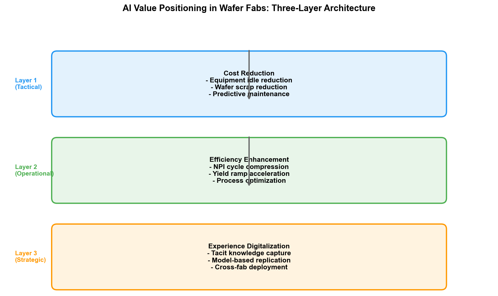

# Chapter 1: Why AI × Semiconductor Wafer Fabs

## 1.1 The Twilight of Moore's Law and the Dawn of AI

In 2024, the cost of building an advanced-node wafer fab has climbed to between $20 and $30 billion. For reference, building a fab in 2000 cost only $1 to $2 billion — over twenty-five years, construction costs have increased more than tenfold. A single EUV lithography scanner is priced at over $150 million, and the next-generation High-NA EUV exceeds $350 million, while a 3nm fab requires deploying more than 15 such machines. A full reticle set for the 3nm process costs over $20 million.

Behind these numbers lies a harsh reality: semiconductor manufacturing is approaching physical limits, and advancing each technology node is more difficult than the last.

Moore's Law is not dead, but it is getting more expensive. TSMC's 3nm process achieves approximately 70% higher transistor density compared to 5nm, but the yield ramp cycle has lengthened significantly. Process steps have expanded from roughly 800–1,200 steps at 7nm to over 1,200 at 3nm, and lithography layers have increased from 60–80 at 7nm to 80–120 at 3nm. Each layer must undergo the core cycle of cleaning, deposition, lithography, etching, cleaning, and metrology. A minute deviation in any single step can lead to the scrap of an entire batch of wafers.

Meanwhile, another revolution is underway.

In 2012, AlexNet reduced the error rate on the ImageNet competition from 26% to 15%, making deep learning famous overnight. In 2022, ChatGPT was released, and the emergent abilities displayed by large language models stunned the world. In 2024, Palantir's AI platform achieved, for the first time in U.S. military operations against Iran, an "algorithm-driven kill chain" — AI defined target identification, timing selection, and the sequencing of strikes, with human commanders making only the final approval.

Semiconductor manufacturing and artificial intelligence — two fields that have each undergone decades of development — are converging at a unique intersection. Wafer fabs have accumulated massive volumes of process data that cannot be fully digested, while AI possesses precisely the ability to extract patterns, make predictions, and optimize decisions from massive data. This match is no coincidence — when human engineers' cognitive capacity can no longer handle the complexity of thousand-step processes, hundred-layer structures, and trillion-level parameters, the intervention of machine intelligence becomes unavoidable.

## 1.2 The Fab's Dilemma: Complexity Explosion

### Exponential Growth in Process Steps

A 3nm chip requires a manufacturing cycle of 3 to 4 months from wafer start to output, encompassing over 1,200 process steps. These steps are not simply linear additions — there are complex interaction effects between preceding and subsequent steps. A 0.5-nanometer deviation in etch depth at one layer may manifest as excessive leakage current in electrical testing twenty layers later, and this correlation often cannot be detected through single-step process parameter monitoring.

The 28nm process comprises approximately 400 to 600 process steps, while the 3nm GAA architecture exceeds 1,200. A doubling of step count means the potential parameter interaction combinations grow exponentially. Assuming each step has 10 key parameters, each with 5 possible states, the parameter space for 1,200 steps is $5^{12000}$ — a number far exceeding the total number of atoms in the universe. Of course, in engineering practice, not all parameters are coupled. But even considering only the interactions between adjacent steps, the parameter combinations that need monitoring reach astronomical figures.

### Diminishing Marginal Returns on Yield Improvement

In mature processes (28nm and above), ramping yield from 50% to 90% typically takes 6 to 12 months. But in advanced processes, the same ramp may take 18 to 24 months or longer. Samsung's 2nm GAA process initially saw yield drop to around 30%. After collaborating with Palantir on data integration and analysis, yield climbed to approximately 55% by mid-2026 — still below the 60% threshold for mass production. The yield ramp curve for each new process generation is becoming steeper.

The economic significance of yield is direct. For a 3nm fab producing 50,000 wafers per month, each 1-percentage-point yield improvement can add tens of millions of dollars in annual profit. Conversely, each 1-percentage-point yield loss means fewer good dies produced with the same equipment and labor investment. When a fab's annual depreciation cost is measured in billions of dollars, yield is everything.

### The Ceiling of Human Expertise

There is a core asset in the wafer fab that is difficult to quantify: the experience of senior engineers. A process engineer with 20 years of experience can determine whether a particular tool is about to develop an anomaly by observing the pattern of FDC (Fault Detection and Classification) charts, and can infer which chamber of which process step is causing the problem based on the spatial distribution pattern of defects. This "know-it-at-a-glance" ability is essentially the human brain's highly compressed representation of massive historical data — but it has three fatal limitations.

First, it is non-reproducible. Cultivating a qualified PID engineer takes 5 to 10 years, and the iteration speed of advanced processes demands that talent reserves keep pace with technology. Second, it is non-scalable. The number of tools and process steps one engineer can monitor simultaneously is limited. Third, it is non-transferable. When a senior engineer retires or leaves, those association rules that were never documented in writing vanish from their mind along with them.

These three limitations all point to the same conclusion: the wafer fab needs a technology that can automatically extract experience from data, externalize tacit knowledge, and be infinitely reproduced and scaled. This is precisely what AI excels at.

## 1.3 AI's Value Proposition in the Fab

AI's value in the fab is not to replace engineers, but to liberate them from inefficient information-processing tasks so they can focus on decisions that truly require human judgment. Specifically, AI's value in the fab can be distilled into three levels.

### Cost Reduction: Reducing Equipment Idle Time and Wafer Scrap

An advanced fab operates hundreds of pieces of equipment, each incurring idle costs measured in thousands of dollars per hour. Traditional preventive maintenance (PM) uses fixed cycles — regardless of tool condition, maintenance is performed every N batches. This approach either maintains too early (wasting capacity) or too late (causing anomalous batches or even equipment downtime).

AI-based predictive maintenance analyzes equipment sensor time-series data (temperature, pressure, vibration, RF power, etc.) to issue warnings hours or even days before an anomaly occurs. Intel deployed a machine learning–based equipment monitoring system in its fabs, significantly reducing unplanned downtime. TSMC developed an intelligent equipment health monitoring system, using self-learning algorithms to achieve "the most stringent process control standards."

The cost of wafer scrap is even more direct. A 3nm wafer contains hundreds of chips; calculated by the unit price of each chip, a single wafer's output value can reach tens of thousands of dollars. If AI can reduce the scrap rate by 0.5 percentage points, for a fab producing 50,000 wafers per month, the annual loss recovered is measured in millions of dollars.

### Efficiency Gains: Shortening Process Development Cycles and Accelerating Yield Ramp

New Product Introduction (NPI) is the most time-consuming and expensive phase in the fab. An advanced process NPI cycle typically takes 1 to 2 years, during which extensive DOE (Design of Experiments) is required to find the optimal process window. Traditional DOE methods rely on engineers' experience and statistical methods, and are extremely inefficient when facing thousands of process parameters and their nonlinear interactions.

AI can accelerate this process from two directions. First, transfer learning based on historical data — DOE results from the previous generation can guide the parameter search direction for the new generation. Second, active experimental design based on Bayesian optimization or reinforcement learning — AI models predict the most informative next set of experimental parameters based on existing results, thereby covering a larger parameter space with fewer experimental runs.

After applying machine learning to its 18A process, Intel achieved a yield improvement rate of approximately 7% per month. This means a yield ramp cycle that might have taken a year was compressed by several months. Intel's practices also include ML-based rapid Root Cause Analysis (RCA), compressing the time for defect root cause localization from days to minutes.

### Digitizing Expertise: Converting Tacit Knowledge into Reusable Models

This is AI's deepest value in the fab. Traditional process knowledge exists in three forms: documents, SOPs, and the experience in engineers' minds. Documents are explicit but often outdated; SOPs are standardized but cannot cover all anomalous situations; engineers' experience is the most valuable but the hardest to transfer.

AI can convert this tacit knowledge into models. For example, using knowledge graphs to integrate process specifications, equipment parameters, defect patterns, and root cause records into a reasoning-capable semantic network; using deep learning to convert engineers' "see-and-identify-defect" ability into Automated Defect Classification (ADC) models; using reinforcement learning to convert senior engineers' recipe tuning strategies into R2R control strategies.

Once trained, these models can be deployed simultaneously across multiple tools and multiple fabs, never tiring and never leaving. Samsung described its AI-optimized production as "an intelligent network connecting previously isolated processes." Its HBM4 memory manufacturing benefited from this AI optimization system, achieving a 30% improvement in defect detection and a 15% improvement in wafer yield.

## 1.4 Global Landscape of AI Adoption in Wafer Fabs

### TSMC

TSMC explicitly states on the "Engineering Performance Optimization" section of its official website that it is implementing AI technologies, having developed precise Fault Detection and Classification systems, intelligent Advanced Equipment Control, and intelligent Advanced Process Control. TSMC's AI applications emphasize "intelligent detection, intelligent diagnosis, and self-learning" to achieve the most stringent process control standards, ensuring tool matching consistency and process stability. Combined with TSMC's foundry experience, AI is used to minimize convergence deviation of process parameters.

TSMC's AI deployment is progressive — from point-solution automated defect detection, gradually expanding to line-wide intelligent scheduling. According to SEMI reports, a newly built fab in the Taichung Science Park has already implemented AI-driven dispatching instructions: at 3 a.m., a batch of wafers completing ion implantation is routed by the AI scheduler directly to the cleaning section, bypassing the traditional waiting area. This real-time scheduling optimization is unachievable in traditional MES systems.

### Samsung

Samsung Semiconductor is one of the most aggressive practitioners of AI in wafer fabs. In late 2024, Samsung's DS division made what the industry regarded as a "near-crazy" decision — connecting the fab's core manufacturing data to Palantir's AI analytics platform. Semiconductor process data is more sensitive than chip design schematics; TSMC and Intel have never let third parties touch production-line data. Samsung made this exception because the 2nm GAA process yield had dropped to around 30%, and traditional methods could not break through the bottleneck.

Palantir's Foundry platform uses Ontology technology to unify data scattered across dozens of heterogeneous systems — including MES, SPC, defect inspection, and electrical testing — into a single causally connected network. All relationships among "wafer → lot → equipment → process step → parameter → defect → test result" are explicitly defined, allowing machines to perform correlation queries and reasoning directly on this network. By mid-2026, Samsung's 2nm yield climbed to approximately 55% — still below the 60% mass production threshold, but the improvement rate drew industry attention.

Samsung has also deployed massive AI computing power in its AI Megafactory (reportedly using approximately 50,000 GPUs), running AI optimization throughout the entire process from defect detection to process parameter tuning. Its HBM4 memory product is manufactured by this AI optimization system.

### Intel

Intel's large-scale deployment of AI in semiconductor manufacturing dates back to around 2018, systematically articulated in its white paper "The Significant Value of Artificial Intelligence in Intel's Semiconductor Manufacturing Environment." AI applications deployed in Intel's fabs include:

- Defect detection on production lines
- Equipment/equipment group/fab matching (Tool Matching)
- Multivariate process control
- Automated wafer map pattern detection and classification
- Rapid Root Cause Analysis (RCA)
- Outlier detection in screening tests

After applying machine learning to its 18A process, Intel achieved a yield improvement rate of approximately 7% per month. The RCA system integrates billions of heterogeneous production data records, compressing root cause localization time from days to minutes.

### Other Players

Beyond the three major foundries, AI applications in semiconductor manufacturing are diffusing into a broader ecosystem. Google DeepMind's AlphaChip project uses reinforcement learning combined with Graph Neural Networks (GNN) to optimize chip placement and routing, achieving a 6.2% reduction in wirelength and compressing a design process that originally took weeks into hours. NVIDIA has applied vision-language models (such as Cosmos Reason) to wafer map defect classification, achieving few-shot learning, natural language explanation, and automated data annotation, with model construction time reduced by up to 2x. Via Automation released Agentic AI–based Via Connect and Via Co-Pilot platforms at SEMICON West 2025, combining edge data integration with AI-driven human-machine collaboration, targeting the "self-healing factory."

On the equipment vendor side, Lam Research launched the Fabex Yield Optimizer, combining AI and virtual twin technology to predict failures, localize root causes, and recommend solutions in the virtual world — before the physical wafer is etched. Applied Materials has also integrated AI analytics capabilities into its Equipment Intelligence product line.

## 1.5 This Book's Objectives and Organization

### Objectives

This book aims to systematically answer one question: How does AI technology truly land in semiconductor wafer fabs?

The market has no shortage of AI technology books or semiconductor manufacturing books, but works that deeply combine both — explaining technical principles alongside factory practice — are virtually nonexistent. This book attempts to fill this gap.

Specifically, this book pursues three objectives:

**First, to help semiconductor engineers understand AI.** Rather than piling on mathematical formulas, it starts from "what problems can AI help you solve," clearly explaining each type of AI technology's applicable scenarios, limitations, and implementation pathways. A PID engineer finishing this book should be able to judge: faced with a yield anomaly problem, should I use a knowledge graph for root cause reasoning, deep learning for defect classification, or reinforcement learning for parameter optimization?

**Second, to help AI engineers understand semiconductors.** Semiconductor manufacturing is not an ordinary industrial scenario — its data heterogeneity, process complexity, quality rigor, and commercial sensitivity are all unique. An AI algorithm engineer finishing this book should understand: why deploying a CNN model in a fab is completely different from deploying one at an internet company, why data fusion is more critical than model accuracy, and why Ontology may be a more important infrastructure than deep learning.

**Third, to provide decision-making references for management.** Which AI projects should a fab invest in, in what order, what returns to expect, where the risks lie — the cases and analysis in this book aim to provide a framework-level reference for these questions.

### Organization

This book adopts a "dual-thread interwoven" structure.

**Business thread:** Organized around the three core departments of the wafer fab — Process Integration (PID) and Yield Engineering (YED), Manufacturing Department (MFG), and Process Engineering (PE) and Equipment Engineering (EE). These three departments cover the complete value chain from process development to mass production delivery, each with unique business scenarios and AI needs.

**Technology thread:** Structured around AI's developmental trajectory — from the 1956 Dartmouth Conference, unfolding along the three schools of Symbolism, Connectionism, and Behaviorism, extending to Large Language Models (LLM) and Agents, and ultimately converging on Ontology — a technology pathway that Palantir has proven highly valuable in industrial scenarios.

The intersection of the two threads lies in Part IV — where each of the three AI schools is applied across the three core departments. This matrix structure ensures that every combination of AI technology and business scenario is covered. Readers can read horizontally by technology dimension (e.g., "applications of Connectionism across three departments") or vertically by business dimension (e.g., "what AI technologies are available for the PID department").

Part VI is the "finale" of this book — Ontology. It deserves its own chapter because Ontology may be the most underestimated yet potentially most transformative technology for AI deployment in semiconductor wafer fabs. Palantir used Ontology to help the U.S. military achieve an "algorithm-driven kill chain," then used the same technology to help Samsung climb out of a 30% yield quagmire. The technical logic behind this story deserves deep contemplation by every semiconductor AI practitioner.

### Reading Guide

There are no strict sequential dependencies between parts. Semiconductor engineers are advised to start from Part III (Fab Operations), find familiar scenarios, then backtrack to Part II (AI Technology) and Part IV (Cross-Applications). AI engineers are advised to start from Part II, establish the technical framework, then jump to Part IV for applications. Management and investors can jump directly to Part VI for the Palantir story, then backtrack based on interest.

All content in this book is open-sourced on GitHub. Readers are welcome to report errors via Issues, contribute cases, and participate in chapter writing. Semiconductor technology iterates rapidly, and this book will continue to be updated as the industry evolves.
