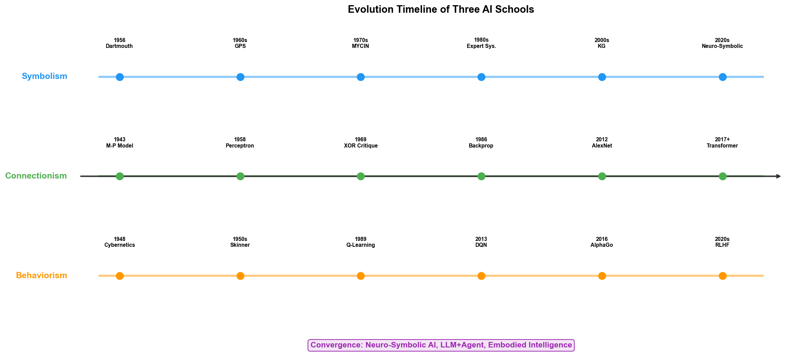
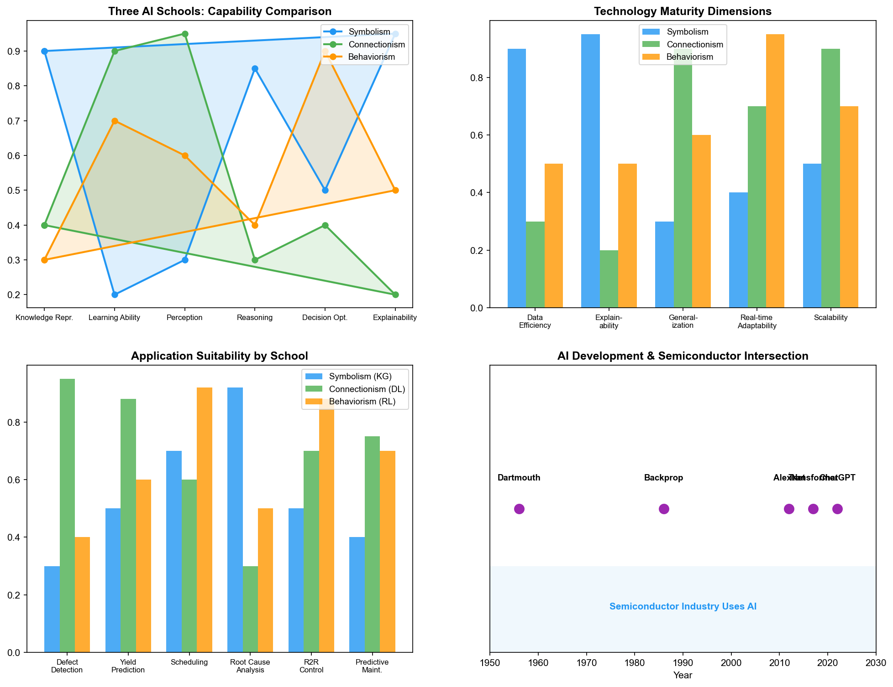

# Chapter 2: A Brief History of AI — From the 1956 Dartmouth Conference

## 2.1 The Dartmouth Conference: The Birth of AI

In the summer of 1956, Dartmouth College in New Hampshire, USA, hosted a approximately two-month-long workshop. The proposal for the conference was co-submitted by four scholars: John McCarthy (then teaching at Dartmouth), Marvin Minsky (Harvard University), Claude Shannon (Bell Labs), and Nathaniel Rochester (IBM).

The proposal formally used the term "Artificial Intelligence" for the first time. McCarthy later recalled that he chose this term to distinguish it from "cybernetics" and "automata" — he needed an umbrella term that could encompass "all aspects of machine simulation of human intelligence."

Conference participants also included Herbert Simon and Allen Newell, who brought their newly completed "Logic Theorist" program. This program could prove most of the first 38 theorems in *Principia Mathematica* and was later called "the first AI program." Arthur Samuel reported on his checkers program at the conference — this program continuously learned through self-play, eventually reaching the level of a skilled amateur. Samuel coined the term "Machine Learning" in 1959.

The significance of the Dartmouth Conference lay not in what problems it solved — in fact, little consensus was reached during the event — but in that it defined the boundaries of a discipline, bringing together researchers scattered across logic, cybernetics, information theory, psychology, and other fields under the banner of "Artificial Intelligence." From that moment on, AI began its tumultuous seventy-year journey as an independent discipline.

## 2.2 The First Boom and Winter (1956–1974)

The decade and a half following the Dartmouth Conference was AI's first golden age. Researchers were filled with optimism, believing that Artificial General Intelligence was within reach.

In 1958, Newell and Simon released the "General Problem Solver" (GPS), which attempted to simulate human problem-solving thought processes. GPS employed "means-ends analysis": comparing the difference between the current state and the goal state, selecting operators that could reduce the difference, and recursively applying them to sub-problems. Although GPS could only solve simple logic puzzles and mathematical problems, its significance lay in formalizing "heuristic search" as a computable framework for the first time.

In 1966, Joseph Weizenbaum at MIT wrote ELIZA — a dialogue program simulating a psychotherapist. ELIZA's technology was extremely simple — generating responses through pattern matching and keyword rewriting — but its effectiveness was surprisingly good; many users genuinely believed they were conversing with a human. Weizenbaum himself was disturbed by this, later writing *Computer Power and Human Reason*, questioning the ethical boundaries of AI.

In 1970, Terry Winograd developed SHRDLU — a system that executed natural language instructions in a virtual blocks world. A user could tell SHRDLU in English to "put the red block on top of the blue cube," and the system would understand the instruction, plan the action, and execute it. SHRDLU demonstrated that natural language understanding was feasible in a constrained domain, but it also exposed a problem: when the domain boundary was expanded even slightly, the system's complexity would explode.

The most ambitious project of this period was MIT's MAC project, one of whose goals was to build a general AI system that could understand natural language, perform mathematical deduction, play chess, and even write poetry. This goal was clearly too premature and ultimately only achieved partial functionality.

Optimism peaked in the late 1960s. Simon predicted in 1965: "Within twenty years, machines will be capable of doing any work a human can do." Minsky stated in 1967: "Within a generation, the problem of creating 'artificial intelligence' will be substantially solved."

These predictions did not materialize. In 1973, British mathematician Sir James Lighthill submitted an AI field assessment report at the request of the British Science Council. After reviewing the actual achievements of AI research, Lighthill reached a scathing conclusion: AI research had failed to deliver on its promises, basic research (such as machine translation) produced results far below expectations, and so-called "general problem solving" only worked on toy problems. The Lighthill Report led the British government to drastically cut AI research funding, and the U.S. Defense Advanced Research Projects Agency (DARPA) subsequently tightened its support for AI. The first AI winter descended.

## 2.3 The Expert Systems Era (1974–1987)

Amid the winter, AI researchers reflected on the lessons of the first boom. A core consensus emerged: general intelligence was too difficult, so it would be better to first solve specialized problems in specific domains. This line of thought gave rise to expert systems.

The logic of expert systems was straightforward: encode human expert knowledge as "if-then" rules, store them in a knowledge base, and then use an inference engine to derive conclusions based on the rules. Unlike the General Problem Solver, expert systems did not pursue generality but aimed to achieve expert-level performance within a narrow professional domain.

In 1965 (even before the Dartmouth Conference), Edward Feigenbaum at Stanford University began developing DENDRAL — a system that could infer the structure of organic molecules from mass spectrometry data. DENDRAL embedded chemists' heuristic rules and could surpass human experts in specific domains. DENDRAL's significance was that it pioneered the paradigm of "Knowledge Engineering": the core of AI was not the inference algorithm (inference engines can be general-purpose), but domain knowledge (the knowledge base must be built by experts).

In the mid-1970s, Stanford University developed MYCIN — a system for diagnosing bacterial infections and recommending antibiotics. MYCIN's knowledge base contained approximately 600 rules, achieving about 65% accuracy in blood infection diagnosis — better than junior physicians (about 60%) but slightly below specialists (about 70%). MYCIN also introduced "uncertainty reasoning" — each rule carried a certainty factor, and inference results were not "yes" or "no" but a probability value.

The success of DENDRAL and MYCIN triggered a commercial boom in expert systems. In the 1980s, DEC deployed XCON (also known as R1), an expert system for configuring VAX computer systems, reportedly saving the company tens of millions of dollars annually. From 1980 to 1987, the expert systems market grew from a few million dollars to billions of dollars.

In 1982, Japan launched the "Fifth Generation Computer Systems" (FGCS) project, planning to invest approximately $850 million over ten years to develop parallel inference computers based on logic programming (Prolog). This project triggered a chain reaction worldwide — the U.S. and Europe launched their own "intelligent computer" projects, such as the U.S. MCC (Microelectronics and Computer Technology Corporation) and the European ESPRIT program.

However, expert systems had two fatal weaknesses.

First, the knowledge acquisition bottleneck. Building a medium-sized expert system (several hundred rules) required knowledge engineers and domain experts to spend months or even years on "knowledge elicitation" — asking experts about each decision rule and encoding it in "if-then" form. This process was extremely time-consuming and error-prone, because much of an expert's knowledge was tacit — they knew how to do something but could not clearly articulate why.

Second, brittleness. Expert systems could only reason with what was explicitly encoded in the knowledge base. When encountering situations not covered by the rules, the system would either fall silent or produce absurd answers. It lacked the "good enough" common-sense reasoning ability of humans.

In 1987, the expert systems market suddenly collapsed. The cause was not a technology failure but a changing business environment — the rise of personal computers made expensive dedicated Lisp workstations obsolete (a Lisp machine cost $50,000 to $100,000, while a Macintosh cost only $2,500), and companies found that maintaining an expert system was far more expensive than expected. Meanwhile, Japan's Fifth Generation Computer project quietly terminated in 1992, having failed to achieve any practically valuable breakthrough.

The second AI winter was colder than the first. From 1987 to 1993, AI research nearly disappeared from public view. Business media treated AI as yet another over-hyped tech bubble, and the term "artificial intelligence" itself became a pejorative label — many researchers adopted more pragmatic names like "machine learning," "pattern recognition," or "intelligent systems" to describe their work.

## 2.4 Statistical Learning and the Connectionist Revival (1987–2012)

During the winter, AI research did not stop — it merely changed direction.

### The Underground Revival of Connectionism

In 1986, David Rumelhart, Geoffrey Hinton, and Ronald Williams published a paper in the journal *Nature* systematically describing the backpropagation algorithm. Backpropagation was not their original invention — Paul Werbos described a similar algorithm in his 1974 doctoral dissertation — but the 1986 paper brought the algorithm to wide attention.

Backpropagation solved the problem of training multi-layer neural networks. A single-layer perceptron could not learn nonlinear functions such as XOR — this was exactly the fatal limitation that Minsky and Papert pointed out in their 1969 book *Perceptrons*. Backpropagation uses the chain rule to propagate output errors back through each layer to the input, enabling multi-layer networks to learn complex nonlinear mappings. This breakthrough planted the seeds for deep learning.

Hinton and his students spent the next twenty years persisting in neural network research at the University of Toronto. While the mainstream AI community reveled in the successes of Support Vector Machines (SVM) and Bayesian methods, this group was nearly the last stronghold of connectionism. In 2006, Hinton published a paper on "Deep Belief Networks," proposing a layer-wise pre-training strategy to overcome the training difficulties of deep networks. This paper redefined the term "Deep Learning" and triggered a new wave of connectionist research.

### The Mainstream Status of Statistical Learning

In the 1990s, statistical learning methods dominated AI research. Vladimir Vapnik proposed the Support Vector Machine (SVM) in 1995. By mapping data into a high-dimensional space to find the maximum-margin hyperplane, SVM performed excellently on small-sample classification problems and quickly became the standard tool for machine learning. Meanwhile, Bayesian networks, as a probabilistic reasoning framework for handling uncertainty, found wide application in medical diagnosis, fault diagnosis, and other domains.

The common characteristic of these methods was that they did not attempt to simulate human thinking but instead learned statistical patterns from data. They did not pursue general intelligence but aimed for quantifiable performance metrics on specific classification, regression, and clustering tasks. This pragmatic turn laid the infrastructure for the subsequent deep learning explosion — datasets, evaluation standards, and open-source toolchains were all established during this period.

### A Neglected Domain

It is worth noting that during this period, the semiconductor industry had already begun early explorations in applying statistical learning. In the 1990s, some fabs started using simple statistical models for process parameter monitoring and defect rate prediction. SPC (Statistical Process Control) was a foundational tool in semiconductor manufacturing, and machine learning methods such as SVM were being tried for FDC (Fault Detection and Classification) and ADC (Automated Defect Classification). However, these applications were mostly isolated and experimental, far from forming a systematic technical framework. Connectionism had virtually no presence in the semiconductor industry — the data volumes and computing power of the time were insufficient to support deep learning.

## 2.5 The Deep Learning Revolution (2012–2020)

### ImageNet and AlexNet

In September 2012, the results of the ImageNet Large Scale Visual Recognition Challenge (ILSVRC) stunned the computer vision community. AlexNet, submitted by Alex Krizhevsky, Ilya Sutskever, and Geoffrey Hinton from the University of Toronto, reduced the image classification error rate from the previous year's 26% to 15.3% — a 10.8-percentage-point lead over the second-place entry.

AlexNet's technical composition was not novel — Convolutional Neural Networks (CNN) had been used by Yann LeCun for handwritten digit recognition (LeNet-5) as early as 1998, and backpropagation had existed for over twenty years. AlexNet's success resulted from the simultaneous maturation of three factors: first, the ImageNet dataset provided million-scale labeled images; second, GPUs provided sufficient computing power to train deep networks; third, AlexNet used ReLU activation functions and Dropout regularization, solving the gradient vanishing and overfitting problems of deep networks.

AlexNet's significance extended far beyond image classification itself. It demonstrated that "more data + deeper networks + more computing power" could produce a qualitative leap, and this discovery directly catalyzed the AI investment wave of the following decade.

### AlphaGo

In March 2016, DeepMind's AlphaGo defeated Go world champion Lee Sedol 4-1 in Seoul. Go was considered the most difficult board game for AI to conquer — the number of possible game states (approximately $10^{170}$) exceeds the total number of atoms in the universe, making traditional Minimax search completely infeasible.

AlphaGo's technical architecture was a perfect fusion of connectionism and behaviorism: deep neural networks were used to evaluate board positions and select move locations (policy network and value network), while Monte Carlo Tree Search (MCTS) was used to explore the search space. The 2017 AlphaZero went further, completely dispensing with human game records and learning from scratch through self-play, ultimately surpassing all human and AI players.

AlphaGo's victory generated enormous reverberations in industry. If AI could triumph in Go — "humanity's last intellectual fortress" — how many domains could it not conquer? This optimism propelled AI's rapid penetration into healthcare, finance, manufacturing, and other fields.

### Deep Learning's Penetration into Industrial Domains

Between 2012 and 2020, applications of deep learning technology in industrial scenarios began to emerge. In semiconductor manufacturing, several directions took the lead:

**Defect detection:** CNN's advantages in image classification were naturally suited to wafer defect detection. Traditional Automated Defect Classification (ADC) relied on handcrafted feature extraction and simple classifiers, while deep learning models achieved significantly higher accuracy than traditional methods on complex defect pattern recognition.

**Predictive maintenance:** The ability of recurrent neural networks like LSTM to predict time-series signals was applied to anomaly detection in equipment sensor data. By learning the signal patterns of normal operation, models could issue warnings when parameters deviated from the normal range.

**Yield prediction:** Deep learning–based wafer map analysis models could identify systematic problems associated with specific process steps from the spatial distribution patterns of defects, assisting PID engineers in root cause localization.

Although these applications remained at the level of point optimization, they already demonstrated the enormous potential of deep learning in semiconductor manufacturing.

## 2.6 The Era of Large Models (2020–Present)

### Transformer and GPT

In 2017, Google's Ashish Vaswani et al. published "Attention is All You Need," introducing the Transformer architecture. Transformer completely abandoned recurrent and convolutional structures, relying solely on the Self-Attention mechanism to model relationships between elements in a sequence. This seemingly simple architectural change had profound implications — Transformer became the foundation for all subsequent large language models.

OpenAI's GPT series steadfastly pursued the path of "scaling up." GPT-1 (2018) had 117 million parameters, GPT-2 (2019) had 1.5 billion, and GPT-3 (2020) skyrocketed to 175 billion. GPT-3's breakthrough lay not in architectural innovation — it used a standard Decoder-only Transformer — but in scale: when the model and training data grew large enough, "Emergent Abilities" appeared that were never explicitly taught during training, such as few-shot learning, chain-of-thought reasoning, and code generation.

In November 2022, ChatGPT was released. The combination of GPT-3.5 with human preference alignment (RLHF) produced astonishing conversational capabilities. Within two months, it surpassed 100 million users, becoming the fastest-growing consumer application in history. ChatGPT's success propelled AI from academic research to the forefront of public awareness.

### The Rise of Agents

The emergent abilities of large language models spawned a new concept: the Agent. Unlike traditional AI systems that execute a single task, Agents aim to autonomously accomplish complex multi-step tasks through perceiving the environment, planning actions, invoking tools, and maintaining contextual memory.

The core architecture of an Agent can be summarized in four components:

- **Perception**: Obtaining information from the environment, which can be text input, API call results, sensor data, etc.
- **Planning**: Decomposing goals into executable sequences of sub-tasks
- **Memory**: Short-term memory maintains the context of the current task; long-term memory stores historical experience and knowledge
- **Action**: Invoking external tools (search engines, database queries, code execution, etc.) or interacting with humans

Since 2023, open-source Agent frameworks such as AutoGPT and BabyAGI have appeared, and the ReAct (Reasoning + Acting) paradigm has become mainstream. In enterprise scenarios, Agents have begun to be used for automated data analysis, customer service, code development, and other tasks.

### LLM Exploration in Industrial Scenarios

The application of large models in industrial domains remains in the early exploration stage, but the semiconductor industry has already demonstrated several valuable application directions:

**Intelligent Q&A for process specifications:** Wafer fabs have accumulated massive process specification documents (SPEC), equipment operation manuals, and anomaly handling procedures. Traditionally, engineers must manually search these documents, resulting in low efficiency. Based on RAG (Retrieval-Augmented Generation) technology, LLMs can understand engineers' natural language questions, retrieve relevant content from the document library, and generate accurate responses.

**Report automation:** Yield reports, anomaly analysis reports, equipment status reports — the fab generates large volumes of repetitive documentation work daily. LLMs can automatically generate drafts of these reports from structured data, with engineers only needing to review and correct them.

**Cross-system data Q&A:** Engineers can ask in natural language, "Did the etch uniformity of Tool #3 show any anomaly last week?" The LLM, combined with data query tools, automatically generates SQL or API calls, retrieves the data, and provides analysis.

However, LLM deployment in fabs also faces unique challenges: process data confidentiality requirements are extremely high (Samsung's connection to Palantir was already an "exception"), the "hallucination" problem of large models carries a higher cost in industrial scenarios (a single erroneous process parameter recommendation could lead to the scrapping of an entire wafer batch), and how to effectively inject domain expertise into large models.

## 2.7 The Divergence and Convergence of AI's Three Major Schools

Looking back at AI's seventy-year history, three main threads run throughout, corresponding to three different views of intelligence.

### Symbolism

Symbolism holds that the core of intelligence is symbol manipulation — representing knowledge as symbols and reasoning through logical rules. From the Dartmouth Conference through the expert systems era, Symbolism was AI's mainstream. The Logic Theorist, GPS, and MYCIN were all products of Symbolism. Symbolism's advantage is interpretability — each reasoning step can be traced back to a specific rule — but its limitations are equally apparent: it requires manual knowledge encoding, cannot handle ambiguity and uncertainty at the perception level, and struggles with "common sense" problems.

### Connectionism

Connectionism holds that intelligence arises from connections between neurons — learning patterns in data by adjusting connection weights. From the 1958 Perceptron to the 2012 AlexNet to today's GPT, Connectionism has traversed a tortuous path from suppression to dominance of the AI field. Connectionism's advantage lies in its ability to automatically learn feature representations from data, but it is also criticized as a "black box" — the decision-making process by which a model makes predictions is opaque.

### Behaviorism

Behaviorism holds that intelligence emerges from interaction with the environment — learning optimal behavioral policies through trial-and-error and feedback. From Wiener's cybernetics to reinforcement learning, Behaviorism was for a long time a marginal school within AI. The successes of AlphaGo and AlphaZero changed this situation — the power of reinforcement learning in sequential decision optimization was fully demonstrated. But Behaviorism's limitations lie in low sample efficiency (requiring extensive trial-and-error) and the difficulty of reward function design.

### From Opposition to Integration

The three major schools were historically in opposition — Symbolists criticized Connectionism as a "black box," Connectionists mocked Symbolism as "brittle old AI," and Behaviorists argued that both ignored the agent-environment interaction.

But the recent trend is integration. Neuro-Symbolic AI attempts to combine the interpretability of symbolic reasoning with the pattern recognition power of neural networks. AlphaGo itself is a fusion of Connectionism (deep neural networks) and Behaviorism (reinforcement learning). The LLM + Agent paradigm simultaneously involves Connectionism (the neural network foundation of LLMs), Symbolism (Agents use tools and rules for planning), and Behaviorism (Agents adjust strategies through environmental feedback).

This integration trend has important implications for semiconductor wafer fabs. A complete fab AI system may simultaneously need: knowledge graphs to organize process knowledge (Symbolism), deep learning to recognize defect patterns (Connectionism), reinforcement learning to optimize process parameters (Behaviorism), LLMs to understand engineers' natural language instructions (Connectionism), and Ontology to fuse cross-system heterogeneous data (an extension of Symbolism).

Part II of this book will unfold the technical details of each of the three schools, and Part IV will specifically discuss their applications in the three core departments of the fab. In Part VI, we will see how Ontology — Symbolism's most mature yet most underestimated technology in industrial scenarios — played a game-changing role in Samsung's fab through Palantir.

---

> **Key Takeaways of This Chapter**
>
> | Period | Dominant School | Landmark Events | Impact on Semiconductors |
> | --- | --- | --- | --- |
> | 1956–1974 | Symbolism | Dartmouth Conference, GPS, ELIZA | Almost no direct impact |
> | 1974–1987 | Symbolism | Expert systems (MYCIN, DENDRAL) | Early process knowledge management exploration |
> | 1987–2012 | Statistical learning + Connectionist revival | SVM, backpropagation | Statistical model applications in SPC, FDC |
> | 2012–2020 | Connectionism | AlexNet, AlphaGo | CNN for defect detection, LSTM for predictive maintenance |
> | 2020–Present | Connectionism + Integration | GPT, Agents, Ontology | LLM Q&A, Agent systems, fab-wide digitalization |
