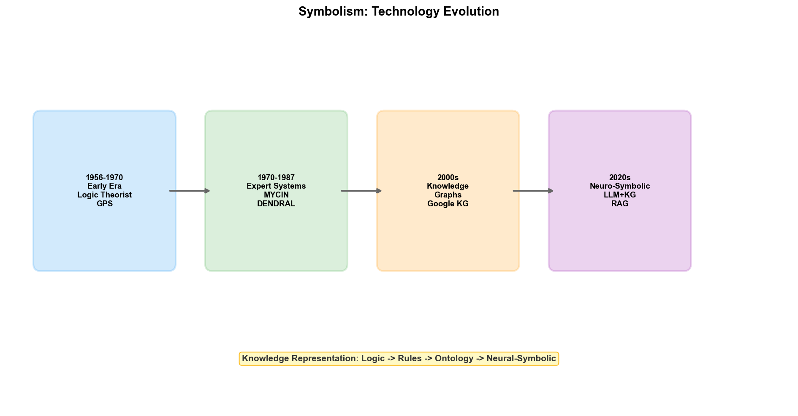

# Chapter 3: Symbolism — From Rules to Knowledge

## 3.1 Philosophical Roots: The Rationalist Tradition

The intellectual roots of Symbolism can be traced back to the seventeenth century. In his 1666 work *Dissertatio de Arte Combinatoria*, Leibniz proposed a grand vision: if human thought could be reduced to the combination and computation of symbols, then all rational disputes could be resolved through calculation — "Let us calculate" (Calculemus). He envisioned a universal formal language (characteristica universalis) and a corresponding reasoning calculus (calculus ratiocinator), so that disagreements between two philosophers would no longer require argumentation — they would simply sit down and calculate.

Leibniz's dream was entirely unachievable with the technology of the time, but this line of thought influenced the subsequent three hundred years of logic development. At the end of the nineteenth century, Gottlob Frege established the foundations of modern formal logic — predicate logic. Frege's goal was to use a mathematical symbolic language to precisely express the logical relationships in natural language, eliminating its ambiguity. His *Begriffsschrift* (1879) is regarded by later AI researchers as the technical starting point of Symbolism.

The core proposition of Symbolism can be summarized in a single sentence: **Thinking is symbol manipulation.** Knowledge is represented in symbolic form, reasoning proceeds through symbolic transformations, and intelligence is nothing more than the process of operating on strings of symbols according to rules. The philosophical foundation of this proposition is rationalism — the belief that true knowledge derives from rational reasoning rather than sensory experience, which stands in fundamental opposition to the empiricist tradition of Connectionism.

## 3.2 The Physical Symbol System Hypothesis

In 1976, Allen Newell and Herbert Simon (who had already received the 1975 Turing Award for AI research) published the "Physical Symbol System Hypothesis" (PSSH), providing a theoretical manifesto for Symbolism:

> "A physical symbol system has the necessary and sufficient means for producing intelligent action."

This hypothesis has two layers of meaning. Sufficiency: any system that can manipulate symbols can exhibit intelligent behavior. Necessity: any system that exhibits intelligent behavior — whether the human brain or a computer — must fundamentally be a symbol-manipulating system. If PSSH holds, then simulating intelligence on a computer faces no theoretical barriers; what remains is purely an engineering problem.

A physical symbol system comprises six basic elements:

- **Symbol**: A pattern representing an entity, concept, or relationship
- **Expression**: A combination of symbols
- **Memory**: The medium for storing expressions
- **Operators**: Processes for creating, modifying, copying, and destroying expressions
- **Interpretation**: Mapping expressions to real-world meanings
- **Search**: Finding a path to a goal among possible sequences of symbolic operations

This framework covers the structure of virtually all symbolic AI systems: the knowledge base of an expert system is stored expressions, the inference engine performs operations and search, and MYCIN's certainty factors are attributes attached to expressions.

Whether PSSH holds remains contested. In 1980, philosopher John Searle proposed the famous "Chinese Room" thought experiment to challenge PSSH's sufficiency: a person who does not understand Chinese sits in a closed room, transforming input Chinese symbols into output Chinese symbols according to a rule manual — to an outside observer, they appear to understand Chinese, but they are actually only manipulating symbols without understanding their meaning. Searle's argument points to a fundamental question: is symbol manipulation alone sufficient to produce genuine understanding, or does it merely simulate understanding?

This philosophical debate has limited impact on engineering practice. Regardless of whether symbol manipulation equates to "genuine intelligence," the practical utility of expert systems, knowledge graphs, and ontology in specific domains has been demonstrated. Symbolism does not need to resolve the question "what is genuine intelligence"; it only needs to answer "how to make machines exhibit professional-level reasoning capability in specific domains."

## 3.3 Technological Evolution

### Early: Logical Reasoning (1955–1965)

The earliest practice of Symbolism was Newell and Simon's Logic Theorist (1955). This program aimed to prove logical theorems from Alfred North Whitehead and Bertrand Russell's *Principia Mathematica*. The Logic Theorist used heuristic search to explore possible proof paths, successfully proving 33 of the first 38 theorems. It created several firsts in the history of technology: the first program to use heuristic search, the first to decompose problems into sub-problems, and the first "AI program."

The subsequent General Problem Solver (GPS, 1957) generalized the Logic Theorist's approach. GPS was not limited to mathematical proofs but used a unified "means-ends analysis" framework to handle various problems: comparing the difference between the current state and the goal state, searching for operators that could reduce the difference, and recursively applying them until the goal was achieved. GPS's limitation was that it could only operate within a formalized state space — the problem had to be precisely defined as sets of states and operators before execution, which inherently limited its generality.

### Middle: Expert Systems (1965–1990)

Expert systems represented Symbolism's most successful commercialization phase. Chapter 2 already introduced DENDRAL and MYCIN; here we focus on their technical architecture.

A classic expert system consists of three core components:

**Knowledge Base**: Stores domain knowledge, typically represented as "production rules" — "If condition A and condition B, then conclusion C (certainty factor 0.8)." MYCIN's 600 rules are a typical production knowledge base. The advantage of rules is readability — domain experts can directly review and modify rules without needing to understand the underlying inference engine.

**Inference Engine**: Software that performs reasoning over the knowledge base. Reasoning strategies are divided into forward chaining (starting from known facts, deriving new facts through rules) and backward chaining (starting from a goal, working backward to determine what conditions must be met). MYCIN used backward chaining: starting from the goal "whether the patient is infected with a certain bacterium," it progressively queried the information needed.

**Knowledge Acquisition Module**: Assists in converting domain experts' knowledge into rules in the knowledge base. This is typically an interactive process — knowledge engineers extract rules by interviewing experts and analyzing cases.

The technical legacy of expert systems is far-reaching. CLIPS (C Language Integrated Production System) is a general-purpose expert system shell developed by NASA in 1985, still maintained and used today. Jess (Java Expert System Shell) is a Java port of CLIPS. These tools allow developers to focus on building the knowledge base without implementing the inference engine from scratch.

### Mature: Knowledge Graphs and Ontology (1990–Present)

The core problem exposed by expert systems was knowledge representation — rules were too simple to express complex relationships and hierarchical structures between entities. In the 1990s, researchers explored several richer knowledge representation forms:

**Frames**: A knowledge representation method proposed by Marvin Minsky in 1974. A frame describes a concept and its attributes — for example, a "Tool" frame contains slots for "type," "location," "status," "last maintenance time," etc. Frames can inherit from one another (an "EUV Scanner" frame inherits all attributes of the "Tool" frame and adds its own specific attributes).

**Semantic Networks**: Graph structures using nodes for concepts and edges for relationships. For example, "Etching" →(is-a)→ "Dry Process" →(is-a)→ "Semiconductor Manufacturing." Semantic networks are intuitively easy to understand but lack formalized semantic definitions, making it difficult for semantic networks from different systems to interoperate.

**Description Logics**: To address the lack of formal semantics in semantic networks, researchers extracted a subset of first-order logic to form description logics. Description logics balance expressiveness and decidability of reasoning — rich enough to express complex concept relationships while guaranteeing that reasoning can be completed in finite time.

These knowledge representation forms converged in the 2000s into two industrial-grade technology directions: knowledge graphs and ontology.

**Knowledge Graphs**: In 2012, Google launched the Knowledge Graph, marking the transition from academic research to industrial application. Knowledge graphs use RDF (Resource Description Framework) triples (subject-predicate-object) to represent world knowledge — for example, (Samsung Fab, uses, Palantir Foundry). The advantage of knowledge graphs is that their graph structure naturally supports multi-hop reasoning — starting from "Samsung," through the edges "uses Palantir," "Palantir is based on Ontology," and "Ontology supports data fusion," one can infer implicit knowledge such as "Samsung Fab achieved data fusion through Ontology."

**Ontology**: Developed on the basis of description logics, Ontology uses OWL (Web Ontology Language) to define the concept hierarchy, property constraints, and reasoning rules of a domain. Unlike knowledge graphs, which focus on storing instance data, ontology focuses on defining the conceptual model of a domain — "what is a wafer," "what is a process step," "what is the relationship between a defect and a process step." Part VI will discuss Ontology applications in the fab in detail; here we need only understand that it is Symbolism's most mature technological form in industrial scenarios.

### Contemporary: Neuro-Symbolic Integration (2020–)

Symbolism and Connectionism were historically in long-standing opposition, but the recent trend is integration. Neuro-Symbolic AI attempts to combine the strengths of both: neural networks handle perception and pattern recognition (learning from data), while symbolic systems handle reasoning and explanation (making decisions based on rules).

Several typical integration paradigms include:

- **Neural-symbolic pipeline**: A neural network first classifies perceptual data (e.g., identifying wafer defect types), and the classification results are fed into a symbolic reasoning engine for subsequent reasoning (e.g., inferring root causes from defect types and process parameters)
- **Knowledge graph embedding**: Mapping entities and relationships in a knowledge graph into a low-dimensional vector space, allowing symbolic knowledge to be processed by neural networks. Models like TransE and RotatE map triples (head entity, relation, tail entity) into vector operations
- **Differentiable logic reasoning**: "Softening" the logic reasoning process into differentiable tensor operations, enabling the reasoning engine to be trained end-to-end via gradient descent
- **LLM + Knowledge Graph**: Large language models handle natural language understanding and generation, while knowledge graphs handle fact-checking and reasoning constraints — the LLM proposes hypotheses, and the knowledge graph verifies their correctness

Neuro-symbolic integration's significance for semiconductor wafer fabs is this: a deep learning model alone can identify defect patterns but cannot explain "why this defect leads to yield loss," and an expert system alone can reason about root causes but cannot identify defects from raw images. By fusing the two, the system can achieve an end-to-end closed loop of "identify defect → infer root cause → provide correction recommendation."



## 3.4 Current Technical Frameworks

### Knowledge Representation

| Technology | Description | Typical Application |
| --- | --- | --- |
| RDF | Triple (subject-predicate-object) resource description framework | Knowledge graph data storage |
| OWL | Ontology description language based on description logics | Domain ontology modeling |
| SHACL | Constraint validation language for RDF data | Data quality validation |
| Property Graph | Graph data model with property labels | Knowledge graphs in Neo4j |

RDF is the most basic knowledge representation format — each piece of knowledge is represented as a triple, such as `<wafer:W001, hasDefect, defect:D123>`. RDF data can be queried using the SPARQL query language, analogous to SQL for relational databases.

OWL adds rich expressive power on top of RDF — it can define class hierarchies ("Etcher is a subclass of Tool"), property constraints ("each wafer must belong to exactly one lot"), and reasoning rules ("if A is a subclass of B, and B belongs to C, then A also belongs to C"). OWL's reasoning capability is automatic — given an ontology definition and instance data, the inference engine can automatically derive implicit knowledge.

Property Graph is another graph data model where each node and edge can carry properties. Neo4j is the most well-known Property Graph database. Compared to RDF, Property Graph's query language Cypher is closer to natural language and offers higher development efficiency, but at the cost of some formal reasoning capability.

### Reasoning Engines

| Tool | Type | Characteristics |
| --- | --- | --- |
| Prolog | Logic programming language | Declarative programming, built-in backward chaining |
| Datalog | Query language | Restricted subset of Prolog, guarantees query termination |
| SPARQL | RDF query language | Standardized graph query language |
| Pellet / HermiT | OWL reasoner | Supports description logic reasoning |

Prolog is perhaps the most widely known symbolic reasoning tool. Expressing knowledge in Prolog is very intuitive:

```prolog
% Knowledge base
defect_type(crack, physical).
defect_type(particle, contamination).
causes(crack, high_stress).
causes(particle, dirty_chamber).

% Rules
root_cause(Defect, Cause) :- defect_type(Defect, Type), causes(Defect, Cause).
requires_action(Defect, clean_chamber) :- defect_type(Defect, contamination).
requires_action(Defect, adjust_recipe) :- defect_type(Defect, physical).
```

This Prolog code defines the association rules between defect types and root causes. The query `?- root_cause(particle, C).` returns `C = dirty_chamber`, and the query `?- requires_action(crack, A).` returns `A = adjust_recipe`.

### Knowledge Graph Platforms

| Platform | Characteristics | Applicable Scenarios |
| --- | --- | --- |
| Neo4j | Most mature graph database, Cypher query language | Small-to-medium knowledge graphs, rapid prototyping |
| Amazon Neptune | Cloud-native graph database, supports RDF and Property Graph | Cloud deployment, AWS ecosystem integration |
| Stardog | Supports OWL reasoning and virtual graphs | Enterprise scenarios requiring formal reasoning |
| Palantir Foundry | Ontology-centric data platform | Cross-system data fusion (see Part VI) |

Neo4j is the most commonly used knowledge graph platform. Its query language Cypher expresses graph queries using pattern matching:

```cypher
// Find all process steps and equipment associated with a given defect
MATCH (d:Defect {id: 'D123'})-[:OCCURS_AT]->(s:ProcessStep)
      (s)-[:USES_TOOL]->(t:Tool)
RETURN d, s, t
```

This query finds which process step defect D123 occurred at and which tool that step used — this kind of multi-hop association query requires multiple table JOINs in a relational database, but only a single pattern match in a graph database.

## 3.5 Strengths and Limitations

### Strengths

**Interpretability** is Symbolism's greatest advantage. Each reasoning step can be traced back to a specific rule — "because the defect type is particle (Rule R1), and particle belongs to the contamination class (Rule R2), and contamination-class defects require chamber cleaning (Rule R3), therefore a chamber cleaning is recommended." This transparent reasoning chain is crucial in industrial scenarios — engineers need to understand the reasoning behind AI's recommendations before they can trust and act on them.

**Knowledge reuse.** Once a domain ontology or knowledge graph is built, it can be shared across multiple applications. The fab's process knowledge graph can be used simultaneously by defect analysis systems, equipment maintenance systems, and yield management systems, avoiding the redundancy of each application maintaining its own knowledge base.

**Deterministic reasoning.** Given the same knowledge base and input, a symbolic reasoning engine always produces the same output. This contrasts with the probabilistic outputs of neural networks — in scenarios requiring determinism, such as process parameter adjustments, predictable behavior is more easily accepted by engineers.

**Explicit encoding of domain knowledge.** Symbolism does not rely on large amounts of data to "discover" knowledge — it directly encodes the existing knowledge of human experts. During the New Product Introduction (NPI) phase, when historical data may be insufficient, engineers' process experience can be encoded into the system through rules and ontologies.

### Limitations

**The knowledge acquisition bottleneck** is Symbolism's most fundamental challenge. Converting domain experts' knowledge into machine-processable form requires enormous human effort — MYCIN's 600 rules took knowledge engineers and medical experts years to build. In a semiconductor fab, a senior engineer's process experience may involve thousands of parameters and their complex interactions. Building a knowledge base entirely through manual encoding is practically infeasible.

**Brittleness.** Symbolic systems only "know" what is explicitly encoded in the knowledge base. When encountering uncovered situations, the system does not say "I'm not sure" but either falls silent or gives incorrect answers based on incomplete information. This is dangerous in a fab — a process parameter recommendation based on incomplete rules could lead to the scrapping of an entire wafer batch.

**Inability to handle perception.** Symbolism is inherently unsuited for processing continuous perceptual data such as images, audio, and time-series signals. The visual features of wafer defects, the vibration waveforms of equipment sensors — these data must first be converted into symbols by human experts or machine learning models before they can enter the symbolic reasoning pipeline.

**Scalability.** As the knowledge base grows, the search space for reasoning expands exponentially. An expert system with tens of thousands of rules may require exponential time for inference. Although description logics guarantee decidability of reasoning by limiting expressiveness, performance bottlenecks persist in practical applications.

### Pathways to Overcome Limitations

These limitations are not insurmountable. Neuro-symbolic integration provides one path: neural networks extract symbols from perceptual data (e.g., identifying defect types from wafer images), while symbolic systems reason and explain based on these symbols. Knowledge graph embedding techniques allow symbolic knowledge to be incorporated into neural network training. The advent of LLMs provides a new tool for knowledge acquisition — large language models can automatically extract entities and relationships from unstructured documents, assisting knowledge graph construction.

In semiconductor wafer fabs, Symbolism's value proposition is clear: it is not for defect detection or parameter prediction (which Connectionism excels at), but for knowledge organization, root cause reasoning, and cross-system data fusion. When data across hundreds of heterogeneous systems needs to be uniformly understood, when process specifications need to be encoded in machine-readable form, and when defect root cause analysis requires correlation reasoning across multiple process steps — the knowledge representation and reasoning frameworks provided by Symbolism are indispensable infrastructure.

This is precisely the technical underpinning of how Palantir's Ontology functions in Samsung's fab, which we will elaborate in Part VI.
