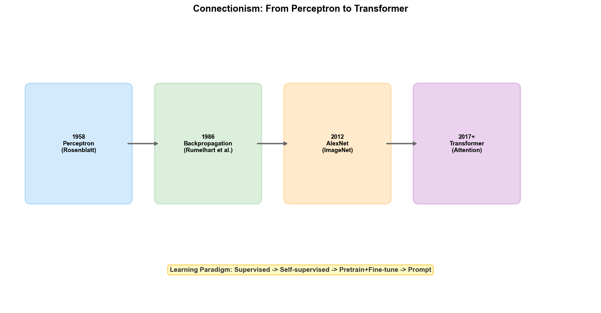

# Chapter 4: Connectionism — From Perceptrons to Deep Learning

## 4.1 Philosophical Roots: Empiricism and Brain Science

In 1943, neurophysiologist Warren McCulloch and mathematician Walter Pitts published a paper titled "A Logical Calculus of the Ideas Immanent in Nervous Activity." They proved a seemingly simple proposition: if a neuron is modeled as a binary switch — "firing" (output 1) when the weighted sum of inputs exceeds a threshold, and "silent" (output 0) otherwise — then a network composed of enough such neurons could express any logical function.

This paper simultaneously connected two worlds. At the biological level, it provided a simplified model of brain information processing. At the mathematical level, it proved that neural networks possess universal computational capability. The McCulloch-Pitts neuron model, though extremely simplified — real biological neurons are far more complex — established the fundamental paradigm of Connectionism: **intelligence arises from connections among large numbers of simple units**.

In 1949, Canadian psychologist Donald Hebb published *The Organization of Behavior*, proposing a principle later known as "Hebb's learning rule":

> "When two neurons fire simultaneously, the connection between them is strengthened."

This was later summarized as "cells that fire together, wire together." Hebb's learning rule is the ancestor of all unsupervised learning algorithms — it describes how neural networks can learn structure purely through the co-activation of internal neurons, without external labels.

The philosophical foundation of Connectionism is empiricism: knowledge is not innately embedded in rules (as Symbolism holds), but is learned from experiential data. The brain is not a reasoning engine preloaded with rules, but an adaptive system that adjusts synaptic connection weights to adapt to its environment. This stance stands in direct opposition to Symbolism's rationalist tradition.

## 4.2 Core Ideas

The core ideas of Connectionism can be decomposed into three levels.

### Distributed Representation

In Symbolism, a concept corresponds to a symbol — "Defect Type A" is a discrete label. In Connectionism, a concept is represented jointly by the activity pattern of multiple neurons — "Defect Type A" might be a vector of activation values across 100 neurons in a certain layer of the network, such as `[0.8, 0.1, 0.6, ..., 0.3]`.

The advantage of distributed representation is generalization capability. Two similar concepts are close together in vector space, so a network that has learned to recognize "crack defects" can partially transfer to recognizing "scratch defects" — because the two have representation vectors with many overlapping dimensions in high-dimensional space. In a symbolic system, "crack" and "scratch" are entirely different symbols, with no natural similarity measure between them.

### Learning from Data

Connectionism does not require humans to pre-encode knowledge. Neural networks learn by optimizing connection weights to minimize prediction error — this process is "learning." Given input-output pairs (training data), the network automatically adjusts its internal parameters through the backpropagation algorithm, making the predicted output gradually approximate the true output.

This means Connectionist systems can automatically extract patterns from massive historical data without humans writing rules one by one. In the fab scenario, this is critically important: a deep learning model can automatically learn the visual features distinguishing hundreds of defect types from millions of defect images, whereas using Symbolist rules to describe the visual features of "what is a crack" is virtually impossible.

### Emergent Abilities

When neural networks are sufficiently large and training data is sufficiently rich, capabilities emerge that were never explicitly taught during training. GPT-3 only saw the task of "predict the next word given the preceding text" during training, yet it learned translation across dozens of languages, code generation in multiple programming languages, and simple mathematical reasoning — none of these abilities were explicitly defined in the training objective.

Emergent abilities are Connectionism's most exciting and most disconcerting property. Exciting because it suggests that scale itself may be a kind of breakthrough — larger models may unlock capabilities we have not yet foreseen. Disconcerting because we cannot precisely predict what abilities will emerge at a given scale, nor can we fully explain how these abilities arise.

## 4.3 Technological Evolution

### The Perceptron Era (1958–1969)

In 1958, Frank Rosenblatt invented the Perceptron at the Cornell Aeronautical Laboratory. The Perceptron was a single-layer neural network that used a threshold activation function to perform binary classification on the weighted sum of inputs. Rosenblatt simulated a perceptron with 400 photoreceptors on an IBM 704 computer, training it to distinguish images labeled "left" and "right."

*The New York Times* wrote in 1958: "[The Perceptron] is the embryo of a computer that the Navy expects to be able to walk, talk, see, write, reproduce itself, and be aware of its existence." This optimism was reminiscent of the AI fervor following the Dartmouth Conference.

In 1960, Bernard Widrow and Ted Hoff invented ADALINE (Adaptive Linear Neuron), using a linear activation function and the LMS (Least Mean Squares) learning algorithm. A key improvement in ADALINE was the introduction of a continuously differentiable loss function — enabling direct application of gradient descent. Widrow and Hoff's LMS algorithm remains the foundation of signal processing and adaptive filtering today.

In 1969, Marvin Minsky and Seymour Papert published *Perceptrons*, a rigorous mathematical analysis of single-layer perceptron capabilities. The book proved a fatal limitation: single-layer perceptrons cannot learn the XOR (exclusive OR) function — they cannot classify linearly inseparable data. The XOR problem appears simple (only four input combinations), but it proves the fundamental limitation of single-layer networks.

Whether Minsky and Papert's critique caused the "winter" of Connectionism is debated among AI historians. But the fact is: from 1969 to 1986, neural network research nearly stagnated. Although multi-layer networks could theoretically solve the XOR problem (by adding a hidden layer), there was no effective method for training multi-layer networks at the time.

### Backpropagation and Multi-Layer Networks (1986–2006)

In 1986, Rumelhart, Hinton, and Williams published a systematic description of the backpropagation algorithm in *Nature*. Backpropagation uses the chain rule to propagate errors from the output end back through each layer to the input, computing each weight's contribution to the error (gradient), and then adjusting weights via gradient descent. This algorithm made training multi-layer neural networks possible — multi-layer networks can learn arbitrarily complex nonlinear mappings, including XOR.

The rediscovery of backpropagation triggered a brief revival of Connectionism. In 1989, Yann LeCun at Bell Labs developed LeNet — a convolutional neural network for handwritten postal code recognition. LeNet achieved practical recognition accuracy in the U.S. postal system, becoming the first deep learning system successfully deployed in an industrial scenario.

LeNet's core innovation was the convolutional layer — through local receptive fields and weight sharing, it dramatically reduced the number of parameters, enabling the network to efficiently process image data. The essence of the convolution operation is "sliding a small feature detector across the image" — which biologically corresponds to the working of simple cells in the visual cortex.

In 1997, Sepp Hochreiter and Jürgen Schmidhuber published the Long Short-Term Memory (LSTM) network. LSTM solved the gradient vanishing problem of standard RNNs when processing long sequences — by introducing gating mechanisms (input gate, forget gate, output gate), LSTM can selectively retain or forget information, maintaining effective gradients even after hundreds of time steps. LSTM later achieved breakthrough results in speech recognition, machine translation, and other sequence tasks.

But during this period, Connectionism remained a marginal school within AI. SVM, random forests, and other statistical learning methods performed better and were easier to train on most tasks. Neural networks required large amounts of labeled data and powerful computing — both of which were extremely scarce at the time. Hinton's research group at the University of Toronto was virtually the last stronghold persisting in deep learning research.

### The Deep Learning Revolution (2006–2017)

In 2006, Hinton published a paper on Deep Belief Networks (DBN). DBNs initialized network weights through layer-wise unsupervised pre-training, followed by supervised fine-tuning. This "pre-training–fine-tuning" strategy addressed the difficulty of training deep networks from random initialization. More importantly, this paper redefined the term "Deep Learning" — previously people said "neural networks" or "multi-layer perceptrons"; Hinton made "deep" a technically meaningful word: networks with enough layers.

2012 was the most pivotal year in Connectionism's history. AlexNet crushed the competition at the ImageNet challenge, achieving 15.3% error rate versus the runner-up's 26.2% — a lead of over 10 percentage points. The success factors of AlexNet were discussed in Chapter 2 (data, computing power, ReLU activation function); here we focus on its industry impact.

After AlexNet, deep learning research and applications entered an explosive period. New architectures and methods appeared every year:

In 2014, Ian Goodfellow proposed Generative Adversarial Networks (GAN). A GAN consists of two networks — a generator and a discriminator — the generator tries to produce realistic fake data, and the discriminator tries to distinguish real from fake. The two networks co-evolve through adversarial training, and eventually the generator can produce photorealistic images. GANs were later used for data augmentation — in semiconductor manufacturing, when samples of a particular defect type are insufficient, GANs can generate synthetic defect images to supplement the training set.

In 2015, Kaiming He et al. proposed Residual Networks (ResNet). ResNet introduced "skip connections" — directly adding the input to the output several layers later, enabling gradients to propagate directly to shallow layers through the skip path. This seemingly simple modification solved the gradient vanishing problem in ultra-deep networks (hundreds of layers). ResNet could be trained to 152 layers or deeper, achieving 3.57% error rate on ImageNet — for the first time surpassing human-level performance (approximately 5%).

### The Transformer Era (2017–Present)

In 2017, Google's Ashish Vaswani et al. proposed the Transformer architecture in the paper "Attention is All You Need." Transformer completely abandoned RNN's recurrent structure and CNN's convolution operations, relying solely on the self-attention mechanism to model relationships between elements in a sequence.

The core idea of self-attention can be summarized in one sentence: each position in the sequence "looks" at all other positions, allocates attention weights based on relevance, and then aggregates a weighted sum over all positions. This global perspective frees Transformer from sequence length limitations — RNN must process sequences step by step, with information transmission becoming increasingly difficult between distant elements; in Transformer, the "distance" between any two positions is 1.

Transformer's impact extends far beyond natural language processing. Its variants have been applied to virtually all sequence modeling tasks:

- **Vision Transformer (ViT)**: Divides images into patches, processing image patches like word sequences, achieving performance comparable to or better than CNN on image classification tasks
- **Time-Series Transformer**: Applies attention mechanisms to time-series forecasting, suitable for equipment sensor data analysis
- **Graph Transformer**: Extends attention to graph-structured data, usable for reasoning over knowledge graphs

In 2018, Google released BERT (Bidirectional Encoder Representations from Transformers), pre-trained through masked language modeling — randomly masking some words in the input and having the model predict the masked words based on context. BERT set new records on eleven natural language understanding tasks.

OpenAI chose a different direction — the Decoder-only architecture. The GPT series was pre-trained through the autoregressive task of "predicting the next word given the preceding text." When the model scale and data volume grew large enough (GPT-3's 175 billion parameters), this simple prediction task gave rise to the aforementioned emergent abilities.

## 4.4 Current Technical Frameworks

### CNN (Convolutional Neural Network)

The core components of CNN include convolutional layers (using learnable convolutional kernels to extract local features), pooling layers (reducing spatial resolution and providing translation invariance), and fully connected layers (mapping features to the output space).

Classical CNN architecture evolution:

| Architecture | Year | Key Innovation | Parameters |
| --- | --- | --- | --- |
| LeNet-5 | 1998 | First practical CNN | 60K |
| AlexNet | 2012 | ReLU + Dropout + GPU training | 60M |
| VGG-16 | 2014 | Uniform 3x3 kernels, deep stacking | 138M |
| ResNet-152 | 2015 | Skip connections, breaking depth limits | 60M |
| EfficientNet | 2019 | Compound scaling, efficiency optimization | 5M-66M |

In semiconductor manufacturing, CNN's most direct application is defect detection — the visual features of wafer defects (cracks, particles, scratches, corrosion) are naturally suited for extraction by convolution operations. Traditional Automated Defect Classification (ADC) systems rely on handcrafted features (such as defect area, circularity, contrast), while CNN can learn feature representations end-to-end from raw images, achieving significantly higher accuracy than traditional methods on complex defect patterns.

### RNN/LSTM/GRU

Recurrent Neural Networks (RNN) process variable-length sequences by sharing parameters across time steps and passing hidden states. But standard RNNs suffer from gradient vanishing/explosion on long sequences.

LSTM solved this problem through three gating mechanisms:

- **Forget gate**: Decides what information to discard from memory
- **Input gate**: Decides what new information to write to memory
- **Output gate**: Decides what to output based on current memory

GRU (Gated Recurrent Unit) is a simplified version of LSTM, merging the forget and input gates into an update gate, with fewer parameters and faster training, achieving performance comparable to LSTM on many tasks.

In semiconductor manufacturing, the most natural application of LSTM/GRU is time-series analysis of equipment sensor data. An etcher continuously generates time-series data including temperature, pressure, RF power, and gas flow during operation. LSTM can learn the normal fluctuation patterns of these parameters, triggering anomaly warnings when a parameter sequence deviates from normal patterns. This time-series pattern–based predictive maintenance is more sensitive than traditional threshold alarms — threshold alarms only sound when a parameter exceeds limits, while LSTM can issue warnings when parameter trends become abnormal but have not yet crossed limits.

### Transformer and Attention

The Transformer architecture has three variants depending on the task:

- **Encoder-only (BERT family)**: Suited for understanding tasks — classification, sequence labeling, similarity computation
- **Decoder-only (GPT family)**: Suited for generation tasks — text generation, dialogue, code completion
- **Encoder-Decoder (T5, BART family)**: Suited for sequence-to-sequence tasks — translation, summarization

The computational complexity of the self-attention mechanism is $O(n^2)$ (where n is the sequence length), which limits Transformer's ability to handle ultra-long sequences. Subsequent improvements such as Linformer, Longformer, and FlashAttention have reduced the computational overhead of attention from different angles.

In semiconductor scenarios, Transformer's potential is mainly reflected in two directions. First, multimodal fusion — unifying wafer images (vision), sensor time-series data (temporal), process parameters (tabular), and text reports (language) as sequences input to Transformer, enabling multimodal joint analysis. Second, serving as the foundational architecture for LLMs, supporting intelligent Q&A and report generation applications in the fab (detailed in Chapter 14).

### Pre-training–Fine-tuning Paradigm

The engineering paradigm of contemporary Connectionism can be summarized as "Pre-training + Fine-tuning":

1. **Pre-training**: Training large-scale models on massive unlabeled data to learn general feature representations or language capabilities
2. **Fine-tuning**: Adjusting model parameters on small amounts of labeled data for specific tasks, adapting the model to specific applications

This paradigm faces unique challenges in semiconductor manufacturing. Pre-training typically uses public datasets (ImageNet, Common Crawl, etc.), whose data distribution differs vastly from the fab's process data. A CNN pre-trained on ImageNet can be directly fine-tuned for wafer defect detection — because low-level visual features (edges, textures, shapes) are universal. But an LLM pre-trained on general text requires significant domain adaptation to understand process specifications and defect analysis reports.

Technical pathways to address this include:

- **Domain pre-training**: Continuing pre-training on semiconductor-related literature and process documents to inject domain knowledge
- **RAG (Retrieval-Augmented Generation)**: Not modifying model parameters, but using fab documents as an external knowledge base; the LLM retrieves relevant documents as context when generating responses
- **Parameter-Efficient Fine-tuning (PEFT)**: Such as LoRA, training only a small number of adapter parameters to avoid overfitting from full fine-tuning on small amounts of labeled data

## 4.5 Strengths and Limitations

### Strengths

**Pattern recognition capability.** Connectionism is unmatched in extracting patterns from high-dimensional data. Whether it is defect features in images, anomaly patterns in time-series signals, or semantic relationships in text, deep learning models can automatically learn feature representations without manual design.

**End-to-end learning.** Traditional machine learning requires decomposing problems into feature engineering, model training, post-processing, and other stages, each requiring independent expert knowledge. Deep learning can model the entire mapping from raw input to final output with a single network — input a wafer image, directly output defect type and location, without intermediate manual feature extraction steps.

**Generalization and transfer.** General features learned by pre-trained models can transfer to different but related tasks. A defect classification model trained on wafer map A can adapt to wafer map B's defect patterns with minimal fine-tuning on a few samples — invaluable during the NPI phase when rapid adaptation to new process nodes is needed.

**Continuous improvement.** Neural networks continue to improve performance as data accumulates — the more training data, the more accurate the model. This data flywheel effect means fabs that deploy AI first can continuously accumulate data advantages.

### Limitations

**Black-box nature.** The decision-making process of deep learning models is opaque — it gives the judgment "this defect is a crack" but does not explain "which image features led to the judgment." Explainable AI (XAI) techniques like Grad-CAM and SHAP can partially reveal the regions and features the model focuses on, but are far from the transparency of symbolic reasoning. In fabs, engineers need to understand the AI's reasoning logic before they can trust and execute its recommendations — "the system says there's a problem with this batch of wafers" is insufficient; engineers need to know "why there's a problem and where the problem lies."

**Data dependency.** Deep learning models require large amounts of labeled data for training. In fabs, labeled data is extremely expensive — each defect image requires manual classification by experienced engineers, and the number of samples for rare defect types may be insufficient to train reliable models. Few-shot learning and data augmentation techniques can mitigate this problem but cannot fully eliminate data dependency.

**Distribution shift.** When the distribution of training data and actual deployment data diverges, model performance can degrade sharply. After a fab upgrades from 5nm to 3nm, the originally trained defect detection model may no longer apply — because 3nm defect patterns differ significantly from 5nm. The model needs to be retrained or fine-tuned on data from the new node, a process requiring time and data accumulation.

**Adversarial vulnerability.** Deep learning models are extremely sensitive to small perturbations in input — adding visually imperceptible noise to a wafer image could cause the model to misclassify a normal wafer as defective. In safety-critical manufacturing scenarios, this vulnerability needs to be mitigated through adversarial training and other means.

**Computational cost.** Training large deep learning models requires significant GPU computing power. Samsung's AI Megafactory reportedly uses approximately 50,000 GPUs — a scale of computing investment that is unaffordable for most fabs. Even at the inference stage, real-time defect detection requires deploying GPU servers on the production line, increasing infrastructure costs.

### Complementarity with Symbolism

The limitations of Connectionism happen to be the strengths of Symbolism, and vice versa. Connectionism excels at perception and pattern recognition but lacks interpretability; Symbolism excels at reasoning and explanation but cannot handle perceptual data. In practical applications in semiconductor fabs, the two often need to be used in combination — Connectionist models extract information from raw data (identifying defect types), while symbolic systems reason based on that information (inferring root causes and corrective actions from defect types). The intersection of Chapter 4 and Chapter 3 will unfold in the specific applications of Part IV.
