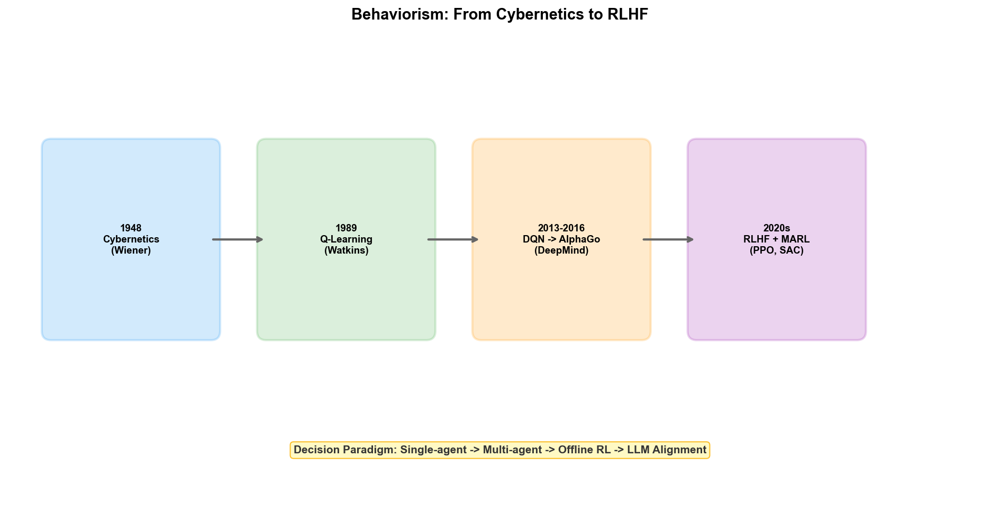

# Chapter 5: Behaviorism — From Cybernetics to Reinforcement Learning

## 5.1 Philosophical Roots: Cybernetics and Evolutionary Theory

In 1948, MIT mathematician Norbert Wiener published *Cybernetics: Or Control and Communication in the Animal and the Machine*. The term "cybernetics" derives from the Greek word *kybernetes* — "helmsman." Wiener used this term to encapsulate a universal principle: **achieving goal-directed behavior through feedback**.

Wiener's cybernetics was inspired by the problem of automatic aiming of anti-aircraft guns during World War II. The guns needed to predict the future position of aircraft to aim ahead, and Wiener designed a statistical prediction-based filter to achieve this. In the process, he realized that the prediction-action-feedback closed loop existed not only in engineering systems but was also the fundamental mechanism by which organisms adapt to their environments — organisms perceive the environment, take actions, receive feedback, and adjust future behavior accordingly.

Developing in parallel with cybernetics was the behaviorist school in psychology. B.F. Skinner proposed the theory of operant conditioning in the 1930s: the frequency of a behavior is determined by its consequences — behaviors that bring rewards increase, and behaviors that bring punishment decrease. Skinner's "Skinner box" experiments demonstrated this principle: a rat in a box that accidentally pressed a lever and received food would increasingly frequently press the lever.

Cybernetics and behaviorism together constitute the philosophical foundation of behaviorist AI: **intelligence is neither embedded rules (contra Symbolism) nor pre-trained connection weights (complementing Connectionism), but a behavioral strategy that continuously evolves through continuous interaction with the environment via feedback**.

This perspective is highly consistent with evolutionary theory — biological intelligence was not designed but evolved through variation, selection, and heredity in the environment. Behaviorist AI inherits this line of thought: rather than trying to define "what is a good decision" internally, let the agent trial-and-error in the environment and discover effective behavioral strategies through environmental feedback.

## 5.2 Core Ideas

Behaviorist AI can be summarized in a loop: **Perceive the environment → Select an action → Receive feedback → Update the policy**.

### The Perception-Action Loop

Unlike Symbolism's "reasoning" and Connectionism's "forward propagation," a behaviorist agent is always in a closed loop. It does not process input once and output a result; rather, it continuously perceives, decides, acts, and adapts along the temporal dimension. A scheduling agent running in a fab does not "compute" the optimal schedule at a particular moment; it continuously monitors state changes during production, makes scheduling decisions, observes results, and adjusts future scheduling strategies accordingly.

### Reward-Driven Learning

Behaviorism uses "reward" as the sole signal for learning. The agent does not need to be told "what is correct" — it only needs to know "how good is the current state." Through continuous trial-and-error, the agent learns what actions to take in different states to maximize long-term cumulative reward.

The reward-driven learning paradigm has a profound advantage: it does not require labeled data. Symbolism requires humans to encode rules, Connectionism requires input-output pairs for training, and Behaviorism only needs a reward function to evaluate the quality of actions. In semiconductor manufacturing, "yield" itself is a natural reward signal — the agent does not need to be told "increase RF power to 300W"; it only needs to know "what is the wafer yield under the current process parameters," and then it explores the parameter combinations that improve yield on its own.

### Trial-and-Error and Exploration

The core mechanism of Behaviorism is trial-and-error. The agent tries different actions in the environment; some bring high rewards (reinforced), others bring low rewards (suppressed). Through extensive trial-and-error, the agent gradually converges to the optimal policy.

Trial-and-error learning faces a fundamental dilemma — the "Exploration vs. Exploitation" trade-off. Should the agent exploit known high-reward actions (exploitation), or try unknown actions to discover potentially better strategies (exploration)? In the fab scenario, this dilemma is real: use the known optimal process parameters for production (exploitation) or try new parameters to discover better process windows (exploration)? The former is safe but may miss improvement opportunities; the latter may yield breakthroughs but may also cause yield drops.

## 5.3 Technological Evolution

### The Cybernetics Era (1948–1980s)

Wiener's cybernetics directly influenced a technical field: automatic control. The PID controller (Proportional-Integral-Derivative controller) is the fundamental tool of industrial control — it maintains system output near a target value through feedback. R2R (Run-to-Run) control in semiconductor manufacturing is essentially a form of feedback control: adjusting the next batch's process parameters based on the measurement results of the previous batch to compensate for process drift.

In 1954, W. Ross Ashby published *Design for a Brain*, proposing the concept of "ultrastable systems" — systems that can spontaneously adapt to their environment through trial-and-error. Ashby built a "homeostat" device to demonstrate this principle: when external perturbation changed the system's equilibrium state, the system would automatically adjust internal parameters until it reached stability again. This is regarded by some scholars as the first instance of a "learning machine."

### The Birth of Reinforcement Learning (1980s–1990s)

In 1989, Christopher Watkins at the University of Cambridge proposed the Q-Learning algorithm in his doctoral dissertation. Q-Learning is one of the most fundamental and important algorithms in reinforcement learning.

The core idea of Q-Learning is to learn a "Q function" $Q(s, a)$, representing the expected long-term cumulative reward obtainable after taking action $a$ in state $s$. The Q function is iteratively updated through the Bellman equation:

$$Q(s, a) \leftarrow Q(s, a) + \alpha [r + \gamma \max_{a'} Q(s', a') - Q(s, a)]$$

Where $r$ is the immediate reward, $s'$ is the new state after the action, $\gamma$ is the discount factor (controlling the importance placed on future rewards), and $\alpha$ is the learning rate.

Once the Q function is sufficiently learned, the optimal policy is simply to choose the action with the highest Q value: $\pi(s) = \arg\max_a Q(s, a)$.

In 1992, Gerald Tesauro at IBM developed TD-Gammon — a program that learned backgammon through self-play. TD-Gammon used Temporal Difference learning (TD-Learning, a variant of Q-Learning), and after 1.5 million self-play games, it reached world-champion level. TD-Gammon was the first case of reinforcement learning achieving expert-level performance on a large-scale complex task.

### Deep Reinforcement Learning (2013–Present)

Q-Learning is effective when the state space is small, but when the state space is enormous (such as board game states, image inputs), maintaining a tabular Q function becomes infeasible. The breakthrough of deep learning provided reinforcement learning with a new tool: using neural networks to approximate the Q function.

In 2013, DeepMind's Volodymyr Mnih et al. published the DQN (Deep Q-Network) paper, combining CNN with Q-Learning. DQN used a convolutional neural network to extract features from raw game screens and output Q values for each possible action. Across 49 Atari games, DQN achieved human-expert-level performance or higher on 29.

Key innovations of DQN include:

- **Experience Replay**: Storing interaction data in a replay buffer and randomly sampling mini-batches for training, breaking the temporal correlation between consecutive samples
- **Target Network**: Using a delayed-updated network to compute target Q values, improving training stability

In 2016, DeepMind's AlphaGo defeated Lee Sedol 4-1 in Seoul. AlphaGo's technical architecture was a deep fusion of Connectionism and Behaviorism: deep neural networks were used for policy evaluation (the policy network determines where to place the next move in the current position) and position evaluation (the value network estimates the win probability of the current position), while Monte Carlo Tree Search was used to explore the search space. AlphaGo first learned through supervised learning to imitate human expert game records, then continuously improved through self-play reinforcement learning.

The 2017 AlphaZero went a step further — completely abandoning human game records and learning from scratch (the meaning of "Zero") through self-play. AlphaZero simultaneously mastered chess, shogi, and Go, surpassing the strongest AIs in all games. AlphaZero's success proved a profound point: when the environment has clear win/loss rules, reinforcement learning can discover strategies surpassing human levels without any human prior knowledge.

The 2019 MuZero further freed itself from dependence on an environment rules model. AlphaZero needed to know the rules of the game (such as legal Go moves); MuZero does not — it learns the environment's internal model to predict state transitions, enabling the same algorithm to be applied to tasks without known rule models.

### Toward Practical Application (2020–Present)

Pure online reinforcement learning (agents trial-and-error in the real environment) is difficult to apply directly in industrial scenarios — using trial-and-error to explore process parameters in a fab means potentially scrapping entire batches of wafers. Therefore, recent research has shifted toward more practical directions:

**Offline RL**: Learning only from historical data, without actual interaction with the environment. The agent learns optimal policies from already collected interaction records (such as process logs, parameter adjustment records, and corresponding yield results) rather than trial-and-error in the real environment. This enables reinforcement learning to leverage existing data without disrupting production.

**Decision Transformer**: Recasting reinforcement learning as a sequence modeling problem[102]. State-action-reward triples are input as sequences to a Transformer, and the model learns to generate action sequences given a target return. This approach can directly leverage the pre-training capabilities of LLMs.

**Model-Based RL**: First learning the environment's dynamics model (given the current state and action, predict the next state and reward), then planning and optimizing on the learned model. In fabs, a digital twin of the process can first be constructed, and reinforcement learning exploration and training can be conducted on the digital twin before deploying the learned policy to the real production line.

## 5.4 Current Technical Frameworks

Reinforcement learning algorithms can be divided into three major categories based on what they learn.

### Value-Based Methods

Value-based methods learn the state-action value function $Q(s,a)$ and then derive the policy from it. DQN and its improvements are representative of this category:

| Algorithm | Key Improvement |
| --- | --- |
| DQN | CNN + Q-Learning + Experience Replay + Target Network |
| Double DQN | Addresses Q-value overestimation |
| Dueling DQN | Separates state value and action advantage modeling |
| Rainbow | Combines multiple DQN improvements |
| Conservative Q-Learning (CQL)[101] | Offline RL, prevents overestimation of out-of-distribution actions |

### Policy-Based Methods

Policy-based methods directly parameterize the policy $\pi_\theta(a|s)$ and maximize expected return through gradient ascent. REINFORCE is the most basic policy gradient algorithm, but it has high variance and unstable training. Subsequent improvements include:

| Algorithm | Key Improvement |
| --- | --- |
| TRPO | Trust region constraint, ensuring controllable policy update magnitude |
| PPO | Clipped objective function, simplified version of TRPO, most widely used in industry |
| SAC | Maximum entropy reinforcement learning, encourages exploration |

PPO (Proximal Policy Optimization) is currently the most widely used reinforcement learning algorithm in industry. OpenAI used PPO in training robotic hands to solve Rubik's cubes and training humanoid robots to walk. PPO's appeal lies in its balance of training stability and sample efficiency — by constraining the magnitude of policy updates, it avoids the problem of "learning too fast and collapsing."

### Actor-Critic Methods

Actor-Critic combines the advantages of value-based and policy-based methods: the Actor (policy network) selects actions, and the Critic (value network) evaluates how good the Actor's choices are. The Critic's evaluation signal guides the Actor's improvement direction, and the Actor's action data provides training samples for the Critic.

| Algorithm | Characteristics |
| --- | --- |
| A2C / A3C | Synchronous/asynchronous Actor-Critic; A3C accelerates training through multiple parallel environments |
| DDPG | Actor-Critic for continuous action spaces |
| TD3 | Improvement on DDPG, addresses Q-value overestimation and variance |
| SAC | Maximum entropy framework, adaptively balances exploitation and exploration |

### Multi-Agent Reinforcement Learning (MARL)

When multiple agents interact in the same environment, the problem becomes complex — each agent's optimal policy depends on other agents' policies, forming a game-theoretic relationship. Multi-Agent Reinforcement Learning (MARL) studies learning and coordination in multi-agent scenarios.

MARL has natural application scenarios in semiconductor wafer fabs. A fab has hundreds of pieces of equipment and multiple process steps running in parallel; each equipment or process segment can be viewed as an agent. The objectives of PID, MFG, and PE/EE departments sometimes conflict (e.g., manufacturing wants to maximize capacity, while process wants to optimize quality). Multi-agent systems need to learn to find balance among these competing objectives.

Major MARL frameworks include:

- **Independent Q-Learning (IQL)**: Each agent learns independently, ignoring other agents' existence. Simple but potentially unstable
- **MAPPO**: Multi-agent extension of PPO, centralized training, decentralized execution
- **QMIX**: Models joint Q values using a mixing network, assuming monotonic contributions from agents

## 5.5 Strengths and Limitations

### Strengths

**Sequential decision optimization.** Reinforcement learning is naturally suited for tasks that require multiple decisions to reach a goal. Process parameter optimization is not a one-time adjustment — adjusting one parameter affects the process results of dozens of subsequent steps, requiring planning the optimal adjustment sequence along the temporal dimension. Reinforcement learning's discounted cumulative reward mechanism enables it to balance "reward at the current step" against "reward at future steps."

**No labeled data required.** Reinforcement learning only requires environmental feedback (reward signals), not input-output pairs. In fabs, yield data naturally exists — no manual labeling is needed for "whether this parameter combination is good or bad"; one only needs to look at the yield results of this batch of wafers.

**Adaptive capability.** Reinforcement learning agents can continuously adapt to environmental changes. When equipment aging causes process parameter drift, an RL-based R2R controller can automatically adjust its compensation strategy without requiring manual re-tuning.

**The possibility of surpassing human strategies.** The strategies AlphaZero discovered in board games were evaluated by human players as "surpassing all previous human understanding." In process optimization, RL may discover combinations in the parameter space that human engineers have never tried — combinations that might be considered "unreasonable" by traditional experience but may actually yield better process results.

### Limitations

**Extremely low sample efficiency.** This is reinforcement learning's most fatal weakness. AlphaGo reached world-champion level through 30 million self-play games — entirely infeasible in a real fab (one cannot run 30 million wafer batches on the production line to learn). Offline RL and model-based RL are directions to mitigate this problem, but sample efficiency remains the biggest obstacle to RL's industrial deployment.

**Reward function design difficulty.** In board games, the reward is clear — win = +1, lose = -1. But in fabs, reward function design is extremely complex. "Yield" is not a simple scalar — short-term yield and long-term yield may conflict (a parameter adjustment may boost yield in the short term but accelerate equipment aging and reduce long-term yield); different products have different yield weights (high-value products should receive higher weights); the temporal dimension requires balancing immediate and long-term rewards. An improperly designed reward function leads the agent to learn "gaming" strategies — such as lowering output standards to reduce scrap rate.

**Sim-to-Real Gap.** Due to sample efficiency issues, most RL applications in industrial scenarios require training in a simulated environment before deployment to reality. But simulation models can never be perfectly accurate — if the simulator omits certain physical effects, the optimal policy trained in simulation may fail or even be harmful in reality. Digital twin technology can narrow this gap to some extent, but cannot eliminate it entirely.

**Safety and constraints.** The exploratory nature of reinforcement learning means it must "make mistakes" to learn. In fabs, exploration means trying unknown process parameter combinations — which can lead to scrap, equipment damage, or even safety incidents. Safe RL attempts to guarantee safety constraints during exploration, such as defining a "safety region" in the state space and restricting the agent to operate only within it, but this also limits the exploration range.

**Multi-objective balancing difficulty.** Fab optimization objectives are typically multiple — yield, throughput, cost, delivery time — with complex trade-offs among them. The standard RL framework assumes a scalar reward function, simplifying multiple objectives into a weighted sum. But this simplification may lose important trade-off information — different stakeholders (process engineers, manufacturing managers, equipment engineers) have different views on the priority of each objective.

### Positioning of the Three Schools

With this, the technical frameworks of AI's three major schools have been unfolded. Before entering the specific applications in wafer fabs, let us make a brief positioning summary:

| Dimension | Symbolism | Connectionism | Behaviorism |
| --- | --- | --- | --- |
| Core capability | Knowledge organization and reasoning | Pattern recognition and prediction | Sequential decision-making and optimization |
| Data requirements | Low (requires expert knowledge) | High (requires large labeled datasets) | Medium (requires environmental interaction) |
| Interpretability | Strong | Weak | Medium |
| Typical fab applications | Root cause reasoning, data fusion | Defect detection, yield prediction | Process optimization, intelligent scheduling |
| Representative tools | Knowledge Graph, Ontology | CNN, Transformer | PPO, SAC, MARL |

Starting from the next part, we will enter the three core departments of the wafer fab to see how these technologies land in real factory scenarios.
