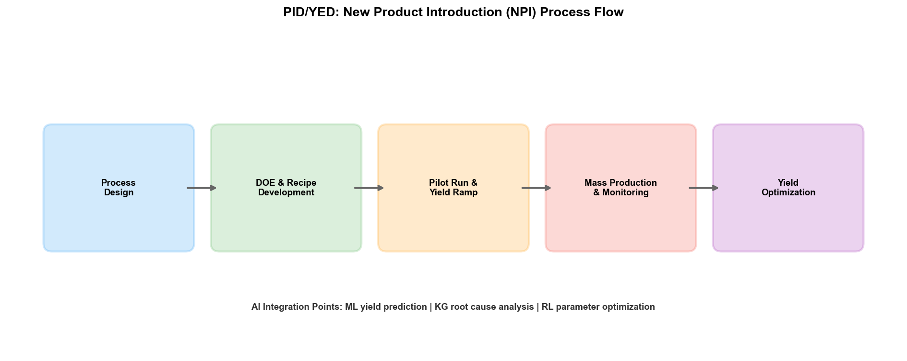
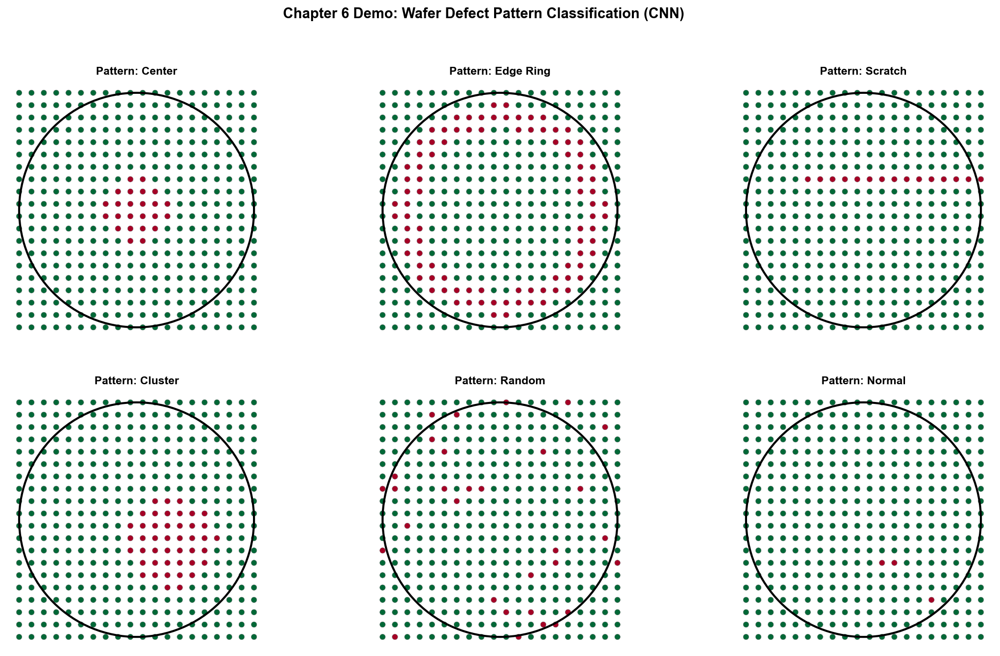

# Chapter 6: Process Integration (PID) and Yield Engineering (YED)

## 6.1 Department Positioning and Responsibilities

In the organizational structure of a semiconductor wafer fab, Process Integration Division (PID) and Yield Engineering Division (YED) constitute the core of the quality assurance system. The two have different division of labor but are tightly coupled — PID is responsible for "getting the process right," and YED is responsible for "confirming whether it was done right, and why not if it wasn't."

### Process Integration (PID)

PID's responsibility can be summarized in one sentence: ensuring full-flow process consistency from wafer start to output. A wafer in the 3nm process goes through over 1,200 process steps, involving dozens of process modules including lithography, etching, thin-film deposition, ion implantation, Chemical Mechanical Polishing (CMP), and metrology. Each module is optimized by different PEs (Process Engineers), but the interface between modules — whether the output of one layer meets the input requirements of the next — is PID's responsibility.

A PID engineer's role is analogous to that of a building structural engineer: they don't personally pour every column (that is PE's job), but they ensure that the force relationships between all columns, beams, and floor slabs are correct, so the entire building won't collapse due to a local design flaw. Specifically, PID is responsible for:

- **Process flow definition**: Determining the process step sequence for each product, target parameters and tolerance ranges for each step
- **Process window setting**: Defining the acceptable operating range for each critical process step — parameters within this range ensure product yield targets are met
- **Cross-module coordination**: When a process change in one module may affect other modules, PID is responsible for assessing the impact scope and coordinating solutions
- **New Product Introduction (NPI)**: Leading the development process for new process nodes, managing the full cycle from pilot production to mass production
- **Process specification (SPEC) maintenance**: Defining and maintaining the specification standards for each process step as the basis for production execution

### Yield Engineering (YED)

If PID is the "designer," YED is the "referee and detective." YED's responsibility is to monitor, analyze, and improve yield — how many good chips can be produced on a wafer.

Yield in semiconductor manufacturing has multiple levels:

| Yield Type | Definition | Testing Stage |
| --- | --- | --- |
| Wafer Yield / Line Yield | Wafers completing the full flow / Wafers started | Production line tracking |
| Probing Yield / CP Yield | Chips passing CP test / Total chips on wafer | CP (wafer-level test) |
| Final Yield / FT Yield | Chips passing FT test / Chips passing CP | FT (packaged chip test) |
| Overall Yield | The product of all the above yields | — |

YED engineers' daily work includes:

- **Yield monitoring**: Tracking yield data daily/by batch, identifying anomalous fluctuations
- **Defect analysis**: Collecting defect data through defect inspection equipment (KLA, etc.), analyzing defect types, density, and spatial distribution
- **Root Cause Analysis (RCA)**: When yield drops or defect rates rise, tracing the problem back to specific process steps and equipment
- **Wafer Map Analysis**: Inferring defect sources from the spatial distribution patterns of CP test results (edge defects, center defects, cluster defects, etc.)
- **Yield improvement projects**: Systematically optimizing process parameters to improve yield

## 6.2 Core Business Processes

### New Product Introduction (NPI) and Process Development

NPI is the most complex and resource-intensive process in the fab. An advanced process NPI typically follows these stages:

**Stage 1: Process Flow Definition.** PID engineers define the complete process step sequence based on the product design specification (the GDS file provided by the design company). This stage requires determining which process module each layer uses (e.g., copper or aluminum interconnect for this metal layer), target values for key parameters, and dependencies between steps.

**Stage 2: Process Window Development.** PE engineers conduct DOE (Design of Experiments) within each process module to find the optimal process parameter combinations. PID engineers are responsible for integrating each module's DOE results and verifying cross-module compatibility — the optimal parameters for one module may cause problems in another.

**Stage 3: Pilot Production.** After the process flow and parameters are preliminarily determined, small-batch pilot production begins. Pilot wafers go through the full flow for CP and FT testing to assess yield. Pilot production typically requires multiple iterations — problems found in each round may lead to process parameter adjustments or even flow changes.

**Stage 4: Yield Ramp.** After pilot verification passes, production volume is gradually increased. Yield ramp is a continuous optimization process — climbing from pilot yield (possibly 30%-50%) to mass production yield (typically requiring 90% or above). The ramp speed directly determines time-to-market and investment return cycle.

**Stage 5: Mass Production Transfer.** After yield reaches target, process specifications are frozen and mass production begins. Any subsequent process changes must go through a rigorous Engineering Change Order (ECN/ECO) process.

### Yield Management and Defect Analysis

Yield management during mass production is a continuous process, centered on the "monitor–inspect–analyze–improve" closed loop.

**Monitoring:** Each batch of wafers passes through metrology equipment (e.g., KLA's metrology systems) after critical process steps, recording CD (Critical Dimension), film thickness, overlay accuracy, and other parameters. This data is uploaded in real time to the SPC (Statistical Process Control) system, triggering alerts when parameters exceed control limits (UCL/LCL).

**Inspection:** After lithography (ADI, After Develop Inspection) and after etching (AEI, After Etch Inspection), wafers are scanned by defect inspection equipment, recording defect locations, sizes, and morphology. After CP testing, each wafer generates a wafer map — showing which chip locations passed testing and which failed.

**Analysis:** When yield drops or defect rates rise, YED engineers must perform root cause analysis. This process typically involves:

- Defect classification: Classifying detected defects by type (particles, scratches, cracks, corrosion, etc.)
- Spatial pattern analysis: The distribution pattern of defects on the wafer map implies different root causes — edge defects are typically equipment edge effects or loading/unloading issues; center defects may indicate process uniformity problems; randomly distributed particle defects may originate from cleanroom environment
- Process parameter correlation: Correlating defect data with equipment parameters of corresponding process steps to find anomalous parameters
- Physical Failure Analysis (PFA): Sectioning failed chips for SEM/TEM observation to determine the physical-level failure mechanism

**Improvement:** Based on root cause analysis conclusions, PE engineers adjust process parameters or perform equipment maintenance, and PID engineers update process specifications. Improvement effectiveness is verified through subsequent batch yield data.

## 6.3 Key Technologies and Methods

### Electrical Testing

Electrical testing is the ultimate criterion for yield assessment, divided into three levels:

**WAT (Wafer Acceptance Test):** Conducted after all front-end processes are complete, measuring electrical parameters of test keys (located in the scribe lines between chips) — such as transistor threshold voltage, saturation current, leakage current, capacitance, etc. WAT does not test chip functionality; it tests process quality. WAT data is the core metric for assessing process consistency.

**CP (Circuit Probing):** Using probe cards to directly contact the pads of each chip on the wafer for functional testing. CP distinguishes "good" from "bad" dies; bad dies are eliminated before subsequent packaging. CP testing is time-intensive — a wafer has thousands of chips, each requiring several to tens of seconds for complete functional testing, and the CP testing of an entire wafer may take hours.

**FT (Final Test):** Conducted after chip packaging, testing the functionality and performance of packaged chips under various temperature and voltage conditions. FT is the final quality gate before chips leave the factory.

The test data from all three levels together form a complete picture of yield — WAT yield reflects basic process quality, CP yield reflects wafer-level functional pass rate, and FT yield reflects the final pass rate after packaging.

### Defect Detection

Defect detection is YED's most important data source. Modern fab defect detection primarily relies on two types of equipment:

**Optical inspection equipment:** Such as KLA's Surfscan series, which uses high-resolution optical imaging to scan wafer surfaces, detecting defects by comparing adjacent areas or differences from a reference image. Optical inspection is fast, suitable for full-wafer scanning, but has limited resolution (typically at the 0.1-micron level).

**E-beam inspection equipment:** Such as KLA's eDR series, which uses electron beams to scan wafer surfaces with nanometer-level resolution. E-beam inspection is slow and is typically used for detailed follow-up of suspicious areas identified by optical inspection, or for high-precision inspection after critical process steps.

Inspection equipment outputs a defect list — each defect's location coordinates, size, and morphology parameters. This raw data must be classified into specific defect types by an Automated Defect Classification (ADC) system before it can be used for subsequent root cause analysis.

### FDC (Fault Detection & Classification)

The FDC system is a key data bridge connecting YED and EE/PE. FDC collects equipment sensor data in real time during operation (temperature, pressure, gas flow, RF power, time series, etc.) and works in two modes:

**Fault Detection (FD):** Monitoring whether equipment parameters are within normal ranges. Traditional FD uses SPC control charts — triggering alerts when parameters exceed control limits. More advanced FD uses multivariate statistical methods (such as PCA, T2 control charts) to monitor the joint state of multiple parameters.

**Fault Classification (FC):** When an anomaly is detected, classifying it into a specific fault type. Traditional FC relies on rule matching — "if temperature rises then falls and pressure fluctuates, classify as gas leak." Deep learning models are increasingly applied in FC — CNN can identify anomaly patterns from time-series signal plots with accuracy surpassing rule-based methods.

### Process Window Analysis

The process window is one of the concepts PID engineers care about most. Simply put, the process window is the "safe operating range" of process parameters — within this range, process results meet specification requirements. The larger the process window, the more robust the process and the higher its tolerance for equipment fluctuations and parameter drift.

Process window analysis is typically determined through DOE (Design of Experiments):

1. Select key process parameters (e.g., etch RF power, chamber pressure, gas ratio)
2. Design an experimental matrix (e.g., Central Composite Design, CCD), running experiments at high and low level combinations of each parameter
3. Measure process results under each experimental condition (e.g., etch rate, uniformity, selectivity)
4. Build a Response Surface Model fitting the relationship between parameters and results
5. Find the parameter space on the response surface that satisfies all specification requirements — this is the process window

In advanced processes, the process window is extremely narrow — 3nm CD control requirements are at the 1-2 nanometer level, while natural process parameter fluctuations may be at this same level. This means that even when parameters are within "normal" range, products may still be non-conforming. A slight narrowing of the process window can significantly increase control difficulty and scrap risk.

## 6.4 Challenges

### Complex Process Parameter Interaction Effects

Among the 1,200+ process steps in the 3nm process, the parameter interaction effects between preceding and subsequent steps grow exponentially. A 0.5 psi excess in CMP polishing pressure at one layer may cause overlay accuracy failure in lithography two layers later, which in turn affects metal interconnect resistance five layers later — this kind of cross-step causal chain is completely invisible in traditional single-step process monitoring.

The dilemma PID engineers face is: they must manage not the parameters of a single step, but the interaction network among over a thousand steps' parameters. Traditional DOE methods can only perform local optimization among a few parameters — when the parameter dimension exceeds 10, the number of DOE experiments explodes. But actual process parameter dimensions are often in the tens to hundreds.

### Difficulty in Yield Root Cause Localization

When yield drops, YED engineers must find the root cause from massive data. A single wafer's manufacturing process involves hundreds of pieces of equipment, over a thousand steps, and dozens of parameters per step — the possible root cause combinations are astronomical.

Traditional RCA methods rely on engineers' experience and intuition: first look at the spatial pattern of the wafer map to narrow the scope, then check SPC data for the corresponding steps to find anomalous parameters, and perform PFA if necessary to confirm the physical mechanism. This process typically takes days or even weeks. During this time, the production line may continue running — if the root cause is an equipment issue and remains undiscovered, more batches may be affected.

Intel described this challenge in its white paper: RCA requires integrating billions of heterogeneous production data records, and traditional manual investigation takes days. Their ML system compressed root cause localization time to minutes — powered by a combination of Connectionism (pattern recognition) and Symbolism (knowledge reasoning).

### NPI Cycle Compression Pressure

The competition in advanced processes is fundamentally a time competition — whoever reaches mass production first captures the market. But NPI cycle compression is constrained by physical laws: each pilot run requires a 3-4 month wafer manufacturing cycle, and one pilot run typically verifies only a portion of process hypotheses. If NPI requires 10 pilot iterations, that is a development cycle of over 3 years.

PID engineers need to converge the process in fewer pilot runs — meaning each pilot run must extract as much information as possible. The traditional OFAT (One Factor At A Time) experimental method is extremely inefficient. DOE, while more efficient, is still insufficient in high-dimensional parameter spaces. AI-assisted experimental design — such as Bayesian optimization and reinforcement learning — can predict the optimal next set of experimental parameters based on existing data, covering a larger parameter space with fewer experiments.

## 6.5 Practice Research: Real-World AI Deployment Cases in PID/YED

### Intel: AI-Driven GFA Automated Detection System

Intel's IT department deployed a yield analysis system based on machine learning, deep learning, and image processing for automated detection of GFA (Gross Failure Area, large-area failure regions) on wafer maps.

In the traditional process, yield engineers manually review wafer maps to identify known failure patterns (baseline patterns). This process is constrained by human resources — it cannot cover every wafer. Intel's AI system achieved:

- **Baseline pattern detection**: Automatically identifies known failure patterns with over 90% accuracy, covering 100% of final-tested wafers (previously only sampled by humans)
- **Unknown pattern discovery**: The system also reports all yield-impacting patterns and their severity — including patterns engineers had not previously noticed
- **Proactive push**: Shifting from passive "pull" analysis to proactive "push" alerts
- **Inline inspection shift**: Intel validated in a PoC that inline inspection combined with AI could detect 50% of wafer thinning issues earlier — earlier than offline inspection

This system's value lies not only in efficiency improvement but in a **qualitative change in coverage** — from sampling to full inspection, ensuring that occasional yield issues are no longer missed because "nobody saw them."

### SK Hynex/Gauss Labs: Panoptes Virtual Metrology System

Gauss Labs, an AI company invested in by SK Hynix, developed the Panoptes Virtual Metrology (VM) system, deployed on SK Hynix's mass production line in December 2022[91][92].

The core idea of virtual metrology is to use equipment sensor data (temperature, pressure, gas flow, etc.) to predict wafer metrology results (film thickness, refractive index, etc.) without actual measurement. This makes "metrology data for every wafer" possible — traditionally only sampled wafers are measured.

Panoptes VM deployment results:

- Process variation reduced by 21.5% (at December 2022 deployment), further improving to 29% by February 2024
- Accumulated virtual metrology on over 50 million wafers — equivalent to more than one wafer per second
- Adopted Adaptive Online Model (AOM) to handle data drift — when equipment aging or consumable replacement causes data distribution changes, the model automatically adapts
- Expanded from thin-film deposition to high-volume manufacturing virtual metrology across multiple process modules

Gauss Labs also developed the Universal Denoiser, using AI to remove noise from CD-SEM images — image acquisition time reduced to 1/4 of traditional technology, with projected metrology equipment productivity improvement of 42%.

### Micron: Smart Sight Smart Manufacturing System

Micron's Smart Sight is an enterprise-grade AI manufacturing system covering the full chain from defect detection to process optimization to quality management.

Micron's published 2016-2020 internal data:

- New product time-to-market reduced by 50%
- Product scrap rate reduced by 22%
- Quality issue resolution speed increased by 50%
- Manufacturing equipment availability increased by 4%
- Annual labor productivity increased by 1 million hours

Smart Sight's specific applications include: using computer vision for automated defect classification of lithography camera images — identifying wafer edge micro-holes, scratches, thin-film bubbles, and other defect types. Micron also deployed ResNet-50–based vision models to detect wafer/chamber placement misalignment, and AI-driven OCR defect detection — reducing scanner wafer rejection rate to below 0.5%.

In 2025, Micron and Anthropic announced a multi-year collaboration to use Claude AI for building the next-generation "AI Factory."

### Lam Research: Fabex Yield Optimizer

Lam Research's Fabex Yield Optimizer is the industry's first tool to use virtual silicon digital twins (based on SEMulator3D) combined with AI/ML to recommend metrology target changes.

Results from two NPI cases:

- **Case 1**: A leading device manufacturer used virtual silicon to detect and correct systematic defects before HVM — saving months and achieving "correct by design" chip delivery. Without the digital twin, these defects would only have been discovered at final test, affecting all wafers.
- **Case 2**: In a complex 3D structure, eliminated stubborn defects caused by multi-step process interactions, without introducing new systematic defects — improving yield for that defect pattern.

Fabex's ROI model: The traditional approach requires 10 silicon improvement iterations, 9 weeks each; with digital twin, reduced to 5 iterations, 10 weeks each — total cycle from approximately 90 weeks to approximately 50 weeks.

### NVIDIA: Vision Foundation Models for Wafer Defect Classification

NVIDIA released a semiconductor defect classification solution based on vision foundation models in 2025:

- **Cosmos Reason VLM**: Wafer-level defect classification accuracy exceeding 96% (after fine-tuning), supporting few-shot learning, natural language explanation, interactive Q&A, and automated annotation
- **NV-DINOv2 VFM**: Die-level defect detection accuracy of 98.51%, dramatically reducing manual annotation requirements

The value of these models lies in **generality** — rather than training from scratch for each defect type, they rapidly adapt to new process node defect patterns through few-shot fine-tuning. TSMC is already using NVIDIA Metropolis and TAO Toolkit for automated defect detection.

### Industry Tool Ecosystem

Beyond the above enterprise-level cases, a semiconductor industry AI yield analysis tool ecosystem has formed:

| Vendor | Product | Function |
| --- | --- | --- |
| KLA | Klarity Defect / SSA / aiSIGHT | Real-time shift identification, automated defect signature detection and classification |
| Applied Materials | AIx / ChamberAI / AppliedPRO | Real-time process visibility, chamber-level AI analysis, digital process maps |
| IKAS | Smart RCA | Multi-source data fusion root cause analysis, RCA time reduced >80% |
| yieldWerx | Root Cause Knowledge Graphs | Knowledge graph–driven lot disposition and RCA |
| Synopsys | DSO.ai / Silicon.da | RL-driven chip design optimization, silicon data closed loop |

---

PID and YED are the most data-intensive and analytically complex departments in the fab. The challenges they face — cross-step causal reasoning, high-dimensional parameter optimization, massive data root cause analysis — are precisely the scenarios where AI technology can deliver the most value. The cases above show that AI applications in PID/YED have moved from "experimental exploration" to "production-grade deployment" — Intel's GFA detection, SK Hynix's virtual metrology, and Micron's Smart Sight are all systematic applications covering the full production line. Part IV will discuss in detail the applications of Symbolism, Connectionism, and Behaviorism in PID/YED respectively.

## 6.6 Demo Visualization: AI-Driven Wafer Map Defect Pattern Recognition System

*Demo description: The figure above shows the CNN classification results for four typical wafer defect patterns (edge ring, center cluster, scratch, random scatter). Bottom-left is the classification confidence matrix, bottom-right is the model training curve. See `demos/demo_ch6_wafer_defect.py` for the simulation script.*
