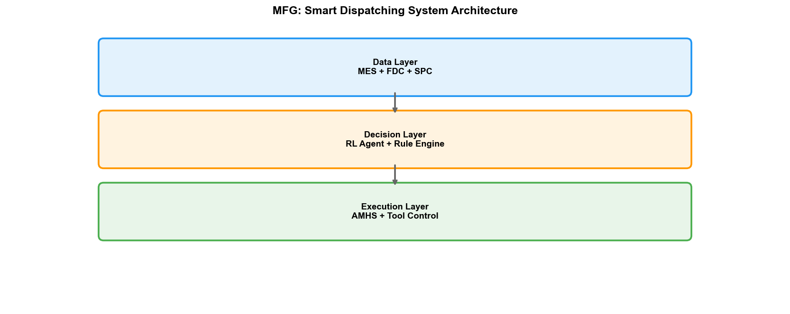
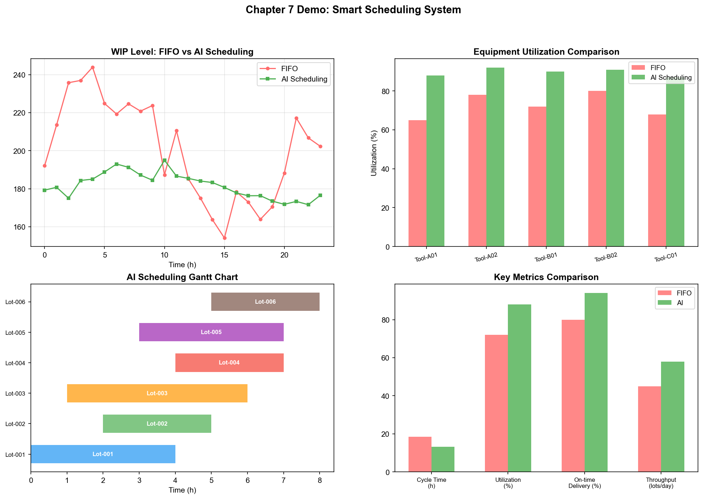

# Chapter 7: Manufacturing Department (MFG)

## 7.1 Department Positioning and Responsibilities

The Manufacturing Department (MFG) is the department that "makes everything happen" in the wafer fab. If PID defines "how to manufacture" and PE/EE maintain "what to manufacture with," then MFG's responsibility is to "actually manufacture" — moving wafers from the loading port to every piece of equipment on the production line, completing over a thousand process steps in sequence, and ultimately delivering the processed wafers out of the line.

This seemingly simple "transportation" task is, in semiconductor wafer fabs, one of the most complex scheduling problems in the world.

### The Fundamental Difference from Ordinary Factory Scheduling

Semiconductor wafer fab scheduling has a unique characteristic: **Reentrant Flow**. In an ordinary factory, products flow in one direction along the line — raw material → processing A → processing B → processing C → finished product. But in a wafer fab, the same wafer must repeatedly pass through the same set of equipment. A 3nm wafer undergoes 80-120 lithography layers, each requiring a lithography tool — the same EUV scanner may be visited by the same wafer over a hundred times during one manufacturing cycle.

Reentrant flow introduces a scheduling dilemma that does not exist in ordinary factories: at time T, the same piece of equipment may simultaneously have wafers from different products, different lots, different priorities, and different process steps queued in front of it. Which lot should the equipment process first? This decision affects not only the current lot's delivery time but also, through chain reactions, the waiting times of all subsequently queued lots.

### MFG's Core Responsibilities

- **Production scheduling and dispatching**: Deciding which wafer lot each piece of equipment processes next
- **Capacity management**: Predicting and planning equipment capacity to meet customer order requirements
- **WIP (Work-in-Process) management**: Monitoring WIP distribution on the production line, avoiding local accumulation or material starvation
- **Exception handling**: Schedule adjustments for equipment downtime, process anomalies, rush orders, and other unexpected events
- **Delivery management**: Ensuring each lot is completed within the promised delivery window

## 7.2 Core Business Processes

### Production Planning

Production planning has three levels:

**Long-term planning (month–quarter):** Based on customer order forecasts and capacity assessments, a monthly wafer start plan is developed. This level primarily focuses on capacity-demand matching — is there sufficient equipment to meet orders? Is new equipment needed or should the product mix be adjusted? Long-term planning is typically assisted by APS (Advanced Planning and Scheduling).

**Medium-term scheduling (week–month):** The monthly start plan is decomposed into weekly plans, considering equipment maintenance windows, product changeover times, engineering lot insertion, and other factors. Medium-term scheduling must balance multiple objectives — maximizing equipment utilization, minimizing product changeovers, and meeting different delivery requirements from different customers.

**Real-time dispatching (minute–hour):** During production line operation, real-time decisions are made on what each piece of equipment processes next. This is MFG's core daily operation, supported by MES (Manufacturing Execution System) and dispatching rule engines.

### Dispatching Rules

Dispatching rules determine the equipment's selection order when multiple wafer lots are queued. Common dispatching rules include:

| Rule | Description | Applicable Scenario |
| --- | --- | --- |
| FIFO (First-In-First-Out) | Process in arrival order | Simple scenarios, no priority consideration |
| EDD (Earliest Due Date) | Prioritize lots with nearest due dates | Delivery-sensitive foundries |
| SPT (Shortest Processing Time) | Prioritize lots with shortest processing time | Reduce average wait time |
| CR (Critical Ratio) | Remaining time / remaining processing time | Balances delivery and progress |
| LWN (Least WIP Next) | Prioritize the process step with least WIP | Balance line WIP distribution |

Actual fabs typically use a combination of rules — the base rule is FIFO, but hot lots or engineering lots are given high priority for queue insertion. Certain equipment may have special constraints — such as requiring lots with the same recipe to be processed consecutively to reduce changeover time.

### Exception Handling

In the daily operation of a wafer fab, exceptions are the norm rather than the exception. Common exceptions include:

- **Equipment downtime:** A critical piece of equipment suddenly fails. MFG must immediately adjust dispatching, routing affected lots to backup equipment while recalculating the impact on delivery times
- **Process anomaly:** A lot's parameters are found to exceed limits during metrology. MFG must pause subsequent steps for that lot, awaiting PID/YED analysis before deciding to release or rework
- **Rush order insertion:** A customer temporarily inserts a high-priority order. MFG must insert the new lot without disrupting the existing schedule
- **Engineering lots:** PID/PE need to run experimental lots (e.g., new process verification). Engineering lots are typically few in number but high in priority, requiring coordination with normal production lots

Exception handling efficiency directly determines the fab's responsiveness — a factory that takes 4 hours to recover from equipment downtime versus one that takes 2 hours may differ by thousands of wafers in annual production capacity.

## 7.3 Key Technologies and Methods

### MES (Manufacturing Execution System)

MES is the central nervous system of the wafer fab. It tracks the location and status of every wafer on the production line, recording each lot's entry and exit times at each operation, the equipment and parameters used, operator information, etc. MES core functions include:

- **Lot Tracking:** Real-time recording of each lot's location, status, and process progress
- **Route Management:** Defining the process step sequence for each lot
- **Equipment Management:** Monitoring equipment status (running/idle/maintenance/fault), managing equipment recipes
- **Data Collection:** Automatically collecting equipment operating parameters and metrology data
- **Dispatching Instructions:** Issuing transport and processing instructions to operators or automation systems based on dispatching rules

MES data is one of the fab's most core data assets — it records the complete history from wafer start to output. This data is the foundation for subsequent yield analysis, process optimization, and AI model training.

### APS (Advanced Planning and Scheduling)

APS provides higher-level scheduling capabilities above MES. Traditional MES dispatching is "reactive" — when equipment becomes idle, the next lot is selected based on current queue conditions. APS is "predictive" — based on the current state of the entire line and future plans, it simulates production conditions hours or even days ahead, proactively identifying bottlenecks and conflicts.

The core of APS is Finite Capacity Scheduling algorithms. Unlike infinite capacity scheduling (which assumes infinite equipment capacity and only sequences by process order), finite capacity scheduling considers the actual capacity limits of each piece of equipment — if a piece of equipment can only process 50 lots in 24 hours, APS will not assign more than 50 jobs to it.

In advanced fabs, APS typically needs to handle:
- Hundreds of pieces of equipment
- Thousands of lots simultaneously flowing on the line
- Over a thousand process steps per lot
- Equipment maintenance windows and recipe changeover constraints
- Multi-product mixed production

The search space of this scheduling problem is astronomically large — even the most powerful computers cannot find the global optimum. Practical systems typically use heuristic methods (such as genetic algorithms, simulated annealing) or rule-based methods to find "good enough" approximate optima.

### Bottleneck Analysis (Theory of Constraints)

The Theory of Constraints (TOC) is MFG's core framework for analyzing capacity bottlenecks. TOC's fundamental insight is: any system's output is limited by its weakest link — the bottleneck. Optimizing non-bottleneck links does not improve total system output; only optimizing the bottleneck can increase overall capacity.

In a fab, the bottleneck is typically a certain type of critical equipment — such as EUV lithography tools. A 3nm fab may be equipped with over 15 EUV scanners, each valued at over $150 million. The throughput (measured in WPH — Wafers Per Hour) of EUV equipment determines the output ceiling of the entire production line. If EUV equipment is down for 1 hour due to maintenance or failure, the production line's output loss cannot be compensated by other equipment running faster.

Key practices in bottleneck analysis include:

- **Identify the bottleneck:** Finding the highest-utilization (bottleneck) equipment through OEE data
- **Maximize bottleneck utilization:** Ensuring the bottleneck equipment never waits for material — maintaining an appropriate WIP buffer in front of bottleneck equipment
- **Subordinate to the bottleneck:** Non-bottleneck equipment scheduling should match the bottleneck's rhythm — even if non-bottleneck equipment can run faster, it should not run ahead and cause WIP buildup

### OEE (Overall Equipment Effectiveness)

OEE is MFG's core metric for measuring equipment utilization:

$$OEE = Availability \times Performance \times Quality$$

- **Availability:** Actual operating time / planned operating time. Deducts equipment failures and adjustment time
- **Performance:** Actual output / theoretical output. Measures whether equipment operating speed reaches design capacity
- **Quality:** Good product / total output. Measures equipment processing quality

An advanced fab's OEE target is typically 80%-85% or above. Each 1-percentage-point OEE improvement is equivalent to a 1% capacity increase without additional equipment investment — for a fab with $20 billion in investment, this equates to millions of dollars in additional annual revenue.

## 7.4 Challenges

### Scheduling Complexity of Reentrant Flow Lines

Reentrant flow renders traditional scheduling algorithms nearly ineffective. In a unidirectional flow line, a simple FIFO rule can produce a reasonable schedule. But in a reentrant flow line, wafers queued at the same equipment may be at completely different process stages — some just completed first-layer lithography, others are on layer eighty. Choosing which to process first affects not only the current equipment's utilization but also propagates through subsequent queuing effects across the entire line.

This complexity makes wafer fab scheduling an NP-Hard problem — as problem size grows, the computation time for exact solutions increases exponentially. Practical systems can only compromise between "solution speed" and "solution quality."

### Multi-Product Mixed Production

Modern fabs typically produce multiple products simultaneously — different technology nodes (28nm/14nm/7nm/3nm), different product types (logic chips/memory/analog/RF), and even customer-specific custom processes. Each product has different process routes, processing times, and delivery requirements.

Challenges from multi-product mixing include:

- **Recipe changeover:** Different products require different equipment recipes; changing recipes takes setup time, and frequent changeovers reduce equipment utilization
- **Process route differences:** Different products have different process step sequences, requiring coordination of multiple process routes on the same equipment
- **Priority conflicts:** Rush orders for high-value products conflict with stable production of regular products

### Balancing Capacity Utilization and Delivery Deadlines

MFG must continuously balance two objectives: maximizing capacity utilization (keeping equipment running) and meeting customer delivery deadlines (on-time delivery). These two objectives frequently conflict — to meet a rush order's deadline, it may be necessary to interrupt a piece of equipment's current lot and change recipes to process the rush lot, reducing equipment utilization.

When capacity is tight (such as during surging demand for advanced processes), this conflict becomes even sharper — all customers want their orders prioritized, but physical capacity is limited. MFG must find a balance among customer satisfaction, capacity efficiency, and profit maximization.

### Event-Driven Dynamic Adjustment

The fab's operating environment is highly dynamic — equipment failures, process anomalies, rush orders, and engineering lot insertions can occur at any time. Static scheduling (planning the entire day's schedule at the start of the day) is nearly impossible to maintain in actual operations — a single equipment failure can disrupt the entire line's schedule.

MFG needs dynamic scheduling capabilities that can respond to events in real time. Traditional dispatching rules are "static" — rules are fixed and do not consider the global state of the current production line. More advanced methods need to consider the real-time state of the line to dynamically adjust dispatching strategies — this is precisely where AI technologies (especially reinforcement learning) come into play.

## 7.5 Practice Research: Real-World AI Deployment Cases in MFG

### TSMC: Intelligent Operations System

TSMC explicitly describes systematic AI/ML applications in manufacturing operations on its official manufacturing page. TSMC's intelligent operations system covers six directions:

- **Lean Manufacturing:** AI/ML optimizes production flows, reducing waste
- **People Productivity:** AI-assisted decision-making, reducing manual analysis burden
- **Equipment Productivity:** Predictive maintenance and intelligent dispatching improve equipment utilization
- **Process and Equipment Control:** Intelligent Advanced Process Control (APC) and Intelligent Advanced Equipment Control (AEC)
- **Quality Defense:** AI-driven anomaly detection and yield protection
- **Robot Control:** AI optimization of AMHS (Automated Material Handling System)

TSMC has integrated AI into its dispatching system, expanding the computational scope and performance of scheduling — with the goal of maximizing equipment production efficiency. Meanwhile, TSMC has expanded AMHS to connect multiple Gigafabs, improving cross-fab production flow efficiency and stability. In process learning curves, TSMC uses advanced AI algorithms to accelerate process control innovation for advanced processes — shortening the cycle from pilot production to mass production.

TSMC has also engaged in deep collaboration with NVIDIA: using NVIDIA Metropolis and TAO Toolkit for vision AI defect detection, NVIDIA cuLitho for accelerated computational lithography, and NVIDIA Omniverse to build "FabTwin" digital twins — the latter for fab-wide production simulation and anomaly prediction.

### Samsung: AI Megafactory

In October 2025, Samsung and NVIDIA announced the joint construction of an AI Megafactory — deploying over 50,000 NVIDIA GPUs with $2.5 billion investment to build AI manufacturing infrastructure.

Core applications of the AI Megafactory include:

- **Computational lithography acceleration:** Using NVIDIA cuLitho and CUDA-X libraries for OPC (Optical Proximity Correction), with computational lithography performance improved 20x
- **Digital twin:** Building fab-wide digital twins based on NVIDIA Omniverse — visualizing the entire manufacturing process, identifying anomalies, predictive maintenance, and simulating optimization effects before physical changes
- **Full-flow AI network:** From chip design, process development, equipment operation to quality control, AI runs through the entire manufacturing chain
- **HBM4 manufacturing:** 6th-generation 10nm-class DRAM + 4nm logic base die, processing speed reaching 11 Gbps (exceeding the JEDEC standard of 8 Gbps)

According to third-party industry reports, Samsung's AI Megafactory achieved 30% defect detection improvement and 15% wafer yield increase (Samsung has not officially confirmed these figures).

### GlobalFoundries: AI-Driven AMHS Health Management

GlobalFoundries' Dresden fab deployed an AI-driven AMHS vehicle health monitoring system, covering a 23-kilometer overhead transport system and over 900 automated transport vehicles.

The system uses acoustic and vision AI for real-time health scoring and predictive maintenance of transport vehicles:

- Vehicle Mean Time Between Incidents (MTBI) improved 3x
- Transport-related production losses reduced by 80%
- AI assesses wheel wear and spacing through video analysis — flagging anomalies at early stages of mechanical degradation

This case demonstrates that AI is valuable not only for process equipment but also for facility logistics systems — transport system downtime directly causes wafers to stagnate between process steps, impacting Cycle Time and WIP turnover.

### Goxel/Tongfang: Malaysia 12-inch Fab AI-CIM System

Goxel/Tongfang (CircuitSoft) demonstrated its AI-CIM (Computer Integrated Manufacturing) deployment at a 12-inch fab in Malaysia at SEMICON SEA 2026:

- **AI CIM-MIS system:** Product traceability capability improved by over 90%, equipment OEE improved by 20%
- **AI FDC system:** Detected filter clogging and wafer breakage issues on multi-vendor CMP equipment
- **TPM/MVA multi-model collaboration:** Multi-model joint analysis of equipment health and process quality

### Micron: Enterprise-Grade AI Manufacturing

Micron's AI manufacturing system covers the full chain from defect detection to logistics optimization to business processes. Published 2016-2020 internal data:

- Manufacturing equipment availability increased by 4%
- Annual labor productivity increased by 1 million hours
- New product time-to-market reduced by 50%
- Product scrap rate reduced by 22%

Micron has also deployed acoustic AI (listening to equipment operation sounds to detect anomalies), thermal imaging AI (detecting equipment overheating), and Agentic AI (autonomous scheduling of maintenance, ordering spare parts, adjusting production routes).

### Validation of Reinforcement Learning in Production Scheduling

Although RL research in fab scheduling has a long history, cases validated on actual production lines are accumulating[88]:

**AISSI Project (2021–2024):** A joint project by Bosch, Nexperia, Bosch Sensortec, D-SIMLAB, SYSTEMA, and KIT, using deep RL agents for factory scheduling[87]. Three use cases: epitaxy work center scheduling (Nexperia), fab-wide scheduling (Bosch), global Cycle Time prediction (Bosch Sensortec). Results: output 9% higher than literature benchmarks, Cycle Time prediction accuracy 80-90%. Results are being transferred to Bosch and Nexperia production lines.

**ICTC 2025 Paper:** Validated RL scheduling on a real industrial dataset — throughput improved by 5.3%, Cycle Time reduced by 7.3%, tardiness metrics relatively improved by 19.2%, equipment utilization reaching 87.9%.

**arXiv 2025 Paper:** On a real industrial dataset, RL methods improved tardiness metrics by 4% and throughput by 1% — modest improvements, but validating RL feasibility in real production-line environments.

### Industry Tools and Practice Ecosystem

| Vendor/Project | Application | Quantified Results |
| --- | --- | --- |
| TSMC | AI dispatching, AMHS, APC/AEC | Systematic deployment, no specific KPIs published |
| Samsung | AI Megafactory (50,000 GPUs) | OPC 20x acceleration, defect detection +30%, yield +15% |
| GlobalFoundries | AMHS vehicle AI health monitoring | MTBI 3x, transport losses -80% |
| Goxel/Tongfang | AI CIM-MIS, AI FDC | OEE +20%, traceability >90% |
| Micron | Smart Sight full-chain AI | Equipment availability +4%, scrap -22% |
| AISSI/Bosch | Deep RL scheduling | Output +9%, prediction accuracy 80-90% |
| Siemens Opcenter | MES + AI + SCADA | Yield +13% (within 2 weeks) |

---

MFG's challenges — NP-Hard scheduling, reentrant flow, dynamic event response, multi-objective optimization — are among the most promising application scenarios for AI technology. The cases above show that TSMC and Samsung have systematically embedded AI into the full flow of manufacturing operations, while RL scheduling is transitioning from academic research to production-line validation. Reinforcement learning's capability in sequential decision optimization, deep learning's capability in bottleneck prediction, and knowledge graphs' capability in cross-system data integration will all be unfolded in the MFG application chapters of Part IV.

## 7.6 Demo Visualization: RL-Driven Intelligent Dispatching System

*Demo description: The figure above compares Gantt charts of traditional FIFO dispatching versus RL intelligent dispatching. The bottom row shows equipment utilization comparison, key KPI comparison, and the RL training reward convergence curve. See `demos/demo_ch7_smart_scheduling.py` for the simulation script.*

> **Hands-on experiment for this chapter**: The K8s-style declarative scheduling experiment in Section 27.6 of Chapter 27 (`demos/experiments/C9S_agent`) turns the smart scheduling ideas of this chapter into an interactive system — replacing hand-written dispatch scripts with an expected-vs-actual reconciliation loop, with injectable equipment faults to observe self-healing. Zero external dependencies, starts in seconds.
