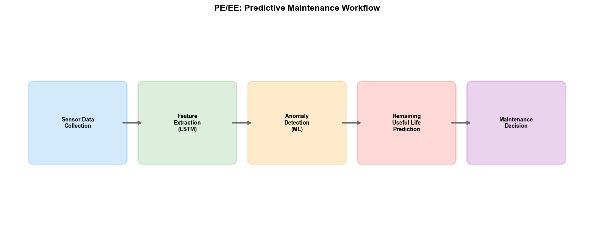
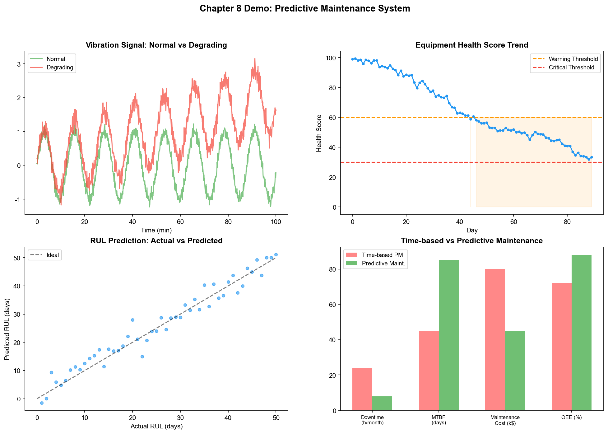

# Chapter 8: Process Engineering (PE) and Equipment Engineering (EE)

## 8.1 Department Positioning and Responsibilities

Process Engineering (PE) and Equipment Engineering (EE) are the two departments "closest to the equipment" in a wafer fab. If PID is the designer, YED is the referee, and MFG is the executor, then PE and EE are the "craftsmen who tune the tools"—their work directly determines the physical results produced by each piece of equipment on each batch.

### Process Engineering (PE)

PE is responsible for the development and optimization of parameters for each process module. Within a process module (e.g., etching, lithography, thin-film deposition), there are dozens of adjustable parameters—RF power, chamber pressure, gas flow rate and ratio, temperature, time, etc. The task of a PE engineer is to find the optimal combination of these parameters so that the process results (e.g., etch rate, etch profile angle, uniformity, selectivity) meet specification requirements.

The distinction between PE's work and PID's lies in granularity: PID focuses on cross-module integration and full-flow consistency, while PE focuses on parameter optimization within a single module. PID asks, "Does the etch result of this layer match the deposition requirements of the next layer?" while PE asks, "What should the RF power of Chamber 3 on the etch tool be set to in order to achieve the target etch rate with uniformity within 3%?"

### Equipment Engineering (EE)

EE is responsible for the health and availability of the equipment itself. If PE cares about "what the equipment produces," EE cares about "how the equipment is doing." EE's responsibilities include:

- **Equipment monitoring:** Real-time monitoring of equipment sensor data through the FDC system to determine whether the equipment is in a normal state
- **Preventive maintenance (PM) planning:** Developing scheduled maintenance plans—performing a chamber wet clean every N batches, replacing consumable parts every M months
- **Fault diagnosis and repair:** Rapidly locating the faulty component and repairing it when equipment abnormalities occur
- **Tool matching:** Ensuring that multiple tools of the same type produce consistent results—the difference in results for the same product across different equipment is within tolerance

## 8.2 Core Business Processes

### Recipe Development and Validation

A Recipe is the core work product of PE engineers. A Recipe defines the complete sequence of parameters for equipment operation—for example, an etch Recipe may include: a pre-clean step (30 seconds, 50 sccm Ar, 10 mTorr, 100 W RF), a main etch step (60 seconds, 100 sccm SF6 + 20 sccm O2, 15 mTorr, 300 W RF), and an over-etch step (15 seconds, with adjusted parameters).

Recipe development is an iterative process:

1. **Initial parameter setting:** Set initial parameters based on experience or historical data from similar processes
2. **Trial run:** Process test wafers using the initial Recipe
3. **Measurement evaluation:** Measure the processing results (CD, profile, uniformity, etc.)
4. **Parameter adjustment:** Adjust parameters based on measurement results
5. **Repeat steps 2–4 until specifications are met**

Each iteration of this process requires a wafer fabrication cycle (days to weeks), and only a few parameters can be adjusted per iteration. Recipe development for a new process module may require dozens of iterations, taking several months.

### Equipment Parameter Tuning

Even after a Recipe is finalized, equipment parameters require continuous fine-tuning during daily operation. There are three reasons for this:

**Equipment aging:** As usage increases, component performance degrades—polymer accumulation on chamber walls alters the etch environment, electrode wear changes RF power coupling efficiency, and pump pumping speed decreases over time. These aging effects cause the same Recipe to produce different results at different points in time.

**Batch-to-batch drift:** Continuously operating equipment exhibits parameter drift between batches—polymer deposited on the chamber wall by the previous etch batch affects the etch rate of the next batch. This "memory effect" means the equipment's output depends on its historical operating state.

**Consumable replacement impact:** After each PM, consumable parts (e.g., electrodes, focus rings, O-rings) are replaced. Minor differences between new and old parts cause equipment characteristics to change—the same Recipe may produce different outputs before and after PM.

Parameter tuning is implemented through R2R (Run-to-Run) control—adjusting the next batch's Recipe parameters based on the measurement results of the previous batch to compensate for drift and aging effects.

### Preventive Maintenance (PM) Planning

PM is the core means by which EE ensures equipment availability. Traditional PM uses fixed intervals:

- **Batch interval:** Perform a chamber wet clean every N batches
- **Time interval:** Perform a major maintenance (PM) every M months, replacing consumable parts
- **Condition-triggered:** Trigger an interim PM when FDC data or measurement data reaches thresholds

The problem with fixed-interval PM is the "one-size-fits-all" approach—maintenance is performed when the interval arrives regardless of actual equipment condition. This leads to two types of waste:

- **Premature maintenance:** The equipment is still in good condition but the interval has arrived; premature maintenance wastes capacity and consumables
- **Delayed maintenance:** The equipment is already showing degradation signs but the interval has not arrived; continued operation leads to process result deviations or even scrap

Predictive Maintenance analyzes trends in equipment sensor data to predict when maintenance is needed—scheduling PM before the equipment actually develops problems, thus avoiding both the waste of premature maintenance and the risk of delayed maintenance.

### Tool Matching

A wafer fab typically has multiple tools of the same type running in parallel—for example, 10 etchers and 20 lithography scanners. Ideal tool matching requires: the difference in results for the same product processed on any tool of the same type is within tolerance.

The challenge in achieving tool matching is that even tools of the same model have different "personalities" due to component manufacturing variations, installation environment differences, and usage history differences. The same Recipe may produce different results on different tools—differences may arise from RF power calibration deviations, minute chamber geometry differences, gas distribution non-uniformity, etc.

The traditional tool matching method is a "baseline-matching" process:

1. Select a "Golden Tool" whose output serves as the baseline
2. Run the same Recipe on other tools and compare output differences
3. Fine-tune Recipe parameters on tools with differences (e.g., fine-tune RF power compensation) to bring their outputs close to the Golden Tool

This process requires repeated iterations, and re-matching is needed when equipment conditions change (after PM, after aging). The quality of tool matching directly affects wafer yield—if the variation between tools is too large, the fluctuation in process results across different wafer batches increases, raising the variance of CP yield.

## 8.3 Key Technologies and Methods

### SPC (Statistical Process Control)

SPC is the most fundamental quality control tool for PE and EE. SPC uses control charts to monitor whether process parameters are in a state of statistical control.

The basic principle of control charts: if a process parameter is influenced only by common cause variation, its values follow a normal distribution, with 99.7% of values falling within the range of mean ± 3 standard deviations ($\mu \pm 3\sigma$). When a parameter value exceeds this range (UCL/LCL), it indicates the presence of special cause variation—not random fluctuation, but a specific cause that has led to the deviation.

Common control charts include:

| Control Chart | Applicable Data | Characteristics |
| --- | --- | --- |
| $\bar{X}$-R chart | Continuous data, grouped | Monitors mean and range |
| I-MR chart | Continuous data, individual values | Monitors individual values and moving range |
| p chart | Discrete data, defect rate | Monitors batch pass rate |
| CUSUM | Continuous data | Sensitive to small shifts, accumulates deviations |
| EWMA | Continuous data | Exponentially weighted moving average, sensitive to drift |

The limitation of SPC is that it is a univariate method—each parameter is monitored independently, and it cannot detect joint anomalies among multiple variables. For example, temperature and pressure may each be within control limits, but their combination may correspond to an abnormal state. Multivariate SPC (e.g., the T² control chart) and machine learning-based anomaly detection methods can address this limitation.

### FDC (Fault Detection and Classification)

The FDC system was introduced from the YED perspective in Chapter 6; here it is supplemented from the EE perspective.

For EE, FDC is the core tool for equipment health monitoring. The FDC system collects hundreds of equipment sensor signals per second, including:

- Chamber temperature, wall temperature, electrode temperature
- Chamber pressure, individual gas flow rates, gas pressure
- RF power, reflected power, impedance matching
- Vacuum pump pumping speed, throttle valve position
- Timestamps and status signals for each stage

These signals form an "electronic fingerprint" for each batch processed—if the signal pattern of this batch deviates from the normal pattern, the FDC system raises an alarm and classifies the anomaly into a specific fault type.

The characteristics of FDC data are high dimensionality (hundreds of signal channels), high frequency (tens to hundreds of sampling points per second), and long duration (a single batch may last from minutes to tens of minutes). The analysis of such high-dimensional time-series data is a natural application scenario for deep learning (especially LSTM and Transformer).

### R2R (Run-to-Run Control)

R2R control is the core mechanism by which PE continuously optimizes process parameters during mass production. The basic logic of R2R:

1. **Measurement:** Each batch (or every N batches) of wafers is measured after key process steps to obtain process results (e.g., CD values)
2. **Comparison:** Compare measurement results with target values and calculate deviations
3. **Model prediction:** Use the R2R control model (e.g., an EWMA controller) to predict the parameter adjustment needed for the next batch based on historical deviation trends
4. **Parameter adjustment:** Apply the adjustment to the next batch's Recipe

The mathematical foundation of the EWMA controller is typically the EWMA (Exponentially Weighted Moving Average) model:

$$\hat{y}_{t+1} = \alpha \cdot y_t + (1-\alpha) \cdot \hat{y}_t$$

where $\hat{y}_{t+1}$ is the predicted process result for the next batch, $y_t$ is the measured value of the current batch, and $\alpha$ is the smoothing coefficient (between 0 and 1). By comparing the predicted value with the target value's deviation, the required parameter adjustment is calculated.

The limitation of the EWMA controller is that it assumes process drift is linear and slow. Actual process drift may be nonlinear (e.g., step changes after PM), multivariate (multiple parameters drifting simultaneously and interrelated), or even abrupt (e.g., sudden failure of a component). Deep learning-based R2R controllers can handle more complex nonlinear multivariate drift patterns.

### Predictive Maintenance

Predictive maintenance is one of the most mature AI application areas in EE. Its core is the shift from "scheduled maintenance" to "condition-based maintenance"—deciding when to maintain based on the actual health state of the equipment.

The technical approaches for predictive maintenance include:

**Threshold-based methods:** Set warning thresholds for key parameters. When parameters such as temperature and vibration approach the threshold, an early warning is issued. Simple but unable to predict remaining useful life (RUL).

**Trend-based methods:** Use time-series models (ARIMA, LSTM, etc.) to predict future trends of key parameters and estimate when they will exceed thresholds. Can predict RUL but assumes parameter changes are extrapolable.

**Health index model-based methods:** Define a "health index" for the equipment (combining multiple sensor signals) and use machine learning models to estimate the current health state and degradation rate. Transformer and similar models excel at processing long sequences of sensor data.

**Digital twin-based methods:** Build a digital twin model of the equipment and simulate the operation and aging process of the equipment in a virtual space. When the digital twin predicts impending performance degradation, maintenance is scheduled in advance.

## 8.4 Challenges Faced

### Equipment Aging Causing Parameter Drift

Equipment aging is the most persistent challenge faced by PE and EE. The effects of aging are multifaceted:

- **Etch chamber wall polymer accumulation:** Alters the chemical characteristics of the etch environment, causing etch rate and selectivity drift
- **Electrode wear:** Changes RF power coupling efficiency, causing plasma density variations
- **Vacuum pump performance degradation:** Reduced pumping speed affects the precision of chamber pressure control
- **Optical component degradation:** The transmittance of lithography scanner lenses attenuates with exposure dose, affecting imaging quality

Each aging effect proceeds at a different rate and they compound—a parameter's drift may be influenced by multiple aging mechanisms simultaneously. R2R controllers can compensate for predictable, slow drift, but for sudden degradation (e.g., a performance cliff just before a component fails), traditional methods often cannot respond in time.

### Inter-Tool Variation

Variations between tools of the same model originate from multiple sources:

- **Manufacturing tolerances:** Even for the same model, each tool's component dimensions and material properties have minute differences
- **Installation environment:** Cleanroom temperature, humidity, and vibration environment vary by location
- **Usage history:** Different tools have processed different batch counts, product types, and maintenance histories
- **Consumable lot-to-lot variation:** Material properties of consumable parts (e.g., electrodes, focus rings) from different lots may have batch-to-batch variations

Inter-tool variation means that a "universal Recipe" does not exist in practice—each tool requires its own fine-tuned Recipe version. As the number of tools increases (an advanced wafer fab has hundreds of tools), the workload of Recipe maintenance grows linearly. When equipment conditions change (after PM, after aging), Recipes need to be re-matched—a process that may take several days.

### Recipe Development Time

Recipe development for new processes is one of the main bottlenecks in the NPI cycle. A complex process module (e.g., multilayer metal etch) may have a Recipe with dozens of steps and hundreds of parameters. The traditional Recipe development method is OFAT (One-Factor-At-a-Time) or simple DOE—requiring a large number of experimental runs, each requiring a wafer fabrication cycle.

In advanced process nodes, the process window is extremely narrow (e.g., CD control for 3nm requires 1–2 nanometers), and parameter interaction effects are complex (nonlinear, non-monotonic), making traditional experimental methods inefficient at covering the parameter space. This is one of the most valuable application scenarios for AI-assisted experimental design (e.g., Bayesian optimization, reinforcement learning)—finding better parameter combinations with fewer experimental runs through intelligent sampling.

## 8.5 Practice Research: Real-World AI Deployment in PE/EE

### Intel: IIoT Predictive Maintenance System

Intel deployed an IIoT sensor- and edge AI-based predictive maintenance system in its own wafer fabs, primarily monitoring two types of equipment:

**FFU (Fan Filter Unit) health prediction:** FFUs are the core equipment of cleanrooms—maintaining the internal air cleanliness of the wafer fab. FFU failure leads to degradation of cleanliness, directly impacting yield. Intel installed vibration sensors on FFUs and transmitted data to analytics applications via Intel IoT Gateway. When vibration data exhibited abnormal patterns, the system issued alerts before actual FFU failure.

- Unplanned FFU downtime reduced by 66%
- Compared to manual inspection, unplanned downtime reduced by over 300%

**Epoxy blower vibration monitoring:** Epoxy blowers are key equipment in the process exhaust system. Intel deployed vibration sensors on the blowers and detected 5 impending blower failures in advance—avoiding an estimated loss of millions of dollars.

Intel's system also features Agentic AI capabilities—upon detecting an anomaly, the system can autonomously schedule repairs, order spare parts, and adjust production routing.

### Applied Materials: AIx Platform and GPU-Accelerated Simulation

Applied Materials' AIx (Actionable Insight Accelerator) platform is a representative product for equipment-level AI analytics:

**AIx platform core capabilities:**
- Real-time process visibility—measuring millions of data points across wafers and dies, optimizing thousands of process variables
- ChamberAI—sensors + ML algorithms for real-time analysis of process variables, enabling chamber-level anomaly detection
- AppliedPRO—Digital Process Map, supporting virtual experimentation
- In-line metrology with high throughput—metrology speed increased 100x, resolution improved 50%

**GPU-accelerated materials simulation:** Applied Materials partnered with NVIDIA to use GPUs for accelerating materials science simulation:
- Ginestra materials simulation: 10x faster than CPU; on NVIDIA B200, some simulations reduced from 5 days (64-core CPU) to 2 hours (single GPU), approximately 55x speedup
- ACE+ topography simulation: 35x GPU acceleration

### ASML: Generative AI for Lithography Optimization

ASML advanced multiple AI applications in 2025–2026:

**OPC (Optical Proximity Correction) AI acceleration:** ASML has used AI to accelerate OPC computation for over a decade. In 2025, it partnered with Mistral AI to use generative AI to improve OPC Recipe quality and solving speed. In January 2026, the first generative AI validation was completed at a customer site.

**EUV light source optimization:** AI optimizes and calibrates EUV light source settings, reducing manual trial and error. Early testing achieved wafer-level power enhancement on customer EUV scanners.

**E-beam inspection guidance:** AI guides image quality optimization and inspection paths for e-beam metrology and inspection equipment.

**Diagnostic AI:** AI-driven diagnostic systems identified errors in certain subsystems over 70% faster than manual methods, with accuracy matching engineer-level performance.

**Design acceleration:** Over 12,000 designs were explored through AI-assisted design acceleration.

### MST NeuroBox: AI-Driven R2R and Chamber Matching

MST NeuroBox's AI R2R system represents the evolution from traditional EWMA controllers to AI controllers:

**AI R2R control:**
- Traditional EWMA controllers can only handle 2–3 variables; AI R2R simultaneously optimizes 10–20 parameters
- Under equipment drift and incoming material variation, maintains process parameters within ±1% of target
- Automatically updates Recipes based on Virtual Metrology (VM) predictions—real-time adjustment between batches

**AI chamber matching:**
- Continuously monitors each chamber's temperature profile, RF power/impedance, gas flow, chamber pressure, and endpoint signals
- AI models establish baselines based on historical data from "well-matched chambers," and detect, quantify, and diagnose matching drift in real time
- Inter-chamber variation reduced by over 60%
- Post-PM qualification time reduced by 70%
- Saves thousands of test wafers annually

### Industry Benchmark Data for Equipment Predictive Maintenance

Based on aggregated industry deployment data, typical effects of AI-driven predictive maintenance on semiconductor equipment:

| Metric | Traditional (Fixed-Interval PM) | AI-Driven PdM | Improvement |
| --- | --- | --- | --- |
| Plasma etch equipment MTBF | 280–350 hours | 420–490 hours | +35–45% |
| General equipment MTBF | Baseline | — | +25–40% |
| MTTR | Baseline | — | -50–65% |
| Equipment OEE | Baseline | — | +8–15% |
| Fault warning time | Post-event detection | 24–72 hours before failure | Qualitative change |

NVIDIA's iFactory AI platform demonstrated GPU-accelerated predictive maintenance: LSTM and Transformer models optimized through TensorRT achieved 5x the inference speed of CPUs; latency from raw sensor input to classified alarm was below 15 milliseconds.

### KLA: AI-Driven Defect Inspection and Process Control

KLA's software solution suite applies AI across the full chain of inspection and process control:

- **Klarity Defect:** Real-time excursion identification, automated defect signature detection and classification
- **Klarity SSA (Spatial Signature Analysis):** Automatically detects and classifies defect signatures indicating process problems
- **aiSIGHT:** AI-driven defect and pattern measurement based on SEM images—identifying particles and pattern defects on the front, back, and edge of wafers
- **Klarity ACE XP:** Cross-fab-level yield learning capture, retention, and sharing system

KLA's Gen5 product line addresses the growth in inspection complexity—key inspection layers in advanced processes have increased by 50%—enhancing inspection capabilities through AI models.

### Industry Tool Ecosystem Overview

| Vendor | AI Product | Core Capability | Quantified Results |
| --- | --- | --- | --- |
| Intel | IIoT + Edge AI | FFU/blower PdM | Downtime -66%, 5 failures prevented |
| Applied Materials | AIx / Ginestra | Real-time process analytics, materials simulation | Simulation 10–55x acceleration |
| ASML | Generative AI OPC | Lithography optimization, diagnostics | Diagnostics +70%, 12,000+ design explorations |
| MST NeuroBox | AI R2R / Chamber Matching | Multivariate R2R, matching monitoring | Variation -60%, qualification -70% |
| KLA | Klarity suite | Defect detection and classification | Covers Gen5 +50% inspection layers |
| NVIDIA/iFactory | GPU-accelerated PdM | LSTM/Transformer inference | Latency <15ms, 5x inference acceleration |

---

As of this chapter, we have completed the business overview and practice cases for the three core departments of the wafer fab. PID/YED focuses on process integration and yield, MFG focuses on production scheduling and capacity, and PE/EE focuses on equipment parameters and maintenance. The technical challenges these three departments face—cross-step causal reasoning, NP-Hard scheduling, high-dimensional parameter optimization, equipment health prediction—are precisely the scenarios where AI technologies can deliver value. The above cases demonstrate that from Intel's IIoT to ASML's generative AI lithography optimization, from Applied Materials' GPU-accelerated simulation to MST's AI R2R control, equipment-level AI has already produced quantifiable ROI in mass production. The next Part 4 will detail the specific applications of the three paradigms in these scenarios.

## 8.6 Demo Visualization: LSTM-Driven Equipment Predictive Maintenance System

*Demo description: The figure above shows the equipment degradation curve with LSTM RUL prediction, FDC signal anomaly detection, prediction error comparison, maintenance decision matrix, and PM effectiveness comparison. Simulation script: `demos/demo_ch8_predictive_maintenance.py`.*
