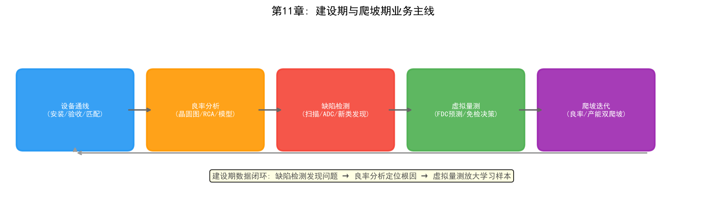

# Chapter 11: The Construction and Ramp Phase — From "Building the Fab" to "Ramping Output"

## 11.1 Phase Overview: Business Characteristics and Core Contradictions

A wafer fab's lifecycle can be divided into three phases: construction and ramp, mature mass production, and foundry service transformation. Each phase faces different business problems and task portfolios, with different demands on AI:

| Phase | Timeframe (illustrative) | Core Business Problem | Key Tasks |
| --- | --- | --- | --- |
| Construction/ramp | Fab construction to yield/capacity targets (1-3 years) | Low yield, low output, high uncertainty | Yield analysis, virtual metrology, defect inspection |
| Mature mass production | Years of stable production | Cost, efficiency, quality consistency | Smart scheduling, predictive maintenance, energy management |
| Foundry service transformation | From manufacturing to service | Multi-customer collaboration, trust, delivery commitment | NPI collaboration, data security, supply chain transparency |

The business characteristics of the construction and ramp phase can be summarized as "three highs": **high investment** (an advanced fab costs more than $15 billion), **high uncertainty** (the yield curve has not yet risen, equipment is not yet stable), and **high time pressure** (every month of delayed time-to-market means enormous profit loss). The business mainlines of this phase are exactly the two ramps discussed in Chapters 9 and 10 — the yield ramp solving "doing it right," and the capacity ramp solving "doing it in volume."

This chapter takes the **business-phase** perspective, focusing on the three most central tasks of the construction phase: yield analysis, virtual metrology, and defect inspection. Together they answer the phase's most fundamental question: "Can the new line produce good chips stably and at scale?" — and how AI accelerates the process.

*Figure 11-1: Construction-phase business mainline — tool qualification → yield analysis → defect inspection → virtual metrology → ramp loop*

## 11.2 Task 1: Yield Analysis

### Yield Problems in the Construction Phase

Yield analysis in the construction phase differs fundamentally from the mature phase. In the mature phase, the task is finding "abnormal fluctuations" on a stable line; in the construction phase, the problem is that **yield itself is very low (possibly 30%–60%), fluctuates wildly, and the root causes are unknown** — you don't know what is dragging down yield, or even which process module the yield loss comes from.

Specific challenges:

- **Extremely few samples**: experimental wafers are scarce (a single 12-inch wafer costs more than $4,000), statistics are insufficient, and traditional SPC control charts cannot function normally
- **Physics not yet settled**: process windows are not yet frozen; the relationship between device performance and process parameters is still being explored
- **Coupled root causes**: multiple defect sources coexist and interact, making them hard to separate

### Task Breakdown of Yield Analysis

Construction-phase yield analysis comprises four progressive tasks:

1. **Wafer map analysis**: quickly infer defect sources from the spatial distribution of CP test results (edge, center, cluster, ring patterns) — edge-ring defects usually point to lithography or edge-clean issues; center defects may indicate uniformity problems
2. **Defect Pareto**: classify defects and rank them by yield-loss contribution, focusing on the largest contributors
3. **Root cause analysis (RCA)**: trace the chain from "defect features → process step → equipment chamber" to locate the root cause; methodology in Chapter 9
4. **Yield model calibration**: calibrate Poisson/negative-binomial yield models with the limited experimental data to provide a quantitative dashboard for ramp progress

### The Role of AI in Construction-Phase Yield Analysis

Data scarcity in the construction phase is precisely where AI faces difficulty: deep learning is "data hungry," but the construction phase has no data. Practical strategies:

- **Transfer learning**: migrate pre-trained models from mature nodes or similar tools and fine-tune with a small amount of new data (e.g., wafer-map defect classification models)
- **Hybrid physics + data modeling**: use the physical formulas of yield models as the skeleton and fit parameters with data, mitigating overfitting of pure data models when samples are scarce
- **Knowledge-graph-assisted RCA**: first build defect-to-root-cause associations for the new process as an expert knowledge graph (see Chapter 14, Symbolism), then progressively correct it with data

## 11.3 Task 2: Virtual Metrology

### Why the Construction Phase Needs Virtual Metrology

Metrology resources are extremely tight during the construction phase: the number of metrology tools is limited (a new fab is not yet fully equipped), every key step of every experimental wafer must be measured, and metrology cycles are long. Yet the yield ramp paradoxically needs "as much metrology data as possible" to accelerate learning — virtual metrology (VM) was born to resolve this contradiction: **train models on FDC equipment sensor data (temperature, pressure, RF power, gas flow, etc.) to predict results that would otherwise require measurement**, obtaining "metrology data for every wafer" without increasing actual measurement.

### The Virtual Metrology Task Chain

1. **Data collection**: collect sensor data from the equipment FDC system in real time during processing
2. **Feature engineering**: extract statistical features of process parameters (mean, variance, extremes, trends) with time alignment
3. **Model training**: train regression models with actual metrology values as labels (from traditional multivariate regression to deep-learning time-series models; see Chapter 15, Connectionism)
4. **Prediction and decision**: output metrology-value predictions with confidence intervals per lot, deciding "measure / skip / sample"

### Special Challenges of VM in the Construction Phase

- **Model cold start**: with tools newly qualified and little accumulated data, model accuracy is limited — combine tool matching (shared models across similar tools) and physical priors
- **Process drift**: process parameters change frequently during ramp; models need continuous online updates
- **Trust building**: engineers' trust in VM results must be built gradually, typically by running "VM + sampled verification" in parallel

The most successful industry case is the Panoptes system from SK hynix and Gauss Labs, deployed on the production line to achieve "metrology data for every wafer" and shorten metrology cycles by more than 80%, significantly accelerating the yield learning loop (see Chapter 15).

## 11.4 Task 3: Defect Inspection

### Defect Inspection Problems in the Construction Phase

Construction-phase defect inspection faces "unknown unknowns": new processes generate entirely new defect types that the existing ADC (auto defect classification) category system does not recognize; at the same time, detection sensitivity requirements are extreme (critical defect sizes below 10nm at advanced nodes), and inspection-tool parameters must be re-tuned for the new process.

### The Defect Inspection Task Chain

1. **Defect scanning**: scan with optical/e-beam inspection tools after develop inspection (ADI) and after etch inspection (AEI), recording defect coordinates and morphology
2. **Auto defect classification (ADC)**: automatically categorize found defects; construction-phase ADC needs "new-class" capability — recognizing defect types never seen in training data
3. **Human review closed loop**: SEM review and manual confirmation of low-confidence ADC results, feeding confirmations back to improve the classification model
4. **Defect-process association**: correlate defect spatial distribution with process steps and chambers to support RCA

### The Role of AI in Defect Inspection

- **Deep-learning inspection**: CNN-class models detect defects from images with better sensitivity and speed than traditional algorithms (see Chapter 15)
- **Semi-supervised / new-class discovery**: use clustering and unsupervised learning to discover "unknown defect types" — the most valuable construction-phase AI capability, discovering new defects before engineers do
- **Equipment vendor practice**: KLA and others bring deep learning into inspection and ADC, greatly improving detection sensitivity and classification accuracy

## 11.5 Key Points for AI Deployment in the Construction Phase

The construction phase is where AI deployment is hardest and most worthwhile. Three key points:

1. **Face data cold start head-on**: there is no "clean large dataset" in the construction phase; AI projects must start from transfer learning, hybrid physical modeling, and knowledge graphs rather than waiting for data to accumulate
2. **Build data-asset awareness**: every experimental wafer, every measurement, every defect data point in the construction phase is a scarce asset — establish standardized collection, labeling, and storage from day one, because this determines the ceiling of all future AI applications
3. **Metric-driven**: construction-phase AI projects should be evaluated against ramp goals directly — whether the yield learning rate improved, metrology coverage increased, and defect root-cause localization cycles shortened

*Figure 11-2: The three construction-phase tasks — yield analysis, virtual metrology, and defect inspection*

> **Chapter experiment**: Experiment 10 in Chapter 27 (`demos/experiments/yield_modeling_ramp`) includes a starter FDC-signal virtual metrology predictor that maps directly to this section's VM task — run it to observe the skip/sample decision.

## 11.6 Chapter Summary

The construction and ramp phase is the most uncertain period in a fab's lifecycle, with core tasks of yield analysis, virtual metrology, and defect inspection. Yield analysis answers "why is yield low," virtual metrology answers "how to get the most information with the least measurement," and defect inspection answers "where are the new defects." Together they form the construction-phase data loop: defect inspection finds problems, yield analysis locates root causes, and virtual metrology amplifies learning samples at low cost. AI's unique value in this phase is not replacing experts, but accelerating the learning loop under data-scarce conditions — the frontier of combining the yield ramp methodology of Chapter 9 with AI.

> **Hands-on experiment for this chapter**: The RTD real-time dispatching experiment in Section 27.9 of Chapter 27 (`demos/experiments/fab_ai_rtd_mvp`) demonstrates the scarcest capability of the construction phase — the trust mechanism of human-AI collaboration: L1–L4 tiered approval lets low-risk actions pass automatically while high-risk ones require human confirmation, with every decision auditable.
