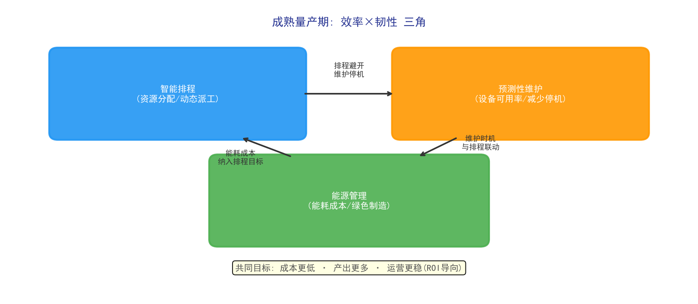
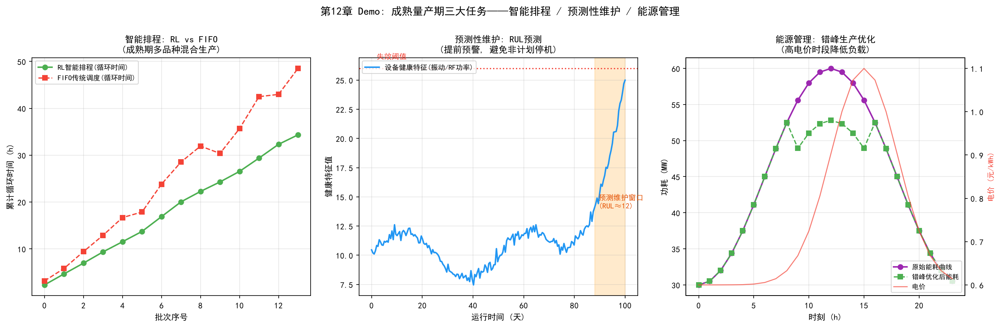

# Chapter 12: Mature Mass Production — Efficiency and Resilience in Stable Operations

## 12.1 Phase Overview: Core Contradictions After Stable Production

Once yield reaches target levels and capacity reaches design values, the fab enters mature mass production. The business environment of this phase is "competition within stability": yield and capacity are no longer the main contradictions (they are the "entry ticket"); **cost, efficiency, and quality consistency** become central:

- **Cost**: every 1% gain in capacity utilization or 1 point of equipment OEE means tens of millions of dollars in annual returns
- **Efficiency**: with the same equipment investment, shorter cycle times and higher output are competitiveness itself
- **Resilience**: stable operation under equipment aging, market fluctuation, and sudden disruptions (rush orders, tool failures)

The mature phase lacks the "0-to-1" drama of the construction phase, but every optimization step is real money. This chapter focuses on three core mature-phase tasks: smart scheduling, predictive maintenance, and energy management.

*Figure 12-1: Mature-phase three-task linkage — scheduling/maintenance/energy co-optimization*

## 12.2 Task 1: Smart Scheduling

### Scheduling Challenges in the Mature Phase

The typical feature of mature mass production is **mixed-product production**: multiple products (different processes, due dates, priorities) run in parallel on the same line. Traditional static dispatch rules (FIFO, due-date priority) degrade visibly in complex scenarios. Combined with dynamic disruptions (tool failures, rush orders, bottleneck shifts), scheduling becomes a high-frequency dynamic decision problem:

- Which tool does the next lot go to?
- Among lots queued before the bottleneck tool, which runs first?
- When a tool fails, which lots need re-routing?

### Scheduling Optimization Objectives

Smart scheduling must simultaneously optimize multiple conflicting objectives:

| Objective | Meaning |
| --- | --- |
| Shorter cycle time | Wafers move from start to finish faster |
| Higher bottleneck utilization | Bottleneck tools never idle |
| On-time delivery | Customer orders delivered on schedule |
| Load balancing | Even workload across tools, avoiding local congestion |

### The Role of AI: From Rules to Reinforcement Learning

Traditional scheduling relies on manual rules (encoded expert experience), effective in stable scenarios but inadequate under mixed products and high disturbance. AI intervention has two levels:

- **Prediction layer**: use machine learning to predict WIP flow, bottleneck shifts, and output — "seeing problems ahead of time" and providing forward-looking information for dispatch decisions
- **Decision layer**: use reinforcement learning (RL) to train dispatch policies — model scheduling as a Markov decision process, with the policy network directly outputting dispatch decisions, trained in simulation and deployed to the line (see Chapter 16, Behaviorism)

For industrial validation, the AISSI project validated deep RL scheduling (DQN, MARL) on real industrial datasets, achieving about 9% output improvement in simulation and line validation (see Chapter 16).

## 12.3 Task 2: Predictive Maintenance

### Equipment Maintenance Problems in the Mature Phase

As equipment ages, component aging raises failure rates. Traditional maintenance strategies are periodic preventive maintenance (PM) and breakdown-based corrective maintenance, each with costs: **too-frequent PM wastes capacity** (every downtime for maintenance is lost capacity), while **insufficient PM raises the risk of unscheduled downtime** — and unscheduled downtime costs far more than planned: it disrupts schedules, delays deliveries, and can scrap lots.

### The Predictive Maintenance Task Chain

1. **Condition sensing**: extract health features from equipment FDC sensor data (vibration, temperature, current, pressure)
2. **Remaining useful life (RUL) prediction**: predict how long components can safely run, outputting a "suggested PM time window"
3. **Failure early warning**: detect abnormal signs (parameter drift, signal anomalies) and alert in advance
4. **Maintenance decision optimization**: combine with production scheduling to decide "when downtime causes the least loss"

### The Role of AI

- **Anomaly detection**: use time-series models (LSTM, Transformer, etc.) to detect abnormal drift in equipment parameters (see Chapter 15, Connectionism)
- **RUL prediction**: train life-prediction models from historical failure data and degradation trajectories (see Chapter 8 for predictive maintenance technology)
- **Maintenance decisions**: jointly optimize "maintenance timing" with "production scheduling" using optimization/RL — balancing equipment risk against capacity loss

The value of predictive maintenance is not only reducing downtime, but converting maintenance from a "planned fixed cadence" to a "data-driven dynamic cadence" — critical in the mature phase where every minute of capacity is expensive.

## 12.4 Task 3: Energy Management

### The Energy Problem of Wafer Fabs

A wafer fab is a typical energy hog: the annual electricity bill of an advanced fab runs into the hundreds of millions of dollars. The cleanroom (constant temperature/humidity, ultraclean ventilation), process tools (high-temperature furnaces, plasma equipment), and support systems (cooling, compressed air, wastewater treatment) are the main consumers. With global decarbonization trends (the semiconductor industry accounts for about 0.3% of global carbon emissions, still growing) and rising electricity prices, energy management is moving from a "back-office cost" to "strategic competitiveness."

### The Energy Management Task Chain

1. **Energy monitoring**: establish tool-level, zone-level, and fab-level energy baselines (which tools consume how much, when peaks occur)
2. **Energy prediction**: forecast future energy curves from production plans, identifying peaks and valleys
3. **Dynamic optimization**: optimize energy use under production constraints — off-peak production (reducing non-critical loads during high-price periods), tool standby strategies (idle tools into low-power standby), dynamic cleanroom HVAC optimization (adjusting fresh-air volume to production load)
4. **Efficiency assessment**: incorporate energy consumption into tool selection, process evaluation, and operations assessment

### The Role of AI

- **Energy prediction**: time-series models predict energy consumption to inform peak-shifting and scheduling
- **Optimized scheduling**: add "energy cost" to the scheduling objective function — doing the same work in low-price periods costs less (linked to 12.2 smart scheduling)
- **Anomalous energy detection**: identify abnormal equipment energy consumption (e.g., a chamber's power suddenly rising, possibly signaling a fault)

Energy management is an underestimated direction for mature-phase AI: it requires no process change, delivers direct, quantifiable cost savings, and aligns with green manufacturing (ESG) trends.

## 12.5 Key Points for AI Deployment in the Mature Phase

The core of mature-phase AI deployment is **ROI orientation** — every project must map to explicit cost/efficiency metrics:

1. **Start with high-certainty projects**: predictive maintenance (reduced unscheduled downtime) and virtual metrology (freed metrology capacity) deliver quantifiable, fast results — suitable as first-wave mature-phase AI projects
2. **Deep integration with production systems**: mature-phase AI is not a standalone tool; it must integrate deeply with MES, APC (advanced process control), and FDC — AI outputs go directly into the production decision chain
3. **Continuous iteration mechanism**: with abundant data in the mature phase, models can be iterated continuously; establish a "training-evaluation-deployment-feedback" operating mechanism

*Figure 12-2: Smart scheduling, predictive maintenance, and energy management*

> **Chapter experiment**: Experiment 11 in Chapter 27 (`demos/experiments/predictive_maintenance_rul`) predicts RUL from synthetic degradation data and compares the cost of periodic PM vs predictive maintenance — run it to see why "when to maintain" matters.

## 12.6 Chapter Summary

Mature mass production is the "harvest" phase of a fab; the core contradiction shifts from "getting it made" to "making it cheap, fast, and stable." Smart scheduling solves "how resources are allocated," predictive maintenance solves "keep equipment from failing," and energy management solves "every kilowatt-hour spent wisely." Their common feature: AI outputs convert directly into quantifiable cost and efficiency gains. For mature fabs, AI is not a bonus but a necessity for cost competitiveness — when competitors produce 9% more through smart scheduling and cut unscheduled downtime by 20% through predictive maintenance, fabs that do not adopt AI face a structural disadvantage.
