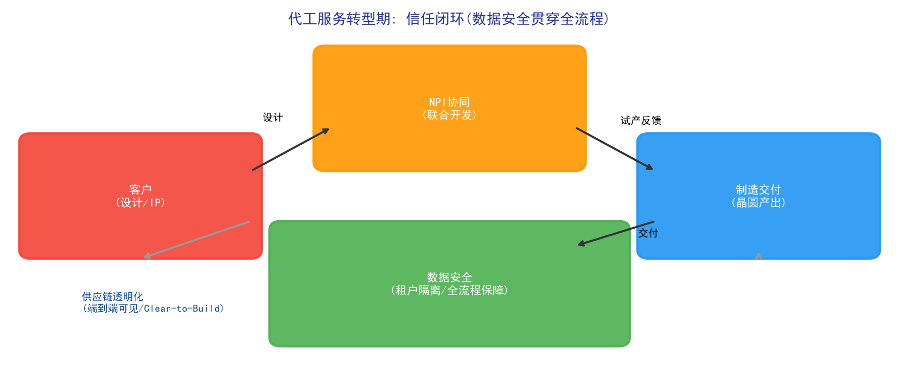

# Chapter 13: Foundry Service Transformation — From "Manufacturing" to "Service"

## 13.1 Phase Overview: Business Characteristics of Foundry Services

The semiconductor industry has two basic business models: IDM (integrated device manufacturer — designs and manufactures in-house) and Foundry (manufactures only, without designing). When a fab transitions from IDM to foundry services, or expands from a single-customer manufacturing plant to a multi-customer foundry, the business logic changes fundamentally:

- **Multiple customers and projects in parallel**: different customers have different design rules, process needs, and delivery requirements; the line must serve dozens of customers' hundreds of projects simultaneously
- **Customers are "gods" and "competitors"**: customers' IP must be absolutely protected, yet customers need deep involvement in process development (joint NPI)
- **Trust is the core asset**: foundry service is fundamentally selling trust — customers hand over their most precious chip designs for you to manufacture; data security, delivery reliability, and supply chain transparency are indispensable

The core tasks of the transformation phase expand from "making good wafers" to three service-capability dimensions: NPI collaboration, data security, and supply chain transparency.

*Figure 13-1: Foundry service trust loop — NPI collaboration, data security, and supply chain transparency*

## 13.2 Task 1: NPI Collaboration

### NPI Challenges in the Transformation Phase

In foundry mode, NPI (new product introduction) is no longer an internal process but a **joint process with customers**:

- **Parallel multi-customer NPIs**: multiple customers introduce new products simultaneously, competing for pilot lines, experimental wafers, and engineering resources — "whose NPI goes first" is a complex resource allocation problem
- **Design-process co-optimization**: customer designs (layouts, design rules) must match the foundry's process capability — design-technology co-optimization (DTCO) must be done across organizations (methodology in Chapter 9)
- **Scarce pilot windows**: pilot-run windows at advanced nodes are extremely limited; missing one means waiting for the next round, so NPI scheduling directly affects customers' time-to-market

### The NPI Collaboration Task Chain

1. **Collaborative design**: customers design based on the foundry's PDK (process design kit); both sides collaborate on design rule checking (DRC) and design for manufacturability (DFM)
2. **Joint NPI scheduling**: NPI projects from multiple customers are scheduled jointly, dynamically allocating pilot lines, experimental wafers, and engineering resources
3. **Pilot feedback loop**: pilot results (yield, electrical parameters, defects) are fed back to customers in real time; customers revise designs for the next pilot round
4. **Knowledge accumulation**: consolidate cross-customer NPI experience into reusable engineering knowledge

### The Role of AI

- **NPI scheduling optimization**: dynamically allocate resources among multi-customer NPIs with optimization/RL (methodology in Chapter 16, Behaviorism)
- **Design-process co-optimization assistance**: use machine learning to quickly evaluate the yield risk of customer layouts, discovering design-process mismatches early (echoing the design-assistance scenarios of Chapter 22, LLMs)
- **NPI knowledge base**: structure historical NPI problem-solution records into a searchable engineering knowledge base to assist engineers

## 13.3 Task 2: Data Security

### Why Data Security Is the Life-and-Death Line of Foundry

A foundry manufactures chips for multiple customers, and every customer's design data (GDS layout), process data, and yield data are highly sensitive trade secrets — **if customer A's data leaks to customer B, the foundry loses all customers' trust**. Historically, data security incidents directly caused foundries to lose major customers. Data security in foundry service is not just a compliance requirement; it is the lifeline of the business model.

### The Data Security Task Chain

1. **Tenant isolation**: establish logical isolation for each customer at the data, application, and network layers — customer A's engineers see none of customer B's data
2. **Access control**: role-based fine-grained access control (who can access what data under what conditions), least-privilege principle
3. **Data loss prevention (DLP)**: monitor data movement (export, printing, external system interactions) to prevent data leaving through unauthorized channels
4. **Audit trail**: fully record data access behavior, supporting post-hoc audit and security incident investigation

### The Role of AI

- **Anomalous access detection**: behavior analysis detects abnormal data access patterns (e.g., large downloads at night, unusual export behavior), catching insider threats earlier than rule-based detection
- **Data masking**: mask shared data without destroying analytical value (e.g., hiding customer identity when sharing process trend data)
- **Federated learning**: train shared models across customers without sharing raw data — "data stays put, models move," the best practice for protecting customer data while leveraging multi-source data in foundry scenarios

### Case Perspective: Semiconductor Data-Sharing Platforms

The industry has already produced platforms specifically resolving the "data sharing vs. security" contradiction. For example, Athinia (the Palantir-Merck semiconductor data joint venture) uses a secure Ontology data architecture that enables chipmakers and material suppliers to collaborate without their data leaving their domains, achieving applications such as CMP predictive manufacturing (see Chapter 24, Palantir).

## 13.4 Task 3: Supply Chain Transparency

### Supply Chain Challenges in the Transformation Phase

The foundry sits at the hub of the semiconductor supply chain: upstream are equipment, material, and chemical suppliers; downstream are chip-design customers and assembly/test houses. Any supply chain disruption directly impacts delivery commitments:

- **Geopolitics and sudden events**: export controls, natural disasters, and pandemics can interrupt key equipment/material supply
- **Delivery commitments**: customers depend on foundry commitments to plan their own production; missing a commitment means losing a customer
- **Capacity allocation**: when demand exceeds supply, deciding which customers get limited capacity is both sensitive and critical

### The Supply Chain Transparency Task Chain

1. **End-to-end visibility**: full visibility from raw materials, work-in-process, to finished-goods shipment — the source, status, and location of every material batch
2. **Risk prediction**: identify supply chain risks (a material supplier's delivery delay, a spare-parts gap for certain equipment) and alert in advance
3. **Demand-capacity matching**: match customer demand forecasts with factory capacity models to find capacity gaps early
4. **Commitment management**: give trustworthy delivery commitments based on real-time capacity status (Clear-to-Build — confirming "this order can start now")

### The Role of AI

- **Supply chain prediction**: machine learning predicts equipment/material delivery lead times and market demand fluctuations
- **Risk early warning**: graph/rule + data models identify supply chain risk transmission paths (e.g., a key material depending on a single supplier)
- **Capacity allocation optimization**: optimize capacity allocation across customer priority, profit, and long-term relationships
- **Case perspective**: one of Palantir Foundry's three official semiconductor workflows is "strategic CAPEX simulation and supply chain visibility"; European IDMs use it for multi-fab capacity visibility, end-to-end supply chain visibility, and Clear-to-Build checks (see Chapter 24)

## 13.5 Key Points for AI Deployment in the Transformation Phase

AI applications in the foundry transformation phase have three particularities:

1. **Trust before technology**: data security capability is not an "optional AI feature" but a business-model prerequisite — AI projects (especially those involving cross-organization data) must pass security and compliance assessment first
2. **Multi-party collaboration is the norm**: NPI collaboration and supply chain collaboration involve external organizations; AI systems must support controlled cross-organization data sharing (federated learning, secure data platforms) rather than one-party data aggregation
3. **Service-metric orientation**: evaluation metrics expand from manufacturing metrics (yield, OEE) to service metrics — NPI cycle time, customer satisfaction, data security incident count, on-time delivery rate

*Figure 13-2: NPI collaboration, data security, and supply chain transparency*

## 13.6 Chapter Summary

The foundry service transformation marks a fab's leap from "manufacturing capability" to "service capability." NPI collaboration solves "how to build new products together with customers," data security solves "how to make customers confident handing over their designs," and supply chain transparency solves "how to honor delivery commitments." The common theme of all three is **trust** — and AI's role in this phase is building the infrastructure that supports trust: secure shared-data architectures, explainable collaborative decisions, and transparent supply chain status. For foundries, AI competitiveness lies not only in line efficiency but in the ability to earn "customers willing to entrust their most core designs to you."

> **Hands-on experiment for this chapter**: The FabGraph dual-graph platform in Section 27.5 of Chapter 27 (`demos/experiments/FabGraph_MVP`) demonstrates the technical foundation of the "data as a service" transformation — Schema/Lineage dual graphs driving metadata governance and semantic retrieval, letting you experience the full chain from natural-language question to graph-recommended JOIN paths to generated SQL.
