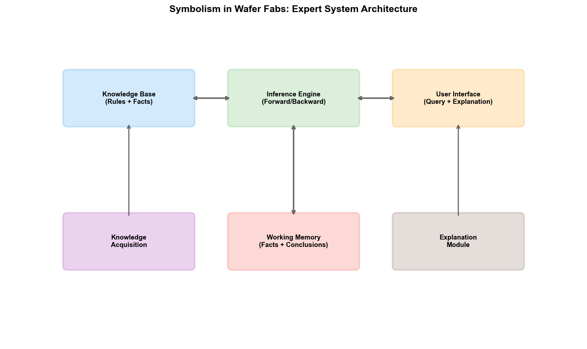
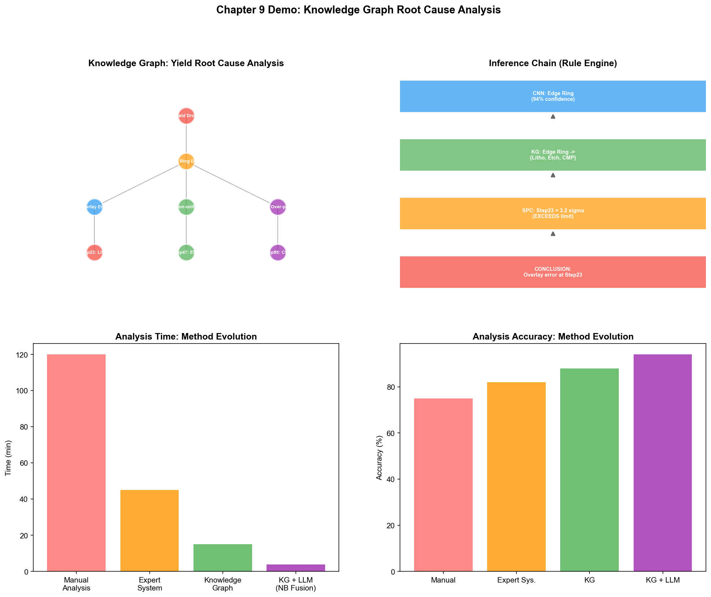

# Chapter 14: Symbolism in the Wafer Fab

## 14.1 Expert Systems in Process Diagnosis

The earliest application of symbolism in semiconductor manufacturing can be traced back to expert systems in the 1980s. At that time, several leading wafer fabs attempted to use rule engines to assist in process diagnosis—encoding senior engineers' experience as "if-then" rules to help younger engineers quickly locate problems.

### PID/YED: Defect Root Cause Analysis Expert Systems

In yield management, defect root cause analysis (RCA) is one of the most experience-dependent activities. A senior YED engineer, upon seeing a certain wafer map pattern, can quickly associate the spatial defect distribution with a specific process step and equipment. This ability is essentially the implicit application of a large number of "if...then..." rules.

An early RCA expert system might contain rules such as:

```
Rule R001:
  IF    wafer map shows edge-ring defects
  AND   defect type is particle
  THEN  possible root cause: poor edge cleaning process (confidence: 0.8)
        suggested check: edge cleaning equipment

Rule R002:
  IF    wafer map shows center-circle defects
  AND   defect density > threshold
  THEN  possible root cause: lithography lens contamination (confidence: 0.7)
        suggested check: lithography scanner lens 3

Rule R003:
  IF    wafer map shows cluster defects
  AND   cluster center corresponds to a chamber location
  THEN  possible root cause: chamber particle shedding (confidence: 0.9)
        suggested check: consumable status of the corresponding chamber
```

The advantage of this approach is interpretability—the system not only provides root cause judgments but also the reasoning chain, allowing engineers to verify each step. The disadvantages are equally apparent: rules require manual maintenance, cannot cover all situations, and when the process node changes, rules need to be rewritten.

Although expert systems as a standalone technology are no longer mainstream, their core idea—explicitly encoding process knowledge into machine-processable forms—has been continued and upgraded in knowledge graphs and ontologies.

### PE/EE: Equipment Fault Diagnosis Expert Systems

Equipment fault diagnosis is another scenario well suited for symbolic reasoning. The fault tree of a semiconductor equipment tool can be very complex—from the top-level symptom of "product yield degradation," to "etch rate deviation," to "RF power instability," to "matcher tuning abnormality," to "matcher motor aging"—forming a multi-layer causal chain.

Fault diagnosis expert systems locate faults through backward reasoning: starting from observed symptoms, tracing downward along the fault tree to find the most likely root cause component. Every step of reasoning in this process can be traced back to specific causal rules—"if RF reflected power suddenly increases, then the matcher may not be properly tuned."

Some wafer fab EE departments still use fault diagnosis systems built with CLIPS or Jess for new employee training assistance and rapid fault localization. Although these systems are not "intelligent" enough, their practical value in specific scenarios has been validated over time.

## 14.2 Knowledge Graphs in Yield Management

Knowledge graphs are the most mature form of symbolism in contemporary industrial scenarios. Compared to the rules of expert systems, knowledge graphs use graph structures to express relationships between entities, naturally supporting multi-hop association queries—which is extremely valuable in cross-step, cross-system yield root cause analysis.

### Wafer Fab Process Knowledge Graph Construction

The core entity types of a wafer fab knowledge graph include:

```
Product entities: Wafer, Die, Device, Layer, Lot, Batch
Process entities: Recipe, ProcessStep, Route, Module
Equipment entities: Tool, Chamber, Component, ConsumablePart
Parameter entities: Parameter, SetPoint, Measurement, CD, FilmThickness
Defect entities: Defect, DefectType, DefectPattern, FailureMode
Test entities: WAT, CP, FT, TestItem, TestResult
Time entities: Timestamp, ProcessPeriod, PMCycle
```

Relationship types between entities include:

```
Wafer -[BELONGS_TO]-> Lot
Wafer -[PROCESSED_AT]-> ProcessStep
ProcessStep -[USES_TOOL]-> Tool
ProcessStep -[USES_RECIPE]-> Recipe
Tool -[HAS_CHAMBER]-> Chamber
Chamber -[HAS_COMPONENT]-> Component
Recipe -[HAS_PARAMETER]-> Parameter
Wafer -[HAS_DEFECT]-> Defect
Defect -[CLASSIFIED_AS]-> DefectType
Wafer -[TESTED_BY]-> CP
CP -[HAS_RESULT]-> TestResult
TestResult -[INDICATES]-> FailureMode
```

When these entities and relationships are organized into a graph, yield analysis shifts from "querying each system individually" to "reasoning on the graph." For example, to answer the question "which equipment parameters in the past week might be related to the CP yield decline of the 3nm product," the traditional approach requires engineers to query data in MES, FDC, SPC, and YMS systems separately, then manually correlate them. In a knowledge graph, this is a multi-hop query starting from the "CP yield decline" node, following the path "INDICATES→FailureMode→CAUSED_BY→Defect→OCCURS_AT→ProcessStep→USES_TOOL→Tool→HAS_PARAMETER→Parameter."

### Defect-Process-Equipment Association Reasoning

The true value of knowledge graphs lies in discovering implicit associations—those that exist in the data but have not been noticed by humans.

A typical scenario is "cross-step defect propagation." A batch of wafers shows normal defect density after Step 45 (lithography) inspection, but yield anomalies are found during Step 67 (CP test). Traditional analysis might directly examine process parameters between Steps 45 and 67, but the true root cause may lie in Step 23—a minor parameter deviation that is invisible at Step 23, but through the amplification of subsequent steps, manifests as yield decline at Step 67.

Knowledge graphs can discover such cross-step causal chains through "association path search." Starting from the "Step 67 yield anomaly" node, searching all associated paths on the graph may reveal a multi-hop association path like "Step 23→Tool A→Parameter X→minor deviation→Step 45→Parameter Y→minor impact→Step 67→yield decline." The discovery of such paths is not through preset rules, but through algorithmic search on the graph—graph traversal, shortest path, random walk, etc.

### Knowledge Provenance for Yield Issues

After a yield issue is resolved, the entire analysis process—phenomenon, hypotheses, verification path, root cause, solution—is recorded in the knowledge graph, forming a reusable knowledge asset. The next time a similar problem occurs, the system can retrieve similar patterns from historical cases to provide reference for the current analysis.

This "experience accumulation and reuse" capability is a major advancement of knowledge graphs over expert systems. The knowledge base of an expert system is static—it can only be updated by manually adding new rules. The knowledge base of a knowledge graph is dynamic—each analysis process can be automatically recorded as new entities and relationships, continuously enriching the graph.



## 14.3 Rule Engines in Manufacturing Scheduling

MFG's dispatching rules are essentially an application of symbolism—encoding the business logic of scheduling as rules, executed by a rule engine. A modern wafer fab's dispatching system typically contains hundreds of rules covering various business constraints:

```
Dispatching rule examples:

Rule D001 (Priority: Urgent):
  IF    Batch.priority == 'HOT'
  THEN  queue_priority = 100

Rule D002 (Priority: High):
  IF    Batch.remaining_time < 24h
  AND   Batch.remaining_steps > 5
  THEN  queue_priority = 90

Rule D003 (Recipe switching optimization):
  IF    Tool.current_recipe == Batch.needed_recipe
  THEN  priority_bonus += 20  // Avoid recipe switching

Rule D004 (Bottleneck protection):
  IF    Tool.is_bottleneck == true
  AND   Tool.queue_length < 2
  THEN  prioritize dispatching to this tool  // Avoid bottleneck tool idle

Rule D005 (Process constraint):
  IF    Batch.product == 'ProductA'
  AND   Tool.last_product == 'ProductB'
  THEN  required set_up_time = 30min  // Product switch requires cleaning
```

The advantage of rule engines is readability and maintainability—manufacturing engineers can directly modify rules without changing code. When business requirements change (e.g., adding a new product line, adjusting priority rules), only the rule base needs to be updated.

The limitation of rule engines is the inability to handle conflicts and interactions between rules—when multiple rules apply simultaneously, how to synthesize the outputs of multiple rules to make a final decision? Traditional methods use fixed priorities or weighted sums, but this approach cannot adapt to dynamically changing production line states. This is exactly where behaviorism (reinforcement learning) can complement—using RL to learn optimal rule combination strategies.

## 14.4 Ontology in Process Integration

### Ontological Modeling of Process Flows

A core difficulty in PID management is that process knowledge is scattered across multiple systems—process specifications in SPEC documents, equipment parameters in the FDC system, measurement data in the SPC system, defect data in the YMS system, and batch tracking in MES. Each of these systems defines its own data model, with different terminology and formats—"step" in MES may correspond to "operation" in the SPC system and "stage" in the YMS system.

The role of ontology is to establish a unified semantic layer for these heterogeneous data. A wafer fab ontology defines the precise meanings of core concepts and their relationships:

```
Class: ProcessStep
  SubClassOf: ManufacturingActivity
  Properties:
    - hasOrder (integer)          // Step order
    - usesTool (Tool)             // Tool used
    - usesRecipe (Recipe)         // Recipe used
    - hasParameter (Parameter)    // Parameters included
    - precedes (ProcessStep)      // Preceding step
    - follows (ProcessStep)       // Following step
    - producesResult (Measurement)// Output result

Class: Wafer
  Properties:
    - belongsTo (Lot)
    - hasProcessHistory (ProcessStep)  // Processing history
    - hasDefect (Defect)               // Defect records
    - testedBy (Test)                  // Test records
```

With this ontology, "step 45" in MES, "operation 45" in SPC, and "stage 45" in YMS are all mapped to the same `ProcessStep` instance in the ontology—they refer to the same process step, just using different names in different systems. This semantic alignment is the foundation for cross-system data fusion.

### Cross-Departmental Knowledge Sharing

Another value brought by ontology is cross-departmental knowledge sharing. PID, YED, MFG, PE, and EE each have different focuses, but they face the same wafer fab—the same products go through the same equipment and the same processes. Without a unified semantic model, each department maintains its own data view, and data transfer between departments inevitably leads to misunderstandings and information loss.

As a "universal language," ontology enables different departments to communicate based on the same conceptual system. The "process window" concept defined by PID, the "defect classification" system defined by YED, the "dispatching rule" set defined by MFG, and the "Recipe parameter" space defined by PE—all of these can be expressed within the same ontological framework, and cross-domain knowledge transfer can be achieved through the association relationships in the ontology.

## 14.5 Case Study: Knowledge Graph-Based Yield Analysis System

A 300mm advanced process wafer fab deployed a knowledge graph-based yield root cause analysis system. The core architecture of the system is as follows:

**Data source layer:** MES (batch tracking, operation times), FDC (equipment sensor time-series data), SPC (measurement data, control chart status), YMS (defect data, CP/FT results), Recipe management system (process parameter configuration).

**Knowledge graph layer:** Maps data from the above systems uniformly into entities and relationships in the ontology. The graph contains approximately 5 million entity nodes and 20 million relationship edges, covering six domains: product, process, equipment, parameters, defects, and testing. Data is updated daily in batches through ETL pipelines, with critical data (e.g., FDC alarms, CP results) updated in real time through message queues.

**Reasoning engine layer:** A hybrid engine based on graph algorithms and rule reasoning. Graph algorithms are used for association path search (searching possible causal paths starting from yield anomaly nodes), and rule reasoning is used for logical inference based on domain knowledge (e.g., "if defect type is particle and distribution corresponds to a chamber location, then suspect contamination of that chamber").

**Application layer:** Provides yield dashboards, root cause analysis guides, knowledge retrieval, and other applications. When an engineer enters "Lot B12345's CP yield dropped from 92% to 85%," the system automatically retrieves the full process history of that batch in the graph, identifies abnormal parameters and possibly associated equipment, generates a list of root cause hypotheses, and annotates each hypothesis with a confidence level and reasoning path.

The system's results: average root cause analysis time was reduced from 4–8 hours to 30–60 minutes, and root cause localization accuracy (compared with manual PFA results) improved from 65% to 82%. The greatest value lies not in speed—but in the system's ability to discover cross-step associations that are difficult for human engineers to notice, as these associations typically involve causal chains of 5 or more steps, exceeding the working memory capacity of the human brain.

## 14.6 Practice Research: Symbolism Tools and Deployment Cases

### Samsung: Knowledge Graph + LLM for Sensor Anomaly Detection

Samsung used knowledge graphs combined with LLMs to achieve sensor naming alignment and anomaly detection in its autonomous semiconductor manufacturing system.

The sensor naming problem of semiconductor equipment is a typical obstacle to data fusion—different vendors' equipment uses different naming conventions, and sensor signals may change after equipment maintenance. Samsung's approach:

- Use knowledge graphs to automatically align and harmonize sensor naming—mapping sensor names from different systems to a unified semantic layer
- Use LLM for semantic reasoning—when equipment signals change after maintenance, the knowledge graph's community detection helps identify subtle changes in inter-sensor network relationships
- Specific case: after maintenance, knowledge graph analysis revealed a slight change in sensor values for a reactor outer membrane—traditional analysis did not detect this association; KG+LLM revealed a previously overlooked sensor relationship

Samsung also deployed an autonomous fault maintenance system during 2021–2025, covering 762 lithography tools and processing over 85,000 real faults. The system integrated graph-based log analysis, LLM semantic reasoning, and hybrid retrieval mechanisms—mean time to repair (MTTR) was reduced by 7 minutes. This is a typical practice of fusing symbolism (graph-structured knowledge representation + rule reasoning) with connectionism (LLM).

### yieldWerx: Root Cause Knowledge Graphs

yieldWerx's Root Cause Knowledge Graphs product applies knowledge graphs directly to semiconductor yield analysis:

- Visual guides lead users along weighted paths to identify root causes for low-yield batches, wafers, customer returns, and other scenarios
- AI and ML algorithms reduce analysis time from manual hours/days to minutes
- MPS case: product engineering team significantly shortened analysis time for yield issues

yieldWerx's practice demonstrates that the value of knowledge graphs in wafer fabs lies not in how "big" the graph itself is, but in linking data originally scattered across MES, YMS, and FDC into a traceable causal chain—engineers can follow this chain step by step from "yield decline" to "a parameter anomaly on a specific piece of equipment."

### IKAS: Smart RCA Platform

IKAS's Smart RCA (Root Cause Analysis) platform is a commercial deployment of knowledge reasoning in yield management:

- **Multi-source data fusion:** Breaks down data silos between FDC, SPC, MES, and YMS, achieving wafer-level data connectivity
- **Golden Tool/Path comparison:** Compares suspect batches with golden standard tools and process paths; AI association analysis identifies process drift and anomaly root causes
- **Results:** Root cause identification time reduced by over 80%

Smart RCA represents the engineering of symbolic methods in wafer fabs—it is not pure graph database querying, but encodes domain knowledge (Golden Tool concepts, process path rules) as reasoning logic, using AI to accelerate the reasoning process.

### Historical Perspective: The Evolution of Expert Systems in Semiconductor Manufacturing

The application of expert systems in the semiconductor industry has a long history:

**BIPS (1987):** An IC manufacturing expert system jointly developed by UC Berkeley and SRC (Semiconductor Research Corporation)—using production rules and backward chaining reasoning to automatically generate IC process Recipes (e.g., polysilicon process Recipes). BIPS was one of the earliest academic projects to validate the feasibility of expert systems in semiconductor manufacturing.

**GID3 (1993):** An expert system rule machine learning project jointly conducted by SRC member companies—automatically learning rules from RIE (Reactive Ion Etching) process data, applied to RIE process anomaly detection, parameter optimization, and emitter trial production consultation. GID3 validated the ability to identify relationships between RIE anomalies and parameter settings across 5 different projects.

**CLIPS (1985 to present):** A C Language Integrated Production System developed by NASA Johnson Space Center—running production rules on PCs and Unix workstations without requiring dedicated Lisp machine hardware. CLIPS is still maintained today and is used in wafer fab EE departments' equipment fault diagnosis systems.

From BIPS to today's KG+LLM systems, the technological form of symbolism in wafer fabs has evolved through "rules→ontology→knowledge graph→knowledge graph+LLM"—the core idea has always been "to explicitly represent domain knowledge as machine-reasonable structures."

### The Frontier of Neuro-Symbolic AI

Academic frontiers are exploring neuro-symbolic AI frameworks that deeply fuse symbolism with connectionism, applied to semiconductor zero-defect manufacturing:

- Integrating FMEA (Failure Mode and Effects Analysis) and expert knowledge into structured physics-aware ontologies
- Combining knowledge graphs, ontologies, and deep neural networks—graphs provide structured domain knowledge constraints, neural networks learn patterns from data
- Achieving real-time defect prediction, diagnosis, and mitigation

This fusion direction represents the future of symbolism—not used alone, but combined with connectionism and behaviorism, each complementing the other's strengths.

---

The value of symbolism in wafer fabs is not to replace deep learning—it cannot identify defects from images, nor can it predict equipment faults from time-series signals. Its value lies in organization and reasoning: organizing heterogeneous data scattered across dozens of systems into a unified semantic network, allowing both humans and machines to perform association queries and causal reasoning on this network. The above cases—Samsung's KG+LLM sensor analysis, yieldWerx's root cause knowledge graphs, IKAS's Smart RCA—prove that this capability is transitioning from an academic concept to a commercial product. The next two chapters will turn to connectionism and behaviorism, which provide the ability to learn and optimize from data, complementing symbolism. The fusion of the three will reach its climax in Part 5 (LLM/Agent) and Part 6 (Ontology).

## 14.7 Demo Visualization: Knowledge Graph-Based Yield Root Cause Analysis



*Demo description: Top-left is the yield root cause analysis knowledge graph visualization, top-right is the rule engine reasoning chain, bottom-left is the reasoning timeline, bottom-right is the comparison between traditional methods and KG methods. Simulation script: `demos/demo_ch14_kg_rca.py`.*

> **Hands-on experiments for this chapter**: Two experiments echo this chapter — the Wafer Fab Ontology MVP in Section 27.4 of Chapter 27 (`demos/experiments/wafer_ontology_mvp`) demonstrates the complete engineering form of knowledge-graph-assisted root cause analysis; FabGraph in Section 27.5 (`demos/experiments/FabGraph_MVP`) shows how symbolic metadata governance supports semantic retrieval and NL2SQL.
