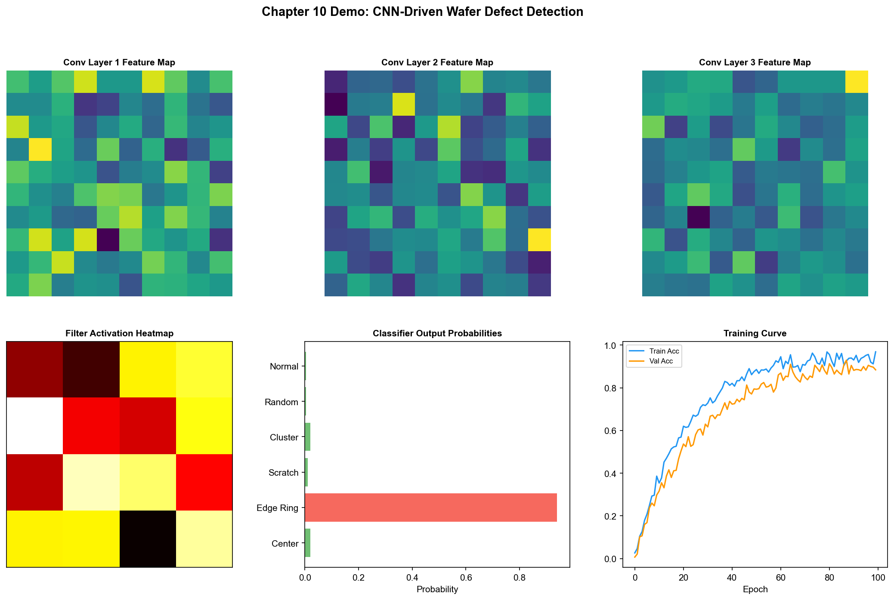
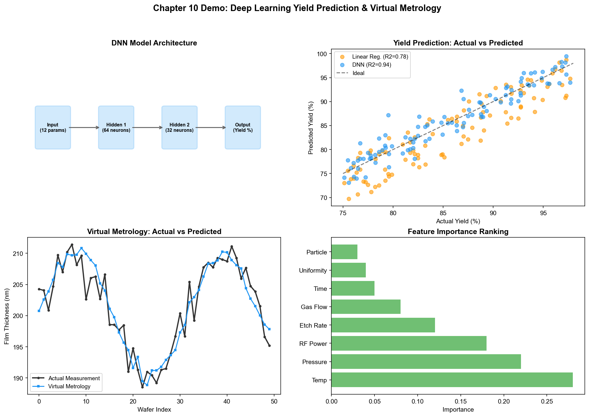
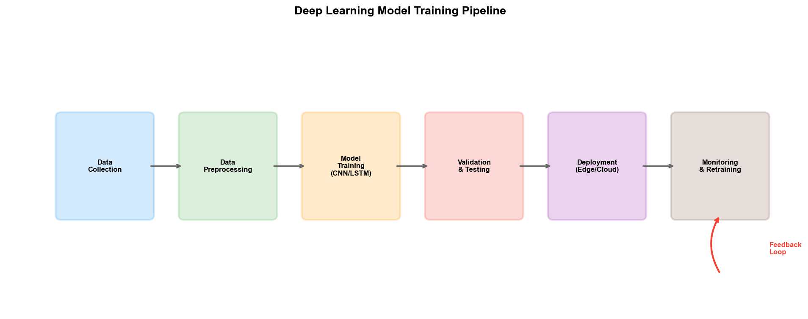

# Chapter 15: Connectionism in the Wafer Fab

## 15.1 Deep Learning in Yield Prediction

Connectionism—particularly deep learning—has far broader applications in semiconductor wafer fabs than symbolism. The reason is simple: wafer fabs generate massive amounts of image data (defect inspection), time-series data (FDC sensors), and tabular data (measurement results) every day, and deep learning excels at extracting patterns from such high-dimensional data.

### PID/YED: CNN-Based Wafer Map Defect Classification

The wafer map is YED's most core analytical object. After CP testing, each wafer generates a two-dimensional grid map, where each grid point represents a die, marked as "pass" or "fail." The spatial distribution patterns of failed dies—edge-ring, center-circle, stripe, random scatter, cluster—directly imply different root causes.

Traditional wafer map pattern recognition relies on handcrafted features—calculating radial distribution, angular distribution, connected region area, and other statistical measures of defects, then classifying with SVM or decision trees. This approach requires feature engineering—manually designing features—and the quality of feature design directly determines classification performance.

CNNs revolutionized this process. By treating the wafer map as a two-dimensional image (failed die = 1, passed die = 0) and feeding it into a CNN for end-to-end training—the network automatically learns visual features that distinguish different defect patterns from data, without manual feature design.

A typical wafer map CNN classifier architecture:

```
Input: 64×64 binary wafer map
  │
  ├─ Conv2D(32, 3×3) + ReLU + MaxPool(2×2)  → 32×32
  ├─ Conv2D(64, 3×3) + ReLU + MaxPool(2×2)  → 16×16
  ├─ Conv2D(128, 3×3) + ReLU + MaxPool(2×2) → 8×8
  ├─ Flatten + Dense(256) + ReLU + Dropout(0.5)
  └─ Dense(9) + Softmax  → 9 defect pattern classifications
```

Common wafer map defect patterns include: Center (center defects), Donut (ring-shaped defects), Edge-Loc (edge-localized), Edge-Ring (edge-ring), Loc (localized cluster), Random (random scatter), Scratch (scratches), Near-full (large-area defects), None (no anomaly).

In a 2025 publication, NVIDIA applied vision-language models (e.g., Cosmos Reason) to wafer map defect classification, achieving few-shot learning—training a usable classifier with only a small number of labeled samples, reducing model construction time by up to 2x. The advantage of this approach is that vision-language models can generate natural language explanations—not only classifying defect types but also describing "this defect is concentrated in the northeast quadrant of the wafer, exhibiting a radial distribution, which may be related to illumination non-uniformity in Step 23 lithography."

### Yield Prediction Models

Wafer map classification addresses the problem of "identifying defect patterns." A further challenge is "predicting yield"—predicting the final yield of a wafer while it is still flowing through the production line.

The input to yield prediction is all data up to the current process step—FDC time-series data, SPC measurement data, equipment status data. The output is the predicted CP yield.

An end-to-end yield prediction model needs to fuse multimodal data:

- **Time-series data** (FDC sensor signals) → LSTM/Transformer encoding
- **Tabular data** (SPC measurement values, equipment parameters) → MLP encoding
- **Image data** (defect inspection results) → CNN encoding
- **Multimodal fusion** → concatenate encoding vectors from each modality → fully connected layers → yield prediction value

The core challenge of such models lies not in the network architecture—but in the data. Aligning data from MES, FDC, SPC, and YMS along the time axis, handling missing values (some steps may not have measurement data), handling different sampling frequencies (FDC at hundreds of points per second, SPC at one value per batch)—these data engineering tasks account for over 80% of the total project effort.

## 15.2 Time-Series Models in Equipment Monitoring

### PE/EE: LSTM in Equipment Parameter Prediction

The FDC system collects hundreds of equipment sensor channels per second, forming long time-series signals. These signals contain rich information about equipment health status—but human engineers can only monitor a few key parameters by viewing control charts or trend plots. LSTM can simultaneously monitor hundreds of parameters and capture their temporal correlations.

A typical equipment anomaly detection process:

1. **Data collection:** Obtain sensor time-series data for each batch processed by the equipment from the FDC system (temperature, pressure, RF power, etc., at tens to hundreds of sampling points per second)
2. **Preprocessing:** Align the time axis, normalize, extract statistical features (mean, variance, slope, etc.)
3. **Model training:** Train an LSTM autoencoder using historical data from normal operating states—the model learns to reconstruct the "normal pattern" of normal operating signals
4. **Anomaly detection:** During online operation, if the model's reconstruction error for the current signal suddenly increases, it indicates the signal has deviated from the normal pattern, triggering an anomaly alarm

The advantage of LSTM autoencoders is that they do not require labeled anomaly data—training only on normal operating data, any signal that deviates from "normal" will produce a high reconstruction error. This is particularly practical in wafer fabs, where samples of anomalous events are typically rare.

### Vibration Signal Anomaly Detection

The health status of certain equipment (e.g., vacuum pumps, robotic arms) is closely related to vibration signals. When equipment components wear or loosen, the spectral characteristics of vibration signals change—new frequency components appear, or the amplitude of certain frequencies increases.

Traditional vibration analysis relies on FFT spectral analysis—human experts observe the peak positions and amplitudes in the spectrogram to determine the fault type. 1D-CNN (one-dimensional convolutional neural networks) can directly learn frequency-domain and time-domain features from raw vibration signals, achieving significantly better fault classification accuracy than handcrafted spectral features + traditional classifier methods.

### Predictive Maintenance

The ultimate goal of time-series models is predictive maintenance—predicting the equipment's remaining useful life (RUL) and scheduling maintenance before the equipment actually fails.

The technical pipeline for RUL prediction models:

```
Equipment historical sensor data → Feature extraction → Time-series model (LSTM/Transformer)
  → Health score (0-1, 1=fully healthy)
  → RUL prediction (remaining batches/hours)
  → Maintenance recommendation (immediate maintenance / can continue for N batches)
```

Each step in this chain has technical challenges. Feature extraction requires selecting which sensor signals are most relevant—of hundreds of channels, perhaps only a dozen or so are highly correlated with equipment degradation. Time-series models need to handle variable-length sequences—the equipment's operating history ranges from months to years. RUL prediction requires labeled data—knowing when the equipment actually needed maintenance, but these labels typically can only be determined retrospectively.

TSMC deployed similar "intelligent diagnostic" capabilities in its engineering performance optimization system, achieving continuous monitoring and prediction of equipment health status through "self-learning." Intel's practices in equipment failure prediction demonstrated that ML-based predictive maintenance can issue early warnings days before equipment anomalies occur, significantly reducing unplanned downtime.

## 15.3 Neural Networks in Manufacturing Scheduling

### MFG: Deep Learning-Based Intelligent Scheduling

MFG's scheduling problem is NP-Hard—traditional optimization methods (e.g., genetic algorithms, simulated annealing) can find "good enough" solutions in reasonable time but cannot guarantee global optimality. Deep learning offers another approach: using neural networks to learn the mapping of "what decision should be made in what state."

A typical method is the "Pointer Network." The current production line state (queue lengths of each tool, process progress and due dates of each batch, tool status, etc.) is encoded as a sequence input, and the network outputs the assignment probability of each queued batch on each tool. Through supervised learning to imitate the decisions of human scheduling experts, or through reinforcement learning to optimize long-term objectives (e.g., minimizing total completion time).

The limitation of this approach is: the state space of wafer fab scheduling is enormous, and training data is limited—even with years of historical data, the covered state combinations are only a minuscule portion of the state space. Deep learning models perform well within the range covered by training data but may give unreliable outputs when encountering unseen states.

### WIP Flow Prediction and Bottleneck Prediction

A more practical application is WIP flow prediction—predicting the WIP distribution at each process step over the next few hours and identifying bottlenecks in advance.

This task can be modeled as a time-series prediction problem: input the WIP distribution data from the past N hours, output the WIP distribution for the next M hours. LSTM or Time-Series Transformer can model the temporal patterns of WIP flowing between process steps—e.g., WIP at a certain step typically accumulates after tool PM and is then gradually consumed.

Bottleneck prediction enables MFG to schedule in advance—if a WIP buildup is predicted in the lithography area in 3 hours, the dispatching speed of upstream processes can be adjusted now to prevent the buildup from occurring. This "predictive scheduling" is more efficient than traditional "reactive scheduling."

## 15.4 Computer Vision in Defect Inspection

### ADI/AEI Deep Learning Inspection

ADI (After Develop Inspection) and AEI (After Etch Inspection) are two critical quality inspection nodes in wafer manufacturing. ADI inspects patterns after lithography development—if the pattern is deviated, it can be reworked (stripping the photoresist and re-exposing); AEI inspects the final pattern after etching—at this point rework is no longer possible, and defective wafers can only be scrapped or downgraded.

Traditional automated defect inspection equipment (e.g., KLA's Surfscan) detects defects by comparing adjacent dies or differences from a reference image. The limitation of this method is that it can only detect "areas different from normal" and cannot distinguish the type and severity of defects.

The introduction of deep learning enables "detection" and "classification" to be completed in one step:

1. The inspection equipment scans the wafer and outputs images of suspicious areas
2. CNN classifies each image—distinguishing dozens of defect types including particles, scratches, bridges, breaks, corrosion, etc.
3. Classification results are automatically associated with process steps and equipment

The accuracy of such "automated defect classification" (ADC) systems improved significantly after the introduction of deep learning—traditional handcrafted features + SVM typically achieved 70–80% accuracy, while end-to-end CNN training can achieve over 90% accuracy (depending on defect type and data volume).

### Electron Microscopy Image Analysis

In advanced processes, some critical defects require observation with SEM (Scanning Electron Microscope) or TEM (Transmission Electron Microscope) at high magnification. These electron microscopy images have nanometer-level resolution and can show the three-dimensional morphology and material composition of defects.

Analysis of electron microscopy images traditionally relied entirely on manual labor—engineers needed to examine images one by one and determine defect types and causes. This is an extremely time-consuming task—one engineer may need several hours to analyze a set of electron microscopy images. Deep learning models (e.g., U-Net for image segmentation, ResNet for classification) can automatically identify defect types from electron microscopy images, measure defect dimensions, and even infer defect formation mechanisms.

### Engineering Practice of Automated Defect Classification (ADC)

A practically deployed ADC system typically includes the following components:

**Model training pipeline:**
- Data collection: Automatically collect defect images from inspection equipment
- Data labeling: Engineers classify and label defect images (semi-automated—the model first gives a preliminary classification, and engineers review and correct)
- Model training: Train a CNN classifier on labeled data
- Model validation: Validate accuracy and recall on an independent test set
- Model deployment: Deploy the trained model to the production line's inference server

**Online inference pipeline:**
- Inspection equipment outputs defect images → image preprocessing (cropping, normalization) → CNN inference → classification results
- Classification results → YMS system → association with process steps and equipment → yield analysis report generation

**Continuous learning pipeline:**
- The system continuously collects new defect images
- When the model's confidence on certain images is low, they are automatically sent to the manual labeling queue
- Periodically retrain the model with new data
- Deploy the updated model

This "data→model→deployment→feedback→data" closed loop is the typical pattern for connectionism deployment in wafer fabs. The model is not trained once and done—it needs to continuously learn new defect patterns during ongoing operation, adapting to new process nodes.

## 15.5 Case Study: Deep Learning-Based Wafer Map Analysis at a Leading Foundry

A leading wafer foundry deployed a deep learning-based wafer map automatic analysis system, replacing traditional manual wafer map interpretation.

The system's input is the wafer map generated after CP testing—the pass/fail distribution of thousands of dies on a wafer. The system needs to complete classification within hundreds of milliseconds, categorizing the wafer map into one of 8 predefined defect patterns and annotating anomalous regions.

The technical solution uses ResNet-18 as the base classifier, trained on approximately 500,000 historically labeled wafer maps. To handle class imbalance (some defect patterns have far fewer samples than others), the system uses Focal Loss and data augmentation (rotation, flipping, random masking).

Post-deployment results: classification accuracy reached 93.5%, a 15 percentage point improvement over the previous handcrafted features + SVM approach (78.2%). Classification speed was reduced from 2–3 minutes per wafer manually to 0.5 seconds per wafer automatically. More importantly, the system discovered a previously unrecognized defect pattern—in certain batches, wafer maps exhibited a faint spiral distribution that was classified as "random" during manual interpretation. After the CNN model identified this pattern, YED engineers traced it to a systematic defect caused by a specific CMP process—this discovery had been hidden for months.

This case demonstrates that the value of deep learning in wafer fabs goes beyond "faster and more accurate"—it can discover faint patterns that human visual perception cannot capture, and these patterns may be early signals of important process issues.

## 15.6 Practice Research: Production-Grade Deployment of Connectionism

### SK hynix/Gauss Labs: Panoptes Virtual Metrology—Deep Learning Replacing Physical Metrology

The "yield prediction model" discussed in Section 15.1 has been deployed as a production-grade system at SK hynix. Gauss Labs' Panoptes VM was deployed on SK hynix's production line in December 2022 and is one of the most successful mass production cases of connectionism in wafer fabs.

Technical architecture: Uses equipment sensor data (temperature, pressure, gas flow, and other time-series signals) as input, and predicts the wafer's metrology results (film thickness, refractive index, etc.) through deep learning models. This is essentially a multivariate time-series regression problem—LSTM/Transformer encodes FDC time-series signals and outputs continuous metrology prediction values.

Deployment results:
- Process variation reduced by 21.5% (initial deployment in December 2022), further improved to 29% by February 2024
- Accumulated virtual metrology on over 50 million wafers—more than one wafer per second
- Adaptive Online Model (AOM) handles data drift—when equipment aging or consumable replacement causes data distribution changes, the model automatically adapts

The significance of Panoptes VM is that it validates the feasibility of the "yield prediction" approach described in Section 15.1 in mass production—not predicting final yield, but predicting intermediate metrology results, thereby achieving "every wafer has metrology data" without actual measurement.

### Gauss Labs Universal Denoiser: AI-Enhanced Electron Microscopy Images

The "electron microscopy image analysis" mentioned in Section 15.4 also has a production-grade solution at Gauss Labs. The Universal Denoiser uses AI to remove noise from CD-SEM (Critical Dimension Scanning Electron Microscope) images:

- Image acquisition time reduced to 1/4 of traditional technology
- Expected metrology equipment productivity improved by 42%
- After noise removal, the precision of downstream defect classification and dimension measurement is correspondingly improved

This case demonstrates the practical value of deep learning in electron microscopy image analysis—not replacing human expert judgment, but improving image quality through denoising, making automated analysis more reliable and acquisition faster.

### NVIDIA: Vision Foundation Models—The Leap from CNN to VLM

The ADC system described in Section 15.4 underwent a technological transition in 2025—from CNN to vision-language models (VLM):

**Cosmos Reason VLM:**
- Wafer-level defect classification accuracy exceeding 96% (after fine-tuning)
- Supports few-shot learning—adapting to new process nodes with only a small number of labeled samples
- Generates natural language explanations—"This defect is concentrated in the northeast quadrant of the wafer, exhibiting a radial distribution"
- Supports interactive Q&A and auto-labeling

**NV-DINOv2 VFM (Vision Foundation Model):**
- Die-level defect detection accuracy of 98.51%
- Significantly reduces manual labeling requirements—the model's pre-training has already learned general visual features; fine-tuning requires only minimal labeling

TSMC has already deployed NVIDIA Metropolis and TAO Toolkit on its production line for automated defect inspection—this is the first large-scale validation of VLM application in wafer fab mass production.

### Intel: OpenVINO-Driven In-Line Inspection

Intel uses its in-house OpenVINO toolkit to deploy AI-driven in-line inspection systems for wafer thinning quality inspection:

- Detectable defect types include dimples, scratches, grinding marks, stains, cracks, bubbles, wafer misalignment, and tape misalignment
- In-line inspection combined with AI can detect wafer thinning problems 50% earlier than offline inspection
- Shifting from "end-of-line problem discovery" to "inter-process problem discovery"—reducing the number of affected batches

Intel also provides the Manufacturing AI Suite reference application, containing 4 AI visual inspection applications: tray defect detection, PCB anomaly detection, solder joint void detection, and personnel safety equipment detection—these applications run multiple AI models and multiple camera streams based on the OpenVINO inference engine.

### Applied Materials: AIx—Connectionism Practice in Real-Time Process Visibility

Applied Materials' AIx platform applies deep learning to equipment-level real-time process analytics:

- **ChamberAI:** Sensors + ML algorithms for real-time analysis of chamber-level process variables—this is the commercial product of the FDC anomaly detection described in Section 15.2
- **In-line metrology with high throughput:** Metrology speed increased 100x, resolution improved 50%—deep learning models extract process trends from in-line metrology data in real time
- **Digital Process Map:** A deep learning-based virtual experimentation environment—searching for optimal process windows in parameter space

### Industry Benchmark: Wafer Map Classification Model Comparison

Based on academic and industry research compilation, the accuracy of wafer map defect classification models has reached industrially usable levels:

| Model | Accuracy | Characteristics |
| --- | --- | --- |
| Handcrafted features + SVM | 78.2% | Traditional method baseline |
| VGG-19 | 65% | Deep learning but older architecture |
| ResNet-18 (production deployment) | 93.5% | Section 15.5 case |
| DeiT (Transformer) | 90.83% | Attention mechanism |
| Tiny ViT | 98.4% validation accuracy | Lightweight Transformer |
| NVIDIA Cosmos Reason VLM | >96% | Vision-language model |
| NVIDIA NV-DINOv2 | 98.51% | Vision foundation model |

The trend is clear: from CNN to Transformer to VLM, accuracy continues to improve, while the demand for labeled data volume continues to decrease—few-shot learning is dramatically shortening the deployment time of defect classification for new process nodes.

---

The application of connectionism in wafer fabs has become quite mature—especially in data-intensive scenarios such as defect inspection, yield prediction, and equipment health monitoring. The above cases demonstrate that SK hynix's virtual metrology has covered 50 million wafers, NVIDIA's VLM accuracy exceeds 96%, and Intel's in-line inspection has moved 50% of problem discovery earlier. However, its limitations are equally apparent: black-box decision-making, data dependency, and inability to reason. The next chapter will examine how behaviorism—reinforcement learning—complements the shortcomings of connectionism in scenarios requiring sequential decision optimization.

## 15.7 Demo Visualization: CNN-Driven Wafer Defect Detection and Feature Visualization



*Demo description: The top row shows the feature map extraction process through each convolutional layer of the CNN, bottom-left is the activation intensity heatmap of 16 filters, bottom-right is the defect type probability distribution output by the classifier. Simulation script: `demos/demo_ch15_cnn_detection.py`.*

## 15.8 Demo Visualization: Deep Learning Yield Prediction and Virtual Metrology



*Demo description: Top-left is the DNN model architecture diagram, top-right is the yield prediction scatter plot (DNN R2=0.94 vs Linear Regression R2=0.78), bottom-left is the virtual metrology time-series comparison, bottom-right is the feature importance ranking. Simulation script: `demos/demo_ch15_yield_prediction.py`.*



> **Hands-on experiment for this chapter**: The LoRA fine-tuning experiment in Section 27.8 of Chapter 27 (`demos/experiments/fab_llm_fine_tuning`) walks through the full "data synthesis → LoRA training → inference → quantitative evaluation" pipeline, using a 0.5B small model for domain preprocessing to assist a large model — an LLM-era extension of this chapter's "AI acceleration under data scarcity" theme.
