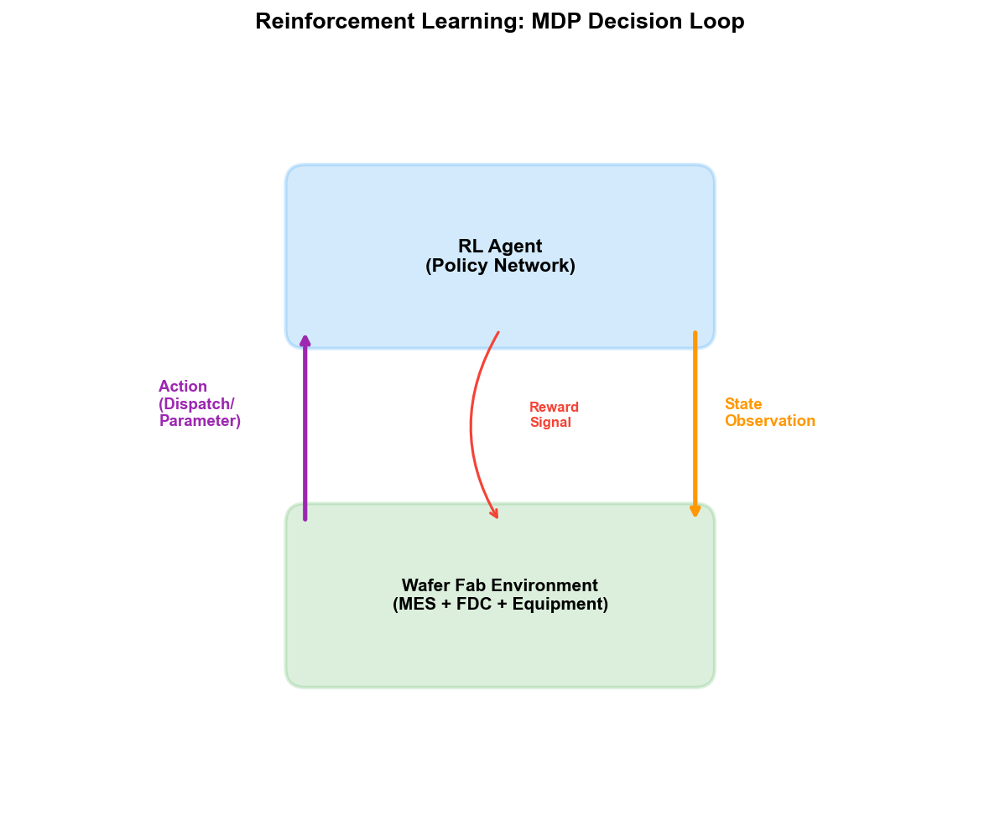
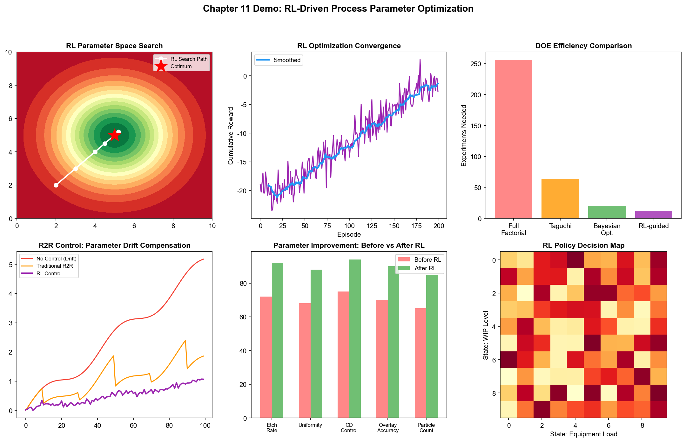
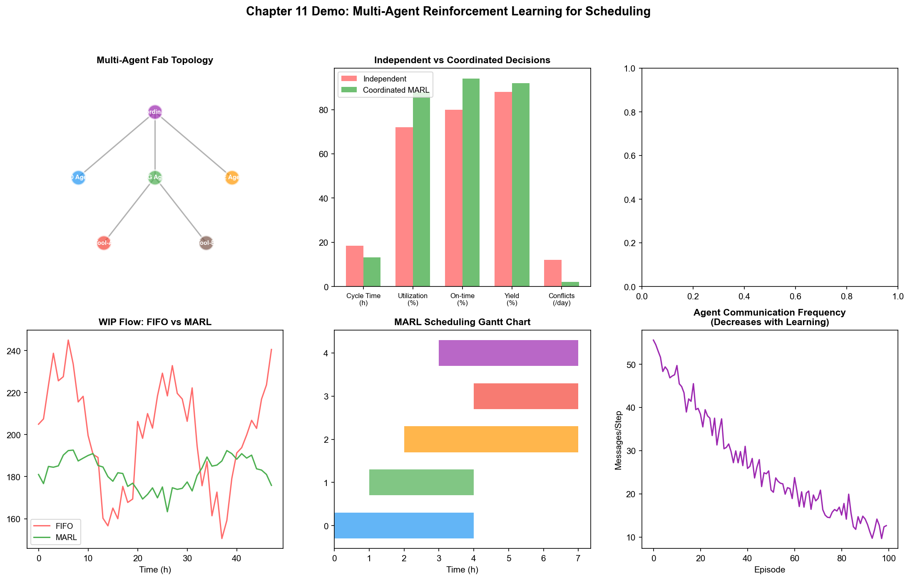

# Chapter 16: Behaviorism in the Wafer Fab

## 16.1 Reinforcement Learning in Process Optimization

The application of behaviorism in semiconductor wafer fabs is still at a relatively early stage, but its potential has begun to emerge in several specific scenarios. Unlike connectionism's "learning patterns from data," reinforcement learning excels at "learning policies from interaction"—making it particularly suited for process optimization and scheduling scenarios that require sequential decision-making.

### PID/YED: RL-Based DOE Parameter Space Search

Traditional DOE (Design of Experiments) methods are extremely inefficient when facing high-dimensional parameter spaces. An etch process may have 20 key parameters, each with 5 levels—a full factorial design requires $5^{20}$ experiments, which is completely infeasible. Even using fractional factorial designs or response surface methodology, the number of experiments still grows rapidly with parameter dimensionality.

Reinforcement learning reframes DOE as a sequential decision problem: in each experimental round, the agent selects a set of parameter combinations (action), the environment returns the process result (observation and reward), and the agent adjusts its parameter selection strategy for the next round based on the results. The goal is to find the optimal process parameter combination in the fewest number of experimental rounds.

This approach's technical path is typically based on the combination of Bayesian optimization and reinforcement learning:

1. **Initialization:** Run initial experiments with a small number of random parameter combinations
2. **Modeling:** Fit the mapping from parameters to results using Gaussian Process or neural networks
3. **Acquisition function optimization:** Use RL strategy to select the next set of parameters—balancing "fine search in known good regions" (exploitation) and "exploration in unknown regions" (exploration)
4. **Experiment execution:** Run actual experiments with the selected parameter combinations
5. **Update:** Add new experimental results to the dataset and update the model
6. **Repeat steps 3–5 until convergence**

Compared to fixed-strategy DOE methods, RL's advantage lies in "adaptivity"—it dynamically adjusts the direction of the next set of experiments based on existing experimental results. If the first few rounds of experiments reveal that increasing a certain parameter significantly improves results, RL will concentrate subsequent experiments on fine searching near larger values of that parameter.

The challenge of this approach is experimental cost—each "environment interaction" (running an actual experiment) requires a wafer fabrication cycle (days to weeks) and the cost of test wafers. Therefore, offline RL (learning from historical DOE data) and digital twin-assisted RL (doing most exploration in a simulated environment, with validation only in reality) are more practical paths.

### RL-Based R2R Control

Traditional R2R control uses linear models such as EWMA—simple, interpretable, but can only handle linear and slow drift. Actual process drift is often nonlinear: step changes after PM, different degradation rates at different aging stages, and interaction effects of multi-parameter coupling.

An RL-based R2R controller models parameter adjustment as a Markov Decision Process (MDP):

- **State $s_t$:** Measurement results of the current and historical batches, equipment operating parameters, number of batches since last PM
- **Action $a_t$:** Parameter adjustment amounts for the next batch's Recipe (e.g., RF power +5W, pressure -0.5 mTorr)
- **Reward $r_t$:** The negative of the deviation between the next batch's measurement result and the target value (smaller deviation = higher reward)
- **Policy $\pi(a|s)$:** The strategy for selecting parameter adjustments given the state

The workflow of a PPO-based R2R controller:

1. Pre-train an initial policy offline from historical R2R data
2. Conduct online training on a digital twin model—simulating parameter adjustments over a large number of batches
3. Deploy the trained policy on the actual production line, adjusting parameters for each batch
4. Continuously collect new data and periodically update the policy

The advantage of this approach over EWMA is: it can handle nonlinear drift patterns, simultaneously adjust multiple interrelated parameters, and adaptively adjust strategies based on equipment state (e.g., number of batches since last PM). The disadvantage is that it requires a large amount of historical data to train the digital twin model, and the policy is less interpretable than EWMA.

## 16.2 Reinforcement Learning in Manufacturing Scheduling

### MFG: RL-Based Intelligent Dispatching

MFG's real-time dispatching is one of the most promising application scenarios for reinforcement learning in wafer fabs. Traditional dispatching rules (FIFO, EDD, CR, etc.) are fixed—the same sorting rules are applied regardless of the production line state. However, the optimal dispatching strategy should be dynamically adjusted based on the real-time state of the production line—prioritizing feeding the bottleneck tool when it is idle, and slowing down feeding when WIP at a certain process step is too high.

Modeling dispatching as an MDP:

- **State $s_t$:** Current full production line state—queue lengths of each tool, process progress and due dates of each batch, tool status (running/idle/PM), current bottleneck tool
- **Action $a_t$:** For each idle tool, select the next wafer batch to process from its queue
- **Reward $r_t$:** Composite metric—completed batch count (positive reward), overdue batches (negative reward), bottleneck tool idle time (negative reward)
- **Policy $\pi(a|s)$:** The dispatching policy given the production line state

A DQN-based dispatching system works as follows:

1. **State encoding:** Encode the production line state as a vector—queue length of each tool, priority and remaining time of each batch, tool status, etc.
2. **Q-value estimation:** DQN outputs the Q-value (expected long-term return) for each dispatchable batch
3. **Dispatching decision:** Select the batch with the highest Q-value and assign it to the idle tool
4. **Feedback update:** Observe the production line state changes and rewards after the decision, and update DQN parameters

Training is typically conducted in a production line simulator (digital twin)—the simulator models wafer flow through the production line, equipment processing times, fault events, etc. The agent learns effective dispatching policies through millions of trials in the simulator, which are then deployed to the actual production line.

### Multi-Tool Coordinated Scheduling and Dynamic Bottleneck Mitigation

When multiple tools of the same type on the production line can process the same process step, dispatching must decide not only "which batch first" but also "on which tool." This decision needs to consider the current status, load, and health of each tool—assigning batches to the tool with the best status and shortest wait time.

Multi-Agent Reinforcement Learning (MARL) can handle such multi-tool coordination problems. Each tool is treated as an agent, with each agent's local objective being to "maximize its own processing efficiency" and the global objective being to "maximize total line output." Algorithms such as MAPPO achieve global coordination through centralized training (all agents share a Critic network) and decentralized execution (each agent makes decisions independently).

Dynamic bottleneck mitigation is a typical application of MARL. The bottleneck is not fixed—when a bottleneck tool fails, the bottleneck shifts to another tool. RL policies can learn to "anticipate bottleneck shifts"—before a tool is about to become the new bottleneck, routing more batches to it in advance to avoid idleness.

## 16.3 Reinforcement Learning in Equipment Control

### PE/EE: RL-Based Equipment Parameter Adaptive Adjustment

Equipment process parameters need continuous fine-tuning during operation to compensate for various changes—equipment aging, consumable wear, batch-to-batch drift. Traditional R2R controllers adjust parameters once per batch, with a preset adjustment strategy (e.g., EWMA).

RL can be more fine-grained—real-time parameter adjustment within a single batch. For example, during the etch process, as polymer accumulates on the chamber wall, the etch rate gradually decreases. Traditional methods compensate between batches (R2R), while RL can predict the rate decrease trend based on real-time FDC data within the batch and adjust RF power in advance.

This "intra-batch real-time control" requires extremely low-latency inference—the FDC system collects hundreds of signals per second, and the RL strategy needs to process signals and output parameter adjustments within milliseconds. This requires model lightweighting—small MLPs or shallow LSTMs are typically sufficient; large Transformers are not needed.

### Predictive Maintenance Decision Optimization

Predictive maintenance involves two levels: prediction ("when does the equipment need maintenance") and decision-making ("when is it optimal to schedule maintenance"). The first level is where connectionism excels—LSTM predicting RUL. The second level is where behaviorism excels—RL optimizing maintenance decisions.

The optimization objective for maintenance decisions is: schedule maintenance before equipment performance degradation affects process quality, while minimizing the capacity loss caused by maintenance. This decision needs to consider multiple factors:

- The equipment's current health and degradation rate
- Maintenance window availability (maintenance requires personnel and spare parts)
- Current production line WIP status (will WIP accumulate during maintenance)
- Upcoming order due date pressure

Modeling this decision as an MDP:

- **State:** Equipment health, current capacity load, maintenance window availability
- **Action:** Continue operating / immediate maintenance / delay maintenance by N batches
- **Reward:** Capacity gain - maintenance cost - quality risk

The RL policy learns to schedule maintenance before the equipment health drops below a certain threshold—not maintaining when health is still high (wasting capacity), nor waiting until the equipment actually fails (too risky), but executing maintenance at the balance point between "maintenance cost" and "quality risk."

## 16.4 Multi-Agent Systems in the Wafer Fab

### Cross-Departmental Coordination via MARL

The three core departments of the wafer fab—PID/YED, MFG, PE/EE—sometimes have conflicting optimization objectives. MFG wants to maximize capacity (reduce equipment idle time), PE wants to optimize process quality (may require more time for parameter tuning), and YED wants to optimize yield (may require more inspection steps). These competing objectives need to be coordinated within a unified framework.

MARL provides a natural framework for modeling this multi-objective coordination. Each department can be modeled as an agent (or agent group), each with different local reward functions:

- MFG agent's reward = capacity - delay penalty
- PE agent's reward = process quality - tuning time
- YED agent's reward = yield - inspection cost

The global objective is a weighted sum of these local rewards (or some coordination mechanism). MARL algorithms (e.g., QMIX) learn how to find Pareto-optimal balance points among these competing objectives.

### Fab-Wide Optimization

The ultimate goal is fab-wide optimization—an AI system that simultaneously manages process parameters, production scheduling, and equipment maintenance to maximize overall yield, capacity, and profit.

This is an extremely complex MDP—the state space includes the positions and status of all wafers on the production line, the status and health of all equipment, and the current values and trends of all process parameters. The action space includes dispatching decisions for each tool, parameter adjustments for each process, and maintenance decisions for each tool.

Fab-wide optimization is currently still in the theoretical exploration stage, but some directional practices have begun:

**Digital Twin + RL:** Build a fab-wide digital twin model—simulating wafer flow, equipment processing, process parameters, and yield. The RL agent trains fab-wide optimization policies in the digital twin, then deploys to reality. The fidelity of the digital twin determines the policy's transferability.

**Hierarchical RL:** Decompose the problem into multiple levels—high-level policy makes long-term plans (e.g., this week's capacity allocation), mid-level policy makes medium-term scheduling (e.g., today's dispatching rules), and low-level policy makes real-time execution (e.g., which batch to process next). Each level is trained independently, with the high level providing objectives for the low level and the low level providing state feedback for the high level.

## 16.5 Case Study: Reinforcement Learning-Based R2R Control System

An advanced process wafer fab deployed an RL-based R2R control system for the CMP (Chemical Mechanical Polishing) process step, replacing the original EWMA controller.

The process challenge of CMP is that the polishing rate degrades with the use of the polishing pad—a new pad has a high polishing rate, which decreases as the number of uses increases. The traditional EWMA controller compensates for this degradation by tracking the historical trend of the polishing rate, but the compensation strategy is linear—assuming a constant degradation rate. In reality, pad degradation is nonlinear (new pads degrade faster, old pads degrade slower), and pad replacement after PM causes step changes.

The RL controller's architecture:

- **State:** Current batch number, number of batches since last PM, polishing rate measurements from the previous 5 batches, pad usage history
- **Action:** Polishing pressure and time parameter adjustments for the next batch
- **Reward:** $-|\text{actual polishing amount} - \text{target polishing amount}|$ (smaller polishing amount deviation is better)

Training data came from the past two years of historical R2R data—approximately 50,000 batches of parameter and measurement records. The system used Conservative Q-Learning (CQL) for offline RL training—no trial-and-error on the real production line was needed; it learned the optimal policy solely from historical data.

Deployment results: Compared with the EWMA controller, the RL controller reduced polishing uniformity deviation by 22%, and the post-PM recovery time (number of batches from post-PM to parameter stabilization) was reduced from 8 batches to 3 batches. The rapid post-PM recovery is the most significant improvement—the EWMA controller needs multiple batches after PM to "re-learn" the new parameter baseline, while the RL controller directly identifies the post-PM state based on the "number of batches since last PM" state variable and applies the corresponding compensation strategy.

This case demonstrates a key advantage of RL in industrial scenarios: it can learn patterns from historical data that human engineers may not have explicitly modeled—such as the nonlinear parameter recovery pattern after PM—and encode them into adaptive control policies.

## 16.6 Practice Research: Reinforcement Learning from Research to Production Line Validation

### Google DeepMind AlphaChip: Production-Grade RL Deployment in Chip Design

Although AlphaChip is primarily applied to chip design rather than wafer fab operations, it is the most successful production-grade deployment of RL in the semiconductor industry and has indirect value for fab process development.

AlphaChip models chip floorplanning as an MDP—the RL agent places macro components one by one on a grid, optimizing wire length, congestion, and density. Results:

- Used in every generation of Google TPU chip floorplan design since 2020—including TPU v5e, v5p, and Trillium (v6), as well as Axion data center CPUs
- Time to generate floorplans reduced from weeks/months manually to hours
- DeepMind states its generated floorplans achieve "superhuman" levels
- TPU v6 (Trillium) is 33% more energy-efficient than the previous generation

The two core authors of AlphaChip (Anna Goldie and Azalia Mirhoseini) subsequently founded Ricursive Intelligence, raising $300 million (valuation of $4 billion), commercializing the RL chip design platform—this demonstrates that the value of RL in the semiconductor field has been recognized by capital markets.

Although AlphaChip solves a design problem rather than a manufacturing problem, its technical path—sequential decision-making by RL on complex discrete optimization problems—is entirely consistent with the technical paths for wafer fab scheduling and R2R control. AlphaChip's success validates the feasibility of RL on complex semiconductor optimization problems.

### AISSI Project: Production Line Validation of Deep RL in Factory Scheduling

The "RL intelligent dispatching" described in Section 16.2 received production-line-level validation in the AISSI project.

AISSI (2021–2024), jointly conducted by Bosch, Nexperia, Bosch Sensortec, D-SIMLAB, SYSTEMA, and KIT, is one of the largest production-line validations of RL in semiconductor/electronics manufacturing scheduling:

**Three use cases:**
- Small scale: Epitaxy work center scheduling (Nexperia)—multi-tool scheduling for a single process step
- Medium scale: Full fab scheduling (Bosch)—multi-process, multi-tool scheduling for a complete factory
- Global: Cycle Time prediction (Bosch Sensortec)—supply chain-level delivery time prediction

**Technical approach:** Deep RL agents train scheduling policies in a digital twin simulation environment, then deploy to real factories to provide intelligent dispatching and auto-tuning. AISSI also implemented standardized communication between AI and digital twin modules.

**Quantified results:**
- Output 9% higher than literature baseline
- Cycle Time prediction accuracy of 80–90%
- Results are being transferred to Bosch and Nexperia production lines

**Significance:** AISSI validated the feasibility of the DQN/MARL scheduling methods described in Section 16.2 in real factories. Although the 9% output improvement may seem modest, for a wafer fab with billions of dollars in capacity, a 1% output improvement means millions of dollars in annual revenue.

### RL Scheduling Benchmarks on Real Industrial Datasets

Beyond the AISSI project, multiple studies from 2022–2025 have validated RL scheduling on real industrial datasets:

| Study | Dataset | Throughput Improvement | Cycle Time | Latency Improvement | Equipment Utilization |
| --- | --- | --- | --- | --- | --- |
| ICTC 2025 | Real industrial | +5.3% | -7.3% | -19.2% | 87.9% |
| arXiv 2025 | Real industrial | +1% | — | -4% | — |
| WSC 2022 | Simulation | — | — | Outperforms 7 baselines | — |

The ICTC 2025 results are particularly noteworthy—a 5.3% throughput improvement and 7.3% Cycle Time reduction were obtained on a real industrial dataset, not simulation results. This indicates that RL scheduling has crossed the "effective in simulation but ineffective in production" chasm.

### Samsung: Autonomous Fault Maintenance System—Fusion of RL and Graph Analysis

Samsung deployed an autonomous fault maintenance system during 2021–2025—although its core technology leans more toward graph analysis + LLM rather than classical RL, it demonstrates the application of behaviorism's "learning from interaction" concept in large-scale equipment management:

- Covers 762 lithography tools
- Processes over 85,000 real faults
- Mean time to repair (MTTR) reduced by 7 minutes
- The system automates the complete closed loop from detecting anomalies → diagnosing root causes → executing corrective actions

The technical architecture fuses multiple methods: graph-based log analysis (symbolism), LLM semantic reasoning (connectionism), and hybrid retrieval mechanisms. Although it is not the "trial-and-error learning" of classical RL, the system's "autonomous decision-execution-feedback" closed loop embodies the core idea of behaviorism—learning and improving behavior policies from environmental interaction.

### Synopsys DSO.ai: Commercial Validation of RL in Chip Design Optimization

Synopsys's DSO.ai uses reinforcement learning for chip layout optimization—similar to AlphaChip but already commercialized:

- **STMicroelectronics:** PPA (Power-Performance-Area) optimization efficiency improved by over 3x
- **SK hynix:** Advanced process chip die area reduced by 5%, lowering manufacturing cost
- **Samsung:** Used Synopsys AI tools to complete the tape-out of a 3nm mobile SoC
- Over 100 commercial tape-outs have used DSO.ai

### Industry Practice Summary: Deployment Stages of Behaviorism in Semiconductors

| Application Area | Deployment Stage | Representative Case | Quantified Results |
| --- | --- | --- | --- |
| Chip layout optimization | Production-grade | AlphaChip / DSO.ai | Weeks→hours; PPA 3x efficiency |
| R2R control | Production pilot | CMP CQL controller | Uniformity deviation -22%; PM recovery 8→3 batches |
| Factory scheduling | Production line validation | AISSI / ICTC paper | Output +9%; throughput +5.3% |
| Queue time management | Simulation validation | WSC 2022 | Outperforms 7 baseline methods |
| Autonomous maintenance | Production-grade | Samsung lithography equipment | MTTR -7 minutes; 762 tools |
| Fab-wide optimization | Theoretical exploration | Digital twin + RL | No production deployment yet |

The current state of behaviorism in wafer fabs can be summarized as: **it has entered mass production for "narrow but deep" single-point optimization (R2R, chip layout), is transitioning from simulation to production line for "broad but shallow" global optimization (scheduling, maintenance decisions), and is still in the theoretical exploration stage for "fab-wide" optimization.** This progressive deployment path is consistent with the general pattern of AI technology—from simple to complex, from single-point to system.

---

As of this chapter, the applications of all three paradigms in the wafer fab have been presented. To summarize the positioning and practice maturity of the three in the wafer fab:

| Scenario | Symbolism | Connectionism | Behaviorism |
| --- | --- | --- | --- |
| Yield root cause analysis | KG reasoning (production) | CNN defect classification (production) | — |
| Process parameter optimization | Process window rules | Yield prediction (production pilot) | RL parameter search (production line validation) |
| Equipment health monitoring | Fault tree reasoning | LSTM anomaly detection (production) | Predictive maintenance decisions (production pilot) |
| Production scheduling | Dispatching rule engine | WIP flow prediction | RL intelligent dispatching (production line validation) |
| Data fusion | Ontology (production) | Multimodal encoding | — |
| Recipe development | Process specification encoding | — | Bayesian optimization + RL (production pilot) |

Each of the three paradigms has its domains of strength and its limitations. True fab-wide intelligence requires the fusion of all three—this is precisely the theme of the upcoming Part 5 (LLM/Agent) and Part 6 (Ontology). LLMs as "glue" can connect models and tools from different paradigms, Agent architectures can orchestrate multi-step analysis processes, and Ontology provides the semantic foundation for cross-system data fusion.

## 16.7 Demo Visualization: Reinforcement Learning-Driven Process Parameter Optimization

*Demo description: Top-left shows the RL search trajectory in parameter space and yield response surface, top-right is the RL optimization convergence curve, middle-right is the experimental efficiency comparison of different DOE methods, and the bottom row shows R2R control effects, multi-parameter improvement comparison, and RL policy decision mapping. Simulation script: `demos/demo_ch16_rl_optimization.py`.*

## 16.8 Demo Visualization: Multi-Agent Reinforcement Learning Scheduling

*Demo description: Top-left is the wafer fab multi-agent topology, top-right is the key metric comparison of coordinated vs. independent decision-making, middle-left is the WIP flow timeline, middle-right is the scheduling Gantt chart, and the bottom shows multi-agent communication frequency and policy convergence analysis. Simulation script: `demos/demo_ch16_marl.py`.*
