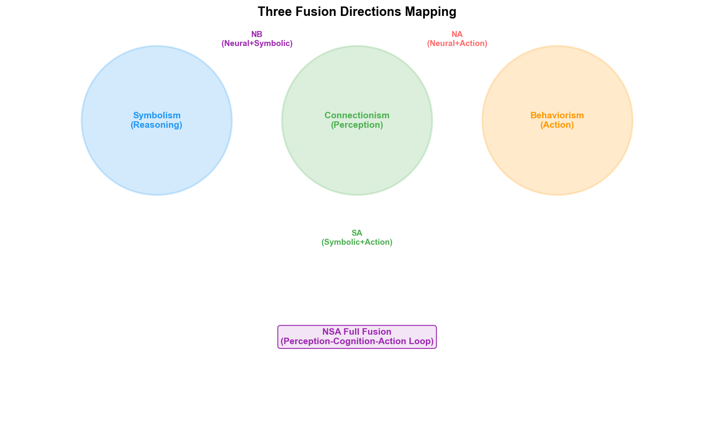

# Chapter 17: Fusion Overview—The Intersection and Unification of the Three Paradigms

## 17.1 Why Fusion Is the Inevitable Trend

The preceding three chapters discussed the applications of symbolism, connectionism, and behaviorism in wafer fabs respectively. Each excels in its own domain: symbolism in knowledge representation and logical reasoning, connectionism in pattern recognition and perception, and behaviorism in sequential decision-making and optimization.

However, when any single paradigm is used alone, it has clear shortcomings:

| Paradigm | Strengths | Weaknesses |
| --- | --- | --- |
| Symbolism | Knowledge representation, logical reasoning, interpretability | Cannot learn from data, knowledge acquisition bottleneck |
| Connectionism | Pattern recognition, perception, generalization | Black-box decision-making, cannot reason, hallucination problem |
| Behaviorism | Sequential decision optimization, adaptability | Low sample efficiency, requires precise state representation |

More critically, real problems in wafer fabs are often not single-type—a yield issue may simultaneously involve image recognition (connectionism), knowledge reasoning (symbolism), and parameter optimization (behaviorism). When a problem is complex enough, no single paradigm can solve it independently.

### The Composite Nature of Wafer Fab Problems

Consider a real yield decline scenario:

A 3nm product's CP yield dropped from 94% to 87% over three consecutive batches. The YED engineer needs to find the root cause. The AI capabilities involved in this problem include:

1. **Perception** (connectionism): Identifying the defect pattern from the wafer map—is it edge-ring? Center cluster? Or random scatter? A CNN can complete the classification in 0.5 seconds.
2. **Reasoning** (symbolism): Inferring the root cause from the defect pattern—is the root cause of the edge-ring defect an etch edge effect or a lithography edge effect? Causal rules in the knowledge graph are needed to narrow the scope.
3. **Optimization** (behaviorism): Determining the optimal parameter adjustment plan—among multiple suspect parameters, which should be adjusted and by how much? An RL policy can recommend the optimal adjustment based on historical data.
4. **Decision-making** (behaviorism): Deciding whether to halt the line—weighing the risk of continued production against the loss of a line stoppage. An RL MDP model can quantify this decision.

Any single paradigm can only address one of these steps. Only when all four steps are connected can the yield issue be solved end-to-end—from "discovering the problem" to "locating the root cause" to "executing the fix" to "verifying the result."

## 17.2 Three Fusion Directions and Full Fusion

In recent years, a clear trend has emerged in the AI field: **the three paradigms are moving from independent operation toward cross-fusion.** This fusion has given rise to four highly promising "hybrid intelligence" directions:

### NB (Neural + Symbolic, Neural-Symbolic Fusion)

Using large models (connectionism) for "intuition" and perception, and knowledge graphs (symbolism) for "rationality" and logical constraints.

Typical applications: "Chain-of-Thought" (CoT), "Function Calling." Letting large models call external logic rules or knowledge bases during reasoning, compensating for the hallucination problem and achieving verifiable logical reasoning.

Analogy: The combination of "fast thinking" (System 1, intuition) and "slow thinking" (System 2, rationality) in human cognition.

### NA (Neural + Action, Neural-Action Fusion)

Using deep learning (connectionism) for perception and reinforcement learning (behaviorism) for decision optimization.

Typical applications: Large models + reinforcement learning (e.g., ChatGPT's RLHF), as well as end-to-end autonomous driving and humanoid robot control. Letting agents not only "perceive correctly" but also "act well" in the real world.

Analogy: The human "perception-decision" closed loop—the eyes see an obstacle (perception), and the brain decides the detour route (decision).

### SA (Symbolic + Action, Symbolic-Action Fusion)

Using symbolic planning (logic) to generate task sequences, and behaviorist models (e.g., PID control, evolutionary strategies) for low-level execution and resistance to uncertainty.

Typical applications: Multi-agent systems (Multi-Agent), overload task planning. Used to address the "plans can't keep up with changes" problem in complex environments.

Analogy: The human "planning-execution" architecture—making a travel plan (planning), and adjusting the route based on real-time traffic (execution).

### NSA Full Fusion—Multimodal Embodied Intelligence

Fusing all three into a "perception (vision/audition)—cognition (reasoning/knowledge)—action (physical interaction)" closed loop. This is the core architecture of **Embodied Intelligence** and **World Models** that major tech giants are currently investing heavily in.

## 17.3 Mapping Fusion Directions to the Three Core Departments

The three fusion directions are not abstract academic concepts—they all have specific application scenarios in the three core departments of the wafer fab: PID/YED, MFG, and PE/EE:

| Fusion Direction | PID/YED Application | MFG Application | PE/EE Application |
| --- | --- | --- | --- |
| **NB** | Verifiable yield root cause analysis | Cross-system data Q&A and production reports | Equipment fault "perception + diagnosis" |
| **NA** | Yield prediction + parameter optimization | End-to-end intelligent dispatching | Real-time equipment adaptive control |
| **SA** | NPI project management and task decomposition | Anomaly response workflow automation | PM planning + adaptive execution |
| **NSA** | Full-stack yield intelligence (perception→reasoning→optimization→verification) | Autonomous manufacturing operations | Self-healing equipment systems |

The following four chapters will detail the specific technical paths and application scenarios of each fusion direction across the three core departments.

## 17.4 The Inevitability of Fusion from an AGI Perspective

### The "Threshold" Theory of AGI

For AGI (Artificial General Intelligence), you can understand it this way: the combination of the three paradigms is the best stepping stone for crossing the AGI "threshold."

A single-paradigm AI—no matter how powerful—is "narrow intelligence": no matter how strong connectionism's LLMs become, they cannot perform reliable logical reasoning; no matter how precise symbolism's reasoning engines are, they cannot learn new patterns from data; no matter how optimal behaviorism's RL is, it cannot understand natural language and domain knowledge.

Only when all three are fused—perception (Neural) + knowledge and reasoning (Symbolic) + decision and learning (Action)—can a complete intelligence closed loop be formed. The tighter this loop, the closer AI is to "general"—because it no longer depends on humans bridging gaps in a particular step.

### The Fog Beyond the Threshold

But the landscape beyond the threshold currently still exists within the fog of scientific exploration.

Current NB, NA, SA, and NSA fusion are all still in early stages—LLM+KG reasoning capability is far behind that of human experts, Deep RL's sample efficiency remains too low, and symbolic planning + RL execution robustness in real complex environments is unverified. Between "engineering fusion of the three paradigms" and "true AGI," there may still be one or more fundamental theoretical breakthroughs.

In the context of semiconductor wafer fabs, this assessment is more pragmatic: wafer fabs do not need AGI—they need hybrid intelligence systems that work reliably in specific scenarios. Verifiable yield analysis through NB fusion, end-to-end scheduling through NA fusion, and autonomous maintenance response through SA fusion—these "narrow-domain hybrid intelligence" systems are the deployment priorities for wafer fab AI in the next 3–5 years.

### The Current Main Theme: Unification of Technical Routes

The current main theme in the AI field is the "unification of technical routes."

- OpenAI's GPT series evolved from a purely connectionist LLM, to adding RLHF (NA fusion), to introducing Function Calling and tool use (NB fusion), to the o1/o3 series' reasoning capabilities (NSA fusion direction)
- Google's Gemini evolved from multimodal perception (Neural), to combining search and knowledge graphs (Symbolic), to Agent capabilities (Action)
- Palantir's AIP platform unifies LLM (Neural) with Ontology (Symbolic) and Actions (Action) in a single architecture

In the semiconductor industry, this fusion trend is also occurring:

- Samsung's autonomous manufacturing system fuses KG (Symbolic) + LLM (Neural) + autonomous execution (Action)
- Palantir's Foundry + AIP unifies data fusion (Neural) + Ontology reasoning (Symbolic) + Action execution (Action) within the Ontology architecture
- NVIDIA's Omniverse + cuLitho + Metropolis fuses digital twin (simulation) + deep learning (Neural) + process optimization (Action) on a GPU-accelerated platform

The current main theme is the "unification of technical routes." The hybrid intelligence and embodied intelligence produced by the intersection of the three paradigms is the clearest research direction today. For AGI, you can understand it as: the combination of the three paradigms is the best stepping stone for crossing the AGI "threshold" (an inevitable trend), but the landscape beyond the threshold currently still exists within the fog of scientific exploration.

---

This chapter establishes the theoretical framework for the fusion directions in the next four chapters. Chapters 13–16 will delve into the NB, NA, SA, and NSA fusion directions, each explored through specific technical paths and application scenarios in the three core departments of the wafer fab (PID/YED, MFG, PE/EE).
