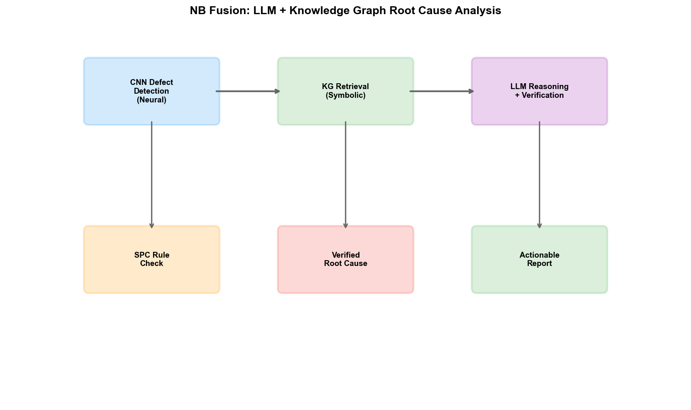
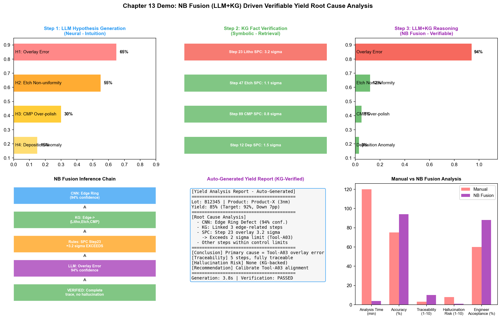

# Chapter 18: NB (Neural + Symbolic)—Neural-Symbolic Fusion in the Wafer Fab

## 18.1 Core Idea: Combining Intuition and Rationality

The core idea of NB fusion is: using connectionist models for "intuition" and perception, and symbolic models for "rationality" and logical constraints.

This idea originates from an analogy to the dual-system theory of human cognition. Psychologist Daniel Kahneman proposed the dual-system model of human cognition in "Thinking, Fast and Slow":

- **System 1 (fast thinking):** Intuitive, unconscious, fast—corresponding to connectionist deep learning
- **System 2 (slow thinking):** Logical, conscious, slow—corresponding to symbolic reasoning engines

Deep learning (System 1) excels at rapidly extracting patterns from massive data—"looking at this wafer map, my intuition tells me this is an edge-ring defect." But it is not good at logical reasoning—"why is it edge-ring? Because the root cause of edge-ring defects is typically etch chamber edge effects, and the edge effect parameter of the current tool shifted by 0.3% after last week's PM"—this kind of causal reasoning requires the knowledge graphs and reasoning rules of symbolism.

The goal of NB fusion is to give AI both "intuitive perception" and "rational reasoning"—letting "fast thinking" be responsible for identifying patterns and generating hypotheses, and "slow thinking" be responsible for verifying facts and constraining reasoning.

## 18.2 Technical Paths

### Path 1: LLM + Knowledge Graph (RAG and Tool Use)

This is currently the most mainstream NB fusion path. Large language models (connectionism) serve as the "intuition" engine—understanding natural language, generating hypotheses, and identifying patterns. Knowledge graphs (symbolism) serve as the "rationality" engine—providing factual constraints, logical rules, and verifiable reasoning chains.

```
Engineer asks: "What are the possible causes of yield decline for Lot B12345?"

Step 1 (LLM intuition):
  LLM understands the question and generates preliminary hypotheses—
  "It could be a lithography alignment issue, etch uniformity issue, or CMP over-polishing"

Step 2 (KG verification):
  Knowledge graph retrieves the process history of this lot—
  B12345 went through Step 23 (lithography) with Tool-A03's overlay accuracy SPC value at 3.2σ
  B12345 went through Step 47 (etch) with chamber pressure deviating 0.15 mTorr from baseline
  B12345 went through Step 89 (CMP) with polishing amount within target range

Step 3 (LLM+KG reasoning):
  LLM reasons based on the facts returned by the KG—
  "Overlay accuracy 3.2σ exceeds the 2σ control limit, making it the primary suspect.
   The tool's baseline shifted 0.05μm after last week's PM, which may have caused overlay accuracy drift.
   Recommend checking the alignment system calibration status of Tool-A03."

Step 4 (Verification):
  Reasoning chain is traceable—each conclusion has data support from the KG
  No hallucination—the LLM cannot fabricate facts that don't exist in the KG
```

This cycle of "LLM generates hypotheses → KG verifies facts → LLM reasons with facts" is the most natural way for NB fusion to be deployed in wafer fabs.

### Path 2: Chain-of-Thought (CoT)

Chain-of-Thought is a more lightweight implementation of NB fusion. It does not rely on external knowledge graphs but explicitly injects logical steps into the LLM's reasoning process—letting the model "think step by step."

```
CoT output:
  "Let me analyze step by step:
   1. Yield dropped from 92% to 85%, a 7 percentage point decline—not random fluctuation
   2. Wafer map pattern shows edge-ring defect—points to edge-related process
   3. Process steps involving edges: Step 23 (lithography), Step 47 (etch edge), Step 89 (CMP edge)
   4. SPC data shows Step 23's overlay accuracy at 3.2σ—exceeds control limit
   5. Other step parameters are within control limits
   Conclusion: The primary root cause is Step 23 lithography overlay accuracy exceeding limits"
```

The essence of CoT is using natural language to simulate the process of symbolic reasoning—making implicit reasoning steps explicit.

### Path 3: Neural-Symbolic Constrained Learning

A deeper NB fusion embeds symbolic constraints into the neural network at the model architecture level—using symbolic rules during training to constrain the output space of the neural network.

For example, in wafer map defect classification, symbolic constraints can be defined:

- "If defects exhibit a ring distribution and are located at the wafer edge, then the root cause category can only be {etch edge effect, lithography edge effect, CMP edge effect}"
- "If multiple wafers from the same batch all exhibit the same pattern, then the root cause is equipment-level rather than batch-level"

These constraints are used as regularization terms during training—penalizing outputs that violate constraints. During inference, they serve as post-processing—filtering out predictions that don't satisfy the constraints.

## 18.3 Applications in PID/YED



*Figure: Verifiable yield root cause analysis flow through NB fusion—Neural perception→Symbolic retrieval→Symbolic reasoning→Neural generation→Symbolic verification*

### Verifiable Yield Root Cause Analysis

Traditional connectionist models (e.g., CNN wafer map classification) can identify defect patterns but cannot provide root causes—it only says "this is an edge-ring defect" without saying "why." The NB fusion approach constructs a complete verifiable reasoning chain:

```
CNN identifies pattern → Knowledge graph retrieves relevant process parameters → Rule engine reasons about root cause → LLM generates natural language report
```

Specific process:

1. **Perception layer (Neural):** CNN classifies the wafer map, outputting "edge-ring defect, confidence 94%"
2. **Retrieval layer (Symbolic):** Knowledge graph retrieves all process steps and equipment that could cause edge-ring based on the defect type
3. **Reasoning layer (Symbolic):** Rule engine checks the SPC data of these steps—"Step 23's overlay accuracy is 3.2σ, exceeding the 2σ control limit"
4. **Generation layer (Neural):** LLM converts the reasoning results into an engineer-readable analysis report

The entire reasoning chain is traceable, verifiable, and explainable—each conclusion has data support from the KG, with no LLM hallucination risk.

### Defect Classification with Domain Knowledge Constraints

Traditional CNN classifiers may output results that violate process common sense—for example, classifying a CMP-caused defect as a lithography defect. NB fusion solves this through symbolic constraints:

- During training: encode the "defect location → possible process steps" mapping rules as constraint terms in the loss function
- During inference: after CNN outputs the probability distribution, use rules to filter impossible combinations
- Result: classification accuracy improves while logical consistency is also guaranteed

### Automated Generation and Verification of Yield Reports

YED engineers need to write yield analysis reports weekly—this is traditionally a time-consuming manual task. The NB fusion approach:

- LLM automatically extracts this week's yield data and anomaly events from MES, YMS, and FDC, and generates a report draft
- Knowledge graph verifies every data point in the report—"the report states Tool-A03's OEE is 85%; the KG shows this tool's OEE for this week is indeed 85.2%"
- Rule engine checks the report's logical consistency—"the report says yield decline was caused by etching, but SPC data shows etching parameters are within control limits—flagging a contradiction"
- LLM revises the report based on verification feedback

## 18.4 Applications in MFG

### Cross-System Data Q&A

MFG managers frequently need to query information across systems: "What was Tool-A03's capacity utilization last week? What products did it process? Were there any abnormal downtime events?"

This information is scattered across MES (batch records), FDC (equipment status), ERP (work order information), and maintenance systems (PM records). The NB fusion approach:

- LLM understands the natural language question and decomposes it into sub-queries
- Knowledge graph maps sub-queries to the corresponding systems and executes precise retrieval
- LLM integrates the returned results from multiple systems into a coherent answer

This approach is more flexible than traditional BI dashboards—dashboards can only display predefined metrics, while the NB approach can answer arbitrary questions.

### Production Report Automation and Compliance Verification

MFG needs to generate daily production reports—containing output, yield, equipment utilization, anomaly events, etc. The traditional approach has engineers exporting data from multiple systems and manually filling in reports.

NB fusion approach:

- LLM automatically extracts data from each system and generates report text
- Knowledge graph verifies the completeness and consistency of report data—"today's output is 15% less than yesterday—is it because of Tool-B05's PM?"
- Rule engine checks whether the report omits necessary information—"there were 3 anomalous batches today but the report only mentions 2"

### Fusion of Dispatching Rules and ML Predictions

Traditional dispatching systems use fixed rules (FIFO, EDD, etc.) without considering the real-time state of the production line. The NB fusion approach:

- Connectionist models (LSTM) predict WIP distribution and bottleneck locations for the next 2 hours
- Symbolic engine (rules + constraints) converts predictions into dispatching recommendations—"WIP buildup predicted at Step 45 in 2 hours; recommend dispatching Batch B to Step 45 now"
- Rule engine ensures dispatching recommendations satisfy process constraints—"Batch B must go through Step 30 before reaching Step 45"

## 18.5 Applications in PE/EE

### Equipment Fault "Perception + Diagnosis"

When equipment exhibits anomalies, the traditional process is: FDC system issues an alarm → EE engineer reviews FDC data → judges fault type based on experience → consults equipment manual to confirm → executes repair.

The NB fusion approach automates this process:

- **Perception (Neural):** LSTM detects anomalous patterns from FDC time-series signals—"RF power exhibited oscillation in the last 30 seconds"
- **Diagnosis (Symbolic):** Knowledge graph retrieves possible faults corresponding to this anomaly pattern—"Possible causes of RF power oscillation: matcher aging, poor cable contact, plasma instability in the chamber"
- **Verification (Symbolic):** Rule engine checks related sensor data—"Reflected power simultaneously increased, pointing to matcher aging"
- **Recommendation (Neural):** LLM generates repair recommendations—"Recommend checking the RF matcher's impedance characteristics; prioritize measuring the matcher capacitance value"

### Recipe Optimization with Knowledge Constraints

When PE optimizes Recipe parameters, it needs to ensure that adjustments do not violate process constraints—certain parameter combinations, while the model predicts higher yield, may exceed the equipment's safe operating range.

NB fusion approach:

- Connectionist models (neural networks) predict process results under different parameter combinations
- Symbolic constraints (process rules) define safe operating boundaries—"RF power cannot exceed 500W, chamber pressure cannot go below 5 mTorr"
- The model searches for optimal parameters within the constraint space—optimizing performance without violating safety constraints

### Intelligent Retrieval and Compliance Checking of SPEC Documents

Wafer fab SPEC documents are symbolic—they explicitly define the parameter ranges and operating rules for each process step. However, engineers may overlook or misinterpret SPECs during actual operations.

NB fusion approach:

- LLM understands the engineer's natural language operational intent—"I want to increase the etch power from 300W to 350W"
- Knowledge graph SPEC rules verify compliance—"Step 47's etch power SPEC upper limit is 320W; 350W exceeds the limit"
- If non-compliant, LLM generates an explanatory alert—"The power SPEC upper limit for this step is 320W; recommend adjusting to 310W and verifying the etch rate change"

## 18.6 Practice Cases

### Samsung: Knowledge Graph + LLM for Sensor Anomaly Detection

Samsung used KG+LLM to achieve sensor naming alignment and anomaly detection in its autonomous semiconductor manufacturing system. When equipment sensor signals change after maintenance, the knowledge graph's community detection helps identify subtle changes in inter-sensor network relationships—discovering a reactor outer membrane sensor anomaly that traditional analysis missed. Samsung's autonomous fault maintenance system covers 762 lithography tools, processes over 85,000 real faults, and reduced MTTR by 7 minutes.

### yieldWerx: Root Cause Knowledge Graphs

yieldWerx's Root Cause Knowledge Graphs product applies KG directly to yield analysis—visual guides lead users along weighted paths to identify root causes for low-yield batches, and AI and ML algorithms reduce analysis time from hours to minutes.

### IKAS: Smart RCA Platform

IKAS's Smart RCA platform fuses multi-source data (FDC, SPC, MES, YMS), using Golden Tool/Path comparison and AI association analysis—root cause identification time reduced by over 80%.

### Palantir AIP: Industrial-Grade Architecture for NB Fusion

Palantir's AIP platform is the most systematic practice of NB fusion in the industrial domain—LLM (Neural) and Ontology (Symbolic) are unified at the architectural level. AIP's dual-pillar architecture (knowledge tree + ML) ensures that every step of the LLM's reasoning is based on structured data in the Ontology, achieving "verifiable AI reasoning."

## 18.7 Demo Visualization: NB Fusion (LLM + Knowledge Graph) Driven Verifiable Yield Analysis



*Demo description: The top row shows the three-step process of LLM hypothesis generation → KG verification → reasoning results, the middle row shows the reasoning chain visualization and the LLM auto-generated analysis report, and the bottom row shows the metric comparison between traditional manual analysis and NB fusion analysis. Simulation script: `demos/demo_ch18_nb_fusion.py`.*

---

The core value of NB fusion in wafer fabs is "verifiability"—making AI's analytical conclusions no longer black-box predictions, but traceable chains where every step is supported by data and logical reasoning. This is critical for high-reliability scenarios such as yield analysis and fault diagnosis—where a single erroneous conclusion could lead to losses of millions of dollars.
