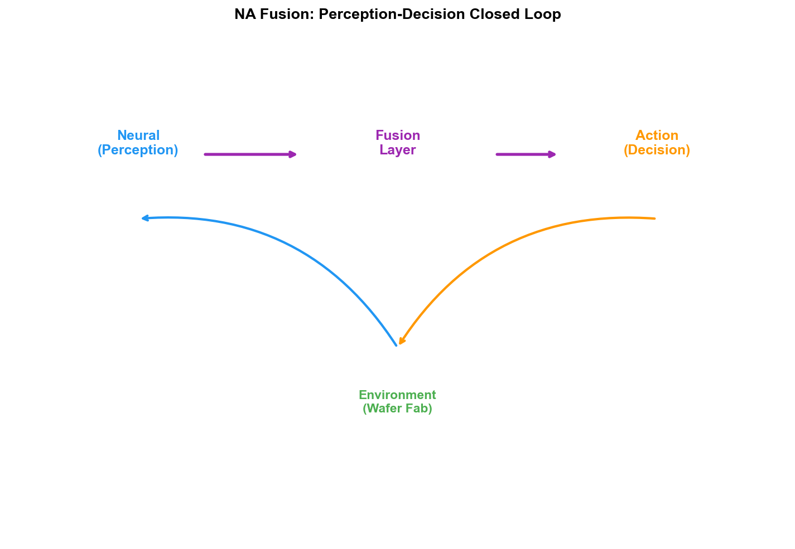
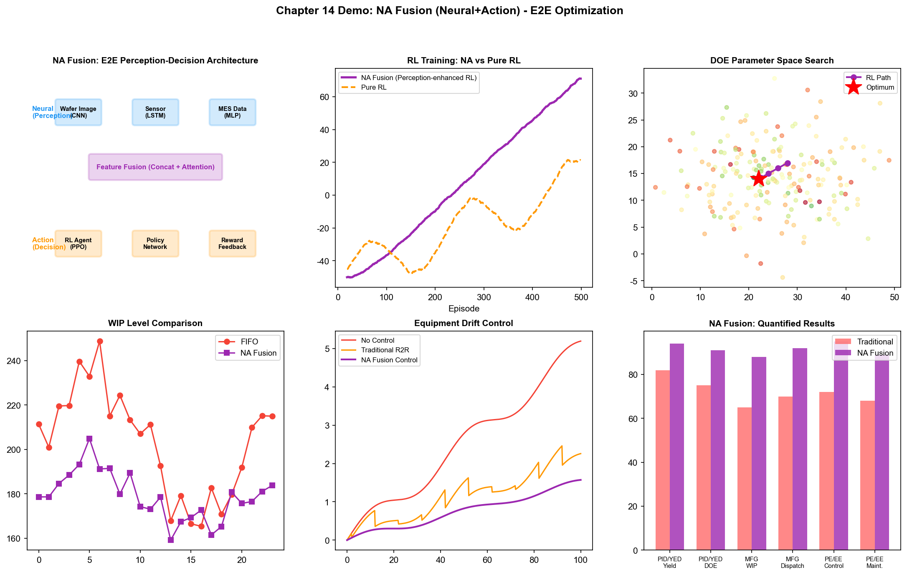
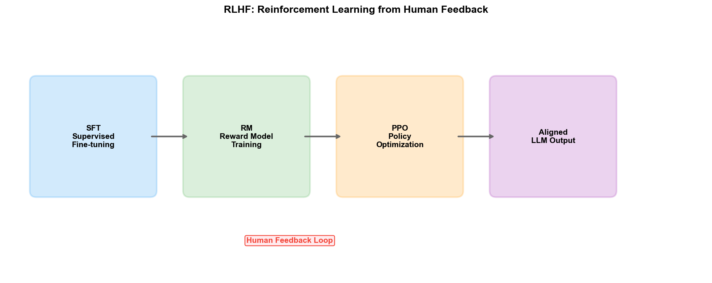

# Chapter 19: NA (Neural + Action)—Neural-Action Fusion in the Wafer Fab

## 19.1 Core Idea: Combining Perception and Decision-Making

The core idea of NA fusion is: using deep learning (connectionism) for "perception"—extracting state representations from high-dimensional sensor data; and using reinforcement learning (behaviorism) for "decision-making"—selecting optimal actions based on state representations.

The combination of these two arises from a fundamental complementary relationship:

- **Deep learning excels at "perceiving correctly" but not at "acting correctly":** CNNs can identify defect patterns from wafer maps, and LSTMs can detect anomalies from FDC signals, but they can only output classifications or predictions, not "what to do next."
- **Reinforcement learning excels at "acting correctly" but needs to "perceive correctly":** RL's MDP framework requires precise state input $s_t$, but in real environments, raw sensor data (images, time-series signals, text) is too high-dimensional and too noisy for RL to process directly.

The essence of NA fusion is: **deep learning compresses high-dimensional raw data into low-dimensional state representations, and reinforcement learning makes sequential decisions based on this representation.** This "perception→decision" closed loop has long existed in nature—human eyes (perception) transmit visual information to the brain (decision-making), and the brain determines the body's next action.

In the context of the wafer fab, NA fusion means: AI not only "perceives correctly" wafer maps, FDC signals, and MES data, but also makes decisions such as "which tool should the next batch be dispatched to," "how should Recipe parameters be adjusted," and "when should equipment undergo PM" based on these perceptions.

## 19.2 Technical Paths



*Figure: The perception-decision closed loop of NA fusion—Neural perception→Action decision→environmental interaction→reward feedback→policy update*

### Path 1: Deep RL (Deep Reinforcement Learning)

Deep RL is the most classic technical path of NA fusion—using deep neural networks as RL's policy function or value function, enabling RL to handle high-dimensional state spaces.

```
Limitations of traditional RL:
  State space S = {equipment status, WIP distribution, process progress, ...}
  If using discrete encoding, the state space dimension is limited but information loss is severe
  If using continuous encoding, traditional RL (e.g., tabular Q-Learning) cannot handle it

Deep RL solution:
  Deep neural network φ(s) maps raw state s to low-dimensional features
  Policy network π_θ(a|φ(s)) outputs action probabilities based on features
  Value network V_θ(φ(s)) evaluates the value of the current state
  
  Perception layer (Neural): CNN/LSTM/Transformer encodes raw data
  Decision layer (Action): RL policy network selects actions
```

Typical applications in wafer fabs:

- **Wafer map perception + RL decision:** CNN encodes wafer map into defect feature vectors, and RL policy decides based on defect features whether to halt the line for inspection, adjust parameters, or continue production
- **FDC signal perception + RL control:** LSTM/Transformer encodes FDC time-series signals into equipment health status vectors, and RL policy decides equipment scheduling and PM timing based on health status
- **Multi-source data perception + RL scheduling:** Graph Neural Networks (GNN) encode fab-wide state (equipment, WIP, batches), and RL policy outputs dispatching decisions

### Path 2: RLHF (Reinforcement Learning from Human Feedback)

RLHF is the landmark breakthrough of NA fusion in the language model domain—ChatGPT's success is largely attributed to RLHF. Its core idea is: using human preference data to train a reward model (Neural), then using RL to optimize the policy (Action).

In wafer fabs, the RLHF approach can be transferred as follows:

```
Step 1: Supervised Fine-Tuning (SFT)
  Train an initial policy using senior engineers' decision records
  Input: production line state description
  Output: decisions actually made by engineers (dispatching, parameter adjustment, PM scheduling)
  The model learns to imitate expert decisions

Step 2: Reward model training
  Collect engineers' preference labels on AI decisions
  Present two decision options, engineer selects the better one
  Train a reward model to predict human preferences

Step 3: Reinforcement learning optimization
  Use PPO and similar algorithms to optimize the policy to maximize the reward model's score
  The policy learns to generate decisions that "human experts would approve"
```

The value of RLHF lies in: many decisions in wafer fabs do not have a clear "optimal answer"—dispatching policies need to balance due dates, utilization, and yield, and these trade-offs depend on the fab's strategic preferences and engineers' experiential intuition. RLHF encodes these implicit preferences into the reward model, making the RL policy not only "mathematically optimal" but also "consistent with the fab's actual operational practices."

### Path 3: End-to-End Perception-Decision Systems

End-to-end systems unify perception and decision-making in a single neural network trained together—from raw input directly to action output, without manual intermediate feature design.

```
Traditional pipeline architecture:
  Sensor data → Feature engineering (manual) → State representation → RL decision
  
End-to-end architecture:
  Sensor data → [unified neural network] → Action output
              ↑ Perception and decision layers jointly trained
```

In autonomous driving, end-to-end architectures (e.g., NVIDIA's PilotNet) have demonstrated the feasibility of going from raw pixels directly to steering angle. In wafer fabs, typical scenarios for end-to-end architectures are:

- **Wafer map directly to parameter adjustment:** Input wafer map image, directly output Recipe parameter adjustment recommendations, without first performing defect classification and then root cause analysis
- **FDC signal directly to control command:** Input equipment time-series signals, directly output control parameter adjustment amounts
- **Fab-wide state directly to dispatching command:** Input real-time fab-wide state, directly output the next batch assignment for each tool

The advantage of end-to-end is avoiding the accumulation of errors at each stage in the pipeline. The disadvantage is even worse interpretability—when the system makes an error, it is very difficult to localize whether the problem is in the perception layer or the decision layer. Therefore, in wafer fabs, end-to-end systems are better suited as "recommendation systems"—providing decision references for engineers rather than directly controlling the production line.

## 19.3 Applications in PID/YED

### Yield Prediction + Parameter Optimization

In traditional methods, yield prediction (connectionism) and parameter optimization (behaviorism) are separated—first use ML models to predict yield, then use optimization algorithms to search for optimal parameters in the model space. NA fusion connects the two:

```
Perception layer (Neural):
  GNN encodes current process parameters and equipment state into state vector s_t
  
Decision layer (Action/RL):
  Policy π_θ(a|s_t) outputs parameter adjustment recommendations a_t
  
Environmental feedback:
  Next batch's WAT/CP yield as reward r_t
  
Closed loop:
  Yield prediction model and RL policy are jointly optimized—
  The prediction model provides RL with "if adjusted this way, yield may become X" predictions
  The RL policy provides the prediction model with "what should be adjusted in the current state" actions
```

The advantage of this approach over traditional Bayesian Optimization is: the RL policy can simultaneously consider the historical effects of multiple batches—such as "the parameter adjustment trend of the previous 3 batches," "the number of batches since last PM," and "the degree of equipment aging"—while Bayesian optimization typically only considers the mapping from current parameters to results.

### Perception-Based DOE Adaptive Search

Chapter 16 discussed the application of RL in DOE parameter search. NA fusion adds perception capabilities on this foundation:

- **Visual perception guidance:** CNN analyzes wafer maps from previous rounds of DOE experiments, extracts defect pattern features, and the RL policy adjusts the next round's parameter search direction based on defect features—"the previous round showed edge defects in the high-temperature direction; RL should search toward the low-temperature direction"
- **FDC perception guidance:** LSTM analyzes FDC signals from DOE experiments, detects anomalous patterns, and the RL policy avoids parameter regions that cause equipment instability
- **Multimodal perception guidance:** Simultaneously fuses perception features from wafer maps, FDC signals, and WAT data, with the RL policy searching for the optimal process window in a multidimensional perception space

### Automated Response Decision for Yield Anomalies

When a yield decline is detected, the NA fusion system can automatically make response decisions:

```
Perception (Neural):
  CNN identifies wafer map anomaly pattern → "edge-ring defect"
  LSTM analyzes FDC signals → "Step 47 etch chamber pressure has 0.2 mTorr drift"
  GNN analyzes inter-batch associations → "3 batches processed on the same tool are all affected"

Decision (Action/RL):
  RL policy outputs an action plan based on comprehensive perception state—
  "Recommend: (1) Suspend subsequent batches on Tool-A03, (2) Redispatch pending batches to Tool-A05,
   (3) Perform emergency PM on Tool-A03, (4) Adjust Step 47 chamber pressure baseline by +0.2 mTorr"

Verification:
  The next batch's yield serves as the RL policy's reward signal
  If yield recovers, the policy receives positive feedback; if not, the policy receives negative feedback and adjusts
```

This "perception→decision→verification→learning" closed loop transforms yield anomaly response from "hours of manual analysis" to "AI second-level recommendations + human confirmation."

## 19.4 Applications in MFG

### End-to-End Intelligent Dispatching

Chapter 16 discussed RL-based intelligent dispatching. NA fusion injects perception capabilities into the dispatching system, upgrading it from "based on structured state" to "based on multimodal perception":

```
Traditional RL dispatching:
  State = {queue length of each tool, due dates of each batch, equipment status}
  Limitation: can only use structured numerical values, cannot leverage raw data like images and signals

NA fusion dispatching:
  Perception layer:
    - GNN encodes fab-wide equipment-WIP topology → bottleneck identification features
    - LSTM encodes FDC signals from each tool over the past 24 hours → equipment health features
    - Transformer encodes process routes and progress of each batch → batch urgency features
  
  Decision layer:
    RL policy fuses the above perception features, outputs next batch selection for each idle tool
    
  Advantages:
    - Perceives subtle degradation trends of equipment, proactively avoids unhealthy tools
    - Identifies bottleneck patterns in WIP flow, proactively adjusts dispatching strategy
    - Learns from batch process routes "which product types work best on which tool combinations"
```

### Vision-Based WIP Management

NA fusion can introduce computer vision into WIP management—this is not limited to scheduling at the digital level but also includes perception at the physical level:

- **Wafer cassette RFID/visual identification:** CNN identifies wafer cassette labels and positions from overhead transport system cameras, and RL policy optimizes transport paths based on real-time physical locations
- **Equipment front queue visual monitoring:** CNN monitors WIP queue length and cassette arrangement status in front of equipment, and RL policy dynamically adjusts dispatching priorities
- **Production line panoramic perception:** Multiple cameras cover key nodes of the production line, CNN perceives fab-wide material flow status in real time, and RL policy optimizes WIP distribution from a global perspective

### Dynamic Adjustment of Production Plans

Production plans (long-term scheduling) are typically generated by APS systems, but in actual execution, dynamic adjustments are frequently needed based on production line status. NA fusion approach:

- **Perception layer:** Deep learning models predict WIP distribution, bottleneck locations, and equipment availability for the next 2–4 hours in real time
- **Decision layer:** RL policy adjusts short-term plans based on predictions—redispatching batches originally scheduled for Tool-A03 to Tool-A05 in advance to avoid predicted bottlenecks
- **Closed loop:** Actual execution results feed back to the perception model, updating prediction accuracy; the RL policy continuously optimizes adjustment strategies based on execution outcomes

## 19.5 Applications in PE/EE

### Real-Time Adaptive Equipment Control

This is the most direct application of NA fusion in PE/EE—using deep learning to perceive equipment status and using RL to adjust equipment parameters in real time:

```
Perception layer (Neural):
  Raw sensor signals (RF power, chamber pressure, temperature, gas flow)
  → LSTM/Transformer encodes into equipment state feature vector
  
  State features include:
  - Degree of deviation of current process parameters
  - Degradation trend of equipment components
  - Stability of chamber environment
  - Processing effect of the previous batch

Decision layer (Action/RL):
  RL policy network π_θ(a|s) outputs parameter adjustment amounts
  
  Adjustment range:
  - RF power fine-tuning (±2%)
  - Chamber pressure fine-tuning (±0.1 mTorr)
  - Gas flow fine-tuning (±1 sccm)
  - Temperature fine-tuning (±0.5°C)

Closed loop:
  After each batch, measurement results serve as reward signal
  RL policy continuously learns the optimal fine-tuning strategy
  
  Goal: maintain process output stability during equipment aging
```

The difference between this approach and traditional R2R control (EWMA, etc.) is: EWMA can only handle single-parameter linear drift, while the NA fusion approach can simultaneously handle multi-parameter coupled nonlinear drift—because deep learning can perceive interaction patterns among multiple parameters, and RL can search for optimal adjustment combinations in the multi-parameter space.

### Perception-Based Predictive Maintenance Decision

Predictive maintenance (PdM) is traditionally divided into two steps: first use ML to predict when the equipment will fail, then have humans decide when to perform PM. NA fusion connects the two steps:

- **Perception layer (Neural):** LSTM extracts equipment health features from FDC signals, vibration data, and temperature data, and predicts remaining useful life (RUL)
- **Decision layer (Action/RL):** RL policy decides the optimal PM timing based on RUL predictions and current production line status—"Tool-A03's RUL is predicted at 72 hours, but tomorrow there are 3 high-priority batches that need it; the RL policy recommends performing PM after the 3rd batch (approximately 48 hours from now)"

The RL policy's objective function simultaneously considers:
- PM timeliness (avoiding downtime losses from failures)
- PM's impact on production (selecting the time window with minimal capacity impact)
- PM resource constraints (availability of maintenance engineers and spare parts)

### End-to-End R2R Control Optimization

NA fusion upgrades R2R control from the step-by-step process of "first detect then adjust" to end-to-end optimization:

```
Traditional R2R:
  Measurement → Error calculation → EWMA adjustment → Parameter deployment
  
NA fusion R2R:
  FDC signals + measurement data + equipment status
  → [end-to-end neural network] → Parameter adjustment amounts
  
  The neural network simultaneously learns:
  - Perceiving equipment state changes from FDC signals (perception layer)
  - Learning drift patterns from measurement history (perception layer)
  - Determining optimal adjustment amounts based on perceived state (decision layer/RL)
  
  Advantage: No manual feature engineering needed; the neural network automatically discovers
  "which frequency component in the FDC signal" correlates with "the next batch's measurement deviation"
```

## 19.6 Practice Cases

### AISSI Project: Production Line Validation of Deep RL in Factory Scheduling

The AISSI (AI-Based Scheduling System for Industry) project is one of the most systematic production-line validations of Deep RL in semiconductor scheduling. The project validated Deep RL's scheduling performance on real wafer fab datasets:

- **Perception layer:** GNN encodes equipment-WIP topology state, LSTM encodes historical load patterns of each tool
- **Decision layer:** PPO-based policy network selects the next wafer batch for idle tools at each decision step
- **Validation results:** On real industrial datasets, Deep RL scheduling achieved an average cycle time reduction of 4–8% and bottleneck equipment utilization improvement of 3–5% compared to traditional heuristic rules (FIFO, EDD, etc.)
- **Key finding:** The quality of the perception layer is the critical factor determining RL policy performance—richer state encoding (including FDC signals and equipment health features) significantly improved scheduling quality

### Google DeepMind AlphaChip: Perception-Decision in Chip Design

Although AlphaChip is primarily used for chip layout design rather than wafer manufacturing, it is a milestone case of NA fusion in the semiconductor domain:

- **Perception layer (Neural):** Deep neural networks learn pattern features of chip layouts—"what kind of routing patterns cause signal interference"
- **Decision layer (Action/RL):** RL policy searches for optimal component placement in the layout space
- **Results:** AlphaChip-generated layouts achieved human expert-level performance in power, performance, and area (PPA), with some metrics surpassing human designs
- **Implication:** The potential of NA fusion in the semiconductor domain extends far beyond scheduling and control—any problem involving "perceiving state from high-dimensional data→making decisions in a complex space" is applicable

### Samsung: Autonomous Fault Maintenance System

Samsung's autonomous fault maintenance system fuses deep learning perception and reinforcement learning decision-making:

- **Perception layer:** Deep learning models detect anomalous patterns from FDC signals of 762 lithography tools
- **Decision layer:** Graph analysis + RL policy decides fault response plans—isolating faulty equipment, redispatching affected batches, triggering maintenance processes
- **Results:** The system processed over 85,000 real faults, with MTTR reduced by 7 minutes
- **NA fusion manifestation:** The perception layer (Deep Learning detecting anomalies) and decision layer (graph analysis + RL deciding response plans) form a closed loop—perception of an anomaly immediately triggers a decision, and the execution of the decision feeds back to the perception layer for updates

### NVIDIA: cuLitho + Metropolis Perception-Decision Closed Loop

NVIDIA's platform combines computational lithography (cuLitho) and intelligent video analytics (Metropolis), forming an NA fusion architecture:

- **Perception layer (Neural):** Metropolis's deep learning models perceive deviation patterns during the lithography process from inspection equipment images and process data
- **Decision layer (Action):** cuLitho's GPU-accelerated computational lithography engine adjusts reticle (OPC) parameters based on perception results
- **Closed loop:** Perceive deviations between reticle and actual process→decision layer adjusts OPC parameters→next batch verifies results→continuous optimization

### Lam Research: Equipment AI Perception-Control Fusion

Lam Research's equipment AI platform achieved NA fusion on etch equipment:

- **Perception layer:** Deep learning models extract plasma state features from time-series signals of the equipment's RF sensors, pressure sensors, and temperature sensors
- **Decision layer:** RL policy adjusts RF matching network parameters in real time based on plasma state features, maintaining plasma stability
- **Effect:** Automatically compensates for parameter drift during equipment aging, extends PM intervals, and reduces yield fluctuations caused by parameter drift

---

The core value of NA fusion in wafer fabs is "closed-loop optimization"—enabling AI to not only "see" problems but also "act" to make adjustments, and to continuously learn from the results of adjustments. This perception-decision closed loop is the foundation for moving toward autonomous manufacturing—when the delay between perception and decision is short enough and accuracy is high enough, AI upgrades from an "assistive tool" to an "autonomous agent."

However, NA fusion also faces a key challenge: **safety and interpretability.** The decision-making process of RL policies is a black box—"why does RL recommend dispatching Batch B to Tool-A05 rather than Tool-A03?" In a wafer fab, a single incorrect dispatching decision could lead to losses of millions of dollars. Therefore, NA fusion systems in wafer fabs are typically deployed in a "recommendation + human confirmation" mode rather than fully autonomous execution. How to make RL policy decisions explainable, auditable, and traceable is the key bottleneck for NA fusion to move from research to mass production.

## 19.7 Demo Visualization: NA Fusion End-to-End Optimization



*Demo description: Top-left is the end-to-end perception-decision architecture diagram, top-center is the RL training convergence comparison (NA fusion vs. pure RL), top-right is the capability radar chart. The middle row shows DOE parameter search for PID/YED, WIP fluctuation comparison for MFG, and equipment drift control for PE/EE, respectively. The bottom shows the quantified results summary across the three departments. Simulation script: `demos/demo_ch19_na_fusion.py`.*


