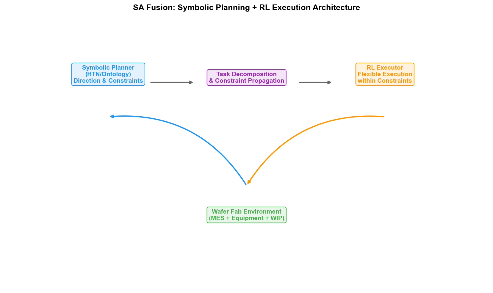
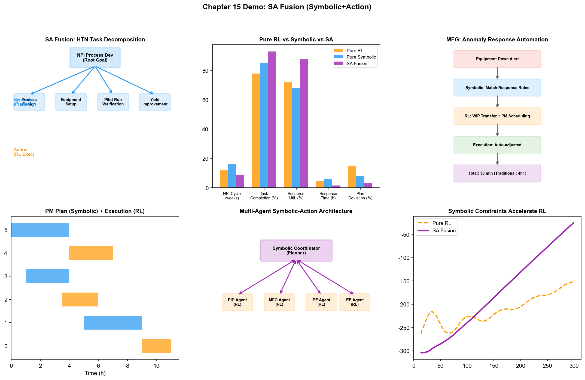
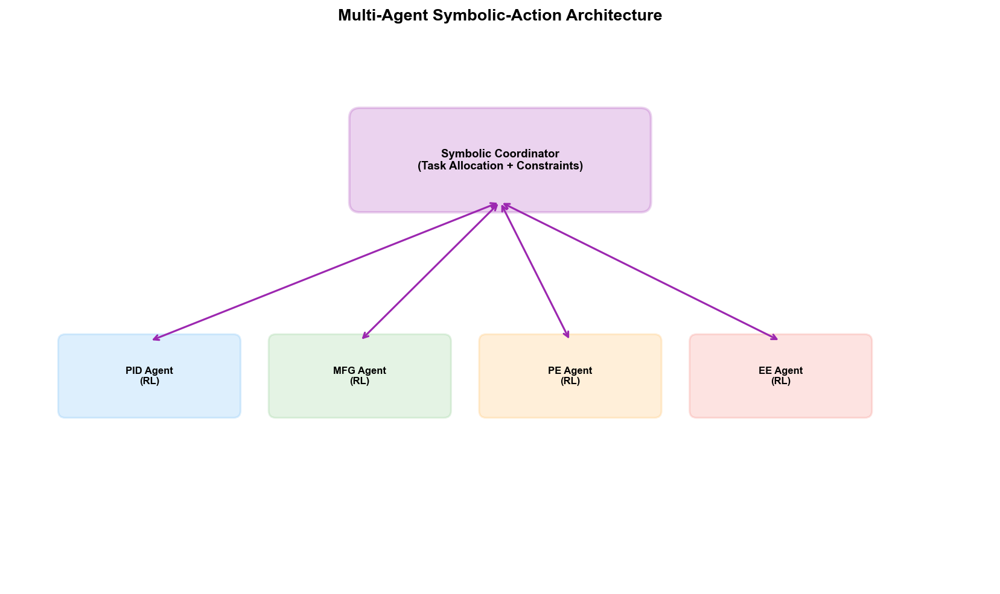

# Chapter 20: SA (Symbolic + Action) — Symbolic-Action Fusion in the Wafer Fab

## 20.1 Core Concept: Combining Planning and Execution

The core concept of SA fusion is: using symbolism for "planning" — decomposing complex goals into ordered task sequences; and using behaviorism for "execution" — adaptively completing each task in uncertain environments.

This concept originates from the natural pattern by which humans handle complex tasks. Taking "cooking a dinner" as an example: first plan the menu (symbolic planning — decide which dishes to make and in what order), then adapt during execution based on actual conditions (behavioral execution — if you find you're short on salt, reduce the amount; if the heat is too high, turn it down). Planning provides a "sense of direction," while execution provides "flexibility."

In AI, these two capabilities have long been separated:

- **Symbolic planning systems** (such as HTN, STRIPS planners) are adept at decomposing "build a new product" into ordered task sequences like "design process flow → define DOE → execute experiments → analyze results → adjust process." But they assume the environment is deterministic — once an unexpected event occurs during execution (equipment failure, parameter drift), the planner cannot adapt.
- **Reinforcement learning systems** excel at making sequential decisions under uncertainty but lack "global planning" capability — RL policies are typically reactive, "making decisions based on the current state," and are not adept at handling complex goals requiring multi-step coordination.

The essence of SA fusion is: **symbolic planning provides global structure and task decomposition, while behavioral execution adaptively handles uncertainty within each sub-task**. This "planning-execution" layered architecture has long been commonplace in software engineering (the separation of high-level design from low-level implementation); in AI, it is the key to advancing toward autonomous systems.

## 20.2 Technical Pathways



*Figure: SA Fusion's symbolic planning + behavioral execution layered architecture — HTN planning → RL execution → adaptive adjustment → global consistency verification*

### Pathway 1: Symbolic Planning + RL Execution

This is the most direct technical pathway for SA fusion — the symbolic planner generates a task sequence, and the RL policy executes each sub-task:

```
Input goal: "Complete DOE validation for the new process within 4 weeks"

Symbolic planning layer (Symbolic):
  HTN (Hierarchical Task Network) decomposes the goal into:
  
  1. Process window definition
     1.1 Collect reference process parameters
     1.2 Define key parameter ranges
     1.3 Generate initial DOE plan
  2. Experiment execution
     2.1 Allocate experimental wafers
     2.2 Schedule equipment time
     2.3 Execute DOE batches
  3. Result analysis
     3.1 Measure WAT/CP
     3.2 Analyze parameter-yield relationships
     3.3 Identify optimal parameter window
  4. Validation andformalization
     4.1 Run verification batch with optimal parameters
     4.2 Confirm yield meets target
     4.3 Update SPEC

Execution layer (Action/RL):
  Each sub-task is executed by an RL policy —
  Sub-task 2.3 "Execute DOE batches":
    RL policy selects optimal execution sequence based on current production line status
    If Tool-A03 suddenly fails, RL adaptively switches to Tool-A05
    If a batch's results are abnormal, RL decides whether additional experiments are needed
```

The division of labor between symbolic planning and RL execution is: **the planner decides "what to do" and "in what order," while the RL policy decides "how to do it" and handles uncertainty during execution**.

### Pathway 2: HTN + Adaptive Execution

HTN (Hierarchical Task Network) is a classic symbolic planning method that decomposes complex goals into executable atomic tasks through recursive decomposition. SA fusion introduces adaptive capability into HTN's execution layer:

```
HTN planning:
  Root goal: Improve yield for a product from 90% to 95%
  
  Decomposition level 1 (strategic):
    → Process parameter optimization
    → Defect mode improvement
    → Equipment stability enhancement
  
  Decomposition level 2 (tactical):
    Process parameter optimization → Etch parameter tuning + Litho parameter tuning + CMP parameter tuning
    Defect mode improvement → Particle defect control + Facet defect control
    Equipment stability enhancement → PM frequency optimization + Tool Matching
  
  Decomposition level 3 (execution):
    Etch parameter tuning → DOE design + Experiment execution + Result analysis + Parameterformalization
    
Adaptive execution:
  Each execution-level task is executed by a behaviorist model —
  
  "Experiment execution" task:
    Preset: Run 5 parameter sets on Tool-A03
    During execution: Tool-A03 has sudden PM demand
    Adaptive: RL policy decides —
      Option A: Wait for Tool-A03 PM to complete and continue (high time cost)
      Option B: Transfer to Tool-A05 (requires Tool Matching verification)
      Option C: Adjust experiment order, do non-Tool-A03-dependent parts first
    Selection: Based on comprehensive assessment of production line status and DOE progress, select Option B
```

The key advantage of HTN + adaptive execution is: **when execution deviates from the plan, there is no need to re-plan the entire task sequence — only adaptive adjustment within the affected sub-task is needed**. This greatly reduces the system's response latency.

### Pathway 3: Multi-Agent Symbolic-Action Architecture

In a wafer fab, many tasks involve multi-department coordination — the NPI process requires PID, MFG, and PE/EE to participate simultaneously. The multi-agent architecture extends SA fusion to multi-agent scenarios:

```
Symbolic layer: Global task decomposition and assignment
  Goal: "New product NPI on-time mass production"
  
  Decomposed into department-level tasks:
    PID Agent: Process development and validation
    MFG Agent: Capacity planning and production scheduling
    PE Agent: Recipe development andformalization
    EE Agent: Equipment preparation and PM planning
  
  Symbolic constraints define inter-department dependencies:
    MFG's production scheduling must come after PID confirms the process flow
    PE's Recipeformalization must come after PID's DOE validation passes
    EE's PM plan must be arranged around MFG's production schedule

Behavioral layer: Each Agent adapts during execution
  PID Agent executing process development:
    Discovers a process step's window is narrower than expected
    → Adaptive: Expand DOE range, re-evaluate
    → Notify PE Agent: Additional Recipe optimization needed
  
  MFG Agent executing production scheduling:
    Discovers a key equipment's OEE is lower than expected
    → Adaptive: Adjust scheduling strategy, add backup equipment
    → Notify EE Agent: Equipment needs PM
  
  EE Agent executing PM plan:
    Discovers PM-required spare parts are delayed
    → Adaptive: Adjust PM order, do equipment not requiring this spare part first
    → Notify MFG Agent: Equipment availability time delayed
```

The key to the multi-agent symbolic-action architecture is: **the symbolic layer defines the global structure of "who does what and when," while the behavioral layer allows each Agent to flexibly adjust during execution, coordinating deviations through inter-Agent communication**.

## 20.3 Applications in PID/YED

### NPI Project Management and Task Decomposition

NPI (New Product Introduction) is one of the most complex project types in a wafer fab — involving multiple stages such as process development, equipment verification, yield ramp, and mass production handover, typically spanning 6-18 months. SA fusion upgrades NPI management from "manual Gantt charts" to "autonomous planning + adaptive execution":

```
Symbolic planning (NPI master plan):
  HTN decomposes NPI into a stage-milestone-task three-level structure:
  
  Stage 1: Process design (0-3 months)
    Milestone: Process flow definition complete
    Tasks: Process step design, initial parameter range definition, equipment capability assessment
  
  Stage 2: DOE validation (3-6 months)
    Milestone: Optimal parameter window confirmed
    Tasks: DOE design, experiment execution, result analysis, parameterformalization
  
  Stage 3: Yield ramp (6-12 months)
    Milestone: Yield reaches mass production threshold (typically >90%)
    Tasks: Defect improvement, parameter fine-tuning, equipment matching, batch verification
  
  Stage 4: Mass production handover (12-15 months)
    Milestone: Mass production Release
    Tasks: SPECformalization, SOP update, personnel training

Adaptive execution:
  Tasks within each stage are executed by RL/behavioral models —
  
  Adaptive in Stage 2 "DOE validation":
    Preset: 5 DOE experiment groups, 3 wafers per group
    During execution: Group 3 results show excessive deviation in a parameter direction
    Adaptive: RL policy adjusts subsequent experiment plan, adding finer-grained experiment points in that parameter direction
    Symbolic layer verification: Adjusted plan still satisfies DOE's statistical design principles (orthogonality, rotatability)
```

### Symbolic Orchestration of Process Development Workflows

Process development involves a large number of steps that need to be executed in sequence, with complex dependency relationships between steps. SA fusion uses symbolic planning to orchestrate the workflow and behavioral models to handle uncertainty during execution:

- **The symbolic layer defines the task dependency graph for process development**: For example, "etch parameter optimization" can only begin after "etch Recipe initial version" is complete, but can run in parallel with "litho parameter optimization"
- **The behavioral layer makes adaptive decisions during each step's execution**: For example, during "etch parameter optimization," the RL policy adaptively adjusts the parameter search direction based on experimental results
- **The symbolic layer monitors global consistency**: When a step's execution result affects the preconditions of subsequent steps, the symbolic planner re-evaluates and adjusts the subsequent plan

### Automated Planning and Execution of Yield Improvement Projects

Yield Improvement (YI) projects are typically multi-objective optimization problems — requiring simultaneous improvement of multiple defect types and coordinating actions across multiple departments. The SA fusion approach:

- **Symbolic planning**: Decomposes the YI goal into improvement sub-projects targeting each defect type, defining priorities and dependencies among sub-projects
- **Behavioral execution**: Each improvement sub-project is executed by an RL policy — searching for improvement solutions in the process parameter space, finding optimal solutions in equipment scheduling
- **Symbolic layer coordination**: When two sub-projects' solutions conflict (e.g., "reducing etch defects requires lowering power" but "increasing etch rate requires raising power"), the symbolic planner intervenes to coordinate, deciding on a compromise based on the global yield goal

## 20.4 Applications in MFG

### Automated Exception Response Workflow

Wafer fabs experience a large number of exception events daily — equipment failures, parameter exceedances, batch anomalies, etc. The traditional workflow is: operator discovers exception → notifies engineer → engineer assesses impact → decides response measures → executes. SA fusion automates this workflow:

```
Symbolic planning (exception response SOP):
  Defines standard response workflows for each type of exception:
  
  "Equipment sudden failure" response workflow:
    1. Fault confirmation and isolation (automatic)
    2. Impact assessment: affected batches, capacity loss (automatic)
    3. Batch re-dispatch decision (semi-automatic)
    4. Maintenance scheduling (automatic)
    5. Recovery verification (automatic)
    6. Incident report generation (automatic)

Adaptive execution (behavioral layer):
  Step 3 "Batch re-dispatch decision":
    Preset rule: Affected batches re-dispatched to same-type equipment
    During execution: Same-type equipment Tool-A05's queue is full
    Adaptive: RL policy evaluates —
      Wait for Tool-A05 (delivery risk) vs re-dispatch to Tool-A07 (requires Tool Matching)
      Select optimal option based on each batch's delivery urgency and Tool Matching history
      
  Step 4 "Maintenance scheduling":
    Preset rule: Notify EE engineer
    During execution: All EE engineers currently handling other failures
    Adaptive: RL policy prioritizes based on fault severity and engineer workload
```

### Hierarchical Decomposition and Execution of Production Plans

Production planning goes from monthly to weekly to daily to real-time dispatching — a multi-level decomposition process. SA fusion plays a role in this hierarchical process:

- **Symbolic layer (monthly/weekly plan)**: HTN decomposes monthly production targets into product line-process step-equipment level production tasks, defining priorities and delivery constraints
- **Symbolic layer (daily plan)**: Rule engine refines the weekly plan into specific daily batch arrangements, considering equipment PM schedules and engineering experiment time
- **Behavioral layer (real-time dispatching)**: RL policy makes real-time dispatching decisions within the daily plan framework, handling dynamic events such as equipment failures and urgent batches

The advantage of this layered architecture is: high-level planning provides globally optimal direction (symbolic layer), while low-level execution provides locally optimal flexibility (behavioral layer), with the two achieving coordination through constraint propagation and feedback correction.

### Cross-Department Coordination via Symbolic-Action Scheduling

When production activities require cross-department coordination (e.g., engineering experiments need to occupy production equipment time), the SA fusion approach:

- **Symbolic planning**: Defines workflow templates for cross-department coordination — "engineering experiment request → capacity assessment → time window allocation → experiment execution → capacity recovery"
- **Symbolic constraints**: Engineering experiment time must not affect delivery of high-priority production batches
- **Behavioral execution**: RL policy searches for the optimal experiment time window within the constraint space — satisfying engineering needs while minimizing impact on production
- **Feedback loop**: After experiment execution, actual capacity impact is fed back to the symbolic layer to optimize future coordinated scheduling

## 20.5 Applications in PE/EE

### PM Planning + Adaptive Execution

Preventive maintenance (PM) planning is one of the core responsibilities of PE/EE. Traditional PM plans are based on fixed intervals (every N batches or every M hours), but actual equipment degradation rates are influenced by multiple factors such as usage intensity, process conditions, and batch types. The SA fusion approach:

```
Symbolic planning (annual PM plan):
  Defines PM types and annual plans for each equipment:
  
  Equipment Tool-A03:
    Quarterly PM (Q-PM): Every 3 months, includes chamber cleaning and consumable replacement
    Semi-annual PM (H-PM): Every 6 months, includes Q-PM content + matcher calibration
    Annual PM (Y-PM): Every year, includes H-PM content + comprehensive sensor calibration
    
  Symbolic constraints:
    Q-PM must be completed within 1000 batches of last Q-PM
    H-PM and Y-PM must be completed within 6/12 months of last occurrence
    PM time window must avoid high-priority production batches

Adaptive execution (behavioral layer):
  Dynamic adjustment based on equipment's actual condition —
  
  900 batches since last Q-PM, FDC signals show chamber pressure drift accelerating
  → RL policy evaluates: Risk of continuing production vs capacity impact of early PM
  → Decision: Execute Q-PM early in next production window
  
  5 months since last H-PM, but matcher impedance within control limits
  → RL policy evaluates: Risk of delaying H-PM to 6.5 months vs executing on schedule
  → Decision: Delay H-PM, but increase matcher monitoring frequency
```

### Symbolic Planning of Equipment Repair Workflows

When equipment fails, the repair process needs to follow standardized steps — but the order and content of steps may vary by fault type. SA fusion:

- **Symbolic layer**: The equipment fault knowledge graph defines standard repair workflows for different fault types — "RF power anomaly" repair steps are "check matcher → check cables → check chamber," "temperature anomaly" steps are "check heater → check thermocouple → check cooling system"
- **Behavioral layer**: During each repair step, the RL policy decides the next step based on inspection results — "capacitance value normal when checking matcher, skip replacement step, proceed directly to check cables"
- **Symbolic layer verification**: After repair completion, a rule engine verifies that all necessary steps were completed, ensuring repair quality

### Task Decomposition and Optimization of Tool Matching

Tool Matching is a key task ensuring output consistency across same-type equipment. SA fusion decomposes Tool Matching into a planning-execution structure:

- **Symbolic planning**: Defines the standard Tool Matching workflow — "select reference equipment → define matching parameters → run matching batches → analyze differences → adjust parameters → verify consistency"
- **Behavioral execution**: In the "analyze differences" and "adjust parameters" steps, the RL policy searches for the optimal parameter compensation solution based on difference patterns
- **Symbolic layer constraints**: Adjusted parameters must be within SPEC range and must not affect other verified parameter combinations

## 20.6 Practice Cases

### Samsung: Planning-Execution Architecture of the Autonomous Manufacturing System

Samsung's autonomous manufacturing system embodies the core concept of SA fusion:

- **Symbolic planning layer**: The process knowledge graph defines standard task sequences from "yield drop" to "root cause localization" to "parameter adjustment"
- **Behavioral execution layer**: Graph analysis + RL policy adapts during each step — for example, during "root cause localization," dynamically adjusting the search path based on the sensor network relationship graph
- **SA fusion embodiment**: The system covers autonomous fault maintenance for 762 pieces of equipment, handling over 85,000 real faults — each fault response follows the standard workflow of symbolic planning, but adaptive decisions are made by behavioral models at each step
- **Results**: MTTR reduced by 7 minutes, validating the feasibility of "symbolic planning + behavioral execution" in a real wafer fab

### Palantir AIP: Ontology-Driven Task Orchestration

Palantir's AIP platform unifies Ontology (symbolic layer) and Action (behavioral layer) within its architecture:

- **Symbolic layer**: Ontology defines the wafer fab's entity relationships and business rules — the causal chain of "equipment → process step → batch → yield," the workflow chain of "fault → impact → response → recovery"
- **Behavioral layer**: AIP's Action module triggers automated execution based on rules in the Ontology — when the Ontology detects a state change for a piece of equipment, it automatically triggers a predefined response workflow
- **SA fusion embodiment**: AIP not only does data fusion and reasoning (NB fusion), but can also trigger actions based on reasoning results — "Ontology infers Tool-A03 needs urgent PM → Action module automatically notifies EE team, re-dispatches affected batches, adjusts production plan"
- **Industrial validation**: Samsung, Micron, European IDMs, and other semiconductor companies have deployed AIP, validating the robustness of Ontology-driven planning-execution architecture in complex manufacturing environments

### L3Harris (Palantir Warp Speed Case): Symbolic-Action Architecture for Complex Manufacturing

L3Harris, as a complex manufacturer, used Palantir Warp Speed to implement an SA fusion manufacturing system:

- **Symbolic layer**: Warp Speed's Ontology defines the complete task decomposition structure from order to production — order → product BOM → process route → process task → equipment assignment
- **Behavioral layer**: During execution, the system adaptively handles material shortages, equipment failures, priority changes, and other uncertainties
- **Results**: Order-to-production cycle visibility improved significantly, exception response shortened from "hours of manual coordination" to "system auto-adjustment + human confirmation"
- **Implications for wafer fabs**: Warp Speed's architecture proves the feasibility of "Ontology-driven planning + adaptive execution" in complex manufacturing, and this architecture can be directly transferred to wafer fab NPI management and exception response scenarios

### Flexciton: Mixed-Integer Programming + RL Scheduling System

Flexciton's wafer fab scheduling system embodies the practice of SA fusion in MFG:

- **Symbolic layer**: Mixed-integer programming (MIP) defines the globally optimal structure of scheduling — task assignment satisfying process constraints, equipment constraints, and delivery constraints
- **Behavioral layer**: RL policy makes real-time fine-tuning within the MIP framework — handling dynamic events such as equipment failures and urgent insertions
- **SA fusion**: MIP provides the globally optimal "backbone" plan, and RL makes real-time "fine adjustments" on the backbone — ensuring both global optimality and real-time responsiveness
- **Validation**: Deployed in multiple wafer fabs, reducing average delivery time by 5-10% and reducing equipment idle time compared to traditional heuristic scheduling

### Multi-Agent Systems in NPI Coordination: Exploratory

Although multi-agent SA architecture is still in the research stage in wafer fabs, there are exploratory cases:

- **Academic prototypes**: Multiple research teams have explored HTN + multi-agent-based NPI coordination — PID Agent handles process development tasks, MFG Agent handles capacity planning, PE Agent handles Recipe optimization, with inter-Agent dependencies defined by symbolic constraints
- **Industrial exploration**: Some leading wafer fabs have used multi-agent architecture in internal experiments to simulate NPI workflows — validating the feasibility of "symbolic planning + behavioral execution" in cross-department coordination
- **Challenges**: Robustness and safety verification of multi-agent systems is the main bottleneck — when multiple Agents' decisions influence each other, how to ensure global consistency is still under research

---

The core value of SA fusion in wafer fabs is "structured autonomy" — enabling AI not only to make optimization decisions locally, but also to understand the global task structure and adaptively execute within a planning framework. This "planning + execution" layered architecture is the bridge connecting "point-wise AI optimization" and "fab-wide autonomous operation."

The challenges facing SA fusion differ from those of NA fusion — its bottleneck is not algorithmic capability, but **knowledge acquisition and consistency verification**. Symbolic planning requires accurate domain knowledge (process flows, equipment constraints, department dependencies), and the acquisition and maintenance of this knowledge is the main bottleneck. At the same time, when behavioral layer execution deviates from the plan, how to ensure that deviations do not break global consistency — this requires tight feedback mechanisms between the symbolic and behavioral layers. In wafer fabs, this means that SA fusion system deployment must be deeply integrated with the factory's existing SOPs (Standard Operating Procedures), rather than simply overlaying AI capabilities.

## 20.7 Demo Visualization: SA Fusion Task Orchestration and Coordination



*Demo description: Top-left is the HTN task decomposition tree, top-center is the comparison of pure RL vs pure symbolic vs SA fusion, top-right is the automated exception response workflow. Middle row shows the PM Gantt chart, multi-agent symbolic-action architecture, and symbolic constraints accelerating RL convergence, respectively. Bottom is the SA fusion full-dimension radar chart comparison. See simulation script at `demos/demo_ch20_sa_fusion.py`.*


