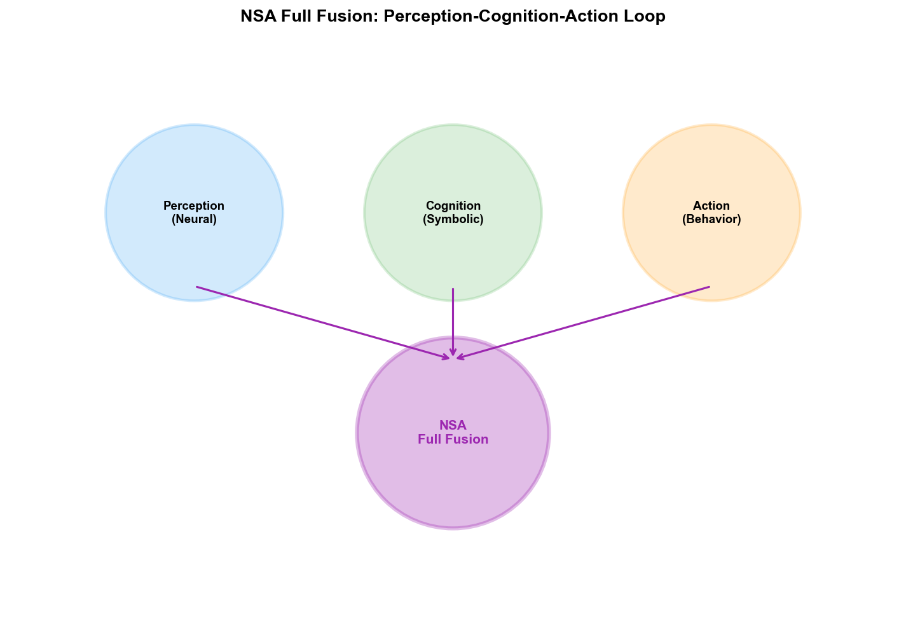
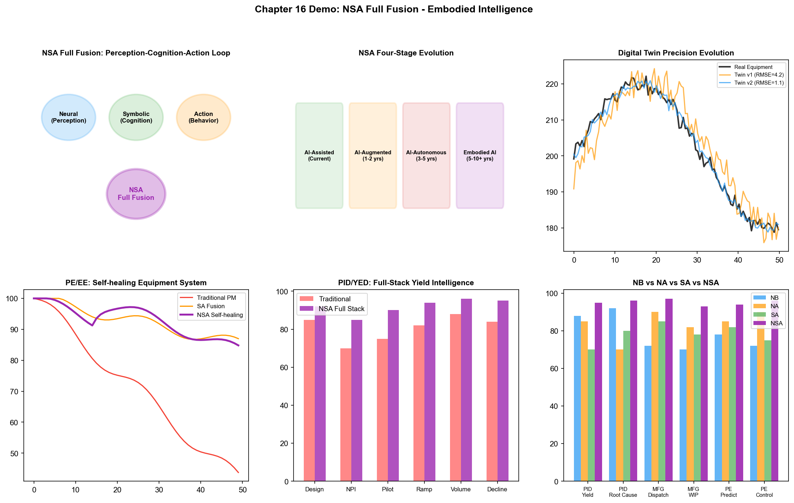
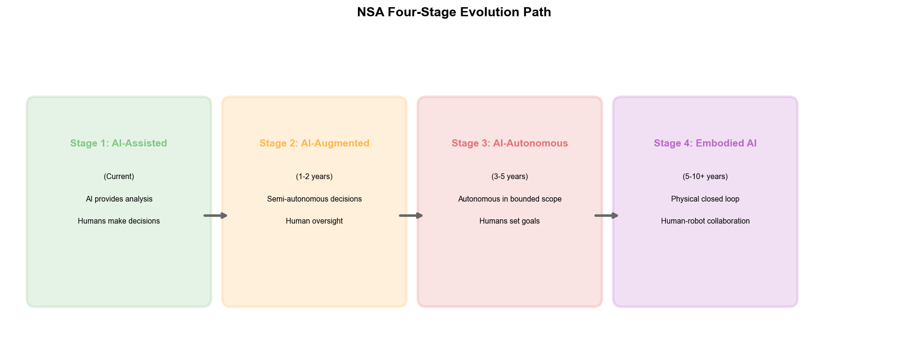

# Chapter 21: NSA Full Fusion — Embodied Intelligence and the Future of Wafer Fabs

## 21.1 Core Concept: The Perception-Cognition-Action Closed Loop

NSA full fusion unifies the three paradigms into a complete intelligence closed loop of "perception (vision/audio/signals) — cognition (reasoning/knowledge/planning) — action (control/optimization/execution)."

If NB fusion lets AI "think correctly," NA fusion lets AI "do it," and SA fusion lets AI "follow a method," then the goal of NSA full fusion is to give AI all three capabilities simultaneously — not only seeing and understanding, thinking correctly, but also doing it methodically. In nature, this is the fundamental mode of biological intelligence: humans perceive the environment through senses (Neural), understand the environment through knowledge and reasoning (Symbolic), and change the environment through action (Action) — the three forming a continuous closed loop.

The ultimate form of NSA full fusion is **Embodied Intelligence (Embodied AI)** — AI not only exists in the digital world processing data, but also interacts with the real environment through physical interfaces (robots, automated equipment). In the context of a wafer fab, embodied intelligence means: an AI system can perceive production line status (through sensors and inspection data), understand problem root causes (through knowledge reasoning), and autonomously execute corrective actions (through controlling equipment and scheduling the production line), forming a fully closed-loop autonomous operation.

### The Progressive Relationship from Separate to Full Fusion

NB, NA, and SA fusions are not simple additions to form NSA full fusion — they constitute progressive fusion levels:

```
NB Fusion (Neural + Symbolic):
  Perception → Cognition
  "See defects → Understand root cause"
  Missing: Cannot act autonomously

NA Fusion (Neural + Action):
  Perception → Action
  "See anomaly → Adjust parameters"
  Missing: Cannot reason and plan

SA Fusion (Symbolic + Action):
  Cognition → Action
  "Plan task sequence → Execute tasks"
  Missing: Cannot perceive from raw data

NSA Full Fusion:
  Perception → Cognition → Action → Perception → ...
  "See defects → Reason about root cause → Execute repair → Verify effect → Continuously learn"
  Complete closed loop
```

Each fusion step addresses the "missing" part of the previous step, ultimately forming a complete intelligence closed loop in NSA full fusion. This progressive relationship is not a theoretical concept — current AI technology development is evolving along this path.

## 21.2 Technical Pathways



*Figure: NSA Full Fusion — Perception-Cognition-Action closed loop and the four-stage evolution of embodied intelligence*

### Pathway 1: World Model and Digital Twin

The World Model is the core infrastructure of NSA full fusion — an internal model that can simulate environmental dynamics, enabling AI to "rehearse" the consequences of actions "in its mind."

```
World Model = Perception Encoder + Dynamics Model + Action Decoder

Perception Encoder (Neural):
  Encodes high-dimensional sensor data (wafer maps, FDC signals, MES data) into low-dimensional latent states
  z_t = Encoder(observations_t)

Dynamics Model (Symbolic + Neural):
  Predicts the next time step's state z_{t+1} under action a_t
  z_{t+1} = DynamicsModel(z_t, a_t)
  
  Hybrid architecture:
  - Neural network part: Learns data-driven state transition patterns
  - Symbolic constraint part: Ensures predictions satisfy physical laws and process rules
  
Action Decoder (Action):
  Selects optimal action based on predicted state
  a_t* = Policy(z_t, z_{t+1}^{predicted})
```

In a wafer fab, the embodiment of the world model is the **Digital Twin** — a virtual model synchronized with the real wafer fab that can simulate process flows, equipment behavior, and production dynamics.

The role of the digital twin in NSA full fusion:

- **Perception layer**: The digital twin synchronizes data from the real wafer fab (MES, FDC, YMS), forming a real-time state mirror
- **Cognition layer**: Knowledge graphs and reasoning engines perform "what-if" analysis on the digital twin — "if adjusting Step 47's power by +5W, predict the impact on subsequent steps in the digital twin"
- **Action layer**: RL policy rehearses multiple action plans in the digital twin, selecting the most effective plan for execution on the real production line
- **Closed-loop verification**: After execution, real results are fed back to the digital twin to calibrate and update the world model

### Pathway 2: Multimodal Embodied Intelligence

Multimodal embodied intelligence extends NSA full fusion to multiple perception modalities — not only processing structured data, but also understanding images, time-series signals, natural language, and other diverse inputs:

```
Multimodal perception layer (Neural):
  - Visual modality: Wafer maps, defect photos, equipment status images
  - Time-series modality: FDC signals, SPC data, temperature/pressure trends
  - Text modality: SPEC documents, operating SOPs, engineer notes
  - Structural modality: MES batch records, equipment topology graphs, process flow diagrams
  
  Unified encoding into multimodal embedding vectors

Cognition layer (Symbolic):
  Knowledge graphs map multimodal embeddings to a semantic space —
  "This visual defect pattern" + "This FDC signal anomaly" + "This SPEC rule"
  → Comprehensive reasoning about root cause and impact scope

Action layer (Action):
  RL policy outputs multimodal actions based on multimodal perception and cognitive reasoning —
  - Digital actions: Adjust parameters, re-dispatch batches, trigger PM
  - Physical actions (future): Control automated equipment, guide repair robots
```

In current wafer fabs, physical actions are primarily executed by humans (engineers operate equipment following AI recommendations). But as factory automation deepens — AMHS (Automated Material Handling System), automated inspection equipment, remote-controlled equipment — NSA full fusion's "physical action" capability will gradually materialize.

### Pathway 3: End-to-End Agent Architecture

The end-to-end agent architecture is the frontier direction of NSA full fusion — unifying perception, cognition, and action in a single system trainable end-to-end:

```
Input: Multimodal raw data (images + signals + text + structure)
  ↓
Unified backbone network (Transformer/Mamba):
  Simultaneously encodes all modalities, outputs unified state representation
  ↓
Cognition-Action joint module:
  Knowledge reasoning + policy optimization jointly trained
  ↓
Output: Action sequence (parameter adjustments + dispatch instructions + PM arrangements)

End-to-end training:
  Gradients flow directly from "perception" to "action"
  The system learns "what to look at" depends on "what to do"
  The system learns "what to reason about" depends on "what action needs"
```

This architecture has been explored in research (such as Google's RT-2 for robot control), but is still in the conceptual stage in wafer fabs — the main bottleneck is training data: end-to-end systems require large amounts of "perception-cognition-action" triplet data, and each "environment interaction" (actual production batch) in a wafer fab is extremely expensive.

## 21.3 Applications in PID/YED

### Full-Stack Yield Intelligence (Perception → Reasoning → Optimization → Verification)

The ultimate application of NSA full fusion in PID/YED is "full-stack yield intelligence" — connecting the entire yield management process into an autonomous closed loop:

```
Perception (Neural):
  CNN analyzes wafer maps → "Edge ring defect, confidence 94%"
  LSTM analyzes FDC signals → "Step 47 etch chamber pressure has 0.2mTorr drift"
  GNN analyzes inter-batch correlations → "3 batches on same equipment affected"

Cognition (Symbolic):
  Knowledge graph retrieval → "Possible root causes of edge ring defect: etch edge effect, litho edge effect"
  Rule engine reasoning → "FDC pressure drift + edge ring defect → Primary root cause: etch edge effect"
  LLM generates analysis → "Tool-A03 etch chamber pressure drift caused non-uniform edge etch rate,
                              suggest checking chamber edge gas distribution device"

Optimization (Action):
  RL policy searches for optimal repair solution →
  "Option A: Adjust etch power distribution compensation +0.3% (estimated yield recovery 92%)
   Option B: Perform chamber edge cleaning PM (estimated yield recovery 94%, but requires 4-hour downtime)
   Option C: Option A+B combined (estimated yield recovery 95%, requires 4-hour downtime)"

Verification (Neural + Symbolic):
  Digital twin rehearsal → Simulate Option C's effect in virtual environment
  Actual execution → Execute Option C on Tool-A03
  Result verification → Next batch yield recovers to 93.5%
  Knowledge update → Write "pressure drift 0.2mTorr → edge defect → Option C effective" into knowledge graph

Closed loop:
  Perception → Cognition → Optimization → Verification → Knowledge update → Enhanced perception (next round)
```

### Autonomous Process Development System

Process development in NPI is the scenario that best embodies the value of NSA full fusion — it requires the complete closed loop of perception (understanding experimental results), cognition (reasoning about process mechanisms), and action (deciding the next experiment):

- **Perception layer**: Deep learning models analyze each round of DOE's wafer maps, WAT/CP data, and FDC signals, extracting process result features
- **Cognition layer**: Knowledge graphs combined with process physics models reason from experimental results about "which parameter direction is effective," "which interaction effect is significant," "where are the process window boundaries"
- **Action layer**: RL policy decides the next round of DOE's parameter plan based on cognitive reasoning — intensifying search in effective directions, stopping exploration in ineffective directions
- **Closed loop**: Each round of experimental results updates the knowledge graph and RL policy, forming an adaptive cycle of "experiment → learn → optimize → re-experiment"

The vision of this autonomous process development system is: the engineer sets a goal ("find the parameter combination that achieves yield >92%"), and the system autonomously plans and executes DOE experiments, ultimately outputting optimal process parameters and a complete reasoning chain — dramatically shortening the NPI cycle.

## 21.4 Applications in MFG

### Autonomous Manufacturing Operations

The ultimate form of NSA full fusion in MFG is "autonomous manufacturing operations" — an AI system managing the factory's daily operations with minimal human intervention:

```
Perception layer (Neural):
  Real-time synchronization of factory-wide data —
  - MES: Batch locations, process progress, WIP distribution
  - FDC: Equipment status, process parameters, exception alerts
  - YMS: Yield data, defect distribution
  - AMHS: Material locations, OHT status

Cognition layer (Symbolic):
  Ontology unifies factory-wide data semantics —
  - Reasoning: Where is the current bottleneck? Where will it shift in the next 2 hours?
  - Planning: Today's production goals decomposed into specific tasks for each equipment
  - Constraint checking: All plans satisfy process and delivery constraints

Action layer (Action):
  Multi-agent collaborative execution —
  - Scheduling Agent: Real-time dispatching, optimizing WIP flow
  - Equipment Agent: Monitoring equipment health, autonomously triggering PM
  - Yield Agent: Monitoring yield trends, autonomously adjusting parameters
  - Exception Agent: Responding to emergencies, autonomously adjusting plans

Closed loop:
  Action results fed back to perception layer → Update factory-wide state → Re-reason and plan → New actions
```

This autonomous operation vision is far from realized at the current stage — but its components are gradually materializing:

- **Deployed components**: Intelligent dispatching (NA fusion), automated exception response (SA fusion), cross-system data Q&A (NB fusion)
- **Components under validation**: Multi-agent collaborative scheduling, autonomous PM decisions, digital twin rehearsal
- **Components still in research**: Fully autonomous process development, end-to-end fab-wide optimization, human-machine collaborative autonomous operation

### Fab-Wide Autonomous Decision-Making

Fab-wide optimization is the most challenging yet most valuable application of NSA full fusion — simultaneously optimizing yield, capacity, cost, and delivery from a global perspective:

- **Perception layer**: GNN encodes factory-wide state as a graph structure — equipment nodes, batch nodes, process step nodes, and their relationship edges
- **Cognition layer**: Knowledge graph defines constraint relationships among optimization objectives — "improving yield may require reducing capacity (stricter parameter control leads to slower process speed)," "increasing capacity may affect yield (faster cycle time leads to narrower parameter control windows)"
- **Action layer**: Multi-agent RL searches for Pareto-optimal policies in the constraint space — finding the best balance point among yield, capacity, cost, and delivery
- **Closed loop**: Post-execution factory-wide KPIs fed back to the perception layer for continuous optimization of the multi-objective balancing policy

## 21.5 Applications in PE/EE

### Self-Healing Equipment Systems

The ultimate application of NSA full fusion in PE/EE is the "self-healing equipment system" — equipment that can autonomously perceive faults, diagnose root causes, execute repairs, and verify recovery:

```
Perception (Neural):
  FDC signal anomaly detection → "RF power oscillation frequency changed from stable to 12Hz oscillation"
  Vibration sensor → "Matcher position vibration amplitude increased 30%"
  Temperature sensor → "Matcher housing temperature rose 5°C"

Cognition (Symbolic):
  Knowledge graph reasoning → 
  "RF power oscillation + matcher vibration increase + matcher temperature rise
   → Root cause: Matcher internal capacitor aging causing impedance mismatch
   → Impact scope: Current equipment + same-type equipment using same-batch matchers
   → Repair plan: Replace matcher capacitor (standard repair procedure MP-047)"

Action (Action):
  RL policy plans repair execution —
  1. Safety isolation: Automatically switch equipment to maintenance mode, isolate RF power
  2. Maintenance scheduling: Notify EE engineer, prepare spare parts (capacitor model C-2304)
  3. Repair guidance: AR device displays repair steps and precautions for engineer
  4. Repair execution: Engineer replaces capacitor following guidance (future: repair robot)
  5. Recovery verification: After repair, automatically run verification batch, check RF stability

Verification (Neural + Symbolic):
  Perception: FDC signals return to normal, oscillation disappeared
  Cognition: Knowledge graph records "matcher capacitor aging → replacement → repair" case
  Learning: RL policy updates — "Other equipment with same-batch matchers may also face capacitor aging risk"
  Prevention: Automatically generates preventive replacement recommendations for same-batch matcher equipment
```

### Autonomous Equipment Tuning and Maintenance

NSA full fusion upgrades equipment tuning from "periodic manual adjustment" to "continuous autonomous optimization":

- **Perception layer**: Deep learning continuously monitors the equipment's process output quality (CD, depth, uniformity, etc.)
- **Cognition layer**: Knowledge graph understands the causal relationships between equipment parameters and process results — "RF power ↑ → etch rate ↑ but uniformity ↓"
- **Action layer**: RL policy autonomously fine-tunes parameters within process constraints to maintain optimal process output
- **Closed loop**: Tuning results fed back to perception and cognition layers, continuously updating the equipment's behavioral model and parameter-result causal relationships

## 21.6 Evolution Path from Point-Wise AI to Embodied Intelligence

NSA full fusion in wafer fabs is not achieved in one step — it requires a progressive four-stage evolution path:

### Stage 1: AI-Assisted

**Current stage, widely deployed**

- AI provides analysis and recommendations for engineers
- Humans make all decisions, AI assists analysis
- Typical applications: Defect classification (Neural), root cause reasoning (NB fusion), parameter recommendation (NA fusion)
- Characteristic: AI is a "tool," humans are "operators"

### Stage 2: AI-Augmented

**Current to near-term (1-2 years)**

- AI makes autonomous decisions in specific scenarios, but requires human confirmation
- Humans supervise AI decisions, intervene when anomalies occur
- Typical applications: Semi-autonomous dispatching, automated exception response, autonomous PM scheduling
- Characteristic: AI is an "assistant," humans are "supervisors"

### Stage 3: AI-Autonomous

**Mid-term (3-5 years)**

- AI operates fully autonomously in limited scenarios
- Humans set goals and constraints, AI autonomously plans and executes
- Typical applications: Autonomous process development, fab-wide autonomous scheduling, self-healing equipment
- Characteristic: AI is an "agent," humans are "managers"

### Stage 4: Embodied Intelligence

**Long-term (5-10+ years)**

- AI interacts with the real environment through physical interfaces (robots, automated equipment)
- Forms a complete physical closed loop of "perception → cognition → action"
- Typical applications: Autonomous repair robots, fully automated wafer fabs, human-machine collaborative manufacturing systems
- Characteristic: AI is an "autonomous entity," humans are "collaborators"

```
                     Perception    Cognition    Action    Physical Closed Loop
Stage 1: AI-Assisted      Yes          -          -           -
Stage 2: AI-Augmented     Yes          Yes        Part        -
Stage 3: AI-Autonomous    Yes          Yes        Yes         -
Stage 4: Embodied AI      Yes          Yes        Yes         Yes

Yes = Fully implemented  Part = Partially implemented  - = Not implemented
```

## 21.7 Practice Cases

### Samsung: NSA Prototype of the Autonomous Manufacturing System

Samsung's autonomous manufacturing system is the industrial practice closest to NSA full fusion:

- **Perception layer (Neural)**: Deep learning models detect anomalies in real-time from sensor signals of 762 lithography equipment
- **Cognition layer (Symbolic)**: Knowledge graph + graph analysis reasoning about fault root causes and impact scope
- **Action layer (Action)**: Autonomous triggering of fault maintenance workflows — isolating equipment, re-dispatching batches, scheduling repairs
- **NSA closed loop**: Perception → Cognition → Action → Verification → Knowledge update
- **Results**: Handled over 85,000 real faults, MTTR reduced by 7 minutes
- **NSA characteristics**: The system not only detects and diagnoses (NB), but also autonomously decides and executes (Action), and learns from each fault to update knowledge (closed-loop learning)

### Palantir + NVIDIA: NSA Architecture of AIOS-RA

Palantir and NVIDIA jointly released AIOS-RA (AI Operating System Reference Architecture), defining an industrial-grade architecture for NSA full fusion[94]:

- **Perception layer (Neural)**: NVIDIA's GPU-accelerated deep learning processes multimodal sensor data (images, signals, time-series)
- **Cognition layer (Symbolic)**: Palantir's Ontology provides a unified data semantic model and reasoning engine
- **Action layer (Action)**: AIP's Action module triggers automated workflows based on reasoning results
- **World model**: NVIDIA Omniverse provides digital twin as the "rehearsal" environment for the NSA closed loop
- **NSA characteristics**: The three-layer architecture (NVIDIA perception layer → Palantir cognition layer → Rubix action layer) implements NSA full fusion at the architectural level
- **Significance for wafer fabs**: AIOS-RA provides a reference NSA full fusion architecture blueprint for wafer fabs — no need to build from scratch, but deploy in layers on existing IT/OT infrastructure

### NVIDIA Omniverse: Wafer Fab Digital Twin Platform

NVIDIA Omniverse is the infrastructure for the "world model" layer in NSA full fusion:

- **Digital twin**: Omniverse creates a 3D digital twin of the wafer fab — including equipment models, process models, and production models
- **Perception synchronization**: Real-time data from the real wafer fab is synchronized to the digital twin, forming a real-time mirror
- **Cognition rehearsal**: "What-if" analysis on the digital twin — "if adjusting a certain equipment parameter, what is the impact on fab-wide yield and capacity"
- **Action verification**: RL policy rehearses action plans in the digital twin, verifying effects before execution on the real production line
- **NSA characteristics**: The combination of Omniverse + cuLitho + Metropolis covers perception (Metropolis vision analysis), cognition (Omniverse simulation reasoning), and action (cuLitho parameter optimization)

### Micron: NSA Exploration of Predictive Manufacturing

Micron's predictive manufacturing system is evolving toward NSA full fusion:

- **Perception layer**: Deep learning models perceive factory-wide status in real-time from FDC, MES, and YMS data
- **Cognition layer**: The data platform built in collaboration with Athinia (Palantir joint venture) provides cross-system semantic unification and reasoning capabilities
- **Action layer**: Based on perception and cognition results, autonomously triggers equipment scheduling, parameter adjustments, and PM arrangements
- **NSA characteristics**: Micron's vision is a complete closed loop of "predict → decide → execute → verify" — from predictive problem identification to autonomous action
- **Current stage**: In transition from Stage 2 (AI-Augmented) to Stage 3 (AI-Autonomous)

## 21.8 Outlook and Challenges

### Technical Challenges

NSA full fusion faces multi-layered technical challenges:

1. **World model precision**: Can the digital twin accurately simulate all key dynamics of a real wafer fab? Current digital twins mainly cover equipment-level and process-level simulation. Fab-wide dynamic simulation (including WIP flow, bottleneck shifts, personnel behavior) is still immature.

2. **Closed-loop latency**: The NSA closed loop's "perception → cognition → action → verification" cycle in a wafer fab may span several days (one batch's manufacturing cycle) — this long latency makes RL's credit assignment extremely difficult.

3. **Safety and explainability**: When an AI system simultaneously controls perception, reasoning, and action, error propagation paths become more complex — a perception error may lead to erroneous reasoning, which in turn leads to wrong actions. How to ensure safety in such a closed loop is a core challenge.

4. **Semantic alignment of multimodal fusion**: Fusing images, signals, text, and structural data into a unified semantic space requires solving the semantic alignment problem between different modalities — how to precisely correspond "the defect pattern seen by CNN" with "the process rule in KG."

### Organizational Challenges

NSA full fusion is not only a technical challenge but also an organizational transformation challenge:

1. **Trust building**: Will engineers trust the AI system's autonomous decisions? In a wafer fab, the cost of a wrong decision can be millions of dollars. Trust needs to be gradually built through extensive iteration of "AI recommends → human confirms → verify results."

2. **Human-machine collaboration mode**: NSA full fusion will not completely replace humans — it changes the human-machine collaboration mode. Engineers transform from "executors" to "supervisors" and "strategy setters," requiring new skills and role definitions.

3. **Organizational structure adaptation**: When AI systems can autonomously coordinate across departments, are traditional departmental silos still applicable? NSA full fusion may require flatter, more flexible organizational structures to match AI's autonomous coordination capabilities.

### Ethics and Governance

When AI systems acquire full closed-loop perception-cognition-action capability, governance issues become pressing:

- **Accountability**: When NSA system's autonomous decisions cause production line problems, is the accountability with the AI system, the AI vendor, or the user?
- **Transparency requirements**: NSA system's decision chain involves multiple stages of perception, reasoning, and action — how to ensure the entire chain is auditable and traceable?
- **Human intervention rights**: In NSA system's autonomous operation, what level of intervention should humans retain — should there be a "one-button stop" capability?

### From Vision to Reality

NSA full fusion will not be realized in a "big bang" in wafer fabs — it will evolve progressively through "local closed loops → cross-stage integration → fab-wide integration":

```
Near-term (1-2 years):
  - NB fusion yield analysis systems scaled deployment
  - NA fusion intelligent scheduling enters "recommend + confirm" mode
  - SA fusion exception response workflows validated in pilot production lines

Mid-term (3-5 years):
  - NSA full fusion "full-stack yield intelligence" piloted in leading wafer fabs
  - Digital twins expand from equipment-level to production-line-level
  - Multi-agent systems validated in NPI management

Long-term (5-10 years):
  - Fab-wide digital twin platform matures
  - Autonomous manufacturing operations validated in new wafer fabs
  - Embodied intelligence (repair robots) piloted in controlled scenarios
```

---

This chapter completes the full picture of the three-paradigm fusion. From NB's "verifiable reasoning" to NA's "closed-loop optimization," from SA's "structured autonomy" to NSA's "full-stack intelligence" — each step of fusion brings AI closer to the form of "general intelligence." But as stated in Chapter 17, wafer fabs don't need AGI — they need hybrid intelligence systems that work reliably in specific scenarios. These "narrow-domain hybrid intelligence" systems are the focus of wafer fab AI deployment in the next 3-5 years.

The cross-fusion of the three paradigms is the overarching trend of AI development. In the extremely complex industrial scenario of the wafer fab, fusion is not a nice-to-have but a necessity — because any real problem in a wafer fab is a composite of perception, reasoning, and action. Whoever can first close the loop on these three will gain the high ground in the next decade of semiconductor manufacturing.

## 21.9 Demo Visualization: NSA Full Fusion Perception-Cognition-Action Closed Loop



*Demo description: Top-left is the NSA closed-loop architecture diagram, top is the four-stage evolution path. Middle row shows digital twin precision, autonomous decision accuracy, and multimodal fusion gains, respectively. Bottom row shows the self-healing equipment system, full-stack yield intelligence, and closed-loop latency analysis. Bottom is the NB/NA/SA/NSA full-dimension comparison matrix. See simulation script at `demos/demo_ch21_nsa_fusion.py`.*



> **Hands-on experiment for this chapter**: The multi-Agent evaluation framework in Section 27.11 of Chapter 27 (`demos/experiments/fab_agent_test`) answers the "how to evaluate" question for NSA full-fusion systems — from process quality and resource cost to resilience under injected faults, providing a reusable three-dimensional evaluation method for end-to-end agents.
