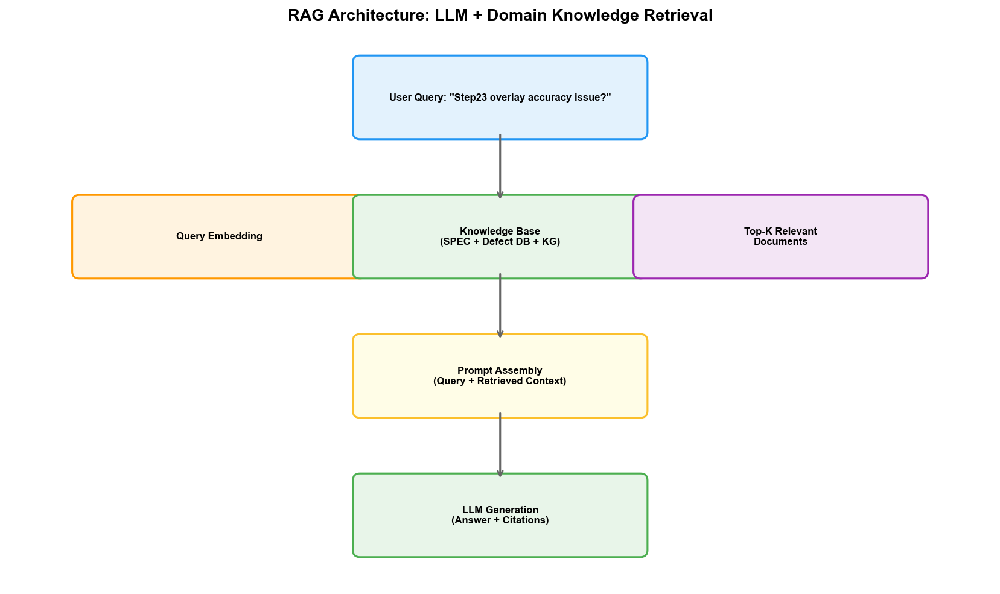
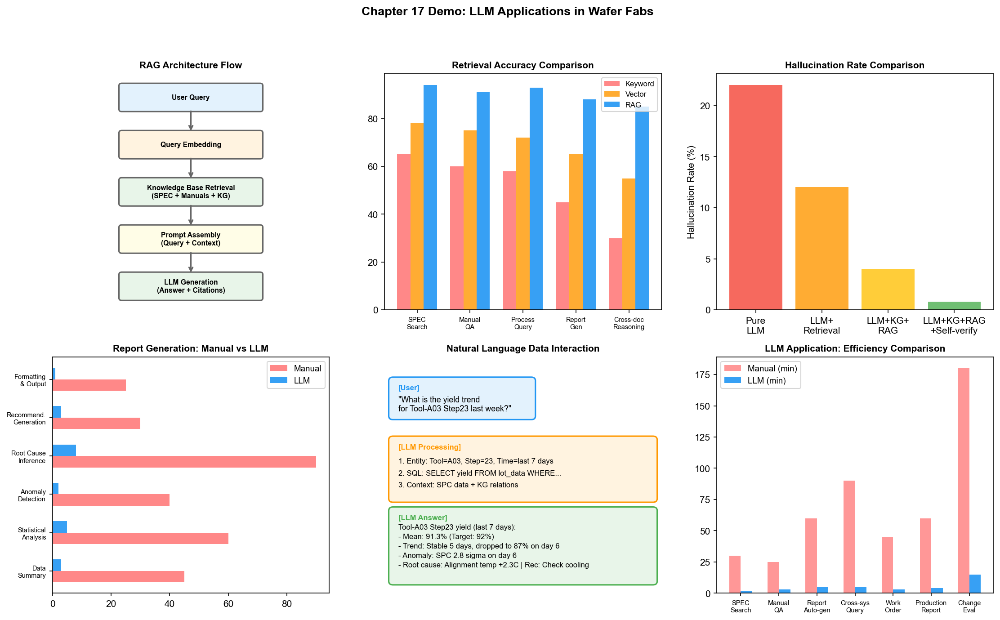

# Chapter 22: Large Language Model (LLM) Applications in the Wafer Fab

## 22.1 LLM Technology Overview

The "large" in Large Language Model manifests in three dimensions: model parameter count (billions to hundreds of billions), training data volume (trillions of tokens), and training compute (thousands of GPU-months). Together, these three dimensions form the foundation of the Scaling Law — when all three dimensions grow synchronously, model performance improves in a predictable manner, and at a certain threshold, the "emergent capabilities" described earlier appear.

### Transformer Architecture Review

The technical foundation of LLMs is the Transformer architecture. Chapters 2 and 4 have already discussed the core of Transformer — the self-attention mechanism. Here we supplement a few key concepts from an engineering perspective.

**Tokenization:** LLMs do not directly process text; they first split text into tokens — which can be words, sub-words, or characters. The GPT series uses the BPE (Byte Pair Encoding) algorithm to split text into sub-word tokens. An English word typically corresponds to 1-2 tokens, while a Chinese character typically corresponds to 2-3 tokens. The tokenization method directly affects the model's handling of domain terminology — "etching" might be split into two unrelated tokens, and the model needs to infer its meaning from context.

**Context window:** The maximum number of tokens an LLM can process at once. The early GPT-3 had a context window of 2,048 tokens, GPT-4 increased to 128K, and Claude 3 reached 200K. In wafer fab scenarios, a complete process specification (SPEC) can be dozens of pages long — requiring at least a 32K context window to fully contain it.

**Alignment:** After pre-training, the base model can generate fluent text but does not necessarily follow human intent. RLHF (Reinforcement Learning from Human Feedback) trains a reward model by ranking model outputs according to human preferences, then uses reinforcement learning to optimize the LLM's generation policy to make its output more aligned with human expectations. Alignment is the key step that transforms an LLM from "can talk" to "can talk well."

### Mainstream LLM Overview

| Model | Developer | Parameter Scale | Characteristics |
| --- | --- | --- | --- |
| GPT-4 / GPT-4o | OpenAI | Undisclosed (est. 1.7T+) | Strongest overall capability, multimodal |
| Claude 3.5 / Claude 4 | Anthropic | Undisclosed | Long-text processing, strong safety |
| Llama 3 / Llama 4 | Meta | 8B-405B | Open-source weights, local deployment |
| Gemini 1.5 / 2.0 | Google | Undisclosed | Native multimodal, ultra-long context |
| ERNIE Bot 4.0 | Baidu | Undisclosed | Chinese-optimized, domestic compliance |
| DeepSeek-V3 / R1 | DeepSeek | 671B (MoE) | Open-source, strong reasoning capability |

In wafer fab scenarios, LLM selection needs to consider three factors: data security (whether local deployment is possible), domain adaptation capability (how easily semiconductor domain knowledge can be injected), and inference cost (processing cost per token). Open-source models (such as the Llama series, DeepSeek) have a natural advantage in data security — they can be fully deployed within the wafer fab's intranet, ensuring no process data leaves the factory.

## 22.2 LLM Applications in Process Document Management

### Intelligent Retrieval and Q&A for Process Specifications (SPEC)

An advanced wafer fab typically accumulates thousands of process specification documents — the operating procedures, parameter specifications, exception handling steps, and safety precautions for each process module are documented in SPECs. The total volume of these documents can reach hundreds of thousands of pages, with continuous updates.

Traditional SPEC management relies on document management systems — engineers search for needed documents through keyword search or directory browsing. The problem with this approach is that engineers' queries are usually natural language questions ("What is the chamber cleaning procedure for Etcher No. 3?"), rather than exact keyword matches. If the document says "wet cleaning program" instead of "cleaning procedure," keyword search will miss it.

An intelligent SPEC Q&A system based on RAG (Retrieval-Augmented Generation) technology solves this problem. The system architecture is as follows:

```
Engineer asks: "What verification is needed after chamber cleaning on Etcher No. 3?"
  │
  ├─ 1. Query encoding: Encode the natural language question into a vector
  │
  ├─ 2. Vector retrieval: Search the SPEC document library for the most relevant passages
  │    → Return: "Etcher Chamber Post-Cleaning Verification Procedure.docx" Section 3.2
  │    → Return: "Chamber PM Acceptance Criteria.docx" Section 2.1
  │
  ├─ 3. Context construction: Combine retrieved document passages + original question into a prompt
  │
  └─ 4. LLM generation: Generate a natural language answer based on retrieved document content
       → "After chamber cleaning on Etcher No. 3, the following verification is required:
          1. Run 2 blank batches to confirm chamber cleanliness
          2. Test wafer etch rate verification (target: 320±10 nm/min)
          3. Particle count confirmation (< 10 counts/@0.12μm)
          Production can resume after verification passes."
```

The core value of RAG is "traceability" — the LLM's answer is based on retrieved document content, not generated from memory. This significantly reduces the "hallucination" risk — when the LLM cannot find an answer in the documents, it can respond "no relevant information found" rather than fabricating a seemingly plausible but incorrect answer.

### Automated Interpretation of Equipment Manuals

Each piece of semiconductor equipment comes with thousands of pages of operating and maintenance manuals. When equipment malfunctions, EE engineers need to quickly find relevant troubleshooting guides from the manuals. This process is typically very time-consuming — manuals are organized by functional modules, while fault symptoms and troubleshooting steps may be scattered across different chapters.

LLMs can "structure" manual content — automatically extracting fault codes, troubleshooting steps, and repair procedures from manuals to build a queryable knowledge base. When an engineer asks "What does error code E-3071 mean and how should it be handled," the LLM retrieves relevant content from the manual and provides a structured answer.

### Automated Exception Report Generation

Wafer fabs generate a large number of exception reports daily — equipment exception reports, process deviation reports, yield drop reports. These reports typically have fixed formats but require engineers to manually write the content — describing the anomaly, listing affected batches, analyzing possible causes, and providing disposition recommendations.

LLMs can automatically generate report drafts based on structured data. The system extracts relevant data from MES, FDC, SPC, and other systems (exception time, equipment parameters, affected batches, measurement results), and the LLM organizes this data into a structured report text:

```
[Exception Report]
Time: 2026-08-29 14:32
Equipment: Etcher ETC-03, Chamber Chamber-2
Exception description: During processing of Batch 45, RF reflected power surged from 3% to 12%,
                       exceeding the control limit (8%). FDC system automatically triggered pause.
Affected batches: LOT-A12345 (WIP status: Suspended)
Possible cause: Matcher tuning anomaly or electrode aging
Historical association: Last PM for this equipment was 2026-08-15, 82 batches since
Recommended disposition:
  1. Check matcher tuning status and connectors
  2. If matcher is normal, check electrode wear status
  3. After repair, run 3 test wafer batches to verify parameter stability
```

The engineer only needs to review and correct this draft, significantly reducing report writing time.

## 22.3 LLM Applications in Yield Analysis

### Automated Yield Report Generation

The daily yield report is a routine deliverable for the YED department. The report typically includes: CP/FT yield for each product that day, comparison with previous day/target, root cause analysis of abnormal batches, and yield trend charts.

Traditionally, this report requires engineers to manually extract data from multiple systems, create tables and charts, and write analytical text — taking 1-2 hours. An LLM can complete this process in seconds: querying yield data from databases, generating analytical text, and even describing anomalous patterns in trends.

The key is that the LLM doesn't just "fill in templates" — it can adjust the report's focus based on the specific data situation. If the day's yield is normal, the report is concise; if there are anomalies, the report expands on the abnormal batch analysis in detail.

### Natural Language Interaction with Process Data

Traditionally, querying process data requires engineers to know which system the data is in, whether to use SQL or API queries, and what the table structure looks like. This creates a usage barrier — only engineers familiar with IT systems can self-serve data queries.

LLMs can serve as a "natural language interface for data queries." Engineers ask in natural language:

"Was there any anomaly in etch uniformity on Tool No. 3 last week?"

The LLM executes in the background:
1. Parse question intent — query etch uniformity data, range is last week, equipment is ETC-03
2. Generate SQL query or call corresponding API
3. Retrieve data and perform analysis (e.g., calculate statistics, describe trend charts)
4. Answer in natural language: "Last week, ETC-03's etch uniformity fluctuated within the 3.2%-3.8% range,
   with a control limit of 4.0%, no exceedances. However, uniformity rose from 3.3% to 3.7% on August 27,
   showing an upward trend, worth monitoring."

This "Text-to-Data" capability relies on the LLM's understanding of database schemas and SQL generation capability. Text-to-SQL is a mature application direction for LLMs in enterprise data analysis, but the challenge in wafer fabs is that database schemas are extremely complex — a wafer fab has dozens of systems, each with hundreds of tables, and complex association relationships between tables.

### LLM-Assisted Multi-Source Data Analysis

When a yield issue involves multiple data sources, the LLM can serve as an "analysis assistant" — helping engineers integrate data from different systems and perform correlation analysis.

For example, when an engineer asks "Why is LOT-B67890's CP yield 8 percentage points lower than other batches of the same product?" the LLM can:
1. Query the batch's process path and equipment used from MES
2. Query the corresponding equipment's sensor data from FDC, checking for anomalies
3. Query whether key measurement parameters deviated from SPC
4. Query defect types and distribution from YMS
5. Synthesize the above information to generate an analysis report

In this process, the LLM's value lies not in the individual query steps — each query can be done manually. The LLM's value lies in "orchestration" — automatically determining which systems to query, in what order, and how to correlate the analysis results. This actually touches on the domain of Agents, which we will elaborate on in the next chapter.

## 22.4 LLM Applications in Manufacturing Operations

### Intelligent Work Order Management

Work order management in a wafer fab involves converting customer orders to production scheduling — what product the customer needs, in what quantity, by when, translated into how many batches, when to start wafer starts, and through which process route.

LLMs can assist with work order management:
- Natural language work order queries: "What is the delivery progress for Customer A's orders next month?"
- Exception warnings: "If ETC-03 cannot resume tomorrow, which customer orders will be affected?"
- Work order adjustment recommendations: "What is the optimal production scheduling plan for urgently inserting Customer C's 500-wafer order?"

### Production Report Automation

MFG's daily reports — equipment utilization, output statistics, WIP distribution, exception event summaries — are highly templated but require data integration work. LLMs can fully automate report generation — extracting data from MES and FDC, generating reports according to preset templates, and adding analytical notes based on anomalies in the data.

### Cross-System Data Q&A

A wafer fab's IT systems typically number in the dozens, and engineers need to query data across systems when analyzing problems. LLMs can serve as a "unified query entry point" — engineers don't need to know which system the data is in; they just ask in natural language, and the LLM automatically routes to the correct system and queries the data.

This requires the LLM to understand each system's data schema and query interface — typically implemented through "Tool Descriptions." Each system's query capability is described as a "tool," and the LLM selects the appropriate tool to call based on the question's intent:

```json
{
  "tools": [
    {
      "name": "query_mes_lot_history",
      "description": "Query batch process history in the MES system",
      "parameters": {
        "lot_id": "Batch ID",
        "start_time": "Query start time",
        "end_time": "Query end time"
      }
    },
    {
      "name": "query_fdc_sensor_data",
      "description": "Query equipment sensor data in the FDC system",
      "parameters": {
        "tool_id": "Equipment ID",
        "lot_id": "Batch ID"
      }
    }
  ]
}
```

The LLM selects the appropriate tool based on the engineer's question, generates parameters, calls the API, retrieves results, and synthesizes an answer. This pattern is the prototype of the Agent architecture.

## 22.5 Challenges and Outlook

### Data Security and Privacy

Wafer fab process data is a trade secret more sensitive than chip design blueprints. Sending process data to external LLM APIs (such as OpenAI) means exposing core IP to third parties — Samsung's adoption of Palantir was already considered an "exception," let alone sending data to cloud-based LLM services.

The solution is local deployment of open-source LLMs — such as the Llama series or DeepSeek models can be deployed on GPU servers within the wafer fab's intranet, with all data processing completed within the factory. However, the challenge of local deployment is compute requirements — a 70B parameter model requires at least 2 A100 80GB GPUs to achieve acceptable inference speed. For scenarios requiring simultaneous service to dozens of users, the compute investment is not negligible.

### Hallucination Mitigation

LLM "hallucination" — generating seemingly plausible but actually incorrect content — is extremely costly in wafer fab scenarios. If an LLM gives an incorrect parameter value in a process specification Q&A (e.g., stating the etch power spec is 350W instead of 300W), engineers acting on this could scrap an entire batch of wafers.

Technical measures to mitigate hallucination:

- **RAG (Retrieval-Augmented Generation):** Let the LLM answer based on retrieved document content rather than generating from memory. Cite information sources in the answer (which document, which section), making it convenient for engineers to verify
- **Constrained generation:** Add format constraints and numerical range constraints to LLM outputs — e.g., requiring parameter values in answers to be within SPEC-specified ranges
- **Multi-model cross-validation:** Use multiple models to generate answers, compare consistency. Inconsistent answers are flagged as "low confidence"
- **Human review closed loop:** LLM-generated reports and recommendations must undergo engineer review before execution. The LLM's role is "drafting," not "decision-making"

### Domain Knowledge Injection and RAG Technology

General LLMs have seen extremely limited semiconductor domain text during pre-training — GPT-4 might know what "etching" is, but won't know that "ETC-03's Chamber-2 needs RF power compensation of +3W on the 3rd batch after PM." The main technologies for injecting domain knowledge are RAG and fine-tuning.

**RAG's advantage** lies in not requiring model parameter modification — new documents are immediately usable after being added to the knowledge base, without retraining. Suitable for frequently updated process specifications and equipment manuals.

**Fine-tuning's advantage** lies in the ability to "internalize" domain knowledge into model parameters — giving the model deeper understanding of semiconductor terminology and concepts. However, fine-tuning requires labeled data and training compute, and each update requires retraining. Suitable for injecting foundational semiconductor domain knowledge (terminology, process flows, equipment principles) into the model.

In practice, the two are typically used in combination: first performing domain fine-tuning on semiconductor text (e.g., continued pre-training), then using RAG to retrieve the latest process documents during actual use. This "fine-tuning + RAG" combination has been proven to be the most effective domain adaptation strategy in professional fields such as healthcare and law.

---

LLM applications in wafer fabs are still in the early stages, but their development speed far exceeds any prior AI technology. From ChatGPT's release to now, only a few years have passed, and industrial LLM applications have moved from proof of concept to actual deployment. The next chapter will discuss the "upgraded form" of LLMs — Agents — and how they achieve more complex multi-step automation tasks in wafer fabs.



> **Chapter experiment**: Experiment 12 in Chapter 27 (`demos/experiments/llm_rag_spec_qa`) implements SPEC-doc retrieval plus LLM generation with cited answers, mapping to this chapter's document-management scenario; it supports both the DeepSeek API and an offline Mock mode.

## 22.6 Demo Visualization: LLM Applications in the Wafer Fab



*Demo description: Top-left is the RAG architecture flow, top-center is retrieval accuracy comparison (RAG vs keyword vs vector), top-right is the hallucination rate vs latency tradeoff. Middle row shows the yield report auto-generation speedup ratio, LLM natural language interaction example, and cross-system data access coverage, respectively. Bottom is the efficiency and accuracy comparison of eight LLM application scenarios. See simulation script at `demos/demo_ch22_llm_fab.py`.*

> **Hands-on experiments for this chapter**: Two experiments cover the chapter's two major themes — the red-blue adversarial exercise in Section 27.10 of Chapter 27 (`demos/experiments/wafer-trust-guard`) verifies the trust boundary of LLMs in the fab with a four-layer defense; the RTD real-time dispatching experiment in Section 27.9 (`demos/experiments/fab_ai_rtd_mvp`) shows how LLM diagnostic recommendations earn production-line trust through tiered approval.
