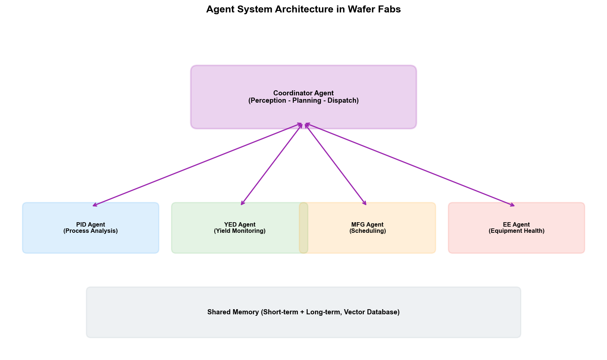
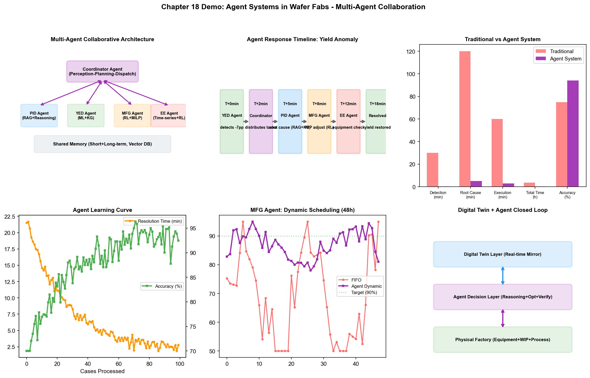

# Chapter 23: Agent Systems in Practice in the Wafer Fab

## 23.1 Agent Technology Overview

If LLM is the "brain," then Agent is the "brain + hands and feet." An LLM on its own can only receive text input and generate text output — it cannot query databases, call APIs, or control equipment. An Agent adds "action capability" on top of the LLM — perceiving the environment and executing operations by calling external tools.

### Evolution from LLM to Agent

In 2023, OpenAI launched the "Function Calling" feature — the LLM can decide which external function to call and generate the call parameters based on the user's request. This seemingly simple function is the starting point of Agent technology — the LLM went from "only able to talk" to "able to use tools."

Subsequently, a large number of Agent frameworks emerged from the open-source community — LangChain, AutoGPT, CrewAI, AutoGen, and others. These frameworks provide Agent infrastructure: tool registration, memory management, multi-step reasoning, error recovery. The ReAct (Reasoning + Acting) paradigm became mainstream — the Agent alternates between reasoning ("I need to check what first") and action (calling a tool to get results) at each step, deciding the next step based on results.

### Agent Core Components

A complete Agent system contains four core components:

**Perception:** How the Agent "sees" the environment state. In a wafer fab, perception is implemented through tool calls — querying MES for production line status, querying FDC for equipment data, querying YMS for yield data. The return result of each query tool is the Agent's "observation" of the environment.

**Planning:** How the Agent decomposes complex goals into executable steps. When an engineer asks "analyze the root cause of LOT-B67890's yield anomaly," the Agent needs to plan: first check CP results → analyze defect patterns → locate anomalous process steps → query corresponding equipment FDC data → correlate analysis → generate report. Planning can be pre-defined workflows (deterministic planning) or dynamically generated by the LLM (adaptive planning).

**Memory:**
- Short-term memory: The context of the current task — executed steps, retrieved data, intermediate analysis results. Short-term memory is stored in the LLM's context window.
- Long-term memory: Cross-task historical experience — solutions to similar problems handled in the past, engineer preferences, known causal patterns. Long-term memory is typically stored in a vector database, retrieved through similarity search.

**Action:** The Agent executes operations by calling tools. Tool types include:
- Information query tools: query_mes, query_fdc, query_spc, query_yms
- Analysis tools: statistical_analysis, defect_pattern_recognition, root_cause_search
- Generation tools: generate_report, create_ticket, send_notification
- Execution tools (requiring human approval): adjust_recipe, schedule_pm, dispatch_lot

Tool selection and invocation is determined by the LLM based on the current state and goal — this is the fundamental difference between Agents and traditional scripts. A script's execution path is pre-defined; an Agent's execution path is dynamically determined based on the situation.

### Multi-Agent System Architecture

Complex tasks may exceed the capability of a single Agent — requiring Agents with different expertise to collaborate. A multi-agent system assigns tasks to multiple specialized Agents, each handling the part they excel at.

Several typical multi-Agent architectures:

**Hierarchical architecture:** A "supervisor Agent" is responsible for task decomposition and coordination, dispatching sub-tasks to specialized Agents. The supervisor Agent aggregates results from each specialized Agent to form the final output.

```
Supervisor Agent (Orchestrator)
  ├─ Process Analysis Agent → Analyzes process parameter anomalies
  ├─ Equipment Diagnosis Agent → Analyzes equipment health status
  ├─ Defect Analysis Agent → Analyzes defect patterns
  └─ Report Generation Agent → Aggregates and generates analysis report
```

**Collaborative architecture:** Multiple Agents collaborate as equal peers, exchanging information through message passing. Each Agent can "see" other Agents' analysis results and adjust its own work accordingly.

**Pipeline architecture:** Multiple Agents process tasks in sequence, with each Agent's output being the next Agent's input. Suitable for sequential analysis tasks.

## 23.2 Process Integration Agent

### Automated Process Analysis Agent

When facing yield issues, PID engineers need to follow a systematic analysis process: collect batch data → review process path → check key parameters → compare with normal batches → locate deviations → infer root cause. This process is highly experience-dependent and involves multi-system data queries.

The process analysis Agent automates this workflow:

```
Input: "LOT-B67890 CP yield 85%, 7% below same-product average"

Agent execution trace:
  [Think] Need to first confirm this batch's process path and key steps
  [Act] Call query_mes(lot_id="B67890") to get process path
  
  [Observe] Process path: 1200 steps, using 23 equipment
  
  [Think] Compare this batch's key measurement parameters with normal batches
  [Act] Call query_spc(lot_id="B67890", 
                       comparison_lots=["normal_b67800", "normal_b67850"])
  
  [Observe] Step 623 etch CD deviation +4% (normal batches ±1%),
        Step 624 thin film thickness deviation -3% (normal batches ±1.5%)
  
  [Think] CD deviation may come from etch equipment or litho equipment, need further investigation
  [Act] Call query_fdc(tool_id="ETC-03", 
                        lot_id="B67890", step=623)
  
  [Observe] ETC-03 RF power fluctuation 2.8% during B67890 batch processing (normal <1%)
  
  [Think] RF power fluctuation may cause CD deviation. Check this equipment's historical trend
  [Act] Call query_fdc_history(tool_id="ETC-03", 
                                 last_days=7)
  
  [Observe] ETC-03's RF power fluctuation has gradually increased over the past 3 days, possible matcher aging
  
  [Conclusion] Root cause: ETC-03 matcher tuning anomaly causing RF power fluctuation,
        which affects CD uniformity, leading to yield drop.
  [Recommendation] Check ETC-03 matcher, schedule maintenance.
  [Act] Generate analysis report and submit to PID engineer for review.
```

In this process, the Agent demonstrates three key capabilities: adaptive planning (adjusting the next action based on each step's results), multi-tool coordination (calling data from MES, SPC, and FDC systems), and causal reasoning (the causal chain from RF power fluctuation → CD deviation → yield drop).

### Cross-Department Coordination Agent

When a yield issue involves multiple departments — such as PID needing MFG to confirm scheduling impact, or needing EE to check equipment status — a cross-department coordination Agent can automatically coordinate information collection and analysis.

```
Supervisor Agent receives: "Product A 3nm CP yield has been dropping 2% for 3 consecutive days"
  │
  ├─ Dispatch to Process Analysis Agent
  │    → Discovers parameter deviation at Step 45
  │    → Needs to confirm equipment status
  │
  ├─ Dispatch to Equipment Diagnosis Agent  
  │    → Query FDC: Step 45 uses ETC-05 equipment with RF power anomaly
  │    → Query maintenance records: ETC-05 has run 95 batches since last PM
  │    → Judgment: PM needed
  │
  ├─ Dispatch to Scheduling Analysis Agent
  │    → Query MES: ETC-05 currently has 12 batches queued
  │    → Simulate: If ETC-05 goes down for PM, affects 3 customer order deliveries
  │    → Recommend: Route queued batches to ETC-03 (has spare capacity)
  │
  └─ Supervisor Agent aggregates:
       Root cause: ETC-05 matcher aging causing RF power anomaly
       Impact: 3-day yield drop 2%, approximately 15 batches affected
       Recommended actions:
         1. Immediately route ETC-05 queued batches to ETC-03
         2. Schedule ETC-05 matcher maintenance
         3. Run 3 verification wafer batches after maintenance
       Delivery impact: Customer C's order delayed 1 day (acceptable)
```

## 23.3 Yield Analysis Agent

### Automated Root Cause Analysis Agent

Root cause analysis is YED's most core and time-consuming task. An automated RCA Agent can automate the RCA process described in Chapter 6 — from yield anomaly alert triggering to generating a root cause analysis report.

RCA Agent architecture:

**Triggering:** The SPC system detects CP yield exceeding control limits, automatically triggering the RCA Agent.

**Data collection phase:** The Agent automatically collects all relevant data — the batch's complete process history (MES), all equipment's FDC data, key step SPC measurement data, defect inspection results (YMS). In this phase, the Agent needs to decide "which data is relevant" — not all 1200 steps' parameters need checking; the Agent should first focus on the steps most likely to have issues based on experience.

**Pattern recognition phase:** The Agent uses pre-trained CNN models to classify defect patterns on wafer maps, uses statistical methods to compare parameter differences between anomalous and normal batches, and uses knowledge graphs to search known defect-parameter-equipment association paths.

**Root cause inference phase:** The Agent synthesizes the above analysis results to infer the most likely root cause. This inference process needs to combine: data-driven correlation analysis (connectionism), domain knowledge causal reasoning (symbolism), and historical case analogical reference (long-term memory).

**Report generation phase:** The Agent generates a structured RCA report, including: anomaly description, data analysis process, root cause hypotheses (and confidence levels), and recommended actions. The report is submitted to YED engineer for review.

### Yield Anomaly Response Agent

The RCA Agent focuses on "finding the cause," while the response Agent focuses on "taking action." Once the root cause is determined, the response Agent needs to coordinate multiple systems to execute disposition measures:

- If the root cause is an equipment issue: automatically create a maintenance work order, adjust MES scheduling to route affected batches to backup equipment, notify EE engineers
- If the root cause is a process parameter issue: generate parameter adjustment recommendations (executed after PE engineer review), mark affected batches as "Hold" status pending disposition
- If the root cause is a raw material issue: trace affected material batches, identify all work-in-progress and finished products that used the affected batch

The key design principle of the response Agent is "Human-in-the-Loop" — all operations affecting production or equipment require engineer approval before execution. The Agent's role is to "recommend and prepare," not to "decide and execute."

## 23.4 Manufacturing Scheduling Agent

### Dynamic Scheduling Agent

Traditional dispatching systems are rule-driven — rules are pre-defined, and the system executes according to rules. A dynamic scheduling Agent is policy-driven — the Agent dynamically determines dispatching policies based on the production line's real-time status.

Dynamic scheduling Agent's working mode:

**Perception:** Real-time acquisition of production line status from MES — each equipment's queue length, each batch's priority and delivery deadline, equipment status. State updates every minute.

**Decision-making:** For each idle equipment, the Agent evaluates the "priority score" of all dispatchable batches in the queue. Score calculation considers not only the batch's own attributes (delivery, priority) but also global impact — how does dispatching this batch affect the bottleneck equipment's WIP? What are the cascading effects on other batches' deliveries?

**Action:** Assign the highest-scoring batch to idle equipment. If score differences are small (multiple batches have similar priority), the Agent can choose the globally optimal option — this requires simulating "if choosing A vs B" on the production line's state for the next N hours.

**Feedback:** Observe production line state changes after dispatching decisions, as learning signals to update the decision policy.

### Exception Handling Agent

When exceptions such as equipment failures occur, the exception handling Agent needs to quickly make a series of decisions:

1. Identify affected work-in-progress batches
2. Evaluate alternative equipment (current load and status of same-type equipment)
3. Calculate the impact of re-routing on delivery
4. Generate optimal batch reassignment plan
5. Automatically adjust dispatching instructions in MES (or recommend scheduler adjustments)
6. Notify relevant personnel and systems

This process is extremely time-sensitive — every minute after equipment failure means lost capacity. The Agent can complete in seconds what a human scheduler would take over ten minutes to assess and decide.

## 23.5 Equipment Maintenance Agent

### Predictive Maintenance Decision Agent

Chapter 16 discussed RUL prediction (connectionism) and maintenance decision optimization (behaviorism) in predictive maintenance. The Agent integrates these two levels into an end-to-end system:

**Monitoring phase:** The Agent continuously monitors all equipment's FDC data, using LSTM models to assess each equipment's health score. When a piece of equipment's score drops to the warning threshold, the Agent activates.

**Analysis phase:** The Agent deeply analyzes the specific degradation pattern of that equipment — which sensor channels are degrading? What is the degradation rate? What is the similarity to historical fault cases? Predict RUL (remaining usable batches).

**Decision phase:** The Agent evaluates the cost and risk of maintenance options:
- Immediate maintenance: Cost = 4-hour downtime + capacity loss, Risk = low
- Delay maintenance by 50 batches: Cost = may affect process quality, Risk = medium
- Delay maintenance by 100 batches: Cost = high yield risk, Risk = high

The Agent combines current production line WIP status and maintenance window availability to recommend the optimal maintenance timing.

**Execution phase:** Automatically create maintenance work orders, reserve spare parts, notify EE engineers. After maintenance completion, automatically initiate verification process — run test wafers, check parameter recovery.

### Equipment Health Monitoring Agent

The equipment health monitoring Agent is the "daily mode" of predictive maintenance — not activating only when equipment is about to fail, but continuously monitoring all equipment's health status, providing a panoramic view.

The Agent's output is an "equipment health dashboard" showing:
- Each equipment's current health score (0-100)
- Degradation trend (score changes over the past 7 days)
- Warning equipment list (equipment with scores below threshold)
- Recommended maintenance priority ranking

Through this dashboard, EE engineers can see at a glance which equipment needs attention, without having to individually check each piece of equipment's FDC data.

## 23.6 Fab-Wide Agent Architecture

### Multi-Agent Collaboration Framework

Fab-wide intelligence is not one all-encompassing Agent — but a collaborative network of multiple specialized Agents. Each Agent is responsible for its own domain, coordinating through message passing and shared state:

```
                    ┌─────────────────┐
                    │  Fab-Wide       │
                    │  Coordination   │
                    │  Agent          │
                    │ (Orchestrator)  │
                    └────┬───┬───┬────┘
                         │   │   │
          ┌──────────────┤   │   ├──────────────┐
          │              │   │   │              │
    ┌─────┴─────┐  ┌─────┴──┐ │ ┌──┴─────┐  ┌───┴─────┐
    │ Process   │  │Scheduling│ │ │Equipment│  │ Yield   │
    │ Analysis  │  │ Agent    │ │ │Maint.   │  │ Analysis│
    │ Agent     │  │          │ │ │ Agent   │  │ Agent   │
    └─────┬─────┘  └────┬───┘ │ └───┬────┘  └───┬────┘
          │              │   │     │           │
          └──────────────┴───┴─────┴───────────┘
                    Shared Knowledge Graph + Memory
```

The fab-wide coordination Agent (Orchestrator) receives engineer requests or system event triggers, decomposes tasks, and dispatches them to specialized Agents. Specialized Agents can communicate with each other during execution — for example, when the equipment maintenance Agent discovers that a piece of equipment needs downtime, it notifies the scheduling Agent to adjust the production schedule.

### Combining Digital Twins with Agents

The Digital Twin is key infrastructure for fab-level Agents. A digital twin is a virtual mirror of the wafer fab — simulating wafer flow on the production line, equipment processing times, and the relationship between process parameters and yield.

The combination of Agents and digital twins operates at three levels:

**Prediction:** The Agent simulates the consequences of different decisions in the digital twin — "If ETC-05 goes down for maintenance tomorrow, what is the capacity impact over the next 72 hours?" The digital twin provides a prediction environment, and the Agent makes prediction-based decisions.

**Training:** Reinforcement learning Agents train in the digital twin — conducting millions of trial-and-error iterations in the virtual environment, learning effective scheduling and maintenance policies, then deploying the policies to the real production line.

**Verification:** When the Agent is about to make an important decision (such as adjusting process parameters), it first verifies the decision's effect in the digital twin — if simulation results show yield would drop, the Agent modifies or abandons the decision.

The precision of the digital twin is the prerequisite for the entire system's effectiveness — if the digital twin cannot accurately simulate the real production line's behavior, policies trained in the digital twin may fail in reality. Building a high-precision digital twin is itself a major engineering effort, requiring integration of equipment physics models, process chemistry models, and production line scheduling models across multiple disciplines.

### From Point-Wise AI to Fab-Wide Intelligence

AI development in semiconductor wafer fabs is undergoing an evolution from "point-wise optimization" to "fab-wide intelligence." Current AI applications are mostly siloed — defect inspection systems, predictive maintenance systems, and yield analysis systems operate independently, with no shared data or models.

The fab-wide Agent architecture aims to break these silos, enabling AI capabilities across different domains to collaborate. A yield issue no longer requires engineers to manually switch between multiple systems — the Agent automatically coordinates process analysis, equipment diagnosis, scheduling adjustments, and maintenance arrangements, freeing engineers' attention from "collecting and correlating data" to "reviewing and making decisions."

Realizing this vision requires solving three major technical challenges:

**Data fusion:** Different systems' data formats, semantics, and time granularity vary widely. Ontology (the topic of Part 6) provides the semantic foundation for cross-system data fusion.

**Model collaboration:** AI models from different domains (defect classification CNN, equipment prediction LSTM, scheduling RL policy) need to collaborate within a unified framework. The Agent architecture provides the mechanism for model orchestration.

**Safety and controllability:** When AI systems' decisions affect production, safety and controllability must be guaranteed. Human-in-the-Loop design and constrained generation ensure AI operates within safety boundaries.

Part 6 will delve into Ontology — this is not just a technical solution for data fusion, but the semantic infrastructure for fab-wide intelligence. Palantir's success story at Samsung's wafer fab proves this point.



> **Chapter experiment**: Experiment 16 in Chapter 27 (`demos/experiments/llm_agent_tool_use`) implements the ReAct loop, showing how an LLM autonomously calls tools through perceive→plan→act→observe — the core mechanism of Agent systems.

## 23.7 Demo Visualization: Multi-Agent Collaboration Framework



*Demo description: Top-left is the multi-agent collaboration architecture, top is the full timeline of Agent response to yield anomalies. Middle row shows Agent vs traditional process comparison, Agent memory and learning curve, and fab-wide Agent four-level architecture, respectively. Bottom row shows Agent communication network, dynamic scheduling effects, and digital twin + Agent closed loop. See simulation script at `demos/demo_ch23_agent_system.py`.*

> **Hands-on experiments for this chapter**: Two experiments complete the "verification" side of Agent systems — the evaluation framework in Section 27.11 of Chapter 27 (`demos/experiments/fab_agent_test`) provides a quality/cost/resilience three-dimensional evaluation method; the red-blue adversarial exercise in Section 27.10 (`demos/experiments/wafer-trust-guard`) demonstrates pre-launch adversarial trust drills.
