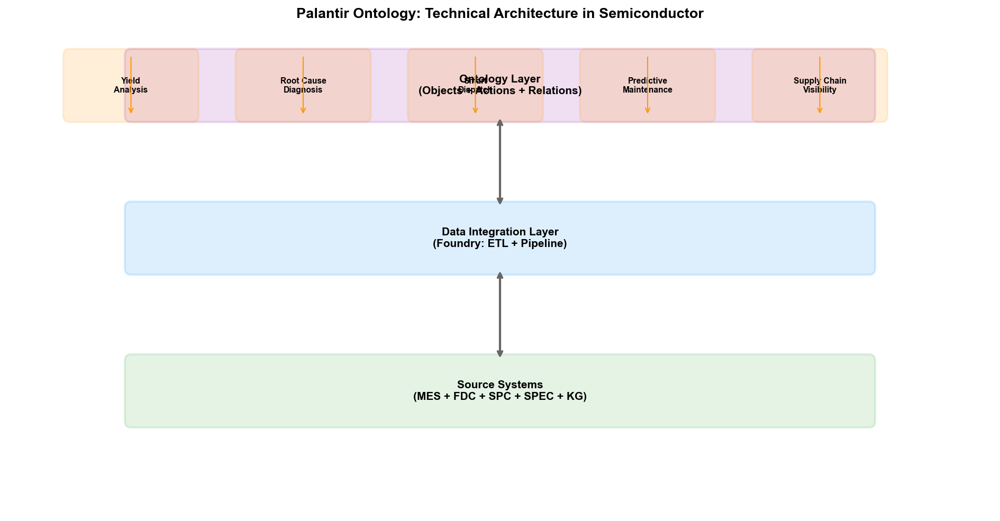

# Chapter 24: Palantir and Ontology — From Killing Bin Laden to Samsung's Yield Leap

## 24.1 What Is Ontology

### From Philosophy to Computer Science

The word "Ontology" originates from philosophy. In ancient Greek philosophy, ontology studies "the nature of being" — what things exist, what categories of being there are, and what relationships hold between entities of different categories. Aristotle's "Categories" is one of the earliest ontological explorations — he defined ten categories including substance, quantity, quality, relation, place, and time.

When computer scientists borrowed this term, they asked a more specific question: how can computers "understand" the entities in the world and their relationships?

In 1993, Thomas Gruber gave the classic definition of ontology in computer science:

> "An ontology is an explicit, formal specification of a shared conceptualization."

Breaking this down:

- **Conceptualization:** Identifying the types of entities that exist in a domain and the relationships between them — in a wafer fab, there are entities such as Wafer, Tool, Recipe, and Defect, with relationships such as uses, produces, causes
- **Explicit:** Concepts and relationships are explicitly defined, not implicit in code — anyone can examine the ontology definition and understand its meaning
- **Formal:** Described in machine-processable formal languages — OWL, RDF, etc. — enabling computers to perform automatic reasoning over the ontology's logic
- **Shared:** The ontology is a collectively agreed-upon standard — not one engineer's private data model, but a semantic standard that the entire organization agrees to follow

### The Position of Ontology in AI

Among the three major AI schools, ontology belongs to the symbolic branch. It inherits symbolism's core belief — that the foundation of intelligence is knowledge representation and reasoning — but is far richer in knowledge representation form than the "if-then" rules of expert systems.

Expert system rules are "flat" — individual, independent rules lacking structured associations. Ontology introduces hierarchical, structured knowledge representation: class-subclass inheritance relationships, property domain and range constraints, multiple relationship types between entities, and automated reasoning rules.

When ontology is combined with knowledge graphs, the former provides the "conceptual model" (schema — what is a Wafer, what is a Tool), and the latter provides "instance data" (data — W001 is a specific Wafer, ETC-03 is a specific Tool). Together, they constitute a knowledge system that can be automatically reasoned by computers.

### Relationship and Distinction from Knowledge Graphs

Ontology and knowledge graphs are often confused because they overlap significantly in technology. A simplified distinction:

| Dimension | Ontology | Knowledge Graph |
| --- | --- | --- |
| Focus | Conceptual model — defines "what is a Wafer" | Instance data — stores "W001 is a Wafer" |
| Formalization level | High (OWL and other description logics, supports automated reasoning) | Medium (RDF triples or Property Graph) |
| Reasoning capability | Supports class hierarchy reasoning, consistency checking, implicit knowledge derivation | Relies on graph algorithms (path search, community detection, etc.) |
| Change frequency | Relatively stable (conceptual model changes infrequently) | Frequently updated (each batch of wafers generates new instances) |

In practical engineering, the two are typically used together — the ontology defines the conceptual model and reasoning rules, and the knowledge graph stores instance data and accepts the ontology's reasoning. Palantir's Foundry platform is precisely this unified entity of "ontology + instance data."

## 24.2 The Palantir Story

### Founding: Peter Thiel and Alex Karp

In 2003, Silicon Valley. Peter Thiel had just sold PayPal to eBay for $1.5 billion and was looking for the next big opportunity. The post-9/11 U.S. intelligence community had exposed an embarrassing fact: the CIA, FBI, and NSA each possessed massive intelligence data, but this data was scattered across different systems, with incompatible formats, non-interoperable security classifications, and analysts had to manually switch between multiple systems and correlate data — extremely inefficient. The 9/11 Commission noted in its post-incident investigation: intelligence agencies "possessed" all the information fragments needed to piece together the attack picture, but lacked the ability to put them together.

Thiel saw this opportunity. Together with Alex Karp, Joe Lonsdale, Stephen Cohen, and Nathan Gettings, he co-founded Palantir Technologies. The company name comes from the "Palantír" in Tolkien's "Lord of the Rings" — a crystal ball that allows one to see things far away. This name implies Thiel and Karp's philosophy: technology can reveal truth, but it also needs to be protected from abuse.

Traditional venture capital firms had little interest in a startup primarily selling to U.S. intelligence agencies. Thiel's own Founders Fund bore most of the approximately $30 million in early startup funding.

In 2004, Palantir received an investment of approximately $2 million from In-Q-Tel — the CIA's venture capital arm. The amount was modest, but the strategic significance was enormous. In-Q-Tel brought not only funding but, more importantly, direct participation from CIA analysts — these analysts helped Palantir's engineers understand the real workflow and data forms of intelligence analysis, designing the software to truly meet the needs of intelligence professionals. In 2005, the CIA became Palantir's first major customer.

### Killing Bin Laden: How Palantir Helped the CIA Locate the Target

On May 1, 2011, U.S. Navy SEALs killed Osama bin Laden in a compound in Abbottabad, Pakistan. The success of this operation was built on a decade of intelligence gathering and analysis, with Palantir's Gotham platform playing a key role.

The core challenge in finding bin Laden was not a lack of intelligence — U.S. intelligence agencies possessed massive amounts of data. The problem was that there was too much data, scattered across countless systems: satellite imagery, drone surveillance footage, communication intercepts, informant reports, news reports, financial transaction records, travel records... intelligence analysts needed to find connections from this massive, heterogeneous, fragmented data — the link between a suspicious phone number and a certain fund transfer, the connection between a courier's movements and a particular building.

Palantir's Gotham platform did this: integrating all these heterogeneous data sources into a unified semantic model. Each piece of intelligence — whether from SIGINT (signals intelligence), HUMINT (human intelligence), or OSINT (open-source intelligence) — was mapped to objects in the ontology, with object relationships explicitly expressed on the graph. Analysts could perform chain exploration on the graph: starting from a phone number, find other numbers communicating with it, track these numbers' geographic locations and call patterns, link to personnel identities, and ultimately locate the compound in Abbottabad.

Gotham's technical core is ontology — it defines the intelligence domain ontology: Person, Organization, Location, Communication, Transaction, Event, and other object types, as well as the associative relationships between them. When data scattered across different systems is mapped to this unified ontology, association patterns originally hidden in massive data become discoverable.

It should be noted that Palantir was not the sole contributor to "finding bin Laden." The entire search operation involved multiple agencies, various technical means, and extensive manpower. Palantir's role was to provide the data integration and analysis infrastructure — enabling analysts to discover and verify associative leads more quickly.

### Tracking Khamenei: Palantir's Role in Iran Nuclear Facility Monitoring

During 2025-2026, Palantir played an even more cutting-edge role in military and intelligence operations against Iran — this time not as an auxiliary analysis tool, but achieving an "AI-driven kill chain" for the first time.

Palantir's connection to the Iran nuclear issue can be traced back to 2015. That year, Palantir's MOSAIC system was integrated into the International Atomic Energy Agency (IAEA) inspection work as a technical support tool for the 2015 Iran nuclear deal (JCPOA). MOSAIC is an AI system valued at approximately $50 million that processed about 400 million data objects — satellite imagery, facility documents, sensor measurement data, social media information about personnel within Iran — generating predictive assessments about nuclear proliferation risks.

MOSAIC's core capability is discovering patterns from seemingly unrelated data fragments. Abnormal increases in a factory's power consumption, changes in vehicle traffic patterns on a certain road, personnel movement patterns between a nuclear scientist and a specific facility — these fragmented signals are correlated in MOSAIC's ontology model, forming a panoramic view of Iran's nuclear activities.

During the 2025-2026 military operations, Palantir's AI platform (AIP) and its military version Gotham5 were used as the "operational nerve center." According to media reports, Palantir integrated fragmented data from multiple U.S. agencies — satellite imagery, drone footage, radar signals, intercepted communications — mapping military activities across all of Iran. Anthropic's Claude model analyzed this data, determining optimal targets, methods, and strike sequences, providing actionable recommendations to human commanders.

Sun Liping, a professor of sociology at Tsinghua University, described this as "algorithmic warfare driven by AI" — for the first time in actual combat, AI defined the "targets, timing, and methods" of the kill chain, with human commanders only making final approval rather than designing strike plans.

The significance of this event extends far beyond the military domain. It proves one thing: when Ontology technology is used to integrate massive heterogeneous data, AI can do what traditional analysis methods cannot — automatically discover associations, predict patterns, and generate action plans from fragmented data. This capability, transferred from military to industrial scenarios, is exactly what Palantir does at Samsung's wafer fab.

### Transition from Military-Industrial to Commercial-Industrial

Palantir's transition from military to commercial domains began around 2010. The success of the Gotham platform in the intelligence domain proved a technical fact: the ontology-driven data integration framework can be applied to any scenario requiring cross-system data fusion. Commercial enterprises face the same problem of "data scattered across multiple systems, unable to be effectively integrated and analyzed."

In 2016, Palantir launched the Foundry platform — a data integration and analysis platform for commercial and industrial customers. Foundry inherited Gotham's core technical philosophy (ontology-driven data fusion) but shifted interaction design from "graph exploration" for intelligence analysts to "workflows and dashboards" for enterprise users.

Foundry's customers span finance (Morgan Stanley, Occidental Petroleum), aviation (Airbus), healthcare (U.S. National Institutes of Health), manufacturing (Merck, Saint-Gobain), and other industries. And the most iconic customer in the semiconductor industry is Samsung.

## 24.3 Palantir's Technical Architecture

### Gotham Platform (Defense and Intelligence)

Gotham is Palantir's product for the defense and intelligence domain. Its core function is multi-source intelligence fusion — integrating different types of data such as SIGINT (signals intelligence), HUMINT (human intelligence), OSINT (open-source intelligence), and GEOINT (geospatial intelligence) into a unified analysis environment.

Gotham's technical characteristics:

**Multi-Level Security Architecture (MLS/Cross-Domain):** Gotham's deepest technical barrier is the multi-level security architecture — simultaneously displaying data of different classification levels (TS/SCI, SECRET, UNCLASSIFIED) in a single interface, while ensuring high-classification information does not "leak" to lower-classification layers. This cross-domain information processing capability is a challenge that traditional defense contractors failed to solve.

**Graph exploration analysis:** Analysts can freely explore on the knowledge graph — starting from an entity, expanding along relationship chains, discovering implicit association networks. This "hypothesis-driven exploration" mode suits intelligence analysis — analysts don't need to know in advance what to look for; they discover leads during exploration.

**Dynamic ontology:** The intelligence domain's ontology is not fixed — new threat actors, new communication technologies, and new geographic hotspots can emerge at any time. Gotham allows analysts to modify the ontology at runtime — adding new entity types and relationship types without redeploying the system.

### Foundry Platform (Commercial and Industrial)

Foundry is Palantir's product for commercial customers, and the platform used at Samsung's wafer fab. Its core is the "Ontology" — an enterprise-grade semantic layer that unifies all data sources, analytical models, and business logic under one ontology model.

Foundry's architecture can be summarized in five layers:

```
┌─────────────────────────────────────────────┐
│  Application Layer                           │
│  Dashboards / Workflows / API / LLM Agent    │
├─────────────────────────────────────────────┤
│  Ontology Layer                             │
│  Object Types / Relations / Actions / Functions │
│  ← Semantic unification layer, the "universal language" of all data │
├─────────────────────────────────────────────┤
│  Model Layer                                 │
│  ML Models / Statistical Models / Optimization Models │
├─────────────────────────────────────────────┤
│  Data Integration Layer                      │
│  ETL Pipelines / Streaming Data / Federated Queries │
├─────────────────────────────────────────────┤
│  Data Sources                                │
│  MES / FDC / SPC / YMS / ERP / IoT           │
└─────────────────────────────────────────────┘
```

**Data source layer:** Foundry connects to enterprise data sources through ETL pipelines and streaming data interfaces. In the wafer fab scenario, this includes MES, FDC, SPC, YMS, equipment IoT data, etc. Data is "ingested" into Foundry from source systems but not "copied" — Foundry supports federated queries, directly querying data in source systems without physical copying.


*Figure 24-1: The five-layer architecture of Palantir Foundry — the Ontology layer as the core*

**Ontology layer (core):** This is Foundry's most fundamental difference from ordinary data platforms. Most data platforms take the approach of "build a data lake, dump all data in, then query with SQL." Foundry's approach is to first build an ontology — defining the enterprise's core entity types (e.g., Wafer, Tool, Recipe, Defect), their relationships (e.g., Wafer usesTool Tool), and the actions (Action, e.g., schedulePM) and functions (Function, e.g., calculateYield) that can be executed on entities.

Once the ontology is defined, data from all sources is mapped to object instances in the ontology. Batch data in MES becomes `Lot` objects, sensor data in FDC becomes `Tool` object properties, measurement results in SPC become `Measurement` objects. Data from different systems is semantically unified — no more confusion about "whether the step in MES and the operation in SPC are the same thing."

**Model layer:** ML models can be "bound" to ontology objects. An LSTM model predicting equipment RUL can be bound to a `Tool` object — whenever a `Tool` object is queried, the model automatically runs and returns a prediction. Models are not standalone "AI applications" but functions in the ontology — callable by any application referencing that object.

**Application layer:** Applications built on the ontology — dashboards, analysis workflows, API interfaces, even LLM Agents. Because all applications are built on the same ontology, data consistency between them is inherently guaranteed — it's impossible to have the contradiction of "Dashboard A shows yield 92%, Dashboard B shows 89%."

### Ontology as the Core Engine

Palantir's Ontology has a key difference from academic ontology: it contains not only static concepts and relationships but also dynamic behavior — actions and functions.

**Actions:** Define operations that can be executed on objects. For example, the `Tool` object can have a `schedulePM` action — when a user or AI system calls this action, Foundry automatically executes the complete PM scheduling process: checking maintenance windows, creating maintenance work orders, notifying relevant personnel, updating equipment status. Action definitions include precondition checks (e.g., "equipment must not be running") and post-effects (e.g., "equipment status changes to 'under maintenance'").

**Functions:** Define computational logic on objects. For example, a `Lot` object can have a `calculateYield` function — calculating yield based on all wafers' CP test results for that Lot. Function definitions are declarative — users don't need to know which system the data is in or how to query it with SQL; they just call `lot.calculateYield()`.

This "object + action + function" ontology model makes Foundry not just a data analysis platform, but an "executable enterprise digital twin"[93] — the ontology is not only a semantic mapping of data but a formal expression of enterprise operational logic. When an AI Agent runs on Foundry, it can perceive states and execute operations by calling actions and functions on the ontology — this is exactly the ideal operating environment for the Agent architecture described in Chapter 23.

## 24.4 Palantir Enters Semiconductors

### Background: Samsung Semiconductor Adopts Palantir Foundry

In late 2024, Samsung Electronics' DS (semiconductor) division made a decision viewed by the industry as "near-crazy" — connecting the wafer fab's core manufacturing data to U.S. Palantir's Foundry platform.

Semiconductor process data is a trade secret more sensitive than chip design blueprints. A wafer's complete process data — equipment parameters, measurement results, defect information, yield data — if leaked to competitors, is equivalent to exposing one's most core process secrets. TSMC and Intel have never allowed any third party to touch production line data.

Samsung made this exception for one reason only: 2nm GAA process yield had dropped to around 30%.

2nm is Samsung's first generation transitioning from FinFET to GAA (Gate-All-Around) transistor architecture. The GAA architecture has significant advantages over FinFET in performance and power consumption, but process complexity increases dramatically — nanosheet thickness control requirements are at the sub-nanometer level, and inner spacer dimensional precision requirements are at 4-6 nanometers. These extreme process precision requirements make yield ramping exceptionally difficult.

30% yield means that out of every 10 wafers produced, only 3 are "good" — a number far below the 60% mass production threshold. Samsung's yield dilemma on 2nm directly affected its foundry competitiveness — Qualcomm reportedly chose TSMC's 2nm process over Samsung as a result.

Traditional yield improvement methods — DOE experiments, engineer experience, FDC monitoring — appeared inadequate against 2nm's complexity. Root causes often involved complex interactions among hundreds of process steps and dozens of equipment, with data scattered across dozens of heterogeneous systems. A simple root cause analysis question — "Is the yield drop at Step 67 related to the parameter deviation at Step 23?" — could require an engineer to query data separately in MES, FDC, SPC, and YMS systems, then manually correlate.

### The Specific Story of Yield Improvement

After Samsung adopted Palantir Foundry, the first thing was not to train AI models — but to build the wafer fab's Ontology.

Foundry's engineering team collaborated with Samsung's PID and YED engineers to define the wafer fab's core ontology:

- **Product ontology:** Wafer, Die, Device, Layer, Lot
- **Process ontology:** Recipe, ProcessStep, Route, Module
- **Equipment ontology:** Tool, Chamber, Component, ConsumablePart
- **Parameter ontology:** Parameter, SetPoint, Measurement, SensorData
- **Defect ontology:** Defect, DefectType, DefectPattern, RootCause
- **Test ontology:** WAT, CP, FT, TestItem, TestResult

After defining the ontology, data from MES, FDC, SPC, YMS, and other systems was mapped to object instances in the ontology. This process is the most engineering-intensive phase — requiring understanding of each system's data schema and building mapping rules from source data to ontology objects.

Once data was unified in the ontology, Foundry achieved what Samsung previously could not: cross-system associative queries and reasoning. Taking a typical yield problem as an example — "Why is a certain batch's CP yield below normal levels":

Under the traditional approach, YED engineers needed to:
1. View wafer map patterns in YMS → determine defect types
2. View the batch's process path in MES → locate possible anomalous steps
3. View corresponding equipment sensor data in FDC → check parameter anomalies
4. View measurement data in SPC → confirm parameter deviations
5. Manually correlate the above information → infer root cause

This process took 4-8 hours and was highly dependent on the engineer's experience and intuition — experienced engineers could find the correct query path faster, but novices often needed repeated trial and error.

On Foundry, this process became:
1. Enter the batch number in the ontology search
2. The system automatically displays the batch's complete process history — all steps, equipment, parameters, measurement results, defect information
3. The system automatically flags anomalies — parameters deviating beyond thresholds compared to normal batches
4. The system searches associative paths along ontology relationship chains — from anomalous parameters to corresponding equipment and steps
5. The system generates a list of root cause hypotheses — each with reasoning paths and confidence levels

This process was reduced to 30-60 minutes, and was not limited by the engineer's experience level — the knowledge in the ontology is factory-wide shared, and any engineer can leverage the ontology's reasoning capability for analysis.


*Figure 24-2: Wafer-yield root cause analysis (RCA) — traditional cross-system manual querying vs. Ontology-driven automated reasoning*

According to public reports, Samsung's 2nm yield improved from approximately 30% at end of 2024 to approximately 55%-60% by mid-2026. Samsung also deployed large-scale AI compute in its AI Megafactory, applying AI optimization throughout the process — defect detection improved 30%, wafer yield increased 15%. While the yield improvement cannot be entirely attributed to Palantir (Samsung simultaneously invested substantial internal engineering resources and other AI technologies), Foundry's data fusion infrastructure is considered a key factor in accelerating yield ramp-up.

### Why Traditional Data Platforms Couldn't Do It

Samsung had previously attempted to build its own data platform. Traditional data lake solutions — exporting all system data to a Hadoop/Spark cluster — encountered fundamental difficulties in semiconductor scenarios:

**Ununified semantics.** Different systems have different names and definitions for the same concept — MES's "step" corresponds to FDC's "operation" corresponds to YMS's "stage." Data lakes pile data together but don't solve the "what does this data mean" problem. When engineers perform associative queries in the data lake, they still need to manually determine "is step 45 the same as operation 45."

**Lack of relationship modeling.** Data lakes are based on the relational model (tables), suitable for storing structured data but not adept at expressing complex relationships between entities. Multi-level associations like "Wafer→Lot→Tool→Chamber→Component→ConsumablePart" require multiple table JOINs in relational databases, with low query efficiency and poor readability. Ontology naturally expresses such associations using graph structures.

**Static rather than dynamic.** Data in data lakes is "snapshots" — exported from source systems once daily or hourly. But wafer fab operations are real-time — FDC data updates every second, CP test results update per batch. When engineers analyze problems, they need to see the latest data, not yesterday's snapshot. Foundry achieves near-real-time ontology updates through streaming data pipelines.

**Not executable.** Data lakes can only query and analyze — if analysis reveals a problem, engineers need to switch to MES or other systems to execute operations (e.g., pause batch, schedule maintenance). Foundry's ontology contains actions — after analysis reveals a problem, operations can be executed directly on the ontology, connecting the chain from analysis to action.

**Cannot support AI.** Data in data lakes has no semantic annotations — AI models cannot understand "what is the relationship between column X in table A and column Y in table B." When an LLM Agent runs on a data lake, it needs to be manually told each table's structure and the associations between tables. Foundry's ontology naturally provides this semantic information — LLM Agents can operate directly on the ontology without manual explanation of data structures.

## 24.5 Athinia — Palantir and Merck's Semiconductor Data Joint Venture

### Birth of the Joint Venture

If the Samsung case demonstrated Palantir Foundry's value within a single wafer fab, then Athinia demonstrates the greater ambition of Ontology technology crossing enterprise boundaries.

In December 2021, Palantir and Germany's Merck KGaA (note: distinct from U.S. Merck & Co.) announced the formation of a joint venture, Athinia. Merck is a globally leading semiconductor materials supplier — its Electronics business sector provides photoresists, specialty gases, CMP slurries, and other critical materials for semiconductor manufacturing. Athinia's goal was to build a semiconductor industry data sharing platform, enabling material suppliers and chip manufacturers to securely share and analyze data.

This idea addresses a long-standing pain point in the semiconductor industry: the data barrier between material suppliers and wafer fabs. Material suppliers know their materials' batch-to-batch variation characteristics; wafer fabs know process results and yields — but the two sides's data is almost entirely siloed. When wafer fabs encounter yield issues, it's very difficult to trace whether it's related to a certain material batch's variation; material suppliers also lack feedback to improve product quality.

Athinia's platform is built on Palantir Foundry, with the core approach of using Ontology to build semantic associations between materials, processes, and yield. Material batch data (supplier side) and process result data (wafer fab side) are mapped to a unified ontology, enabling both sides to perform associative analysis while protecting their respective data privacy.

### Micron's CMP Predictive Manufacturing Collaboration

Athinia's most representative case is its collaboration with Micron Technology in the CMP (Chemical Mechanical Polishing) domain.

CMP is one of the narrowest process window steps in semiconductor manufacturing — minor variations in polishing rate affect wafer flatness, which in turn affects subsequent lithography overlay accuracy. CMP process results are influenced by multiple factors: polishing slurry batch variations, pad degradation state, equipment parameter drift — these factors fall under different entities' (material supplier, equipment manufacturer, wafer fab) control.

Micron collaborated with Athinia to build a CMP predictive manufacturing platform. The platform integrates three dimensions of data:

- **Material side:** CMP slurry batch data provided by Merck — particle size distribution, pH, solids content, viscosity, etc.
- **Equipment side:** Micron CMP equipment operating data — polishing pressure, rotation speed, slurry flow rate, pad condition
- **Results side:** Post-polishing measurement data — removal amount, uniformity, defect density

In Foundry's ontology model, these three types of data are associated as a complete causal chain: `Material → affects → ProcessParameter → affects → MeasurementResult`. When a batch of wafers shows CMP uniformity anomalies, the system can trace along this chain to whether a certain slurry batch characteristic has changed.

Raj Narasimhan, Micron's VP of Global Quality, stated in a press release: "The collaboration with Merck and Palantir enables us to achieve predictive manufacturing in the CMP process — discovering and solving problems before they affect production."

### Athinia Ecosystem

Athinia serves not only the bilateral Micron-Merck relationship but is building a multilateral data sharing ecosystem:

**ASNA (July 2024 collaboration):** ASNA is a participant in semiconductor sub-component traceability. Athinia collaborated with ASNA to incorporate sub-component traceability data into the ontology — from material batches to sub-components to final products, achieving full-chain traceability and quality association. When a sub-component fails in final testing, the system can trace along the ontology to the material batches used, process steps passed, and equipment used.

**Tokyo Electron (TEL):** As one of the world's top four semiconductor equipment manufacturers, TEL shares equipment performance data through the Athinia platform. Equipment suppliers understand equipment degradation curves and failure modes; wafer fabs understand the equipment's actual performance in their process environment — fusing both sides' data significantly improves predictive maintenance model accuracy.

Athinia's model represents a new industry collaboration paradigm: competitors or upstream/downstream enterprises share data under Ontology's semantic framework, achieving collaborative optimization without exposing trade secrets. This addresses the long-standing problem that "data silos exist not only within enterprises but also between enterprises" in the semiconductor industry.

## 24.6 European IDM Case — Supply Chain Visibility and Capacity Planning

### Background and Deployment

According to a report by market research firm Emergen Research, Palantir disclosed a collaboration with a "large European Integrated Device Manufacturer (IDM)." This IDM deployed the Foundry platform for supply chain visibility and production planning optimization across its manufacturing network spanning Europe and Asia.

An IDM (Integrated Device Manufacturer) differs from a pure-play foundry (like TSMC) — an IDM simultaneously designs, manufactures, and sells chips, with a more complex supply chain. A large European IDM (such as Infineon, NXP, or STMicroelectronics — the report did not disclose the specific name) typically has multiple wafer fabs, assembly and test facilities, and design centers distributed across different regions, with product lines covering automotive electronics, industrial control, consumer electronics, and other domains.

This IDM's challenge was: different factories and product lines each maintained their own data systems, and headquarters could not obtain a unified view of capacity and supply chain. When a factory encountered a capacity bottleneck, it could not quickly assess whether orders could be transferred to another factory — because each factory's process capabilities, equipment configurations, and capacity data were not on the same platform.

### Value of Foundry Deployment

Foundry's deployment at this IDM focused on three directions:

**Multi-factory capacity visualization:** Integrating all factories' equipment lists, process capabilities, current capacity utilization, and WIP status into a unified ontology. Headquarters can see real-time capacity status of all factories on a single dashboard — which equipment has the highest utilization where, which factory has spare capacity to receive transferred orders.

**End-to-end supply chain visibility:** From raw material procurement to wafer manufacturing to assembly testing and final delivery, the entire supply chain is mapped to the ontology. When a disruption occurs at any point (e.g., a raw material supplier delivery delay), the system can immediately assess the impact scope — which products, which customers, which factories will be affected, and what mitigation measures can be taken.

**Clear-to-Build (Constructability Check):** This is a Foundry-specific function — checking before production investment whether all required resources are available (equipment capacity, material inventory, process specifications, personnel availability). If any item is insufficient, the system flags "not buildable" and specifies the missing resource. This avoids the waste of "starting production only to discover material shortages."

## 24.7 Palantir's Three Officially Defined Semiconductor Workflows

Palantir defined three core workflows for Foundry in wafer fabs in its official semiconductor industry materials. These workflows are not conceptual "visions" but productized functional modules.

### Workflow 1: Production Optimization

**Goal:** Through real-time monitoring of equipment sensors, MES, and measurement data, quickly identify equipment issues before production is disrupted.

**Technical pathway:** Foundry ingests FDC sensor data in real-time through streaming data pipelines, building a real-time "health profile" for each equipment in the ontology. When sensor data deviates from normal patterns, the system triggers alerts and correlates the anomaly to potentially affected process steps and product batches.

The difference from traditional FDC systems lies in "correlation" — traditional FDC only tells you "ETC-03's RF power is abnormal"; Foundry tells you "ETC-03's RF power anomaly affects Step 623's CD, which may in turn affect the CP yield of LOT-B67890 currently being processed on this equipment." This associative reasoning depends on the `Tool → ProcessStep → Parameter → Measurement → Yield` causal chain defined in the ontology.

### Workflow 2: Disruptions and Yield

**Goal:** When production disruptions occur (equipment failure, material shortage, process anomaly), quickly assess the disruption's scale and impact scope, and prioritize recovery plans.

**Technical pathway:** The disruption management tool tracks the disruption's impact across the entire chain from raw materials to finished products — a certain equipment going down not only affects batches currently being processed on it, but also affects downstream process queuing and upstream process output through WIP flow. The system ranks all affected products and orders by KPI (e.g., delivery urgency, customer priority, financial impact), helping managers make optimal recovery decisions.

**Clear-to-Build module:** Real-time checking of whether each planned production batch has all required resources. This module directly addresses a common wafer fab waste — starting production only to discover material shortages or equipment unavailability, causing batches to get "stuck" on the production line.

### Workflow 3: Strategic CAPEX Simulation

**Goal:** Before investing billions of dollars in building new production lines or purchasing new equipment, use digital twins to simulate the entire value chain, assessing capacity improvement effects, bottleneck shifts, and return on investment.

**Technical pathway:** Foundry builds a digital twin of the wafer fab's full value chain — including equipment capacity, process routes, product mix, and supply chain constraints. Different investment plans' effects are simulated on the digital twin — "If investing $2 billion to add 3 EUV tools, how much does total line capacity increase? Where does the bottleneck shift? What is the investment payback period?"

This workflow's value is particularly prominent in advanced process investment decisions. A 3nm wafer fab costs over $20 billion to build, with equipment investment accounting for the majority. Without a digital twin, investment decisions rely on engineers' experience estimates and spreadsheet models — limited in precision and unable to simulate dynamic effects (such as bottleneck shifts). Foundry's digital twin can simulate "what-if" scenarios before investment, significantly reducing investment risk.

## 24.8 AIP Applications in Semiconductor R&D

In July 2023, Palantir published a white paper titled "Accelerating Semiconductor Industry Research and Development," detailing AIP (Artificial Intelligence Platform) applications in semiconductor R&D. This white paper reveals the specific approach to combining Ontology with LLMs in the semiconductor domain.

### Dual-Pillar Architecture

AIP adopts a "dual-pillar" architecture in semiconductor R&D:

**Pillar 1: Knowledge Tree Design.** Organizing semiconductor process knowledge into a hierarchical knowledge tree — from product specifications to process routes, from process modules to key parameters, from parameters to measurement results. The knowledge tree's ontology structure supports rapid hypothesis testing — an engineer proposes a hypothesis ("Does the temperature deviation at Step 23 cause the yield drop at Step 67?"), and the system quickly validates or rejects this hypothesis along the knowledge tree's associative paths, without needing to repeatedly run experiments.

**Pillar 2: Data Analysis and ML Applications.** On top of the semantic framework provided by the knowledge tree, ML models are bound to ontology objects for prediction and analysis. A neural network model predicting yield doesn't need to run independently — it is called as a function on a `Lot` object, automatically retrieving all that Lot's process history data as input, outputting a yield prediction. The LLM serves as a natural language interface, letting engineers interact with the ontology in natural language — asking questions, querying, hypothesis testing.

### LLM and Ontology Fusion

The AIP white paper particularly emphasizes the architectural design of LLM and Ontology fusion:

**Data access control:** The LLM does not directly access all data — it accesses data through the ontology's defined permission controls. Engineers of different roles see different data views. A PE engineer can view data for their responsible process module but not other modules' data; a PID engineer can see full-process data but cannot modify PE's Recipe parameters. The ontology's security model ensures the LLM's "curiosity" does not cross permission boundaries.

**Anti-hallucination mechanism:** The LLM's answers are based on structured data in the ontology — not free generation. When the LLM is asked "What is the target CD for Step 45," it doesn't "recall" a number but calls the ontology's `ProcessStep(stepOrder=45).targetCD` function to get the exact value. If this data doesn't exist in the ontology, the LLM answers "no relevant information found" rather than fabricating a seemingly plausible number.

**Traceable reasoning:** Every step of the LLM's reasoning can be traced to underlying data and ontology relationships. When the LLM gives a recommendation to "check ETC-03's matcher," it simultaneously provides the reasoning chain: RF power fluctuation (FDC data) → CD deviation (SPC data) → yield drop (CP data) → matcher aging history (maintenance records). Engineers can verify every step's data source and reasoning logic.

## 24.9 Industry Ecosystem and Competitive Landscape

### Palantir's Influence Map in the Semiconductor Industry

As of 2026, Palantir's influence map in the semiconductor industry can be summarized as:

| Customer/Partner | Collaboration Content | Stage |
| --- | --- | --- |
| Samsung Semiconductor | Fab-wide Foundry deployment, 2nm yield improvement | Deployed |
| Micron | CMP predictive manufacturing (via Athinia) | Deployed |
| Merck KGaA | Material data sharing platform (Athinia joint venture) | Operating |
| Tokyo Electron (TEL) | Equipment performance data integration (via Athinia) | Collaborating |
| ASNA | Sub-component traceability and quality association (via Athinia) | Collaborating |
| Undisclosed European IDM | Supply chain visibility and capacity planning | Deployed |
| AIPCon semiconductor customers | Specifics undisclosed | Advancing |

Notably, Palantir made an appearance at Semicon Korea 2025 — this was Palantir's first formal appearance at a major semiconductor industry conference. Palantir's Cheolwoo Park gave a featured speech at the conference, marking Palantir's transition from "military company doing semiconductors" to "semiconductor industry AI infrastructure provider."

### Competitor Comparison

Palantir is not without competitors in the semiconductor data platform space. Understanding the competitive landscape helps position Palantir's unique value.

**Traditional data platforms (Snowflake, Databricks):** These general-purpose data platforms are already very mature in data processing capability and ML toolchains, with Databricks valued at $134 billion. But they solve the "data storage and compute" problem, not the "data semantic unification" problem. In wafer fabs, data lakes can store all data but cannot answer "whether MES's step 45 and FDC's operation 45 are the same thing." Ontology is Palantir's core differentiation from general-purpose data platforms.

**EDA giants (Synopsys, Cadence):** These companies have been deeply engaged in the semiconductor domain for decades, with far deeper understanding of processes and equipment than Palantir. A veteran EDA practitioner from Korea pointed out five structural limitations of Palantir in semiconductors — including insufficient deep understanding of semiconductor physics, inadequate EDA tool chain integration, and cognitive barriers in the engineer community. But EDA tools focus on design and verification, and are not as strong as Foundry in cross-system data fusion and AI application orchestration.

**Equipment vendors' AI solutions (Applied Materials, Lam Research, KLA):** Equipment vendors each provide AI analysis tools for their own equipment — such as Lam's Fabtex Yield Optimizer, Applied Materials' Equipment Intelligence. These solutions are very deep in single-equipment optimization, but have limited cross-equipment, cross-vendor data integration capabilities — they inherently tend to "lock" customers into using their equipment's AI solutions. Palantir, as an independent third-party platform, can integrate data from different vendors' equipment, which equipment vendors' AI solutions cannot do.

**NVIDIA Omniverse:** Samsung's AI Megafactory uses NVIDIA's Omniverse platform and approximately 50,000 GPUs, not Palantir. Omniverse is very strong in digital twin's 3D visualization and physical simulation, but not as strong as Foundry in cross-system data fusion and semantic modeling. Samsung's simultaneous use of Palantir Foundry (data fusion) and NVIDIA Omniverse (digital twin simulation) indicates: the two are complementary rather than competitive — Foundry provides the semantic data layer, Omniverse provides the physical simulation layer.

### Palantir's Moat

In the semiconductor scenario, Palantir's true moat is not technology — the concept and implementation of Ontology are not complex; any team with sufficient engineering capability can build it. The true moat is at three levels:

**Ontology modeling experience:** Palantir has accumulated cross-domain ontology modeling experience from military intelligence to finance to healthcare to semiconductors. Knowing "which entity types and relationship types should be defined" is experiential knowledge — you can't get it right just by reading the OWL specification. Palantir's engineers know that in semiconductor scenarios, the hierarchical relationship `Tool → Chamber → Component` is more valuable than a flat `Equipment` table — this judgment comes from extensive practice.

**Data security architecture:** Semiconductor data is a trade secret more sensitive than military data. The multi-level security architecture Palantir built for the CIA in Gotham — ensuring high-classification data does not "leak" to lower-classification layers — is equally critical in semiconductor scenarios. Samsung's willingness to entrust process data to Palantir rather than Snowflake or Databricks is largely because Palantir's data security architecture has been validated at military-grade levels.

**Executable ontology:** Most knowledge graph platforms only support querying and reasoning. Palantir's Ontology includes actions and functions — making the ontology not just a "knowledge base" but an "operating system." After analysis reveals a problem, operations can be executed directly on the ontology (schedule maintenance, adjust parameters, pause batches), connecting the chain from analysis to action within a single platform. This is not provided by Snowflake and Databricks.

---

## 24.10 Samsung's ChatGPT Data Leak Incident and Palantir's "Data Sovereignty" Advantage

### The ChatGPT Leak Incident

Samsung's choice of Palantir was not impulsive — it was "forced" by a data leak incident.

In March 2023, shortly after ChatGPT's release, Samsung Semiconductor division engineers began using ChatGPT to assist with work — having AI help optimize code, check equipment parameters, and solve process problems. In just 20 days, at least three serious data leak incidents occurred:

An engineer pasted next-generation chip design source code into ChatGPT requesting optimization. Another engineer uploaded confidential test data from wafer fab equipment measurements to ChatGPT for analysis. Yet another engineer input confidential notes from internal company meetings into ChatGPT for summarization.

These operations were equivalent to sending Samsung's most core chip design blueprints and process secrets directly to OpenAI's servers — per ChatGPT's terms of use, user-input data may be used for model training. Samsung urgently banned the entire company from using ChatGPT and other generative AI tools after the incidents were discovered.

### Abandoning Microsoft and Google

According to industry reports, when Samsung's DS division re-evaluated generative AI solutions in early 2024, it first considered Microsoft and Google's cloud AI services. Microsoft offered Samsung Azure OpenAI Service, and Google offered Gemini for Enterprise — both claiming to provide enterprise-grade data isolation and privacy protection.

But Samsung ultimately abandoned both solutions. The core concerns were threefold:

**Data residency.** While Microsoft and Google's cloud AI services promise data isolation, data is still stored on their cloud servers. Samsung's process parameters, equipment configurations, and yield data are secrets more sensitive than chip design blueprints — if the cloud provider's infrastructure is breached or data is accidentally leaked, the loss is irreparable.

**Training data mixing risk.** Even though enterprise editions promise not to use customer data for model training, Samsung's engineers have low trust in "promises" — the ChatGPT leak incident proved that engineer behavior is difficult to fully control. As long as data leaves Samsung's intranet, there is a risk of improper use.

**Compliance and audit.** Korea has strict export controls on semiconductor technology, and sending process data to U.S. cloud service providers may involve cross-border data transfer compliance issues.

### Palantir's "Data Sovereignty" Promise

Palantir was ultimately selected because it provided a "data sovereignty" guarantee that Microsoft and Google could not:

**No data retention:** Palantir promises not to save, copy, or access customer's raw data. The Foundry platform is deployed on the customer's own infrastructure; Palantir's engineers (FDEs) may access data during deployment, but after deployment is complete, data is entirely under customer control.

**Localized deployment:** Foundry can be fully deployed within Samsung Electronics' internal data centers — data does not leave Samsung's intranet. For a company as extremely sensitive to data security as Samsung, this is an uncompromisable bottom line.

**Apollo cross-environment delivery:** Palantir's Apollo product ensures Foundry runs consistently across public cloud, private cloud, on-premise data centers, and even offline environments — giving Samsung flexibility to choose different deployment modes for different security-level scenarios.

This selection process reveals a reality overlooked by many AI vendors: in the semiconductor industry, data security is not a "bonus feature" but a "veto factor." No matter how advanced the AI model, if it cannot meet data sovereignty requirements, it cannot enter the wafer fab. Palantir's security architecture inherited from the military domain — the multi-level security model validated in CIA environments — happens to meet this core need of the semiconductor industry.

## 24.11 From Syntropy to Athinia — The Story of Cross-Domain Evolution

### Syntropy: Starting Point in Cancer Research

Palantir's collaboration with Merck KGaA did not start in semiconductors — its starting point was cancer research.

In November 2018, Palantir and Merck KGaA announced the formation of a joint venture, "Syntropy," with the goal of building a cancer research data collaboration platform. Cancer research faces a data dilemma similar to semiconductor wafer fabs: research institutions worldwide each generate massive experimental data — genomic sequencing, protein analysis, clinical trial records, imaging data — but this data is scattered across different institutions, with non-uniform formats, and cannot be effectively integrated and correlated for analysis.

Syntropy was built on Palantir Foundry, using Ontology to define the cancer research domain's data model — Gene, Protein, Cell, Tumor, Treatment, Outcome, and other entities and their relationships. Researchers could integrate multi-source data on Syntropy for cross-institutional associative analysis — searching for associations between a certain gene mutation and a certain treatment.

### Technology Transfer from Cancer to Semiconductors

In December 2021, Syntropy was restructured into Athinia, with the collaboration direction shifting from cancer research to semiconductor manufacturing. This transition seems like a huge leap — from biopharmaceuticals to electronic manufacturing — but the underlying technical logic is completely identical:

| Dimension | Cancer Research (Syntropy) | Semiconductor Manufacturing (Athinia) |
| --- | --- | --- |
| Core challenge | Cross-institutional data silos | Cross-enterprise data silos |
| Data heterogeneity | Genomic, protein, imaging, clinical | Material batches, equipment sensors, measurements, yield |
| Association analysis goal | Gene mutation → Treatment outcome | Material characteristics → Process results |
| Ontology core | Gene → Protein → Cell → Tumor → Outcome | Material → ProcessParameter → Measurement → Yield |
| Data privacy | Patient privacy protection | Process secret protection |

This cross-domain migration story confirms a core characteristic of Ontology technology: it solves the "data semantic unification" problem — this problem exists in any data-intensive industry. Palantir's Ontology framework does not depend on domain-specific knowledge — it provides a meta-methodology for "how to organize knowledge in any domain." Once the ontology is defined, the mechanisms for data fusion and reasoning are universal.

## 24.12 Qualcomm and Palantir — Ontology Extending to the Edge

### Collaboration Content

In March 2025, at the Palantir AIPCon conference, Qualcomm and Palantir announced a collaboration: running Palantir's Ontology and AI capabilities on Qualcomm's edge computing hardware platforms.

The technical goal of this collaboration is to make Ontology no longer confined to the cloud or data center — but to extend it down to factory floor edge devices. In wafer fab scenarios, this means equipment-level real-time inference and decision-making no longer needs to send data to a central server — the Ontology runs directly on edge nodes next to the equipment.

### Edge Ontology's Value for Semiconductor Applications

Edge Ontology has unique value for semiconductor wafer fabs:

**Ultra-low-latency real-time control.** RF power adjustments during etching require millisecond-level response — sending sensor data to the cloud, inferring in the cloud, and sending control instructions back to the equipment incurs too much latency. Edge Ontology can complete the "perception → reasoning → action" closed loop next to the equipment, with latency controlled at the millisecond level.

**Offline operation capability.** Semiconductor wafer fab intranets are typically physically isolated from external networks — this is a security requirement. Edge Ontology can run in a completely offline environment without relying on any cloud connection. This is particularly important for advanced process wafer fabs with extreme data security requirements.

**Equipment-level digital twin.** Edge Ontology can run a lightweight digital twin on each piece of equipment — containing only the ontology subset relevant to that equipment. This equipment-level digital twin can simulate the equipment's operating status in real-time, triggering adjustments immediately when parameters deviate from normal ranges — without waiting for fab-wide data aggregation and analysis.

### Ontology Descent from Factory-Level to Equipment-Level

Palantir's Ben Harvatine demonstrated a further vision at a September 2025 demo — extending Ontology down to physical devices on the factory floor, including robotic arms.

In the demo, a robotic arm connected to an edge computing node ran an "Embedded Ontology" — the ontology not only described the robot's states and actions but also defined the semantic relationships between the robot and its surrounding environment (conveyors, materials, other equipment). When the ontology inferred that a certain material needed to be moved, it didn't "pop an alert on screen for someone to do it" but directly told the robot to execute — the "analysis to action" closed loop was completed at the physical level.

Harvatine's demo reveals a trend: Ontology is evolving from "enterprise data semantic layer" to "operating system for the physical world" — not only understanding data but directly controlling physical equipment. In semiconductor wafer fabs, this means future material handling systems (OHT), automated defect inspection equipment, and even etcher parameter adjustments could be directly driven by Ontology.

## 24.13 FDE Model — Palantir's "Special Forces" Deployed in Wafer Fabs

### What Is FDE

Palantir's customer deployment approach is fundamentally different from traditional software companies. Most SaaS companies let customers self-serve through API documentation and training videos; Palantir dispatches FDE (Forward Deployed Engineer) teams directly to customer sites.

The term FDE itself comes from the military — "Forward Deployed" refers to special forces deployed at the front line to execute missions. Palantir's FDEs are not sales or technical support, but "engineers who take the product to the battlefield." Former Palantir executive and former OpenAI Chief Research Officer Bob McGrew gave a more precise definition: an FDE is a technical person who is stationed at the customer site, takes the existing product, and, with the help of the product team, figures out how to deliver a valuable outcome.

### Echo-Delta Dual-Role Collaboration

At semiconductor customer sites, FDE teams typically adopt a dual-role collaboration model:

**Echo role:** Identifies the customer's key problems — engaging deeply with the wafer fab's PID, YED, and PE engineers to understand their workflows, pain points, and data forms. Echo doesn't need to write code but needs deep understanding of the semiconductor business. Similar to a product manager plus business consultant.

**Delta role:** Transforms the needs identified by Echo into running software prototypes and deploys them directly. Delta is a full-stack engineer and solution architect — from frontend interface to backend data pipeline to ontology model, independently completing end-to-end delivery.

In a wafer fab, the typical FDE workflow is as follows:

```
Wafer fab process engineer ──┐
                    ├──→ Joint workshop ──→ Process knowledge extraction ──→ Ontology object definition
Palantir FDE team ──┘         │
                              ↓
                        Data mapping and cleansing
                              ↓
                        Action prototype development
                              ↓
                        On-site validation and iteration
                              ↓
                    Feedback to product platform (generalization)
```

FDE teams work alongside wafer fab process engineers to transform complex domain knowledge into computable business objects. For example, defining "etch process" as a business object — containing parameter ranges, equipment associations, quality metrics, and possible defect types as properties. This collaboration enables Palantir to quickly respond to the wafer fab's specific needs while feeding generalized solutions back into the Foundry product — making the next customer's deployment faster.

### AI FDE: The Latest Evolution

From late 2025 to 2026, Palantir extended the FDE model to AI itself — "AI FDE." AI FDE is an Agent running on Foundry that operates Foundry through natural language: building data pipelines, managing warehouses, creating ontology objects, and running data transformations. According to Palantir, AI FDE can compress traditional two-week Foundry configuration work into a shorter timeframe.

In semiconductor scenarios, AI FDE's potential lies in: when wafer fab engineers describe their needs in natural language ("I need to track a certain batch of wafers' temperature variation trends across all etch steps"), AI FDE automatically creates the corresponding ontology objects, data pipelines, and visualization interfaces on Foundry — without human FDEs manually coding. This dramatically reduces the cost and cycle of ontology construction.

## 24.14 Ursa Major Case — Ontology-Driven Manufacturing System

### Background

Ursa Major is a U.S. aerospace propulsion systems manufacturer — producing rocket engines and hypersonic propulsion systems. While Ursa Major is not a semiconductor company, its Ontology-driven manufacturing system demonstrated at AIPCon has direct reference value for semiconductor wafer fabs.

Ursa Major's manufacturing challenges share similarities with wafer fabs: complex products, numerous process steps, extremely high quality requirements, and data scattered across multiple systems. Ursa Major collaborated with Palantir to build an Ontology and AIP-based manufacturing system, whose technical lead Cable demonstrated this system at AIPCon.

### "Digital Nervous System" Rather Than "Static Data Platform"

Cable described Ursa Major's Ontology-driven manufacturing system as "more like a digital nervous system than a static data platform." This metaphor precisely captures the core characteristic of Ontology-driven systems — data is not just stored and queried, but continuously flowing and feeding back:

**Engineering decisions to shop floor execution:** When an engineer modifies a certain design parameter, the change automatically propagates through the ontology's relationship chains to all affected process steps, equipment configurations, and quality inspection standards.

**Shop floor execution to supply chain:** When a piece of equipment's status changes, the Ontology automatically assesses the impact on material requirements — if equipment downtime causes a batch delay, the system automatically calculates the impact on raw material procurement and customer delivery.

**Supply chain to engineering decisions:** When a batch of raw materials arrives late, the Ontology automatically assesses whether the process schedule needs adjustment and how that adjustment affects product specifications.

This end-to-end real-time linkage is exactly what semiconductor wafer fabs dream of. Ursa Major's case proves — Ontology-driven manufacturing systems are not theoretical concepts but engineering practices already in operation.

## 24.15 Athinia and SEMI Strategic Collaboration — Industry-Level Supply Chain Digital Twin

### From Enterprise-Level to Industry-Level

In July 2024, Athinia was selected as a strategic advisor to SEMI's (global semiconductor industry association) Supply Chain Management (SCM) initiative. This is not an ordinary industry collaboration — it marks Palantir's Ontology technology officially upgrading from "enterprise internal data platform" to "industry-level data infrastructure."

SEMI's SCM initiative is the semiconductor industry's systematic effort to address supply chain crises. The global chip shortage of 2020-2023 exposed a deep problem: semiconductor supply chain transparency is extremely low. Wafer fabs know their own factory's capacity and inventory, but have almost no visibility into upstream material suppliers' status (often 2-3 tiers removed). When a disruption occurs at any point, the impact often isn't felt until weeks later — because supply chain data is a "black box" between every enterprise.

After being selected as strategic advisor, Athinia supported two core working groups:

**Resiliency Working Group:** Focused on supply chain tier mapping, risk management, and resilience metrics. The goal is to enable semiconductor enterprises to understand the status of 2nd and 3rd tier suppliers in their supply chain — if a critical photoresist supplier's upstream monomer supplier has a capacity bottleneck, this risk can be detected within days rather than weeks.

**Agility Working Group:** Focused on supply chain agility metrics and dashboards. The goal is to build real-time supply chain health visibility — full-chain transparency from raw materials to finished products, enabling enterprises to quickly adjust when demand changes or supply disruptions occur.

### Industry-Level Digital Twin

A core recommendation Athinia made in the SEMI collaboration is: semiconductor enterprises should build **ecosystem-level digital twins**. This is fundamentally different from a single wafer fab's digital twin — it simulates not a single factory, but the dynamic behavior of an entire supply chain.

Specific value of ecosystem-level digital twins:

**Demand change simulation.** When a major customer (like Apple) suddenly increases orders, the digital twin can simulate how this demand change propagates through the supply chain tier by tier — which material suppliers need to increase production, which logistics nodes will experience bottlenecks, which alternative materials can be quickly substituted. This simulation is impossible in traditional ERP systems — ERP can only see one tier of suppliers, while semiconductor supply chains typically have 4-5 tiers.

**Supply disruption assessment.** When a natural disaster or geopolitical conflict occurs in a certain region, the digital twin can immediately assess the impact — which material sources are affected, which factories might shut down, what alternative supply paths exist. After the 2024 Taiwan earthquake, the global semiconductor supply chain's vulnerability was exposed again — if an ecosystem-level digital twin existed, impact assessment could be shortened from "days of manual investigation" to "minutes of automated reasoning."

**Traceability.** Reverse tracing from the final chip product back to raw material batches — when a terminal product has quality issues, the system can trace along the ontology's relationship chain to which supplier's which material batch was used, through which factories' which process steps. This full-chain traceability is currently extremely difficult — because each enterprise's data systems are not interconnected.

### Appearance at SEMICON West 2024

At the SEMICON West exhibition in July 2024, Athinia demonstrated its platform capabilities in multiple sessions:

Athinia CEO Laura Matz gave a keynote on "Unlocking New Possibilities in the Semiconductor Industry with AI" and participated in a panel discussion on "The Potential of AI/ML in Electronic Materials Manufacturing." Laura Matz was previously Chief Technology Officer at Merck KGaA — her transition from a material supplier perspective to a data platform perspective is itself a microcosm of the semiconductor industry's data collaboration trend.

Athinia's supplier lead Chris Taylor and Tokyo Electron (TEL) senior software manager John Solis jointly participated in a panel discussion on "Expanding Semiconductor Equipment Digital Twins" — marking that equipment vendors have formally begun participating in Athinia's data collaboration ecosystem.

Athinia's Chris Han-Adebekun and TECHCET CEO Lita Shon-Roy jointly presented on "Semiconductor Supply Chain Digital Twins for End-to-End Transparency" — TECHCET is a semiconductor materials market research firm, and its participation means Athinia's platform is incorporating market data into the ontology.

### Implications for Wafer Fabs

The Athinia-SEMI collaboration's significance for individual wafer fabs is: even if your factory's internal data is well-managed, your supply chain risk cannot be eliminated — because you cannot see your suppliers' data. Athinia's Ontology platform attempts to solve this "supply chain blind spot" problem. When an industry-level data sharing ecosystem is established, wafer fabs will for the first time be able to:

- Understand upstream material suppliers' capacity and quality status in real-time
- Quickly assess whether material batch anomalies affect their own production lines when they occur
- Consider the entire supply chain's constraints rather than just their own factory's in capacity planning
- Quickly trace material sources and notify other affected parties in the industry when quality issues arise

This marks Ontology technology evolving from "data operating system within the wafer fab" to "data operating system for the semiconductor industry" — Palantir's path in the military domain from individual intelligence analysis to all-source intelligence fusion is replaying in the semiconductor industry.

## 24.16 Palantir and NVIDIA Sovereign AI Operating System — The Ultimate Architecture for Semiconductor Data Sovereignty

### From "Data Sovereignty" to "AI Sovereignty"

On March 12, 2026, at the AIPCon 9 conference, Palantir and NVIDIA jointly released the **Sovereign AI Operating System Reference Architecture** (AIOS-RA)[94]. This was a milestone event — upgrading the "data sovereignty" promise Palantir provided in the Samsung case to a complete "AI sovereignty" architecture.

Samsung chose Palantir over Microsoft/Google for the core reason of data sovereignty — process data cannot leave the intranet. But data sovereignty alone is insufficient — if the AI model (LLM) still runs in the cloud, the interaction process between engineers and AI can still leak process information. AI sovereignty requires: data stays in the intranet, models stay in the intranet, and the inference process is completed entirely locally.

The AIOS-RA architecture solves this problem. It is a turnkey AI data center blueprint — a complete solution from hardware procurement to application deployment:

**NVIDIA layer (hardware and AI infrastructure):** Runs on NVIDIA Blackwell Ultra systems, equipped with 8 NVIDIA Blackwell Ultra GPUs and NVIDIA Spectrum-X Ethernet networks for AI training and inference. Equipped with the complete NVIDIA AI Enterprise software stack and CUDA-X GPU acceleration libraries.

**Palantir layer (platform and Ontology):** Runs the full Foundry service suite (Catalog, Alta, Multipass, etc.) on a hardened Kubernetes substrate; Apollo provides autonomous deployment and lifecycle management; AIP platform connects LLMs to organizational data and operational systems; Ontology provides the business semantic layer.

**Rubix layer (zero-trust security):** Rubix is Palantir's zero-trust Kubernetes solution, ensuring military-grade security isolation can be achieved even in on-premise deployment environments.

### Value for Semiconductor Wafer Fabs

AIOS-RA's value for semiconductor wafer fabs is direct and profound:

**Fully offline LLM inference.** Wafer fab engineers can interact with AI in natural language — asking questions, querying, hypothesis testing — with all inference completed on local GPUs. NVIDIA's Nemotron open-source models are deployed in air-gapped isolated hardware with built-in data authorization checks. Engineers' questions are not sent to any external server — neither through OpenAI nor through Microsoft Azure.

**Model self-fine-tuning.** Wafer fabs can use their own process data to fine-tune LLMs on local GPUs — enabling the model to understand the fab's equipment naming conventions, process step numbering, and defect classification standards. The fine-tuned model belongs entirely to the wafer fab, with no risk of "the model being used by others."

**Dual-FDE collaboration model.** AIOS-RA introduces a new deployment model — NVIDIA's FDEs handle GPU cluster configuration, CUDA-X library integration, and model fine-tuning; Palantir's FDEs handle workflow development, governance framework, and platform operations. Two groups of FDEs work together at the customer site, each leveraging their expertise. This dual-FDE model in semiconductor scenarios means: hardware optimization and business logic development proceed in parallel, shortening deployment cycles.

### Viewed from the Samsung Case Perspective

Recalling the reasons Samsung abandoned Microsoft and Google in section 19.10 — data residency, training data mixing risk, compliance and audit. The AIOS-RA architecture perfectly addresses all three concerns:

- **Data residency** → All data, models, and inference completed in local data centers; data does not leave the intranet
- **Training data mixing** → Uses Nemotron open-source models; model weights are fine-tuned locally; there is no scenario of "the model being used to train other customers' data"
- **Compliance and audit** → Apollo and Rubix provide a complete deployment audit chain — who deployed what model when, what data was called — fully traceable

The release of AIOS-RA marks Palantir's technical positioning in the semiconductor industry upgrading from "data platform provider" to "AI infrastructure provider" — providing not only the Ontology layer for data fusion but also the complete compute stack for running AI models. For semiconductor enterprises like Samsung that have both extreme data security needs and require large-scale AI compute (2nm yield optimization, HBM4 R&D), this is an ideal architecture.

## 24.17 Samsung HBM4 Yield Breakthrough — Extension from 2nm to Advanced Packaging

### HBM4: A Harder Yield Challenge Than 2nm

In February 2026, Samsung began mass-producing the industry's first HBM4 (sixth-generation High Bandwidth Memory). HBM4's manufacturing difficulty far exceeds 2nm logic chips — it requires vertically stacking 12 DRAM chip layers through TSV (Through-Silicon Via) and hybrid bonding, with each layer only about 30 microns thick and inter-layer interconnect spacing less than 10 microns. Any minute deviation in any layer causes the entire stack to fail — the probability of all 12 layers being good is the single-layer yield raised to the 12th power.

Shortly after mass production began, Samsung's HBM4 yield was below 60% — far below the 80% threshold needed for profitability. SK Hynix's HBM4 yield in the same period was already approaching 70%, putting enormous competitive pressure on Samsung.

### The Data Story of Yield Breakthrough

According to the Seoul Economic Daily, by August 2026, Samsung's HBM4 yield had improved to 80% — described by the industry as the "golden yield," the yield level at which manufacturing margins are sufficient to support large-scale mass production. From below 60% in February to 80% in August — only 6 months.

This yield ramp speed is unprecedented in HBM history. HBM3E's yield took over a year to climb from 60% to 80% — HBM4's complexity far exceeds HBM3E, but the yield ramp was faster. One key factor behind this: the data infrastructure Samsung had previously built in collaboration with Palantir for 2nm process — Ontology, data pipelines, associative analysis capabilities — was directly reused for HBM4 yield optimization.

Specifically, Foundry platform's value in the HBM4 scenario is reflected in:

**Multi-process associative analysis.** HBM4's yield issues involve front-end DRAM manufacturing, TSV formation, hybrid bonding, and back-end packaging testing — four completely different process domains, with data scattered across different subsystems. Foundry's Ontology unifies these four domains' data into a complete causal chain: `DRAM Wafer → TSV Process → Hybrid Bonding → Stack Test → HBM Yield`. When stack testing finds a certain layer's yield anomaly, the system can trace along this chain to which DRAM wafer, which TSV process, which bonding parameter had a deviation.

**Material-process-yield tripartite association.** HBM4's hybrid bonding is extremely sensitive to materials — bonding adhesive batch variations, TSV copper fill purity, and nanoscale surface cleanliness all affect bonding quality. Through the Athinia platform, Samsung can correlate material supplier data (bonding material batch characteristics provided by Merck KGaA) with its own process result data — when a batch of bonding material's characteristics drift, the system provides early warning rather than discovering yield drops after testing.

**Cross-product line data reuse.** Samsung is simultaneously advancing 2nm logic chips, HBM4 memory, and advanced packaging. Foundry's Ontology enables data cross-referencing across these three product lines — defect pattern knowledge accumulated in 2nm process can be transferred to HBM4's front-end DRAM manufacturing; bonding process experience from advanced packaging can feed back to logic chip 3D stacking.

### 4nm Yield Breakthrough

Notably, Samsung also announced in May 2026 that its 4nm process yield broke through 80% — a milestone marking foundry competitiveness recovery. 4nm was Samsung's most struggling node for yield (once below 60%), causing major customers like Qualcomm to switch to TSMC. The recovery of 4nm yield combined with HBM4's "golden yield" led to a clear recovery in Samsung's foundry business by mid-2026.

Foundry platform's role in 4nm yield recovery was similar to 2nm — cross-system data fusion accelerated root cause analysis, ML models predicted equipment degradation's impact on yield, and Ontology's associative reasoning helped engineers find previously overlooked parameter interaction effects. Samsung's case is proving a pattern: once the Ontology infrastructure is established, its reuse value on new process nodes and new product lines grows exponentially — the first deployment is the most expensive, with marginal costs decreasing thereafter.

## 24.18 Palantir Warp Speed — Evolution from Wafer Fab to Full Manufacturing Operating System

### Warp Speed: Ontology-Driven Manufacturing Execution System

In 2025, Palantir launched **Warp Speed** — an Ontology-based Manufacturing Operating System (Manufacturing OS). Warp Speed's essence is productizing Foundry's Ontology capabilities into a general-purpose Manufacturing Execution System (MES), covering the full process from material planning to shop floor execution to supply chain linkage.

Warp Speed's positioning is "a manufacturing OS that adapts to your business, not one that makes you adapt to the software" — a stark contrast to the philosophy of traditional MES (such as Siemens Opcenter, Applied Materials MES). Traditional MES requires enterprises to organize production according to the software's pre-set workflows; Warp Speed's Ontology architecture allows enterprises to define their own business objects and workflows — the software adapts to the business, not the business to the software.

While Warp Speed's current customers are primarily in aerospace and defense manufacturing (Boeing, L3Harris, Anduril, SNC, Saronic, Epirus, Hyundai, etc.), its technical architecture has direct reference value for semiconductor wafer fabs:

**Material Resource Planning (MRP) reconstruction.** Warp Speed's MRPSpeed module replaces traditional MRP's static BOM (Bill of Materials) expansion with Ontology. In semiconductor scenarios, BOM complexity far exceeds general manufacturing — a wafer's process route involves hundreds of steps, each potentially consuming different materials and using different equipment. Traditional MRP struggles with such dynamic, multi-path process flows. Ontology models Wafer, Recipe, Material, and Tool relationships as a graph structure — when a certain material is short, the system can automatically reason alternative paths rather than simply erroring out.

**Clear-to-Build generalization.** The "Clear-to-Build" function introduced in section 19.7 is productized as a general module in Warp Speed — checking not only equipment capacity and material inventory but also process specifications (whether Recipe is defined), personnel availability (whether certified operators are available), and quality preconditions (whether preceding operations are released). This multi-dimensional check is particularly critical for semiconductor wafer fabs — fab production decisions involve five dimensions of constraints: equipment, materials, process, personnel, and quality.

### L3Harris Case — Reference for Complex Manufacturing

L3Harris is a U.S. defense electronics manufacturer whose manufacturing complexity shares similarities with semiconductor wafer fabs — diverse product types, complex process steps, extremely high quality requirements, and supply chains involving large numbers of controlled components. L3Harris used Warp Speed to build a unified manufacturing management platform:

L3Harris's case demonstrates Warp Speed's value in "project-based manufacturing" — integrating inventory, planning, engineering drawings, and financial metrics into a unified execution dashboard. Emily Nguyen, head of Palantir's industrial division, noted that Warp Speed's technical framework uses LLM as a "universal translation layer" — performing semantic interpretation of unstructured manufacturing data (engineering documents, quality reports, supplier emails) while maintaining compatibility with traditional system APIs. This architecture eliminates the obstacle in traditional manufacturing of "must first complete large-scale data standardization projects before using AI."

### Boeing Case — Digital Thread Closure

In September 2025, Boeing Defense, Space & Security announced a collaboration with Palantir — deploying AI across its globally distributed defense factories. Boeing's challenge was: factories producing fighter jets, helicopters, missiles, and satellites each maintained their own data systems, and headquarters could not obtain a unified production view — exactly the same dilemma faced by the European IDM described in section 19.6.

After deploying Warp Speed, Boeing unified engineering data, production data, and quality data scattered across different factories into the Ontology — forming what is called a "digital thread." Jon Piatt of SNC (Sierra Nevada Corporation) described this value: "We're analyzing the entire digital thread, and every time we find a break point, we can efficiently fix it." This "digital thread" concept is equally applicable to semiconductor wafer fabs — from product design (GDS), process development (Recipe), production execution (MES), quality monitoring (FDC/SPC) to yield analysis (YMS), the entire chain's data should flow within a single ontology.

### Implications for Semiconductor Wafer Fabs

Warp Speed's case cluster has implications for semiconductor wafer fabs at two levels:

**Product level.** If Palantir combines Warp Speed's productized capabilities — out-of-the-box MRP, Clear-to-Build, digital thread — with Foundry's domain ontology in semiconductors (Wafer, Tool, Recipe, Defect, etc.), it could theoretically form a "semiconductor manufacturing operating system" — with greater semantic unification capability and AI-native capability than traditional MES (such as IBM SiView, Applied Materials MES).

**Architecture level.** Warp Speed validates the feasibility of "Ontology-driven MES" in complex manufacturing. When semiconductor wafer fabs consider next-generation MES, they should make "Ontology-native" a core evaluation dimension — rather than merely comparing feature lists and prices.

---

## 24.19 From Individual Cases to Paradigm

Reviewing all of Palantir's cases in the semiconductor industry, a clear evolutionary path emerges — from within enterprises to between enterprises, from point-wise optimization to global optimization.

**Phase 1: Enterprise-internal data fusion (Samsung case).** Within a single wafer fab, fusing data from dozens of systems including MES, FDC, SPC, and YMS into a unified ontology. Solving the "scattered data, ununified semantics, unable to perform associative analysis" problem. Value is reflected in yield root cause analysis time reduced from hours to tens of minutes. Samsung's case extends further to HBM4 advanced packaging — the same Ontology infrastructure was reused for 12-layer DRAM stacking yield optimization, improving HBM4 yield from below 60% to the 80% "golden yield" within 6 months.

**Phase 2: Supply chain data sharing (Athinia case).** Crossing enterprise boundaries, fusing material supplier, equipment vendor, and wafer fab data on the Athinia platform. Solving the "upstream/downstream data not interoperable, unable to trace material-process-yield associations" problem. Value is reflected in predictive manufacturing for processes like CMP — discovering and solving problems before they affect production. Athinia's strategic collaboration with SEMI pushes this model to industry level — supply chain resilience and agility working groups are establishing semiconductor industry data sharing standards, and the ecosystem-level digital twin concept is beginning to materialize at the industry level.

**Phase 3: Industry-level AI infrastructure.** The vision Palantir is building is a semiconductor industry AI operating system — all participants (wafer fabs, material suppliers, equipment vendors, design companies) share data and AI models under the same Ontology framework, achieving industry-wide collaborative optimization. Athinia is the first practice of this vision, and the Sovereign AI Operating System Reference Architecture (AIOS-RA) jointly released by Palantir and NVIDIA completes the underlying compute stack for this vision — enabling semiconductor enterprises not only to share data semantics but also to run AI training and inference in fully localized environments. The Warp Speed manufacturing operating system demonstrates the productized path of Ontology evolving from "data platform" to "manufacturing execution system."

These three phases of evolution correspond to three value levels of Ontology technology:

- **Level 1: Data fusion** — making scattered data correlatable and queryable
- **Level 2: Knowledge reasoning** — enabling AI to perform causal reasoning and root cause analysis based on associative relationships
- **Level 3: Action execution** — translating analysis results directly into executable operations

Within wafer fabs, Level 1 is already achieved (Samsung), Level 2 is being advanced (AIP's R2R and RCA), and Level 3 is still in early stages (Agent-driven automated operations). At the industry level, Level 1 has just begun (Athinia), and Levels 2 and 3 still have a long way to go.

But the direction is clear. Semiconductor manufacturing complexity will only increase — after 3nm comes 2nm, 1.4nm, 1nm — each generation's process step count, parameter dimensions, and interaction complexity grows. When complexity exceeds human engineers' cognitive bandwidth, the semantic infrastructure provided by Ontology is no longer "optional optimization" but "essential infrastructure."

Palantir's story in the semiconductor industry is still in its early stages — but its military heritage (from killing bin Laden to tracking Iran's nuclear facilities) has proven: when data complexity reaches a certain critical point, Ontology is the only technical path that enables AI to work effectively. From Samsung's 2nm to HBM4, from Athinia-SEMI to NVIDIA's Sovereign AI OS, from Foundry to Warp Speed — semiconductor wafer fabs are approaching this critical point.

The next chapter will unfold from an engineering practice perspective — how to build and apply Ontology in wafer fabs from scratch, without relying on Palantir's proprietary platform.


*Figure 24-3: From individual cases to paradigm — the three-phase evolution of Palantir in the semiconductor industry and its three value levels*



> **Hands-on experiments for this chapter**: Two experiments turn this chapter's ontology thinking into runnable code — the Ontology Text2SQL experiment in Section 27.3 of Chapter 27 (`demos/experiments/fab_ontology_text2sql`) demonstrates "ontology as a controlled semantic layer" with a three-stage architecture; the Wafer Fab Ontology MVP in Section 27.4 (`demos/experiments/wafer_ontology_mvp`) fully implements an RCA Agent driven by the object-link-action three-layer mapping.
