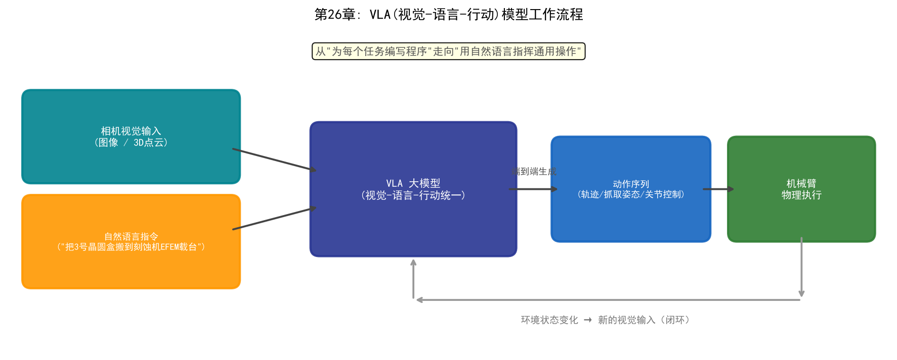
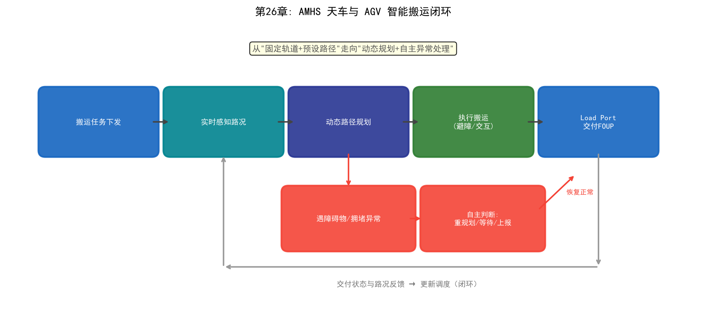
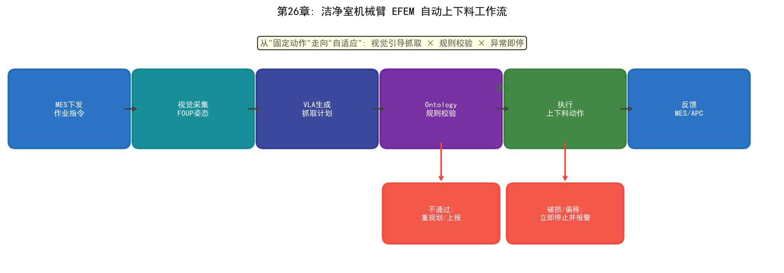

# Chapter 26: Applications of Embodied AI — When AI Steps into the Physical World of the Fab

## 26.1 From "Thinking" to "Acting"

The AI applications discussed in the previous 25 chapters mostly live in the digital world: yield prediction processes data, smart scheduling outputs decisions, LLMs answer questions. They "think" but do not "act" — the actions are ultimately carried out by engineers and automated equipment.

Embodied AI addresses the final missing link: **letting AI perceive the real environment through physical entities, understand scene semantics, and execute physical actions**. Chapter 21 discussed the NSA full fusion — the perception-cognition-action intelligent loop — and embodied AI is precisely the physical-world manifestation of this loop: "thinking" plus "acting."

In the fab context, embodied AI means: AI systems not only read wafer maps and equipment status, but also perform physical operations in the cleanroom — transport, load/unload, inspection, and maintenance — through robotic arms, overhead hoists, and mobile robots. Fabs have naturally strong demand for embodied AI:

- **Expensive cleanroom labor**: bunny suits, shift work, strict training — labor is costly and error-prone
- **24/7 continuous production**: human quality fluctuation on night shifts directly affects line stability
- **Extreme precision requirements**: nanometer-scale processes demand operating stability beyond human physiological limits
- **Solid automation foundation**: fabs already use EFEM, AMHS, and other automated equipment extensively — natural carriers for embodied AI

## 26.2 The Embodied AI Technology Stack

Embodied AI is not a single technology but a "perceive-understand-plan-act" stack:

| Layer | Technology | Role |
| --- | --- | --- |
| Multimodal perception | Vision (camera/3D), force, tactile, LiDAR | Perceive the physical environment |
| World model | Semantic maps, digital twins, Ontology | Understand "where I am, what is around me" |
| Cognitive planning | LLMs, task planners | Decompose intent into action sequences |
| Action execution | VLA models, motion control, robotic arm/mobile base | Execute physical actions |
| Learning and feedback | Imitation learning, RL, teleoperation data | Improve from experience |

The most representative technology is the **VLA (Vision-Language-Action) model**: it unifies visual perception, language understanding, and action decisions in a single large model — input "move wafer carrier #3 onto the EFEM load port of the etcher," and the model directly outputs the robotic arm's action sequence. VLA moves robot operation from "writing a program for every task" toward "commanding general operations in natural language"[99].


*Figure 26-1: The "perceive–understand–plan–act" technology stack of embodied AI; the learning-feedback loop continuously improves the planning and execution layers*



*Figure 26-2: VLA (Vision-Language-Action) model workflow — visual input and natural-language instruction are unified end-to-end into an action sequence*

## 26.3 Embodied AI Scenarios in the Fab

### Scenario 1: Intelligent AMHS Overhead Hoists and AGVs

The fab's overhead hoist transport (AMHS) system and automated guided vehicles (AGVs) move wafers between tools. Traditional AMHS relies on fixed tracks and preset paths, queuing when congested. Embodied-AI-enhanced transport systems provide:

- **Dynamic path planning**: avoiding congested areas based on real-time traffic
- **Obstacle avoidance and interaction**: safe interaction with load ports and maintenance zones
- **Exception handling**: autonomously judging and reporting when obstacles or anomalies occur



*Figure 26-3: The intelligent-transport closed loop of AMHS overhead hoists and AGVs — dynamic path planning, autonomous anomaly handling, and feedback loop*

### Scenario 2: Cleanroom Robotic Arms and EFEM Auto Load/Unload

The EFEM (Equipment Front End Module) in front of process tools is the standard robotic load/unload scenario. Embodied AI moves load/unload from "fixed motions" to "adaptive":

- **Vision-guided gripping**: recognizing FOUP orientation and adaptively adjusting grip angle
- **MES/APC linkage**: automatically switching process recipes per production instructions
- **Anomaly recognition**: immediately stopping and alerting on broken wafers or position drift



*Figure 26-4: Cleanroom robotic-arm EFEM auto load/unload workflow — vision-guided gripping × Ontology rule verification × stop-on-anomaly*

### Scenario 3: Mobile Manipulation Robots for Inspection and Maintenance

Inspection robots equipped with cameras and sensors move through cleanrooms/equipment areas to:

- **Equipment status inspection**: reading gauges, recognizing indicator lights, detecting abnormal noise
- **Sample delivery**: automatically transporting metrology samples to metrology tools
- **Maintenance assistance**: performing simple cleaning and consumable replacement under engineer guidance

### Scenario 4: Humanoid Robots (Exploratory)

Humanoid robots have the potential to operate in human-designed environments and represent the frontier of embodied AI exploration. They remain at the proof-of-concept stage in fabs, facing challenges in cleanroom compatibility (particle control), motion stability, and cost.


*Figure 26-5: Three-layer architecture of an embodied AI Agent — Ontology cognitive layer × LLM/VLA decision layer × robotic action layer*

## 26.4 The Fusion of Embodied AI and Ontology

For embodied AI to "understand" the fab, it needs a world model of the factory — precisely where the Ontology of Chapters 24 and 25 comes in. Ontology establishes an "object-relationship-rule" semantic model of the fab: what equipment exists, where materials are, how process flows proceed, and which operations are allowed.

```
Three-layer architecture of an embodied AI Agent:
┌─────────────────────────────────────────────┐
│ Cognitive layer: Ontology world model       │  ← understands fab semantics (Ch. 24/25)
│  · semantic modeling of tools/materials/     │
│    process/spatial relationships             │
│  · "Where is etcher E03? Is its EFEM idle?"  │
├─────────────────────────────────────────────┤
│ Decision layer: LLM/VLA + task planning      │  ← decomposes intent into actions
│  · generates operation plans from natural    │
│    language instructions                     │
├─────────────────────────────────────────────┤
│ Action layer: robotic arms/AGVs/hoists       │  ← executes physical actions, feeds back
└─────────────────────────────────────────────┘
```

The combination of Ontology and embodied AI delivers two key values:

1. **Verifiability**: the embodied AI's action plan can be validated against Ontology rules — "does this operation conform to the process specification?" — preventing dangerous actions caused by LLM hallucinations
2. **Orchestratability**: the objects and actions described by the Ontology can be invoked by embodied AI Agents, exactly like the "object + action + function" model of the Agent architecture in Chapter 23 and Palantir AIP in Chapter 24 — embodied AI is the physical-world execution end of these agents


*Figure 26-6: Embodied AI application scenarios in the fab — intelligent transport, auto load/unload, and mobile inspection*

## 26.5 Current Practice and Cases

- **Industry status**: embodied AI applications in fabs are overall at the "mature automation, nascent intelligence" stage — robotic arms/hoists/AGVs are widespread, but the complete "autonomous perceive-decide-execute" loop remains mostly at the pilot stage
- **AMHS intelligence**: leading fabs collaborate with AMHS vendors to add intelligent path planning and predictive maintenance to transport scheduling (echoing the AMHS health management of Chapter 12's mature phase)
- **Equipment vendor exploration**: semiconductor equipment vendors are adding vision guidance and automated operation to EFEM and metrology tools
- **Digital twin + embodied AI**: training and validating robot operation policies in digital-twin environments before deploying to physical equipment (echoing the world models and digital twins of Chapter 21)[100]

Viewed through Chapter 21's "four-stage evolution," most fabs today sit between **AI-Assisted and AI-Augmented**; embodied AI (the physical execution form of AI autonomy) is the endpoint of the evolution direction.

## 26.6 Challenges and Outlook

- **Technical challenges**: precision and reliability of physical operation (wafers are extremely fragile), cleanroom compatibility (particle and electrostatic control), safe human-robot interaction
- **Cost challenges**: the ROI of robot systems — robot costs still exceed labor in most scenarios today; scaling requires cost reduction
- **Organizational challenges**: new working models of engineer-robot collaboration, and building trust in autonomous systems
- **Outlook**: from "point automation" to "embodied operations" — when Ontology, LLM/Agent, and embodied AI converge, fabs can move from "equipment automation" toward "autonomous factory operations"

## 26.7 Chapter Summary

Embodied AI is the natural extension of this book's logic: the three schools teach AI to think, fusion (NSA) completes the perception-cognition-action loop, LLMs and Agents give AI language and collaboration, Ontology builds the fab's world model — and embodied AI finally brings all of this to "acting" in the physical world. For fabs, embodied AI is not distant science fiction but the direction in which automation evolves toward "autonomous perception, autonomous decision, autonomous execution." Its adoption speed depends on three factors: technical reliability, the cost curve, and organizational readiness for change.
