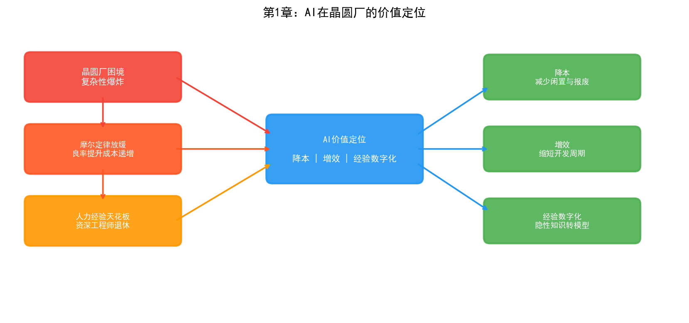

# 第1章 为什么是 AI × 半导体晶圆厂

## 1.1 摩尔定律的黄昏与 AI 的黎明

2024年，一座先进制程晶圆厂的造价已经攀升到200至300亿美元。作为参照，2000年建一座晶圆厂只需10至20亿美元——二十五年间，建厂成本翻了十倍以上。单台EUV光刻机的售价超过1.5亿美元，新一代High-NA EUV更是突破3.5亿美元，而一座3nm晶圆厂需要部署15台以上这样的设备。一张3nm制程的光罩套件成本超过2000万美元。

这些数字背后是一个残酷的现实：半导体制造正在逼近物理极限，每一代技术节点的推进都比上一代更加艰难。

摩尔定律没有死，但它正在变贵。台积电3nm工艺的晶体管密度相比5nm提升了约70%，但良率爬坡周期显著拉长，工艺步骤从7nm的约800至1200步膨胀到3nm的超过1200步，光刻层数从7nm的60至80层增加到3nm的80至120层。每一层都需要经历清洗、沉积、光刻、刻蚀、清洗、量测的核心循环，任何一步的微小偏差都可能导致整批晶圆报废。

与此同时，另一场革命正在发生。

2012年，AlexNet在ImageNet竞赛中将错误率从26%降至15%，深度学习一战成名。2022年，ChatGPT发布，大语言模型展现出的涌现能力震惊世界。2024年，Palantir的AI平台在美国对伊朗的军事行动中首次实现了"算法主导的杀伤链"——AI定义了目标的识别、时机的选择和打击的序列，人类指挥官只做最终批准。

半导体制造和人工智能，这两个各自经历了数十年发展的领域，正在一个特殊的交汇点相遇。晶圆厂积累了海量的工艺数据却无法被充分消化，而AI恰恰具备从海量数据中提取模式、做出预测、优化决策的能力。这种匹配不是巧合——当人类工程师的认知能力已经无法处理千步工艺、百层结构、万亿参数的复杂性时，机器智能的介入变得不可回避。

## 1.2 晶圆厂的困境：复杂性爆炸

### 工艺步骤的指数级增长

一颗3nm芯片从晶圆投入到产出需要经历3至4个月的制造周期，其间经过超过1200道工艺步骤。这些步骤并非简单的线性叠加——前后步骤之间存在复杂的交互效应。某一层的刻蚀深度偏差0.5纳米，可能在二十层之后的电性测试中表现为漏电流超标，而这个关联往往无法通过单步工艺参数的监控来发现。

28nm制程大约包含400至600道工序，3nm GAA架构则超过1200道。工序数量翻倍意味着潜在的参数交互组合呈指数级增长。假设每步工艺有10个关键参数，每个参数有5个可能的状态，1200步工艺的参数空间就是 $5^{12000}$——这个数字远超宇宙中的原子总数。当然，实际工程中并非所有参数都相互耦合，但即使只考虑相邻步骤的交互，需要监控的参数组合也达到了天文数字。

### 良率提升的边际成本递增

在成熟制程（28nm及以上）中，良率从50%爬升到90%通常需要6至12个月。但在先进制程中，同样的爬坡可能需要18至24个月甚至更久。三星的2nm GAA工艺在初期的良率一度跌至30%左右，经过与Palantir合作进行数据整合与分析后，到2026年中期良率爬升至约55%——仍然低于60%的量产门槛。每一代新工艺的良率爬坡曲线都在变得更陡峭。

良率的经济意义是直接的。一座月产5万片的3nm晶圆厂，良率每提升1个百分点，每年增加的利润可达数千万美元。反过来，良率每损失1个百分点，意味着同样的设备和人力投入下产出更少的良品。当一座工厂的年折旧成本以十亿美元计时，良率就是一切。

### 人力经验的天花板

晶圆厂中存在一个难以量化的核心资产：资深工程师的经验。一位有20年经验的工艺工程师可以通过观察FDC（故障检测与分类）图表的形态判断某台机台是否即将出现异常，可以根据缺陷的空间分布模式推断出问题出在哪一步工艺的哪个腔体。这种"看一眼就知道"的能力，本质上是人脑对海量历史数据的高度压缩表征——但它有三个致命的局限。

第一，不可复制。培养一位合格的PID工程师需要5至10年，而先进制程的迭代速度要求人才储备跟上技术节奏。第二，不可扩展。一位工程师同时能监控的机台数量和工艺步骤是有限的。第三，不可传承。当资深工程师退休或离职，他们脑海中那些从未被文字记录的关联规则也随之消失。

这三个局限共同指向同一个结论：晶圆厂需要一种能够从数据中自动提取经验、将隐性知识显性化、并可无限复制和扩展的技术。这正是AI擅长的。

## 1.3 AI 在晶圆厂的价值定位

AI在晶圆厂的价值不是替代工程师，而是将工程师从低效的信息处理工作中解放出来，让他们聚焦于真正需要人类判断力的决策。具体而言，AI在晶圆厂的价值可以归结为三个层面。

### 降本：减少机台闲置与晶圆报废

一座先进晶圆厂运行着数百台设备，每台设备的闲置成本以每小时数千美元计算。传统的预防性维护（PM）采用固定周期——不管机台状态如何，每隔N批次做一次保养。这种方式要么维护过早（浪费产能），要么维护过晚（导致异常批次甚至设备停机）。

基于AI的预测性维护通过分析设备的传感器时序数据（温度、压力、振动、RF功率等），可以在异常发生前数小时甚至数天发出预警。英特尔在其晶圆厂中部署了基于机器学习的设备监控系统，将非计划停机时间显著降低。台积电开发了智能设备健康度监控系统，通过自学习算法实现"最严格的工艺控制标准"。

晶圆报废的代价更为直接。一片3nm晶圆上有数百颗芯片，按单颗芯片售价计算，一片晶圆的产值可达数万美元。如果AI能将报废率降低0.5个百分点，对于一座月产5万片的工厂来说，每年挽回的损失以百万美元计。

### 增效：缩短工艺开发周期与加速良率爬坡

新产品导入（NPI）是晶圆厂最耗时也最烧钱的阶段。一个先进制程的NPI周期通常需要1至2年，期间需要进行大量的DOE（实验设计）来寻找最优工艺窗口。传统DOE方法依赖于工程师的经验和统计方法，面对上千个工艺参数和它们之间的非线性交互，效率极低。

AI可以从两个方向加速这一过程。第一，基于历史数据的迁移学习——上一代工艺的DOE结果可以指导新一代工艺的参数搜索方向。第二，基于贝叶斯优化或强化学习的主动实验设计——AI模型根据已有实验结果预测最有信息量的下一组实验参数，从而用更少的实验次数覆盖更大的参数空间。

英特尔在18A工艺上应用机器学习后，实现了每月约7%的良率改善速率。这意味着原本可能需要一年的良率爬坡周期被压缩了数月。英特尔的实践还包括基于ML的快速根因分析（RCA），将原本耗时数天的缺陷根因定位压缩到分钟级别。

### 经验数字化：将隐性知识转化为可复用的模型

这是AI在晶圆厂最深层的价值。传统的工艺知识以文档、SOP、工程师脑中的经验三种形式存在。文档是显性的但往往过时，SOP是规范的但无法覆盖所有异常情况，工程师的经验是最有价值的但最难传承。

AI可以将这些隐性知识转化为模型。例如，通过知识图谱将工艺规范、设备参数、缺陷模式、根因记录整合为一个可推理的语义网络；通过深度学习将工程师"看图识缺陷"的能力转化为自动缺陷分类（ADC）模型；通过强化学习将资深工程师的recipe调参策略转化为R2R控制策略。

这些模型一旦训练完成，可以同时部署到多台设备、多个工厂，且永不疲倦、永不离职。三星将其AI优化生产描述为"一个连接先前孤立流程的智能网络"，其HBM4内存的制造即受益于这套AI优化系统，实现了30%的缺陷检测改善和15%的晶圆良率提升。

## 1.4 全球晶圆厂 AI 落地现状

### 台积电

台积电在其官方网站的"工程性能优化"板块中明确表示正在实施AI技术，开发了精确故障检测与分类系统、智能先进设备控制和智能先进工艺控制。台积电的AI应用强调"智能检测、智能诊断和自学习"，以实现最严格的工艺控制标准，确保机台匹配的一致性和工艺稳定性。结合台积电的代工经验，AI被用于最小化工艺参数的收敛偏差。

台积电的AI部署是渐进式的——从单点的缺陷检测自动化，逐步扩展到整线的智能调度。据SEMI报道，台中科学园区的一座新建晶圆厂已经实现了AI驱动的调度指令：凌晨3点，一批完成离子注入的晶圆根据AI调度绕过传统等待区直接送入清洗工段。这种实时调度优化在传统MES系统中是无法实现的。

### 三星

三星半导体是AI在晶圆厂应用最激进的实践者之一。2024年底，三星电子DS部门做出了一个被业内视为"近乎疯狂"的决定——将晶圆厂核心制造数据接入美国Palantir公司的AI分析平台。半导体工艺数据比芯片设计图纸更敏感，台积电和英特尔从未让第三方触碰产线数据。三星之所以破例，是因为2nm GAA工艺的良率已经跌到30%左右，传统方法无法突破瓶颈。

Palantir的Foundry平台通过Ontology（本体论）技术，将分散在MES、SPC、缺陷检测、电性测试等几十个异构系统中的数据统一建模为一张因果关联网络——"晶圆→批次→设备→工艺步骤→参数→缺陷→测试结果"之间的所有关系被显式定义，机器可以直接在这张网络上做关联查询和推理。到2026年中期，三星2nm良率爬升至约55%，虽然仍低于60%的量产门槛，但改善速度令业内瞩目。

三星同时在其AI Megafactory中部署了大规模AI算力（据报道使用约5万块GPU），将AI优化贯穿从缺陷检测到工艺参数调优的全流程，其HBM4内存产品即由这套AI优化系统制造。

### 英特尔

英特尔在半导体制造中大规模部署AI的实践可以追溯到2018年前后，并在其白皮书《人工智能在英特尔半导体制造环境中的重要价值》中做了系统阐述。英特尔工厂中部署的AI应用包括：

- 生产线上的缺陷检测
- 设备/设备群/晶圆厂匹配（Tool Matching）
- 多变量流程控制
- 自动化晶圆图模式检测和分类
- 快速根本原因分析（RCA）
- 筛选测试中的异常值检测

英特尔在18A工艺上应用机器学习后，实现了每月约7%的良率改善速率。RCA系统通过整合数十亿条异构生产数据，将根因定位时长从数天压缩到分钟级。

### 其他玩家

除了三大晶圆代工厂，AI在半导体制造中的应用也在向更广泛的生态扩散。Google DeepMind的AlphaChip项目使用强化学习结合图神经网络（GNN）优化芯片布局布线，实现了布线长度缩短6.2%，并将原本需要数周的设计过程压缩到数小时。NVIDIA将视觉语言模型（如Cosmos Reason）应用于晶圆图缺陷分类，实现了少样本学习、自然语言解释和自动数据标注，模型构建时间缩短可达2倍。Via Automation在2025年SEMICON West上发布了基于Agentic AI的Via Connect和Via Co-Pilot平台，将边缘数据集成与AI驱动的人机协作结合，目标指向"自愈工厂"。

设备厂商方面，Lam Research推出了Fabtex Yield Optimizer，结合AI和虚拟孪生技术，在虚拟世界中预测故障、定位根因、推荐解决方案——在物理晶圆被蚀刻之前。应用材料（Applied Materials）也在其Equipment Intelligence产品线中集成了AI分析能力。

## 1.5 本书的目标与组织方式

### 目标

本书的目标是系统性地回答一个问题：AI技术如何在半导体晶圆厂中真正落地？

市面上不缺AI技术书籍，也不缺半导体制造书籍，但将两者深度结合、既讲技术原理又讲工厂实践的系统性著作几乎没有。本书试图填补这个空白。

具体而言，本书追求三个目标：

**第一，让半导体工程师理解AI。** 不堆砌数学公式，而是从"AI能帮你解决什么问题"出发，讲清楚每类AI技术的适用场景、局限性和实施路径。一位PID工程师读完本书应该能判断：面对一个良率异常问题，是该用知识图谱做根因推理，还是该用深度学习做缺陷分类，还是该用强化学习做参数优化。

**第二，让AI工程师理解半导体。** 半导体制造不是普通的工业场景——它的数据异构性、工艺复杂性、质量严苛性和商业敏感性都是独特的。一位AI算法工程师读完本书应该能理解：为什么在晶圆厂部署一个CNN模型和在互联网公司部署完全是两回事，为什么数据融合比模型精度更关键，为什么Ontology可能是比深度学习更重要的基础设施。

**第三，为管理层提供决策参考。** 晶圆厂该投哪些AI项目、以什么顺序投、预期回报如何、风险在哪里——本书的案例和分析试图为这些问题提供框架性参考。

### 组织方式

本书采用"双线交织"的结构。

**业务主线**：以晶圆厂三大核心部门为脉络——工艺整合（PID）与良率工程（YED）、制造部（MFG）、制程工程（PE）与设备工程（EE）。这三个部门覆盖了晶圆厂从工艺开发到量产交付的完整价值链，每个部门有其独特的业务场景和AI需求。

**技术主线**：以AI的发展脉络为骨架——从1956年达特茅斯会议出发，沿着符号主义、连接主义、行为主义三大流派展开，延伸到大语言模型（LLM）与Agent，最终收束于Ontology（本体论）这一被Palantir证明在工业场景中极具价值的技术路线。

两条线的交叉点在第四部分——AI三大流派分别在三大部门中的应用。这种矩阵式结构确保每一种AI技术和每一个业务场景的组合都被覆盖到，读者既可以从技术维度横向阅读（比如"连接主义在三个部门的应用"），也可以从业务维度纵向阅读（比如"PID部门可以用的AI技术有哪些"）。

第六部分是本书的"终章"——Ontology。之所以单独成章，是因为Ontology可能是半导体晶圆厂AI落地中最被低估、却可能最具变革性的技术。Palantir用Ontology帮助美军实现了"算法主导的杀伤链"，又用同一套技术帮助三星从30%的良率泥潭中爬出来。这个故事背后的技术逻辑值得每一个半导体AI从业者深思。

### 阅读说明

本书各部分之间没有严格的先后依赖。半导体工程师建议从第三部分（晶圆厂业务）开始，找到自己熟悉的场景后再回溯到第二部分（AI技术）和第四部分（交叉应用）。AI工程师建议从第二部分开始，建立技术框架后跳到第四部分看应用。管理层和投资人可以直接跳到第六部分看Palantir的故事，再根据兴趣回溯。

本书所有内容在GitHub上开源，欢迎读者通过Issue反馈错误、补充案例、参与章节撰写。半导体技术迭代极快，本书将随行业发展持续更新。
