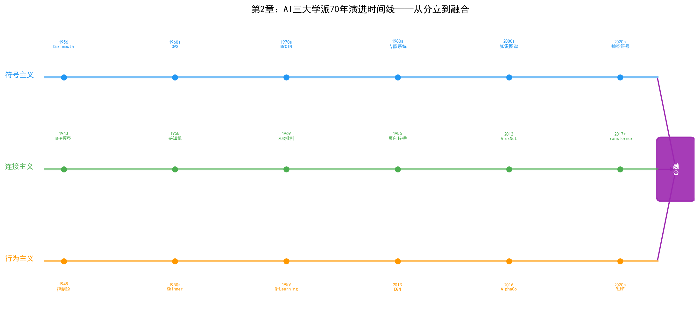

# 第2章 AI 简史——从 1956 年达特茅斯会议说起

## 2.1 达特茅斯会议：AI 的诞生

1956年夏天，美国新罕布什尔州的达特茅斯学院（Dartmouth College）迎来了一场为期约两个月的研讨会。会议的提案由四位学者联名提交：约翰·麦卡锡（John McCarthy，当时在达特茅斯任教）、马文·明斯基（Marvin Minsky，哈佛大学）、克劳德·香农（Claude Shannon，贝尔实验室）和纳撒尼尔·罗切斯特（Nathaniel Rochester，IBM）。

提案中第一次正式使用了"Artificial Intelligence"这个词。麦卡锡后来回忆说，他选择这个词是为了与"cybernetics"（控制论）和"automata"（自动机）区分开来——他需要一个能够涵盖"机器模拟人类智能各个方面"的统称。

会议的参与者还包括了赫伯特·西蒙（Herbert Simon）和艾伦·纽厄尔（Allen Newell），他们带着刚刚完成的"逻辑理论家"（Logic Theorist）程序参会。这个程序能够证明《数学原理》中前38条定理中的大部分，被后人称为"第一个AI程序"。阿瑟·塞缪尔（Arthur Samuel）在会议上报告了他的跳棋程序——这个程序通过自我对弈不断学习，最终达到了业余高手的水平。塞缪尔在1959年提出了"机器学习"（Machine Learning）这个术语。

达特茅斯会议的意义不在于它解决了什么问题——事实上会议期间几乎没有达成共识——而在于它划定了一个学科边界，把分散在逻辑学、控制论、信息论、心理学等不同领域的研究者聚集到了"人工智能"这面旗帜下。从这一刻起，AI作为一个独立学科开始了它跌宕起伏的七十年。

## 2.2 第一次热潮与寒冬（1956–1974）

达特茅斯会议之后的十几年是AI的第一个黄金时代。研究者们充满乐观，相信通用人工智能指日可待。

1958年，纽厄尔和西蒙发布了"通用问题求解器"（General Problem Solver, GPS），试图模拟人类解决问题的思维过程。GPS采用"手段-目的分析"（means-ends analysis）策略：比较当前状态与目标状态的差异，选择能缩小差异的操作符，递归地应用到子问题上。虽然GPS只能解决简单的逻辑谜题和数学问题，但它的意义在于第一次将"启发式搜索"形式化为可计算的框架。

1966年，麻省理工学院的约瑟夫·魏岑鲍姆（Joseph Weizenbaum）编写了ELIZA——一个模拟心理咨询师的对话程序。ELIZA的技术极其简单——通过模式匹配和关键词重写生成回复——但效果出人意料地好，很多用户真的以为自己在和一个人对话。魏岑鲍姆本人对此感到不安，后来写了《计算机的力量与人类理性》一书，质疑AI的伦理边界。

1970年，特里·维诺格拉德（Terry Winograd）开发了SHRDLU——一个在虚拟积木世界中执行自然语言指令的系统。用户可以用英语告诉SHRDLU"把那个红色的方块放到蓝色立方体上"，系统会理解指令、规划动作并执行。SHRDLU证明了自然语言理解在受限领域中是可行的，但也暴露了一个问题：当领域的边界稍微扩大，系统的复杂度就会爆炸。

这段时间最雄心勃勃的项目是麻省理工学院的MAC项目，目标之一是构建一个能够理解自然语言、进行数学推导、下棋、甚至写诗的通用AI系统。这个目标显然过于超前，最终只实现了部分功能。

乐观情绪在1960年代末达到顶峰。西蒙在1965年预测："二十年内，机器将能够完成人类能做的一切工作。"明斯基在1967年表示："在一代人之内，创造'人工智能'的问题将被基本解决。"

这些预测没能实现。1973年，英国数学家詹姆斯·莱特希尔爵士（Sir James Lighthill）应英国科学委员会要求提交了一份AI领域评估报告。莱特希尔审查了AI研究的实际成果后得出了严厉的结论：AI研究未能实现其承诺，基础研究（如机器翻译）的实际效果远不如预期，所谓的"通用问题求解"只能在玩具问题上运作。莱特希尔报告导致英国政府大幅削减AI研究经费，美国国防部高级研究计划局（DARPA）也随之收紧了对AI的资助。第一次AI寒冬降临。

## 2.3 专家系统时代（1974–1987）

寒冬中，AI研究者们反思了第一波热潮的教训。一个核心共识是：通用智能太难，不如先解决特定领域的专业问题。这个思路催生了专家系统。

专家系统的逻辑很简单：把人类专家的知识编码成"如果-那么"规则，存储在知识库中，然后用推理引擎根据规则推导结论。与通用问题求解器不同，专家系统不追求通用性，而是在一个狭窄的专业领域中做到专家水平。

1965年（比达特茅斯会议还早），斯坦福大学的爱德华·费根鲍姆（Edward Feigenbaum）开始开发DENDRAL——一个能够根据质谱数据推断有机分子结构的系统。DENDRAL内嵌了化学家的启发式规则，能够在特定领域超越人类专家。DENDRAL的意义在于它开创了"知识工程"（Knowledge Engineering）这一范式：AI的核心不是推理算法（推理引擎可以通用），而是领域知识（知识库必须由专家构建）。

1970年代中期，斯坦福大学开发了MYCIN——一个诊断细菌感染并推荐抗生素的系统。MYCIN的知识库包含约600条规则，在血液感染诊断中的准确率达到了约65%，优于初级医生（约60%）但略低于专科医生（约70%）。MYCIN还引入了"不确定性推理"——每条规则附带一个确定性因子（certainty factor），推理结果不是"是"或"否"，而是一个概率值。

DENDRAL和MYCIN的成功引发了专家系统的商业化热潮。1980年代，DEC公司部署了XCON（又名RI），一个配置VAX计算机系统的专家系统，据说每年为公司节省数千万美元。从1980年到1987年，专家系统市场规模从数百万美元增长到数十亿美元。

1982年，日本启动了"第五代计算机系统"（Fifth Generation Computer Systems, FGCS）项目，计划在十年内投入约8.5亿美元，开发基于逻辑编程（Prolog）的并行推理计算机。这个项目在全球引发了连锁反应——美国和欧洲纷纷启动了自己的"智能计算机"项目，如美国的MCC（Microelectronics and Computer Technology Corporation）和欧洲的ESPRIT计划。

然而专家系统有两个致命的弱点。

第一，知识获取瓶颈。构建一个中等规模的专家系统（几百条规则）需要知识工程师与领域专家花数月甚至数年时间进行"知识抽取"——逐条询问专家的决策规则并编码成"如果-那么"形式。这个过程极其耗时且容易出错，因为专家的很多知识是隐性的——他们知道怎么做，但说不清楚为什么。

第二，脆弱性。专家系统只有知识库中明确编码的规则才能推理。遇到规则未覆盖的情况，系统要么沉默不语，要么给出荒谬的答案。它没有人类那种"差不多就行"的常识推理能力。

1987年，专家系统的市场突然崩塌。原因不是技术本身出了问题，而是商业环境变了——个人电脑的崛起使得昂贵的Lisp专用工作站失去了市场（一台Lisp机器要5万至10万美元，而一台Macintosh只需2500美元），企业发现维护一个专家系统的成本远超预期。与此同时，日本的第五代计算机项目在1992年悄然终止——未能实现任何具有实用价值的突破。

第二次AI寒冬比第一次更冷。从1987年到1993年，AI研究几乎从公众视野中消失。商业媒体将AI视为又一个过度炒作的技术泡沫，"人工智能"这个词本身成了一个带有贬义的标签——很多研究者改用"机器学习"、"模式识别"、"智能系统"等更务实的名字来描述自己的工作。

## 2.4 统计学习与连接主义复兴（1987–2012）

寒冬之中，AI研究并没有停止，只是换了方向。

### 连接主义的地下复苏

1986年，大卫·鲁梅尔哈特（David Rumelhart）、杰弗里·辛顿（Geoffrey Hinton）和罗纳德·威廉姆斯（Ronald Williams）在《自然》杂志上发表论文，系统阐述了反向传播算法（Backpropagation）。反向传播不是他们的原创——保罗·韦伯（Paul Werbos）在1974年的博士论文中就描述了类似算法——但1986年的论文让这个算法被广泛知晓。

反向传播解决了多层神经网络的训练问题。单层感知机无法学习XOR等非线性函数——这正是1969年明斯基和帕珀特在《感知机》一书中指出的致命缺陷。反向传播通过链式法则将输出误差逐层传播回输入端，使得多层网络可以学习复杂的非线性映射。这个突破为深度学习埋下了种子。

辛顿和他的学生们在接下来的二十年中一直在多伦多大学坚持研究神经网络，当主流AI社区沉浸在支持向量机（SVM）和贝叶斯方法的辉煌中时，这个小组几乎是连接主义的最后阵地。2006年，辛顿发表了关于"深度信念网络"（Deep Belief Networks）的论文，提出了一种逐层预训练的策略来克服深层网络的训练困难。这篇论文重新定义了"深度学习"（Deep Learning）这个术语，并引发了新一轮连接主义研究的浪潮。

### 统计学习的主流地位

1990年代，统计学习方法主导了AI研究。弗拉基米尔·瓦普尼克（Vladimir Vapnik）在1995年提出了支持向量机（SVM），通过将数据映射到高维空间寻找最大间隔超平面，SVM在小样本分类问题上表现出色，迅速成为机器学习的标准工具。同时，贝叶斯网络作为一种处理不确定性的概率推理框架，在医疗诊断、故障诊断等领域得到了广泛应用。

这些方法的共同特点是：不试图模拟人类思维，而是从数据中学习统计规律。它们不追求通用智能，而是在具体的分类、回归、聚类任务上追求可量化的性能指标。这种务实的转向为后来深度学习的爆发奠定了基础设施——数据集、评测标准、开源工具链都是在这个时期建立的。

### 一个被忽视的领域

值得注意的是，这段时期半导体行业对统计学习的应用已经有了一些早期探索。1990年代，部分晶圆厂开始使用简单的统计模型进行工艺参数监控和缺陷率预测。SPC（统计过程控制）是半导体制造的基础工具，而SVM等机器学习方法被尝试用于FDC（故障检测与分类）和ADC（自动缺陷分类）。但这些应用大多是孤立的、实验性的，远未形成系统性的技术体系。连接主义在半导体行业几乎没有存在感——当时的数据量和算力都不足以支撑深度学习。

## 2.5 深度学习革命（2012–2020）

### ImageNet 与 AlexNet

2012年9月，ImageNet大规模视觉识别挑战赛（ILSVRC）的结果震惊了计算机视觉社区。多伦多大学的 Alex Krizhevsky、Ilya Sutskever 和 Geoffrey Hinton 提交的 AlexNet，将图像分类的错误率从上一年的26%一举降到15.3%——领先第二名10.8个百分点。

AlexNet 的技术构成并不新颖——卷积神经网络（CNN）早在1998年就被 Yann LeCun 用于手写数字识别（LeNet-5），反向传播也已经存在了二十多年。AlexNet 的成功是三个因素同时成熟的结果：第一，ImageNet 数据集提供了百万级标注图像；第二，GPU 提供了足够的算力来训练深层网络；第三，AlexNet 使用了 ReLU 激活函数和 Dropout 正则化，解决了深层网络的梯度消失和过拟合问题。

AlexNet 的意义远超图像分类本身。它证明了"更多的数据 + 更深的网络 + 更强的算力"可以产生质的飞跃，这个发现直接催生了之后十年的AI投资浪潮。

### AlphaGo

2016年3月，DeepMind 开发的 AlphaGo 在首尔以4:1击败了围棋世界冠军李世石。围棋曾被认为是AI最难攻克的棋类游戏——棋局状态数（约 $10^{170}$）超过了宇宙中的原子总数，传统的Minimax搜索完全不可行。

AlphaGo 的技术架构是连接主义和行为主义的完美融合：深度神经网络用于评估棋局和选择落子位置（策略网络和价值网络），蒙特卡洛树搜索（MCTS）用于在搜索空间中探索。2017年的 AlphaZero 更进一步，完全不依赖人类棋谱，仅通过自我对弈从零开始学习，最终超越了所有人类和AI棋手。

AlphaGo 的胜利在工业界引发了巨大反响。如果AI能在围棋这种"人类最后的智力堡垒"上胜出，它还有多少领域不能征服？这种乐观情绪推动了AI在医疗、金融、制造等领域的快速渗透。

### 深度学习向工业领域渗透

2012年到2020年间，深度学习技术在工业场景中的应用开始涌现。在半导体制造领域，几个方向率先起步：

**缺陷检测**：CNN 在图像分类上的优势天然适配晶圆缺陷检测。传统的自动缺陷分类（ADC）依赖手工特征提取和简单分类器，深度学习模型在复杂缺陷模式识别上的准确率显著优于传统方法。

**预测性维护**：LSTM 等循环神经网络在时序信号预测上的能力被应用于设备传感器数据的异常检测。通过学习正常运行的信号模式，模型可以在参数偏离正常范围时发出预警。

**良率预测**：基于深度学习的晶圆图分析模型能够从缺陷的空间分布模式中识别出与特定工艺步骤相关的系统性问题，辅助PID工程师进行根因定位。

这些应用虽然还局限在单点优化层面，但已经展现出深度学习在半导体制造中的巨大潜力。

## 2.6 大模型时代（2020 至今）

### Transformer 与 GPT

2017年，Google 的 Ashish Vaswani 等人发表了《Attention is All You Need》，提出了 Transformer 架构。Transformer 完全抛弃了循环和卷积结构，仅依赖自注意力（Self-Attention）机制来建模序列中元素之间的关系。这个看似简单的架构变革产生了深远的影响——Transformer 成为了之后所有大语言模型的基础。

OpenAI 的 GPT 系列沿着"扩大规模"这条路坚定前行。GPT-1（2018）有1.17亿参数，GPT-2（2019）有15亿参数，到 GPT-3（2020）参数量飙升到1750亿。GPT-3 的突破不在于架构创新——它用的是标准的 Decoder-only Transformer——而在于规模：当模型和训练数据大到一定程度后，出现了训练时未曾显式教授的"涌现能力"（Emergent Abilities），如少样本学习、链式推理和代码生成。

2022年11月，ChatGPT 发布。GPT-3.5 与人类偏好对齐（RLHF）的结合产生了惊人的对话效果，两个月内用户突破一亿，成为史上增长最快的消费级应用。ChatGPT 的成功将AI从学术研究推向了公众视野的最前沿。

### Agent 的兴起

大语言模型的涌现能力催生了一个新的概念：Agent（智能体）。与传统AI系统执行单一任务不同，Agent 旨在通过感知环境、规划行动、调用工具、记忆上下文来自主完成复杂的多步骤任务。

Agent 的核心架构可以概括为四个组件：

- **感知（Perception）**：从环境中获取信息，可以是文本输入、API调用结果、传感器数据等
- **规划（Planning）**：将目标分解为可执行的子任务序列
- **记忆（Memory）**：短期记忆保持当前任务的上下文，长期记忆存储历史经验和知识
- **行动（Action）**：调用外部工具（搜索引擎、数据库查询、代码执行等）或与人交互

2023年以来，AutoGPT、BabyAGI等开源Agent框架相继出现，ReAct（Reasoning + Acting）范式成为主流。在企业场景中，Agent开始被用于自动化数据分析、客户服务、代码开发等任务。

### LLM 在工业场景的探索

大模型在工业领域的应用仍处于早期探索阶段，但半导体行业已经展现出了几个有价值的应用方向：

**工艺规范智能问答**：晶圆厂积累了海量的工艺规范文档（SPEC）、设备操作手册和异常处理流程。传统方式下工程师需要手动检索这些文档，效率低下。基于 RAG（检索增强生成）技术，LLM 可以理解工程师的自然语言提问，从文档库中检索相关内容并生成准确的回答。

**报告自动化**：良率报告、异常分析报告、设备状态报告等在晶圆厂中每天产生大量重复性文档工作。LLM 可以根据结构化数据自动生成这些报告的草稿，工程师只需审阅和修正。

**跨系统数据问答**：工程师可以用自然语言提问"上周3号机台的刻蚀均匀性有没有异常"，LLM 配合数据查询工具自动生成SQL或API调用，获取数据并给出分析。

但LLM在晶圆厂的落地也面临独特挑战：工艺数据的保密性要求极高（三星接入Palantir时已属"破例"），大模型的"幻觉"问题在工业场景中代价更高（一个错误的工艺参数建议可能导致整批晶圆报废），以及如何将领域专业知识有效注入大模型。

## 2.7 AI 三大学派的分化与融合

回望AI七十年历史，三条主线贯穿始终，它们对应着三种不同的智能观。

### 符号主义

符号主义认为智能的核心是符号操作——将知识表示为符号，通过逻辑规则进行推理。从达特茅斯会议到专家系统时代，符号主义是AI的主流。逻辑理论家、GPS、MYCIN都是符号主义的产物。符号主义的优势是可解释性——每一步推理都可以追溯到具体的规则——但它的局限同样明显：需要人工编码知识，无法处理感知层面的模糊性和不确定性，面对"常识"问题时显得力不从心。

### 连接主义

连接主义认为智能源于神经元之间的连接——通过调整连接权重来学习数据中的模式。从1958年的感知机到2012年的AlexNet再到今天的GPT，连接主义走过了从被压制到主导AI领域的曲折道路。连接主义的优势在于从数据中自动学习特征表示的能力，但它也因此被批评为"黑箱"——模型做出预测的决策过程不透明。

### 行为主义

行为主义认为智能在与环境的交互中涌现——通过试错和反馈来学习最优行为策略。从维纳的控制论到强化学习，行为主义在很长一段时间内是AI的边缘流派。AlphaGo和AlphaZero的成功改变了这一局面——强化学习在序贯决策优化上的能力被充分证明。但行为主义的局限在于样本效率低（需要大量试错）和奖励函数设计困难。

### 从对立到融合

三大学派在历史上曾相互对立——符号主义者批评连接主义是"黑箱"，连接主义者嘲笑符号主义是" brittle old AI"，行为主义者认为两者都忽略了智能体与环境的交互。

但近年的趋势是融合。神经符号AI（Neuro-Symbolic AI）试图将符号推理的可解释性与神经网络的模式识别能力结合。AlphaGo本身就是连接主义（深度神经网络）和行为主义（强化学习）的融合。而LLM+Agent的范式则同时涉及连接主义（LLM的神经网络基础）、符号主义（Agent使用工具和规则进行规划）和行为主义（Agent通过环境反馈调整策略）。

这种融合趋势对半导体晶圆厂具有重要意义。一个完整的晶圆厂AI系统可能同时需要：知识图谱来组织工艺知识（符号主义）、深度学习来识别缺陷模式（连接主义）、强化学习来优化工艺参数（行为主义）、LLM来理解工程师的自然语言指令（连接主义）、Ontology来融合跨系统的异构数据（符号主义的延伸）。

本书的第二部分将逐一展开这三大学派的技术细节，第四部分将具体讨论它们在晶圆厂三大部门中的应用。而在第六部分，我们将看到Ontology——符号主义在工业场景中最成熟也最被低估的技术——如何通过Palantir在三星晶圆厂中发挥了改变格局的作用。

---

> **本章要点回顾**
>
> | 时期 | 主流流派 | 标志性事件 | 对半导体的影响 |
> | --- | --- | --- | --- |
> | 1956–1974 | 符号主义 | 达特茅斯会议、GPS、ELIZA | 几乎无直接影响 |
> | 1974–1987 | 符号主义 | 专家系统（MYCIN、DENDRAL） | 早期工艺知识管理探索 |
> | 1987–2012 | 统计学习+连接主义复苏 | SVM、反向传播 | SPC、FDC中的统计模型应用 |
> | 2012–2020 | 连接主义 | AlexNet、AlphaGo | CNN用于缺陷检测、LSTM用于预测性维护 |
> | 2020 至今 | 连接主义+融合 | GPT、Agent、Ontology | LLM问答、Agent系统、整厂数字化 |

> **本章配套实验**：第27章 27.11 节的多 Agent 评估框架（`demos/experiments/fab_agent_test`）以白盒方式演示了 2.6 节所述的 Agent 概念如何落地为可评估的系统——规划、工具调用、反思、编排四模块协作，并实时评估过程质量、资源成本与系统韧性。
