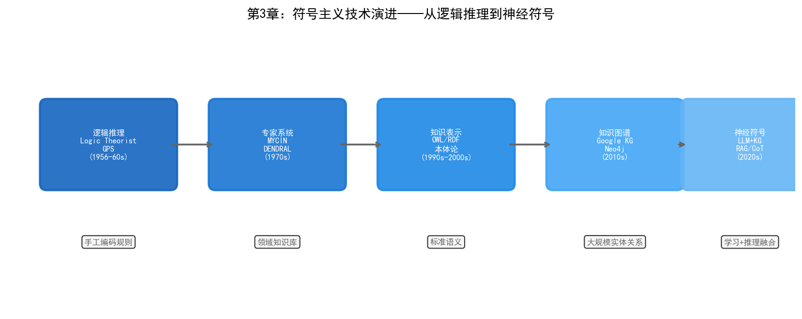

# 第3章 符号主义——从规则到知识

## 3.1 哲学根源：理性主义传统

符号主义的思想根源可以追溯到十七世纪。莱布尼茨在1666年的著作《论组合术》中提出了一个宏大的设想：如果人类思维可以被还原为符号的组合与运算，那么所有的理性争论都可以通过计算来解决——"让我们计算吧"（Calculemus）。他设想了一种普遍的形式语言（characteristica universalis）和对应的推理演算（calculus ratiocinator），使得两个哲学家之间的分歧不再需要争吵，只需坐下来做计算。

莱布尼茨的梦想在当时的技术条件下完全无法实现，但这个思路影响了之后三百年的逻辑学发展。十九世纪末，戈特洛布·弗雷格（Gottlob Frege）建立了现代形式逻辑的基础——谓词逻辑。弗雷格的目标是用数学化的符号语言精确表达自然语言中的逻辑关系，消除自然语言的歧义。他的《概念文字》（Begriffsschrift, 1879）被后来的AI研究者视为符号主义的技术起点。

符号主义的核心命题可以概括为一句话：**思维即符号操作**。知识以符号的形式表示，推理以符号变换的形式进行，智能不过是按照规则对符号串进行操作的过程。这个命题的哲学基础是理性主义——认为真正的知识来源于理性推理而非感官经验，这与连接主义的经验主义传统形成了根本对立。

## 3.2 物理符号系统假设

1976年，艾伦·纽厄尔和赫伯特·西蒙（此时二人已因AI研究获得1975年图灵奖）发表了"物理符号系统假设"（Physical Symbol System Hypothesis, PSSH），为符号主义提供了理论宣言：

> "一个物理符号系统具备产生智能行为的充分必要条件。"

这个假设有两层含义。充分性：任何能够操作符号的系统都可以表现出智能。必要性：任何表现出智能的系统——无论是人脑还是计算机——其底层必定是一个符号操作系统。如果PSSH成立，那么在计算机上模拟智能在理论上没有障碍，剩下的只是工程问题。

物理符号系统包含六个基本要素：

- **符号**（Symbol）：表示实体、概念或关系的模式
- **符号串**（Expression）：符号的组合
- **存储**（Memory）：保存符号串的介质
- **操作**（Operators）：对符号串进行创建、修改、复制、销毁的处理
- **解释**（Interpretation）：将符号串映射到现实世界的含义
- **搜索**（Search）：在可能的符号操作序列中寻找达到目标的路径

这个框架几乎覆盖了所有符号主义AI系统的结构：专家系统的知识库就是存储的符号串，推理引擎就是操作和搜索，MYCIN的确定性因子就是符号串上的附加属性。

PSSH是否成立至今仍有争议。哲学家约翰·塞尔（John Searle）在1980年提出了著名的"中文房间"思想实验来反驳PSSH的充分性：一个不懂中文的人坐在密闭房间里，根据规则手册将输入的中文符号变换为输出的中文符号——对外部观察者来说他似乎懂中文，但他实际上只是在操作符号而不理解含义。塞尔的论证指向一个根本问题：符号操作本身是否足以产生真正的理解，还是仅仅在模拟理解？

这场哲学争论对工程实践的影响有限。无论符号操作是否等同于"真正的智能"，专家系统、知识图谱和本体论在特定领域的实用性已经被证明。符号主义不需要解决"什么是真正的智能"这个问题，它只需要回答"如何让机器在特定领域表现出专业水平的推理能力"。

## 3.3 技术演进脉络

### 早期：逻辑推理（1955–1965）

符号主义最早的实践是纽厄尔和西蒙的逻辑理论家（Logic Theorist, 1955）。这个程序的目标是证明阿尔弗雷德·诺斯·怀特海德和伯特兰·罗素在《数学原理》中的逻辑定理。逻辑理论家用启发式搜索在可能的证明路径中探索，成功证明了前38条定理中的33条。它在技术史上创造了多个第一：第一个使用启发式搜索的程序、第一个将问题分解为子问题的程序、第一个"AI程序"。

随后的通用问题求解器（GPS, 1957）将逻辑理论家的思路泛化。GPS不局限于数学证明，而是用统一的"手段-目的分析"框架处理各类问题：比较当前状态与目标状态的差异，搜索能缩小差异的操作符，递归应用直到目标达成。GPS的局限在于它只能在形式化的状态空间中运作——你需要在运行前把问题精确地定义为状态集合和操作符集合，这本身就限制了它的通用性。

### 中期：专家系统（1965–1990）

专家系统代表了符号主义最成功的商业化阶段。第二章已经介绍了DENDRAL和MYCIN，这里关注它们的技术架构。

一个经典的专家系统由三个核心组件构成：

**知识库**（Knowledge Base）：存储领域知识，通常以"产生式规则"（Production Rules）的形式表示——"如果条件A且条件B，那么结论C（确定性因子0.8）"。MYCIN的600条规则就是一个典型的产生式知识库。规则的好处是可读性——领域专家可以直接审阅和修改规则，而不需要理解底层的推理引擎。

**推理引擎**（Inference Engine）：在知识库上进行推理的软件。推理策略分为前向链（Forward Chaining，从已知事实出发，通过规则推导新事实）和后向链（Backward Chaining，从目标出发，反推需要满足的条件）。MYCIN使用后向链：从"患者是否感染了某种细菌"这个目标出发，逐层追问需要的信息。

**知识获取模块**（Knowledge Acquisition）：辅助将领域专家的知识转化为知识库中的规则。这通常是一个交互式的过程——知识工程师通过访谈专家、分析案例来提取规则。

专家系统的技术遗产影响深远。CLIPS（C Language Integrated Production System）是NASA在1985年开发的通用专家系统壳，至今仍在维护和使用。Jess（Java Expert System Shell）是CLIPS的Java移植版。这些工具让开发者不需要从头实现推理引擎，只需聚焦于知识库的构建。

### 成熟期：知识图谱与本体论（1990–至今）

专家系统暴露的核心问题是知识表示——规则过于简单，无法表达实体之间的复杂关系和层次结构。1990年代，研究者们探索了多种更丰富的知识表示形式：

**框架**（Frames）：马文·明斯基在1974年提出的知识表示方法。一个框架描述一个概念及其属性——例如"机台"框架包含"类型"、"位置"、"状态"、"上次维护时间"等槽位。框架之间可以继承（"EUV扫描仪"框架继承"机台"框架的所有属性并添加自己的特有属性）。

**语义网络**（Semantic Networks）：用节点表示概念、用边表示关系的图结构。例如"刻蚀"→(属于)→"干法工艺"→(属于)→"半导体制造"。语义网络直觉上易于理解，但缺乏形式化的语义定义，导致不同系统的语义网络难以互操作。

**描述逻辑**（Description Logics）：为解决语义网络缺乏形式语义的问题，研究者们将一阶逻辑的一个子集提取出来，形成了描述逻辑。描述逻辑在表达能力和推理可判定性之间取得平衡——足够丰富以表达复杂概念关系，同时保证推理可以在有限时间内完成。

这些知识表示形式在2000年代汇聚为两个工业级的技术方向：知识图谱和本体论。

**知识图谱**：2012年，Google发布了Knowledge Graph，标志着知识图谱从学术研究走向工业应用。知识图谱用RDF（Resource Description Framework）三元组（主语-谓词-宾语）表示世界知识——例如（三星晶圆厂, 使用, Palantir Foundry）。知识图谱的优势在于其图结构天然支持多跳推理——从"三星"出发，通过"使用Palantir"、"Palantir基于Ontology"、"Ontology支持数据融合"三条边，可以推理出"三星晶圆厂通过Ontology实现了数据融合"这样的隐含知识。

**本体论**（Ontology）：本体论在描述逻辑的基础上发展而来，用OWL（Web Ontology Language）定义领域中的概念层次、属性约束和推理规则。与知识图谱侧重于存储实例数据不同，本体论侧重于定义领域的概念模型——"什么是晶圆"、"什么是工艺步骤"、"缺陷和工艺步骤之间是什么关系"。第六章将详细讨论Ontology在晶圆厂中的应用，这里只需理解它是符号主义在工业场景中最成熟的技术形态。

### 当代：神经符号融合（2020–）

符号主义和连接主义在历史上长期对立，但近年的趋势是融合。神经符号AI（Neuro-Symbolic AI）试图结合两者优势：神经网络负责感知和模式识别（从数据中学习），符号系统负责推理和解释（基于规则做决策）。

几种典型的融合范式包括：

- **神经-符号管道**：神经网络先对感知数据做分类（如识别晶圆缺陷类型），分类结果输入符号推理引擎做后续推理（如根据缺陷类型和工艺参数推断根因）
- **知识图谱嵌入**：将知识图谱中的实体和关系映射到低维向量空间，使得符号化的知识可以被神经网络处理。TransE、RotatE等模型将三元组（头实体, 关系, 尾实体）映射为向量运算
- **可微逻辑推理**：将逻辑推理过程"软化"为可微分的张量运算，使得推理引擎可以通过梯度下降端到端训练
- **LLM + 知识图谱**：大语言模型负责自然语言理解和生成，知识图谱负责事实校验和推理约束——LLM提出假设，知识图谱验证其正确性

神经符号融合对半导体晶圆厂的意义在于：单纯的深度学习模型可以识别缺陷模式但无法解释"为什么这个缺陷会导致良率下降"，单纯的专家系统可以推理根因但无法从原始图像中识别缺陷。融合两者后，系统可以做到"识别缺陷→推断根因→给出修正建议"的端到端闭环。



## 3.4 当前技术框架

### 知识表示

| 技术 | 描述 | 典型应用 |
| --- | --- | --- |
| RDF | 三元组（主-谓-宾）格式的资源描述框架 | 知识图谱数据存储 |
| OWL | 基于描述逻辑的本体描述语言 | 领域本体建模 |
| SHACL | RDF数据的约束验证语言 | 数据质量校验 |
| Property Graph | 带属性标签的图数据模型 | Neo4j中的知识图谱 |

RDF是最基本的知识表示格式——每条知识表示为一个三元组，如`<wafer:W001, hasDefect, defect:D123>`。RDF数据可以被SPARQL查询语言检索，类似于SQL之于关系数据库。

OWL在RDF之上增加了丰富的表达能力——可以定义类的层次关系（"蚀刻机是机台的子类"）、属性约束（"每片晶圆必须属于且仅属于一个批次"）和推理规则（"如果A是B的子类，且B属于C，那么A也属于C"）。OWL的推理能力是自动的——给定本体定义和实例数据，推理引擎可以自动推导出隐含的知识。

Property Graph是另一种图数据模型，每个节点和边都可以携带属性。Neo4j是最知名的Property Graph数据库。与RDF相比，Property Graph的查询语言Cypher更接近自然语言，开发效率更高，但牺牲了一些形式化推理能力。

### 推理引擎

| 工具 | 类型 | 特点 |
| --- | --- | --- |
| Prolog | 逻辑编程语言 | 声明式编程，内置后向链推理 |
| Datalog | 查询语言 | Prolog的受限子集，保证查询终止 |
| SPARQL | RDF查询语言 | 标准化的图查询语言 |
| Pellet / HermiT | OWL推理机 | 支持描述逻辑推理 |

Prolog可能是最广为人知的符号推理工具。用Prolog表达知识非常直观：

```prolog
% 知识库
defect_type(crack, physical).
defect_type(particle, contamination).
causes(crack, high_stress).
causes(particle, dirty_chamber).

% 规则
root_cause(Defect, Cause) :- defect_type(Defect, Type), causes(Defect, Cause).
requires_action(Defect, clean_chamber) :- defect_type(Defect, contamination).
requires_action(Defect, adjust_recipe) :- defect_type(Defect, physical).
```

这段Prolog代码定义了缺陷类型和根因的关联规则。查询`?- root_cause(particle, C).`会返回`C = dirty_chamber`，查询`?- requires_action(crack, A).`会返回`A = adjust_recipe`。

### 知识图谱平台

| 平台 | 特点 | 适用场景 |
| --- | --- | --- |
| Neo4j | 最成熟的图数据库，Cypher查询语言 | 中小规模知识图谱，快速原型 |
| Amazon Neptune | 云原生图数据库，支持RDF和Property Graph | 云端部署，与AWS生态集成 |
| Stardog | 支持OWL推理和虚拟图 | 需要形式化推理的企业场景 |
| Palantir Foundry | Ontology为核心的数据平台 | 跨系统数据融合（见第六部分） |

Neo4j是最常用的知识图谱平台。它的查询语言Cypher用模式匹配的方式表达图查询：

```cypher
// 查找与某缺陷相关的所有工艺步骤和设备
MATCH (d:Defect {id: 'D123'})-[:OCCURS_AT]->(s:ProcessStep)
      (s)-[:USES_TOOL]->(t:Tool)
RETURN d, s, t
```

这段查询找到缺陷D123发生在哪个工艺步骤、该步骤使用了哪台设备——这种多跳关联查询在关系型数据库中需要多表JOIN，在图数据库中只需要一次模式匹配。

## 3.5 优势与局限

### 优势

**可解释性**是符号主义最大的优势。每一步推理都可以追溯到具体的规则——"因为缺陷类型是particle（规则R1），且particle属于contamination类（规则R2），而contamination类缺陷需要清洗腔体（规则R3），所以建议执行腔体清洗"。这种透明的推理链在工业场景中至关重要——工程师需要理解AI给出建议的理由才能信任并执行它。

**知识复用**。一个领域本体或知识图谱一旦构建完成，可以被多个应用共享。晶圆厂的工艺知识图谱可以被缺陷分析系统、设备维护系统和良率管理系统同时使用，避免了每个应用独立维护知识库的冗余。

**确定性推理**。给定相同的知识库和输入，符号推理引擎总是给出相同的输出。这与神经网络的概率性输出形成对比——在工艺参数调整等需要确定性的场景中，可预测的行为更容易被工程师接受。

**领域知识的显式编码**。符号主义不依赖大量数据来"发现"知识——它直接编码人类专家已有的知识。在新产品导入（NPI）阶段，历史数据可能不足，但工程师的工艺经验可以通过规则和本体编码到系统中。

### 局限

**知识获取瓶颈**是符号主义最根本的困境。将领域专家的知识转化为机器可处理的形式需要大量的人力投入——MYCIN的600条规则耗费了知识工程师和医学专家数年时间。在半导体晶圆厂中，一个资深工程师的工艺经验可能涉及数千个参数和它们之间复杂的交互关系，完全通过人工编码来构建知识库几乎不可行。

**脆弱性**。符号系统只"知道"知识库中明确编码的内容。遇到未覆盖的情况，系统不会说"我不确定"，而是要么沉默，要么给出基于不完整信息的错误答案。这在晶圆厂中是危险的——一个基于不完整规则给出的工艺参数建议可能导致整批晶圆报废。

**无法处理感知**。符号主义天然不擅长处理图像、声音、时序信号等连续的感知数据。晶圆缺陷的视觉特征、设备传感器的振动波形——这些数据需要先被人类专家或机器学习模型转化为符号，才能进入符号推理流程。

**规模扩展性**。随着知识库规模增长，推理的搜索空间指数级膨胀。一个包含数万条规则的专家系统，其推理可能需要指数级时间。虽然描述逻辑通过限制表达力来保证推理的可判定性，但实际应用中仍然面临性能瓶颈。

### 突破局限的路径

这些局限并非不可克服。神经符号融合提供了一条路径：神经网络负责从感知数据中提取符号（如从晶圆图像中识别缺陷类型），符号系统负责基于这些符号进行推理和解释。知识图谱嵌入技术让符号知识可以被纳入神经网络的训练过程。而LLM的出现为知识获取提供了新工具——大语言模型可以从非结构化文档中自动提取实体和关系，辅助知识图谱的构建。

在半导体晶圆厂中，符号主义的价值定位很清晰：它不是用来做缺陷检测或参数预测的（这些是连接主义擅长的），而是用来做知识组织、根因推理和跨系统数据融合的。当几百个异构系统中的数据需要被统一理解、当工艺规范需要被机器可读地编码、当缺陷根因分析需要跨多个工艺步骤做关联推理时——符号主义提供的知识表示和推理框架是不可或缺的基础设施。

这正是Palantir的Ontology在三星晶圆厂中发挥作用的技术底层，我们将在第六部分详细展开。
