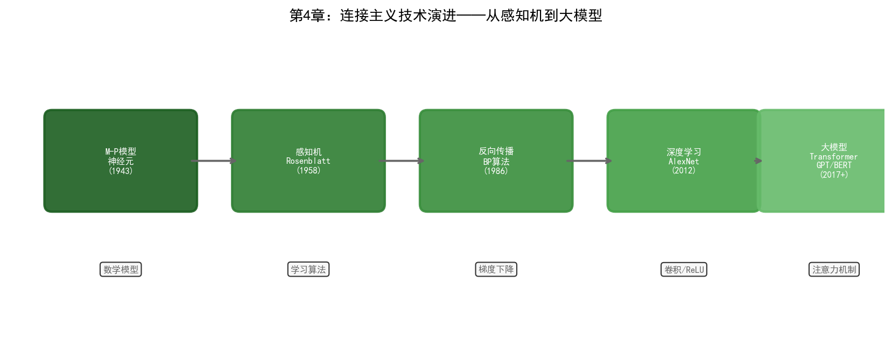

# 第4章 连接主义——从感知机到深度学习

## 4.1 哲学根源：经验主义与脑科学

1943年，神经生理学家沃伦·麦卡洛克（Warren McCulloch）和数学家沃尔特·皮茨（Walter Pitts）发表了一篇题为《神经活动中内在思想的逻辑演算》的论文。他们证明了一个看似简单的命题：如果将神经元建模为一个二值开关——当输入的加权和超过阈值时"发放"（输出1），否则"静默"（输出0）——那么由足够多这样的神经元组成的网络可以表达任何逻辑函数。

这篇论文同时连接了两个世界。在生物学层面，它提供了大脑信息处理的一种简化模型。在数学层面，它证明了神经网络具有通用计算能力。麦卡洛克-皮茨神经元模型虽然极其简化——真实的生物神经元要复杂得多——但它确立了连接主义的基本范式：**智能源于大量简单单元之间的连接**。

1949年，加拿大心理学家唐纳德·赫布（Donald Hebb）出版了《行为的组织》一书，提出了一个后来被称为"Hebb学习律"的原理：

> "当两个神经元同时发放时，它们之间的连接会增强。"

这句话被概括为"cells that fire together, wire together"（一起发放的细胞会连接在一起）。赫布学习律是所有无监督学习算法的祖先——它描述了神经网络如何在没有外部标签的情况下，仅通过内部神经元的协同活动来学习结构。

连接主义的哲学基础是经验主义：知识不是先天存在于规则中的（如符号主义所主张），而是从经验数据中学习得来的。大脑不是一个预装了规则的推理引擎，而是一个通过调整突触连接权重来适应环境的自适应系统。这个立场直接对立于符号主义的理性主义传统。

## 4.2 核心思想

连接主义的核心思想可以分解为三个层次。

### 分布式表示

在符号主义中，一个概念对应一个符号——"缺陷类型A"是一个离散的标签。在连接主义中，一个概念由多个神经元的活动模式共同表示——"缺陷类型A"可能是神经网络某一层中100个神经元的激活值向量 `[0.8, 0.1, 0.6, ..., 0.3]`。

分布式表示的优势在于泛化能力。两个相似的概念在向量空间中距离相近，因此学会识别"裂纹缺陷"的网络可以部分迁移到识别"划痕缺陷"上——因为两者的表示向量在高维空间中有大量重叠的维度。而符号系统中的"裂纹"和"划痕"是完全不同的符号，不存在天然的相似性度量。

### 从数据中学习

连接主义不要求人类预先编码知识。神经网络通过优化连接权重来最小化预测误差——这个过程就是"学习"。给定输入-输出对（训练数据），网络通过反向传播算法自动调整内部参数，使得预测输出逐渐逼近真实输出。

这意味着连接主义系统可以从海量历史数据中自动提取模式，而不需要人工逐条编写规则。在晶圆厂的场景中，这一点至关重要：一个深度学习模型可以从数百万张缺陷图像中自动学习区分数百种缺陷类型的视觉特征，而用符号主义的规则来描述"什么是裂纹"的视觉特征几乎不可能。

### 涌现能力

当神经网络规模足够大、训练数据足够丰富时，会出现训练过程中未曾显式教授的能力。GPT-3在训练时只看了"给定前文预测下一个词"的任务，但它学会了几十种语言的翻译、多种编程语言的代码生成、简单数学推理——这些能力从未在训练目标中被显式定义。

涌现能力是连接主义最令人兴奋也最令人不安的特性。令人兴奋是因为它暗示着规模本身可能是一种突破——更大的模型可能解锁我们尚未预见的能力。令人不安是因为我们无法精确预测某个规模的模型会涌现什么能力，也无法完全解释这些能力是如何产生的。

## 4.3 技术演进脉络

### 感知机时代（1958–1969）

1958年，弗兰克·罗森布拉特（Frank Rosenblatt）在康奈尔航空实验室发明了感知机（Perceptron）。感知机是一个单层神经网络，用阈值激活函数对输入的加权求和做二分类。罗森布拉特在IBM 704计算机上模拟了一个有400个光感受器的感知机，让它学习区分标有"左移"和"右移"的图像。

《纽约时报》在1958年的报道中写道："[感知机]是海军未来能够行走、说话、看视、写字、自我复制并意识到自身存在的计算机的胚胎。"这种乐观情绪与达特茅斯会议后的AI热潮如出一辙。

1960年，伯纳德·维德罗（Bernard Widrow）和特德·霍夫（Ted Hoff）发明了ADALINE（Adaptive Linear Neuron），使用线性激活函数和LMS（最小均方）学习算法。ADALINE的一个关键改进是引入了连续可微的损失函数——这使得梯度下降可以直接应用。维德罗和霍夫的LMS算法至今仍是信号处理和自适应滤波的基础。

1969年，马文·明斯基和西摩·帕珀特（Seymour Papert）出版了《感知机》一书，对单层感知机的能力做了严格的数学分析。书中证明了一个致命的局限：单层感知机无法学习异或（XOR）函数——即无法对线性不可分的数据做分类。XOR问题看似简单（只有四种输入组合），但它证明了单层网络的根本局限。

明斯基和帕珀特的批判是否导致了连接主义的"寒冬"，在AI史学界有争议。但事实是：从1969年到1986年，神经网络研究几乎停滞。尽管多层网络理论上可以解决XOR问题（只要加一个隐藏层），但当时没有有效的训练多层网络的方法。

### 反向传播与多层网络（1986–2006）

1986年，鲁梅尔哈特、辛顿和威廉姆斯在《自然》杂志上发表了反向传播算法的系统阐述。反向传播通过链式法则将输出端的误差逐层传播回输入端，计算每个权重对误差的贡献（梯度），然后用梯度下降调整权重。这个算法使得训练多层神经网络成为可能——多层网络可以学习任意复杂的非线性映射，包括XOR。

反向传播的重新发现引发了连接主义的短暂复兴。1989年，杨立昆（Yann LeCun）在贝尔实验室开发了LeNet——一个用于手写邮政编码识别的卷积神经网络。LeNet在美国邮政系统中达到了实用的识别准确率，成为第一个在工业场景中成功部署的深度学习系统。

LeNet的核心创新是卷积层——通过局部感受野和权重共享，大幅减少了参数数量，使得网络可以高效处理图像数据。卷积操作的本质是"在图像上滑动一个小型特征检测器"——这在生物学上对应视觉皮层简单细胞的工作方式。

1997年，塞普·霍赫赖特（Sepp Hochreiter）和于尔根·施密德胡伯（Jürgen Schmidhuber）发表了长短期记忆网络（LSTM）。LSTM解决了普通RNN在处理长序列时的梯度消失问题——通过引入门控机制（输入门、遗忘门、输出门），LSTM可以选择性地保留或遗忘信息，从而在数百个时间步长之后仍能保持有效梯度。LSTM后来在语音识别、机器翻译等序列任务中取得了突破性成果。

但这个时期，连接主义仍然是AI的边缘流派。SVM、随机森林等统计学习方法在大多数任务上表现更好且更容易训练。神经网络需要大量的标注数据和强大的算力——两者在当时都极为稀缺。辛顿在多伦多大学的研究组几乎是坚持深度学习研究的最后阵地。

### 深度学习革命（2006–2017）

2006年，辛顿发表了关于深度信念网络（Deep Belief Networks, DBN）的论文。DBN通过逐层无监督预训练来初始化网络权重，然后进行有监督的微调。这种"预训练-微调"策略解决了深层网络难以从随机初始化开始训练的问题。更重要的是，这篇论文重新定义了"深度学习"这个术语——之前人们说"神经网络"或"多层感知机"，辛顿让"深度"成为了一个有技术含义的词：层数足够多的网络。

2012年是连接主义历史上最具转折意义的一年。AlexNet在ImageNet竞赛中以15.3%的错误率碾压了第二名的26.2%——领先超过10个百分点。AlexNet的成功因素在第二章已经讨论过（数据、算力、ReLU激活函数），这里关注它对行业的影响。

AlexNet之后，深度学习的研究和应用进入了爆发期。每年都有新的架构和方法出现：

2014年，伊恩·古德费洛（Ian Goodfellow）提出了生成对抗网络（GAN）。GAN由生成器和判别器两个网络组成——生成器试图生成逼真的假数据，判别器试图区分真假。两个网络在对抗中共同进化，最终生成器可以产生以假乱真的图像。GAN后来被用于数据增强——在半导体制造中，当某种缺陷类型的样本不足时，GAN可以生成合成缺陷图像来补充训练集。

2015年，何恺明等人提出了残差网络（ResNet）。ResNet引入了"跳跃连接"（skip connection）——将输入直接加到若干层之后的输出上，使得梯度可以通过跳跃路径直接传播到浅层。这个看似简单的改动解决了超深网络（上百层）的梯度消失问题。ResNet可以训练到152层甚至更深，在ImageNet上达到了3.57%的错误率——首次超越人类水平（约5%）。

### Transformer 时代（2017 至今）

2017年，Google的Ashish Vaswani等人在论文《Attention is All You Need》中提出了Transformer架构。Transformer完全抛弃了RNN的循环结构和CNN的卷积操作，仅依赖自注意力机制来建模序列中元素之间的关系。

自注意力的核心思想可以用一句话概括：序列中的每个位置都"看"一遍所有其他位置，根据相关性分配注意力权重，然后对所有位置的加权和做聚合。这种全局视野使得Transformer不受序列长度的限制——RNN需要逐步处理序列，距离越远的元素之间的信息传递越困难；Transformer中任何两个位置之间的"距离"都是1。

Transformer的影响远超自然语言处理的范畴。它的变体被应用于几乎所有序列建模任务：

- **Vision Transformer (ViT)**：将图像切分为小块（patch），像处理文字序列一样处理图像块，在图像分类任务上达到了与CNN相当甚至更好的性能
- **Time-Series Transformer**：在时间序列预测中应用注意力机制，适用于设备传感器数据分析
- **Graph Transformer**：将注意力机制扩展到图结构数据，可用于知识图谱上的推理

2018年，Google发布了BERT（Bidirectional Encoder Representations from Transformers），通过掩码语言建模任务进行预训练——随机遮挡输入中的一些词，让模型根据上下文预测被遮挡的词。BERT在11项自然语言理解任务上刷新了记录。

OpenAI选择了另一个方向——Decoder-only架构。GPT系列通过"给定前文预测下一个词"的自回归任务进行预训练。当模型规模和数据量足够大时（GPT-3的1750亿参数），这种简单的预测任务催生了前文所述的涌现能力。

## 4.4 当前技术框架

### CNN（卷积神经网络）

CNN的核心组件包括卷积层（用可学习的卷积核提取局部特征）、池化层（降低空间分辨率并提供平移不变性）和全连接层（将特征映射到输出空间）。

经典CNN架构演进：

| 架构 | 年份 | 关键创新 | 参数量 |
| --- | --- | --- | --- |
| LeNet-5 | 1998 | 第一个实用的CNN | 60K |
| AlexNet | 2012 | ReLU + Dropout + GPU训练 | 60M |
| VGG-16 | 2014 | 统一3x3卷积核，极深堆叠 | 138M |
| ResNet-152 | 2015 | 残差连接，突破深度限制 | 60M |
| EfficientNet | 2019 | 复合缩放，效率最优化 | 5M-66M |

在半导体制造中，CNN最直接的应用是缺陷检测——晶圆缺陷的视觉特征（裂纹、颗粒、划痕、腐蚀）天然适合卷积操作提取。传统的自动缺陷分类（ADC）系统依赖手工设计的特征（如缺陷的面积、圆度、对比度），而CNN可以从原始图像中端到端学习特征表示，在复杂缺陷模式上的准确率显著优于传统方法。

### RNN/LSTM/GRU

循环神经网络（RNN）通过在时间步之间共享参数和传递隐状态来处理变长序列。但标准RNN在长序列上存在梯度消失/爆炸问题。

LSTM通过三个门控机制解决了这个问题：

- **遗忘门**：决定从记忆中丢弃什么信息
- **输入门**：决定将什么新信息写入记忆
- **输出门**：决定基于当前记忆输出什么

GRU（Gated Recurrent Unit）是LSTM的简化版本，将遗忘门和输入门合并为更新门，参数更少、训练更快，在许多任务上性能与LSTM相当。

在半导体制造中，LSTM/GRU最自然的应用是设备传感器的时序数据分析。一台刻蚀机在运行过程中持续产生温度、压力、RF功率、气体流量等时序数据。LSTM可以学习这些参数的正常波动模式，当某个参数序列偏离正常模式时触发异常预警。这种基于时序模式的预测性维护比传统的阈值告警更加灵敏——阈值告警只能在参数越限时报警，而LSTM可以在参数趋势出现异常但尚未越限时就发出预警。

### Transformer 与 Attention

Transformer架构根据任务不同有三种变体：

- **Encoder-only（BERT系列）**：适合理解类任务——分类、序列标注、相似度计算
- **Decoder-only（GPT系列）**：适合生成类任务——文本生成、对话、代码补全
- **Encoder-Decoder（T5、BART系列）**：适合序列到序列任务——翻译、摘要

自注意力机制的计算复杂度是 $O(n^2)$（n为序列长度），这限制了Transformer处理超长序列的能力。后续的改进如Linformer、Longformer、FlashAttention等从不同角度降低了注意力计算的开销。

在半导体场景中，Transformer的潜力主要体现在两个方向。第一，多模态融合——将晶圆图像（视觉）、传感器时序数据（时序）、工艺参数（表格）和文本报告（语言）统一为序列输入Transformer，实现多模态联合分析。第二，作为LLM的基础架构，支撑晶圆厂中的智能问答和报告生成应用（第十二章详述）。

### 预训练-微调范式

当代连接主义的工程范式可以概括为"预训练-微调"（Pre-training + Fine-tuning）：

1. **预训练**：在海量无标注数据上训练大规模模型，学习通用的特征表示或语言能力
2. **微调**：在特定任务的小量标注数据上调整模型参数，使模型适应具体应用

这个范式在半导体制造中面临独特的挑战。预训练通常使用公开数据集（ImageNet、Common Crawl等），这些数据与晶圆厂的工艺数据分布差异巨大。一个在ImageNet上预训练的CNN可以直接微调用于晶圆缺陷检测——因为底层视觉特征（边缘、纹理、形状）是通用的。但一个在通用文本上预训练的LLM需要大量领域适应才能理解工艺规范和缺陷分析报告。

解决这个问题的技术路径包括：

- **领域预训练**：在半导体相关文献和工艺文档上继续预训练，注入领域知识
- **RAG（检索增强生成）**：不修改模型参数，而是将晶圆厂文档作为外部知识库，LLM在生成回答时检索相关文档作为上下文
- **参数高效微调（PEFT）**：如LoRA，只训练少量适配参数，避免在少量标注数据上全量微调导致的过拟合

## 4.5 优势与局限

### 优势

**模式识别能力**。连接主义在从高维数据中提取模式方面无可匹敌。无论是图像中的缺陷特征、时序信号中的异常模式、还是文本中的语义关系，深度学习模型都能自动学习特征表示，而无需人工设计。

**端到端学习**。传统机器学习需要将问题分解为特征工程、模型训练、后处理等多个阶段，每个阶段需要独立的专家知识。深度学习可以将从原始输入到最终输出的整个映射用单一网络建模——输入晶圆图像，直接输出缺陷类型和位置，不需要中间的人工特征提取步骤。

**泛化与迁移**。预训练模型学到的通用特征可以迁移到不同但相关的任务上。一个在晶圆图A上训练的缺陷分类模型，经过少量样本的微调就能适应晶圆图B的缺陷模式——这在需要快速适配新工艺节点的NPI阶段极为宝贵。

**持续改进**。神经网络随着数据积累而持续提升性能——训练数据越多，模型越准。这种数据飞轮效应使得先部署AI的晶圆厂能持续积累数据优势。

### 局限

**黑箱性**。深度学习模型的决策过程不透明——它给出"这个缺陷是裂纹"的判断，但不解释"依据图像的哪些特征做出的判断"。可解释AI（XAI）技术如Grad-CAM、SHAP可以部分揭示模型关注的区域和特征，但远未达到符号推理那样的透明度。在晶圆厂中，工程师需要理解AI的判断逻辑才能信任并执行其建议——"系统说这批晶圆有问题"不够，工程师需要知道"为什么有问题、问题出在哪里"。

**数据依赖**。深度学习模型需要大量标注数据才能训练。在晶圆厂中，标注数据极其昂贵——每张缺陷图像需要经验丰富的工程师人工分类，而罕见缺陷类型的样本数量可能不足以训练可靠的模型。少样本学习和数据增强技术可以缓解这个问题，但无法完全消除数据依赖。

**分布偏移**。当训练数据和实际部署数据的分布不一致时，模型性能会急剧下降。一座晶圆厂从5nm升级到3nm后，原本训练好的缺陷检测模型可能不再适用——因为3nm的缺陷模式与5nm存在显著差异。模型需要在新节点的数据上重新训练或微调，这个过程需要时间和数据积累。

**对抗脆弱性**。深度学习模型对输入的微小扰动极为敏感——在晶圆图像上添加人眼不可见的噪声可能导致模型将正常晶圆误判为有缺陷。在安全关键的制造场景中，这种脆弱性需要通过对抗训练等手段加以缓解。

**计算成本**。训练大型深度学习模型需要大量GPU算力。三星的AI Megafactory据报道使用了约5万块GPU——这个规模的算力投入对大多数晶圆厂来说是不可承受的。即使是推理阶段，实时缺陷检测也需要在产线上部署GPU服务器，增加了基础设施成本。

### 与符号主义的互补

连接主义的局限恰好是符号主义的优势所在，反之亦然。连接主义擅长感知和模式识别但缺乏可解释性；符号主义擅长推理和解释但无法处理感知数据。在半导体晶圆厂的实际应用中，两者往往需要配合使用——连接主义模型从原始数据中提取信息（识别缺陷类型），符号系统基于这些信息进行推理（根据缺陷类型推断根因和修正措施）。第四章和第三章的交叉，将在第四部分的具体应用中展开。
