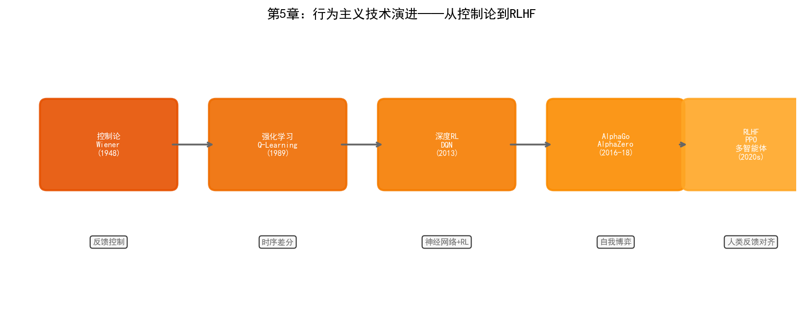

# 第5章 行为主义——从控制论到强化学习

## 5.1 哲学根源：控制论与进化论

1948年，麻省理工学院数学家诺伯特·维纳（Norbert Wiener）出版了《控制论：或关于在动物和机器中控制和通讯的科学》。控制论（Cybernetics）这个词来源于希腊语kybernetes——"舵手"。维纳用这个词来概括一个普遍原理：**通过反馈来实现目标导向的行为**。

维纳的控制论受到二战期间防空火炮自动瞄准问题的启发。火炮需要预测飞机的未来位置来提前瞄准，维纳设计了基于统计预测的滤波器来实现这一目标。在这个过程中他意识到，预测-行动-反馈的闭环不仅在工程系统中存在，也是生物体适应环境的基本机制——生物体通过感知环境、做出行动、接收反馈来调整未来的行为。

与控制论平行发展的是心理学中的行为主义流派。B.F.斯金纳（B.F. Skinner）在1930年代提出了操作性条件反射理论：行为的频率由其后果决定——带来奖励的行为会增加，带来惩罚的行为会减少。斯金纳的"斯金纳箱"实验展示了这一原理：老鼠在箱中偶然按下杠杆获得食物后，会越来越频繁地按压杠杆。

控制论和行为主义共同构成了行为主义AI的哲学基础：**智能不是内嵌的规则（反对符号主义），也不是预先训练的连接权重（补充连接主义），而是在与环境的持续交互中通过反馈不断演化的行为策略**。

这个视角与进化论高度一致——生物智能不是被设计的，而是通过变异、选择和遗传在环境中演化出来的。行为主义AI继承了这一思路：不试图从内部定义"什么是好的决策"，而是让智能体在环境中试错，通过环境反馈来发现有效的行为策略。

## 5.2 核心思想

行为主义AI可以用一个循环来概括：**感知环境 → 选择行动 → 获得反馈 → 更新策略**。

### 感知-行动循环

与符号主义的"推理"和连接主义的"前向传播"不同，行为主义的智能体始终处于一个闭环中。它不是一次性地处理输入然后输出结果，而是在时间维度上持续地感知、决策、行动和适应。一个在晶圆厂中运行的调度智能体不是在某个时刻"算出"最优排程，而是在生产过程中持续监控状态变化、做出调度决策、观察结果、并据此调整未来的调度策略。

### 奖励驱动学习

行为主义用"奖励"（Reward）作为学习的唯一信号。智能体不需要被告知"什么是对的"——它只需要知道"当前状态好不好"。通过不断试错，智能体学习到在不同状态下应该采取什么行动才能最大化长期累积奖励。

奖励驱动的学习范式有一个深远的优势：它不需要标注数据。符号主义需要人类编码规则，连接主义需要输入-输出对来训练，而行为主义只需要一个奖励函数来评估行为的好坏。在半导体制造中，"良率"本身就是一个天然的奖励信号——智能体不需要被告知"调高RF功率到300W"，它只需要知道"当前工艺参数下晶圆良率是多少"，然后自己探索能提高良率的参数组合。

### 试错与探索

行为主义的核心机制是试错。智能体在环境中尝试不同的行动，有些行动带来高回报（被强化），有些带来低回报（被抑制）。通过大量的试错，智能体逐渐收敛到最优策略。

试错学习面临一个基本矛盾——"探索与利用"（Exploration vs. Exploitation）的困境。智能体应该利用已知的高回报行动（利用），还是尝试未知行动以发现可能的更好策略（探索）？在晶圆厂的场景中，这个困境是真实的：用已知最优的工艺参数生产（利用）还是尝试新参数以发现更好的工艺窗口（探索）？前者安全但可能错失改进机会，后者可能带来突破但也可能导致良率下降。

## 5.3 技术演进脉络

### 控制论时代（1948–1980s）

维纳的控制论直接影响了一个技术领域：自动控制。PID控制器（比例-积分-微分控制器）是工业控制的基础工具——它通过反馈将系统输出维持在目标值附近。半导体制造中的R2R（Run-to-Run）控制本质上就是一种反馈控制：根据前一批次的测量结果调整下一批次的工艺参数，以补偿工艺漂移。

1954年，W.罗斯·阿什比（W. Ross Ashby）出版了《大脑设计》一书，提出了"超稳定系统"（ultrastable system）的概念——一个能够通过试错自发适应环境的系统。阿什比建造了一个"稳态器"（homeostat）装置来演示这一原理：当外部扰动改变了系统的平衡状态时，系统会自动调整内部参数直到重新达到稳定。这被一些学者视为第一个"学习机器"的实例。

### 强化学习的诞生（1980s–1990s）

1989年，剑桥大学的克里斯托弗·沃特金斯（Christopher Watkins）在博士论文中提出了Q-Learning算法。Q-Learning是强化学习中最基础也最重要的算法之一。

Q-Learning的核心思想是学习一个"Q函数" $Q(s, a)$，表示在状态 $s$ 下采取行动 $a$ 后预期能获得的长期累积奖励。Q函数通过贝尔曼方程迭代更新：

$$Q(s, a) \leftarrow Q(s, a) + \alpha [r + \gamma \max_{a'} Q(s', a') - Q(s, a)]$$

其中 $r$ 是即时奖励，$s'$ 是行动后的新状态，$\gamma$ 是折扣因子（控制对未来奖励的重视程度），$\alpha$ 是学习率。

一旦Q函数学习充分，最优策略就是简单地选择 $Q$ 值最大的行动：$\pi(s) = \arg\max_a Q(s, a)$。

1992年，杰拉德·特索罗（Gerald Tesauro）在IBM开发了TD-Gammon——一个通过自我对弈学习西洋双陆棋的程序。TD-Gammon使用时序差分学习（Temporal Difference Learning，TD-Learning，Q-Learning的一种变体），经过150万局自我对弈后达到了世界冠军水平。TD-Gammon是强化学习第一个在大规模复杂任务上达到专家水平的成功案例。

### 深度强化学习（2013–至今）

Q-Learning在状态空间较小时有效，但当状态空间巨大（如棋盘状态、图像输入）时，维护一个表格形式的Q函数不可行。深度学习的突破为强化学习提供了新的工具：用神经网络来近似Q函数。

2013年，DeepMind的Volodymyr Mnih等人发表了DQN（Deep Q-Network）论文，将CNN与Q-Learning结合。DQN用卷积神经网络从原始游戏画面中提取特征，输出每个可能行动的Q值。在49款Atari游戏中，DQN有29款达到了人类专业玩家水平或更高。

DQN的关键创新包括：

- **经验回放**（Experience Replay）：将交互数据存储在回放缓冲区中，随机采样小批量进行训练，打破了连续样本之间的时间相关性
- **目标网络**（Target Network）：使用一个延迟更新的网络来计算目标Q值，提高了训练稳定性

2016年，DeepMind的AlphaGo在首尔以4:1击败李世石。AlphaGo的技术架构是连接主义和行为主义的深度融合：深度神经网络用于策略评估（策略网络判断当前局面应该在哪里落子）和局面评估（价值网络判断当前局面的胜率），蒙特卡洛树搜索用于在搜索空间中探索。AlphaGo首先通过监督学习模仿人类专家棋谱，然后通过自我对弈强化学习不断提升。

2017年的AlphaZero更进了一步——完全抛弃人类棋谱，从零开始（"Zero"的含义）通过自我对弈学习。AlphaZero同时掌握了国际象棋、将棋和围棋，在所有棋类上都超越了此前的最强AI。AlphaZero的成功证明了一个深刻的观点：当环境有明确的胜负规则时，强化学习可以在没有任何人类先验知识的情况下发现超越人类的策略。

2019年的MuZero进一步摆脱了对环境规则模型的依赖。AlphaZero需要知道游戏的规则（如围棋的合法落子位置），MuZero不需要——它通过学习环境的内部模型来预测状态转移，使得同一个算法可以应用于没有已知规则模型的任务。

### 走向实用（2020 至今）

纯在线强化学习（智能体在真实环境中试错）在工业场景中难以直接应用——在晶圆厂中用试错来探索工艺参数意味着可能报废整批晶圆。因此，近年来的研究重心转向了更实用的方向：

**离线强化学习**（Offline RL）：只从历史数据中学习，不需要在环境中实际交互。智能体从已经收集的交互记录（如工艺日志、参数调整记录和对应的良率结果）中学习最优策略，而不是在真实环境中试错。这使得强化学习可以在不干扰生产的情况下利用现有数据。

**决策Transformer**（Decision Transformer）：将强化学习重新表述为序列建模问题[102]。将状态-行动-奖励三元组作为序列输入Transformer，让模型学习在给定目标回报的情况下生成行动序列。这种方法可以直接利用LLM的预训练能力。

**模型预测控制**（Model-Based RL）：先学习环境的动力学模型（给定当前状态和行动，预测下一状态和奖励），然后在学到的模型上进行规划和优化。在晶圆厂中，可以先构建工艺的数字孪生模型，在数字孪生中进行强化学习的探索和训练，然后将学到的策略部署到真实产线。

## 5.4 当前技术框架

强化学习算法可以根据学习对象的不同分为三大类。

### 基于价值的方法（Value-Based）

基于价值的方法学习状态-行动价值函数 $Q(s,a)$，然后从中推导策略。DQN及其改进是这一类方法的代表：

| 算法 | 关键改进 |
| --- | --- |
| DQN | CNN + Q-Learning + 经验回放 + 目标网络 |
| Double DQN | 解决Q值过估计问题 |
| Dueling DQN | 分离状态价值和动作优势的建模 |
| Rainbow | 综合多种DQN改进 |
| Conservative Q-Learning (CQL)[101] | 离线RL，防止对分布外动作的过估计 |

### 基于策略的方法（Policy-Based）

基于策略的方法直接参数化策略 $\pi_\theta(a|s)$，通过梯度上升最大化期望回报。REINFORCE是最基础的策略梯度算法，但其方差大、训练不稳定。后续改进包括：

| 算法 | 关键改进 |
| --- | --- |
| TRPO | 信赖域约束，保证策略更新幅度可控 |
| PPO | 裁剪目标函数，TRPO的简化版，工业界最常用 |
| SAC | 最大熵强化学习，鼓励探索 |

PPO（Proximal Policy Optimization）是目前工业界应用最广泛的强化学习算法。OpenAI在训练机器手解魔方、训练人形机器人行走等任务中都使用了PPO。PPO的吸引力在于它平衡了训练稳定性和样本效率——通过限制策略更新的幅度，避免了"学太快导致崩溃"的问题。

### Actor-Critic 方法

Actor-Critic结合了价值方法和策略方法的优点：Actor（策略网络）负责选择行动，Critic（价值网络）负责评估Actor的选择好不好。Critic的评估信号指导Actor的改进方向，Actor的行动数据为Critic提供训练样本。

| 算法 | 特点 |
| --- | --- |
| A2C / A3C | 同步/异步的Actor-Critic，A3C通过多个并行环境加速训练 |
| DDPG | 用于连续动作空间的Actor-Critic |
| TD3 | DDPG的改进，解决Q值过估计和方差问题 |
| SAC | 最大熵框架，在利用和探索之间自适应平衡 |

### 多智能体强化学习（MARL）

当多个智能体在同一环境中交互时，问题变得复杂——每个智能体的最优策略取决于其他智能体的策略，形成博弈关系。多智能体强化学习（Multi-Agent RL, MARL）研究多智能体场景下的学习和协调。

MARL在半导体晶圆厂中有天然的应用场景。一座晶圆厂有数百台设备、多个工艺步骤在并行运行，每个设备或工艺段可以视为一个智能体。PID、MFG、PE/EE三个部门的目标有时冲突（如制造部要产能最大化，但工艺部要质量最优化），多智能体系统需要学会在这些相互竞争的目标之间找到平衡。

主要MARL框架包括：

- **独立Q学习**（IQL）：每个智能体独立学习，忽略其他智能体的存在。简单但可能不稳定
- **MAPPO**：PPO的多智能体扩展，集中式训练、分散式执行
- **QMIX**：用混合网络建模联合Q值，假设智能体之间的贡献是单调的

## 5.5 优势与局限

### 优势

**序贯决策优化**。强化学习天然适合需要多步决策才能达到目标的任务。工艺参数优化不是一次性调整——调整一个参数会影响后续几十步的工艺结果，需要在时间维度上规划最优的调整序列。强化学习的折扣累积奖励机制使得它可以在"当前步骤的奖励"和"未来步骤的奖励"之间做权衡。

**无需标注数据**。强化学习只需要环境反馈（奖励信号），不需要输入-输出对。在晶圆厂中，良率数据是天然存在的——不需要人工标注"这个参数组合好还是不好"，只需要看这批晶圆的良率结果。

**自适应能力**。强化学习智能体可以在环境变化时持续适应。当机台老化导致工艺参数漂移时，基于RL的R2R控制器可以自动调整补偿策略，而不需要人工重新调参。

**超越人类策略的可能**。AlphaZero在棋类中发现的策略被人类棋手评价为"超越了此前所有人类的理解"。在工艺优化中，RL可能在参数空间中发现人类工程师从未尝试过的组合——这些组合可能在传统经验中被认为"不合理"，但实际上可能带来更好的工艺结果。

### 局限

**样本效率极低**。这是强化学习最致命的弱点。AlphaGo通过三千万局自我对弈才达到世界冠军水平——这在真实晶圆厂中完全不可行（不能让产线运行三千万批晶圆来学习）。离线RL和模型预测控制是缓解这个问题的方向，但样本效率仍然是RL在工业落地的最大障碍。

**奖励函数设计困难**。在棋类游戏中，奖励是明确的——赢为+1，输为-1。但在晶圆厂中，奖励函数的设计极其复杂。"良率"不是一个简单的标量——短期良率和长期良率可能冲突（某参数调整短期内提升良率但加速设备老化导致长期良率下降）；不同产品的良率权重不同（高价值产品应赋予更高权重）；时间维度上需要平衡即时奖励和长期奖励。一个设计不当的奖励函数会导致智能体学到"投机取巧"的策略——比如为了降低报废率而降低产量标准。

**仿真到现实的鸿沟**（Sim-to-Real Gap）。由于样本效率问题，大多数RL在工业场景中的应用需要在仿真环境中训练，然后部署到现实。但仿真模型永远不可能完全精确——如果仿真器遗漏了某些物理效应，在仿真中训练的最优策略可能在现实中失效甚至有害。数字孪生技术可以在一定程度上缩小这个鸿沟，但无法完全消除。

**安全性与约束**。强化学习的探索本质决定了它需要"犯错"才能学习。在晶圆厂中，探索意味着尝试未知的工艺参数组合——这可能导致报废、设备损坏甚至安全事故。安全强化学习（Safe RL）试图在探索过程中保证安全约束，如在状态空间中定义"安全区域"并限制智能体只能在该区域内行动，但这又限制了探索的范围。

**多目标平衡困难**。晶圆厂的优化目标通常是多重的——良率、产能、成本、交付时间——且这些目标之间存在复杂的权衡。标准RL框架假设一个标量奖励函数，将多目标简化为加权和。但这种简化可能丢失重要的权衡信息——不同的利益相关者（工艺工程师、制造经理、设备工程师）对各个目标的优先级有不同看法。

### 三大流派的定位

到此，AI三大流派的技术框架已经展开。在进入晶圆厂的具体应用之前，让我们做一个简单的定位总结：

| 维度 | 符号主义 | 连接主义 | 行为主义 |
| --- | --- | --- | --- |
| 核心能力 | 知识组织与推理 | 模式识别与预测 | 序贯决策与优化 |
| 数据需求 | 低（需要专家知识） | 高（需要大量标注数据） | 中（需要环境交互） |
| 可解释性 | 强 | 弱 | 中 |
| 晶圆厂典型应用 | 根因推理、数据融合 | 缺陷检测、良率预测 | 工艺优化、智能调度 |
| 代表工具 | 知识图谱、Ontology | CNN、Transformer | PPO、SAC、MARL |

从下一部分开始，我们将进入晶圆厂的三大核心部门，看看这些技术如何在真实的工厂场景中落地。
