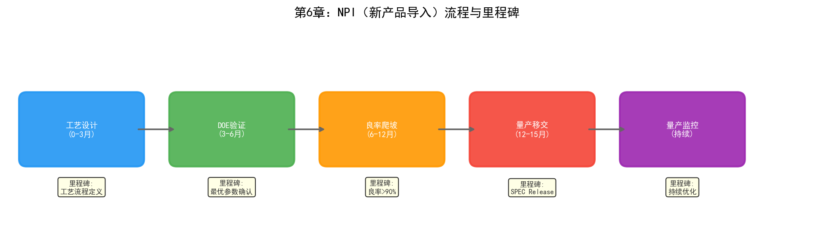
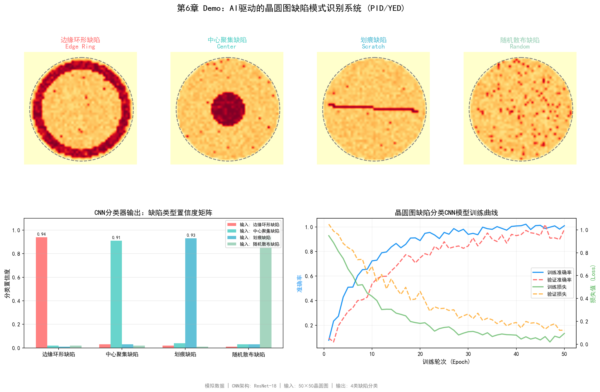

# 第6章 工艺整合（PID）与良率工程（YED）

## 6.1 部门定位与职责

在半导体晶圆厂的组织架构中，工艺整合（Process Integration Division, PID）和良率工程（Yield Engineering Division, YED）构成了质量保障体系的核心。两者分工不同但紧密耦合——PID负责"把工艺做对"，YED负责"确认做得对不对、为什么不对"。

### 工艺整合（PID）

PID的职责可以用一句话概括：确保从晶圆投入到产出的全流程工艺一致性。一片晶圆在3nm制程中要经过1200多道工艺步骤，涉及光刻、刻蚀、薄膜沉积、离子注入、化学机械抛光（CMP）、量测等数十种工艺模块。每个模块由不同的PE（制程工程师）负责优化，但模块之间的衔接——前一层的输出是否匹配后一层的输入要求——就是PID的职责。

PID工程师的工作类似于建筑结构工程师：不需要亲自浇筑每一根柱子（那是PE的工作），但需要确保所有柱子、梁、楼板之间的受力关系正确，整栋楼不会因为某个局部设计而坍塌。具体而言，PID负责：

- **工艺流程定义**：确定每个产品的工艺步骤序列、每步的目标参数和允差范围
- **工艺窗口设定**：为每个关键工艺步骤定义可接受的操作区间——参数在这个区间内，产品良率可以达标
- **跨模块协调**：当某个模块的工艺变更可能影响其他模块时，PID负责评估影响范围并协调解决方案
- **新产品导入（NPI）**：主导新工艺节点的开发流程，从试产到量产的全过程管理
- **工艺规格书（SPEC）维护**：定义和维护每道工序的规格标准，作为生产执行的依据

### 良率工程（YED）

如果说PID是"设计者"，YED就是"裁判和侦探"。YED的职责是监控、分析并提升良率——一片晶圆上能产出多少颗合格的芯片。

良率在半导体制造中有多个层级：

| 良率类型 | 定义 | 测试阶段 |
| --- | --- | --- |
| 晶圆良率（Wafer Yield / Line Yield） | 完整走完全流程的晶圆数 / 投入晶圆数 | 产线追踪 |
| 探针良率（Probing Yield / CP Yield） | CP测试中通过的芯片数 / 晶圆上总芯片数 | CP（晶圆级测试） |
| 终测良率（Final Yield / FT Yield） | FT测试中通过的芯片数 / CP通过芯片数 | FT（成品级测试） |
| 综合良率 | 上述各良率的乘积 | — |

YED工程师的日常工作包括：

- **良率监控**：每日/每批次跟踪良率数据，识别异常波动
- **缺陷分析**：通过缺陷检测设备（KLA等）收集缺陷数据，分析缺陷的类型、密度、空间分布
- **根因分析（RCA）**：当良率下降或缺陷率上升时，追溯问题到具体的工艺步骤和设备
- **晶圆图分析（Wafer Map Analysis）**：通过CP测试结果的空间分布模式（边缘缺陷、中心缺陷、簇状缺陷等）推断缺陷来源
- **良率提升项目**：系统性优化工艺参数以提升良率

## 6.2 核心业务流程

### 新产品导入（NPI）与工艺开发

NPI是晶圆厂中最复杂、最耗资源的流程。一个先进制程的NPI通常遵循以下阶段：

**第一阶段：工艺流程定义。** PID工程师根据产品设计规格（由设计公司提供的GDS文件），定义完整的工艺步骤序列。这个阶段需要确定每层用什么工艺模块（如这层金属层用铜互连还是铝互连）、关键参数的目标值、以及步骤之间的依赖关系。

**第二阶段：工艺窗口开发。** PE工程师在每个工艺模块内进行DOE（实验设计），寻找最优的工艺参数组合。PID工程师负责整合各模块的DOE结果，验证跨模块的兼容性——某个模块的最优参数可能在另一个模块中引发问题。

**第三阶段：试产。** 在工艺流程和参数初步确定后，进行小批量试产。试产晶圆经过全流程后进行CP和FT测试，评估良率。试产通常需要多轮迭代——每轮发现的问题都可能导致工艺参数调整甚至流程变更。

**第四阶段：良率爬坡（Yield Ramp）。** 试产验证通过后，逐步提升产量。良率爬坡是一个持续优化的过程——从试产良率（可能30%-50%）爬升到量产良率（通常要求90%以上）。爬坡速度直接决定了产品上市时间和投资回报周期。

**第五阶段：量产转移。** 良率达标后，工艺规格冻结，进入量产阶段。此后任何工艺变更都需要经过严格的工程变更控制（ECN/ECO）流程。

### 良率管理与缺陷分析

量产阶段的良率管理是一个持续的过程，核心是"监控-检测-分析-改进"的闭环。

**监控：** 每批次晶圆在关键工艺步骤后都会经过量测设备（如KLA的量测系统），记录CD（关键尺寸）、膜厚、套刻精度等参数。这些数据实时上传到SPC（统计过程控制）系统，当参数超出控制限（UCL/LCL）时触发告警。

**检测：** 在光刻后（ADI, After Develop Inspection）和刻蚀后（AEI, After Etch Inspection），晶圆经过缺陷检测设备扫描，记录缺陷的位置、大小和形态。在CP测试后，每片晶圆生成一张晶圆图——显示哪些位置的芯片通过了测试、哪些失败了。

**分析：** 当良率下降或缺陷率上升时，YED工程师需要进行根因分析。这个过程通常涉及：

- 缺陷分类：将检测到的缺陷按类型分类（颗粒、划痕、裂纹、腐蚀等）
- 空间模式分析：晶圆图上缺陷的分布模式暗示了不同的根因——边缘缺陷通常是设备边缘效应或装卸问题；中心缺陷可能是工艺均匀性问题；随机分布的颗粒缺陷可能来自洁净室环境
- 工艺参数关联：将缺陷数据与对应工艺步骤的设备参数做关联分析，找出异常参数
- 物理失效分析（PFA）：对失效的芯片进行切片、SEM/TEM观察，确定物理层面的失效机制

**改进：** 根据根因分析的结论，PE工程师调整工艺参数或进行设备维护，PID工程师更新工艺规格。改进效果通过后续批次的良率数据验证。

## 6.3 关键技术与方法

### 电性测试

电性测试是良率评估的最终判据，分为三个层级：

**WAT（Wafer Acceptance Test，晶圆接收测试）：** 在晶圆完成所有前道工艺后进行，测量测试键（Test Key，位于芯片之间的划片道上）的电性参数——如晶体管的阈值电压、饱和电流、漏电流、电容等。WAT不测试芯片功能，只测试工艺质量。WAT数据是评估工艺一致性的核心指标。

**CP（Circuit Probing，晶圆级测试）：** 用探针卡直接接触晶圆上每颗芯片的焊盘，进行功能测试。CP区分"良品"和"不良品"，不良品在后续封装前被淘汰。CP测试的时间成本很高——一片晶圆上有数千颗芯片，每颗芯片的完整功能测试可能需要数秒到数十秒，整片晶圆的CP测试可能需要数小时。

**FT（Final Test，成品测试）：** 在芯片封装后进行，测试封装后的成品在各种温度和电压条件下的功能和性能。FT是芯片出厂前的最后一道质量关。

三个层级的测试数据共同构成了良率的完整画像——WAT良率反映工艺基础质量，CP良率反映晶圆级功能合格率，FT良率反映封装后的最终合格率。

### 缺陷检测

缺陷检测是YED最重要的数据来源。现代晶圆厂的缺陷检测主要依赖两类设备：

**光学检测设备：** 如KLA的Surfscan系列，利用高分辨率光学成像扫描晶圆表面，通过比较相邻区域或与参考图像的差异来检测缺陷。光学检测速度快，适合全晶圆扫描，但分辨率有限（通常在0.1微米量级）。

**电子束检测设备：** 如KLA的eDR系列，利用电子束扫描晶圆表面，分辨率可达纳米级。电子束检测速度慢，通常用于光学检测发现可疑区域后的详细复查，或者关键工艺步骤后的高精度检测。

检测设备输出的是缺陷列表——每个缺陷的位置坐标、大小、形态参数。这些原始数据需要经过自动缺陷分类（ADC）系统分类为具体的缺陷类型，才能用于后续的根因分析。

### FDC（Fault Detection & Classification）

FDC系统是连接YED和EE/PE的关键数据桥梁。FDC实时采集设备在运行过程中的传感器数据（温度、压力、气体流量、RF功率、时间序列等），通过两种方式工作：

**故障检测（FD）：** 监控设备参数是否在正常范围内。传统的FD使用SPC控制图——当参数超出控制限时触发告警。更先进的FD使用多元统计方法（如PCA、T2控制图）来监控多个参数的联合状态。

**故障分类（FC）：** 当检测到异常时，将异常分类为具体的故障类型。传统FC依赖规则匹配——"如果温度先升后降且压力波动，则分类为气体泄漏"。深度学习模型在FC中的应用正在增长——CNN可以从时序信号图中识别异常模式，准确率优于规则方法。

### 工艺窗口分析

工艺窗口是PID工程师最关心的概念之一。简单来说，工艺窗口是工艺参数的"安全操作区间"——在这个区间内，工艺结果满足规格要求。工艺窗口越大，工艺越健壮、对设备波动和参数漂移的容忍度越高。

工艺窗口分析通常通过DOE（实验设计）来确定：

1. 选择关键工艺参数（如刻蚀的RF功率、腔体压力、气体比例）
2. 设计实验矩阵（如中心复合设计CCD），在各参数的高低水平组合下运行实验
3. 测量各实验条件下的工艺结果（如刻蚀速率、均匀性、选择比）
4. 建立工艺响应面模型（Response Surface Model），拟合参数与结果的关系
5. 在响应面上找到满足所有规格要求的参数空间——这就是工艺窗口

在先进制程中，工艺窗口极窄——3nm的CD控制要求在1-2纳米量级，而工艺参数的自然波动可能就在这个量级。这意味着即使参数在"正常"范围内，产品也可能不合格。工艺窗口的微小收窄都会显著增加控制难度和报废风险。

## 6.4 面临的挑战

### 工艺参数交互效应复杂

3nm制程的1200多道工序中，前后步骤的参数交互效应呈指数级增长。某一层CMP的抛光压力偏大0.5psi，可能导致两层后光刻的套刻精度超标，进而影响五层后的金属互连电阻——这种跨步骤的因果链路在传统单步工艺监控中完全不可见。

PID工程师面临的困境是：他们需要管理的不是一个步骤的参数，而是上千个步骤的参数之间的交互网络。传统的DOE方法只能在少数几个参数之间做局部优化——当参数维度超过10个时，DOE的实验次数就会爆炸。而实际工艺的参数维度往往在数十到数百个。

### 良率root cause定位困难

当良率下降时，YED工程师需要从海量数据中找到根因。一片晶圆的制造过程涉及数百台设备、上千道步骤、每步数十个参数——可能的根因组合是天文数字。

传统的RCA方法依赖工程师的经验和直觉：先看晶圆图的空间模式缩小范围，再看对应步骤的SPC数据找异常参数，必要时做PFA确认物理机制。这个过程通常需要数天甚至数周。在这段时间里，产线可能还在继续生产——如果根因是设备问题且未被发现，更多批次可能受影响。

英特尔在其白皮书中描述了这一挑战：RCA需要整合数十亿条异构生产数据，传统人工排查耗时数天。他们的ML系统将根因定位时长压缩到分钟级——这背后是连接主义（模式识别）和符号主义（知识推理）的结合。

### NPI周期压缩压力

先进制程的竞争本质上是时间竞争——谁先量产谁就能占据市场。但NPI周期的压缩受到物理规律的限制：每轮试产需要3-4个月的晶圆制造周期，而一轮试产通常只能验证一部分工艺假设。如果NPI需要10轮试产迭代，那就是3年以上的开发周期。

PID工程师需要在更少的试产轮次内收敛工艺——这意味着每一轮试产都必须获得尽可能多的信息。传统的OFAT（One Factor At A Time）实验方法效率极低，DOE虽然更高效但在高维参数空间中仍然不够。AI辅助的实验设计——如贝叶斯优化和强化学习——可以在已有数据的基础上预测最优的下一组实验参数，用更少的实验次数覆盖更大的参数空间。

## 6.5 实践研究：AI在PID/YED中的真实落地案例

### 英特尔：AI驱动的GFA自动检测系统

英特尔IT部门部署了一套基于机器学习、深度学习和图像处理的良率分析系统，用于自动检测晶圆图上的GFA（Gross Failure Area，大面积失效区域）。

传统流程中，良率工程师需要人工审查晶圆图，识别已知的失效模式（baseline pattern）。这个过程受限于人力资源——无法覆盖每一片晶圆。英特尔的AI系统实现了：

- **基线模式检测**：自动识别已知失效模式，准确率超过90%，覆盖100%的终测晶圆（此前人工只能抽检）
- **未知模式发现**：系统还能报告所有影响良率的模式及其严重程度——包括工程师此前未注意到的模式
- **前瞻式推送**：从被动"拉取"分析转为主动"推送"告警
- **内联检测前移**：英特尔在PoC中验证了内联检测（inline inspection）结合AI可以提前发现50%的晶圆减薄问题——比离线检测更早

这套系统的价值不仅在于效率提升，更在于**覆盖率的质变**——从抽检变为全检，使得偶发性良率问题不再因"没有被看到"而被遗漏。

### SK海力士/Gauss Labs：Panoptes虚拟量测系统

SK海力士投资的AI公司Gauss Labs开发了Panoptes虚拟量测（Virtual Metrology, VM）系统，2022年12月在SK海力士量产产线部署[91][92]。

虚拟量测的核心思路是：用设备传感器数据（温度、压力、气体流量等）预测晶圆的量测结果（膜厚、折射率等），无需实际测量。这使得"每片晶圆都有量测数据"成为可能——传统上只有抽样晶圆会被量测。

Panoptes VM的部署结果：

- 工艺变异降低21.5%（2022年12月部署时），到2024年2月进一步改善至29%
- 累计对超过5000万片晶圆进行了虚拟量测——相当于每秒超过一片
- 采用自适应在线模型（AOM）处理数据漂移问题——当设备老化或消耗件更换导致数据分布变化时，模型自动适配
- 从薄膜沉积扩展到多个工艺模块的高 volume manufacturing 虚拟量测

Gauss Labs还开发了Universal Denoiser，用AI去除CD-SEM图像的噪声——图像采集时间缩短到传统技术的1/4，预计将量测设备生产率提升42%。

### 美光（Micron）：Smart Sight智能制造系统

美光的Smart Sight是一个企业级AI制造系统，覆盖了从缺陷检测到工艺优化到质量管理的全链条。

美光公布的2016-2020年内部数据：

- 新产品上市时间缩短50%
- 产品报废率降低22%
- 质量问题解决速度提升50%
- 制造设备可用率提升4%
- 年劳动生产率增加100万工时

Smart Sight的具体应用包括：用计算机视觉对光刻相机图像进行自动缺陷分类——识别晶圆边缘微小孔洞、划痕、薄膜气泡等缺陷类型。美光还部署了基于ResNet-50的视觉模型检测晶圆/腔体放置错位，以及AI驱动的OCR缺陷检测——将扫描仪晶圆拒收率降至0.5%以下。

2025年，美光与Anthropic宣布多年合作，将Claude AI用于构建下一代"AI工厂"。

### Lam Research：Fabtex Yield Optimizer

Lam Research的Fabex Yield Optimizer是业界首个使用虚拟硅数字孪生（基于SEMulator3D）结合AI/ML推荐量测目标变更的工具。

两个NPI案例的结果：

- **案例一**：一家领先器件制造商在新产品导入HVM时，通过虚拟硅提前发现并修正系统性缺陷——节省了数月时间，实现了"首次即正确"的芯片交付。如果没有数字孪生，这些缺陷要到终测才能被发现，影响所有晶圆。
- **案例二**：在复杂3D结构中，消除了由多工艺步骤交互引起的顽固缺陷，且未引入新的系统性缺陷——提升了该缺陷模式的良率。

Fabtex的ROI模型：传统方法需要10轮硅片改进迭代，每轮9周；使用数字孪生后减少到5轮，每轮10周——总周期从约90周减少到约50周。

### NVIDIA：视觉基础模型用于晶圆缺陷分类

NVIDIA在2025年发布了基于视觉基础模型的半导体缺陷分类方案：

- **Cosmos Reason VLM**：晶圆级缺陷分类准确率超过96%（微调后），支持少样本学习、自然语言解释、交互式问答和自动标注
- **NV-DINOv2 VFM**：裸片级缺陷检测准确率达98.51%，大幅减少人工标注需求

这些模型的价值在于**通用性**——不需要为每种缺陷类型从头训练模型，而是通过少样本微调快速适配新工艺节点的缺陷模式。台积电已经在使用NVIDIA Metropolis和TAO Toolkit进行自动化缺陷检测。

### 行业工具生态

除了上述企业级案例，半导体行业的AI良率分析工具生态已经形成：

| 厂商 | 产品 | 功能 |
| --- | --- | --- |
| KLA | Klarity Defect / SSA / aiSIGHT | 实时偏移识别、缺陷签名自动检测与分类 |
| Applied Materials | AIx / ChamberAI / AppliedPRO | 实时工艺可视性、腔体级AI分析、数字工艺地图 |
| IKAS | Smart RCA | 多源数据融合的根因分析，RCA时间减少>80% |
| yieldWerx | Root Cause Knowledge Graphs | 知识图谱驱动的批次处置和RCA |
| Synopsys | DSO.ai / Silicon.da | RL驱动的芯片设计优化、硅片数据闭环 |

---

PID和YED是晶圆厂中数据最密集、分析最复杂的部门。它们面临的挑战——跨步骤因果推理、高维参数优化、海量数据根因分析——恰好是AI技术最能发挥价值的场景。上述案例表明，AI在PID/YED的应用已经从"实验性探索"进入"量产级部署"阶段——英特尔的GFA检测、SK海力士的虚拟量测、美光的Smart Sight都是覆盖全产线的系统性应用。第四部分将详细讨论符号主义、连接主义和行为主义分别在PID/YED中的应用。

## 6.6 Demo可视化：AI驱动的晶圆图缺陷模式识别系统

*Demo说明：上图展示了对四种典型晶圆缺陷模式（边缘环形、中心聚集、划痕、随机散布）的CNN分类结果。下左为分类置信度矩阵，下右为模型训练曲线。模拟脚本见 `demos/demo_ch6_wafer_defect.py`。*
