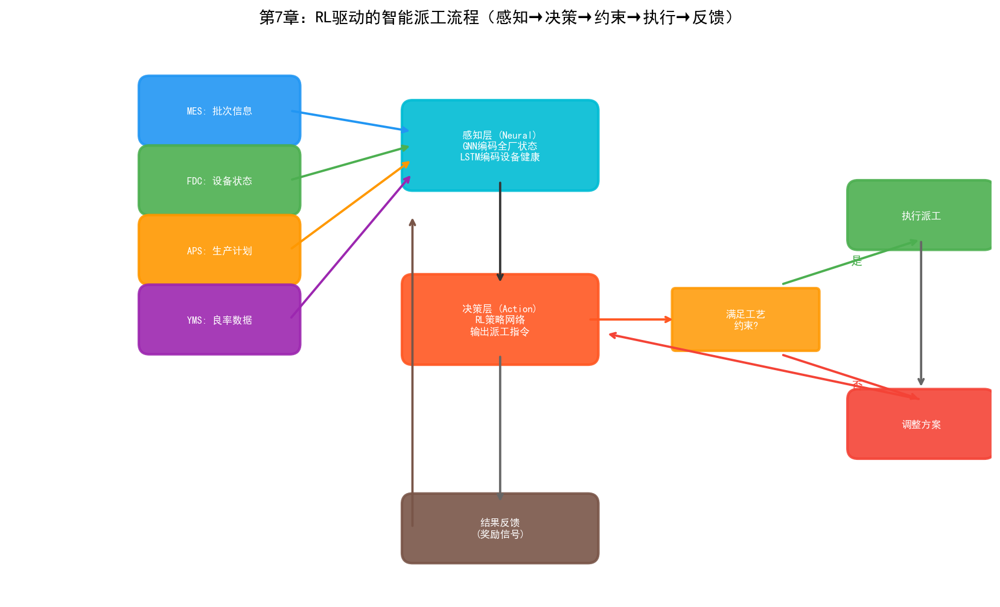
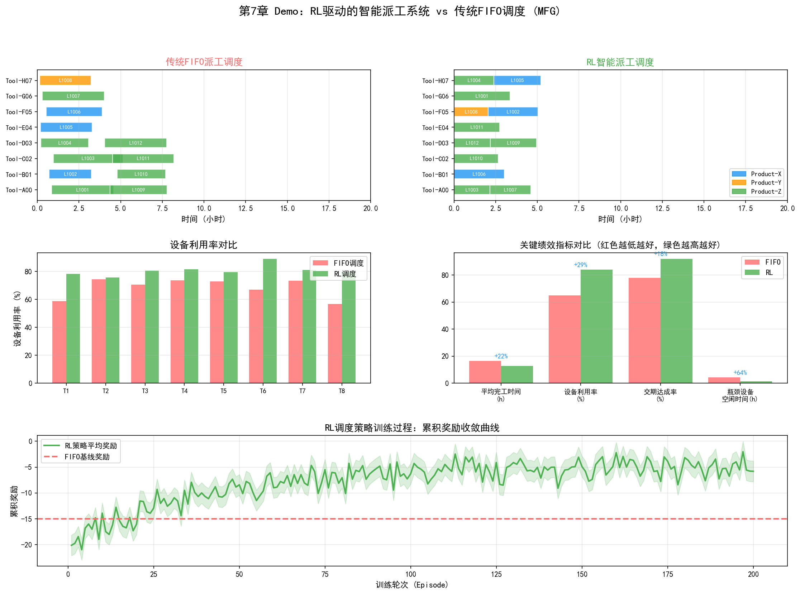

# 第7章 制造部（MFG）

## 7.1 部门定位与职责

制造部（Manufacturing, MFG）是晶圆厂中"让一切发生"的部门。如果说PID定义了"怎么制造"，PE/EE维护了"用什么制造"，那么MFG的职责就是"实际制造"——把晶圆从投入口送到产线上的每一台设备，按序完成上千道工序，最终把加工完成的晶圆送出产线。

这个看似简单的"搬运"工作，在半导体晶圆厂中却是世界上最复杂的调度问题之一。

### 与普通工厂调度的根本差异

半导体晶圆厂的调度有一个独特特征：**重入式流程（Reentrant Flow）**。在普通工厂中，产品沿产线单向流动——原料→加工A→加工B→加工C→成品。但在晶圆厂中，同一片晶圆需要反复经过同一组设备。一片3nm晶圆要经过80-120层光刻，每层光刻都需要光刻机——同一台EUV扫描仪在一批晶圆的制造周期内可能被同一片晶圆访问上百次。

重入式流程带来了一个普通工厂不存在的调度难题：在时刻T，同一台设备前可能同时有属于不同产品、不同批次、不同优先级、不同工艺步骤的晶圆在排队。设备应该先处理哪批？这个决策不仅影响当前批次的交期，还会通过连锁反应影响后续所有排队批次的等待时间。

### MFG的核心职责

- **生产排程与派工（Dispatching）**：决定每台设备下一批处理哪片晶圆
- **产能管理（Capacity Management）**：预测和规划设备产能，确保满足客户订单需求
- **在制品管理（WIP Management）**：监控产线上的在制品分布，避免局部积压或断料
- **异常处理**：设备宕机、工艺异常、紧急订单等突发情况下的调度调整
- **交期管理**：确保每个批次在承诺的交期内完成

## 7.2 核心业务流程

### 生产计划制定

生产计划分三个层级：

**长期规划（月-季度）：** 根据客户订单预测和产能评估，制定月度投片计划。这个层级主要关注产能与需求的匹配——是否有足够的设备满足订单？是否需要采购新设备或调整产品组合？长期规划通常由APS（高级排程系统）辅助完成。

**中期排程（周-月）：** 将月度投片计划分解为周计划，考虑设备维护窗口、产品切换时间、工程批次插入等因素。中期排程需要平衡多个目标——最大化设备利用率、最小化产品切换次数、满足不同客户的不同交期要求。

**实时派工（分钟-小时）：** 在产线运行过程中，实时决定每台设备下一批处理什么。这是MFG最核心的日常操作，由MES（制造执行系统）和派工规则引擎支持。

### 派工规则

派工规则决定了在有多批晶圆排队时设备的选择顺序。常见的派工规则包括：

| 规则 | 描述 | 适用场景 |
| --- | --- | --- |
| FIFO（先到先服务） | 按到达顺序处理 | 简单场景，不考虑优先级 |
| EDD（最早交期优先） | 优先处理交期最近的批次 | 交期敏感的代工厂 |
| SPT（最短加工时间优先） | 优先处理加工时间短的批次 | 减少平均等待时间 |
| CR（临界比率） | 剩余时间 / 剩余工序时间 | 综合考虑交期和进度 |
| LWN（最小WIP优先） | 优先处理WIP最少的工序段 | 平衡产线WIP分布 |

实际晶圆厂通常组合使用多种规则——基本规则是FIFO，但对紧急批次（Hot Lot）或工程批次（Engineering Lot）赋予高优先级插队。某些设备可能有特殊约束——如需要相同配方（Recipe）的批次连续处理以减少切换时间。

### 异常处理

晶圆厂的日常运行中，异常是常态而非例外。常见的异常包括：

- **设备宕机：** 某台关键设备突然故障。MFG需要立即调整派工，将受影响的批次路由到备用设备，同时重新计算对交期的影响
- **工艺异常：** 某批次在量测时发现参数超标。MFG需要暂停该批次后续步骤，等待PID/YED分析后再决定放行还是返工
- **紧急订单插入：** 客户临时插入高优先级订单。MFG需要在不打乱现有排程的前提下插入新批次
- **工程批次：** PID/PE需要运行实验批次（如新工艺验证）。工程批次通常数量少但优先级高，需要与正常生产批次协调

异常处理的效率直接决定了晶圆厂的响应能力——一个从设备宕机到恢复生产需要4小时的工厂，和一个只需要2小时的工厂，在年产能上的差异可能是数千片晶圆。

## 7.3 关键技术与方法

### MES（制造执行系统）

MES是晶圆厂运转的中枢神经系统。它追踪每一片晶圆在产线上的位置和状态，记录每批晶圆在每个工序的进出时间、使用的设备和参数、操作员信息等。MES的核心功能包括：

- **批次追踪（Lot Tracking）：** 实时记录每批晶圆的位置、状态、工艺进度
- **工艺路线管理（Route Management）：** 定义每批晶圆的工艺步骤序列
- **设备管理：** 监控设备状态（运行/空闲/维护/故障），管理设备配方（Recipe）
- **数据采集：** 自动采集设备运行参数和量测数据
- **派工指令：** 根据派工规则向操作员或自动化系统发出搬送和加工指令

MES的数据是晶圆厂最核心的数据资产之一——它记录了从晶圆投入到产出的完整历史。这些数据是后续良率分析、工艺优化和AI模型训练的基础。

### APS（高级排程系统）

APS在MES之上提供更高级的排程能力。传统的MES派工是"反应式"的——当设备空闲时根据当前排队情况选择下一批。APS是"预测式"的——它基于全产线的当前状态和未来计划，模拟未来数小时甚至数天的生产情况，提前识别瓶颈和冲突。

APS的核心是有限产能调度（Finite Capacity Scheduling）算法。与无限产能排程（假设设备产能无限，只按工艺顺序排产）不同，有限产能排程考虑每台设备的实际产能限制——如果某台设备24小时只能处理50批，APS不会安排超过50批的工件到该设备。

在先进晶圆厂中，APS通常需要处理：
- 数百台设备
- 数千批次同时在产线上流动
- 每批次的上千道工序
- 设备维护窗口和配方切换约束
- 多产品混合生产

这个调度问题的搜索空间是天文数字级的——即使是最强大的计算机也无法找到全局最优解。实际系统通常使用启发式方法（如遗传算法、模拟退火）或基于规则的方法来寻找"足够好"的近似最优解。

### 瓶颈分析（TOC理论）

约束理论（Theory of Constraints, TOC）是MFG分析产能瓶颈的核心框架。TOC的基本观点是：任何系统的产出都受限于其最薄弱的环节——瓶颈。优化非瓶颈环节不会提升系统总产出，只有优化瓶颈才能提升整体产能。

在晶圆厂中，瓶颈通常是某种关键设备——如EUV光刻机。一座3nm晶圆厂可能配备15台以上的EUV扫描仪，每台价值超过1.5亿美元。EUV设备的处理速度（Throughput，通常以WPH—Wafer Per Hour计量）决定了整条产线的产出上限。如果EUV设备因维护或故障停机1小时，整条产线的产出损失可能无法通过其他设备的加速来弥补。

瓶颈分析的关键实践包括：

- **识别瓶颈：** 通过设备利用率（OEE）数据找到利用率最高（瓶颈）的设备
- **最大化瓶颈利用率：** 确保瓶颈设备永远不"等料"——在瓶颈设备前维持适当的WIP缓冲
- **服从瓶颈：** 非瓶颈设备的排程应配合瓶颈设备的节奏——即使非瓶颈设备可以更快，也不应超前生产导致WIP堆积

### OEE（设备综合效率）

OEE是MFG衡量设备利用效率的核心指标：

$$OEE = 可用率 \times 性能率 \times 良率$$

- **可用率（Availability）：** 实际运行时间 / 计划运行时间。扣除设备故障和调整时间
- **性能率（Performance）：** 实际产出 / 理论产出。衡量设备运行速度是否达到设计产能
- **良率（Quality）：** 合格品 / 总产出。衡量设备加工质量

一座先进晶圆厂的OEE目标通常在80%-85%以上。OEE每提升1个百分点，在不增加设备投资的情况下相当于增加了1%的产能——对于一座投资200亿美元的工厂，这相当于每年数百万美元的额外收入。

## 7.4 面临的挑战

### 重入式产线的调度复杂性

重入式流程使得传统的调度算法几乎失效。在单向流程产线中，一个简单的FIFO规则就能产生不错的排程。但在重入式产线中，同一台设备上排队的晶圆可能处于完全不同的工艺阶段——有的刚完成第一层光刻，有的在做第八十层。选择先处理哪个不仅影响当前设备的利用率，还会通过后续工序的排队效应传播到整个产线。

这种复杂性使得晶圆厂调度被归类为NP-Hard问题——随着问题规模增长，精确求解的计算时间指数级增长。实际系统只能在"求解速度"和"解的质量"之间做妥协。

### 多品种混合生产

现代晶圆厂通常同时生产多种产品——不同的技术节点（28nm/14nm/7nm/3nm）、不同的产品类型（逻辑芯片/存储器/模拟芯片/射频芯片），甚至不同客户的定制工艺。每种产品有不同的工艺路线、不同的加工时间、不同的交期要求。

多品种混合带来的挑战包括：

- **配方切换：** 不同产品需要不同的设备配方（Recipe），切换配方需要时间（set-up time），频繁切换降低设备利用率
- **工艺路线差异：** 不同产品的工艺步骤序列不同，在同一设备上需要协调多种工艺路线的排程
- **优先级冲突：** 高价值产品的紧急订单与常规产品的稳定生产之间的优先级冲突

### 产能利用率与交期的平衡

MFG需要在两个目标之间持续平衡：最大化产能利用率（让设备不停机）和满足客户交期（按时交付）。这两个目标经常冲突——为了满足某个紧急订单的交期，可能需要中断某台设备的当前批次，切换配方来处理紧急批次，这降低了设备利用率。

在产能紧张时（如先进制程需求暴增），这个矛盾更加尖锐——所有客户都希望自己的订单优先，但物理产能有限。MFG需要在客户满意度、产能效率和利润最大化之间找到平衡点。

### 事件驱动的动态调整

晶圆厂的运行环境是高度动态的——设备故障、工艺异常、紧急订单、工程批次插入等事件随时发生。静态排程（在一天开始时排好全天计划）在实际运行中几乎无法维持——一个设备故障就可能打乱整条产线的排程。

MFG需要的是能够实时响应事件的动态调度能力。传统的派工规则是"静态"的——规则固定不变，不考虑当前产线的全局状态。更先进的方法需要考虑产线的实时状态来动态调整派工策略——这正是AI技术（特别是强化学习）的用武之地。

## 7.5 实践研究：AI在MFG中的真实落地案例

### 台积电：智能运营系统

台积电在其官方制造页面中明确描述了AI/ML在制造运营中的系统化应用。台积电的智能运营系统覆盖六个方向：

- **精益制造**：AI/ML优化生产流程，减少浪费
- **人员生产力**：AI辅助决策，降低人工分析负担
- **设备生产力**：预测性维护和智能派工提升设备利用率
- **工艺与设备控制**：智能先进工艺控制（APC）和智能先进设备控制（AEC）
- **质量防御**：AI驱动的异常检测和良率保护
- **机器人控制**：AMHS（自动物料搬运系统）的AI优化

台积电将AI集成到派工系统中，扩大了排程的计算范围和性能——目标是最大化设备生产效率。同时，台积电将AMHS扩展到连接多座超级晶圆厂（Gigafab），提升跨厂区的生产流动效率和稳定性。在工艺学习曲线方面，台积电使用先进AI算法加速先进制程的工艺控制创新——缩短从试产到量产的周期。

台积电还与NVIDIA深度合作：使用NVIDIA Metropolis和TAO Toolkit进行视觉AI缺陷检测，使用NVIDIA cuLitho加速计算光刻，使用NVIDIA Omniverse构建"FabTwin"数字孪生——后者用于整厂级的生产仿真和异常预测。

### 三星：AI Megafactory

2025年10月，三星与NVIDIA宣布共建AI Megafactory——部署超过50,000块NVIDIA GPU，投资25亿美元构建AI制造基础设施。

AI Megafactory的核心应用包括：

- **计算光刻加速**：使用NVIDIA cuLitho和CUDA-X库进行OPC（光学邻近校正），计算光刻性能提升20倍
- **数字孪生**：基于NVIDIA Omniverse构建整厂数字孪生——可视化全部制造流程，识别异常、预测性维护、在物理变更前模拟优化效果
- **全流程AI网络**：从芯片设计、工艺开发、设备操作到质量控制，AI贯穿制造全链条
- **HBM4制造**：6代10nm级DRAM + 4nm逻辑基础芯片，处理速度达11 Gbps（超过JEDEC标准的8 Gbps）

据第三方行业报道，三星AI Megafactory实现了缺陷检测改善30%、晶圆良率提升15%（三星官方未确认这些数字）。

### 格罗方德（GlobalFoundries）：AI驱动的AMHS健康管理

格罗方德德累斯顿晶圆厂部署了AI驱动的AMHS车辆健康监控系统，覆盖23公里架空运输系统和超过900台自动运输车辆。

该系统利用声学和视觉AI对运输车辆进行实时健康评分和预测性维护：

- 车辆间隔故障平均时间（MTBI）提升3倍
- 运输相关的生产损失减少80%
- AI通过视频分析评估车轮磨损和间距——在机械退化早期就标记异常

这个案例展示了AI不仅在工艺设备上有价值，在厂务物流系统上同样能产生显著ROI——运输系统的停机直接导致晶圆在工序间滞留，影响Cycle Time和WIP周转。

### 格创东智：马来西亚12寸晶圆厂AI-CIM系统

格创东智（CircuitSoft）在2026年SEMICON SEA上展示了其在马来西亚一座12寸晶圆厂的AI-CIM（计算机集成制造）部署：

- **AI CIM-MIS系统**：产品追溯能力提升超过90%，设备OEE提升20%
- **AI FDC系统**：在多供应商CMP设备上检测到滤芯堵塞和晶圆破裂等问题
- **TPM/MVA多模型协作**：多模型联合分析设备健康和工艺质量

### 美光（Micron）：企业级AI制造

美光的AI制造系统覆盖了从缺陷检测到物流优化到业务流程的全链条。公布的2016-2020年内部数据：

- 制造设备可用率提升4%
- 年劳动生产率增加100万工时
- 新产品上市时间缩短50%
- 产品报废率降低22%

美光还部署了声学AI（听设备运转声音检测异常）、热成像AI（检测设备过热）和Agentic AI（自主调度维修、订购备件、调整生产路径）。

### 强化学习在调度量产中的验证

虽然RL在晶圆厂调度中的研究由来已久，但真正在产线上验证的案例正在积累[88]：

**AISSI项目（2021-2024）**：由Bosch、Nexperia、Bosch Sensortec、D-SIMLAB、SYSTEMA和KIT联合开展，使用深度RL代理进行工厂调度[87]。三个用例：外延工作中心调度（Nexperia）、全厂调度（Bosch）、全球Cycle Time预测（Bosch Sensortec）。结果：产出比文献基准高9%，Cycle Time预测准确率80-90%。成果正在向Bosch和Nexperia的产线转移。

**ICTC 2025论文**：在实际工业数据集上验证RL调度——吞吐量提升5.3%，Cycle Time降低7.3%，延迟指标相对改善19.2%，设备利用率达87.9%。

**arXiv 2025论文**：在真实工业数据集上，RL方法将延迟指标改善4%，吞吐量提升1%——虽然幅度不大，但验证了RL在真实产线环境中的可行性。

### 行业工具与实践生态

| 厂商/项目 | 应用 | 量化结果 |
| --- | --- | --- |
| 台积电 | AI派工、AMHS、APC/AEC | 系统化部署，未公布具体KPI |
| 三星 | AI Megafactory（50,000 GPU） | OPC 20倍加速、缺陷检测+30%、良率+15% |
| 格罗方德 | AMHS车辆AI健康监控 | MTBI 3倍、运输损失-80% |
| 格创东智 | AI CIM-MIS、AI FDC | OEE +20%、追溯>90% |
| 美光 | Smart Sight全链条AI | 设备可用率+4%、报废-22% |
| AISSI/Bosch | 深度RL调度 | 产出+9%、预测准确率80-90% |
| 西门子Opcenter | MES+AI+SCADA | 良率+13%（2周内） |

---

MFG的挑战——NP-Hard调度、重入式流程、动态事件响应、多目标优化——是AI技术最有潜力的应用场景之一。上述案例表明，台积电和三星已经将AI系统化嵌入制造运营的全流程，而RL调度正在从学术研究向产线验证过渡。强化学习在序贯决策优化上的能力，深度学习在瓶颈预测上的能力，以及知识图谱在跨系统数据整合上的能力，都将在第四部分的MFG应用章节中展开。

## 7.6 Demo可视化：RL驱动的智能派工系统

*Demo说明：上图对比了传统FIFO派工与RL智能派工的甘特图。下排展示了设备利用率对比、关键KPI对比和RL训练的奖励收敛曲线。模拟脚本见 `demos/demo_ch7_smart_scheduling.py`。*

> **本章配套实验**：第27章 27.6 节的 K8s 式声明式调度实验（`demos/experiments/C9S_agent`）把本章讨论的智能排程思想做成了可交互的系统——用"期望态-实际态"调谐循环替代人工调度脚本，并可在界面注入设备故障观察系统自愈，零外部依赖、秒级启动。
