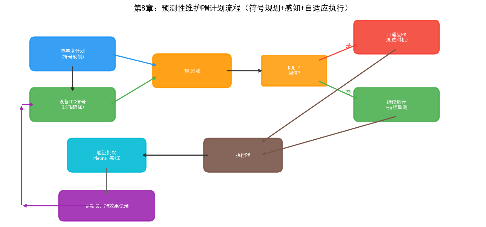
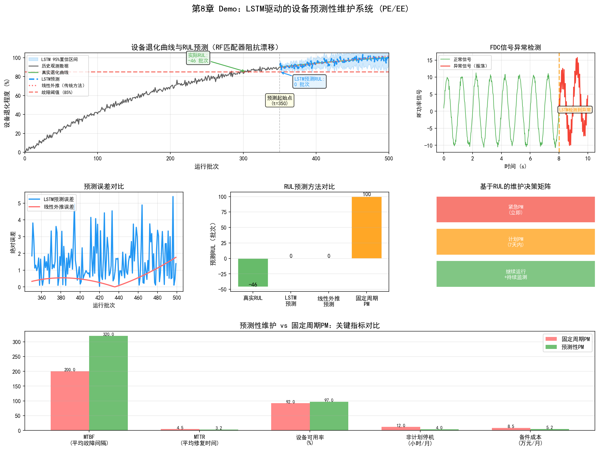

# 第8章 制程工程（PE）与设备工程（EE）

## 8.1 部门定位与职责

制程工程（Process Engineering, PE）和设备工程（Equipment Engineering, EE）是晶圆厂中"离设备最近"的两个部门。如果说PID是设计师、YED是裁判、MFG是执行者，那么PE和EE就是"调机台的工匠"——他们的工作直接决定了每一台设备在每一批次上加工出的物理结果。

### 制程工程（PE）

PE负责每个工艺模块的参数开发与优化。一个工艺模块（如刻蚀、光刻、薄膜沉积）内部有数十个可调参数——RF功率、腔体压力、气体流量和比例、温度、时间等。PE工程师的任务是找到这些参数的最优组合，使得工艺结果（如刻蚀速率、刻蚀剖面角度、均匀性、选择比）满足规格要求。

PE的工作与PID的区别在于粒度：PID关注的是跨模块的整合和全流程一致性，PE关注的是单一模块内部的参数优化。PID问的是"这一层的刻蚀结果是否匹配下一层的沉积要求"，PE问的是"刻蚀机台3号腔体的RF功率应该设多少瓦才能让刻蚀速率达到目标值且均匀性在3%以内"。

### 设备工程（EE）

EE负责设备本身的健康度和可用性。如果说PE关心的是"设备产出什么"，EE关心的是"设备状态如何"。EE的职责包括：

- **设备监控：** 通过FDC系统实时监控设备传感器数据，判断设备是否在正常状态
- **预防性维护（PM）计划：** 制定定期维护计划——每运行N批次做一次腔体清洗、每M个月更换一次消耗件
- **故障诊断与修复：** 设备异常时快速定位故障部件并修复
- **机台匹配（Tool Matching）：** 确保同类多台设备加工出的结果一致——同一产品在不同设备上的结果差异在允差范围内

## 8.2 核心业务流程

### Recipe 开发与验证

Recipe（配方）是PE工程师最核心的工作产物。一个Recipe定义了设备运行的所有参数序列——如刻蚀的Recipe可能包含：预清洗步骤（30秒，50sccm Ar，10mTorr，100W RF）、主刻蚀步骤（60秒，100sccm SF6+20sccm O2，15mTorr，300W RF）、过刻蚀步骤（15秒，参数调整）。

Recipe开发是一个迭代过程：

1. **初始参数设定：** 基于经验或相似工艺的历史数据设定初始参数
2. **试运行：** 用初始Recipe加工测试晶圆
3. **量测评估：** 测量加工结果（CD、剖面、均匀性等）
4. **参数调整：** 根据量测结果调整参数
5. **重复2-4直到满足规格**

这个过程每轮迭代需要晶圆制造周期（数天到数周），且每轮迭代只能调整少量参数。一个新工艺模块的Recipe开发可能需要数十轮迭代，耗时数月。

### 设备参数调优

即使Recipe确定后，设备参数在日常运行中也需要持续微调。原因有三个：

**设备老化：** 随着使用次数增加，设备的部件性能会退化——腔体壁面的聚合物积累改变了刻蚀环境，电极的磨损改变了RF功率的耦合效率，泵的抽速随使用时间下降。这些老化效应导致相同的Recipe在不同时间点产出的结果不同。

**批次间漂移：** 连续运行的设备在批次间存在参数漂移——前一批刻蚀在腔壁上沉积的聚合物会影响下一批的刻蚀速率。这种"记忆效应"使得设备的输出与历史运行状态有关。

**消耗件更换影响：** 每次PM后更换消耗件（如电极、聚焦环、O型密封圈等），新部件与旧部件的微小差异会导致设备特性变化——同样的Recipe在PM前后的输出可能不同。

参数调优通过R2R（Run-to-Run）控制实现——根据前一批的量测结果调整下一批的Recipe参数，补偿漂移和老化效应。

### 预防性维护（PM）计划

PM是EE保障设备可用性的核心手段。传统的PM采用固定周期：

- **批次周期：** 每运行N批次做一次腔体湿法清洗（Wet Clean）
- **时间周期：** 每M个月做一次大保养（PM），更换消耗件
- **条件触发：** 当FDC数据或量测数据达到阈值时触发临时PM

固定周期PM的问题是"一刀切"——不管设备实际状态如何，到了周期就维护。这导致两种浪费：

- **维护过早：** 设备状态还很好但周期到了，过早维护浪费产能和消耗件
- **维护过晚：** 设备已经出现退化迹象但周期未到，继续运行导致工艺结果偏差甚至报废

预测性维护（Predictive Maintenance）通过分析设备的传感器数据趋势，预测设备何时需要维护——在设备真正出问题之前提前安排PM，既避免过早维护的浪费，也避免过晚维护的风险。

### 机台匹配（Tool Matching）

一座晶圆厂通常有多台同类设备并行运行——如10台刻蚀机、20台光刻机。理想的机台匹配要求：同一产品在任意一台同类设备上加工的结果差异在允差范围内。

实现机台匹配的挑战在于：即使同型号设备，由于部件制造差异、安装环境差异、使用历史差异，每台设备的"个性"不同。同一Recipe在不同设备上可能产出不同的结果——差异可能来自RF功率校准偏差、腔体几何尺寸的微小差异、气体分布的不均匀性等。

传统的机台匹配方法是"基准-匹配"流程：

1. 选择一台"金标准"设备（Golden Tool），其输出作为基准
2. 在其他设备上运行相同Recipe，比较输出差异
3. 对存在差异的设备微调Recipe参数（如微调RF功率补偿），使其输出接近金标准

这个过程需要反复迭代，且当设备状态变化（PM后、老化后）时需要重新匹配。机台匹配的质量直接影响晶圆良率——如果设备间差异过大，不同批次晶圆的工艺结果波动增大，CP良率的方差上升。

## 8.3 关键技术与方法

### SPC（统计过程控制）

SPC是PE和EE最基础的质量控制工具。SPC通过控制图（Control Chart）监控工艺参数是否处于统计受控状态。

控制图的基本原理：如果一个工艺参数只受随机变异（Common Cause Variation）影响，其值服从正态分布，99.7%的值落在均值±3倍标准差（$\mu \pm 3\sigma$）范围内。当参数值超出这个范围（UCL/LCL），说明存在异常变异（Special Cause Variation）——不是随机波动，而是有某个具体原因导致了偏差。

常用的控制图包括：

| 控制图 | 适用数据 | 特点 |
| --- | --- | --- |
| $\bar{X}$-R图 | 连续型数据，分组 | 监控均值和极差 |
| I-MR图 | 连续型数据，单值 | 监控个别值和移动极差 |
| p图 | 离散型，不合格率 | 监控批次合格率 |
| CUSUM | 连续型 | 对小偏移敏感，累计偏差 |
| EWMA | 连续型 | 指数加权移动平均，对漂移敏感 |

SPC的局限在于它是单变量方法——每个参数独立监控，无法检测多变量之间的联合异常。例如，温度和压力各自在控制限内，但两者的组合可能对应一种异常状态。多变量SPC（如T2控制图）和基于机器学习的异常检测方法可以弥补这个局限。

### FDC（故障检测与分类）

FDC系统在第六章中已经从YED的视角介绍过，这里从EE的视角补充。

对EE而言，FDC是设备健康监控的核心工具。FDC系统每秒采集设备的数百个传感器信号，包括：

- 腔体温度、壁面温度、电极温度
- 腔体压力、各路气体流量、气体压力
- RF功率、反射功率、阻抗匹配
- 真空泵抽速、节流阀位置
- 各阶段的时间戳和状态信号

这些信号形成了每批加工的"电子指纹"——如果这批的信号模式与正常模式有偏差，FDC系统会报警并将异常分类为具体的故障类型。

FDC数据的特点是高维度（数百个信号通道）、高频（每秒数十到数百个采样点）、长时段（单批加工可能持续数分钟到数十分钟）。这种高维时序数据的分析是深度学习（特别是LSTM和Transformer）的天然应用场景。

### R2R（Run-to-Run 控制）

R2R控制是PE在量产阶段持续优化工艺参数的核心机制。R2R的基本逻辑：

1. **量测：** 每批（或每隔N批）晶圆在关键工序后进行量测，获取工艺结果（如CD值）
2. **比较：** 将量测结果与目标值比较，计算偏差
3. **模型预测：** 用R2R控制模型（如EWMA控制器）根据历史偏差趋势预测下一批需要的参数调整量
4. **参数调整：** 将调整量应用到下一批的Recipe中

R2R控制器的数学基础通常是EWMA（指数加权移动平均）模型：

$$\hat{y}_{t+1} = \alpha \cdot y_t + (1-\alpha) \cdot \hat{y}_t$$

其中 $\hat{y}_{t+1}$ 是下一批工艺结果的预测值，$y_t$ 是当前批次的实测值，$\alpha$ 是平滑系数（0到1之间）。通过比较预测值与目标值的偏差，计算出需要的参数调整量。

EWMA控制器的局限是它假设工艺漂移是线性且缓慢的。实际的工艺漂移可能是非线性的（如PM后的阶跃变化）、多变量的（多个参数同时漂移且相互关联）、甚至突变的（如某个部件突然失效）。基于深度学习的R2R控制器可以处理更复杂的非线性多变量漂移模式。

### 预测性维护

预测性维护是EE领域AI应用最成熟的方向之一。其核心是从"定期维护"转向"按需维护"——根据设备的实际健康状态决定何时维护。

预测性维护的技术路径包括：

**基于阈值的方法：** 设定关键参数的预警阈值。当温度振动等参数接近阈值时发出预警。简单但无法预测剩余使用寿命（RUL）。

**基于趋势的方法：** 用时序模型（ARIMA、LSTM等）预测关键参数的未来趋势，推算何时会超过阈值。可以预测RUL但假设参数变化可外推。

**基于健康度模型的方法：** 定义设备的"健康度"指标（综合多个传感器信号），用机器学习模型估计当前健康度和退化速率。Transformer等模型在处理长序列传感器数据方面表现出色。

**基于数字孪生的方法：** 构建设备的数字孪生模型，在虚拟空间中模拟设备的运行和老化过程。当数字孪生预测到设备即将出现性能退化时，提前安排维护。

## 8.4 面临的挑战

### 设备老化导致参数漂移

设备老化是PE和EE面临的最持续的挑战。老化的影响是多方面的：

- **刻蚀腔体壁面聚合物积累：** 改变刻蚀环境的化学特性，导致刻蚀速率和选择比漂移
- **电极磨损：** 改变RF功率的耦合效率，导致等离子体密度变化
- **真空泵性能退化：** 抽速下降影响腔体压力控制的精度
- **光学元件退化：** 光刻机透镜的透过率随曝光量衰减，影响成像质量

每种老化效应的速率不同，且相互叠加——某个参数的漂移可能同时受到多种老化机制的影响。R2R控制器可以补偿可预测的缓慢漂移，但对于突然的退化（如某个部件即将失效前的性能跳水），传统方法往往来不及响应。

### 机台间差异

同型号设备之间的差异来源于多个方面：

- **制造公差：** 即使同一型号，每台设备的部件尺寸和材料特性都有微小差异
- **安装环境：** 洁净室的温度、湿度、振动环境因位置而异
- **使用历史：** 不同设备运行的批次数量、产品类型、维护历史不同
- **消耗件批次差异：** 不同批次的消耗件（如电极、聚焦环）的材料特性可能存在批次间差异

机台间差异使得"通用Recipe"在实际中不存在——每台设备都需要自己的Recipe微调版本。随着设备数量增加（一座先进晶圆厂有数百台设备），Recipe维护的工作量线性增长。当设备状态变化（PM后、老化后）时，Recipe需要重新匹配——这个过程可能需要数天。

### Recipe开发耗时

新工艺的Recipe开发是NPI周期的主要瓶颈之一。一个复杂工艺模块（如多层金属刻蚀）的Recipe可能包含数十个步骤和上百个参数。传统的Recipe开发方法是OFAT（每次只调一个参数）或简单的DOE——需要大量实验轮次，每轮需要晶圆制造周期。

在先进制程中，工艺窗口极窄（如3nm的CD控制要求在1-2纳米），参数交互效应复杂（非线性、非单调），传统实验方法难以高效覆盖参数空间。这是AI辅助实验设计（如贝叶斯优化、强化学习）最有价值的应用场景之一——通过智能采样在更少的实验次数中找到更优的参数组合。

## 8.5 实践研究：AI在PE/EE中的真实落地案例

### 英特尔：IIoT预测性维护系统

英特尔在自己的晶圆厂中部署了基于IIoT传感器和边缘AI的预测性维护系统，主要监控两类设备：

**FFU（风机过滤单元）健康预测：** FFU是洁净室的核心设备——保持晶圆厂内部空气洁净度。FFU故障会导致洁净度下降，直接影响良率。英特尔在FFU上安装振动传感器，通过Intel IoT Gateway将数据传到分析应用。当振动数据出现异常模式时，系统在FFU实际故障前发出告警。

- FFU非计划停机减少66%
- 相比人工巡检，非计划停机减少300%以上

**环氧鼓风机振动监控：** 环氧鼓风机是工艺排气系统的关键设备。英特尔在鼓风机上部署振动传感器，提前检测到5起即将发生的鼓风机故障——避免了估计数百万美元的损失。

英特尔的系统还具备Agentic AI能力——当检测到异常时，系统可以自主调度维修、订购备件、调整生产路径。

### Applied Materials：AIx平台与GPU加速仿真

Applied Materials的AIx（Actionable Insight Accelerator）平台是设备级AI分析的代表性产品：

**AIx平台核心能力：**
- 实时工艺可视性——跨晶圆和裸片测量数百万数据点，优化数千个工艺变量
- ChamberAI——传感器+ML算法对工艺变量进行实时分析，实现腔体级异常检测
- AppliedPRO——数字工艺地图（Digital Process Map），支持虚拟实验
- 载片量内联量测——量测速度提升100倍，分辨率提高50%

**GPU加速材料仿真：** Applied Materials与NVIDIA合作，用GPU加速材料科学仿真：
- Ginestra材料仿真：比CPU快10倍；在NVIDIA B200上，部分仿真从5天（64核CPU）缩短到2小时（单GPU），加速约55倍
- ACE+形貌仿真：GPU加速35倍

### ASML：生成式AI用于光刻优化

ASML在2025-2026年推进了多项AI应用：

**OPC（光学邻近校正）AI加速：** ASML使用AI加速OPC计算已超过十年。2025年与Mistral AI合作，用生成式AI提升OPC Recipe质量和求解速度。2026年1月在客户处完成首次生成式AI验证。

**EUV光源优化：** AI优化和校准EUV光源设置，减少人工试错。早期测试在客户EUV扫描仪上实现了晶圆级功率提升。

**电子束检测引导：** AI引导e束量测和检测设备的图像质量优化和检测路径。

**诊断AI：** AI驱动的诊断系统在某些子系统的错误识别上比人工快70%以上，且准确率匹配工程师水平。

**设计加速：** 超过12,000种设计通过AI辅助设计加速进行了探索。

### MST NeuroBox：AI驱动的R2R和腔体匹配

MST NeuroBox的AI R2R系统代表了从传统EWMA控制器向AI控制器的进化：

**AI R2R控制：**
- 传统EWMA控制器只能处理2-3个变量；AI R2R同时优化10-20个参数
- 在设备漂移和来料变异下，将工艺参数维持在目标值±1%以内
- 基于虚拟量测（VM）预测自动更新Recipe——在批次间实时调整

**AI腔体匹配（Chamber Matching）：**
- 持续监控每台腔体的温度曲线、RF功率/阻抗、气体流量、腔体压力和终点信号
- AI模型基于"良好匹配腔体"的历史数据建立基准，实时检测、量化和诊断匹配漂移
- 腔体间变异降低超过60%
- PM后 qualification 时间缩短70%
- 每年节省数千片测试晶圆

### 设备预测性维护的行业基准数据

根据行业部署的汇总数据，AI驱动的预测性维护在半导体设备上的典型效果：

| 指标 | 传统（固定周期PM） | AI驱动PdM | 改善幅度 |
| --- | --- | --- | --- |
| 等离子刻蚀设备MTBF | 280-350小时 | 420-490小时 | +35-45% |
| 通用设备MTBF | 基准 | — | +25-40% |
| MTTR | 基准 | — | -50-65% |
| 设备OEE | 基准 | — | +8-15% |
| 故障预警时间 | 事后发现 | 故障前24-72小时 | 质变 |

NVIDIA的iFactory AI平台展示了GPU加速的预测性维护：LSTM和Transformer模型通过TensorRT优化，推理速度为CPU的5倍；从原始传感器输入到分类告警的延迟低于15毫秒。

### KLA：AI驱动的缺陷检测与工艺控制

KLA的软件解决方案套件将AI应用于检测和工艺控制的全链条：

- **Klarity Defect**：实时偏移识别，自动缺陷签名检测和分类
- **Klarity SSA（空间签名分析）**：自动检测和分类指示工艺问题的缺陷签名
- **aiSIGHT**：基于SEM图像的AI驱动缺陷和图形测量——识别晶圆正面、背面和边缘的颗粒和图形缺陷
- **Klarity ACE XP**：跨晶圆厂级良率学习捕获、保留和共享系统

KLA的Gen5产品线针对检测复杂度的增长——先进制程的关键检测层数增加了50%——通过AI模型增强检测能力。

### 行业工具生态总览

| 厂商 | AI产品 | 核心能力 | 量化结果 |
| --- | --- | --- | --- |
| 英特尔 | IIoT + 边缘AI | FFU/鼓风机PdM | 停机-66%、5起故障预防 |
| Applied Materials | AIx / Ginestra | 实时工艺分析、材料仿真 | 仿真10-55倍加速 |
| ASML | 生成式AI OPC | 光刻优化、诊断 | 诊断+70%、12,000+设计探索 |
| MST NeuroBox | AI R2R / 腔体匹配 | 多变量R2R、匹配监控 | 变异-60%、qualification-70% |
| KLA | Klarity套件 | 缺陷检测与分类 | 覆盖Gen5 +50%检测层 |
| NVIDIA/iFactory | GPU加速PdM | LSTM/Transformer推理 | 延迟<15ms、5倍推理加速 |

---

到本章为止，我们已经完成了对晶圆厂三大核心部门的业务概述和实践案例。PID/YED关注工艺整合和良率，MFG关注生产排程和产能，PE/EE关注设备参数和维护。这三个部门面临的技术挑战——跨步骤因果推理、NP-Hard调度、高维参数优化、设备健康预测——正是AI技术可以发挥价值的场景。上述案例表明，从英特尔的IIoT到ASML的生成式AI光刻优化，从Applied Materials的GPU加速仿真到MST的AI R2R控制，设备级AI已经在量产中产生可量化的ROI。接下来的第四部分将逐一展开三大流派在这些场景中的具体应用。

## 8.6 Demo可视化：LSTM驱动的设备预测性维护系统

*Demo说明：上图展示了设备退化曲线与LSTM的RUL预测、FDC信号异常检测、预测误差对比、维护决策矩阵和PM效果对比。模拟脚本见 `demos/demo_ch8_predictive_maintenance.py`。*
