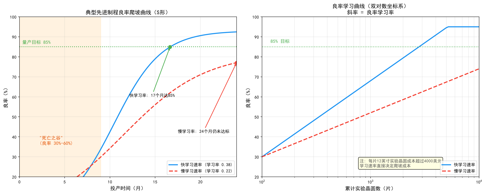

# 第9章 良率爬坡——半导体制造的"死亡之谷"

## 9.1 问题背景：良率爬坡为什么如此艰难

在半导体产业的竞争格局中，良率（Yield）是决定芯片制造成本和盈利能力的最核心因素。一个先进制程节点从研发成功（器件功能验证通过）到大规模量产（良率达到商业化可接受水平），通常需要经历一个被称为"良率爬坡"（Yield Ramp）的艰难过程。这个阶段往往持续12-24个月，期间的良率曲线呈现经典的S形增长特征——初期缓慢爬升，中期加速提升，后期趋于饱和。对于3nm及以下节点，良率爬坡的难度和周期均显著增加，甚至成为决定工艺节点能否商业化的关键瓶颈。



*图9-1：典型先进制程良率爬坡曲线，呈现S形增长，12-18个月达到量产目标（85%）*

良率爬坡的挑战源于多个维度：

**工艺步骤数量激增。** 先进制程涉及的工艺步骤数量从28nm的约300步增长到3nm的超过1500步，每一步的缺陷和偏差都会影响最终良率。综合良率是各层良率的乘积——即便单步良率高达99.9%，经过1500步后，理论综合良率也只有22%。这意味着良率爬坡实际上是"每一层都要做对"的极限工程。

**器件结构引入全新工艺模块。** 从FinFET到GAA FET再到CFET，新的器件结构引入了全新的工艺模块和工艺窗口。每一次器件结构变革，都意味着此前积累的工艺经验和良率数据部分失效，良率爬坡不得不从较低起点重新开始。

**学习速率受经济约束。** 良率学习速度（Learning Rate）受限于实验晶圆的数量和量测资源——每片12英寸晶圆的成本已超过4000美元，大幅实验的成本极高。爬坡团队必须在"多做实验加速学习"和"控制成本"之间做出权衡，这正是良率爬坡被称为"死亡之谷"的原因：投入巨大、产出不确定，许多新工艺节点正是在这个阶段被判定为"无法商业化"而终止。

因此，建立系统化的良率提升方法论，包括缺陷根因分析、工艺窗口优化、良率模型预测和设计-工艺协同优化（DTCO），成为每家芯片制造企业的核心竞争力。本章系统介绍良率爬坡的方法论框架，以及AI技术在其中扮演的角色。


*图9-2：良率爬坡四大方法论支柱与学习循环*

## 9.2 缺陷根因分析（RCA）——爬坡的起点

缺陷根因分析（Root Cause Analysis, RCA）是良率爬坡的起点和核心。良率爬坡的第一性原理是：**任何良率损失都可以追溯到某个具体的缺陷来源，而消除缺陷来源的前提是找到它**。

### 检测与分析的工具链

现代晶圆厂构建了一条从"扫描发现"到"物理确认"的完整分析链条：

- **KLA缺陷扫描 + SEM复查（ADC自动缺陷分类）**：光学扫描设备以高速全晶圆扫描发现缺陷，SEM（扫描电子显微镜）对可疑缺陷进行高分辨率复查，自动缺陷分类（ADC）系统利用图像识别将缺陷归类为颗粒、划痕、图案缺陷等类型
- **EDX成分分析**：能量色散X射线能谱分析，确定缺陷的化学成分——是金属污染、有机物还是异物颗粒，成分信息直接指向污染来源（如某个腔体材料、某种化学品）
- **TEM剖面分析**：透射电子显微镜对缺陷位置做纳米级剖面观察，确认缺陷对器件结构的影响深度——是否穿透了栅极氧化层、是否破坏了互连层
- **电性失效分析（EFA）**：通过WAT、CP等电性测试数据定位失效的物理位置，将"良率数字下降"转化为"哪颗器件、哪个参数、哪个位置失效"

### 5W1H 根因分析原则

根因分析遵循"5W1H"原则：

| 维度 | 问题 | 目的 |
| --- | --- | --- |
| What | 缺陷类型是什么？ | 建立缺陷画像（颗粒/划痕/图案缺陷/电性失效） |
| Where | 哪个工艺步骤/位置？ | 通过晶圆图空间分布定位工艺阶段 |
| When | 何时首次出现？ | 确定缺陷的时间窗口与机台/批次关联 |
| Why | 根本原因是什么？ | 从机理上解释缺陷成因 |
| How | 如何消除？ | 制定工艺/设备/环境的纠正措施 |

### 系统性缺陷 vs 随机缺陷

在先进制程中，约70%的良率损失由系统性缺陷（Systematic Defect）引起，仅30%是随机缺陷（Random Defect）。这一比例决定了良率爬坡的策略重心：**系统性缺陷是可以被识别、修正和消除的**，它们是爬坡早期的主要攻关对象；随机缺陷则更多依赖工艺能力和环境控制来降低密度。

系统性缺陷的根因通常与工艺参数偏移有关：

- **光刻焦点偏移**：焦距偏离最佳值导致图案变形，产生桥接或断线缺陷，往往表现为晶圆图上的环形分布
- **刻蚀负载效应（Loading Effect）**：图案密度差异导致刻蚀速率不均，密集区域过刻蚀、稀疏区域欠刻蚀，产生关键尺寸（CD）偏差
- **CMP碟形凹陷（Dishing）**：化学机械抛光在宽金属区域过度研磨，形成凹陷，导致后续层金属填充不良

### AI 增强：RCA 的知识图谱化

传统RCA依赖资深工程师的个人经验，知识获取和传承效率低。AI的介入让RCA从"个人经验驱动"走向"知识图谱驱动"：将缺陷类型、工艺步骤、设备腔体、量测参数之间的关系建模为知识图谱，系统能够基于"缺陷特征→可能根因→建议检查项"的推理路径给出候选根因排序，工程师只需在候选列表中确认。这一方向将在第11章（符号主义在晶圆厂的应用）中详细展开。

## 9.3 工艺窗口量化——把"碰运气"变成"工程"

找到缺陷根因之后，下一步是系统性地扩大工艺对参数偏移的容忍度。工艺窗口（Process Window）是指使器件性能满足规格要求的工艺参数范围。工艺窗口越宽，量产中的良率波动越小；工艺窗口越窄，参数稍有偏移就会产生缺陷。

### DOE 与工艺窗口边界

量化工艺窗口的常用方法是使用DOE（实验设计）手段画出工艺窗口边界（Process Window Boundary）。DOE通过系统性地改变工艺参数（如温度、压力、气体流量、功率），测量器件性能随参数的变化，勾画出"合格区域"的边界。

工作量考核指标为工艺窗口指数PWI（Process Window Index）：

```
PWI = 实际工艺参数偏移量 / 允许的工艺窗口宽度

PWI > 1: 参数落在窗口之外，工艺不可接受
PWI < 1: 参数在窗口内，值越小，工艺对偏移的容忍度越高
```

业界通常要求关键工艺步骤的PWI远小于1，为量产中的参数漂移留出余量。

### 光刻 FEM 与刻蚀三维 DOE

不同工艺模块的窗口量化方法不同：

- **光刻工艺**：通过聚焦-曝光矩阵（FEM, Focus-Exposure Matrix）实现。在晶圆上以网格形式系统变化聚焦和曝光剂量，量测各网格点的CD和图案保真度，绘制"焦点-剂量窗口"（通常呈椭圆形）。FEM窗口的大小直接决定了光刻机焦距和剂量控制的容差范围
- **刻蚀工艺**：通过CF₄/O₂气体比例-偏压功率-压力三维DOE实现。三个维度交叉组合实验，量测刻蚀速率、CD偏差、侧壁角度和缺陷率，在三维参数空间中勾画工艺窗口

### 工艺能力指数 Cpk

工艺窗口量化的最终输出是工艺能力指数。通常要求工艺窗口的Cpk≥1.67（对应5σ质量水平）——这意味着工艺参数的均值与规格边界之间有充足的余量，即使参数发生漂移，落在规格外的概率也极低。

### AI 增强：虚拟量测与贝叶斯优化

DOE实验的成本极高（每片实验晶圆超过4000美元），AI提供了两个加速方向：

- **虚拟量测（Virtual Metrology, VM）**：利用FDC设备传感数据（温度、压力、RF功率等）训练模型预测量测结果，减少实际量测次数——"每片晶圆都有量测数据"而无需真正测量每片
- **贝叶斯优化**：用高斯过程等代理模型拟合工艺窗口边界，在少量实验后智能推荐下一组实验参数，将找到窗口边界所需的实验次数降低一个数量级

## 9.4 良率模型与预测——从缺陷到良率的数学

良率模型将缺陷密度映射到最终芯片良率，是良率爬坡的"仪表盘"——没有模型，团队只能凭感觉判断爬坡进度。

### 经典统计模型

最经典的模型是Murphy模型和Poisson模型：

**Poisson模型**假设缺陷在晶圆上随机分布，良率与缺陷密度和芯片面积的关系为：

```
Y = exp(-D₀·A)

其中 D₀ 是缺陷密度（缺陷数/单位面积）
     A  是芯片面积（die面积）
```

Poisson模型的含义直白而残酷：芯片面积翻倍，同样缺陷密度下的良率按指数下降——这正是"大芯片难做"的数学根源。

**Murphy模型**考虑了缺陷密度的不均匀性，对Poisson模型进行修正，适用于缺陷密度在晶圆间存在波动的情况[78][79][80]。

**负二项式模型（Negative Binomial）**：实际缺陷分布往往是聚集的（Clustered）——缺陷成群出现在晶圆的特定区域（边缘、中心或某个腔体的对应位置）。负二项式模型通过聚类参数更准确地描述聚集缺陷场景，是先进制程良率建模的常用选择。

### Critical Area 与电性数据修正

对于复杂产品，芯片良率还受到电路密度和关键面积（Critical Area）的影响——并非芯片上所有区域都对缺陷同样敏感，只有落在关键区域（如金属线间距最小处）的缺陷才会导致失效[81][82]。关键面积越小，芯片对缺陷的容忍度越高。

现代良率分析通过VSB（电压对比测试）和MCM（存储器单元测试）数据进行修正：VSB利用电子束检测发现电压对比异常（如开路、短路）的缺陷，MCM利用存储器阵列的规则结构统计缺陷对单元的影响，两者为良率模型提供更精确的缺陷-失效映射。

### ML 良率预测：从统计模型到数据驱动

经典统计模型假设缺陷分布服从特定数学形式，但真实产线的缺陷行为远比模型复杂。现代良率分析平台（如yieldHub系统）利用机器学习预测良率热点，将工艺参数、FDC信号、缺陷数据、量测数据等多源数据作为特征，直接学习"数据→良率"的映射，准确率可达85%以上。这类数据驱动方法不依赖对缺陷物理机制的完整理解，在良率爬坡的早期（物理模型尚未建立时）尤其有价值。深度学习良率预测的详细讨论见第12章。

## 9.5 设计-工艺协同优化（DTCO）

良率爬坡不只是"制造端的问题"——设计规则与工艺能力之间的协同程度，在晶圆投产之前就已决定了良率的天花板。设计-工艺协同优化（Design-Technology Co-Optimization, DTCO）正是为了打破"设计与制造各自为政"的壁垒。

### 设计规则与工艺窗口的协同

设计规则（Design Rule）定义了电路版图必须满足的几何约束（线宽、间距、面积）。工艺窗口越窄，设计规则就越保守（更大的间距、更宽的线宽），芯片面积越大、成本越高。DTCO的核心目标是在工艺窗口与设计密度之间找到最优平衡点——通过工艺改进扩大窗口，或用设计技巧绕开工艺的薄弱区域。

### 关键面积最小化

DTCO的一个具体抓手是降低芯片的关键面积：通过版图优化（如金属走线均匀化、冗余通孔、关键层局部加宽）使缺陷更不容易落在敏感区域，从而在不改变工艺的情况下提升良率。数据表明，关键面积优化可以在缺陷密度不变的情况下将良率提升数个百分点。

### DTCO 的 AI 化

传统DTCO依赖设计工程师与工艺工程师的反复沟通和手工迭代，周期以月计。AI正在改变这一过程：机器学习模型可以快速评估版图改动的良率影响（关键面积分析加速）、推荐最敏感区域的修正方案，甚至自动生成满足工艺窗口约束的版图方案。这一方向与第19章（LLM在晶圆厂的应用）中的设计辅助场景相互呼应。

## 9.6 良率学习曲线管理——爬坡的节奏控制

方法论提供了工具，而爬坡能否按期完成，取决于团队能否有效地管理学习节奏。

### 良率学习率

良率学习率（Yield Learning Rate）定义为"良率随累计实验晶圆数量提升的速率"。在双对数坐标系下，良率爬坡曲线近似为一条直线，其斜率就是学习率。学习率越高，达到目标良率所需的实验晶圆越少，爬坡成本越低。

爬坡团队每周设定良率提升目标（如"本周提升2个百分点"），通过"实验→分析→改进"的循环推进。学习率低于预期时，通常意味着RCA没有找到真正的根因，或实验设计没有覆盖关键变量。

### 帕累托分析与优先级

良率损失往往由少数几个大缺陷源主导。爬坡团队用帕累托分析（缺陷类型/根因的良率损失贡献排序）确定攻关优先级：**先解决贡献最大的缺陷源，而不是数量最多的缺陷源**。一个贡献30%良率损失的系统性缺陷源，其价值远高于十个合计贡献5%的随机缺陷。

### 分阶段策略

- **爬坡初期（良率 30%-60%）**：聚焦"杀大象"——解决导致良率断崖式下跌的大缺陷源（如光刻层偏移、重大工艺窗口错位）。此阶段缺陷数量少但单点贡献大
- **爬坡中期（良率 60%-85%）**：聚焦系统性缺陷——通过工艺窗口量化、DOE优化和关键面积改进，系统性地收窄良率损失
- **爬坡后期（良率 85%以上）**：聚焦随机缺陷与边缘效应——降低缺陷密度、改善工艺均匀性、处理晶圆边缘区域，此阶段每提升1%良率都需要极精细的工作

## 9.7 AI 在良率爬坡中的角色

良率爬坡是晶圆厂中AI价值密度最高的业务场景之一，三大流派在这里各有用武之地：

| AI流派 | 在良率爬坡中的角色 | 典型应用 |
| --- | --- | --- |
| 符号主义 | 知识表示与推理 | RCA知识图谱、专家规则库、缺陷-根因关联推理（见第11章） |
| 连接主义 | 感知与预测 | ADC缺陷分类、良率预测、虚拟量测、晶圆图模式识别（见第12章） |
| 行为主义 | 序贯决策与优化 | DOE自适应实验设计、良率提升策略的RL优化（见第13章） |

三大流派的融合在良率爬坡中尤其明显：连接主义模型从数据中感知缺陷，符号主义系统基于领域知识推理根因，行为主义算法决定下一步做哪个实验。第15章（NB融合）、第16章（NA融合）和第18章（NSA全融合）将展示这种融合如何构成完整的良率智能闭环。

## 9.8 实践案例

良率爬坡方法论已经在头部晶圆厂和AI公司中得到规模化验证：

- **虚拟量测驱动的良率监控**：SK海力士与Gauss Labs合作的Panoptes系统在产线上部署虚拟量测，实现"每片晶圆都有量测数据"，将量测周期缩短80%以上，显著加速了良率学习循环（详见第12章）
- **RCA知识图谱**：yieldWerx和IKAS等公司将知识图谱应用于缺陷根因分析，将工程师的经验固化为可检索、可推理的结构化知识，把RCA周期从数天缩短到数小时（详见第11章）
- **AI缺陷检测与分类**：KLA等设备厂商将深度学习引入缺陷检测与ADC，检测灵敏度与分类准确率大幅提升，为RCA提供了更高质量的缺陷数据（详见第12章）
- **虚拟量测+良率模型的工程实践**：多家晶圆厂将ML良率预测嵌入日常良率会议，作为爬坡进度的实时仪表盘，辅助管理层决策

## 9.9 本章小结

良率爬坡是半导体制造中"投入最大、不确定性最高"的阶段，也是决定工艺节点商业成败的关键战役。本章介绍了良率爬坡的四大方法论支柱：缺陷根因分析（RCA）解决"缺陷从哪里来"，工艺窗口量化解决"怎么让工艺更稳"，良率模型与预测解决"爬坡进度怎么衡量"，DTCO解决"设计端如何配合"。在此基础上，AI技术正在从三个方向重塑良率爬坡的效率：让RCA从个人经验走向知识图谱、让DOE从大量实验走向智能优化、让良率预测从统计假设走向数据驱动。对晶圆厂而言，良率爬坡方法论的成熟度与AI的渗透程度，正在成为衡量其工艺竞争力的新标尺。
