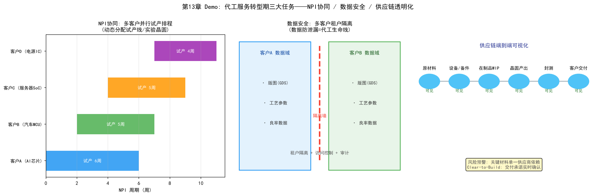

# 第13章 代工服务转型期——从"制造"到"服务"

## 13.1 阶段定位：Foundry 代工服务的业务特征

半导体产业有两种基本商业模式：IDM（整合设备制造商，自己设计自己制造）和Foundry（代工厂，只制造不设计）。当一家晶圆厂从IDM模式转型为Foundry代工服务，或从单一客户的制造厂扩展为多客户代工厂时，业务逻辑发生根本变化：

- **多客户、多项目并行**：不同客户的设计规则、工艺需求、交期要求各不相同，产线要同时服务几十个客户的上百个项目
- **客户是"上帝"也是"对手"**：客户的IP（知识产权）必须得到绝对保护，同时客户需要深度介入工艺开发（联合NPI）
- **信任是核心资产**：代工服务的本质是卖信任——客户把最核心的芯片设计交给你制造，数据安全、交付可靠性、供应链透明度缺一不可

转型期的核心任务从"把晶圆做好"扩展到"NPI协同、数据安全、供应链透明化"三个服务能力维度。

*图13-1：代工服务信任闭环——NPI协同、数据安全与供应链透明化*

## 13.2 任务一：NPI 协同（NPI Collaboration）

### 转型期的 NPI 挑战

Foundry模式下，NPI（新产品导入）不再是内部流程，而是**与客户协同的联合流程**：

- **多客户NPI并行**：多个客户同时导入新产品，争抢试产线、实验晶圆和工程资源——"谁的NPI优先"是复杂的资源分配问题
- **设计-工艺协同**：客户的设计（版图、设计规则）必须与Foundry的工艺能力匹配——设计-工艺协同优化（DTCO）需要跨组织进行（方法论见第9章）
- **试产窗口紧俏**：先进制程的试产窗口（Pilot Run）极其有限，一旦错过要等下一轮，NPI排程直接影响客户的上市时间

### NPI 协同的任务链条

1. **协同设计**：客户基于Foundry提供的PDK（工艺设计套件）进行设计，双方在设计规则检查（DRC）、可制造性设计（DFM）上协同
2. **联合NPI排程**：多个客户的NPI项目统一排程，动态分配试产线、实验晶圆和工程资源
3. **试产反馈闭环**：试产结果（良率、电性参数、缺陷）实时反馈给客户，客户修改设计后进入下一轮试产
4. **知识沉淀**：将跨客户的NPI经验沉淀为可复用的工程知识

### AI 的角色

- **NPI排程优化**：用优化算法/RL在多客户NPI之间动态分配资源（方法论见第16章行为主义）
- **设计-工艺协同辅助**：用机器学习快速评估客户版图的良率风险，提前发现设计-工艺不匹配（呼应第22章LLM的设计辅助场景）
- **NPI知识库**：将历史NPI的问题-解决记录结构化，形成可检索的工程知识库，辅助工程师决策

## 13.3 任务二：数据安全（Data Security）

### 为什么数据安全是代工的生死线

Foundry为多个客户制造芯片，每个客户的设计数据（GDS版图）、工艺数据、良率数据都是高度敏感的商业机密——**客户A的数据一旦泄漏给客户B，代工厂就失去了所有客户的信任**。历史上，数据安全事件曾直接导致代工厂失去重要客户。代工服务的数据安全不仅是合规要求，更是商业模式的生命线。

### 数据安全的任务链条

1. **租户隔离（Tenant Isolation）**：在数据层、应用层、网络层为每个客户建立逻辑隔离——客户A的工程师看不到客户B的任何数据
2. **访问控制**：基于角色的细粒度访问控制（谁在什么条件下可以访问什么数据），最小权限原则
3. **数据防泄漏（DLP）**：监控数据传输（导出、打印、外部系统交互），防止数据经非授权渠道流出
4. **审计追溯**：完整记录数据访问行为，支持事后审计和安全事件调查

### AI 的角色

- **异常访问检测**：用行为分析检测异常数据访问模式（如深夜大量下载、异常的导出行为），比规则检测更早发现内部威胁
- **数据脱敏**：在不影响分析价值的前提下对共享数据脱敏（如共享工艺趋势数据时隐藏客户标识）
- **联邦学习**：在不共享原始数据的前提下跨客户训练共享模型——"数据不动、模型动"，是代工场景保护客户数据同时利用多源数据的最佳实践

### 案例视角：半导体数据共享平台

产业界已经出现专门解决"数据共享与安全"矛盾的平台。例如Athinia（Palantir与默克合资的半导体数据公司）通过安全的Ontology数据架构，让芯片制造商、材料供应商在各自数据不出域的前提下完成数据协作，实现CMP预测性制造等应用（详见第24章Palantir）。

## 13.4 任务三：供应链透明化（Supply Chain Transparency）

### 转型期的供应链挑战

代工厂处于半导体供应链的中枢位置：上游是设备、材料、化学品供应商，下游是芯片设计客户和封测厂。供应链的任何一个环节中断都会直接冲击交付承诺：

- **地缘政治与突发事件**：出口管制、自然灾害、疫情都可能中断关键设备/材料供应
- **交期承诺**：客户依赖Foundry的交期承诺安排自己的生产计划，交期失信等于流失客户
- **产能分配**：供不应求时，把有限的产能分配给哪些客户，是既敏感又关键的决策

### 供应链透明化的任务链条

1. **端到端可视化**：从原材料、在制品到成品出厂的全程可见——每批材料的来源、状态、位置
2. **风险预测**：识别供应链风险（某材料供应商的交付延迟、某设备的备件缺口）并提前预警
3. **需求-产能匹配**：将客户需求预测与工厂产能模型匹配，提前发现产能缺口
4. **交付承诺管理**：基于实时产能状态给出可信的交期承诺（Clear-to-Build——确认"这个订单现在能开工"）

### AI 的角色

- **供应链预测**：用机器学习预测设备/材料交付周期、市场需求波动
- **风险预警**：用图谱/规则+数据模型识别供应链风险传导路径（如某关键材料依赖单一供应商）
- **产能分配优化**：在客户优先级、利润、长期关系之间优化产能分配
- **案例视角**：Palantir Foundry在半导体行业的三大官方工作流之一就是"战略CAPEX模拟与供应链可视化"，欧洲IDM用其实现多工厂产能可视化、供应链端到端可视和Clear-to-Build检查（详见第24章）

## 13.5 转型期的 AI 落地要点

代工服务转型期的AI应用有三个特殊性：

1. **信任优先于技术**：数据安全能力不是"可选的AI功能"，而是商业模式前提——AI项目（尤其涉及跨组织数据）必须首先通过安全与合规评估
2. **多方协同是常态**：NPI协同、供应链协同都涉及外部组织，AI系统需要支持跨组织的受控数据共享（联邦学习、安全数据平台），而非单方数据汇聚
3. **服务指标导向**：考核指标从制造指标（良率、OEE）扩展到服务指标——NPI周期、客户满意度、数据安全事件数、交期达成率

*图13-2：NPI协同、数据安全与供应链透明化*

## 13.6 本章小结

代工服务转型期标志着晶圆厂从"制造能力"向"服务能力"的跃迁。NPI协同解决"如何与客户一起把新产品做出来"，数据安全解决"如何让客户放心把设计交给你"，供应链透明化解决"如何兑现交付承诺"。三者的共同主题是**信任**——AI在这个阶段的角色，是构建支撑信任的基础设施：安全的共享数据架构、可解释的协同决策、透明的供应链状态。对代工厂而言，AI竞争力不仅体现在产线效率，更体现在"客户愿意把最核心的设计托付给你"的信任能力。
