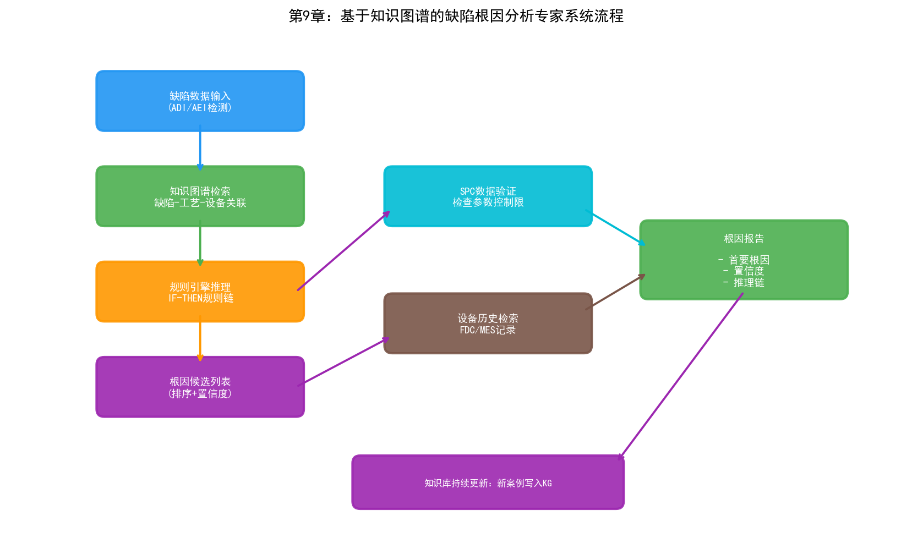
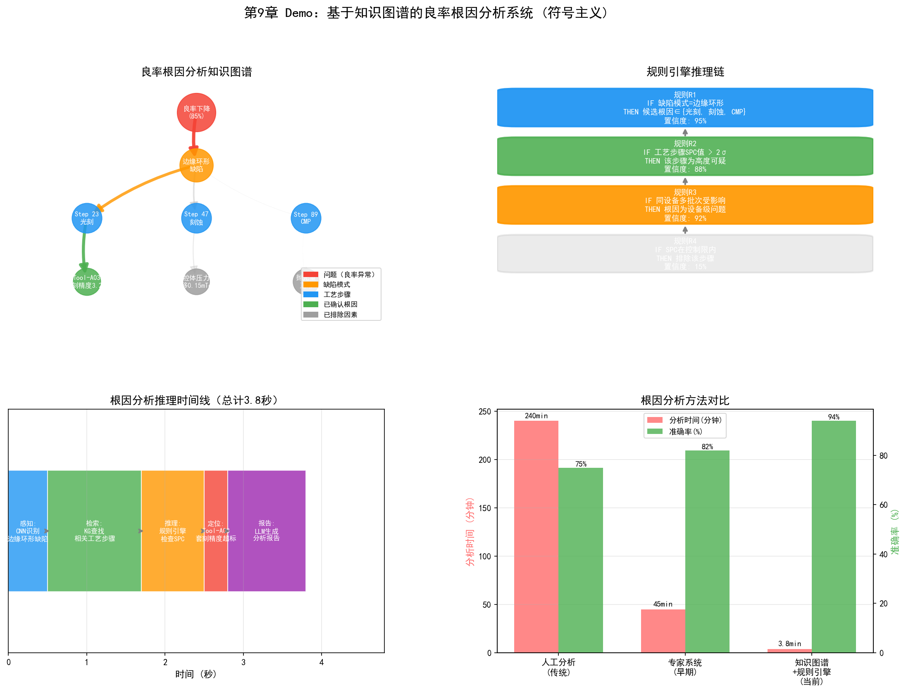

# 第14章 符号主义在晶圆厂的应用

## 14.1 专家系统在工艺诊断中的应用

符号主义在半导体制造中的最早实践可以追溯到1980年代的专家系统。当时，一些头部晶圆厂尝试用规则引擎来辅助工艺诊断——将资深工程师的经验编码为"如果-那么"规则，帮助年轻工程师快速定位问题。

### PID/YED：缺陷根因分析专家系统

在良率管理中，缺陷根因分析（RCA）是最依赖经验的环节之一。一位资深的YED工程师看到某种晶圆图模式时，能够快速将缺陷空间分布与特定的工艺步骤和设备关联起来。这种能力本质上是大量"如果...那么..."规则的隐性运用。

一个早期的RCA专家系统可能包含如下规则：

```
规则 R001:
  如果  晶圆图显示边缘环形缺陷
  且    缺陷类型为颗粒
  那么  可能根因: 边缘清洁工艺不良 (置信度: 0.8)
        建议检查: 边缘清洗设备

规则 R002:
  如果  晶圆图显示中心圆形缺陷
  且    缺陷密度 > 阈值
  那么  可能根因: 光刻机镜头污染 (置信度: 0.7)
        建议检查: 光刻机3号镜头

规则 R003:
  如果  晶圆图显示簇状缺陷
  且    簇状中心对应某腔体位置
  那么  可能根因: 腔体微粒脱落 (置信度: 0.9)
        建议检查: 对应腔体的消耗件状态
```

这套方法的优点是可解释——系统不仅给出根因判断，还给出推理链路，工程师可以验证每一步。缺点同样明显：规则需要人工维护，无法覆盖所有情况，且当工艺节点变化时规则需要重写。

尽管专家系统作为独立技术已经不再是主流，但它的核心思想——将工艺知识显式编码为机器可处理的形式——在知识图谱和本体论中得到了延续和升级。

### PE/EE：设备故障诊断专家系统

设备故障诊断是另一个适合符号推理的场景。一台半导体设备的故障树可以非常复杂——从"产品良率下降"这个顶层症状，到"刻蚀速率偏差"，到"RF功率不稳定"，到"匹配器调谐异常"，到"匹配器电机老化"——形成了多层的因果链。

故障诊断专家系统通过反向推理定位故障：从观测到的症状出发，沿故障树向下追溯，找到最可能的根因部件。这个过程的每一步推理都可以追溯到具体的因果规则——"如果RF反射功率突然升高，那么匹配器可能未正确调谐"。

一些晶圆厂的EE部门至今仍在使用基于CLIPS或Jess构建的故障诊断系统，用于新员工的培训辅助和故障快速定位。这些系统虽然不够"智能"，但在特定场景中的实用价值经过了时间验证。

## 14.2 知识图谱在良率管理中的应用

知识图谱是符号主义在当代工业场景中最成熟的形态。与专家系统的规则相比，知识图谱用图结构表达实体之间的关系，天然支持多跳关联查询——这在跨步骤、跨系统的良率根因分析中极具价值。

### 晶圆厂工艺知识图谱构建

晶圆厂知识图谱的核心实体类型包括：

```
产品实体: Wafer, Die, Device, Layer, Lot, Batch
工艺实体: Recipe, ProcessStep, Route, Module
设备实体: Tool, Chamber, Component, ConsumablePart
参数实体: Parameter, SetPoint, Measurement, CD, FilmThickness
缺陷实体: Defect, DefectType, DefectPattern, FailureMode
测试实体: WAT, CP, FT, TestItem, TestResult
时间实体: Timestamp, ProcessPeriod, PMCycle
```

实体之间的关系类型包括：

```
Wafer -[BELONGS_TO]-> Lot
Wafer -[PROCESSED_AT]-> ProcessStep
ProcessStep -[USES_TOOL]-> Tool
ProcessStep -[USES_RECIPE]-> Recipe
Tool -[HAS_CHAMBER]-> Chamber
Chamber -[HAS_COMPONENT]-> Component
Recipe -[HAS_PARAMETER]-> Parameter
Wafer -[HAS_DEFECT]-> Defect
Defect -[CLASSIFIED_AS]-> DefectType
Wafer -[TESTED_BY]-> CP
CP -[HAS_RESULT]-> TestResult
TestResult -[INDICATES]-> FailureMode
```

当这些实体和关系被组织为图后，良率分析就从"逐个系统查询"变成了"图上推理"。例如，要回答"最近一周哪些设备的参数可能与3nm产品的CP良率下降相关"这个问题，传统方式需要工程师分别在MES、FDC、SPC、YMS系统中查询数据，然后人工关联。在知识图谱中，这是一个从"CP良率下降"节点出发，沿"INDICATES→FailureMode→CAUSED_BY→Defect→OCCURS_AT→ProcessStep→USES_TOOL→Tool→HAS_PARAMETER→Parameter"路径的多跳查询。

### 缺陷-工艺-设备关联推理

知识图谱的真正价值在于发现隐含的关联——那些存在于数据中但人类未曾注意到的关联。

一个典型的场景是"跨步骤缺陷传播"。某批晶圆在第45步光刻后检测到的缺陷密度正常，但在第67步CP测试时发现良率异常。传统分析方法可能直接检查第45到67步之间的工艺参数，但真正的根因可能在第23步——某个参数的微小偏差在第23步时不可见，但通过后续步骤的叠加放大，在第67步表现为良率下降。

知识图谱可以通过"关联路径搜索"发现这种跨步骤的因果链路。从"第67步良率异常"节点出发，在图谱上搜索所有与之关联的路径，可能发现"第23步→设备A→参数X→轻微偏差→第45步→参数Y→微小影响→第67步→良率下降"这样的多跳关联路径。这种路径的发现不是通过预设的规则，而是通过图上的算法搜索——图遍历、最短路径、随机游走等。

### 良率问题的知识溯源

当良率问题被解决后，将整个分析过程——现象、假设、验证路径、根因、解决方案——记录在知识图谱中，形成可复用的知识资产。下一次出现类似问题时，系统可以从历史案例中检索相似的模式，为当前分析提供参考。

这种"经验积累与复用"的能力是知识图谱相对于专家系统的重大进步。专家系统的知识库是静态的——只有人工添加新规则才能更新。知识图谱的知识库是动态的——每次分析过程都可以自动记录为新的实体和关系，持续丰富图谱。



## 14.3 规则引擎在制造调度中的应用

MFG的派工规则本质上是符号主义的应用——将调度的业务逻辑编码为规则，由规则引擎执行。现代晶圆厂的派工系统通常包含数百条规则，覆盖各种业务约束：

```
派工规则示例:

规则 D001 (优先级: 紧急):
  如果  Batch.priority == 'HOT'
  那么  排队优先级 = 100

规则 D002 (优先级: 高):
  如果  Batch.remaining_time < 24h
  且    Batch.remaining_steps > 5
  那么  排队优先级 = 90

规则 D003 (配方切换优化):
  如果  Tool.current_recipe == Batch.needed_recipe
  那么  优先级加成 += 20  // 避免配方切换

规则 D004 (瓶颈保护):
  如果  Tool.is_bottleneck == true
  且    Tool.queue_length < 2
  那么  优先调度到该设备  // 避免瓶颈设备空闲

规则 D005 (工艺约束):
  如果  Batch.product == 'ProductA'
  且    Tool.last_product == 'ProductB'
  那么  需要 set_up_time = 30min  // 产品切换需要清洗
```

规则引擎的优势在于可读性和可维护性——制造工程师可以直接修改规则而不需要修改代码。当业务需求变化时（如新增产品线、调整优先级规则），只需更新规则库。

规则引擎的局限在于无法处理规则之间的冲突和交互——当多条规则同时适用时，如何综合多个规则的输出做出最终决策？传统方法使用固定优先级或加权求和，但这种方式无法适应动态变化的产线状态。这正是行为主义（强化学习）可以补充的地方——用RL学习最优的规则组合策略。

## 14.4 本体论在工艺整合中的应用

### 工艺流程的本体建模

PID管理的一个核心困难是工艺知识分散在多个系统中——工艺规格在SPEC文档中，设备参数在FDC系统中，量测数据在SPC系统中，缺陷数据在YMS系统中，批次追踪在MES中。这些系统各自定义了自己的数据模型，术语和格式各不相同——MES中的"step"可能对应SPC系统中的"operation"，对应YMS中的"stage"。

本体论的作用是为这些异构数据建立一个统一的语义层。一个晶圆厂本体定义了核心概念的精确含义和它们之间的关系：

```
Class: ProcessStep
  SubClassOf: ManufacturingActivity
  Properties:
    - hasOrder (integer)          // 步骤序号
    - usesTool (Tool)             // 使用设备
    - usesRecipe (Recipe)         // 使用配方
    - hasParameter (Parameter)    // 包含参数
    - precedes (ProcessStep)      // 前序步骤
    - follows (ProcessStep)       // 后序步骤
    - producesResult (Measurement)// 产出结果

Class: Wafer
  Properties:
    - belongsTo (Lot)
    - hasProcessHistory (ProcessStep)  // 加工历史
    - hasDefect (Defect)               // 缺陷记录
    - testedBy (Test)                  // 测试记录
```

有了这个本体，MES中的"step 45"、SPC中的"operation 45"和YMS中的"stage 45"被统一映射为本体中的同一个`ProcessStep`实例——它们指的是同一个工艺步骤，只是在不同的系统中用了不同的名字。这种语义对齐是跨系统数据融合的基础。

### 跨部门知识共享

本体论带来的另一个价值是跨部门知识共享。PID、YED、MFG、PE、EE各自的关注点不同，但他们面对的是同一个晶圆厂——同一个产品经过同样的设备、同样的工艺。如果没有统一的语义模型，每个部门各自维护自己的数据视图，数据在部门间的传递必然产生误解和信息丢失。

本体作为"通用语言"，使得不同部门可以基于同一套概念体系进行沟通。PID定义的"工艺窗口"概念、YED定义的"缺陷分类"体系、MFG定义的"派工规则"集合、PE定义的"Recipe参数"空间——这些都可以在同一个本体框架中表达，并通过本体中的关联关系实现跨领域知识传递。

## 14.5 案例：基于知识图谱的良率分析系统

某12寸先进制程晶圆厂部署了一套基于知识图谱的良率根因分析系统。系统的核心架构如下：

**数据源层：** MES（批次追踪、工序时间）、FDC（设备传感器时序数据）、SPC（量测数据、控制图状态）、YMS（缺陷数据、CP/FT结果）、Recipe管理系统（工艺参数配置）。

**知识图谱层：** 将上述系统的数据统一映射为本体中的实体和关系。图谱包含约500万实体节点和约2000万关系边，涵盖产品、工艺、设备、参数、缺陷、测试六大领域。数据通过ETL管道每日批量更新，关键数据（如FDC告警、CP结果）通过消息队列实时更新。

**推理引擎层：** 基于图算法和规则推理的混合引擎。图算法用于关联路径搜索（从良率异常节点出发搜索可能的因果路径），规则推理用于基于领域知识的逻辑推断（如"如果缺陷类型为颗粒且分布在腔体对应位置，则怀疑该腔体污染"）。

**应用层：** 提供良率仪表盘、根因分析向导、知识检索等应用。工程师输入"批次B12345的CP良率从92%降到85%"，系统自动在图谱中检索该批次的全工艺历史，找出异常参数和可能的关联设备，生成根因假设列表，并标注每个假设的置信度和推理路径。

该系统的效果：根因分析的平均耗时从4-8小时缩短到30-60分钟，根因定位准确率（与人工PFA结果对比）从65%提升到82%。最大的价值不在于速度——而在于系统能够发现人类工程师难以注意到的跨步骤关联，这些关联通常涉及5步以上的因果链路，超出了人脑的工作记忆容量。

## 14.6 实践研究：符号主义工具与部署案例

### 三星：知识图谱+LLM的传感器异常检测

三星在自主半导体制造系统中使用知识图谱结合LLM实现了传感器命名对齐和异常检测。

半导体设备的传感器命名问题是数据融合的典型障碍——不同供应商的设备用不同命名规则，且设备维护后传感器信号可能发生变化。三星的方案是：

- 用知识图谱自动对齐和协调传感器命名——将不同系统中的传感器名称映射到统一语义层
- 用LLM进行语义推理——当设备信号在维护后发生变化时，知识图谱的社区检测（community detection）帮助识别传感器间网络关系的微妙变化
- 具体案例：维护后，知识图谱分析发现某反应室外膜片的传感器值出现轻微变化——传统分析未发现这一关联，KG+LLM揭示了此前被忽略的传感器关系

三星还在2021-2025年间部署了一套自主故障维护系统，覆盖762台光刻设备，处理超过85,000次真实故障。系统集成了基于图的日志分析、LLM语义推理和混合检索机制——平均故障恢复时间（MTTR）减少7分钟。这是符号主义（图结构知识表示+规则推理）与连接主义（LLM）融合的典型实践。

### yieldWerx：根因知识图谱

yieldWerx的Root Cause Knowledge Graphs产品将知识图谱直接应用于半导体良率分析：

- 可视化引导用户沿加权路径识别低良率批次、晶圆、客户退货等场景的根因
- AI和ML算法将分析时间从人工的数小时/数天缩短到分钟级
- MPS案例：产品工程团队大幅缩短良率问题的分析时间

yieldWerx的实践表明，知识图谱在晶圆厂的价值不在于图谱本身有多"大"，而在于它将原本散落在MES、YMS、FDC中的数据关联为一条可追溯的因果链路——工程师可以沿这条链路从"良率下降"一步步追溯到"某台设备的某个参数异常"。

### IKAS：Smart RCA平台

IKAS的Smart RCA（智能根因分析）平台是知识推理在良率管理中的商业化部署：

- **多源数据融合**：打破FDC、SPC、MES、YMS之间的数据孤岛，实现晶圆级数据连通
- **Golden Tool/Path对比**：将可疑批次与金标准设备和工艺路径进行对比，AI关联分析识别工艺漂移和异常根因
- **效果**：根因识别时间减少超过80%

Smart RCA代表了符号主义方法在晶圆厂的工程化——它不是纯粹的图数据库查询，而是将领域知识（Golden Tool概念、工艺路径规则）编码为推理逻辑，用AI加速推理过程。

### 历史视角：专家系统在半导体制造中的演进

半导体行业中专家系统的应用有悠久历史：

**BIPS（1987年）**：加州大学伯克利分校与SRC（半导体研究公司）联合开发的IC制造专家系统——使用产生式规则和后向链接推理，自动生成IC工艺Recipe（如多晶硅工艺Recipe）。BIPS是最早在半导体制造领域验证专家系统可行性的学术项目之一。

**GID3（1993年）**：SRC成员企业联合开展的专家系统规则机器学习项目——从RIE（反应离子刻蚀）工艺数据中自动学习规则，应用于RIE工艺异常检测、参数优化和发射极试产咨询。GID3在5个不同项目中验证了识别RIE异常与参数设置关系的能力。

**CLIPS（1985年至今）**：NASA约翰逊航天中心开发的C语言集成产生式系统——在PC和Unix工作站上运行产生式规则，无需专用Lisp机硬件。CLIPS至今仍在维护，在晶圆厂EE部门的设备故障诊断系统中仍有使用。

从BIPS到今天的KG+LLM系统，符号主义在晶圆厂的技术形态经历了"规则→本体→知识图谱→知识图谱+LLM"的演化——核心思想始终是"将领域知识显式表示为机器可推理的结构"。

### 神经符号AI（Neurosymbolic AI）的前沿

学术前沿正在探索将符号主义与连接主义深度融合的神经符号AI框架，应用于半导体零缺陷制造：

- 将FMEA（失效模式与效应分析）和专家知识集成到结构化的物理感知本体中
- 结合知识图谱、本体和深度神经网络——图谱提供结构化的领域知识约束，神经网络从数据中学习模式
- 实现实时缺陷预测、诊断和缓解

这种融合方向代表了符号主义的未来——不是单独使用，而是与连接主义和行为主义组合，各取所长。

---

符号主义在晶圆厂的价值不是替代深度学习——它无法从图像中识别缺陷，也无法从时序信号中预测设备故障。它的价值在于组织和推理：将分散在几十个系统中的异构数据组织为统一的语义网络，让人类和机器都能在这个网络上进行关联查询和因果推理。上述案例——三星的KG+LLM传感器分析、yieldWerx的根因知识图谱、IKAS的Smart RCA——证明这种能力正在从学术概念转化为商业产品。接下来的两章将转向连接主义和行为主义——它们提供了从数据中学习和优化的能力，与符号主义形成互补。三者的融合将在第五部分（LLM/Agent）和第六部分（Ontology）中达到高潮。

## 14.7 Demo可视化：基于知识图谱的良率根因分析



*Demo说明：左上为良率根因分析知识图谱可视化，右上为规则引擎推理链，左下为推理时间线，右下为传统方法与KG方法的对比。模拟脚本见 `demos/demo_ch14_kg_rca.py`。*

> **本章配套实验**：两个实验与本章呼应——第27章 27.4 节的晶圆厂 Ontology MVP（`demos/experiments/wafer_ontology_mvp`）演示知识图谱辅助根因分析的完整工程形态；27.5 节的 FabGraph（`demos/experiments/FabGraph_MVP`）则展示符号化元数据治理如何支撑语义检索与 NL2SQL。
