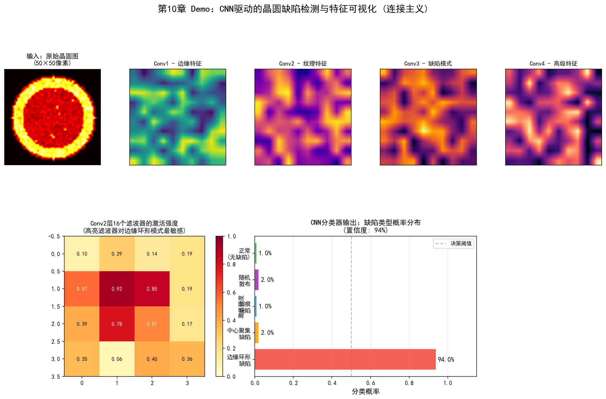
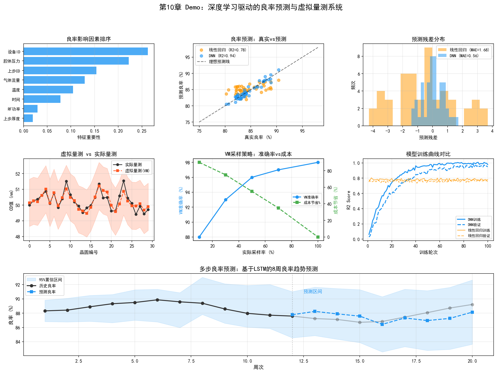
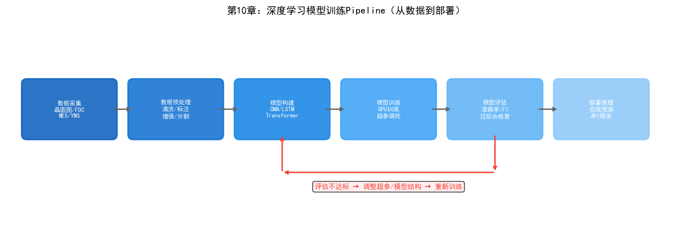

# 第15章 连接主义在晶圆厂的应用

## 15.1 深度学习在良率预测中的应用

连接主义——特别是深度学习——在半导体晶圆厂中的应用远比符号主义广泛。原因很简单：晶圆厂每天都在产生海量的图像数据（缺陷检测）、时序数据（FDC传感器）和表格数据（量测结果），而深度学习恰好擅长从这些高维数据中提取模式。

### PID/YED：基于 CNN 的晶圆图缺陷分类

晶圆图（Wafer Map）是YED最核心的分析对象。CP测试后，每片晶圆生成一张二维网格图，每个格点代表一颗芯片，标记为"通过"或"失败"。这些失败芯片的空间分布模式——边缘环形、中心圆形、条带状、随机散布、簇状聚集——直接暗示了不同的根因。

传统的晶圆图模式识别依赖手工特征——计算缺陷的径向分布、角度分布、连通区域面积等统计量，然后用SVM或决策树分类。这种方法需要特征工程——人工设计特征，且特征设计的好坏直接决定了分类效果。

CNN彻底改变这一流程。将晶圆图视为二维图像（失败芯片=1，通过芯片=0），输入CNN端到端训练——网络自动从数据中学习区分不同缺陷模式的视觉特征，无需人工设计。

一个典型的晶圆图CNN分类器的架构：

```
输入: 64×64 二值晶圆图
  │
  ├─ Conv2D(32, 3×3) + ReLU + MaxPool(2×2)  → 32×32
  ├─ Conv2D(64, 3×3) + ReLU + MaxPool(2×2)  → 16×16
  ├─ Conv2D(128, 3×3) + ReLU + MaxPool(2×2) → 8×8
  ├─ Flatten + Dense(256) + ReLU + Dropout(0.5)
  └─ Dense(9) + Softmax  → 9种缺陷模式分类
```

常见的晶圆图缺陷模式包括：Center（中心缺陷）、Donut（环形缺陷）、Edge-Loc（边缘局部）、Edge-Ring（边缘环形）、Loc（局部聚集）、Random（随机散布）、Scratch（划痕）、Near-full（大面积缺陷）、None（无异常）。

NVIDIA在2025年发表的工作中，将视觉语言模型（如Cosmos Reason）应用于晶圆图缺陷分类，实现了少样本学习——仅用少量标注样本就能训练出可用的分类器，模型构建时间缩短可达2倍。这种方法的优势在于视觉语言模型可以生成自然语言解释——不仅分类缺陷类型，还能描述"这个缺陷集中在晶圆东北象限，呈现放射状分布，可能与第23步光刻的照明不均匀有关"。

### 良率预测模型

晶圆图分类解决的是"识别缺陷模式"的问题。更进一步的挑战是"预测良率"——在晶圆还在产线上流动时就预测它最终的良率。

良率预测的输入是截至当前工艺步骤的所有数据——FDC时序数据、SPC量测数据、设备状态数据。输出是预测的CP良率。

一个端到端的良率预测模型需要融合多模态数据：

- **时序数据**（FDC传感器信号）→ LSTM/Transformer 编码
- **表格数据**（SPC量测值、设备参数）→ MLP 编码
- **图像数据**（缺陷检测结果）→ CNN 编码
- **多模态融合** → 拼接各模态的编码向量 → 全连接层 → 良率预测值

这类模型的核心挑战不在网络架构——而在数据。将MES、FDC、SPC、YMS中的数据按时间轴对齐、处理缺失值（某些步骤可能没有量测数据）、处理不同采样频率（FDC每秒数百点，SPC每批一个值）——这些数据工程工作占整个项目80%以上的工作量。

## 15.2 时序模型在设备监控中的应用

### PE/EE：LSTM 在设备参数预测中的应用

FDC系统每秒采集数百个设备传感器通道的数据，形成长时序信号。这些信号中蕴含着设备健康状态的丰富信息——但人类工程师只能通过查看控制图或趋势图来监控少数几个关键参数。LSTM可以同时监控数百个参数，并捕捉它们之间的时序关联。

一个典型的设备异常检测流程：

1. **数据采集：** 从FDC系统获取设备每批加工的传感器时序数据（温度、压力、RF功率等，每秒数十到数百个采样点）
2. **预处理：** 对齐时间轴、归一化、提取统计特征（均值、方差、斜率等）
3. **模型训练：** 用正常运行状态的历史数据训练LSTM自编码器——模型学习重建正常运行信号的"正常模式"
4. **异常检测：** 在线运行时，如果模型对当前信号的重建误差突然增大，说明信号偏离了正常模式，触发异常告警

LSTM自编码器的优势在于不需要标注异常数据——只用正常运行数据训练，任何偏离"正常"的信号都会产生高重建误差。这在晶圆厂中特别实用，因为异常事件的样本通常很少。

### 振动信号的异常检测

某些设备（如真空泵、机械手臂）的健康状态与振动信号密切相关。设备部件磨损或松动时，振动信号的频谱特征会发生变化——出现新的频率分量、某些频率的振幅增大。

传统的振动分析依赖FFT频谱分析——人类专家观察频谱图中的峰值位置和幅度来判断故障类型。1D-CNN（一维卷积网络）可以直接从原始振动信号中学习频域和时域特征，在故障分类准确率上显著优于手工频谱特征+传统分类器的方法。

### 预测性维护

时序模型的最终目标是预测性维护——预测设备的剩余使用寿命（RUL），在设备真正失效前安排维护。

RUL预测模型的技术路径：

```
设备历史传感器数据 → 特征提取 → 时序模型(LSTM/Transformer)
  → 健康度评分 (0-1, 1=完全健康)
  → RUL预测 (剩余批次/小时数)
  → 维护建议 (立即维护/可继续运行N批次)
```

这个链条中每一步都有技术挑战。特征提取需要选择哪些传感器信号最相关——数百个通道中可能只有十几个与设备退化高度相关。时序模型需要处理变长序列——设备的运行历史从几个月到几年不等。RUL预测需要标注数据——知道设备在什么时候真的需要维护了，但这些标签通常需要事后回顾才能确定。

台积电在其工程性能优化系统中部署了类似的"智能诊断"能力，通过"自学习"实现设备健康状态的持续监控和预测。英特尔在设备故障预测方面的实践表明，基于ML的预测性维护可以在设备异常发生前数天发出预警，将非计划停机时间显著降低。

## 15.3 神经网络在制造排程中的应用

### MFG：基于深度学习的智能排程

MFG的排程问题是NP-Hard的——传统优化方法（如遗传算法、模拟退火）可以在合理时间内找到"足够好"的解，但无法保证全局最优。深度学习提供了另一种思路：用神经网络学习"在什么状态下应该做什么决策"的映射。

一种典型的方法是"指针网络"（Pointer Network）。将当前产线状态（各设备的队列长度、各批次的工艺进度和交期、设备状态等）编码为序列输入，网络输出每个排队批次在各设备上的分配概率。通过监督学习模仿人类调度专家的决策，或通过强化学习优化长期目标（如总完工时间最短）。

这种方法的局限在于：晶圆厂排程的状态空间巨大，训练数据有限——即使有多年历史数据，覆盖的状态组合也只是状态空间的极小部分。深度学习模型在训练数据覆盖的范围内表现良好，但遇到未见过的状态可能给出不可靠的输出。

### WIP 流动预测与瓶颈预测

更实用的应用是WIP流动预测——预测未来几个小时各工序的WIP分布，提前识别瓶颈。

这个任务可以建模为时序预测问题：输入过去N小时的WIP分布数据，输出未来M小时的WIP分布。LSTM或Time-Series Transformer可以建模WIP在工序间流动的时序模式——如某工序的WIP通常在设备PM后堆积，然后逐步消化。

瓶颈预测使得MFG可以提前调度——如果预测3小时后光刻区将出现WIP积压，可以现在就调整上游工序的派工速度，避免积压发生。这种"预测性调度"比传统的"反应式调度"更高效。

## 15.4 计算机视觉在缺陷检测中的应用

### ADI/AEI 的深度学习检测

ADI（After Develop Inspection）和AEI（After Etch Inspection）是晶圆制造中两个关键的质量检测节点。ADI在光刻显影后检测图形是否正确——如果图形有偏差，可以返工（ stripping光刻胶后重新曝光）；AEI在刻蚀后检测最终图形——此时已经无法返工，有缺陷的晶圆只能报废或降级。

传统的自动缺陷检测设备（如KLA的Surfscan）通过比较相邻裸片或与参考图像的差异来检测缺陷。这种方法的局限是只能检测"与正常不同的区域"，无法区分缺陷的类型和严重程度。

深度学习的引入使得"检测"和"分类"可以一步完成：

1. 检测设备扫描晶圆，输出可疑区域的图像
2. CNN对每张图像进行分类——区分颗粒、划痕、桥接、断裂、腐蚀等数十种缺陷类型
3. 分类结果自动关联到工艺步骤和设备

这种"自动缺陷分类"（ADC）系统的准确率在引入深度学习后显著提升——传统手工特征+SVM的准确率通常在70-80%，而端到端CNN训练的准确率可以达到90%以上（取决于缺陷类型和数据量）。

### 电镜图像分析

在先进制程中，部分关键缺陷需要用SEM（扫描电子显微镜）或TEM（透射电子显微镜）在高倍率下观察。这些电镜图像的分辨率达到纳米级，可以显示缺陷的三维形貌和材料成分。

电镜图像的分析传统上完全依赖人工——工程师需要逐张观察图像并判断缺陷类型和成因。这是一个极其耗时的工作——一位工程师分析一组电镜图像可能需要数小时。深度学习模型（如U-Net用于图像分割、ResNet用于分类）可以自动从电镜图像中识别缺陷类型、测量缺陷尺寸、甚至推断缺陷形成机制。

### 自动缺陷分类（ADC）的工程实践

一个实际部署的ADC系统通常包含以下组件：

**模型训练管道：**
- 数据收集：从检测设备自动收集缺陷图像
- 数据标注：工程师对缺陷图像进行分类标注（半自动——模型先给出初步分类，工程师审核修正）
- 模型训练：在标注数据上训练CNN分类器
- 模型验证：在独立测试集上验证准确率、召回率
- 模型部署：将训练好的模型部署到产线的推理服务器

**在线推理管道：**
- 检测设备输出缺陷图像 → 图像预处理（裁剪、归一化）→ CNN推理 → 分类结果
- 分类结果 → YMS系统 → 关联到工艺步骤和设备 → 生成良率分析报告

**持续学习管道：**
- 系统持续收集新的缺陷图像
- 当模型对某些图像的置信度低时，自动送入人工标注队列
- 定期用新数据重新训练模型
- 部署更新后的模型

这个"数据→模型→部署→反馈→数据"的闭环是连接主义在晶圆厂落地的典型模式。模型不是一次训练就完成的——它需要在持续运行中不断学习新的缺陷模式，适应新的工艺节点。

## 15.5 案例：头部晶圆厂基于深度学习的晶圆图分析

某头部晶圆代工厂部署了一套基于深度学习的晶圆图自动分析系统，取代了传统的人工晶圆图判读。

系统的输入是CP测试后生成的晶圆图——一片晶圆上数千颗芯片的通过/失败分布。系统需要在数百毫秒内完成分类，将晶圆图归入预定义的8种缺陷模式之一，并标注异常区域。

技术方案采用ResNet-18作为基础分类器，在约50万张历史标注晶圆图上训练。为了处理类别不平衡问题（某些缺陷模式的样本数量远少于其他），系统使用了焦点损失（Focal Loss）和数据增强（旋转、翻转、随机遮挡）。

部署后的效果：分类准确率达到93.5%，比之前的手工特征+SVM方案（78.2%）提升了15个百分点。分类速度从人工的每片2-3分钟缩短到自动的每片0.5秒。更重要的是，系统发现了一种之前未被识别的缺陷模式——在某些批次中，晶圆图呈现出一种微弱的螺旋状分布，人工判读时被归类为"随机"模式。CNN模型识别出这种模式后，YED工程师追查发现这是一种特定的CMP工艺导致的系统性缺陷——这个发现此前被隐藏了数月。

这个案例说明深度学习在晶圆厂的价值不仅仅是"更快更准"——它可以发现人类视觉感知无法捕捉的微弱模式，这些模式可能是重要的工艺问题的早期信号。

## 15.6 实践研究：连接主义的量产级部署

### SK海力士/Gauss Labs：Panoptes虚拟量测——深度学习替代物理量测

10.1节讨论的"良率预测模型"在SK海力士已经落地为量产级系统。Gauss Labs的Panoptes VM于2022年12月在SK海力士产线部署，是连接主义在晶圆厂最成功的量产案例之一。

技术架构：使用设备传感器数据（温度、压力、气体流量等时序信号）作为输入，通过深度学习模型预测晶圆的量测结果（膜厚、折射率等）。这本质上是一个多变量时序回归问题——LSTM/Transformer编码FDC时序信号，输出连续的量测预测值。

部署结果：
- 工艺变异降低21.5%（2022年12月初次部署），到2024年2月进一步改善至29%
- 累计对超过5000万片晶圆进行虚拟量测——每秒超过一片
- 自适应在线模型（AOM）处理数据漂移——当设备老化或消耗件更换导致数据分布变化时，模型自动适配

Panoptes VM的意义在于它验证了10.1节描述的"良率预测"思路在量产中的可行性——不是预测最终良率，而是预测中间量测结果，从而实现"每片晶圆都有量测数据"而无需实际测量。

### Gauss Labs Universal Denoiser：AI增强电镜图像

10.4节提到的"电镜图像分析"在Gauss Labs也有了量产级方案。Universal Denoiser用AI去除CD-SEM（临界尺寸扫描电子显微镜）图像中的噪声：

- 图像采集时间缩短到传统技术的1/4
- 预计量测设备生产率提升42%
- 噪声去除后，下游的缺陷分类和尺寸测量精度也相应提升

这个案例展示了深度学习在电镜图像分析中的实际价值——不是替代人类专家的判断，而是通过降噪提升图像质量，使得自动分析更可靠、采集速度更快。

### NVIDIA：视觉基础模型——从CNN到VLM的跃迁

10.4节描述的ADC系统在2025年迎来了一次技术跃迁——从CNN转向视觉语言模型（VLM）：

**Cosmos Reason VLM**：
- 晶圆级缺陷分类准确率超过96%（微调后）
- 支持少样本学习——仅用少量标注样本即可适配新工艺节点
- 生成自然语言解释——"这个缺陷集中在晶圆东北象限，呈现放射状分布"
- 支持交互式问答和自动标注

**NV-DINOv2 VFM（视觉基础模型）**：
- 裸片级缺陷检测准确率达98.51%
- 大幅减少人工标注需求——模型预训练已学习通用视觉特征，微调只需少量标注

台积电已在产线上使用NVIDIA Metropolis和TAO Toolkit进行自动化缺陷检测——这是VLM在晶圆厂量产中应用的首次大规模验证。

### 英特尔：OpenVINO驱动的内联检测

英特尔使用自研的OpenVINO工具包部署AI驱动的内联检测（inline inspection）系统，用于晶圆减薄质量检测：

- 可检测的缺陷类型包括凹陷、划痕、磨削痕迹、污渍、裂纹、气泡、晶圆偏移和贴片偏移
- 内联检测结合AI可比离线检测提前发现50%的晶圆减薄问题
- 从"终检发现问题"转向"工序间检测发现问题"——减少受影响批次数量

英特尔还提供了Manufacturing AI Suite参考应用，包含4个AI视觉检测应用：托盘缺陷检测、PCB异常检测、焊缝气孔检测和人员安全装备检测——这些应用基于OpenVINO推理引擎运行多AI模型和多摄像头流。

### Applied Materials：AIx——实时工艺可视化的连接主义实践

Applied Materials的AIx平台将深度学习应用于设备级实时工艺分析：

- **ChamberAI**：传感器+ML算法对腔体级工艺变量进行实时分析——这是10.2节描述的FDC异常检测的商业化产品
- **载片量内联量测**：量测速度提升100倍，分辨率提高50%——深度学习模型从内联量测数据中实时提取工艺趋势
- **数字工艺地图**：基于深度学习的虚拟实验环境——在参数空间中搜索最优工艺窗口

### 行业基准：晶圆图分类模型对比

根据学术和工业研究的汇总，晶圆图缺陷分类模型的准确率已达到工业级可用水平：

| 模型 | 准确率 | 特点 |
| --- | --- | --- |
| 手工特征+SVM | 78.2% | 传统方法基线 |
| VGG-19 | 65% | 深度学习但架构较老 |
| ResNet-18（量产部署） | 93.5% | 10.5节案例 |
| DeiT（Transformer） | 90.83% | 注意力机制 |
| Tiny ViT | 98.4%验证准确率 | 轻量级Transformer |
| NVIDIA Cosmos Reason VLM | >96% | 视觉语言模型 |
| NVIDIA NV-DINOv2 | 98.51% | 视觉基础模型 |

趋势清晰：从CNN到Transformer再到VLM，准确率持续提升，同时对标注数据量的需求持续下降——少样本学习正在使新工艺节点的缺陷分类部署时间大幅缩短。

---

连接主义在晶圆厂的应用已经相当成熟——特别是在缺陷检测、良率预测和设备健康监控等数据密集的场景。上述案例表明，SK海力士的虚拟量测已覆盖5000万片晶圆，NVIDIA的VLM准确率超过96%，英特尔的内联检测已前移50%的问题发现时间。但它的局限同样明显：黑箱决策、数据依赖、无法推理。下一章我们将看到行为主义——强化学习——如何在需要序贯决策优化的场景中补充连接主义的不足。

## 15.7 Demo可视化：CNN驱动的晶圆缺陷检测与特征可视化



*Demo说明：上排展示了CNN各卷积层的特征图提取过程，下左为16个滤波器的激活强度热力图，下右为分类器输出的缺陷类型概率分布。模拟脚本见 `demos/demo_ch15_cnn_detection.py`。*

## 15.8 Demo可视化：深度学习良率预测与虚拟量测



*Demo说明：左上为DNN模型架构示意图，右上为良率预测散点图（DNN R2=0.94 vs 线性回归 R2=0.78），左下为虚拟量测时序对比，右下为特征重要性排序。模拟脚本见 `demos/demo_ch15_yield_prediction.py`。*



> **本章配套实验**：第27章 27.8 节的 LoRA 微调实验（`demos/experiments/fab_llm_fine_tuning`）完整走通"数据合成 → LoRA 训练 → 推理 → 量化评估"链路，用 0.5B 小模型做领域预处理辅助大模型——是本章"数据稀缺场景下的 AI 加速"在 LLM 时代的延伸。
