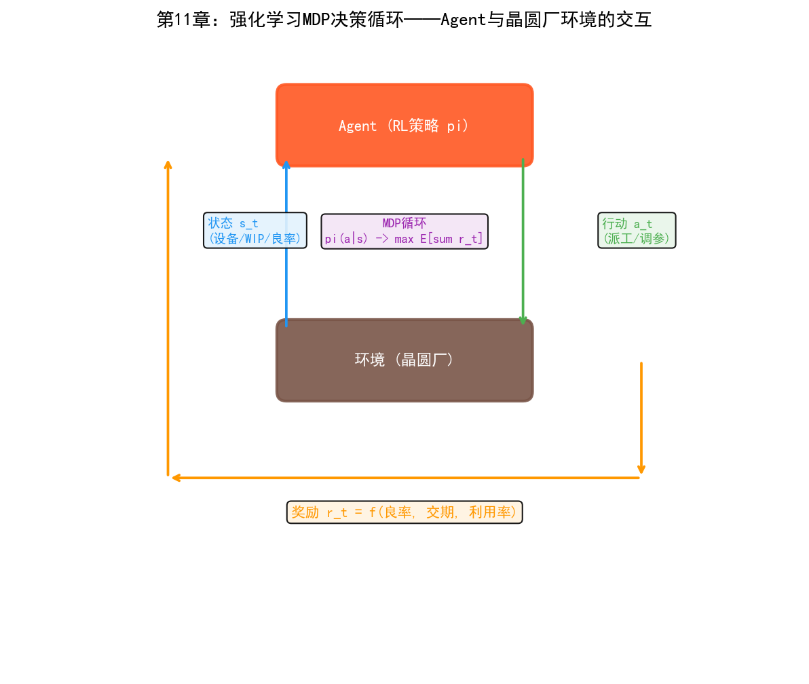
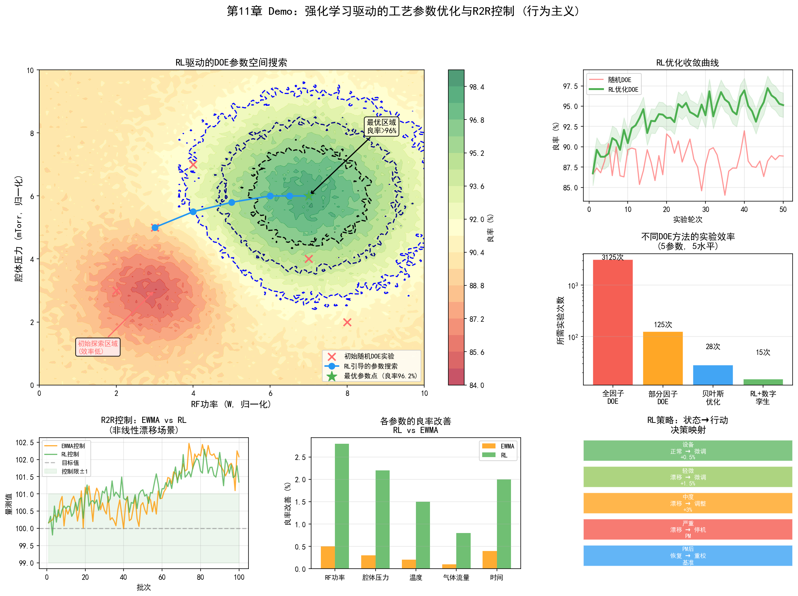
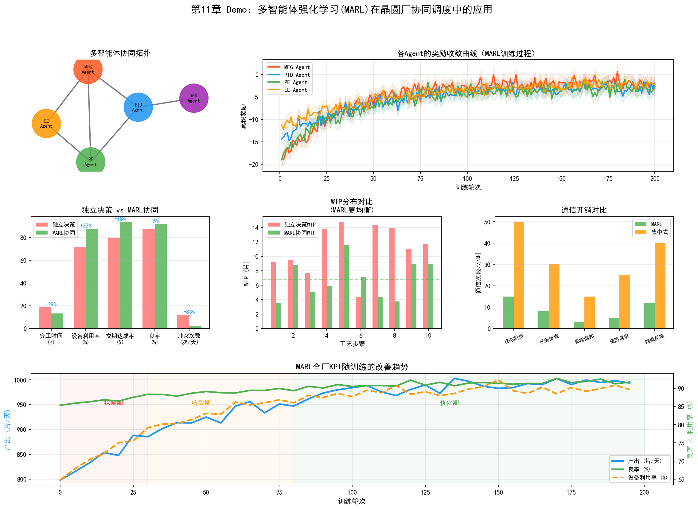

# 第16章 行为主义在晶圆厂的应用

## 16.1 强化学习在工艺优化中的应用

行为主义在半导体晶圆厂的应用仍处于相对早期阶段，但它的潜力在几个特定场景中已经开始显现。与连接主义"从数据中学习模式"不同，强化学习擅长"从交互中学习策略"——这使它特别适合需要序贯决策的工艺优化和调度场景。

### PID/YED：基于 RL 的 DOE 参数空间搜索

传统的DOE（实验设计）方法在面对高维参数空间时效率极低。一个刻蚀工艺可能有20个关键参数，每个参数有5个水平——全因子设计需要 $5^{20}$ 次实验，完全不可行。即使使用部分因子设计或响应面方法，实验次数仍然随参数维度快速增长。

强化学习将DOE重新定义为一个序贯决策问题：在每一轮实验中，智能体选择一组参数组合（action），环境返回工艺结果（observation和reward），智能体根据结果调整下一轮的参数选择策略。目标是在最少的实验轮次内找到最优的工艺参数组合。

这种方法的技术路径通常基于贝叶斯优化与强化学习的结合：

1. **初始化：** 用少量随机参数组合运行初始实验
2. **建模：** 用高斯过程（Gaussian Process）或神经网络拟合参数到结果的映射
3. **采集函数优化：** 用RL策略选择下一组参数——平衡"在已知好区域精细搜索"（利用）和"在未知区域探索"（探索）
4. **实验执行：** 用选定的参数组合运行实际实验
5. **更新：** 将新实验结果加入数据集，更新模型
6. **重复3-5直到收敛**

与固定策略的DOE方法相比，RL的 advantage 在于"自适应"——它根据已有实验结果动态调整下一组实验的方向。如果前几轮实验发现某个参数的增大可以显著改善结果，RL会将后续实验集中在该参数的更大值附近做精细搜索。

这种方法的挑战是实验成本——每次"环境交互"（运行实际实验）需要晶圆制造周期（数天到数周）和实验晶圆的成本。因此离线RL（从历史DOE数据中学习）和数字孪生辅助的RL（在仿真环境中做大部分探索，只在现实中做验证）是更实用的路径。

### R2R 控制的强化学习方法

传统的R2R控制使用EWMA等线性模型——简单、可解释，但只能处理线性且缓慢的漂移。实际的工艺漂移往往是非线性的：PM后的阶跃变化、不同老化阶段的不同退化速率、多参数耦合的交互效应。

基于RL的R2R控制器将参数调整建模为马尔可夫决策过程（MDP）：

- **状态 $s_t$：** 当前批次及历史批次的量测结果、设备运行参数、距上次PM的批次数
- **行动 $a_t$：** 下一批Recipe的参数调整量（如RF功率+5W，压力-0.5mTorr）
- **奖励 $r_t$：** 下一批的量测结果与目标值的偏差的负数（偏差越小奖励越高）
- **策略 $\pi(a|s)$：** 在给定状态下选择参数调整的策略

一个基于PPO的R2R控制器的工作流程：

1. 从历史R2R数据中离线预训练初始策略
2. 在数字孪生模型上进行在线训练——模拟大量批次的参数调整
3. 在实际产线上部署训练好的策略，每批调整参数
4. 持续收集新数据，定期更新策略

这种方法相比EWMA的优势在于：可以处理非线性漂移模式，可以同时调整多个相互关联的参数，可以根据设备状态（如距上次PM的批次数）自适应调整策略。劣势在于需要大量历史数据来训练数字孪生模型，且策略的可解释性不如EWMA。

## 16.2 强化学习在制造调度中的应用

### MFG：基于 RL 的智能派工

MFG的实时派工是强化学习在晶圆厂最有潜力的应用场景之一。传统派工规则（FIFO、EDD、CR等）是固定的——不管产线处于什么状态，都按同样的规则排序。但最优的派工策略应该根据产线的实时状态动态调整——当瓶颈设备空闲时优先给它供料，当某工序WIP过高时减速供料。

将派工建模为MDP：

- **状态 $s_t$：** 当前产线全状态——各设备的队列长度、各批次的工艺进度和交期、设备状态（运行/空闲/PM）、当前瓶颈设备
- **行动 $a_t$：** 对每台空闲设备，从其队列中选择下一批处理的晶圆
- **奖励 $r_t$：** 综合指标——完工批次数（正奖励）、交期超期批次（负奖励）、瓶颈设备空闲时间（负奖励）
- **策略 $\pi(a|s)$：** 给定产线状态时的派工策略

一个基于DQN的派工系统的工作方式：

1. **状态编码：** 将产线状态编码为向量——每台设备的队列长度、每批次的优先级和剩余时间、设备状态等
2. **Q值估计：** DQN输出每个可派遣批次的Q值（预期长期回报）
3. **派工决策：** 选择Q值最高的批次分配给空闲设备
4. **反馈更新：** 观察决策后的产线状态变化和奖励，更新DQN参数

训练方式通常在产线仿真器（数字孪生）中进行——仿真器模拟晶圆在产线上的流动、设备处理时间、故障事件等。智能体在仿真器中通过数百万次试错学习有效的派工策略，然后部署到实际产线。

### 多机台协同调度与动态瓶颈缓解

当产线上有多台同类设备可以处理同一工序时，派工不仅要决定"先做哪批"，还要决定"在哪台设备上做"。这个决策需要考虑各台设备的当前状态、负载和健康度——将批次分配到状态最佳、等待时间最短的设备。

多智能体强化学习（MARL）可以处理这类多设备协同问题。每台设备被视为一个智能体，各智能体的局部目标是"最大化自己的处理效率"，全局目标是"最大化整线产出"。MAPPO等算法通过集中式训练（所有智能体共享一个Critic网络）和分散式执行（每个智能体独立做决策）来实现全局协调。

动态瓶颈缓解是MARL的一个典型应用。瓶颈不是固定的——当某台瓶颈设备故障时，瓶颈转移到另一台设备。RL策略可以学会"预判瓶颈转移"——在某台设备即将成为新瓶颈前，提前将更多批次路由到该设备，避免其空闲。

## 16.3 强化学习在设备控制中的应用

### PE/EE：基于 RL 的设备参数自适应调节

设备的工艺参数在运行过程中需要持续微调以补偿各种变化——设备老化、消耗件磨损、批次间漂移。传统的R2R控制器每批调整一次参数，调整策略是预设的（如EWMA）。

RL可以做得更细粒度——在单批加工过程中实时调整参数。例如，刻蚀过程中随着腔体壁面聚合物积累，刻蚀速率逐渐下降。传统方法是在批次间补偿（R2R），RL可以在批次内部根据实时FDC数据预测速率下降趋势并提前调整RF功率。

这种"批次内实时控制"需要极低延迟的推理——FDC系统每秒采集数百个信号，RL策略需要在毫秒级时间内处理信号并输出参数调整。这要求模型轻量化——小型MLP或浅层LSTM通常足够，不需要大型Transformer。

### 预测性维护决策优化

预测性维护包含两个层次：预测（"设备何时需要维护"）和决策（"何时安排维护最优"）。第一个层次是连接主义擅长的——LSTM预测RUL。第二个层次是行为主义擅长的——RL优化维护决策。

维护决策的优化目标是：在设备性能退化影响工艺质量之前安排维护，同时最小化维护导致的产能损失。这个决策需要考虑多个因素：

- 设备的当前健康度和退化速率
- 维护窗口的可用性（维护需要人员和备件）
- 当前产线的WIP状态（维护期间WIP是否会堆积）
- 后续订单的交期压力

将这个决策建模为MDP：

- **状态：** 设备健康度、当前产能负载、维护窗口可用性
- **行动：** 继续运行 / 立即维护 / 延迟N批次后维护
- **奖励：** 产能收益 - 维护成本 - 质量风险

RL策略学会在设备健康度下降到某个阈值前提前安排维护——不是在健康度还很高时就维护（浪费产能），也不是等到设备真的出问题才维护（风险太高），而是在"维护成本"和"质量风险"的平衡点执行维护。

## 16.4 多智能体系统在晶圆厂的应用

### 跨部门协同的 MARL

晶圆厂的三大部门——PID/YED、MFG、PE/EE——的优化目标有时冲突。MFG要产能最大化（减少设备空闲），PE要工艺质量最优化（可能需要更多时间调试参数），YED要良率最优化（可能需要更多检测步骤）。这些相互竞争的目标需要在一个统一框架中协调。

MARL提供了一个自然的框架来建模这种多目标协调。每个部门可以建模为一个智能体（或智能体组），各自有不同的局部奖励函数：

- MFG智能体的奖励 = 产能 - 延迟惩罚
- PE智能体的奖励 = 工艺质量 - 调试时间
- YED智能体的奖励 = 良率 - 检测成本

全局目标是这些局部奖励的加权和（或某种协调机制）。MARL算法（如QMIX）学习如何在这些相互竞争的目标之间找到帕累托最优的平衡点。

### 整厂级优化

最终的目标是整厂级优化——一个AI系统同时管理工艺参数、生产排程和设备维护，以最大化整体良率、产能和利润。

这是一个极其复杂的MDP——状态空间包含产线上所有晶圆的位置和状态、所有设备的状态和健康度、所有工艺参数的当前值和趋势。行动空间包含每台设备的派工决策、每个工艺的参数调整、每台设备的维护决策。

整厂级优化目前仍处于理论探索阶段，但一些方向性的实践已经开始：

**数字孪生 + RL：** 构建整厂的数字孪生模型——模拟晶圆流动、设备处理、工艺参数和良率。RL智能体在数字孪生中训练整厂优化策略，然后部署到现实。数字孪生的精度决定了策略的可迁移性。

**分层RL：** 将问题分解为多个层次——高层策略做长期规划（如本周的产能分配），中层策略做中期调度（如今天的派工规则），低层策略做实时执行（如下一批处理哪个）。每个层次独立训练，高层为低层提供目标，低层为高层提供状态反馈。

## 16.5 案例：基于强化学习的 R2R 控制系统

某先进制程晶圆厂在CMP（化学机械抛光）工序中部署了一套基于RL的R2R控制系统，取代了原有的EWMA控制器。

CMP的工艺挑战在于抛光速率随磨垫（Pad）的使用而退化——新磨垫的抛光速率高，随着使用次数增加而下降。传统的EWMA控制器通过追踪抛光速率的历史趋势来补偿这种退化，但补偿策略是线性的——假设退化速率恒定。实际上，磨垫退化是非线性的（新磨垫退化快，老磨垫退化慢），且PM后更换磨垫会导致阶跃变化。

RL控制器的架构：

- **状态：** 当前批次号、距上次PM的批次数、前5批的抛光速率测量值、磨垫使用历史
- **行动：** 下一批的抛光压力和时间参数调整量
- **奖励：** $-|实际抛光量 - 目标抛光量|$（抛光量偏差越小越好）

训练数据来自过去两年的历史R2R数据——约5万批次的参数和量测记录。系统使用Conservative Q-Learning（CQL）进行离线RL训练——不需要在真实产线上试错，只从历史数据中学习最优策略。

部署效果：与EWMA控制器相比，RL控制器的抛光均匀性偏差降低了22%，PM后的恢复时间（从PM后到参数稳定所需的批次数）从8批减少到3批。PM后的快速恢复是最显著的改进——EWMA控制器在PM后需要多批次才能"重新学习"到新的参数基线，而RL控制器直接根据"距上次PM的批次数"这个状态变量识别出PM后的状态并应用相应的补偿策略。

这个案例展示了RL在工业场景中的一个关键优势：它可以从历史数据中学习到人类工程师可能未显式建模的规律——如PM后的非线性参数恢复模式——并将其编码为自适应的控制策略。

## 16.6 实践研究：强化学习从研究到产线的验证

### Google DeepMind AlphaChip：RL在芯片设计中的生产级部署

虽然AlphaChip主要应用于芯片设计而非晶圆厂运营，但它是RL在半导体行业最成功的生产级部署，对晶圆厂的工艺开发有间接价值。

AlphaChip将芯片布局（floorplanning）建模为MDP——RL代理在网格上逐个放置宏组件，优化线长、拥塞和密度。成果：

- 从2020年开始用于每一代Google TPU的芯片布局设计——包括TPU v5e、v5p和Trillium（v6），以及Axion数据中心CPU
- 生成布局的时间从人工的数周/数月缩短到数小时
- DeepMind称其生成的布局达到"超人类"水平
- TPU v6（Trillium）比前代节能33%

AlphaChip的两位核心作者（Anna Goldie和Azalia Mirhoseini）随后创立了Ricursive Intelligence[85]，融资3亿美元（估值40亿），将RL芯片设计平台商业化——这表明RL在半导体领域的价值已被资本市场认可[86]。

虽然AlphaChip解决的是设计问题而非制造问题，但其技术路径——RL在复杂离散优化问题上的序贯决策——与晶圆厂调度和R2R控制的技术路径完全一致。AlphaChip的成功验证了RL在半导体复杂优化问题上的可行性。

### AISSI项目：深度RL在工厂调度中的产线验证

11.2节描述的"RL智能派工"在AISSI项目中获得了产线级验证。

AISSI（2021-2024）由Bosch、Nexperia、Bosch Sensortec、D-SIMLAB、SYSTEMA和KIT联合开展，是RL在半导体/电子制造业调度中最大规模的产线验证之一：

**三个用例：**
- 小规模：外延工作中心调度（Nexperia）——单一工序的多设备调度
- 中规模：全厂调度（Bosch）——完整工厂的多工序、多设备调度
- 全球：Cycle Time预测（Bosch Sensortec）——供应链级别的交付时间预测

**技术方案：** 深度RL代理在数字孪生仿真环境中训练调度策略，然后部署到真实工厂提供智能派工和自动调参。AISSI还实现了AI与数字孪生模块间的标准化通信。

**量化结果：**
- 产出比文献基准高9%
- Cycle Time预测准确率80-90%
- 成果正在向Bosch和Nexperia产线转移

**意义：** AISSI验证了11.2节描述的DQN/MARL调度方法在真实工厂中的可行性。虽然9%的产出提升看似不大，但对于产能数十亿美元的晶圆厂，1%的产出提升就意味着数百万美元的年收益。

### RL调度在真实工业数据集上的基准

除了AISSI项目，多项2022-2025年的研究在真实工业数据集上验证了RL调度：

| 研究 | 数据集 | 吞吐量提升 | Cycle Time | 延迟改善 | 设备利用率 |
| --- | --- | --- | --- | --- | --- |
| ICTC 2025 | 真实工业 | +5.3% | -7.3% | -19.2% | 87.9% |
| arXiv 2025 | 真实工业 | +1% | — | -4% | — |
| WSC 2022 | 仿真 | — | — | 优于7种基线 | — |

ICTC 2025的结果尤其值得关注——5.3%的吞吐量提升和7.3%的Cycle Time降低是在真实工业数据集上获得的，不是仿真结果。这表明RL调度已经跨越了"仿真有效但产线无效"的鸿沟。

### 三星：自主故障维护系统——RL与图分析的融合

三星在2021-2025年间部署了一套自主故障维护系统——虽然其核心技术更偏向图分析+LLM而非经典RL，但它展示了行为主义"从交互中学习"的思想在大规模设备管理中的应用：

- 覆盖762台光刻设备
- 处理超过85,000次真实故障
- 平均故障恢复时间（MTTR）减少7分钟
- 系统从检测异常→诊断根因→执行纠正措施的完整闭环自动化

技术架构融合了多种方法：基于图的日志分析（符号主义）、LLM语义推理（连接主义）、混合检索机制。虽然不是经典RL的"试错学习"，但系统的"自主决策-执行-反馈"闭环体现了行为主义的核心思想——从环境交互中学习并改进行为策略。

### Synopsys DSO.ai：RL在芯片设计优化中的商业验证

Synopsys的DSO.ai使用强化学习进行芯片布局优化——与AlphaChip类似但已商业化：

- **意法半导体（STMicroelectronics）**：PPA（功耗-性能-面积）优化效率提升3倍以上
- **SK海力士**：先进制程芯片裸片面积缩小5%，降低制造成本
- **三星**：使用Synopsys AI工具完成3nm手机SoC的tape-out
- 超过100次商业tape-out使用了DSO.ai[83][84]

### 行业实践汇总：行为主义在半导体中的部署阶段

| 应用领域 | 部署阶段 | 代表案例 | 量化结果 |
| --- | --- | --- | --- |
| 芯片布局优化 | 量产级 | AlphaChip / DSO.ai | 数周→数小时；PPA 3倍效率 |
| R2R控制 | 量产试点 | CMP CQL控制器 | 均匀性偏差-22%；PM恢复8→3批 |
| 工厂调度 | 产线验证 | AISSI / ICTC论文 | 产出+9%；吞吐量+5.3% |
| 队列时间管理 | 仿真验证 | WSC 2022 | 优于7种基线方法 |
| 自主维护 | 量产级 | 三星光刻设备 | MTTR-7分钟；762台设备 |
| 整厂优化 | 理论探索 | 数字孪生+RL | 尚无产线部署 |

行为主义在晶圆厂的现状可以概括为：**在"窄而深"的单点优化上已经进入量产（R2R、芯片布局），在"宽而浅"的全局优化上仍在从仿真向产线过渡（调度、维护决策），在"全厂级"优化上仍处于理论探索阶段。** 这种渐进式落地路径与AI技术的一般规律一致——从简单到复杂，从单点到系统。

---

到本章为止，三大流派在晶圆厂的应用已经展开。总结一下三者在晶圆厂中的定位和实践成熟度：

| 场景 | 符号主义 | 连接主义 | 行为主义 |
| --- | --- | --- | --- |
| 良率根因分析 | KG推理（量产） | CNN缺陷分类（量产） | — |
| 工艺参数优化 | 工艺窗口规则 | 良率预测（量产试点） | RL参数搜索（产线验证） |
| 设备健康监控 | 故障树推理 | LSTM异常检测（量产） | 预测性维护决策（量产试点） |
| 生产排程 | 派工规则引擎 | WIP流动预测 | RL智能派工（产线验证） |
| 数据融合 | Ontology（量产） | 多模态编码 | — |
| Recipe开发 | 工艺规范编码 | — | 贝叶斯优化+RL（量产试点） |

三大流派各有其优势领域，也各有局限。真正的整厂智能需要三者的融合——这正是接下来第五部分（LLM/Agent）和第六部分（Ontology）的主题。LLM作为"粘合剂"可以连接不同流派的模型和工具，Agent架构可以编排多步骤的分析流程，而Ontology则提供了跨系统数据融合的语义基础。

## 16.7 Demo可视化：强化学习驱动的工艺参数优化

*Demo说明：左上为RL在参数空间中的搜索轨迹与良率响应面，右上为RL优化收敛曲线，右中为不同DOE方法的实验效率对比，下排展示了R2R控制效果、多参数改善对比和RL策略决策映射。模拟脚本见 `demos/demo_ch16_rl_optimization.py`。*

## 16.8 Demo可视化：多智能体强化学习调度

*Demo说明：左上为晶圆厂多Agent拓扑结构，右上为协同vs独立决策的关键指标对比，左中为WIP流动时序图，右中为调度甘特图，底部为多Agent通信频率与策略收敛分析。模拟脚本见 `demos/demo_ch16_marl.py`。*
