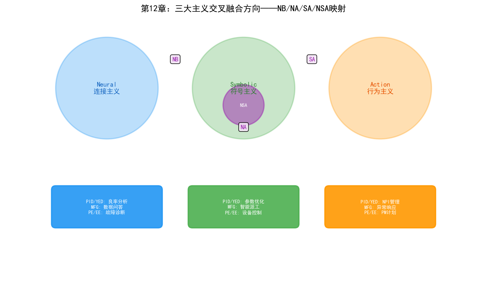

# 第17章 融合概论——三大主义的交叉与统一

## 17.1 为什么融合是大势所趋

前面三章分别讨论了符号主义、连接主义和行为主义在晶圆厂中的应用。三者在各自的擅长领域各展所长：符号主义擅长知识表示和逻辑推理，连接主义擅长模式识别和感知，行为主义擅长序贯决策和优化。

但任何一个流派单独使用时，都有明显的短板：

| 流派 | 擅长 | 短板 |
| --- | --- | --- |
| 符号主义 | 知识表示、逻辑推理、可解释性 | 无法从数据中学习、知识获取瓶颈 |
| 连接主义 | 模式识别、感知、泛化能力 | 黑箱决策、无法推理、幻觉问题 |
| 行为主义 | 序贯决策优化、自适应 | 样本效率低、需要精确的状态表示 |

更关键的是，晶圆厂的实际问题往往不是单一类型——一个良率问题可能同时涉及图像识别（连接主义）、知识推理（符号主义）和参数优化（行为主义）。当问题复杂到一定程度时，任何单一流派都无法独立解决。

### 晶圆厂问题的复合性

以一个真实的良率下降场景为例：

某3nm产品在连续3个批次中CP良率从94%下降到87%。YED工程师需要找到根因。这个问题涉及的AI能力包括：

1. **感知**（连接主义）：从晶圆图中识别缺陷模式——是边缘环形？中心聚集？还是随机散布？CNN可以在0.5秒内完成分类。
2. **推理**（符号主义）：从缺陷模式推断根因——边缘环形缺陷的根因是刻蚀边缘效应还是光刻边缘效应？需要知识图谱中的工艺因果规则来缩小范围。
3. **优化**（行为主义）：确定最优的参数调整方案——在多个可疑参数中，应该调哪些、调多少？RL策略可以基于历史数据推荐最优调整量。
4. **决策**（行为主义）：决定是否停线——继续生产的风险与停线损失的权衡。RL的MDP模型可以量化这个决策。

任何单一流派都只能解决其中一个环节。只有当四个环节打通时，良率问题才能被端到端地解决——从"发现问题"到"定位根因"到"执行修复"到"验证效果"。

## 17.2 三大融合方向与全融合

近年来，AI领域出现了一个清晰的趋势：**三大流派从各自为战走向交叉融合**。这种融合催生了四个极具潜力的"混合智能"方向：

### NB（Neural + Symbolic，神经符号融合）

用大模型（连接主义）做"直觉"和感知，用知识图谱（符号主义）做"理性"和逻辑约束。

典型应用："思维链"（CoT）、"工具调用"（Function Calling）。让大模型在推理时调用外部逻辑规则或知识库，弥补幻觉问题，实现可验证的逻辑推理。

类比：人类认知的"快思考"（系统1，直觉）与"慢思考"（系统2，理性）的结合。

### NA（Neural + Action，神经行为融合）

用深度学习（连接主义）做感知，用强化学习（行为主义）做决策优化。

典型应用：大模型+强化学习（如ChatGPT的RLHF），以及端到端自动驾驶、人形机器人控制。让智能体不仅"看得懂"，还能在真实世界"做得好"。

类比：人类的"感知-决策"闭环——眼睛看到障碍物（感知），大脑决定绕行路线（决策）。

### SA（Symbolic + Action，符号行为融合）

用符号规划（逻辑）生成任务序列，用行为主义模型（如PID控制、进化策略）在底层执行并抵抗不确定性。

典型应用：多智能体系统（Multi-Agent）、过载任务规划。用于应对复杂环境中"计划赶不上变化"的问题。

类比：人类的"规划-执行"架构——制定旅行计划（规划），根据实时路况调整路线（执行）。

### NSA全融合——多模态具身智能

将三者融为一体，构成"感知（视觉/听觉）—认知（推理/知识）—行动（物理交互）"的闭环。这是当前科技巨头竞相投入的**具身智能（Embodied AI）**和**世界模型（World Model）**的核心架构。

## 17.3 融合方向与晶圆厂三大部门的映射

三大融合方向并非抽象的学术概念——它们在晶圆厂的PID/YED、MFG、PE/EE三大核心部门中都有具体的应用场景：

| 融合方向 | PID/YED 应用 | MFG 应用 | PE/EE 应用 |
| --- | --- | --- | --- |
| **NB** | 可验证的良率根因分析 | 跨系统数据问答与生产报表 | 设备故障的"感知+诊断" |
| **NA** | 良率预测+参数优化 | 端到端智能派工 | 设备实时自适应控制 |
| **SA** | NPI项目管理与任务分解 | 异常响应流程自动化 | PM计划+自适应执行 |
| **NSA** | 全栈良率智能（感知→推理→优化→验证） | 自主制造运营 | 自愈设备系统 |

接下来的四个章节将逐一展开每个融合方向在三大部门中的具体技术路径和应用场景。

## 17.4 从AGI视角看融合的必然性

### AGI的"门槛"理论

对于AGI（通用人工智能），你可以这样理解：三大主义结合是跨过AGI"门槛"的最佳垫脚石。

单一流派的AI——无论多强大——都是"窄智能"：连接主义的LLM再强，也无法做可靠的逻辑推理；符号主义的推理引擎再精确，也无法从数据中学习新模式；行为主义的RL再优，也无法理解自然语言和领域知识。

只有当三者融合——感知能力（Neural）+ 知识与推理（Symbolic）+ 决策与学习（Action）——才能形成完整的智能闭环。这个闭环越紧密，AI就越接近"通用"——因为它不再依赖人类在某个环节做桥接。

### 跨过门槛之后的迷雾

但跨过门槛之后的风景，目前依然存在于科学探索的迷雾之中。

当前的NB、NA、SA和NSA融合都还处于早期——LLM+KG的推理能力远不及人类专家，Deep RL的样本效率仍然太低，符号规划+RL执行在真实复杂环境中的鲁棒性未经验证。从"三大流派的工程融合"到"真正的AGI"之间，可能还隔着一个或多个基础理论突破。

在半导体晶圆厂的语境下，这个判断更加务实：晶圆厂不需要AGI——它需要的是在特定场景中可靠工作的混合智能系统。NB融合的可验证良率分析、NA融合的端到端调度、SA融合的自主维护响应——这些"窄域混合智能"才是未来3-5年晶圆厂AI的落地重点。

### 当前的主旋律：技术路线的大一统

当前AI领域的主旋律是"技术路线的大一统"。

- OpenAI的GPT系列从纯连接主义的LLM，到加入RLHF（NA融合），到引入Function Calling和工具调用（NB融合），到o1/o3系列的推理能力（NSA融合方向）
- Google的Gemini从多模态感知（Neural），到结合搜索和知识图谱（Symbolic），到Agent能力（Action）
- Palantir的AIP平台将LLM（Neural）与Ontology（Symbolic）和Actions（Action）统一在一个架构中

在半导体行业，这个融合趋势同样在发生：

- 三星的自主制造系统融合了KG（Symbolic）+ LLM（Neural）+ 自主执行（Action）
- Palantir的Foundry + AIP将数据融合（Neural）+ Ontology推理（Symbolic）+ Action执行（Action）统一在Ontology架构中
- NVIDIA的Omniverse + cuLitho + Metropolis将数字孪生（仿真）+ 深度学习（Neural）+ 工艺优化（Action）融合在GPU加速平台上

当前的主旋律是"技术路线的大一统"。三大主义交叉结合所产生的混合智能和具身智能，是当下最清晰的科研方向。对于AGI，你可以理解为：三大主义结合是跨过AGI"门槛"的最佳垫脚石（大势所趋），但跨过门槛之后的风景，目前依然存在于科学探索的迷雾之中。

---

本章为接下来四章的融合方向建立了理论框架。第13-16章将分别深入NB、NA、SA和NSA融合方向，每个方向都将在晶圆厂三大核心部门（PID/YED、MFG、PE/EE）中展开具体的技术路径和应用场景。

> **本章配套实验**：两个实验分别对应本章两条融合路径——第27章 27.8 节的 LoRA 微调（`demos/experiments/fab_llm_fine_tuning`）演示连接主义方法与大模型的分工协作；27.3 节的 Ontology Text2SQL（`demos/experiments/fab_ontology_text2sql`）演示符号语义层如何约束 LLM 的生成行为。
