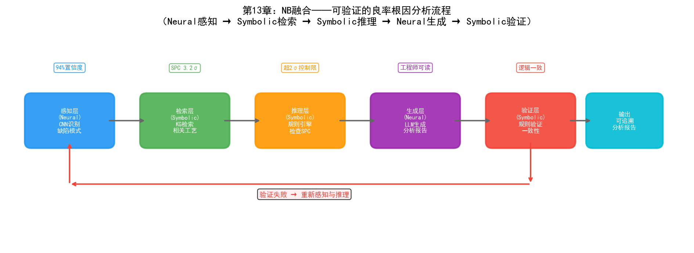
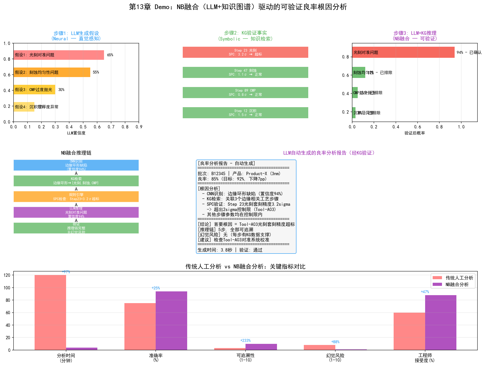

# 第18章 NB（Neural + Symbolic）——神经符号融合在晶圆厂的应用

## 18.1 核心思路：直觉与理性的结合

NB融合的核心思路是：用连接主义模型做"直觉"和感知，用符号主义模型做"理性"和逻辑约束。

这个思路源自对人类认知的双系统理论的类比。心理学家丹尼尔·卡尼曼在《思考，快与慢》中提出了人类认知的双系统模型：

- **系统1（快思考）**：直觉性、无意识、快速——对应连接主义的深度学习
- **系统2（慢思考）**：逻辑性、有意识、慢速——对应符号主义的推理引擎

深度学习（系统1）擅长从海量数据中快速提取模式——"看到这张晶圆图，直觉告诉我这是边缘环形缺陷"。但它不擅长逻辑推理——"为什么是边缘环形？因为边缘环形缺陷的根因通常是刻蚀腔体边缘效应，而当前这台设备的边缘效应参数在上周PM后偏移了0.3%"——这种因果推理需要符号主义的知识图谱和推理规则。

NB融合的目标是让AI同时具备"直觉感知"和"理性推理"的能力——让"快思考"负责识别模式、生成假设，让"慢思考"负责验证事实、约束推理。

## 18.2 技术路径

### 路径一：LLM + 知识图谱（RAG与Tool Use）

这是当前最主流的NB融合路径。大语言模型（连接主义）作为"直觉"引擎——理解自然语言、生成假设、识别模式。知识图谱（符号主义）作为"理性"引擎——提供事实约束、逻辑规则、可验证的推理链。

```
工程师提问："批次B12345良率下降的可能原因是什么？"

步骤1（LLM直觉）：
  LLM理解问题，生成初步假设——
  "可能是光刻对准问题、刻蚀均匀性问题或CMP过度抛光"

步骤2（KG验证）：
  知识图谱检索该批次的工艺历史——
  B12345经过Step 23（光刻）时设备Tool-A03的套刻精度SPC值为3.2σ
  B12345经过Step 47（刻蚀）时腔体压力偏离基准0.15mTorr
  B12345经过Step 89（CMP）时抛光量在目标范围内

步骤3（LLM+KG推理）：
  LLM结合KG返回的事实进行推理——
  "套刻精度3.2σ超出2σ控制限，是首要怀疑对象。
   该设备上周PM后基准偏移0.05μm，可能导致套刻精度漂移。
   建议检查Tool-A03的对准系统校准状态。"

步骤4（验证）：
  推理链可追溯——每个结论都有KG中的数据支撑
  没有幻觉——LLM不能编造KG中不存在的事实
```

这种"LLM生成假设→KG验证事实→LLM结合事实推理"的循环，是NB融合在晶圆厂中最自然的落地方式。

### 路径二：思维链（Chain-of-Thought, CoT）

思维链是NB融合的一种更轻量级的实现。不依赖外部知识图谱，而是在LLM的推理过程中显式注入逻辑步骤——让模型"一步一步思考"。

```
CoT输出：
  "让我一步步分析：
   1. 良率从92%降到85%，下降了7个百分点——非随机波动
   2. 晶圆图模式显示边缘环形缺陷——指向边缘相关工艺
   3. 涉及边缘的工艺步骤：Step 23（光刻）、Step 47（刻蚀边缘）、Step 89（CMP边缘）
   4. SPC数据显示Step 23的套刻精度为3.2σ——超出控制限
   5. 其他步骤参数在控制限内
   结论：首要根因是Step 23光刻的套刻精度超标"
```

CoT的本质是用自然语言模拟符号推理的过程——将隐含的推理步骤显式化。

### 路径三：神经符号约束学习

更深层的NB融合是在模型架构层面将符号约束嵌入神经网络——在训练过程中用符号规则约束神经网络的输出空间[97][98]。

例如，在晶圆图缺陷分类中，可以定义符号约束：

- "如果缺陷呈环形分布且位于晶圆边缘，则根因类别只能是{刻蚀边缘效应, 光刻边缘效应, CMP边缘效应}"
- "如果同一批次的多片晶圆都出现相同模式，则根因是设备级而非批次级"

这些约束在训练时作为正则化项——惩罚违反约束的输出。在推理时作为后处理——过滤掉不符合约束的预测。

## 18.3 在PID/YED中的应用



*图：NB融合的可验证良率根因分析流程——Neural感知→Symbolic检索→Symbolic推理→Neural生成→Symbolic验证*

### 可验证的良率根因分析

传统连接主义模型（如CNN晶圆图分类）可以识别缺陷模式，但无法给出根因——它只说"这是边缘环形缺陷"，不说"为什么"。NB融合方案构建了一条完整的可验证推理链：

```
CNN识别模式 → 知识图谱检索相关工艺参数 → 规则引擎推理根因 → LLM生成自然语言报告
```

具体流程：

1. **感知层（Neural）**：CNN对晶圆图进行分类，输出"边缘环形缺陷，置信度94%"
2. **检索层（Symbolic）**：知识图谱根据缺陷类型检索所有可能导致边缘环形的工艺步骤和设备
3. **推理层（Symbolic）**：规则引擎检查这些步骤的SPC数据——"Step 23的套刻精度为3.2σ，超出2σ控制限"
4. **生成层（Neural）**：LLM将推理结果转化为工程师可读的分析报告

整条推理链可追溯、可验证、可解释——每个结论都有KG中的数据支撑，不存在LLM幻觉风险。

### 缺陷分类与领域知识约束

传统CNN分类器可能输出违反工艺常识的结果——例如将CMP导致的缺陷分类为光刻缺陷。NB融合通过符号约束解决：

- 在训练阶段：将"缺陷位置→可能工艺步骤"的映射规则编码为损失函数的约束项
- 在推理阶段：CNN输出概率分布后，用规则过滤不可能的组合
- 结果：分类准确率提升的同时，逻辑一致性也得到保证

### 良率报告的自动生成与验证

YED工程师每周需要撰写良率分析报告——这传统上是一个耗时的人工任务。NB融合方案：

- LLM从MES、YMS、FDC中自动提取本周良率数据和异常事件，生成报告初稿
- 知识图谱验证报告中的每个数据点——"报告中说Tool-A03的OEE是85%，KG中该设备本周OEE确实为85.2%"
- 规则引擎检查报告的逻辑一致性——"报告说良率下降由刻蚀导致，但SPC数据显示刻蚀参数在控制限内，提示矛盾"
- LLM根据验证反馈修正报告

## 18.4 在MFG中的应用

### 跨系统数据问答

MFG管理者经常需要跨系统查询信息："Tool-A03上周的产能利用率是多少？它处理了哪些产品？有没有异常停机？"

这些信息散落在MES（批次记录）、FDC（设备状态）、ERP（工单信息）和维护系统（PM记录）中。NB融合方案：

- LLM理解自然语言提问，分解为子查询
- 知识图谱将子查询映射到对应系统并执行精确检索
- LLM将多个系统的返回结果整合为连贯的回答

这种方案比传统BI仪表盘更灵活——仪表盘只能展示预设的指标，而NB方案能回答任意问题。

### 生产报表自动化与合规验证

MFG需要每日生成生产日报——包含产出、良率、设备利用率、异常事件等。传统方式是工程师从多个系统导出数据，手工填入报表。

NB融合方案：

- LLM自动从各系统提取数据并生成报表文本
- 知识图谱验证报表数据的完整性和一致性——"今天的产出比昨天少15%，是否因为Tool-B05的PM导致？"
- 规则引擎检查报表是否遗漏必要信息——"今天有3批次异常但报表中只提到2批"

### 派工规则与ML预测的融合

传统派工系统使用固定规则（FIFO、EDD等），不考虑产线的实时状态。NB融合方案：

- 连接主义模型（LSTM）预测未来2小时的WIP分布和瓶颈位置
- 符号引擎（规则+约束）将预测结果转化为派工建议——"预测Step 45将在2小时后出现WIP积压，建议现在将批次B优先派遣到Step 45"
- 规则引擎确保派工建议满足工艺约束——"批次B必须先经过Step 30才能到Step 45"

## 18.5 在PE/EE中的应用

### 设备故障的"感知+诊断"

当设备出现异常时，传统流程是：FDC系统发出告警→EE工程师查看FDC数据→凭经验判断故障类型→查阅设备手册确认→执行维修。

NB融合方案将这个流程自动化：

- **感知（Neural）**：LSTM从FDC时序信号中检测到异常模式——"RF功率在最后30秒出现振荡"
- **诊断（Symbolic）**：知识图谱检索该异常模式对应的可能故障——"RF功率振荡可能原因：匹配器老化、电缆接触不良、腔体内等离子体不稳定"
- **验证（Symbolic）**：规则引擎检查相关传感器数据——"反射功率同步增大，指向匹配器老化"
- **建议（Neural）**：LLM生成维修建议——"建议检查RF匹配器的阻抗特性，优先测量匹配器电容值"

### Recipe优化与知识约束

PE在优化Recipe参数时，需要确保调整不违反工艺约束——某些参数组合虽然模型预测良率更高，但可能超出设备的安全操作范围。

NB融合方案：

- 连接主义模型（神经网络）预测不同参数组合下的工艺结果
- 符号约束（工艺规则）定义安全操作边界——"RF功率不能超过500W，腔体压力不能低于5mTorr"
- 模型在约束空间内搜索最优参数——既优化性能又不违反安全约束

### SPEC文档的智能检索与合规检查

晶圆厂的SPEC文档是符号化的——明确定义了每步工艺的参数范围和操作规则。但工程师在实际操作中可能遗漏或误解SPEC。

NB融合方案：

- LLM理解工程师的自然语言操作意图——"我想把刻蚀功率从300W调到350W"
- 知识图谱中的SPEC规则验证合规性——"Step 47的刻蚀功率SPEC上限为320W，350W超限"
- 如果违规，LLM生成解释性告警——"该步骤的功率SPEC上限为320W，建议调整到310W并验证刻蚀速率变化"

## 18.6 实践案例

### 三星：知识图谱+LLM的传感器异常检测

三星在自主半导体制造系统中使用KG+LLM实现了传感器命名对齐和异常检测。当设备维护后传感器信号发生变化时，知识图谱的社区检测帮助识别传感器间网络关系的微妙变化——发现了传统分析未发现的反应室外膜片传感器异常。三星的自主故障维护系统覆盖762台光刻设备、处理超过85,000次真实故障，MTTR减少7分钟。

### yieldWerx：根因知识图谱

yieldWerx的Root Cause Knowledge Graphs产品将KG直接应用于良率分析——可视化引导用户沿加权路径识别低良率批次的根因，AI和ML算法将分析时间从数小时缩短到分钟级。

### IKAS：Smart RCA平台

IKAS的Smart RCA平台融合多源数据（FDC、SPC、MES、YMS），使用Golden Tool/Path对比和AI关联分析——根因识别时间减少超过80%。

### Palantir AIP：NB融合的工业级架构

Palantir的AIP平台是NB融合在工业领域最系统化的实践——LLM（Neural）与Ontology（Symbolic）在架构层面统一。AIP的双支柱架构（知识树+ML）使得LLM的每一步推理都基于Ontology中的结构化数据，实现了"可验证的AI推理"。

> **本章配套实验**：第27章 27.19 节的思维链良率根因分析实验（`demos/experiments/llm_chain_of_thought_rca`）用 CoT 让 LLM 分步推理根因，并以符号规则校验结论，直接演示本节的神经符号融合与仲裁。

## 18.7 Demo可视化：NB融合（LLM+知识图谱）驱动的可验证良率分析



*Demo说明：上排展示了LLM假设生成→KG验证→推理结果的三步流程，中排为推理链可视化和LLM自动生成的分析报告，下排为传统人工分析与NB融合分析的指标对比。模拟脚本见 `demos/demo_ch18_nb_fusion.py`。*

---

NB融合在晶圆厂的价值核心是"可验证性"——让AI的分析结论不再是黑箱预测，而是每一步都有数据支撑和逻辑推理的可追溯链条。这对于良率分析、故障诊断等高可靠性场景至关重要——在这些场景中，一个错误的结论可能导致数百万美元的损失。
