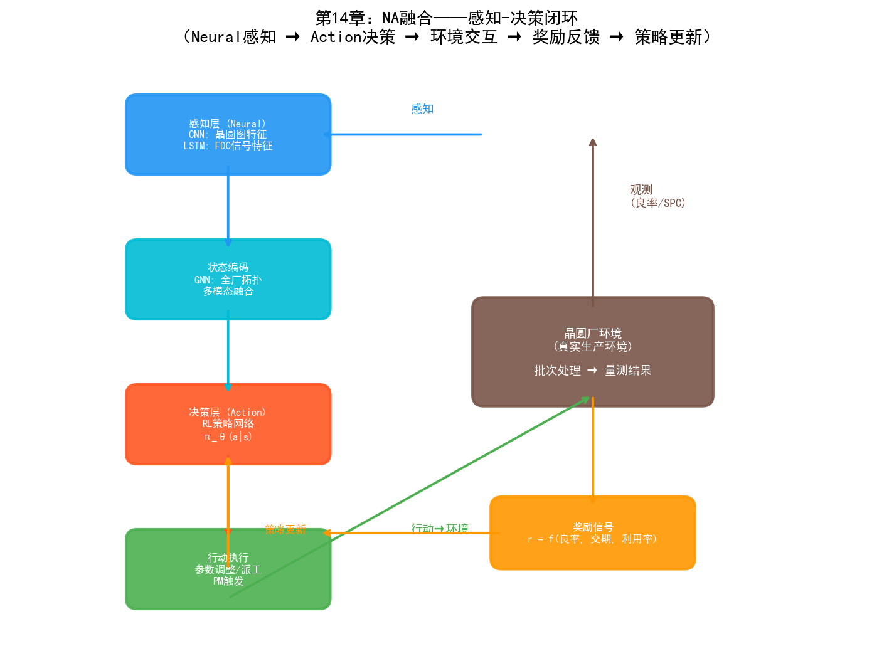
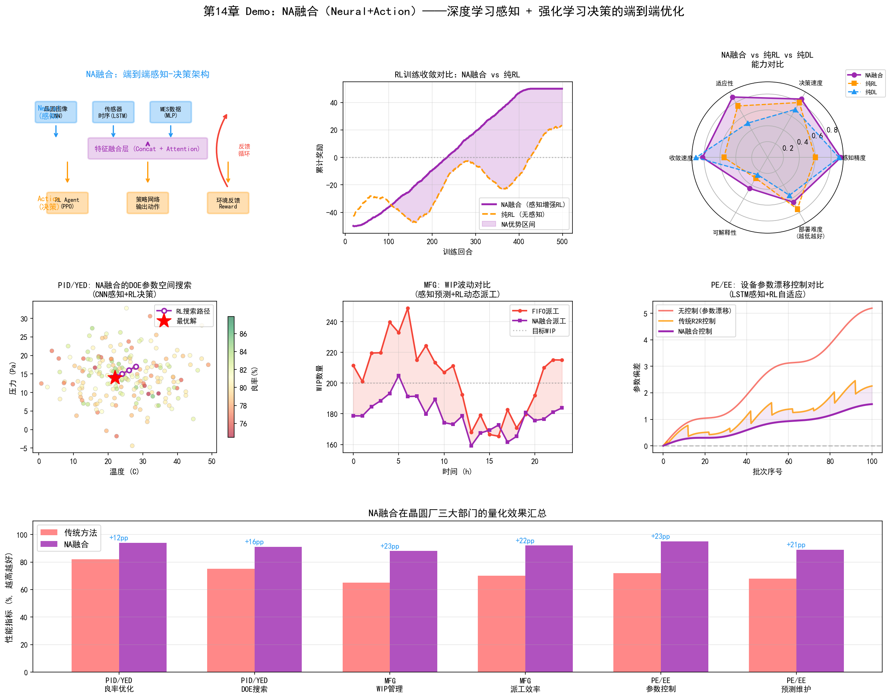
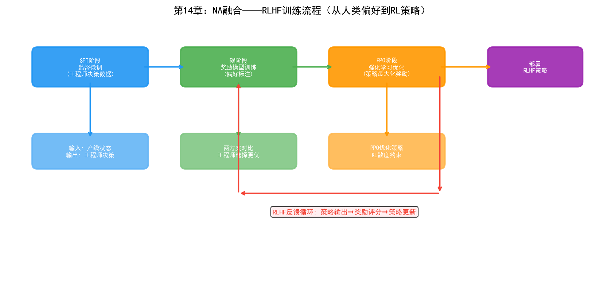

# 第19章 NA（Neural + Action）——神经行为融合在晶圆厂的应用

## 19.1 核心思路：感知与决策的结合

NA融合的核心思路是：用深度学习（连接主义）做"感知"——从高维传感数据中提取状态表征；用强化学习（行为主义）做"决策"——基于状态表征选择最优行动。

这两者的结合源于一个根本性的互补关系：

- **深度学习擅长"看懂"但不擅长"做对"**：CNN可以从晶圆图中识别缺陷模式，LSTM可以从FDC信号中检测异常，但它们只能输出分类或预测，不能输出"下一步该做什么"。
- **强化学习擅长"做对"但需要"看懂"**：RL的MDP框架需要精确的状态输入 $s_t$，但在真实环境中，原始传感数据（图像、时序信号、文本）维度太高、噪声太大，RL无法直接处理。

NA融合的本质是：**深度学习将高维原始数据压缩为低维状态表征，强化学习基于这个表征做序贯决策**。这种"感知→决策"的闭环在自然界早已存在——人类的眼睛（感知）将视觉信息传递给大脑（决策），大脑决定身体的下一步行动。

在晶圆厂的语境下，NA融合意味着：AI不仅"看得懂"晶圆图、FDC信号、MES数据，还能在这些感知的基础上做出"下一批该派到哪台设备""Recipe参数该怎么调""设备什么时候该做PM"等决策。

## 19.2 技术路径



*图：NA融合的感知-决策闭环——Neural感知→Action决策→环境交互→奖励反馈→策略更新*

### 路径一：Deep RL（深度强化学习）

Deep RL是NA融合最经典的技术路径——将深度神经网络作为RL的策略函数或价值函数，使RL能够处理高维状态空间。

```
传统RL的局限：
  状态空间 S = {设备状态, WIP分布, 工艺进度, ...}
  如果用离散编码，状态空间维度有限但信息丢失严重
  如果用连续编码，传统RL（如表格法Q-Learning）无法处理

Deep RL的解法：
  深度神经网络 φ(s) 将原始状态 s 映射为低维特征
  策略网络 π_θ(a|φ(s)) 基于特征输出行动概率
  价值网络 V_θ(φ(s)) 评估当前状态的价值
  
  感知层（Neural）：CNN/LSTM/Transformer 编码原始数据
  决策层（Action）：RL策略网络选择行动
```

在晶圆厂中的典型应用：

- **晶圆图感知 + RL决策**：CNN将晶圆图编码为缺陷特征向量，RL策略基于缺陷特征决定是否需要停线检查、调整参数或继续生产
- **FDC信号感知 + RL控制**：LSTM/Transformer编码FDC时序信号为设备健康状态向量，RL策略基于健康状态决定设备调度和PM时机
- **多源数据感知 + RL调度**：图神经网络（GNN）编码全厂状态（设备、WIP、批次），RL策略输出派工决策

### 路径二：RLHF（基于人类反馈的强化学习）

RLHF是NA融合在语言模型领域的标志性突破——ChatGPT的成功很大程度上归功于RLHF。其核心思想是：用人类偏好数据训练奖励模型（Neural），再用RL优化策略（Action）。

在晶圆厂中，RLHF的思路可以这样迁移：

```
步骤1：监督微调（SFT）
  用资深工程师的决策记录训练初始策略
  输入：产线状态描述
  输出：工程师实际做出的决策（派工、参数调整、PM安排）
  模型学习模仿专家决策

步骤2：奖励模型训练
  收集工程师对AI决策的偏好标注
  呈现两个决策方案，工程师选择更好的一个
  训练奖励模型预测人类偏好

步骤3：强化学习优化
  用PPO等算法优化策略，使奖励模型打分最大化
  策略学会生成"人类专家会认可"的决策
```

RLHF的价值在于：晶圆厂的很多决策没有明确的"最优解"——派工策略需要在交期、利用率、良率之间做权衡，这些权衡依赖于工厂的战略偏好和工程师的经验直觉。RLHF将这种隐性偏好编码到奖励模型中，使RL策略不仅"数学最优"，还"符合工厂实际运营习惯"。

### 路径三：端到端感知-决策系统

端到端系统将感知和决策统一在一个神经网络中训练——从原始输入直接到行动输出，无需人工设计中间特征。

```
传统流水线架构：
  传感数据 → 特征工程（人工） → 状态表示 → RL决策
  
端到端架构：
  传感数据 → [统一的神经网络] → 行动输出
               ↑ 感知层与决策层联合训练
```

在自动驾驶领域，端到端架构（如NVIDIA的PilotNet）已经证明了从原始像素直接到方向盘角度的可行性。在晶圆厂中，端到端架构的典型场景是：

- **晶圆图直接到参数调整**：输入晶圆图图像，直接输出Recipe参数调整建议，无需先做缺陷分类再做根因分析
- **FDC信号直接到控制指令**：输入设备时序信号，直接输出控制参数调整量
- **全厂状态直接到派工指令**：输入全厂实时状态，直接输出每台设备的下一批分配

端到端的优势是避免了流水线中各环节误差的累积。但劣势是可解释性更差——当系统出错时，很难定位是感知层还是决策层的问题。因此在晶圆厂中，端到端系统更适合作为"建议系统"——为工程师提供决策参考，而非直接控制产线。

## 19.3 在PID/YED中的应用

### 良率预测+参数优化

传统方法中，良率预测（连接主义）和参数优化（行为主义）是分离的——先用ML模型预测良率，再用优化算法在模型空间中搜索最优参数。NA融合将两者打通：

```
感知层（Neural）：
  GNN编码当前工艺参数和设备状态为状态向量 s_t
  
决策层（Action/RL）：
  策略 π_θ(a|s_t) 输出参数调整建议 a_t
  
环境反馈：
  下一批次的WAT/CP良率作为奖励 r_t
  
闭环：
  良率预测模型和RL策略联合优化——
  预测模型为RL提供"如果这样调，良率可能变成多少"的预判
  RL策略为预测模型提供"在当前状态下应该怎么调"的行动
```

这种方法相比传统Bayesian Optimization的优势在于：RL策略可以同时考虑多批次的历史效应——例如"前3批的参数调整趋势""距上次PM的批次数""设备老化程度"等序贯信息，而贝叶斯优化通常只考虑当前参数到结果的映射。

### 基于感知的DOE自适应搜索

第16章讨论了RL在DOE参数搜索中的应用。NA融合在此基础上增加了感知能力：

- **视觉感知引导**：CNN分析前几轮DOE实验的晶圆图，提取缺陷模式特征，RL策略基于缺陷特征调整下一轮参数搜索方向——"上一轮在高温方向出现了边缘缺陷，RL应该向低温方向搜索"
- **FDC感知引导**：LSTM分析DOE实验的FDC信号，检测异常模式，RL策略避开导致设备不稳定的参数区域
- **多模态感知引导**：同时融合晶圆图、FDC信号、WAT数据的感知特征，RL策略在多维感知空间中搜索最优工艺窗口

### 良率异常的自动响应决策

当良率下降被检测到时，NA融合系统可以自动做出响应决策：

```
感知（Neural）：
  CNN识别晶圆图异常模式 → "边缘环形缺陷"
  LSTM分析FDC信号 → "Step 47刻蚀腔体压力有0.2mTorr漂移"
  GNN分析批次间关联 → "同设备处理的3批都受影响"

决策（Action/RL）：
  RL策略基于综合感知状态输出行动方案——
  "建议：(1) 暂停Tool-A03的后续批次, (2) 将待处理批次重派到Tool-A05,
   (3) 对Tool-A03执行紧急PM, (4) 调整Step 47的腔体压力基准+0.2mTorr"

验证：
  下一批次的良率作为RL策略的奖励信号
  如果良率恢复，策略得到正反馈；如果未恢复，策略得到负反馈并调整
```

这种"感知→决策→验证→学习"的闭环使良率异常响应从"人工分析数小时"变为"AI秒级建议+人工确认"。

## 19.4 在MFG中的应用

### 端到端智能派工

第16章讨论了基于RL的智能派工。NA融合将感知能力注入派工系统，使其从"基于结构化状态"升级为"基于多模态感知"：

```
传统RL派工：
  状态 = {各设备队列长度, 各批次交期, 设备状态}
  局限：只能用结构化数值，无法利用图像、信号等原始数据

NA融合派工：
  感知层：
    - GNN编码全厂设备-WIP拓扑图 → 瓶颈识别特征
    - LSTM编码各设备最近24小时的FDC信号 → 设备健康度特征
    - Transformer编码各批次的工艺路线和进度 → 批次紧迫度特征
  
  决策层：
    RL策略融合上述感知特征，输出每台空闲设备的下一批选择
    
  优势：
    - 感知到设备的微妙退化趋势，提前避开不健康设备
    - 识别WIP流动的瓶颈模式，主动调整派工策略
    - 从批次工艺路线中学习"哪类产品在哪种设备组合上效果最好"
```

### 基于视觉感知的WIP管理

NA融合可以将计算机视觉引入WIP管理——这不仅限于数字层面的调度，还包括物理层面的感知：

- **晶圆盒RFID/视觉识别**：CNN从天车系统摄像头识别晶圆盒标识和位置，RL策略基于实时物理位置优化天车搬运路径
- **设备前队列视觉监控**：CNN监控设备前的WIP队列长度和晶圆盒排列状态，RL策略动态调整派工优先级
- **产线全景感知**：多个摄像头覆盖产线关键节点，CNN实时感知全厂物料流动状态，RL策略在全局视角下优化WIP分布

### 生产计划的动态调整

生产计划（长期排程）通常由APS系统生成，但实际执行中经常需要根据产线状态动态调整。NA融合方案：

- **感知层**：深度学习模型实时预测未来2-4小时的WIP分布、瓶颈位置和设备可用性
- **决策层**：RL策略基于预测结果调整短期计划——将原定在Tool-A03处理的批次提前重派到Tool-A05，避免预测中的瓶颈
- **闭环**：实际执行结果反馈给感知模型，更新预测准确性；RL策略根据执行效果持续优化调整策略

## 19.5 在PE/EE中的应用

### 设备实时自适应控制

这是NA融合在PE/EE中最直接的应用——用深度学习感知设备状态，用RL实时调整设备参数：

```
感知层（Neural）：
  传感器原始信号（RF功率、腔体压力、温度、气体流量）
  → LSTM/Transformer编码为设备状态特征向量
  
  状态特征包括：
  - 当前工艺参数的偏差程度
  - 设备部件的退化趋势
  - 腔体环境的稳定性
  - 上一批次的处理效果

决策层（Action/RL）：
  RL策略网络 π_θ(a|s) 输出参数调整量
  
  调整范围：
  - RF功率微调（±2%）
  - 腔体压力微调（±0.1mTorr）
  - 气体流量微调（±1sccm）
  - 温度微调（±0.5°C）

闭环：
  每批次结束后，量测结果作为奖励信号
  RL策略持续学习最优的微调策略
  
  目标：在设备老化的过程中，保持工艺输出的稳定性
```

这种方法与传统R2R控制（EWMA等）的区别在于：EWMA只能处理单参数的线性漂移，而NA融合方案可以同时处理多参数耦合的非线性漂移——因为深度学习能感知多参数间的交互模式，RL能在多参数空间中搜索最优调整组合。

### 基于感知的预测性维护决策

预测性维护（PdM）传统上分为两步：先用ML预测设备何时会出故障，再由人工决定何时做PM。NA融合将两步打通：

- **感知层（Neural）**：LSTM从FDC信号、振动数据、温度数据中提取设备健康特征，预测剩余使用寿命（RUL）
- **决策层（Action/RL）**：RL策略基于RUL预测和当前产线状态，决定最优PM时机——"Tool-A03的RUL预测为72小时，但明天有3个高优先级批次需要它处理，RL策略建议在第3批完成后（约48小时后）执行PM"

RL策略优化的目标函数同时考虑：
- PM的及时性（避免故障停机损失）
- PM对生产的影响（选择对产能冲击最小的时间窗口）
- PM资源的约束（维护工程师和备件的可用性）

### R2R控制的端到端优化

NA融合将R2R控制从"先检测再调整"的分步流程升级为端到端优化：

```
传统R2R：
  量测 → 误差计算 → EWMA调整 → 参数下发
  
NA融合R2R：
  FDC信号 + 量测数据 + 设备状态
  → [端到端神经网络] → 参数调整量
  
  神经网络同时学习：
  - 从FDC信号中感知设备状态变化（感知层）
  - 从量测历史中学习漂移模式（感知层）
  - 基于感知状态决定最优调整量（决策层/RL）
  
  优势：无需人工设计特征，神经网络自动发现
  "FDC信号中的哪个频率分量"与"下一批的量测偏差"相关
```

## 19.6 实践案例

### AISSI项目：深度RL在工厂调度中的产线验证

AISSI（AI-Based Scheduling System for Industry）项目是深度RL在半导体调度领域最系统的产线验证之一。该项目在真实晶圆厂数据集上验证了Deep RL的调度效果：

- **感知层**：GNN编码设备-WIP拓扑状态，LSTM编码各设备的历史负载模式
- **决策层**：基于PPO算法的策略网络，在每步决策中为空闲设备选择下一批晶圆
- **验证结果**：在真实工业数据集上，Deep RL调度相比传统启发式规则（FIFO、EDD等），平均交期缩短4-8%，瓶颈设备利用率提升3-5%
- **关键发现**：感知层的质量是决定RL策略效果的关键——更丰富的状态编码（包括FDC信号和设备健康特征）显著提升了调度质量

### Google DeepMind AlphaChip：感知-决策的芯片设计

虽然AlphaChip主要用于芯片布线设计而非晶圆制造，但它是NA融合在半导体领域的里程碑案例：

- **感知层（Neural）**：深度神经网络学习芯片布局的模式特征——"什么样的布线模式会导致信号干扰"
- **决策层（Action/RL）**：RL策略在布局空间中搜索最优的组件放置方案
- **成果**：AlphaChip生成的布局在功耗、性能和面积（PPA）上达到了人类专家水平，部分指标超越人类设计
- **启示**：NA融合在半导体领域的潜力远超调度和控制——任何涉及"从高维数据中感知状态→在复杂空间中做决策"的问题都适用

### 三星：自主故障维护系统

三星的自主故障维护系统融合了深度学习感知和强化学习决策：

- **感知层**：深度学习模型从762台光刻设备的FDC信号中检测异常模式
- **决策层**：图分析+RL策略决定故障响应方案——隔离故障设备、重派受影响批次、触发维护流程
- **成果**：系统处理超过85,000次真实故障，MTTR减少7分钟
- **NA融合体现**：感知层（Deep Learning检测异常）和决策层（图分析+RL决定响应方案）形成闭环——感知到异常后立即触发决策，决策执行后反馈给感知层更新

### NVIDIA：cuLitho + Metropolis的感知-决策闭环

NVIDIA的平台将计算光刻（cuLitho）和智能视频分析（Metropolis）结合，形成NA融合架构：

- **感知层（Neural）**：Metropolis的深度学习模型从检测设备图像和工艺数据中感知光刻过程中的偏差模式
- **决策层（Action）**：cuLitho的GPU加速计算光刻引擎基于感知结果调整掩膜版（OPC）参数
- **闭环**：感知到掩膜版与实际工艺的偏差→决策层调整OPC参数→下一批次验证效果→持续优化

### Lam Research：Equipment AI的感知-控制融合

Lam Research的设备AI平台在刻蚀设备上实现了NA融合：

- **感知层**：深度学习模型从设备的RF传感器、压力传感器、温度传感器的时序信号中提取等离子体状态特征
- **决策层**：RL策略基于等离子体状态特征实时调整RF匹配网络参数，维持等离子体稳定性
- **效果**：在设备老化的过程中，自动补偿参数漂移，延长PM间隔，减少因参数漂移导致的良率波动

---

NA融合在晶圆厂的价值核心是"闭环优化"——让AI不仅"看得到"问题，还能"做得到"调整，并且从调整结果中持续学习。这种感知-决策的闭环是迈向自主制造的基础——当感知和决策之间的延迟足够短、准确率足够高时，AI就从"辅助工具"升级为"自主代理"。

但NA融合也面临一个关键挑战：**安全性和可解释性**。RL策略的决策过程是黑箱的——"为什么RL建议把批次B派到Tool-A05而不是Tool-A03？"在晶圆厂中，一个错误的派工决策可能导致数百万美元的损失。因此NA融合系统在晶圆厂中通常以"建议+人工确认"模式部署，而非完全自主执行。如何让RL策略的决策可解释、可审计、可回溯，是NA融合从研究走向量产的关键瓶颈。

## 19.7 Demo可视化：NA融合端到端优化



*Demo说明：左上为端到端感知-决策架构图，中上为RL训练收敛对比（NA融合 vs 纯RL），右上为能力雷达图。中排分别为PID/YED的DOE参数搜索、MFG的WIP波动对比、PE/EE的设备漂移控制。底部为三大部门量化效果汇总。模拟脚本见 `demos/demo_ch19_na_fusion.py`。*


