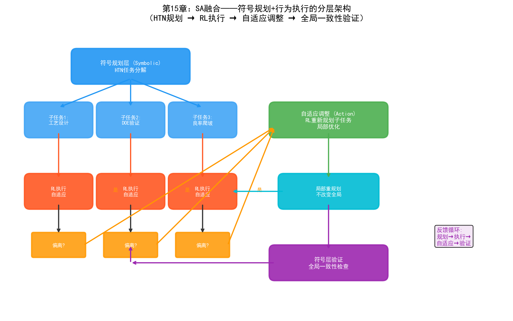
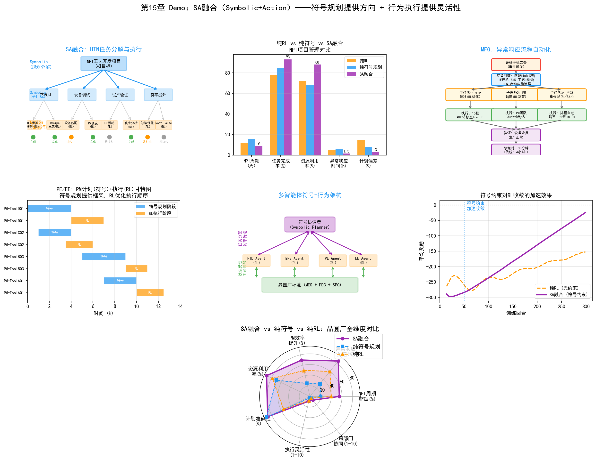
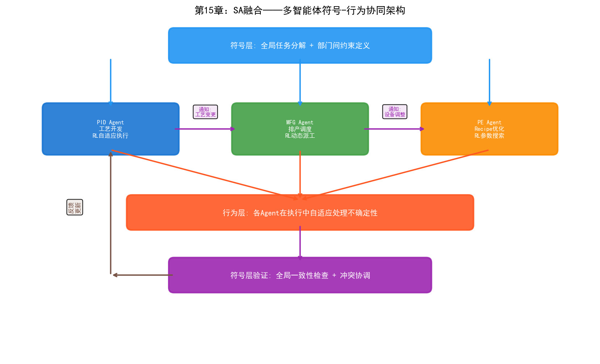

# 第20章 SA（Symbolic + Action）——符号行为融合在晶圆厂的应用

## 20.1 核心思路：规划与执行的结合

SA融合的核心思路是：用符号主义做"规划"——将复杂目标分解为有序的任务序列；用行为主义做"执行"——在不确定性环境中自适应地完成每个任务。

这个思路源于人类处理复杂任务的自然模式。以"做一顿晚餐"为例：先规划菜单（符号规划——确定要做哪几道菜、按什么顺序做），再在执行中根据实际情况调整（行为执行——发现盐不够了就减量，发现火大了就调小）。规划提供"方向感"，执行提供"灵活性"。

在AI中，这两种能力长期分离：

- **符号规划系统**（如HTN、STRIPS规划器）擅长将"造一个新产品"分解为"设计工艺流程→定义DOE→执行实验→分析结果→调整工艺"的有序任务序列。但它们假设环境是确定性的——一旦执行中出现意外（设备故障、参数偏移），规划器无法自适应。
- **强化学习系统**擅长在不确定性中做序贯决策，但缺乏"全局规划"能力——RL策略通常是反应式的，"看到当前状态就做决策"，不擅长处理需要多步骤协调的复杂目标。

SA融合的本质是：**符号规划提供全局结构和任务分解，行为执行在每个子任务中自适应处理不确定性**。这种"规划-执行"分层架构在软件工程中早已司空见惯（高层设计与底层实现的分离），在AI中则是走向自主系统的关键。

## 20.2 技术路径



*图：SA融合的符号规划+行为执行分层架构——HTN规划→RL执行→自适应调整→全局一致性验证*

### 路径一：符号规划+RL执行

这是SA融合最直接的技术路径——符号规划器生成任务序列，RL策略执行每个子任务：

```
输入目标："在4周内完成新工艺的DOE验证"

符号规划层（Symbolic）：
  HTN（层次任务网络）将目标分解为：
  
  1. 工艺窗口定义
     1.1 收集参考工艺参数
     1.2 定义关键参数范围
     1.3 生成初始DOE方案
  2. 实验执行
     2.1 分配实验晶圆
     2.2 调度设备时间
     2.3 执行DOE批次
  3. 结果分析
     3.1 量测WAT/CP
     3.2 分析参数-良率关系
     3.3 识别最优参数窗口
  4. 验证与固化
     4.1 用最优参数运行验证批次
     4.2 确认良率达标
     4.3 更新SPEC

执行层（Action/RL）：
  每个子任务由RL策略执行——
  子任务2.3"执行DOE批次"中：
    RL策略基于当前产线状态选择最优执行顺序
    如果Tool-A03突然故障，RL自适应调整到Tool-A05
    如果某批次结果异常，RL决定是否需要追加实验
```

符号规划和RL执行的分工边界是：**规划器决定"做什么"和"按什么顺序做"，RL策略决定"怎么做"并在执行中处理不确定性**。

### 路径二：HTN+自适应执行

HTN（Hierarchical Task Network，层次任务网络）是符号规划的经典方法，它通过递归分解将复杂目标分解为可执行的原子任务。SA融合在HTN的执行层引入自适应能力：

```
HTN规划：
  根目标：提升某产品良率从90%到95%
  
  分解层次1（战略级）：
    → 工艺参数优化
    → 缺陷模式改善
    → 设备稳定性提升
  
  分解层次2（战术级）：
    工艺参数优化 → 刻蚀参数调优 + 光刻参数调优 + CMP参数调优
    缺陷模式改善 → 颗粒缺陷控制 + 刻面缺陷控制
    设备稳定性提升 → PM频率优化 + Tool Matching
  
  分解层次3（执行级）：
    刻蚀参数调优 → DOE设计 + 实验执行 + 结果分析 + 参数固化
    
自适应执行：
  每个执行级任务由行为主义模型执行——
  
  "实验执行"任务中：
    预设：在Tool-A03上运行5组参数
    执行中：Tool-A03突发PM需求
    自适应：RL策略决定——
      方案A：等待Tool-A03 PM完成后继续（时间成本高）
      方案B：转移到Tool-A05执行（需要Tool Matching验证）
      方案C：调整实验顺序先做不依赖Tool-A03的部分
    选择：基于对产线状态和DOE进度综合评估，选择方案B
```

HTN+自适应执行的关键优势是：**当执行偏离计划时，不需要重新规划整个任务序列，只需要在受影响的子任务中做自适应调整**。这大大降低了系统的响应延迟。

### 路径三：多智能体符号-行为架构

在晶圆厂中，很多任务涉及多个部门协同——NPI流程需要PID、MFG、PE/EE同时参与。多智能体架构将SA融合扩展到多智能体场景：

```
符号层：全局任务分解与分配
  目标："新产品NPI按期量产"
  
  分解为部门级任务：
    PID Agent：工艺开发与验证
    MFG Agent：产能规划与排产
    PE Agent：Recipe开发与固化
    EE Agent：设备准备与PM计划
  
  符号约束定义部门间依赖关系：
    MFG的排产必须在PID确认工艺流程之后
    PE的Recipe固化必须在PID的DOE验证通过之后
    EE的PM计划必须围绕MFG的排产安排

行为层：各Agent在执行中自适应
  PID Agent执行工艺开发时：
    发现某工艺步骤的窗口比预期窄
    → 自适应：扩大DOE范围，重新评估
    → 通知PE Agent：需要额外的Recipe优化
  
  MFG Agent执行排产时：
    发现某关键设备的OEE低于预期
    → 自适应：调整排产策略，增加备用设备
    → 通知EE Agent：设备需要PM
  
  EE Agent执行PM计划时：
    发现PM所需备件延迟到货
    → 自适应：调整PM顺序，先做不需要该备件的设备
    → 通知MFG Agent：设备可用时间延后
```

多智能体符号-行为架构的关键是：**符号层定义"谁做什么、什么时候做"的全局结构，行为层允许每个Agent在执行中灵活调整，通过Agent间的通信协调偏离**。

## 20.3 在PID/YED中的应用

### NPI项目管理与任务分解

NPI（新产品导入）是晶圆厂最复杂的项目类型之一——涉及工艺开发、设备验证、良率爬坡、量产移交等多个阶段，通常跨越6-18个月。SA融合将NPI管理从"人工甘特图"升级为"自主规划+自适应执行"：

```
符号规划（NPI主计划）：
  HTN将NPI分解为阶段-里程碑-任务三级结构：
  
  阶段1：工艺设计（0-3月）
    里程碑：工艺流程定义完成
    任务：工艺步骤设计、参数范围初定、设备能力评估
  
  阶段2：DOE验证（3-6月）
    里程碑：最优参数窗口确认
    任务：DOE设计、实验执行、结果分析、参数固化
  
  阶段3：良率爬坡（6-12月）
    里程碑：良率达到量产门槛（通常>90%）
    任务：缺陷改善、参数微调、设备匹配、批量验证
  
  阶段4：量产移交（12-15月）
    里程碑：量产Release
    任务：SPEC固化、操作SOP更新、人员培训

自适应执行：
  各阶段中的任务由RL/行为模型执行——
  
  阶段2"DOE验证"中的自适应：
    预设：5组DOE实验，每组3片晶圆
    执行中：第3组结果显示某参数方向偏差过大
    自适应：RL策略调整后续实验方案，在该参数方向增加更细粒度的实验点
    符号层验证：调整后的方案仍满足DOE的统计设计原则（正交性、旋转性）
```

### 工艺开发流程的符号化编排

工艺开发涉及大量需要按顺序执行的步骤，且步骤间存在复杂的依赖关系。SA融合用符号规划编排流程，用行为模型处理执行中的不确定性：

- **符号层定义工艺开发的任务依赖图**：例如"刻蚀参数优化"必须在"刻蚀Recipe初版"完成后才能开始，但可以与"光刻参数优化"并行
- **行为层在每步执行中做自适应决策**：例如"刻蚀参数优化"中，RL策略基于实验结果自适应调整参数搜索方向
- **符号层监控全局一致性**：当某步的执行结果影响后续步骤的前提条件时，符号规划器重新评估并调整后续计划

### 良率提升项目的自动规划与执行

良率提升（Yield Improvement, YI）项目通常是一个多目标优化问题——需要同时改善多个缺陷类型、协调多个部门的行动。SA融合方案：

- **符号规划**：将YI目标分解为针对各缺陷类型的改善子项目，定义子项目间的优先级和依赖关系
- **行为执行**：每个改善子项目由RL策略执行——在工艺参数空间中搜索改善方案，在设备调度中寻找最优方案
- **符号层协调**：当两个子项目的方案冲突时（例如"减少刻蚀缺陷需要降低功率"但"提高刻蚀速率需要增加功率"），符号规划器介入协调，基于全局良率目标决定折中方案

## 20.4 在MFG中的应用

### 异常响应流程自动化

晶圆厂每天发生大量异常事件——设备故障、参数超标、批次异常等。传统流程是：操作员发现异常→通知工程师→工程师判断影响→决定响应措施→执行。SA融合将这个流程自动化：

```
符号规划（异常响应SOP）：
  定义各类异常的标准响应流程：
  
  "设备突发故障"响应流程：
    1. 故障确认与隔离（自动）
    2. 影响评估：受影响批次、产能损失（自动）
    3. 批次重派决策（半自动）
    4. 维修调度（自动）
    5. 恢复验证（自动）
    6. 事件报告生成（自动）

自适应执行（行为层）：
  步骤3"批次重派决策"中：
    预设规则：受影响批次重派到同型号设备
    执行中：同型号设备Tool-A05的队列已满
    自适应：RL策略评估——
      等待Tool-A05（交期风险）vs 重派到Tool-A07（需要Tool Matching）
      基于各批次交期紧迫度和Tool Matching历史数据选择最优方案
    
  步骤4"维修调度"中：
    预设规则：通知EE工程师
    执行中：当前所有EE工程师都在处理其他故障
    自适应：RL策略基于故障严重度和工程师工作量做优先级排序
```

### 生产计划的层级化分解与执行

生产计划从月度到周度到日度再到实时派工，是一个多层级的分解过程。SA融合在这个层级化过程中发挥作用：

- **符号层（月度/周度计划）**：HTN将月度生产目标分解为产品线-工序-设备级的生产任务，定义优先级和交期约束
- **符号层（日度计划）**：规则引擎将周度计划细化为每日的具体批次安排，考虑设备PM计划和工程实验时间
- **行为层（实时派工）**：RL策略在每日计划的框架内做实时派工决策，处理设备故障、紧急批次等动态事件

这种分层架构的优势是：高层规划提供全局最优的方向（符号层），底层执行提供局部最优的灵活性（行为层），两者通过约束传递和反馈修正实现协同。

### 跨部门协同的符号-行为调度

当生产活动需要跨部门协同时（例如工程实验需要占用生产设备时间），SA融合方案：

- **符号规划**：定义跨部门协同的流程模板——"工程实验申请→产能评估→时间窗口分配→实验执行→产能恢复"
- **符号约束**：工程实验时间不能影响高优先级生产批次的交期
- **行为执行**：RL策略在约束空间中寻找最优的实验时间窗口——既满足工程需求，又最小化对生产的影响
- **反馈循环**：实验执行后，实际产能影响反馈给符号层，用于优化未来的协同调度

## 20.5 在PE/EE中的应用

### PM计划+自适应执行

预防性维护（PM）计划是PE/EE的核心工作之一。传统PM计划基于固定周期（每N批次或每M小时），但实际设备的退化速度受使用强度、工艺条件、批次类型等多种因素影响。SA融合方案：

```
符号规划（PM年度计划）：
  定义各设备的PM类型和年度计划：
  
  设备Tool-A03：
    季度PM（Q-PM）：每3个月一次，包含腔体清洁和消耗品更换
    半年PM（H-PM）：每6个月一次，包含Q-PM内容+匹配器校准
    年度PM（Y-PM）：每年一次，包含H-PM内容+传感器全面校验
    
  符号约束：
    Q-PM必须在距上次Q-PM不超过1000批次时完成
    H-PM和Y-PM必须在距上次不超过6/12个月时完成
    PM时间窗口必须避开高优先级生产批次

自适应执行（行为层）：
  基于设备实际状态的动态调整——
  
  距上次Q-PM已900批次，FDC信号显示腔体压力漂移加速
  → RL策略评估：继续生产的风险 vs 提前PM的产能影响
  → 决策：在下个生产窗口提前执行Q-PM
  
  距上次H-PM已5个月，但匹配器阻抗在控制限内
  → RL策略评估：延期H-PM到6.5个月的风险 vs 按计划执行
  → 决策：延后H-PM，但增加匹配器监测频率
```

### 设备维修流程的符号化规划

当设备发生故障时，维修流程需要遵循标准化的步骤——但步骤的顺序和内容可能因故障类型而异。SA融合：

- **符号层**：设备故障的知识图谱定义不同故障类型的标准维修流程——"RF功率异常"的维修步骤是"检查匹配器→检查电缆→检查腔体"，"温度异常"的步骤是"检查加热器→检查热电偶→检查冷却系统"
- **行为层**：在每步维修中，RL策略基于检测结果决定下一步——"检查匹配器发现电容值正常，跳过更换步骤，直接检查电缆"
- **符号层验证**：维修完成后，规则引擎验证所有必要步骤是否完成，确保维修质量

### 机台匹配的任务分解与优化

机台匹配（Tool Matching）是确保同型号设备产出一致性的关键工作。SA融合将Tool Matching分解为规划-执行结构：

- **符号规划**：定义Tool Matching的标准流程——"选择参考设备→定义匹配参数→运行匹配批次→分析差异→调整参数→验证一致性"
- **行为执行**：在"分析差异"和"调整参数"步骤中，RL策略基于差异模式搜索最优的参数补偿方案
- **符号层约束**：调整后的参数必须在SPEC范围内，且不能影响已验证的其他参数组合

## 20.6 实践案例

### 三星：自主制造系统的规划-执行架构

三星的自主制造系统体现了SA融合的核心理念：

- **符号规划层**：工艺知识图谱定义了从"良率下降"到"根因定位"到"参数调整"的标准任务序列
- **行为执行层**：图分析+RL策略在每步执行中自适应——例如在"根因定位"步骤中，基于传感器网络关系图动态调整搜索路径
- **SA融合体现**：系统覆盖762台设备的自主故障维护，处理超过85,000次真实故障——每次故障响应都遵循符号规划的标准流程，但在每个步骤中由行为模型做自适应决策
- **成果**：MTTR减少7分钟，验证了"符号规划+行为执行"在真实晶圆厂中的可行性

### Palantir AIP：Ontology驱动的任务编排

Palantir的AIP平台将Ontology（符号层）与Action（行为层）统一在架构中：

- **符号层**：Ontology定义了晶圆厂的实体关系和业务规则——"设备→工艺步骤→批次→良率"的因果链，"故障→影响→响应→恢复"的流程链
- **行为层**：AIP的Action模块基于Ontology中的规则触发自动化执行——当Ontology检测到某设备的状态变化时，自动触发预定义的响应流程
- **SA融合体现**：AIP不仅做数据融合和推理（NB融合），还能基于推理结果触发行动——"Ontology推理出Tool-A03需要紧急PM→Action模块自动通知EE团队、重派受影响批次、调整生产计划"
- **工业级验证**：三星、美光、欧洲IDM等半导体企业部署了AIP，验证了Ontology驱动的规划-执行架构在复杂制造环境中的鲁棒性

### L3Harris（Palantir Warp Speed案例）：复杂制造的符号-行为架构

L3Harris作为复杂制造商，使用Palantir Warp Speed实现了SA融合的制造系统：

- **符号层**：Warp Speed的Ontology定义了从订单到生产的完整任务分解结构——订单→产品BOM→工艺路线→工序任务→设备分配
- **行为层**：在执行中，系统自适应处理物料短缺、设备故障、优先级变更等不确定性
- **成果**：订单到生产周期的可见性显著提升，异常响应从"人工协调数小时"缩短到"系统自动调整+人工确认"
- **对晶圆厂的启示**：Warp Speed的架构证明了"Ontology驱动的规划+自适应执行"在复杂制造中的可行性，这种架构可以直接迁移到晶圆厂的NPI管理和异常响应场景

### Flexciton：混合整数规划+RL的调度系统

Flexciton的晶圆厂调度系统体现了SA融合在MFG中的实践[89][90]：

- **符号层**：混合整数规划（MIP）定义调度的全局最优结构——满足工艺约束、设备约束和交期约束的任务分配
- **行为层**：RL策略在MIP框架内做实时微调——处理设备故障、紧急插单等动态事件
- **SA融合**：MIP提供全局最优的"骨架"计划，RL在骨架上做实时"微调"——既保证了全局最优性，又具备实时响应能力
- **验证**：在多个晶圆厂部署，相比传统启发式调度，缩短平均交期5-10%，减少设备闲置时间

### 多智能体系统在NPI协同中的探索

虽然多智能体SA架构在晶圆厂中尚处于研究阶段，但已有探索性案例：

- **学术原型**：多个研究团队探索了基于HTN+多智能体的NPI协同——PID Agent负责工艺开发任务，MFG Agent负责产能规划，PE Agent负责Recipe优化，通过符号约束定义Agent间的依赖关系
- **工业探索**：部分头部晶圆厂在内部实验中使用多智能体架构模拟NPI流程——验证了"符号规划+行为执行"在跨部门协同中的可行性
- **挑战**：多智能体系统的鲁棒性和安全性验证是主要瓶颈——当多个Agent的决策相互影响时，如何确保全局一致性仍在研究中

---

SA融合在晶圆厂的价值核心是"结构化自主"——让AI不仅能在局部做优化决策，还能理解全局任务结构，在规划框架下自适应执行。这种"规划+执行"的分层架构是连接"单点AI优化"和"整厂自主运营"的桥梁。

SA融合面临的挑战与NA融合不同——它的瓶颈不在算法能力，而在**知识获取和一致性验证**。符号规划需要准确的领域知识（工艺流程、设备约束、部门依赖），这些知识的获取和维护是主要瓶颈。同时，当行为层执行偏离规划时，如何确保偏离不会破坏全局一致性——这需要符号层和行为层之间的紧密反馈机制。在晶圆厂中，这意味着SA融合系统的部署需要与工厂现有的SOP（标准操作流程）深度整合，而非简单地叠加AI能力。

## 20.7 Demo可视化：SA融合任务编排与协同



*Demo说明：左上为HTN任务分解树，中上为纯RL vs 纯符号 vs SA融合对比，右上为异常响应流程自动化。中排分别为PM甘特图、多智能体符号-行为架构、符号约束加速RL收敛。底部为SA融合全维度雷达图对比。模拟脚本见 `demos/demo_ch20_sa_fusion.py`。*



> **本章配套实验**：第27章 27.6 节的 K8s 式声明式调度（`demos/experiments/C9S_agent`）是本章 SA 融合的生动案例——符号系统定义目标与约束（声明式目标），行为系统负责持续逼近（调谐循环），还内置了与传统命令式管道的对比实验。
