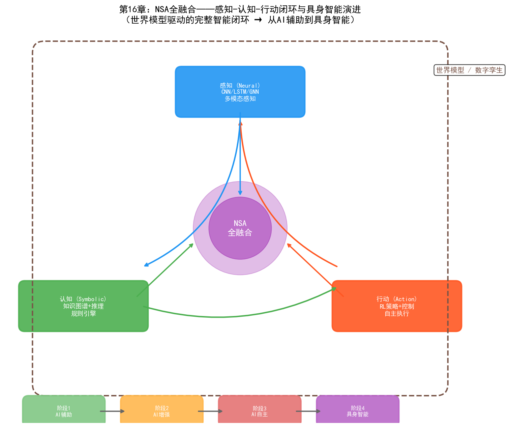
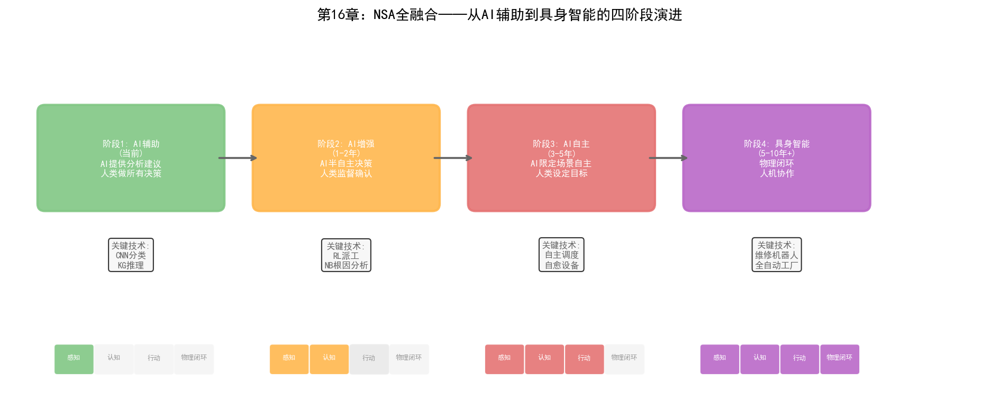

# 第21章 NSA全融合——具身智能与晶圆厂未来

## 21.1 核心思路：感知-认知-行动的闭环

NSA全融合将三大主义融为一体，构成"感知（视觉/听觉/信号）—认知（推理/知识/规划）—行动（控制/优化/执行）"的完整智能闭环。

如果说NB融合让AI"想得对"、NA融合让AI"做得到"、SA融合让AI"有章法"，那么NSA全融合的目标是让AI同时具备这三种能力——不仅看得懂、想得对，还能有章法地做得到。这在自然界就是生物智能的基本模式：人类通过感官感知环境（Neural），通过知识和推理理解环境（Symbolic），通过行动改变环境（Action），三者持续闭环。

NSA全融合的终极形态是**具身智能（Embodied AI）**——AI不仅存在于数字世界中处理数据，还能通过物理接口（机器人、自动化设备）与真实环境交互。在晶圆厂的语境下，具身智能意味着：AI系统能感知产线状态（通过传感器和检测数据），理解问题根因（通过知识推理），并自主执行修复动作（通过控制设备和调度产线），形成完全闭环的自主运营。

### 从分立到全融合的递进关系

NB、NA、SA三种融合不是NSA全融合的简单叠加——它们构成了递进的融合层次：

```
NB融合（Neural + Symbolic）：
  感知 → 认知
  "看到缺陷 → 理解根因"
  缺失：无法自主行动

NA融合（Neural + Action）：
  感知 → 行动
  "看到异常 → 调整参数"
  缺失：无法推理和规划

SA融合（Symbolic + Action）：
  认知 → 行动
  "规划任务序列 → 执行任务"
  缺失：无法从原始数据中感知

NSA全融合：
  感知 → 认知 → 行动 → 感知 → ...
  "看到缺陷 → 推理根因 → 执行修复 → 验证效果 → 持续学习"
  完整闭环
```

每一步融合解决前一步的"缺失"，最终NSA全融合形成完整的智能闭环。这种递进关系不是理论构想——当前AI技术的发展正在沿这条路演进。

## 21.2 技术路径



*图：NSA全融合——感知-认知-行动闭环与具身智能四阶段演进*

### 路径一：世界模型与数字孪生

世界模型（World Model）是NSA全融合的核心基础设施——一个能够模拟环境动态变化的内部模型，使AI能够"在脑中预演"行动的后果。

```
世界模型 = 感知编码器 + 动力学模型 + 行动解码器

感知编码器（Neural）：
  将高维传感数据（晶圆图、FDC信号、MES数据）编码为低维隐状态
  z_t = Encoder(observations_t)

动力学模型（Symbolic + Neural）：
  预测在行动 a_t 下，下一时刻的状态 z_{t+1}
  z_{t+1} = DynamicsModel(z_t, a_t)
  
  混合架构：
  - 神经网络部分：学习数据驱动的状态转移模式
  - 符号约束部分：确保预测满足物理定律和工艺规则
  
行动解码器（Action）：
  基于预测的状态选择最优行动
  a_t* = Policy(z_t, z_{t+1}^{predicted})
```

在晶圆厂中，世界模型的体现就是**数字孪生（Digital Twin）**——一个与真实晶圆厂同步的虚拟模型，能够模拟工艺过程、设备行为和生产动态。

数字孪生在NSA全融合中的角色：

- **感知层**：数字孪生从真实晶圆厂同步数据（MES、FDC、YMS），形成实时状态镜像
- **认知层**：知识图谱和推理引擎在数字孪生上做"what-if"分析——"如果调整Step 47的功率+5W，在数字孪生中预测对后续步骤的影响"
- **行动层**：RL策略在数字孪生中预演多种行动方案，选择效果最优的方案在真实产线上执行
- **闭环验证**：执行后，真实结果反馈到数字孪生，校准和更新世界模型

### 路径二：多模态具身智能

多模态具身智能将NSA全融合扩展到多种感知模态——不仅处理结构化数据，还能理解图像、时序信号、自然语言等多种输入：

```
多模态感知层（Neural）：
  - 视觉模态：晶圆图、缺陷照片、设备状态图像
  - 时序模态：FDC信号、SPC数据、温度/压力趋势
  - 文本模态：SPEC文档、操作SOP、工程师备注
  - 结构模态：MES批次记录、设备拓扑图、工艺流程图
  
  统一编码为多模态嵌入向量

认知层（Symbolic）：
  知识图谱将多模态嵌入映射到语义空间——
  "这个视觉缺陷模式" + "这段FDC信号异常" + "这条SPEC规则"
  → 综合推理出根因和影响范围

行动层（Action）：
  RL策略基于多模态感知和认知推理，输出多模态行动——
  - 数字行动：调整参数、重派批次、触发PM
  - 物理行动（未来）：控制自动化设备、引导维修机器人
```

在当前的晶圆厂中，物理行动主要由人类执行（工程师按AI建议操作设备）。但随着工厂自动化的深化——AMHS（自动物料搬运系统）、自动化检测设备、远程控制设备——NSA全融合的"物理行动"能力将逐步落地。

### 路径三：端到端智能体架构

端到端智能体架构是NSA全融合的前沿方向——将感知、认知和行动统一在一个可端到端训练的系统中：

```
输入：多模态原始数据（图像 + 信号 + 文本 + 结构）
  ↓
统一主干网络（Transformer/Mamba）：
  同时编码所有模态，输出统一状态表征
  ↓
认知-行动联合模块：
  知识推理 + 策略优化 联合训练
  ↓
输出：行动序列（参数调整 + 派工指令 + PM安排）

端到端训练：
  从"感知"到"行动"的梯度直接传递
  系统学会"看什么"取决于"要做什么"
  系统学会"推理什么"取决于"行动需要"
```

这种架构在研究中已有探索（如Google的RT-2用于机器人控制），但在晶圆厂中尚处于概念阶段——主要瓶颈是训练数据：端到端系统需要大量"感知-认知-行动"三元组数据，而晶圆厂的每次"环境交互"（实际生产批次）成本极高。

## 21.3 在PID/YED中的应用

### 全栈良率智能（感知→推理→优化→验证）

NSA全融合在PID/YED中的终极应用是"全栈良率智能"——将良率管理的全流程打通为自主闭环：

```
感知（Neural）：
  CNN分析晶圆图 → "边缘环形缺陷，置信度94%"
  LSTM分析FDC信号 → "Step 47刻蚀腔体压力有0.2mTorr漂移"
  GNN分析批次间关联 → "同设备的3批受影响"

认知（Symbolic）：
  知识图谱检索 → "边缘环形缺陷的可能根因：刻蚀边缘效应、光刻边缘效应"
  规则引擎推理 → "FDC压力漂移+边缘环形缺陷 → 首要根因：刻蚀边缘效应"
  LLM生成分析 → "Tool-A03刻蚀腔体压力漂移导致边缘刻蚀速率不均，
                  建议检查腔体边缘气体分布装置"

优化（Action）：
  RL策略搜索最优修复方案 →
  "方案A：调整刻蚀功率分布补偿+0.3%（预计良率恢复92%）
   方案B：执行腔体边缘清洁PM（预计良率恢复94%，但需要4小时停机）
   方案C：方案A+B组合（预计良率恢复95%，需要4小时停机）"

验证（Neural + Symbolic）：
  数字孪生预演 → 在虚拟环境中模拟方案C的效果
  实际执行 → 在Tool-A03上执行方案C
  结果验证 → 下一批次良率恢复到93.5%
  知识更新 → 将"压力漂移0.2mTorr→边缘缺陷→方案C有效"写入知识图谱

闭环：
  感知 → 认知 → 优化 → 验证 → 知识更新 → 增强的感知（下一轮）
```

### 自主工艺开发系统

NPI中的工艺开发是最能体现NSA全融合价值的场景——它需要感知（理解实验结果）、认知（推理工艺机理）和行动（决定下一步实验）的完整闭环：

- **感知层**：深度学习模型分析每轮DOE的晶圆图、WAT/CP数据、FDC信号，提取工艺结果特征
- **认知层**：知识图谱结合工艺物理模型，从实验结果中推理"哪个参数方向有效""哪个交互效应显著""工艺窗口的边界在哪里"
- **行动层**：RL策略基于认知推理决定下一轮DOE的参数方案——在有效方向加密搜索，在无效方向停止探索
- **闭环**：每轮实验结果更新知识图谱和RL策略，形成"实验→学习→优化→再实验"的自适应循环

这种自主工艺开发系统的愿景是：工程师设定目标（"找到使良率>92%的参数组合"），系统自主规划和执行DOE实验，最终输出最优工艺参数和完整的推理链——大幅缩短NPI周期。

## 21.4 在MFG中的应用

### 自主制造运营

NSA全融合在MFG中的终极形态是"自主制造运营"——AI系统在最小人类干预下管理工厂的日常运营：

```
感知层（Neural）：
  全厂数据实时同步——
  - MES：批次位置、工艺进度、WIP分布
  - FDC：设备状态、工艺参数、异常告警
  - YMS：良率数据、缺陷分布
  - AMHS：物料位置、天车状态

认知层（Symbolic）：
  Ontology统一全厂数据语义——
  - 推理：当前瓶颈在哪？未来2小时会转移到哪？
  - 规划：今天的生产目标分解为各设备的具体任务
  - 约束检查：所有计划是否满足工艺约束和交期约束

行动层（Action）：
  多智能体协同执行——
  - 调度Agent：实时派工，优化WIP流动
  - 设备Agent：监控设备健康，自主触发PM
  - 良率Agent：监控良率趋势，自主调整参数
  - 异常Agent：响应突发事件，自主调整计划

闭环：
  行动结果反馈到感知层 → 更新全厂状态 → 重新推理和规划 → 新的行动
```

这种自主运营的愿景在当前阶段还远未实现——但它的组件正在逐步落地：

- **已落地的组件**：智能派工（NA融合）、异常响应自动化（SA融合）、跨系统数据问答（NB融合）
- **正在验证的组件**：多智能体协同调度、自主PM决策、数字孪生预演
- **尚在研究的组件**：完全自主的工艺开发、端到端整厂优化、人机协作的自主运营

### 整厂级自主决策

整厂级优化是NSA全融合最具挑战性也最具价值的应用——在全局视角下同时优化良率、产能、成本和交期：

- **感知层**：GNN编码全厂状态为图结构——设备节点、批次节点、工艺步骤节点及其关系边
- **认知层**：知识图谱定义优化目标间的约束关系——"提高良率可能需要降低产能（更严格的参数控制导致更慢的工艺速度）""提高产能可能影响良率（更快的节拍导致参数控制窗口缩小）"
- **行动层**：多智能体RL在约束空间中搜索Pareto最优策略——在良率、产能、成本和交期之间找到最佳平衡点
- **闭环**：策略执行后的全厂KPI反馈到感知层，持续优化多目标平衡策略

## 21.5 在PE/EE中的应用

### 自愈设备系统

NSA全融合在PE/EE中的终极应用是"自愈设备系统"——设备能自主感知故障、诊断根因、执行修复并验证恢复：

```
感知（Neural）：
  FDC信号异常检测 → "RF功率振荡频率从稳定变为12Hz振荡"
  振动传感器 → "匹配器位置振动幅度增加30%"
  温度传感器 → "匹配器外壳温度上升5°C"

认知（Symbolic）：
  知识图谱推理 → 
  "RF功率振荡 + 匹配器振动增大 + 匹配器温度升高
   → 根因：匹配器内部电容老化导致阻抗失配
   → 影响范围：当前设备 + 同型号使用相同批次匹配器的设备
   → 修复方案：更换匹配器电容（标准维修流程MP-047）"

行动（Action）：
  RL策略规划维修执行——
  1. 安全隔离：自动切换设备到维修模式，隔离RF电源
  2. 维修调度：通知EE工程师，准备备件（电容型号C-2304）
  3. 维修指导：AR设备为工程师显示维修步骤和注意事项
  4. 维修执行：工程师按指导更换电容（未来可由维修机器人执行）
  5. 恢复验证：维修后自动执行验证批次，检查RF稳定性

验证（Neural + Symbolic）：
  感知：FDC信号恢复正常，振荡消失
  认知：知识图谱记录"匹配器电容老化→更换→修复"案例
  学习：RL策略更新——"同批次匹配器的其他设备可能也面临电容老化风险"
  预防：自动为同批次匹配器设备生成预防性更换建议
```

### 自主设备调优与维护

NSA全融合将设备调优从"定期人工调整"升级为"持续自主优化"：

- **感知层**：深度学习持续监测设备的工艺输出质量（CD、深度、均匀性等）
- **认知层**：知识图谱理解设备参数与工艺结果之间的因果关系——"RF功率↑→刻蚀速率↑但均匀性↓"
- **行动层**：RL策略在工艺约束范围内自主微调参数，维持最优工艺输出
- **闭环**：调优效果反馈到感知层和认知层，持续更新设备的行为模型和参数-结果因果关系

## 21.6 从单点AI到具身智能的演进路径

晶圆厂的NSA全融合不是一步到位的——它需要一个渐进式的四阶段演进路径：

### 阶段一：AI辅助（AI-Assisted）

**当前阶段，已广泛落地**

- AI为工程师提供分析和建议
- 人类做所有决策，AI辅助分析
- 典型应用：缺陷分类（Neural）、根因推理（NB融合）、参数推荐（NA融合）
- 特征：AI是"工具"，人类是"操作者"

### 阶段二：AI增强（AI-Augmented）

**当前到近期（1-2年）**

- AI在特定场景中做自主决策，但需人类确认
- 人类监督AI的决策，在异常时介入
- 典型应用：半自主派工、自动异常响应、PM自主调度
- 特征：AI是"助手"，人类是"监督者"

### 阶段三：AI自主（AI-Autonomous）

**中期（3-5年）**

- AI在限定场景中完全自主运营
- 人类设定目标和约束，AI自主规划和执行
- 典型应用：自主工艺开发、整厂级自主调度、自愈设备
- 特征：AI是"代理"，人类是"管理者"

### 阶段四：具身智能（Embodied AI）

**远期（5-10年+）**

- AI通过物理接口（机器人、自动化设备）与真实环境交互
- 形成"感知→认知→行动"的完整物理闭环
- 典型应用：自主维修机器人、全自动晶圆厂、人机协作的制造系统
- 特征：AI是"自主体"，人类是"协作者"

```
                     感知    认知    行动    物理闭环
阶段一：AI辅助        ✓       -      -       -
阶段二：AI增强        ✓       ✓      △       -
阶段三：AI自主        ✓       ✓      ✓       -
阶段四：具身智能      ✓       ✓      ✓       ✓

✓ = 完全实现  △ = 部分实现  - = 未实现
```

## 21.7 实践案例

### 三星：自主制造系统的NSA雏形

三星的自主制造系统是当前最接近NSA全融合的工业实践：

- **感知层（Neural）**：深度学习模型从762台光刻设备的传感器信号中实时检测异常
- **认知层（Symbolic）**：知识图谱+图分析推理故障根因和影响范围
- **行动层（Action）**：自主触发故障维护流程——隔离设备、重派批次、调度维修
- **NSA闭环**：感知→认知→行动→验证→知识更新
- **成果**：处理超过85,000次真实故障，MTTR减少7分钟
- **NSA特征**：系统不仅检测和诊断（NB），还自主决策和执行（Action），并从每次故障中学习更新知识（闭环学习）

### Palantir + NVIDIA：AIOS-RA的NSA架构

Palantir与NVIDIA联合发布的AIOS-RA（AI Operating System Reference Architecture）定义了NSA全融合的工业级架构[94]：

- **感知层（Neural）**：NVIDIA的GPU加速深度学习处理多模态传感数据（图像、信号、时序）
- **认知层（Symbolic）**：Palantir的Ontology提供统一的数据语义模型和推理引擎
- **行动层（Action）**：AIP的Action模块基于推理结果触发自动化流程
- **世界模型**：NVIDIA Omniverse提供数字孪生，作为NSA闭环的"预演"环境
- **NSA特征**：三层架构（NVIDIA感知层→Palantir认知层→Rubix行动层）在架构层面实现了NSA全融合
- **对晶圆厂的意义**：AIOS-RA为晶圆厂提供了一个可参考的NSA全融合架构蓝图——不需要从零构建，而是在现有IT/OT基础设施上分层部署

### NVIDIA Omniverse：晶圆厂数字孪生平台

NVIDIA Omniverse是NSA全融合中"世界模型"层的基础设施：

- **数字孪生**：Omniverse创建晶圆厂的3D数字孪生——包括设备模型、工艺模型和生产模型
- **感知同步**：真实晶圆厂的实时数据同步到数字孪生，形成实时镜像
- **认知预演**：在数字孪生上做"what-if"分析——"如果调整某设备参数，对全厂良率和产能的影响是什么"
- **行动验证**：RL策略在数字孪生中预演行动方案，验证效果后再在真实产线执行
- **NSA特征**：Omniverse+cuLitho+Metropolis的组合覆盖了感知（Metropolis视觉分析）、认知（Omniverse仿真推理）和行动（cuLitho参数优化）

### 美光：预测性制造的NSA探索

美光的预测性制造系统正在向NSA全融合方向演进：

- **感知层**：深度学习模型从FDC、MES、YMS数据中实时感知全厂状态
- **认知层**：与Athinia（Palantir合资公司）合作构建的数据平台提供跨系统语义统一和推理能力
- **行动层**：基于感知和认知结果自主触发设备调度、参数调整和PM安排
- **NSA特征**：美光的愿景是"预测→决策→执行→验证"的完全闭环——从预测性问题到自主行动
- **当前阶段**：处于阶段二（AI增强）向阶段三（AI自主）的过渡期

## 21.8 展望与挑战

### 技术挑战

NSA全融合面临的技术挑战是多层次的：

1. **世界模型的精度**：数字孪生能否准确模拟真实晶圆厂的所有关键动态？当前数字孪生主要覆盖设备级和工艺级的仿真，整厂级的动态仿真（包括WIP流动、瓶颈转移、人员行为）仍不成熟。

2. **闭环延迟**：NSA闭环的"感知→认知→行动→验证"周期在晶圆厂中可能跨越数天（一个批次的制造周期）——这种长延迟使得RL的信用分配（credit assignment）极其困难。

3. **安全性与可解释性**：当AI系统同时控制感知、推理和行动时，错误的传播路径更复杂——一个感知错误可能导致错误的推理，进而导致错误的行动。如何在这种闭环中保证安全性是核心挑战。

4. **多模态融合的语义对齐**：将图像、信号、文本、结构数据融合到一个统一的语义空间，需要解决不同模态之间的语义对齐问题——"CNN看到的缺陷模式"与"KG中的工艺规则"如何精确对应。

### 组织挑战

NSA全融合不仅是技术挑战，更是组织变革挑战：

1. **信任建立**：工程师是否信任AI系统的自主决策？在晶圆厂中，一个错误决策的代价可能是数百万美元。信任需要通过大量"AI建议→人工确认→验证效果"的迭代来逐步建立。

2. **人机协作模式**：NSA全融合不会完全取代人类——它改变的是人机协作模式。工程师从"执行者"转变为"监督者"和"策略制定者"，需要新的技能和角色定义。

3. **组织架构适配**：当AI系统能够跨部门自主协调时，传统的部门壁垒是否还适用？NSA全融合可能需要更扁平、更灵活的组织架构来匹配AI的自主协调能力。

### 伦理与治理

当AI系统获得感知-认知-行动的全闭环能力时，治理问题变得紧迫：

- **责任归属**：当NSA系统的自主决策导致产线问题时，责任归属AI系统、AI供应商还是使用方？
- **透明度要求**：NSA系统的决策链涉及感知、推理和行动多个环节——如何确保整条链路可审计、可追溯？
- **人类介入权**：在NSA系统的自主运营中，人类应保留什么级别的介入权——是否应该有"一键停止"的能力？

### 从愿景到现实

NSA全融合在晶圆厂中不会以"大爆炸"的方式实现——它将以"局部闭环→跨环节打通→整厂集成"的渐进方式演进：

```
近期（1-2年）：
  - NB融合的良率分析系统规模化部署
  - NA融合的智能调度进入"建议+确认"模式
  - SA融合的异常响应流程在试点产线验证

中期（3-5年）：
  - NSA全融合的"全栈良率智能"在头部晶圆厂试点
  - 数字孪生从设备级扩展到产线级
  - 多智能体系统在NPI管理中验证

远期（5-10年）：
  - 整厂级数字孪生平台成熟
  - 自主制造运营在新建晶圆厂中验证
  - 具身智能（维修机器人）在受控场景中试点
```

---

本章完成了三大主义融合的完整图景。从NB的"可验证推理"到NA的"闭环优化"，从SA的"结构化自主"到NSA的"全栈智能"——融合的每一步都让AI更接近"通用智能"的形态。但正如第17章所述，晶圆厂不需要AGI——它需要的是在特定场景中可靠工作的混合智能系统。这些"窄域混合智能"才是未来3-5年晶圆厂AI的落地重点。

三大主义的交叉融合是AI发展的大势所趋。在晶圆厂这个极端复杂的工业场景中，融合不是锦上添花，而是必需——因为晶圆厂的任何真实问题都是感知、推理和行动的复合体。谁能率先打通这三者的闭环，谁就能在半导体制造的下一个十年中占据制高点。

## 21.9 Demo可视化：NSA全融合感知-认知-行动闭环


*Demo说明：左上为NSA闭环架构图，上方为四阶段演进路径。中排分别为数字孪生精度、自主决策准确率、多模态融合增益。下排分别为自愈设备系统、全栈良率智能、闭环延迟分析。底部为NB/NA/SA/NSA全维度对比矩阵。模拟脚本见 `demos/demo_ch21_nsa_fusion.py`。*



> **本章配套实验**：第27章 27.11 节的多 Agent 评估框架（`demos/experiments/fab_agent_test`）回答了 NSA 全融合系统"如何评估"的问题——从过程质量、资源成本到故障注入下的系统韧性，为端到端智能体提供了可复用的三维评估方法。
