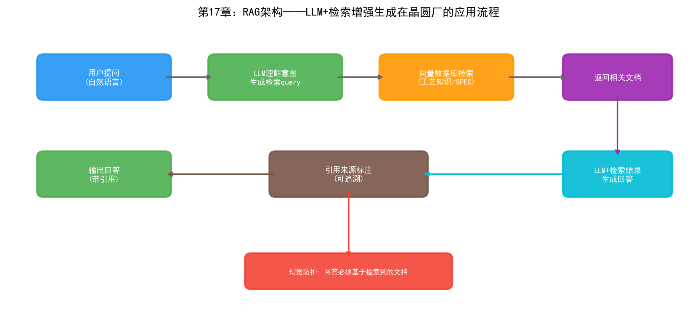
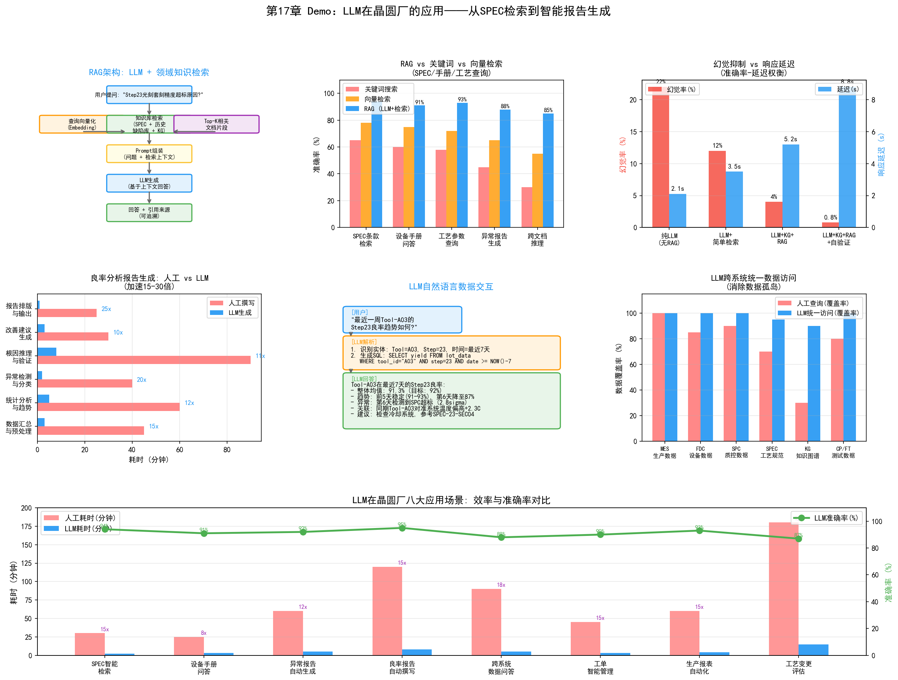

# 第22章 大语言模型（LLM）在晶圆厂的应用

## 22.1 LLM 技术概述

大语言模型的"大"体现在三个维度：模型参数量（数十亿到数千亿）、训练数据量（数万亿token）、训练算力（数千GPU月）。三者共同构成了规模定律（Scaling Law）的基础——当这三个维度同步增长时，模型的性能以可预测的方式提升，并在某个临界点出现前文所述的"涌现能力"。

### Transformer 架构回顾

LLM的技术基础是Transformer架构。第二章和第四章已经讨论了Transformer的核心——自注意力机制。这里从工程角度补充几个关键概念。

**Token化：** LLM不直接处理文字，而是先将文字切分为token——可以是词、子词或字符。GPT系列使用BPE（Byte Pair Encoding）算法将文本切分为子词token。一个英文单词通常对应1-2个token，一个中文字符通常对应2-3个token。token化方式直接影响模型对领域术语的处理——"刻蚀"可能被切分为两个不相关的token，模型在理解时需要从上下文推断其含义。

**上下文窗口：** LLM一次能处理的最大token数。早期GPT-3的上下文窗口是2048个token，GPT-4提升到128K，Claude 3达到200K。在晶圆厂场景中，一份完整的工艺规范（SPEC）可能长达数十页——需要至少32K的上下文窗口才能完整容纳。

**对齐（Alignment）：** 预训练后的基础模型能生成流畅的文本，但不一定遵循人类意图。RLHF（Reinforcement Learning from Human Feedback）通过对模型输出进行人类偏好排序，训练一个奖励模型，再用强化学习优化LLM的生成策略，使其输出更符合人类期望。对齐是让LLM从"能说话"变成"会说话"的关键步骤。

### 主流 LLM 概览

| 模型 | 开发商 | 参数规模 | 特点 |
| --- | --- | --- | --- |
| GPT-4 / GPT-4o | OpenAI | 未公开（推测1.7T+） | 综合能力最强，多模态 |
| Claude 3.5 / Claude 4 | Anthropic | 未公开 | 长文本处理，安全性强 |
| Llama 3 / Llama 4 | Meta | 8B-405B | 开源权重，可本地部署 |
| Gemini 1.5 / 2.0 | Google | 未公开 | 原生多模态，超长上下文 |
| 文心一言 4.0 | 百度 | 未公开 | 中文优化，国内合规 |
| DeepSeek-V3 / R1 | DeepSeek | 671B (MoE) | 开源，推理能力突出 |

在晶圆厂场景中，LLM的选择需要考虑三个因素：数据安全（是否可以本地部署）、领域适应能力（是否容易注入半导体专业知识）、推理成本（每token的处理费用）。开源模型（如Llama系列、DeepSeek）在数据安全方面有天然优势——可以完全在晶圆厂内网部署，不将任何工艺数据传出厂区。

## 22.2 LLM 在工艺文档管理中的应用

### 工艺规范（SPEC）的智能检索与问答

一座先进晶圆厂通常积累了数千份工艺规范文档——每个工艺模块的操作流程、参数规格、异常处理步骤、安全注意事项都记录在SPEC中。这些文档的总量可能达到数十万页，且持续更新。

传统的SPEC管理依赖文档管理系统——工程师通过关键词搜索或目录浏览来查找需要的文档。这种方法的问题在于：工程师的查询通常是自然语言问题（"3号刻蚀机的腔体清洗流程是什么"），而不是精确的关键词匹配。如果文档中写的是"湿法清洗程序"而非"清洗流程"，关键词搜索就会遗漏。

基于RAG（检索增强生成）技术的SPEC智能问答系统解决了这个问题。系统架构如下：

```
工程师提问: "3号刻蚀机腔体清洗后需要做什么验证？"
  │
  ├─ 1. 查询编码: 将自然语言问题编码为向量
  │
  ├─ 2. 向量检索: 在SPEC文档库中检索最相关的段落
  │    → 返回: "刻蚀机腔体清洗后验证流程.docx" 第3.2节
  │    → 返回: "腔体PM后验收标准.docx" 第2.1节
  │
  ├─ 3. 上下文构建: 将检索到的文档段落 + 原始问题组合为提示词
  │
  └─ 4. LLM生成: 基于检索到的文档内容生成自然语言回答
       → "3号刻蚀机腔体清洗后，需执行以下验证：
          1. 空白运行2批次确认腔体清洁度
          2. 测试晶圆刻蚀速率验证（目标: 320±10 nm/min）
          3. 粒子检测确认（< 10颗/@0.12μm）
          验证通过后可恢复量产。"
```

RAG的核心价值是"有据可查"——LLM的回答基于检索到的文档内容，而非凭空生成。这大幅降低了"幻觉"风险——当LLM在文档中找不到答案时，它可以回答"未找到相关信息"，而不是编造一个看似合理的错误答案。

### 设备手册的自动解读

每台半导体设备都附带数千页的操作手册和维护手册。当设备出现异常时，EE工程师需要在短时间内从手册中找到相关的故障排查指引。这个过程通常非常耗时——手册是按功能模块组织的，而故障现象和排查步骤可能分散在不同的章节。

LLM可以将手册内容"结构化"——自动提取手册中的故障代码、排查步骤、维修流程，构建为可问答的知识库。工程师提问"设备报错代码E-3071是什么意思、怎么处理"，LLM从手册中检索相关内容并给出结构化的回答。

### 异常报告的自动生成

晶圆厂每天产生大量异常报告——设备异常报告、工艺偏差报告、良率下降报告。这些报告的格式通常固定但内容需要工程师手动撰写——描述异常现象、列出受影响的批次、分析可能原因、给出处置建议。

LLM可以根据结构化数据自动生成报告草稿。系统从MES、FDC、SPC等系统中提取相关数据（异常时间、设备参数、受影响批次、量测结果），LLM将这些数据组织为结构化的报告文本：

```
【异常报告】
时间: 2026-08-29 14:32
设备: 刻蚀机ETC-03, 腔体Chamber-2
异常描述: 第45批加工过程中，RF反射功率从3%突升至12%，
         超过控制限(8%)。FDC系统自动触发暂停。
受影响批次: LOT-A12345 (WIP状态: 已暂停)
可能原因: 匹配器调谐异常或电极老化
历史关联: 该设备上次PM时间为2026-08-15，已运行82批次
建议处置:
  1. 检查匹配器调谐状态和连接器
  2. 如匹配器正常，检查电极磨损状态
  3. 修复后运行3批测试晶圆验证参数稳定性
```

工程师只需审阅和修正这个草稿，大幅缩短报告撰写时间。

## 22.3 LLM 在良率分析中的应用

### 良率报告的自动生成

每日良率报告是YED部门的日常产出物。报告通常包含：当日各产品的CP/FT良率、与前日/目标的对比、异常批次的根因分析、良率趋势图。

传统方式下，这份报告需要工程师从多个系统中手动提取数据、制作表格和图表、撰写分析文字——耗时可能1-2小时。LLM可以在几秒内完成这个流程：从数据库中查询良率数据、生成分析文本、甚至描述趋势的异常模式。

关键在于LLM不只是"填模板"——它可以根据数据的具体情况调整报告的侧重点。如果当日良率正常，报告简洁明了；如果当日有异常，报告会详细展开异常批次的分析。

### 工艺数据的自然语言交互

传统上，查询工艺数据需要工程师知道数据在哪个系统、用SQL还是API查询、表结构是什么样的。这形成了一个使用门槛——只有熟悉IT系统的工程师才能自助查询数据。

LLM可以作为"数据查询的自然语言接口"。工程师用自然语言提问：

"上周3号机台的刻蚀均匀性有没有异常？"

LLM在后台执行：
1. 解析问题意图——查询刻蚀均匀性数据、范围是上周、设备是ETC-03
2. 生成SQL查询语句或调用相应API
3. 获取数据并进行分析（如计算统计量、绘制趋势图描述）
4. 用自然语言回答："上周ETC-03的刻蚀均匀性在3.2%-3.8%范围内波动，
   控制限为4.0%，未超标。但8月27日的均匀性从3.3%升至3.7%，
   呈上升趋势，建议关注。"

这种"Text-to-Data"的能力依赖于LLM对数据库schema的理解和SQL生成能力。Text-to-SQL是LLM在企业数据分析中的成熟应用方向，但在晶圆厂中的挑战是数据库schema极其复杂——一座晶圆厂有数十个系统，每个系统有数百张表，表之间的关联关系复杂。

### 多源数据的 LLM 辅助分析

当一个良率问题涉及多个数据源时，LLM可以作为"分析助手"——帮助工程师整合来自不同系统的数据并做关联分析。

例如，工程师提问"LOT-B67890的CP良率为什么比同产品其他批次低8个百分点？"LLM可以：
1. 从MES查询该批次的工艺路径和使用的设备
2. 从FDC查询对应设备的传感器数据，检查是否有异常
3. 从SPC查询关键量测参数是否偏离
4. 从YMS查询缺陷类型和分布
5. 综合以上信息，生成分析报告

这个过程中LLM的价值不在于单个步骤的查询——每个查询都可以人工完成。LLM的价值在于"编排"——自动决定需要查哪些系统、按什么顺序查询、如何关联分析结果。这实际上已经触及了Agent的范畴，我们在下一章详细展开。

## 22.4 LLM 在制造运营中的应用

### 智能工单管理

晶圆厂的工单管理涉及从客户订单到产线排程的转换——客户需要什么产品、多少数量、何时交付，转化为多少批次、在什么时间投片、经过什么工艺路线。

LLM可以辅助工单管理：
- 自然语言工单查询："客户A的下个月订单交付进度如何？"
- 异常预警："如果ETC-03明天还不能恢复，哪些客户订单会受影响？"
- 工单调整建议："紧急插入客户C的500片订单，最优的排产方案是什么？"

### 生产报表自动化

MFG的日常报表——设备利用率、产出统计、WIP分布、异常事件汇总——是高度模板化但又需要数据整合的工作。LLM可以将报表生成完全自动化——从MES和FDC中提取数据，按照预设模板生成报表，并根据数据中的异常情况添加分析说明。

### 跨系统数据问答

晶圆厂的IT系统通常有数十个，工程师在分析问题时需要跨系统查询数据。LLM可以作为"统一查询入口"——工程师不需要知道数据在哪个系统中，只需用自然语言提问，LLM自动路由到正确的系统并查询数据。

这要求LLM理解每个系统的数据schema和查询接口——通常通过"工具描述"（Tool Description）的方式实现。每个系统的查询能力被描述为一个"工具"（tool），LLM根据问题意图选择合适的工具调用：

```json
{
  "tools": [
    {
      "name": "query_mes_lot_history",
      "description": "查询MES系统中的批次工艺历史",
      "parameters": {
        "lot_id": "批次ID",
        "start_time": "查询起始时间",
        "end_time": "查询结束时间"
      }
    },
    {
      "name": "query_fdc_sensor_data",
      "description": "查询FDC系统中的设备传感器数据",
      "parameters": {
        "tool_id": "设备ID",
        "lot_id": "批次ID"
      }
    }
  ]
}
```

LLM根据工程师的问题，选择合适的工具、生成参数、调用API、获取结果并综合回答。这个模式是Agent架构的雏形。

## 22.5 挑战与展望

### 数据安全与隐私

晶圆厂的工艺数据是比芯片设计图纸更敏感的商业机密。将工艺数据发送到外部LLM API（如OpenAI）意味着将核心IP暴露给第三方——三星接入Palantir时已经被视为"破例"，更不用说将数据发送给云端的LLM服务。

解决方案是本地部署开源LLM——如Llama系列或DeepSeek模型可以在晶圆厂内网的GPU服务器上部署，所有数据处理都在厂区内完成。但本地部署的挑战是算力需求——一个70B参数的模型需要至少2张A100 80GB GPU才能以可接受的速度推理。对于需要同时服务数十个用户的场景，算力投入不可忽视。

### 幻觉问题的应对

LLM的"幻觉"（Hallucination）——生成看似合理但实际错误的内容——在晶圆厂场景中代价极高。如果LLM在工艺规范问答中给出了错误的参数值（如将刻蚀功率的规格从300W说成350W），工程师若据此操作可能导致整批晶圆报废。

缓解幻觉的技术手段：

- **RAG（检索增强生成）：** 让LLM基于检索到的文档内容回答，而非凭记忆生成。回答中标注信息来源（引用哪份文档的哪一节），方便工程师核实
- **约束生成：** 对LLM的输出添加格式约束和数值范围约束——如要求回答中的参数值必须在SPEC规定的范围内
- **多模型交叉验证：** 用多个模型生成回答，比较一致性。不一致的回答标记为"低置信度"
- **人工审核闭环：** LLM生成的报告和建议在执行前必须经过工程师审核。LLM的角色是"起草"而非"决策"

### 领域知识注入与 RAG 技术

通用LLM在预训练时见过的半导体领域文本极其有限——GPT-4可能知道"刻蚀"是什么，但不会知道"ETC-03的Chamber-2在PM后第3批需要将RF功率补偿+3W"。注入领域知识的主要技术是RAG和微调。

**RAG的优势**在于不需要修改模型参数——新文档加入知识库后立即可用，无需重新训练。适合频繁更新的工艺规范和设备手册。

**微调的优势**在于可以将领域知识"内化"到模型参数中——模型对半导体术语和概念的理解更深。但微调需要标注数据和训练算力，且每次更新都需要重新训练。适合将半导体领域的基础知识（术语、工艺流程、设备原理）注入模型。

实践中两者通常结合使用：先在半导体文本上做领域微调（如继续预训练），然后在实际使用中配合RAG检索最新的工艺文档。这种"微调+RAG"的组合在医疗、法律等专业领域已经被证明是最有效的领域适配策略。

---

LLM在晶圆厂的应用仍处于早期阶段，但它的发展速度远超此前任何AI技术。从ChatGPT发布到现在不过几年，工业领域的LLM应用已经从概念验证走向了实际部署。下一章我们将讨论LLM的"升级形态"——Agent——如何在晶圆厂中实现更复杂的多步骤自动化任务。



> **本章配套实验**：第27章 27.14 节的 LLM RAG 工艺文档问答实验（`demos/experiments/llm_rag_spec_qa`）实现了 SPEC 文档检索 + LLM 生成带引用的回答，对应本章工艺文档管理场景；支持 DeepSeek API 与离线 Mock 两种模式。

> **本章配套实验**：第27章 27.20 节的 LLM 良率周报自动生成实验（`demos/experiments/llm_report_automation`）将结构化良率数据交给 LLM 自动生成周报，对应本节的良率报告自动生成场景。

## 22.6 Demo可视化：LLM在晶圆厂的应用



*Demo说明：左上为RAG架构流程，中上为检索准确率对比（RAG vs 关键词 vs 向量），右上为幻觉率与延迟权衡。中排分别为良率报告自动生成加速比、LLM自然语言交互示例、跨系统数据访问覆盖率。底部为LLM八大应用场景效率与准确率对比。模拟脚本见 `demos/demo_ch22_llm_fab.py`。*

> **本章配套实验**：两个实验覆盖本章两大主题——第27章 27.10 节的红蓝对抗（`demos/experiments/wafer-trust-guard`）用四层防线验证 LLM 进厂后的可信边界；27.9 节的 RTD 实时派工（`demos/experiments/fab_ai_rtd_mvp`）演示 LLM 诊断建议如何通过分级审批赢得产线信任。
