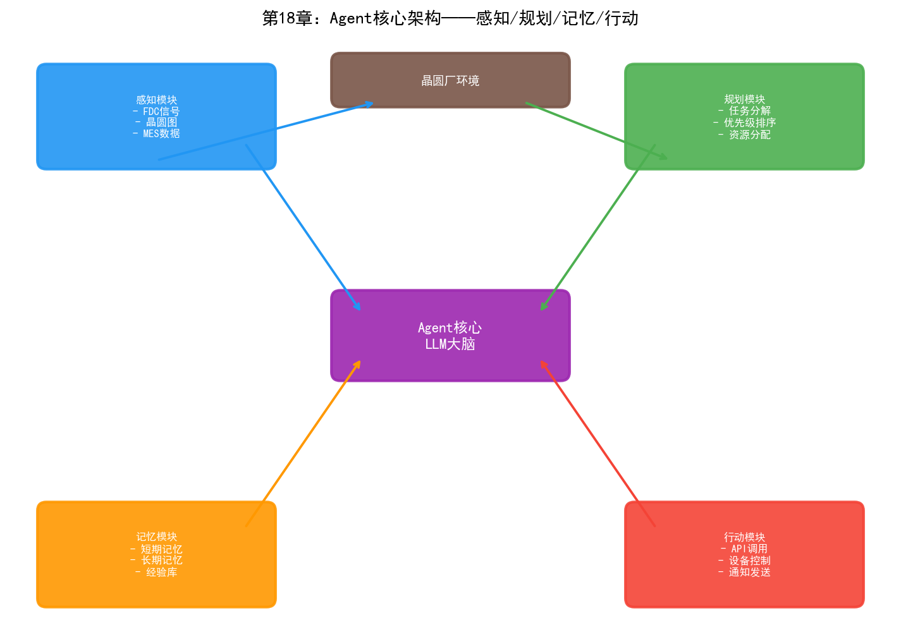
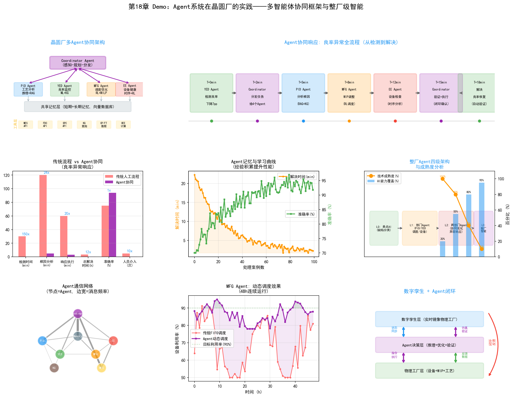

# 第23章 Agent 系统在晶圆厂的实践

## 23.1 Agent 技术概述

如果LLM是"大脑"，那么Agent就是"大脑+手脚"。LLM本身只能接收文本输入、生成文本输出——它不能查询数据库、不能调用API、不能控制设备。Agent在LLM的基础上增加了"行动能力"——通过调用外部工具来感知环境并执行操作。

### 从 LLM 到 Agent 的演进

2023年，OpenAI推出了"Function Calling"功能——LLM可以根据用户的请求，决定调用哪个外部函数并生成调用参数。这个看似简单的功能是Agent技术的起点——LLM从"只会说话"变成了"会用工具"。

随后，开源社区涌现了大量Agent框架——LangChain、AutoGPT、CrewAI、AutoGen等。这些框架提供了Agent的基础设施：工具注册、记忆管理、多步推理、错误恢复。ReAct（Reasoning + Acting）范式成为主流——Agent在每一步交替进行推理（"我需要先查什么"）和行动（调用工具获取结果），根据结果决定下一步。

### Agent 核心组件

一个完整的Agent系统包含四个核心组件：

**感知（Perception）：** Agent如何"看"到环境状态。在晶圆厂中，感知通过调用工具实现——查询MES获取产线状态、查询FDC获取设备数据、查询YMS获取良率数据。每个查询工具的返回结果就是Agent对环境的"观察"。

**规划（Planning）：** Agent如何将复杂目标分解为可执行的步骤。当工程师问"分析LOT-B67890的良率异常原因"时，Agent需要规划：先查CP结果→分析缺陷模式→定位异常工艺步骤→查询对应设备FDC数据→关联分析→生成报告。规划可以是预先定义的工作流（确定性规划），也可以由LLM动态生成（自适应规划）。

**记忆（Memory）：**
- 短期记忆：当前任务的上下文——已执行的步骤、已获取的数据、中间分析结果。短期记忆存储在LLM的上下文窗口中。
- 长期记忆：跨任务的历史经验——过去处理过的类似问题的解决方案、工程师的偏好、已知的因果模式。长期记忆通常存储在向量数据库中，通过相似度检索调用。

**行动（Action）：** Agent通过调用工具执行操作。工具类型包括：
- 信息查询工具：query_mes、query_fdc、query_spc、query_yms
- 分析工具：statistical_analysis、defect_pattern_recognition、root_cause_search
- 生成工具：generate_report、create_ticket、send_notification
- 执行工具（需要人类审批）：adjust_recipe、schedule_pm、dispatch_lot

工具的选择和调用由LLM根据当前状态和目标决定——这就是Agent与传统脚本的根本区别。脚本的执行路径是预定义的，Agent的执行路径是根据情况动态决定的。

### 多 Agent 系统架构

复杂的任务可能超出单个Agent的能力范围——需要不同专业知识的Agent协同工作。多Agent系统将任务分配给多个专业化的Agent，各自处理擅长的部分。

几种典型的多Agent架构：

**层级架构（Hierarchical）：** 一个"主管Agent"负责任务分解和协调，将子任务分派给专业Agent。主管Agent汇总各专业Agent的结果，形成最终输出。

```
主管Agent (Orchestrator)
  ├─ 工艺分析Agent → 分析工艺参数异常
  ├─ 设备诊断Agent → 分析设备健康状态
  ├─ 缺陷分析Agent → 分析缺陷模式
  └─ 报告生成Agent → 汇总生成分析报告
```

**协作架构（Collaborative）：** 多个Agent以平等角色协作，通过消息传递交换信息。每个Agent可以"看到"其他Agent的分析结果并据此调整自己的工作。

**流水线架构（Pipeline）：** 多个Agent按顺序处理任务，每个Agent的输出是下一个Agent的输入。适用于流程化的分析任务。

## 23.2 工艺整合 Agent

### 自动工艺分析 Agent

PID工程师在面对良率问题时，需要进行一套系统性的分析流程：收集批次数据→查看工艺路径→检查关键参数→对比正常批次→定位偏差→推断根因。这个过程高度依赖经验，且涉及多系统数据查询。

工艺分析Agent将这个流程自动化：

```
输入: "LOT-B67890 CP良率85%，比同产品均值低7%"

Agent执行轨迹:
  [思考] 需要先确认该批次的工艺路径和关键工序
  [行动] 调用 query_mes(lot_id="B67890") 获取工艺路径
  
  [观察] 工艺路径: 1200步，使用设备23台
  
  [思考] 比较该批次与正常批次的关键量测参数
  [行动] 调用 query_spc(lot_id="B67890", 
                       comparison_lots=["normal_b67800", "normal_b67850"])
  
  [观察] 第623步刻蚀的CD值偏差+4%（正常批次±1%），
        第624步薄膜厚度偏差-3%（正常批次±1.5%）
  
  [思考] CD偏差可能来自刻蚀设备或光刻设备，需要进一步追查
  [行动] 调用 query_fdc(tool_id="ETC-03", 
                        lot_id="B67890", step=623)
  
  [观察] ETC-03在B67890批次加工时RF功率波动2.8%（正常<1%）
  
  [思考] RF功率波动可能导致CD偏差。检查该设备的历史趋势
  [行动] 调用 query_fdc_history(tool_id="ETC-03", 
                                 last_days=7)
  
  [观察] ETC-03的RF功率波动在过去3天逐步增大，可能匹配器老化
  
  [结论] 根因: ETC-03匹配器调谐异常导致RF功率波动，
        进而影响CD均匀性，导致良率下降。
  [建议] 检查ETC-03匹配器，安排维护。
  [行动] 生成分析报告并提交PID工程师审核。
```

这个过程中Agent展现了三个关键能力：自适应规划（根据每一步的结果调整下一步行动）、多工具协同（调用MES、SPC、FDC三个系统的数据）、因果推理（从RF功率波动→CD偏差→良率下降的因果链）。

### 跨部门协同 Agent

当良率问题涉及多个部门时——如PID需要MFG确认排程影响、需要EE检查设备状态——跨部门协同Agent可以自动协调信息收集和分析。

```
主管Agent接收: "3nm产品A的CP良率连续3天下降2%"
  │
  ├─ 分派给 工艺分析Agent
  │    → 发现第45步参数偏差
  │    → 需要确认设备状态
  │
  ├─ 分派给 设备诊断Agent  
  │    → 查询FDC: 第45步使用的ETC-05设备RF功率异常
  │    → 查询维护记录: ETC-05距上次PM已运行95批次
  │    → 判断: 需要安排PM
  │
  ├─ 分派给 调度分析Agent
  │    → 查询MES: ETC-05当前有12批在排队
  │    → 模拟: 如果ETC-05停机PM，影响3个客户订单交期
  │    → 建议: 将排队批次路由到ETC-03（有备用产能）
  │
  └─ 主管Agent汇总:
       根因: ETC-05匹配器老化导致RF功率异常
       影响: 3天良率下降2%，约15批次受影响
       建议措施:
         1. 立即将ETC-05排队批次路由到ETC-03
         2. 安排ETC-05匹配器维护
         3. 维护后运行3批验证晶圆
       交期影响: 客户C的订单延迟1天（可接受）
```

## 23.3 良率分析 Agent

### 自动根因分析 Agent

根因分析是YED最核心也最耗时的任务。一个自动化的RCA Agent可以将第六章描述的RCA流程自动化——从良率异常告警触发，到生成根因分析报告。

RCA Agent的架构：

**触发：** SPC系统检测到CP良率超出控制限，自动触发RCA Agent。

**数据收集阶段：** Agent自动收集所有相关数据——批次的完整工艺历史（MES）、所有设备的FDC数据、关键步骤的SPC量测数据、缺陷检测结果（YMS）。这个阶段Agent需要决定"哪些数据是相关的"——不是所有1200步的参数都需要检查，Agent应该根据经验先聚焦最可能出问题的步骤。

**模式识别阶段：** Agent使用预训练的CNN模型对晶圆图进行缺陷模式分类，使用统计方法比较异常批次与正常批次的参数差异，使用知识图谱搜索已知的缺陷-参数-设备关联路径。

**根因推断阶段：** Agent综合以上分析结果，推断最可能的根因。这个推断过程需要结合：数据驱动的关联分析（连接主义）、领域知识的因果推理（符号主义）、历史案例的类比参考（长期记忆）。

**报告生成阶段：** Agent生成结构化的RCA报告，包含：异常描述、数据分析过程、根因假设（及置信度）、建议措施。报告提交YED工程师审核。

### 良率异常响应 Agent

RCA Agent聚焦于"找到原因"，响应Agent聚焦于"采取行动"。当根因确定后，响应Agent需要协调多个系统执行处置措施：

- 如果根因是设备问题：自动创建维护工单、调整MES排程将受影响批次路由到备用设备、通知EE工程师
- 如果根因是工艺参数问题：生成参数调整建议（由PE工程师审核后执行）、标记受影响批次为"Hold"状态待复判
- 如果根因是原材料问题：追溯受影响的原材料批次、识别所有使用了该批次的在制品和成品

响应Agent的关键设计原则是"人在环中"（Human-in-the-Loop）——所有影响生产或设备的操作都需要工程师审批后才能执行。Agent的角色是"建议和准备"，不是"决策和执行"。

## 23.4 制造调度 Agent

### 动态调度 Agent

传统的派工系统是规则驱动的——预先定义规则，系统按规则执行。动态调度Agent是策略驱动的——Agent根据产线的实时状态动态决定派工策略。

动态调度Agent的工作模式：

**感知：** 实时从MES获取产线状态——各设备的队列长度、各批次的优先级和交期、设备状态。每分钟更新一次状态。

**决策：** 对每台空闲设备，Agent评估队列中所有可派遣批次的"优先级得分"。得分计算不仅考虑批次自身属性（交期、优先级），还考虑全局影响——派遣这个批次对瓶颈设备的WIP有何影响？对其他批次的交期有何连锁效应？

**行动：** 将得分最高的批次分配给空闲设备。如果得分差距小（多个批次差不多优先），Agent可以选择对全局最优的方案——这需要模拟"如果选择A vs 选择B"对后续N小时产线状态的影响。

**反馈：** 观察派工决策后的产线状态变化，作为学习信号更新决策策略。

### 异常处理 Agent

当设备故障等异常发生时，异常处理Agent需要快速做出一系列决策：

1. 识别受影响的在制品批次
2. 评估备选设备（同类设备的当前负载和状态）
3. 计算重新路由对交期的影响
4. 生成最优的批次重新分配方案
5. 自动调整MES中的派工指令（或建议调度员调整）
6. 通知相关人员和系统

这个过程的时效性极强——设备故障后的每一分钟都在损失产能。Agent可以在几秒内完成人类调度员需要十几分钟才能完成的评估和决策。

## 23.5 设备维护 Agent

### 预测性维护决策 Agent

第十一章讨论了预测性维护中的RUL预测（连接主义）和维护决策优化（行为主义）。Agent将这两个层次整合为一个端到端的系统：

**监控阶段：** Agent持续监控所有设备的FDC数据，使用LSTM模型评估每台设备的健康度评分。当某台设备的评分降至预警阈值时，Agent激活。

**分析阶段：** Agent深入分析该设备的具体退化模式——哪些传感器通道在退化？退化速率如何？与历史故障案例的相似度如何？预测RUL（剩余可用批次数）。

**决策阶段：** Agent评估维护选项的代价和风险：
- 立即维护：代价=停机4小时+产能损失，风险=低
- 延迟50批次后维护：代价=可能影响工艺质量，风险=中
- 延迟100批次后维护：代价=高良率风险，风险=高

Agent结合当前产线的WIP状态和维护窗口可用性，给出最优的维护时机建议。

**执行阶段：** 自动创建维护工单、预订备件、通知EE工程师。维护完成后自动启动验证流程——运行测试晶圆、检查参数恢复情况。

### 设备健康监控 Agent

设备健康监控Agent是预测性维护的"日常模式"——不是在设备即将出问题时才激活，而是持续监控所有设备的健康状态，提供全景视图。

Agent的输出是一个"设备健康仪表盘"，显示：
- 每台设备的当前健康度评分（0-100）
- 退化趋势（过去7天的评分变化）
- 预警设备列表（评分低于阈值的设备）
- 建议的维护优先级排序

EE工程师通过这个仪表盘可以一目了然地看到哪些设备需要关注，而不需要逐一查看每台设备的FDC数据。

## 23.6 整厂级 Agent 架构

### 多 Agent 协同框架

整厂级智能不是一个大而全的Agent——而是多个专业Agent的协同网络。每个Agent负责自己的领域，通过消息传递和共享状态进行协调：

```
                    ┌─────────────────┐
                    │  整厂协调Agent    │
                    │ (Orchestrator)  │
                    └────┬───┬───┬────┘
                         │   │   │
          ┌──────────────┤   │   ├──────────────┐
          │              │   │   │              │
    ┌─────┴─────┐  ┌─────┴──┐ │ ┌──┴─────┐  ┌───┴─────┐
    │ 工艺分析   │  │调度Agent│ │ │设备维护  │  │良率分析  │
    │  Agent    │  │        │ │ │ Agent  │  │ Agent  │
    └─────┬─────┘  └────┬───┘ │ └───┬────┘  └───┬────┘
          │              │   │     │           │
          └──────────────┴───┴─────┴───────────┘
                    共享知识图谱 + 记忆
```

整厂协调Agent（Orchestrator）负责接收工程师的请求或系统的事件触发，将任务分解并分派给专业Agent。专业Agent在执行过程中可以互相通信——如设备维护Agent发现某设备需要停机时，通知调度Agent调整排程。

### 数字孪生与 Agent 的结合

数字孪生（Digital Twin）是整厂级Agent的关键基础设施。数字孪生是晶圆厂的虚拟镜像——模拟产线上的晶圆流动、设备处理时间、工艺参数和良率关系。

Agent与数字孪生的结合在三个层面发挥作用：

**预测：** Agent在数字孪生中模拟不同决策的后果——"如果ETC-05明天停机维护，未来72小时的产能影响是什么？"数字孪生提供预测环境，Agent做出基于预测的决策。

**训练：** 强化学习Agent在数字孪生中进行训练——在虚拟环境中进行数百万次试错，学习有效的调度和维护策略，然后将策略部署到真实产线。

**验证：** 当Agent准备做出重要决策（如调整工艺参数）时，先在数字孪生中验证决策的效果——如果模拟结果显示良率会下降，Agent会修改或放弃该决策。

数字孪生的精度是整个系统有效性的前提——如果数字孪生不能准确模拟真实产线的行为，在数字孪生中训练的策略可能在现实中失效。构建高精度数字孪生本身就是一个重大工程，需要整合设备物理模型、工艺化学模型、产线调度模型等多学科知识。

### 从单点 AI 到整厂智能

半导体晶圆厂的AI发展正在经历从"单点优化"到"整厂智能"的演进。当前的AI应用大多是孤立的——缺陷检测系统、预测性维护系统、良率分析系统各自独立运行，数据和模型不共享。

整厂级Agent架构的目标是打破这些孤岛，让不同领域的AI能力协同工作。一个良率问题不再需要工程师在多个系统之间手动切换——Agent自动协调工艺分析、设备诊断、调度调整和维护安排，将工程师的注意力从"收集和关联数据"解放到"审核和决策"。

这个愿景的实现需要解决三大技术挑战：

**数据融合：** 不同系统的数据格式、语义、时间粒度各不相同。Ontology（第六部分的主题）提供了跨系统数据融合的语义基础。

**模型协同：** 不同领域的AI模型（缺陷分类CNN、设备预测LSTM、调度RL策略）需要在一个统一框架中协同。Agent架构提供了模型编排的机制。

**安全与可控：** 当AI系统的决策影响生产时，必须保证安全可控。Human-in-the-Loop设计和约束生成确保AI在安全边界内运作。

第六部分将深入讨论Ontology——这不仅是数据融合的技术方案，更是整厂级智能的语义基础设施。Palantir在三星晶圆厂的成功案例证明了这一点。



> **本章配套实验**：第27章 27.18 节的 LLM Agent 工具调用实验（`demos/experiments/llm_agent_tool_use`）实现 ReAct 循环，演示 LLM 如何自主调用工具完成"感知→规划→行动→观察"，是 Agent 系统的核心机制。

> **本章配套实验**：第27章 27.21 节的多 Agent 协作诊断实验（`demos/experiments/multi_agent_collaboration`）演示主持人 Agent 编排四个专业 Agent 协同诊断；27.23 节的反思型 Agent（`demos/experiments/reflexion_agent`）演示 Agent 通过"评估+反思+重试"实现自我改进。

## 23.7 Demo可视化：多Agent协同框架



*Demo说明：左上为多Agent协同架构，上方为Agent响应良率异常全流程时间线。中排分别为Agent vs 传统流程对比、Agent记忆与学习曲线、整厂Agent四级架构。下排分别为Agent通信网络、动态调度效果、数字孪生+Agent闭环。模拟脚本见 `demos/demo_ch23_agent_system.py`。*

> **本章配套实验**：两个实验补全 Agent 系统的"验证"环节——第27章 27.11 节的评估框架（`demos/experiments/fab_agent_test`）提供质量/成本/韧性三维评估方法；27.10 节的红蓝对抗（`demos/experiments/wafer-trust-guard`）演示上线前的对抗式信任演练。
