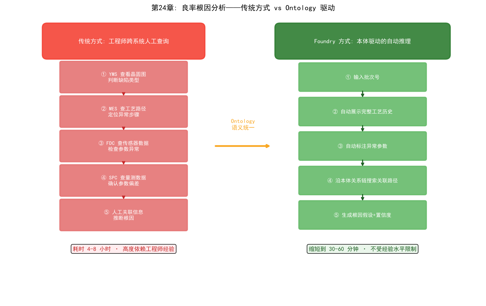
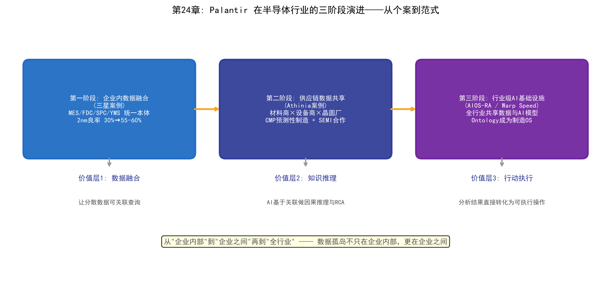
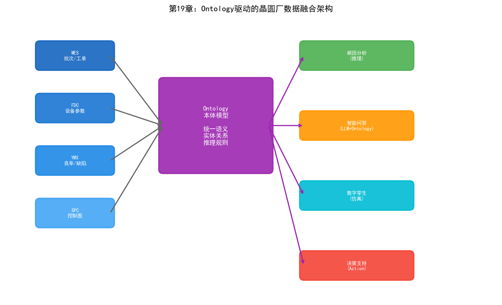

# 第24章 Palantir 与本体论——从击毙本拉登到三星良率飞跃

## 24.1 什么是 Ontology（本体论）

### 从哲学到计算机科学

"Ontology"这个词源于哲学。在古希腊哲学中，ontology研究的是"存在的本质"——什么东西存在、存在的范畴有哪些、不同范畴的存在者之间是什么关系。亚里士多德的《范畴篇》是最早的本体论探索之一——他定义了实体、数量、性质、关系、地点、时间等十个范畴。

当计算机科学家借用这个词时，他们问的是一个更具体的问题：如何让计算机"理解"世界中的实体和它们之间的关系？

1993年，托马斯·格鲁伯（Thomas Gruber）给出了计算机科学中本体论的经典定义：

> "Ontology是对共享概念化的明确、形式化的规范。"

这句话拆解开来：

- **概念化（Conceptualization）：** 识别领域中存在的实体类型和它们之间的关系——晶圆厂中有Wafer、Tool、Recipe、Defect等实体，它们之间有uses、produces、causes等关系
- **明确（Explicit）：** 概念和关系被显式定义，而非隐含在代码中——任何人都可以查看本体定义并理解其含义
- **形式化（Formal）：** 用机器可处理的形式语言描述——OWL、RDF等，使得计算机可以对本体的逻辑进行自动推理
- **共享（Shared）：** 本体是多人/多系统共同认可的——不是某个工程师的私有数据模型，而是整个组织同意遵循的语义标准

### 本体论在 AI 中的地位

在AI的三大学派中，本体论属于符号主义的技术分支。它继承了符号主义的核心信念——智能的基础是知识表示和推理——但在知识表示的形式上远比专家系统的"如果-那么"规则丰富。

专家系统的规则是"扁平"的——一条条独立的规则，彼此之间缺乏结构化的关联。本体论引入了层次化、结构化的知识表示：类与子类的继承关系、属性的定义域和值域约束、实体之间的多种关系类型、以及自动推理规则。

当本体论与知识图谱结合时，前者提供"概念模型"（schema——什么是Wafer、什么是Tool），后者提供"实例数据"（data——W001是一片具体的Wafer、ETC-03是一台具体的Tool）。两者合在一起，构成了一个可以被计算机自动推理的知识系统。

### 与知识图谱的关系与区别

本体论和知识图谱经常被混淆，因为它们在技术上有大量重叠。简化的区分：

| 维度 | 本体论（Ontology） | 知识图谱（Knowledge Graph） |
| --- | --- | --- |
| 侧重 | 概念模型——定义"什么是Wafer" | 实例数据——存储"W001是一片Wafer" |
| 形式化程度 | 高（OWL等描述逻辑，支持自动推理） | 中（RDF三元组或Property Graph） |
| 推理能力 | 支持类层次推理、一致性检查、隐含知识推导 | 依赖图算法（路径搜索、社区检测等） |
| 变化频率 | 相对稳定（概念模型不常变） | 频繁更新（每批晶圆产生新实例） |

在实际工程中，两者通常是配合使用的——本体定义概念模型和推理规则，知识图谱存储实例数据并接受本体的推理。Palantir的Foundry平台就是这种"本体+实例数据"的统一体。

## 24.2 Palantir 的故事

### 创始：Peter Thiel 与 Alex Karp

2003年，硅谷。Peter Thiel刚刚以15亿美元将PayPal卖给了eBay，正在寻找下一个大机会。9·11事件后的美国情报体系暴露了一个令人尴尬的事实：CIA、FBI、NSA各自拥有海量情报数据，但这些数据分散在不同的系统中，格式不兼容，安全级别不互通，分析人员只能手工在多个系统之间切换和关联——效率极低。9·11委员会在事后调查中指出：情报机构"拥有"拼出袭击图景所需的全部信息碎片，但缺乏将它们拼起来的能力。

Thiel看到了这个机会。他与Alex Karp、Joe Lonsdale、Stephen Cohen和Nathan Gettings共同创立了Palantir Technologies。公司名称来自托尔金《指环王》中的"真知晶石"（Palantír）——一种可以让人看到远方事物的水晶球。这个名字暗含了Thiel和Karp的理念：技术可以揭示真相，但也需要防止滥用。

传统的风险投资机构对一家主要面向美国情报机构销售的初创公司兴趣寥寥。Thiel自己的Founders Fund基金承担了大部分早期约3000万美元的启动资金。

2004年，Palantir获得了In-Q-Tel——CIA旗下的风险投资机构——约200万美元的投资。金额不大，但战略意义极高。In-Q-Tel不仅带来了资金，更重要的是带来了CIA分析师的直接参与——这些分析师帮助Palantir的工程师理解情报分析的真实工作流程和数据形态，将软件设计为真正满足情报人员需求的产品。2005年，CIA成为Palantir的第一个大客户。

### 击毙本拉登：Palantir 如何帮助 CIA 定位目标

2011年5月1日，美国海军海豹突击队在巴基斯坦阿伯塔巴德（Abbottabad）的一栋建筑中击毙了奥萨马·本·拉登。这次行动的成功建立在长达十年的情报搜集和分析之上，而Palantir的Gotham平台在其中扮演了关键角色。

寻找本拉登的核心挑战不是缺少情报——美国情报机构拥有海量数据。问题是数据太多了，而且散落在无数系统中：卫星图像、无人机监控画面、通信截获记录、线人报告、新闻报道、金融交易记录、旅行记录……情报分析人员需要从这些海量、异构、碎片化的数据中找到关联——某个可疑电话号码与某次资金转账之间的联系，某个信使的行踪与某栋建筑之间的关联。

Palantir的Gotham平台做的事情是：将所有这些异构数据源整合到一个统一的语义模型中。每一条情报——无论来自SIGINT（信号情报）、HUMINT（人力情报）还是OSINT（开源情报）——被映射为本体中的对象，对象之间的关系在图上显式表达。分析人员可以在图上进行链式探索：从一个电话号码出发，找到与之通信的其他号码，追踪这些号码的地理位置和通话模式，关联到人员身份，最终定位到阿伯塔巴德的那栋建筑。

Gotham的技术核心就是本体论——它定义了情报领域本体：Person、Organization、Location、Communication、Transaction、Event等对象类型，以及它们之间的关联关系。当分散在不同系统中的数据被映射到这个统一本体后，原本隐藏在海量数据中的关联模式变得可被发现。

需要指出的是，Palantir并非"找到本拉登"的唯一功臣。整个搜寻行动涉及多个机构、多种技术手段和大量人力。Palantir的角色是提供了数据整合和分析的基础设施——使得分析人员能够更快地发现和验证关联线索。

### 追踪哈梅内伊：Palantir 在伊朗核设施监控中的角色

2025-2026年间，Palantir在对伊朗的军事和情报行动中扮演了更加前沿的角色——这次不再是辅助分析工具，而是首次实现了"AI主导的杀伤链"。

Palantir与伊朗核问题的关联可以追溯到2015年。那一年，Palantir的MOSAIC系统被整合进国际原子能机构（IAEA）的核查工作中，作为2015年伊核协议（JCPOA）的技术支持工具。MOSAIC是一个价值约5000万美元的AI系统，它处理了约4亿个数据对象——卫星图像、设施文件、传感器测量数据、伊朗境内人员的社交媒体信息——生成关于核扩散风险的预测性评估。

MOSAIC的核心能力是从看似不相关的数据碎片中发现模式。一座工厂的电力消耗异常增加、某条道路上的车辆通行模式变化、某位核科学家与特定设施之间的人员流动模式——这些碎片化的信号在MOSAIC的本体模型中被关联起来，形成对伊朗核活动的全景视图。

2025-2026年的军事行动中，Palantir的AI平台（AIP）及其军用版本Gotham5被用作"作战神经中枢"。据媒体报道，Palantir整合了来自多个美国机构的碎片化数据——卫星图像、无人机画面、雷达信号、截获的通信——映射伊朗全境的军事活动。Anthropic的Claude模型分析这些数据，确定最优目标、方法和打击序列，向人类指挥官提供可行动的建议。

清华大学社会学系教授孙立平将此描述为"AI主导的算法战争"——AI第一次在实战中定义了杀伤链的"目标、时机和方式"，人类指挥官只做最终批准，而非设计打击方案。

这一事件的意义远超军事范畴。它证明了一件事：当Ontology技术被用于整合海量异构数据时，AI可以做到传统分析方法无法做到的事情——从碎片化数据中自动发现关联、预测模式、生成行动方案。这个能力从军事场景迁移到工业场景，就是Palantir在三星晶圆厂中做的事。

### 从军工到工业的转型

Palantir从军工向商业领域的转型始于2010年左右。Gotham平台在情报领域的成功证明了一个技术事实：本体论驱动的数据整合框架可以应用于任何需要跨系统数据融合的场景。商业企业同样面临"数据散落在多个系统中、无法被有效整合和分析"的问题。

2016年，Palantir推出了Foundry平台——面向商业和工业客户的数据整合与分析平台。Foundry继承了Gotham的核心技术理念（本体论驱动的数据融合），但在交互设计上从情报分析者的"图探索"转向了企业用户的"工作流和仪表盘"。

Foundry的客户涵盖金融（摩根士丹利、西方石油）、航空（空中客车）、医疗（美国国立卫生研究院）、制造（默克、圣戈班）等行业。而半导体行业最具标志性的客户，就是三星。

## 24.3 Palantir 的技术架构

### Gotham 平台（国防与情报）

Gotham是Palantir面向国防和情报领域的产品。它的核心功能是多源情报融合——将SIGINT（信号情报）、HUMINT（人力情报）、OSINT（开源情报）、GEOINT（地理空间情报）等不同类型的数据整合到一个统一的分析环境中。

Gotham的技术特点：

**多层安全架构（MLS/Cross-Domain）：** Gotham最深层的技术壁垒是多层安全架构——在一个界面中同时显示不同密级的数据（TS/SCI、SECRET、UNCLASSIFIED），同时确保高密级信息不会"泄露"到低密级层。这种跨域信息处理能力是传统国防承包商未能解决的难题。

**图探索分析：** 分析人员可以在知识图上进行自由探索——从一个实体出发，沿关系链路扩展，发现隐含的关联网络。这种"假设驱动的探索"模式适合情报分析——分析人员不需要预先知道要找什么，而是在探索中发现线索。

**动态本体：** 情报领域的本体不是固定的——新的威胁行为体、新的通信技术、新的地理热点随时可能出现。Gotham允许分析人员在运行时修改本体——添加新的实体类型和关系类型，而不需要重新部署系统。

### Foundry 平台（商业与工业）

Foundry是Palantir面向商业客户的产品，也是三星晶圆厂使用的平台。它的核心是"Ontology"——一个企业级的语义层，将所有数据源、分析模型和业务逻辑统一在一个本体模型下。

Foundry的架构可以概括为五层：

```
┌─────────────────────────────────────────────┐
│  应用层 (Applications)                       │
│  仪表盘 / 工作流 / API / LLM Agent           │
├─────────────────────────────────────────────┤
│  本体层 (Ontology)                           │
│  对象类型 / 关系 / 动作 / 函数               │
│  ← 语义统一层，所有数据的"通用语言"          │
├─────────────────────────────────────────────┤
│  模型层 (Models)                              │
│  ML模型 / 统计模型 / 优化模型                 │
├─────────────────────────────────────────────┤
│  数据层 (Data Integration)                    │
│  ETL管道 / 流式数据 / 联邦查询                │
├─────────────────────────────────────────────┤
│  数据源 (Sources)                             │
│  MES / FDC / SPC / YMS / ERP / IoT           │
└─────────────────────────────────────────────┘
```

**数据源层：** Foundry通过ETL管道和流式数据接口连接企业的各种数据源。在晶圆厂场景中，这包括MES、FDC、SPC、YMS、设备IoT数据等。数据从源系统被"接入"Foundry，但不被"复制"——Foundry支持联邦查询，可以直接查询源系统中的数据而不需要物理拷贝。


*图24-1：Palantir Foundry 五层架构——以本体层为核心*

**本体层（核心）：** 这是Foundry与普通数据平台最根本的区别。大多数数据平台的做法是"建一个数据湖，把所有数据倒进去，然后用SQL查询"。Foundry的做法是先构建一个本体——定义企业中的核心实体类型（如Wafer、Tool、Recipe、Defect）、它们之间的关系（如Wafer usesTool Tool）、以及可以在实体上执行的动作（Action，如schedulePM）和函数（Function，如calculateYield）。

一旦本体定义完成，所有数据源的数据都被映射到本体中的对象实例。MES中的批次数据变成`Lot`对象，FDC中的传感器数据变成`Tool`对象的属性，SPC中的量测结果变成`Measurement`对象。不同系统中的数据在语义上被统一——不再有"MES中的step和SPC中的operation是不是同一个东西"的困惑。

**模型层：** ML模型可以被"绑定"到本体对象上。一个预测设备RUL的LSTM模型可以绑定到`Tool`对象上——每当查询某个`Tool`对象时，模型自动运行并返回预测结果。模型不是独立的"AI应用"，而是本体中的一个函数——可以被任何引用该对象的应用调用。

**应用层：** 基于本体构建的应用——仪表盘、分析工作流、API接口、甚至LLM Agent。因为所有应用都基于同一个本体，它们之间的数据一致性天然得到保证——不可能出现"仪表盘A显示良率92%，仪表盘B显示89%"的矛盾。

### Ontology 作为核心引擎

Palantir的Ontology与学术界的本体论有一个关键区别：它不仅包含静态的概念和关系，还包含动态的行为——动作和函数。

**动作：** 定义在对象上可以执行的操作。例如，`Tool`对象可以有一个`schedulePM`动作——当用户或AI系统调用这个动作时，Foundry自动执行PM排程的完整流程：检查维护窗口、创建维护工单、通知相关人员、更新设备状态。动作的定义包含了前置条件检查（如"设备必须不在运行中"）和后置效应（如"设备状态变为'维护中'"）。

**函数：** 定义在对象上的计算逻辑。例如，`Lot`对象可以有一个`calculateYield`函数——根据该Lot所有晶圆的CP测试结果计算良率。函数的定义是声明式的——用户不需要知道数据在哪个系统中、用SQL怎么查，只需要调用`lot.calculateYield()`。

这种"对象+动作+函数"的本体模型使得Foundry不仅仅是一个数据分析平台，而是一个"可执行的企业数字孪生"[93]——本体不仅是数据的语义映射，还是企业运营逻辑的形式化表达。当AI Agent在Foundry上运行时，它可以通过调用本体上的动作和函数来感知状态和执行操作——这正是第23章描述的Agent架构的理想运行环境。

## 24.4 Palantir 进入半导体

### 三星半导体引入 Palantir Foundry 的背景

2024年底，三星电子DS（半导体）部门做出了一个被业内视为"近乎疯狂"的决定——将晶圆厂核心制造数据接入美国Palantir公司的Foundry平台。

半导体工艺数据是比芯片设计图纸更敏感的商业机密。一片晶圆的完整工艺数据——设备参数、量测结果、缺陷信息、良率数据——如果泄露给竞争对手，等于暴露了自己最核心的工艺秘密。台积电和英特尔从未让任何第三方触碰产线数据。

三星之所以破例，原因只有一个：2nm GAA工艺的良率已经跌到了30%左右。

2nm是三星从FinFET转向GAA（Gate-All-Around，全环绕栅极）晶体管架构的第一代工艺。GAA架构相比FinFET在性能和功耗上有显著优势，但工艺复杂性急剧增加——纳米片的厚度控制要求在亚纳米量级，内隔离层的尺寸精度要求在4-6纳米。这种极端的工艺精度要求使得良率爬坡变得异常困难。

30%的良率意味着每生产10片晶圆，只有3片是"好的"——这个数字远低于60%的量产门槛。三星在2nm上的良率困境直接影响了其代工竞争力——高通据报道因此选择了台积电的2nm工艺而非三星。

传统的良率提升方法——DOE实验、工程师经验、FDC监控——在2nm的复杂性面前显得力不从心。问题的根因往往涉及数百个工艺步骤和数十台设备之间的复杂交互，而这些数据散落在几十个异构系统中。一个简单的根因分析问题——"第67步的良率下降是否与第23步的参数偏差有关"——可能需要工程师在MES、FDC、SPC、YMS四个系统中分别查询数据，然后人工关联。

### 良率提升的具体故事

三星引入Palantir Foundry后，第一件事不是训练AI模型——而是构建晶圆厂的Ontology。

Foundry的工程团队与三星的PID和YED工程师合作，定义了晶圆厂核心本体：

- **产品本体：** Wafer（晶圆）、Die（裸片）、Device（器件）、Layer（工艺层）、Lot（批次）
- **工艺本体：** Recipe（配方）、ProcessStep（工艺步骤）、Route（工艺路线）、Module（工艺模块）
- **设备本体：** Tool（设备）、Chamber（腔体）、Component（部件）、ConsumablePart（消耗件）
- **参数本体：** Parameter（参数）、SetPoint（设定值）、Measurement（量测值）、SensorData（传感器数据）
- **缺陷本体：** Defect（缺陷）、DefectType（缺陷类型）、DefectPattern（缺陷模式）、RootCause（根因）
- **测试本体：** WAT、CP、FT、TestItem（测试项）、TestResult（测试结果）

定义本体之后，将MES、FDC、SPC、YMS等系统中的数据映射到本体中的对象实例。这个过程是工程量最大的环节——需要理解每个系统的数据schema，建立从源数据到本体对象的映射规则。

当数据被统一到本体后，Foundry实现了三星此前无法做到的事情：跨系统的关联查询和推理。以一个典型的良率问题为例——"某批次CP良率为什么低于正常水平"：

传统方式下，YED工程师需要：
1. 在YMS中查看晶圆图模式→判断缺陷类型
2. 在MES中查看该批次的工艺路径→定位可能的异常步骤
3. 在FDC中查看对应设备的传感器数据→检查参数异常
4. 在SPC中查看量测数据→确认参数偏差
5. 人工关联以上信息→推断根因

这个过程需要4-8小时，且高度依赖工程师的经验和直觉——有经验的工程师能更快地找到正确的查询路径，但新手往往需要反复尝试。

在Foundry上，这个过程变成了：
1. 在本体检索中输入批次号
2. 系统自动展示该批次的完整工艺历史——所有步骤、设备、参数、量测结果、缺陷信息
3. 系统自动标注异常项——与正常批次相比偏差超过阈值的参数
4. 系统沿本体中的关系链路搜索关联路径——从异常参数出发，找到对应的设备和步骤
5. 系统生成根因假设列表——每个假设附带推理路径和置信度

这个过程缩短到30-60分钟，且不受工程师经验水平的限制——本体中的知识是全厂共享的，任何工程师都可以借助本体的推理能力进行分析。



*图24-2：晶圆良率根因分析（RCA）——传统跨系统人工查询与 Ontology 驱动自动推理对比*

根据公开报道，三星2nm良率从2024年底的约30%提升到2026年中期的约55%-60%。三星同时在其AI Megafactory中部署了大规模AI算力，将AI优化贯穿全流程——缺陷检测改善30%、晶圆良率提升15%。虽然良率提升不能完全归功于Palantir（三星同时投入了大量内部工程力量和其他AI技术），但Foundry提供的数据融合基础设施被认为是加速良率爬坡的关键因素。

### 为什么传统数据平台做不到

三星此前并非没有尝试过自建数据平台。传统的数据湖（Data Lake）方案——将所有系统数据导出到一个Hadoop/Spark集群中——在半导体场景中遇到了根本性困难：

**语义不统一。** 不同系统对同一概念有不同的命名和定义——MES中的"step"对应FDC中的"operation"对应YMS中的"stage"。数据湖把数据堆在一起，但不解决"这些数据是什么意思"的问题。工程师在数据湖中做关联查询时，仍然需要人工判断"step 45是不是operation 45"。

**缺乏关系建模。** 数据湖基于关系型模型（表），适合存储结构化数据但不擅长表达实体之间的复杂关系。"Wafer→Lot→Tool→Chamber→Component→ConsumablePart"这样的多层关联在关系型数据库中需要多表JOIN，查询效率低且可读性差。本体天然用图结构表达这种关联。

**静态而非动态。** 数据湖中的数据是"快照"——每天或每小时从源系统导出一次。但晶圆厂的运行是实时的——FDC数据每秒更新，CP测试结果每批次更新。当工程师分析问题时，他需要看到最新数据，而不是昨天的快照。Foundry通过流式数据管道实现近实时的本体更新。

**不可执行。** 数据湖只能查询和分析——如果分析发现问题，工程师需要切换到MES或其他系统去执行操作（如暂停批次、安排维护）。Foundry的本体包含动作——分析发现问题后可以直接在本体上执行操作，数据从分析到行动的链路被打通。

**无法支撑AI。** 数据湖中的数据没有语义标注——AI模型无法理解"表A的列X和表B的列Y是什么关系"。LLM Agent在数据湖上运行时，需要人工告诉它每个表的结构和表之间的关联。Foundry的本体天然提供了这些语义信息——LLM Agent可以直接在本体上操作，不需要人工解释数据结构。

## 24.5 Athinia——Palantir与默克的半导体数据合资公司

### 合资公司的诞生

如果说三星案例展示了Palantir Foundry在单一晶圆厂内部的价值，那么Athinia则展示了Ontology技术跨越企业边界的更大野心。

2021年12月，Palantir与德国默克集团（Merck KGaA，注意与美国默克Merck & Co.区分）宣布成立合资公司Athinia。默克是全球领先的半导体材料供应商——其电子科技业务提供光刻胶、特种气体、CMP浆料等半导体制造关键材料。Athinia的目标是构建一个半导体行业的数据共享平台，让材料供应商和芯片制造商之间能够安全地共享和分析数据。

这个想法直击半导体行业的一个长期痛点：材料供应商和晶圆厂之间的数据壁垒。材料供应商知道自家材料的批次间变异特性，晶圆厂知道工艺结果和良率——但双方的数据几乎不互通。当晶圆厂遇到良率问题时，很难追溯是否与某批材料的变异有关；材料供应商也缺乏反馈来改进产品质量。

Athinia的平台基于Palantir Foundry构建，核心思路是用Ontology建立材料-工艺-良率之间的语义关联。材料批次数据（供应商侧）和工艺结果数据（晶圆厂侧）被映射到统一的本体中，双方可以在保护各自数据隐私的前提下进行关联分析。

### 与美光的CMP预测性制造合作

Athinia最具代表性的案例是与美光科技（Micron Technology）在CMP（化学机械抛光）领域的合作。

CMP是半导体制造中工艺窗口最窄的步骤之一——抛光速率的微小波动都会影响晶圆的平坦度，进而影响后续光刻的套刻精度。CMP的工艺结果受多种因素影响：抛光浆料的批次差异、磨垫的退化状态、设备参数的漂移——这些因素分属不同实体（材料供应商、设备厂商、晶圆厂）的管控范围。

美光与Athinia合作构建了一个CMP预测性制造平台。平台整合了三个维度的数据：

- **材料侧：** 默克提供的CMP浆料批次数据——粒径分布、pH值、固体含量、粘度等
- **设备侧：** 美光CMP设备的运行数据——抛光压力、转速、浆料流量、磨垫状态
- **结果侧：** 抛光后的量测数据——去除量、均匀性、缺陷密度

在Foundry的本体模型中，这三类数据被关联为一条完整的因果链路：`Material → affects → ProcessParameter → affects → MeasurementResult`。当某批晶圆的CMP均匀性异常时，系统可以沿这条链路追溯到浆料的某个批次特性是否发生了变化。

美光全球质量副总裁Raj Narasimhan在新闻稿中表示："与默克和Palantir的合作使我们能够在CMP工艺中实现预测性制造——在问题影响生产之前就发现并解决它。"

### Athinia生态系统

Athinia不仅服务于美光和默克的双边关系，更在构建一个多边数据共享生态：

**ASNA（2024年7月合作）：** ASNA是半导体子组件追溯领域的参与者。Athinia与ASNA合作，将子组件的追溯数据纳入本体——从材料批次到子组件再到最终产品，实现全链路的追溯和质量关联。当某个子组件在最终测试中失效时，可以沿本体追溯其使用的材料批次、经过的工艺步骤和设备。

**东京电子（TEL）：** 作为全球四大半导体设备厂商之一，TEL通过Athinia平台共享设备性能数据。设备供应商了解设备的退化曲线和故障模式，晶圆厂了解设备在自己工艺环境中的实际表现——两者数据的融合使得预测性维护模型的精度大幅提升。

Athinia的模式代表了一种新的行业协作范式：竞争对手或上下游企业在Ontology的语义框架下共享数据，在不暴露商业机密的前提下实现协同优化。这解决了一个长期以来半导体行业"数据孤岛不只在企业内部、更在企业之间"的问题。

## 24.6 欧洲IDM案例——供应链可视化与产能规划

### 背景与部署

据市场研究机构Emergen Research的报告，Palantir披露了与一家"大型欧洲集成器件制造商（IDM）"的合作。该IDM部署了Foundry平台，用于其横跨欧洲和亚洲制造网络的供应链可视化和生产规划优化。

IDM（Integrated Device Manufacturer，集成器件制造商）与纯代工厂（如台积电）不同——IDM同时进行芯片设计、制造和销售，其供应链更加复杂。一家大型欧洲IDM（如英飞凌、恩智浦或STMicroelectronics——报告未披露具体名称）通常有多个晶圆厂、封装测试厂和设计中心分布在不同地区，产品线涵盖汽车电子、工业控制、消费电子等多个领域。

这家IDM面临的挑战是：不同工厂和不同产品线各自维护自己的数据系统，总部无法获得统一的产能和供应链视图。当某个工厂遇到产能瓶颈时，无法快速评估是否可以将订单转移到其他工厂——因为各工厂的工艺能力、设备配置和产能数据不在同一平台上。

### Foundry部署的价值

Foundry在该IDM的部署聚焦三个方向：

**多工厂产能可视化：** 将所有工厂的设备清单、工艺能力、当前产能利用率和WIP状态整合到一个统一的本体中。总部可以在一个仪表盘上看到所有工厂的实时产能状态——哪台设备在哪里利用率最高，哪个工厂有空闲产能可以接收转单。

**供应链端到端可视：** 从原材料采购到晶圆制造再到封装测试和最终交付，整条供应链被映射到本体中。当某个环节出现中断（如某原材料供应商交付延迟），系统可以立即评估影响范围——哪些产品、哪些客户、哪些工厂会受到影响，以及可以采取什么缓解措施。

**Clear-to-Build（可构建性检查）：** 这是一个 Foundry 特有的功能——在投入生产前检查是否有所有必需的资源（设备产能、材料库存、工艺规格、人员可用性）。如果任何一项不满足，系统标注"不可构建"并说明缺失的资源。这避免了"投产后才发现缺料"的浪费。

## 24.7 Palantir官方定义的半导体三大工作流

Palantir在其官方半导体行业资料中定义了Foundry在晶圆厂中的三大核心工作流。这些工作流不是概念性的"愿景"，而是已经产品化的功能模块。

### 工作流一：生产优化（Production Optimization）

**目标：** 通过实时监控设备传感器、MES和量测数据，在生产受到干扰之前快速识别设备问题。

**技术路径：** Foundry通过流式数据管道实时接入FDC传感器数据，在本体中为每台设备建立实时的"健康画像"。当传感器数据偏离正常模式时，系统触发告警并将异常关联到可能影响的工艺步骤和产品批次。

与传统FDC系统的区别在于"关联"——传统FDC只告诉你"ETC-03的RF功率异常"，Foundry告诉你"ETC-03的RF功率异常影响了第623步的CD，进而可能影响正在该设备上加工的LOT-B67890的CP良率"。这种关联推理依赖于本体中定义的`Tool → ProcessStep → Parameter → Measurement → Yield`因果链路。

### 工作流二：中断管理与良率（Disruptions and Yield）

**目标：** 当生产中断发生时（设备故障、材料短缺、工艺异常），快速评估中断的规模和影响范围，并优先排序恢复方案。

**技术路径：** 中断管理工具从原材料到成品全链路追踪中断的影响——某个设备停机不仅影响当前在其上加工的批次，还通过WIP流动影响后续工序的排队和上游工序的产出。系统将所有受影响的产品和订单按KPI（如交期紧迫度、客户优先级、财务影响）排序，帮助管理者做出最优的恢复决策。

**Clear-to-Build模块：** 实时检查每个计划投产批次是否有全部必需资源。这个模块直接解决了一个晶圆厂常见的浪费——投产后才发现缺料或设备不可用，导致批次在产线上"卡住"。

### 工作流三：战略CAPEX模拟（Strategic CAPEX Simulation）

**目标：** 在投资数十亿美元建设新产线或购买新设备之前，用数字孪生模拟整个价值链，评估产能提升效果、瓶颈转移和投资回报。

**技术路径：** Foundry构建晶圆厂全价值链的数字孪生——包括设备产能、工艺路线、产品组合和供应链约束。在数字孪生上模拟不同投资方案的效果——"如果投资2亿美元增加3台EUV设备，整线产能提升多少？瓶颈转移到哪里？投资回收期多长？"

这个工作流的价值在先进制程投资决策中尤为突出。一座3nm晶圆厂的造价超过200亿美元，设备投资占其中大部分。在没有数字孪生的情况下，投资决策依赖于工程师的经验估算和电子表格模型——精度有限且无法模拟动态效应（如瓶颈转移）。Foundry的数字孪生可以在投资前模拟"如果"场景，显著降低投资风险。

## 24.8 AIP在半导体研发中的应用

2023年7月，Palantir发布了《加速半导体行业研究与开发》白皮书，详细阐述了AIP（Artificial Intelligence Platform）在半导体R&D中的应用。这份白皮书揭示了Ontology与LLM结合在半导体领域的具体方式。

### 双支柱架构

AIP在半导体R&D中采用"双支柱"架构：

**支柱一：知识树设计（Knowledge Tree）。** 将半导体工艺知识组织为层次化的知识树——从产品规格到工艺路线，从工艺模块到关键参数，从参数到量测结果。知识树的本体结构支持快速假设检验——工程师提出一个假设（"第23步的温度偏差是否导致第67步的良率下降"），系统沿知识树的关联路径快速验证或否定这个假设，而不需要反复运行实验。

**支柱二：数据分析与ML应用。** 在知识树提供语义框架的基础上，ML模型被绑定到本体对象上进行预测和分析。一个预测良率的神经网络模型不需要独立运行——它作为`Lot`对象上的一个函数被调用，自动获取该Lot的所有工艺历史数据作为输入，输出良率预测。LLM则作为自然语言接口，让工程师用自然语言与本体交互——提问、查询、假设检验。

### LLM与Ontology的融合

AIP白皮书特别强调了LLM与Ontology融合的架构设计：

**数据访问控制：** LLM不是直接访问所有数据——它通过本体定义的权限控制来访问数据。不同角色的工程师看到不同的数据视图。一个PE工程师可以查看自己负责的工艺模块数据，但不能查看其他模块的数据；PID工程师可以看到全流程数据但不能修改PE的Recipe参数。Ontology的安全模型确保LLM的"好奇心"不会越过权限边界。

**防幻觉机制：** LLM的回答基于本体中的结构化数据——而非自由生成。当LLM被问"第45步的目标CD是多少"，它不是"回忆"一个数字，而是调用本体中的`ProcessStep(stepOrder=45).targetCD`函数获取准确值。如果本体中没有这个数据，LLM回答"未找到相关信息"，而非编造一个看似合理的数字。

**可溯源推理：** LLM的每一步推理都可以追溯到底层的数据和本体关系。当LLM给出"建议检查ETC-03的匹配器"的建议时，它同时给出推理链路：RF功率波动（FDC数据）→ CD偏差（SPC数据）→ 良率下降（CP数据）→ 匹配器老化历史（维护记录）。工程师可以验证每一步的数据来源和推理逻辑。

## 24.9 行业生态与竞争格局

### Palantir在半导体行业的影响力版图

截至2026年，Palantir在半导体行业的影响力版图可以概括为：

| 客户/合作伙伴 | 合作内容 | 阶段 |
| --- | --- | --- |
| 三星半导体 | 全厂Foundry部署，2nm良率提升 | 已部署 |
| 美光（Micron） | CMP预测性制造（通过Athinia） | 已部署 |
| 默克（Merck KGaA） | 材料数据共享平台（Athinia合资） | 运营中 |
| 东京电子（TEL） | 设备性能数据整合（通过Athinia） | 合作中 |
| ASNA | 子组件追溯与质量关联（通过Athinia） | 合作中 |
| 未披露的欧洲IDM | 供应链可视化与产能规划 | 已部署 |
| AIPCon半导体客户 | 具体未披露 | 推进中 |

值得注意的是Palantir在Semicon Korea 2025上的亮相——这是Palantir首次在主要半导体行业会议上正式亮相。Palantir的Cheolwoo Park在会议上做了专题演讲，标志着Palantir从"军工公司做半导体"的定位转向"半导体行业的AI基础设施提供商"。

### 竞争对手对比

Palantir在半导体数据平台领域并非没有竞争者。理解竞争格局有助于定位Palantir的独特价值。

**传统数据平台（Snowflake、Databricks）：** 这些通用数据平台在数据处理能力和ML工具链上已经非常成熟，Databricks的估值达到1340亿美元。但它们解决的是"数据存储和计算"问题，不解决"数据语义统一"问题。在晶圆厂中，数据湖可以存储所有数据，但无法回答"MES的step 45和FDC的operation 45是不是同一个东西"。Ontology是Palantir相对于通用数据平台的核心差异化。

**EDA巨头（Synopsys、Cadence）：** 这些公司在半导体领域深耕数十年，对工艺和设备的理解远超Palantir。韩国一位EDA资深从业者指出了Palantir在半导体领域的五项结构性局限——包括对半导体物理的深度理解不足、对EDA工具链的集成不够、以及工程师社区的认知壁垒。但EDA工具聚焦于设计和验证，在跨系统数据融合和AI应用编排方面不如Foundry。

**设备厂商的AI方案（Applied Materials、Lam Research、KLA）：** 设备厂商各自提供针对自家设备的AI分析工具——如Lam的Fabtex Yield Optimizer、Applied Materials的Equipment Intelligence。这些方案在单台设备的优化上很深入，但跨设备、跨厂商的数据整合能力有限——它们天然倾向于"锁定"客户使用自家设备的AI方案。Palantir作为独立第三方平台，可以整合不同厂商设备的数据，这是设备厂商AI方案做不到的。

**NVIDIA Omniverse：** 三星的AI Megafactory使用的是NVIDIA的Omniverse平台和约5万块GPU，而非Palantir。Omniverse在数字孪生的3D可视化和物理仿真方面很强，但在跨系统数据融合和语义建模方面不如Foundry。三星同时使用Palantir Foundry（数据融合）和NVIDIA Omniverse（数字孪生仿真）的做法表明：两者是互补而非竞争关系——Foundry提供语义数据层，Omniverse提供物理仿真层。

### Palantir的护城河

在半导体场景中，Palantir的真正护城河不是技术——Ontology的概念和实现并不复杂，任何有足够工程能力的团队都可以构建。真正的护城河是三个层面：

**本体建模经验：** Palantir从军事情报到金融到医疗到半导体，积累了跨领域的本体建模经验。知道"应该定义哪些实体类型和关系类型"是一种经验性知识——不是读了OWL规范就能做对的。Palantir的工程师知道在半导体场景中`Tool → Chamber → Component`的层级关系比一个扁平的`Equipment`表更有价值，这种判断力来自大量实践。

**数据安全架构：** 半导体数据是比军工数据更敏感的商业机密。Palantir在Gotham中为CIA构建的多层安全架构——确保高密级数据不会"泄露"到低密级层——在半导体场景中同样关键。三星愿意将工艺数据交给Palantir而非Snowflake或Databricks，很大程度上是因为Palantir的数据安全架构经过了军工级别的验证。

**可执行本体：** 大多数知识图谱平台只支持查询和推理。Palantir的Ontology包含动作和函数——使得本体不仅是"知识库"，还是"操作系统"。分析发现问题后可以直接在本体上执行操作（调度维护、调整参数、暂停批次），数据从分析到行动的链路在一个平台内打通。这是Snowflake和Databricks不提供的。

---

## 24.10 三星的ChatGPT数据泄露事件与Palantir的"数据主权"优势

### ChatGPT泄露事件

三星选择Palantir并非一时冲动——而是被一起数据泄露事件"逼"出来的。

2023年3月，ChatGPT发布后不久，三星半导体部门的工程师开始使用ChatGPT来辅助工作——让AI帮忙优化代码、检查设备参数、解决工艺问题。在短短20天内，至少发生了三起严重的数据泄露事件：

工程师将下一代芯片设计的源代码粘贴到ChatGPT中请求优化。另一名工程师将晶圆厂设备测量的机密测试数据上传到ChatGPT请求分析。还有工程师将公司内部会议的保密记录输入ChatGPT请求整理。

这些操作等于将三星最核心的芯片设计图纸和工艺机密直接发送到了OpenAI的服务器——根据ChatGPT的使用条款，用户输入的数据可能被用于模型训练。三星在事件发现后紧急禁止全公司使用ChatGPT等生成式AI工具。

### 放弃微软和谷歌

据行业报道，三星DS部门在2024年初重新评估生成式AI方案时，首先考虑了微软和谷歌的云端AI服务。微软向三星提供了Azure OpenAI Service的方案，谷歌提供了Gemini for Enterprise的方案——两者都声称可以提供企业级的数据隔离和隐私保护。

但三星最终放弃了这两个方案。核心顾虑有三：

**数据驻留。** 微软和谷歌的云AI服务虽然承诺数据隔离，但数据仍然存储在它们的云服务器上。三星的工艺参数、设备配置和良率数据是比芯片设计图纸更敏感的机密——一旦云服务商的基础设施被入侵或数据被意外泄露，损失不可挽回。

**训练数据混用风险。** 即使企业版承诺不使用客户数据训练模型，三星的工程师对"承诺"的信任度很低——ChatGPT泄露事件已经证明，工程师的操作行为难以完全管控。只要数据离开了三星的内网，就存在被不当使用的风险。

**合规与审计。** 韩国对半导体技术出口管制严格，将工艺数据发送到美国云服务商可能涉及跨境数据传输的合规问题。

### Palantir的"数据主权"承诺

Palantir最终被选中，关键在于它提供了微软和谷歌无法提供的"数据主权"保障：

**数据不留存：** Palantir承诺不保存、不复制、不访问客户的原始数据。Foundry平台部署在客户自己的基础设施上，Palantir的工程师（FDE）在部署期间可以接触数据，但部署完成后数据完全由客户掌控。

**本地化部署：** Foundry可以完全部署在三星电子内部的数据中心——数据不离开三星的内网。这对于三星这样对数据安全极度敏感的企业来说是不可妥协的底线。

**Apollo跨环境交付：** Palantir的Apollo产品确保Foundry可以在公有云、私有云、本地数据中心甚至离线环境中一致运行——这给了三星灵活性，可以在不同安全级别的场景中选择不同的部署模式。

这个选型过程揭示了一个被很多AI供应商忽视的现实：在半导体行业，数据安全不是"加分项"，而是"一票否决项"。再先进的AI模型，如果无法满足数据主权要求，就无法进入晶圆厂。Palantir从军工领域继承的安全架构——在CIA环境中验证过的多层安全模型——恰好满足了半导体行业的这一核心需求。

## 24.11 从Syntropy到Athinia——跨界演化的故事

### Syntropy：癌症研究的起点

Palantir与默克KGaA的合作并非从半导体开始——它的起点是癌症研究。

2018年11月，Palantir与默克KGaA宣布成立合资公司"Syntropy"，目标是构建一个癌症研究数据协作平台。癌症研究面临着与半导体晶圆厂类似的数据困境：全球各地的研究机构各自产生了海量实验数据——基因组测序、蛋白质分析、临床试验记录、影像数据——但这些数据散落在不同的机构中，格式不统一，无法被有效整合和关联分析。

Syntropy基于Palantir Foundry构建，用Ontology定义癌症研究领域的数据模型——Gene、Protein、Cell、Tumor、Treatment、Outcome等实体及其关系。研究人员可以在Syntropy上整合多源数据，进行跨机构的关联分析——寻找某个基因变异与某种治疗方案的关联性。

### 从癌症到半导体的技术迁移

2021年12月，Syntropy被重组为Athinia，合作方向从癌症研究转向半导体制造。这个转型看似跨度巨大——从生物医药到电子制造——但底层的技术逻辑是完全相同的：

| 维度 | 癌症研究（Syntropy） | 半导体制造（Athinia） |
| --- | --- | --- |
| 核心挑战 | 跨机构数据孤岛 | 跨企业数据孤岛 |
| 数据异构性 | 基因组、蛋白质、影像、临床 | 材料批次、设备传感器、量测、良率 |
| 关联分析目标 | 基因变异 → 治疗效果 | 材料特性 → 工艺结果 |
| 本体核心 | Gene → Protein → Cell → Tumor → Outcome | Material → ProcessParameter → Measurement → Yield |
| 数据隐私 | 患者隐私保护 | 工艺机密保护 |

这个跨界迁移的故事印证了Ontology技术的一个核心特性：它解决的是"数据语义统一"问题——这个问题在任何数据密集型行业都存在。Palantir的Ontology框架不依赖于特定领域的知识——它提供的是一套"如何组织任何领域知识"的元方法论。一旦本体被定义，数据融合和推理的机制就是通用的。

## 24.12 Qualcomm与Palantir——Ontology向边缘延伸

### 合作内容

2025年3月，在Palantir AIPCon大会上，高通（Qualcomm）和Palantir宣布了一项合作：将Palantir的Ontology和AI能力运行在高通的边缘计算硬件平台上。

这项合作的技术目标是让Ontology不再局限于云端或数据中心——而是下沉到工厂车间的边缘设备上。在晶圆厂场景中，这意味着设备级别的实时推理和决策不再需要将数据发送到中央服务器——Ontology直接在设备旁边的边缘节点上运行。

### 边缘Ontology的半导体应用价值

边缘Ontology对半导体晶圆厂有独特的价值：

**超低延迟实时控制。** 刻蚀过程中的RF功率调整需要毫秒级响应——将传感器数据发送到云端、在云端推理、再将控制指令发回设备的延迟太高。边缘Ontology可以在设备旁边完成"感知→推理→行动"的闭环，延迟控制在毫秒级。

**离线运行能力。** 半导体晶圆厂的内网与外部网络通常是物理隔离的——这是安全要求。边缘Ontology可以在完全离线的环境中运行，不依赖任何云连接。这对于数据安全要求极高的先进制程晶圆厂尤为重要。

**设备级数字孪生。** 边缘Ontology可以在每台设备上运行一个轻量级的数字孪生——只包含该设备相关的本体子集。这个设备级数字孪生可以实时模拟设备的运行状态，在参数偏离正常范围时立即触发调整——不需要等待全厂数据的汇总和分析。

### 从工厂级到设备级的本体下沉

Palantir的Ben Harvatine在2025年9月的演示中展示了更进一步的愿景——将Ontology下沉到工厂车间的物理设备中，包括机器人手臂。

演示中，一个连接到边缘计算节点的机器人手臂运行着"嵌入式本体"（Embedded Ontology）——本体不仅描述了机器人的状态和动作，还定义了机器人与周围环境（传送带、物料、其他设备）的语义关系。当本体推理出某个物料需要被移动时，它不是"在屏幕上弹出一个告警让人去做"，而是直接告诉机器人去执行——"分析到行动"的闭环在物理层面完成。

Harvatine的演示揭示了一个趋势：Ontology正在从"企业数据语义层"演化为"物理世界的操作系统"——不仅理解数据，还直接控制物理设备。在半导体晶圆厂中，这意味着未来的物料搬运系统（OHT）、自动缺陷检测设备、甚至刻蚀机台的参数调整，都可能被Ontology直接驱动。

## 24.13 FDE模式——Palantir部署在晶圆厂的"特种部队"

### 什么是FDE

Palantir的客户部署方式与传统的软件公司截然不同。大多数SaaS公司通过API文档和培训视频让客户自行使用产品；Palantir则派出FDE（Forward Deployed Engineer，前沿部署工程师）团队直接进驻客户现场。

FDE这个词本身来自军事——"Forward Deployed"指部署在前线执行任务的特种部队。Palantir的FDE不是销售或技术支持，而是"带着产品上战场的工程师"。前Palantir高管、前OpenAI首席研究官Bob McGrew给出了更精确的定义：FDE是一位技术人员，驻扎在客户现场，带着现有的产品，在产品团队的帮助下，想办法交付一个有价值的成果。

### Echo-Delta双角色协作

在半导体客户现场，FDE团队通常采用双角色协作模式：

**Echo（回声）角色：** 识别客户的 key problem——与晶圆厂的PID、YED、PE工程师深入交流，理解他们的工作流程、痛点和数据形态。Echo不需要写代码，但需要对半导体业务有深刻理解。类似于产品经理加业务顾问。

**Delta（三角洲）角色：** 将Echo识别的需求转化为可运行的软件原型并直接部署。Delta是全栈工程师兼解决方案架构师——从前端界面到后端数据管道到本体模型，独立完成端到端的交付。

在晶圆厂中，典型的FDE工作流如下：

```
晶圆厂工艺工程师 ──┐
                    ├──→ 联合工作坊 ──→ 工艺知识提取 ──→ 本体对象定义
Palantir FDE团队 ──┘         │
                              ↓
                        数据映射与清洗
                              ↓
                        Action原型开发
                              ↓
                        现场验证与迭代
                              ↓
                    反哺产品平台（通用化）
```

FDE团队与晶圆厂的工艺工程师共同工作，将复杂的领域知识转化为可计算的业务对象。例如，定义"刻蚀工艺"为一个业务对象——包含参数范围、设备关联、质量指标和可能的缺陷类型等属性。这种协同使Palantir能够快速响应晶圆厂的特定需求，同时将通用化的解决方案反哺到Foundry产品中——让下一个客户的部署更快速。

### AI FDE：最新的演化

2025年底至2026年，Palantir将FDE模式扩展到了AI本身——"AI FDE"。AI FDE是一个运行在Foundry上的Agent，通过自然语言操作Foundry：构建数据管道、管理仓库、创建本体对象、运行数据转换。据Palantir称，AI FDE可以将传统需要两周完成的Foundry配置工作压缩到更短时间。

在半导体场景中，AI FDE的潜力在于：当晶圆厂工程师用自然语言描述他们的需求时（"我需要追踪某批晶圆在所有刻蚀步骤中的温度变化趋势"），AI FDE自动在Foundry上创建相应的本体对象、数据管道和可视化界面——不需要人类FDE手动编码。这将本体构建的成本和周期大幅降低。

## 24.14 Ursa Major案例——Ontology驱动的制造系统

### 背景

Ursa Major是一家美国航空航天推进系统制造商——生产火箭发动机和超高音速推进系统。虽然Ursa Major不是半导体公司，但它在AIPCon上演示的Ontology驱动制造系统对半导体晶圆厂有直接借鉴价值。

Ursa Major的制造挑战与晶圆厂有相似性：产品复杂、工艺步骤多、质量要求极高、数据散落在多个系统中。Ursa Major与Palantir合作构建了一套基于Ontology和AIP的制造系统，其技术负责人Cable在AIPCon上演示了这套系统。

### "数字神经系统"而非"静态数据平台"

Cable将Ursa Major的Ontology驱动制造系统描述为"更像一个数字神经系统，而非静态数据平台"。这个比喻精确地捕捉了Ontology驱动系统的核心特征——数据不仅是被存储和查询的，还是在持续流动和反馈的：

**工程决策到车间执行：** 当工程师修改某个设计参数时，变更通过Ontology中的关系链路自动传播到所有受影响的工艺步骤、设备配置和质检标准。

**车间执行到供应链：** 当某台设备状态变化时，Ontology自动评估对物料需求的影响——如果设备停机导致某批次延迟，系统自动计算对原材料采购和客户交付的影响。

**供应链到工程决策：** 当某批原材料到货延迟时，Ontology自动评估是否需要调整工艺排程，以及这种调整对产品规格的影响。

这种端到端的实时联动正是半导体晶圆厂梦寐以求的能力。Ursa Major的案例证明——Ontology驱动制造系统不是理论概念，而是已经在运行的工程实践。

## 24.15 Athinia与SEMI战略合作——行业级供应链数字孪生

### 从企业级到行业级

2024年7月，Athinia被选为SEMI（全球半导体行业协会）供应链管理（Supply Chain Management, SCM）倡议的战略顾问。这不是一个普通的行业合作——它标志着Palantir的Ontology技术从"企业内部数据平台"正式升级为"行业级数据基础设施"。

SEMI的SCM倡议是半导体行业应对供应链危机的系统性努力。2020-2023年的全球芯片短缺暴露了一个深层问题：半导体供应链的透明度极低。晶圆厂知道自己工厂内的产能和库存，但对上游材料供应商（往往隔着2-3层）的状况几乎一无所知。当某个环节出现中断时，影响往往要到数周后才被感知——因为供应链数据在每一家企业之间都是"黑盒"。

Athinia被选为战略顾问后，支撑了两个核心工作组：

**弹性工作组（Resiliency Working Group）：** 聚焦供应链层级映射（tier mapping）、风险管理和弹性指标。目标是让半导体企业了解自己供应链中第2层、第3层供应商的状况——某个关键光刻胶供应商的上游单体供应商如果出现产能瓶颈，这种风险能在数天内而非数周后被发现。

**敏捷工作组（Agility Working Group）：** 聚焦供应链敏捷度指标和仪表盘。目标是建立实时的供应链健康度可视化——从原材料到成品的全链路透明度，让企业在需求变化或供应中断时能快速调整。

### 行业级数字孪生

Athinia在SEMI合作中提出的一个核心建议是：半导体企业应构建**生态系统级数字孪生**（ecosystem-level digital twins）。这与单一晶圆厂的数字孪生有本质区别——它模拟的不是一座工厂，而是整条供应链的动态行为。

生态系统级数字孪生的具体价值：

**需求变化模拟。** 当某个大客户（如苹果）突然增加订单时，数字孪生可以模拟这个需求变化如何沿供应链逐级传导——哪些材料供应商需要增产、哪些物流节点会出现瓶颈、哪些替代材料可以快速切换。这种模拟在传统ERP系统中根本不可能做到——ERP只能看到一级供应商，而半导体供应链通常有4-5层。

**供应中断评估。** 当某个地区发生自然灾害或地缘冲突时，数字孪生可以即时评估影响——哪些材料来源受影响、哪些工厂可能停线、有哪些替代供应路径。2024年台湾地震后，全球半导体供应链的脆弱性再次被暴露——如果有生态系统级数字孪生，影响评估可以从"数天的人工调查"缩短到"数分钟的自动推理"。

**可追溯性。** 从最终芯片产品逆向追溯到原材料批次——当某个终端产品出现质量问题，可以沿本体关系链路追溯到使用了哪个供应商的哪批材料、经过了哪些工厂的哪些工艺步骤。这种全链路追溯在当前是极其困难的——因为每家企业的数据系统互不连通。

### SEMICON West 2024上的亮相

2024年7月的SEMICON West展会上，Athinia在多个session中展示了其平台能力：

Athinia CEO Laura Matz做了"用AI解锁半导体行业新可能"的主题演讲，并参与了"AI/ML在电子材料制造中的潜力"的专题讨论。Laura Matz此前是默克KGaA的首席科技官——她从材料供应商视角转向数据平台视角的转变，本身就是半导体行业数据协作趋势的缩影。

Athinia的供应商项目负责人Chris Taylor与东京电子（TEL）的高级软件经理John Solis共同参与了"半导体设备数字孪生的扩展"专题讨论——这标志着设备厂商开始正式参与Athinia的数据协作生态。

Athinia的Chris Han-Adebekun与TECHCET CEO Lita Shon-Roy联合做了"面向端到端透明度的半导体供应链数字孪生"演讲——TECHCET是半导体材料市场研究机构，它的参与意味着Athinia的平台正在将市场数据也纳入本体。

### 对晶圆厂的意义

Athinia-SEMI合作对单个晶圆厂的意义在于：即使你的工厂内部数据已经做得很好，你的供应链风险仍然无法消除——因为你看不到供应商的数据。Athinia的Ontology平台试图解决的就是这个"供应链盲区"问题。当行业级的数据共享生态建立起来后，晶圆厂将首次能够：

- 实时了解上游材料供应商的产能和质量状况
- 在材料出现批次异常时，快速评估是否影响自己的产线
- 在产能规划时，考虑整个供应链的约束而非仅自己工厂的约束
- 在质量问题时，快速追溯材料来源并通知同行业其他受影响方

这标志着Ontology技术从"晶圆厂内部的数据操作系统"向"半导体行业的数据操作系统"演进——Palantir在军工领域从单兵情报分析到全源情报融合的路径，正在半导体行业重演。

## 24.16 Palantir与NVIDIA主权AI操作系统——半导体数据主权的终极架构

### 从"数据主权"到"AI主权"

2026年3月12日，Palantir与NVIDIA在AIPCon 9大会上联合发布了**主权AI操作系统参考架构**（Sovereign AI Operating System Reference Architecture, AIOS-RA）[94]。这是一个里程碑式的事件——它将三星案例中Palantir提供的"数据主权"承诺，升级为完整的"AI主权"架构。

三星选择Palantir而非微软/谷歌的核心原因是数据主权——工艺数据不能离开内网。但仅有数据主权是不够的——如果AI模型（LLM）仍然运行在云端，那么工程师与AI的交互过程仍然可能泄露工艺信息。AI主权要求的是：数据不出内网，模型也不出内网，推理过程完全在本地完成。

AIOS-RA架构解决了这个问题。它是一个交钥匙式的AI数据中心蓝图——从硬件采购到应用部署的完整方案：

**NVIDIA层（硬件与AI基础设施）：** 运行在NVIDIA Blackwell Ultra系统上，配备8块NVIDIA Blackwell Ultra GPU和NVIDIA Spectrum-X以太网网络，用于AI训练和推理。配备完整的NVIDIA AI Enterprise软件栈和CUDA-X GPU加速库。

**Palantir层（平台与Ontology）：** 在加固的Kubernetes基板上运行Foundry全套服务（Catalog、Alta、Multipass等），Apollo提供自主部署和生命周期管理，AIP平台将LLM连接到组织数据和运营系统，Ontology提供业务语义层。

**Rubix层（零信任安全）：** Rubix是Palantir的零信任Kubernetes方案，确保在本地部署环境中也能实现军工级的安全隔离。

### 对半导体晶圆厂的价值

AIOS-RA对半导体晶圆厂的价值是直接且深远的：

**完全离线的LLM推理。** 晶圆厂工程师可以用自然语言与AI交互——提问、查询、假设检验——而所有推理都在本地GPU上完成。NVIDIA的Nemotron开源模型被部署在气密隔离的硬件中，内置数据授权检查。工程师的提问不会发送到任何外部服务器——既不经过OpenAI，也不经过微软Azure。

**模型自主微调。** 晶圆厂可以使用自己的工艺数据在本地GPU上微调LLM——让模型理解本厂的设备命名规则、工艺步骤编号、缺陷分类标准。微调后的模型完全属于晶圆厂，不存在"模型被其他人使用"的风险。

**双FDE协作模式。** AIOS-RA引入了一种新的部署模式——NVIDIA的FDE负责GPU集群配置、CUDA-X库集成和模型微调；Palantir的FDE负责工作流开发、治理框架和平台运营。两组FDE在客户现场协同工作，各自发挥专长。这种双FDE模式在半导体场景中意味着：硬件优化和业务逻辑开发并行推进，缩短部署周期。

### 从三星案例的视角看

回顾14.10节中三星放弃微软和谷歌的原因——数据驻留、训练数据混用风险、合规与审计。AIOS-RA架构完美回应了这三个顾虑：

- **数据驻留** → 所有数据、模型和推理都在本地数据中心完成，数据不离开内网
- **训练数据混用** → 使用Nemotron开源模型，模型权重在本地微调，不存在"模型被用于训练其他客户数据"的场景
- **合规与审计** → Apollo和Rubix提供完整的部署审计链——谁在什么时间部署了什么模型、调用了什么数据，全程可追溯

AIOS-RA的发布标志着Palantir在半导体行业的技术定位从"数据平台供应商"升级为"AI基础设施供应商"——不仅提供数据融合的Ontology层，还提供运行AI模型的完整算力栈。对于像三星这样既有极端数据安全需求、又需要大规模AI算力（2nm良率优化、HBM4研发）的半导体企业，这是一个理想的架构。

## 24.17 三星HBM4良率突破——从2nm到先进封装的延伸

### HBM4：比2nm更难的良率挑战

2026年2月，三星开始量产业界首款HBM4（第六代高带宽存储器）。HBM4的制造难度远超2nm逻辑芯片——它需要将12层DRAM芯片通过TSV（硅穿孔）和混合键合（hybrid bonding）垂直堆叠，每层厚度仅约30微米，层间互连间距小于10微米。任何一层的微小偏差都会导致整个堆叠失效——12层全好的概率是单层良率的12次方。

量产后不久，三星HBM4良率低于60%——远低于盈利所需的80%门槛。SK海力士在同期的HBM4良率已接近70%，三星的竞争压力巨大。

### 良率突破的数据故事

据首尔经济日报报道，到2026年8月，三星HBM4良率已提升至80%——被业界称为"黄金良率"（golden yield），即制造利润率足以支持大规模量产的良率水平。从2月的低于60%到8月的80%，仅用了6个月。

这个良率爬坡速度在HBM历史上是前所未有的。HBM3E的良率从60%爬到80%花了一年多——HBM4的复杂性远高于HBM3E，但良率爬坡反而更快。背后的关键因素之一是：三星此前在2nm工艺上与Palantir合作建立的数据基础设施——Ontology、数据管道、关联分析能力——被直接复用到了HBM4的良率优化中。

具体来说，Foundry平台在HBM4场景中的价值体现在：

**多工序关联分析。** HBM4的良率问题涉及前道DRAM制造、TSV形成、混合键合、后道封装测试——四个完全不同的工艺领域，数据散落在不同的子系统中。Foundry的Ontology将这四个领域的数据统一为一条完整的因果链路：`DRAM Wafer → TSV Process → Hybrid Bonding → Stack Test → HBM Yield`。当堆叠测试发现某层良率异常时，系统可以沿这条链路追溯到是哪片DRAM晶圆、哪个TSV工序、哪次键合参数出现了偏差。

**材料-工艺-良率三方关联。** HBM4的混合键合对材料极度敏感——键合胶的批次差异、TSV填充铜的纯度、晶圆表面的纳米级清洁度都会影响键合质量。通过Athinia平台，三星可以将材料供应商的数据（默克KGaA提供的键合材料批次特性）与自己的工艺结果数据关联——当某批键合材料的特性发生漂移时，系统提前预警，而不是等到测试才发现良率下降。

**跨产品线数据复用。** 三星同时在2nm逻辑芯片、HBM4存储器和先进封装三条线上推进。Foundry的Ontology使得这三条产品线的数据可以交叉参考——2nm工艺中积累的缺陷模式知识可以迁移到HBM4的前道DRAM制造中；先进封装中的键合工艺经验可以反哺逻辑芯片的3D堆叠。

### 4nm良率的突破

值得注意的是，三星在2026年5月还宣布其4nm工艺良率突破了80%——这是一个标志着代工竞争力恢复的里程碑。4nm是三星此前良率最挣扎的节点（一度低于60%），导致高通等大客户转向台积电。4nm良率的恢复加上HBM4的"黄金良率"，使得三星在2026年中期的代工业务出现明显回暖。

Foundry平台在4nm良率恢复中的角色与2nm类似——跨系统数据融合加速了根因分析，ML模型预测了设备退化对良率的影响，Ontology中的关联推理帮助工程师找到了此前被忽略的参数交互效应。三星的案例正在证明一个规律：一旦Ontology基础设施建立起来，它在新工艺节点和新产品线上的复用价值会指数级增长——第一次部署最贵，之后的边际成本越来越低。

## 24.18 Palantir Warp Speed——从晶圆厂到全制造业的操作系统演化

### Warp Speed：Ontology驱动的制造执行系统

2025年，Palantir推出了**Warp Speed**——一个基于Ontology的制造操作系统（Manufacturing OS）。Warp Speed的本质是将Foundry中的Ontology能力产品化为一个通用的制造执行系统（MES），覆盖从物料计划到车间执行到供应链联动的全流程。

Warp Speed的定位是"适应你的业务的制造OS，而非让你适应软件"——这与传统MES（如Siemens Opcenter、Applied Materials MES）的哲学截然不同。传统MES要求企业按照软件预设的流程来组织生产；Warp Speed的Ontology架构允许企业定义自己的业务对象和流程——软件适应业务，而非业务适应软件。

虽然Warp Speed目前的客户主要集中在航空航天和国防制造领域（Boeing、L3Harris、Anduril、SNC、Saronic、Epirus、Hyundai等），但其技术架构对半导体晶圆厂有直接的借鉴价值：

**物料资源计划（MRP）重构。** Warp Speed中的MRPSpeed模块用Ontology替代了传统MRP的静态BOM（物料清单）展开。在半导体场景中，BOM的复杂度远超一般制造业——一片晶圆的工艺路线涉及数百个步骤，每步可能消耗不同的材料、使用不同的设备。传统MRP难以处理这种动态的、多路径的工艺流程。Ontology将Wafer、Recipe、Material、Tool之间的关系建模为图结构——当某个材料短缺时，系统可以自动推理替代路径而非简单报错。

**Clear-to-Build的通用化。** 14.7节介绍的"Clear-to-Build"功能在Warp Speed中被产品化为通用模块——不仅检查设备产能和材料库存，还检查工艺规格（是否已定义Recipe）、人员可用性（是否有持证操作员）、质量前置条件（前置工序是否已放行）。这种多维度检查对半导体晶圆厂尤为关键——晶圆厂的投产决策涉及设备、材料、工艺、人员、质量五个维度的约束。

### L3Harris案例——复杂制造的参考

L3Harris是美国国防电子制造商，其制造复杂度与半导体晶圆厂有相似性——产品种类多、工艺步骤复杂、质量要求极高、供应链涉及大量受控元器件。L3Harris使用Warp Speed构建了统一的制造管理平台：

L3Harris的案例展示了Warp Speed在"项目型制造"中的价值——将库存、计划、工程图纸、财务指标整合到统一的执行仪表盘。Palantir工业部门负责人Emily Nguyen指出，Warp Speed的技术框架利用LLM作为"通用翻译层"——对非结构化的制造数据（工程文档、质量报告、供应商邮件）进行语义解释，同时保持与传统系统API的兼容。这种架构消除了传统制造业中"必须先完成大规模数据标准化项目才能用AI"的障碍。

### Boeing案例——数字线程的闭环

2025年9月，Boeing国防空间安全部门与Palantir宣布合作——在其分布全球的防务工厂中部署AI。Boeing的挑战是：生产战斗机、直升机、导弹和卫星的不同工厂各自维护自己的数据系统，总部无法获得统一的生产视图——这与14.6节中欧洲IDM面临的困境完全一致。

Boeing部署Warp Speed后，将分散在不同工厂的工程数据、生产数据和质量数据统一到Ontology中——形成了所谓的"数字线程"（digital thread）。SNC（Sierra Nevada Corporation）的Jon Piatt描述了这个价值："我们在分析整个数字线程，每次发现一个断裂点，都能高效地修正它。"这种"数字线程"的概念对半导体晶圆厂同样适用——从产品设计（GDS）、工艺开发（Recipe）、生产执行（MES）、质量监控（FDC/SPC）到良率分析（YMS），整条链路的数据应该在一个本体中流转。

### 对半导体晶圆厂的启示

Warp Speed的案例群对半导体晶圆厂有两个层面的启示：

**产品层面。** 如果Palantir将Warp Speed的产品化能力——开箱即用的MRP、Clear-to-Build、数字线程——与Foundry在半导体行业的领域本体（Wafer、Tool、Recipe、Defect等）结合，理论上可以形成一个"半导体制造操作系统"——比传统MES（如IBM SiView、Applied Materials MES）更具语义统一能力和AI原生能力。

**架构层面。** Warp Speed验证了"Ontology驱动的MES"在复杂制造业中的可行性。半导体晶圆厂在考虑下一代MES时，应该将"Ontology原生"作为核心评估维度——而非仅仅比较功能清单和价格。

---

## 24.19 从个案到范式

回顾Palantir在半导体行业的全部案例，可以发现一条清晰的演进路径——从企业内部到企业之间，从单点优化到全局优化。

**第一阶段：企业内数据融合（三星案例）。** 一个晶圆厂内部，将MES、FDC、SPC、YMS等几十个系统的数据融合到统一本体中。解决了"数据散落、语义不统一、无法关联分析"的问题。价值体现在良率根因分析时间从数小时缩短到数十分钟。三星的案例进一步延伸到HBM4先进封装——同一套Ontology基础设施被复用到12层DRAM堆叠的良率优化中，6个月内将HBM4良率从60%以下提升到80%的"黄金良率"。

**第二阶段：供应链数据共享（Athinia案例）。** 跨越企业边界，将材料供应商、设备厂商和晶圆厂的数据在Athinia平台上融合。解决了"上下游数据不互通、无法追溯材料-工艺-良率的关联"的问题。价值体现在CMP等工艺的预测性制造——在问题影响生产之前就发现并解决。Athinia与SEMI的战略合作将这一模式推向行业级——供应链弹性与敏捷工作组正在建立半导体行业的数据共享标准，生态系统级数字孪生的概念开始在行业层面落地。

**第三阶段：行业级AI基础设施。** Palantir正在构建的愿景是一个半导体行业的AI操作系统——所有参与者（晶圆厂、材料供应商、设备厂商、设计公司）在同一个Ontology框架下共享数据和AI模型，实现全行业的协同优化。Athinia是这个愿景的第一个实践，而Palantir与NVIDIA联合发布的主权AI操作系统参考架构（AIOS-RA）则补全了这一愿景的底层算力栈——让半导体企业不仅共享数据语义，还能在完全本地化的环境中运行AI训练和推理。Warp Speed制造操作系统则展示了Ontology从"数据平台"向"制造执行系统"演化的产品化路径。

这三个阶段的演进对应着Ontology技术的三个价值层次：

- **第一层：数据融合**——让分散的数据变得可关联查询
- **第二层：知识推理**——让AI基于关联关系做因果推理和根因分析
- **第三层：行动执行**——让分析结果直接转化为可执行的操作

在晶圆厂内部，第一层已经实现（三星），第二层正在推进（AIP的R2R和RCA），第三层还在早期阶段（Agent驱动的自动化操作）。在行业层面，第一层刚刚起步（Athinia），第二层和第三层还有很长的路。

但方向是清晰的。半导体制造的复杂性只会增加不会减少——3nm之后还有2nm、1.4nm、1nm，每一代工艺的步骤数、参数维度和交互复杂性都在增长。当复杂性超过人类工程师的认知带宽时，Ontology提供的语义基础设施不再是"可选优化"，而是"必需基建"。

Palantir在半导体行业的故事还在早期——但它的军工遗产（从击毙本拉登到追踪伊朗核设施）已经证明：当数据复杂性达到某个临界点时，Ontology是唯一能让AI有效工作的技术路径。从三星2nm到HBM4、从Athinia-SEMI到NVIDIA主权AI OS、从Foundry到Warp Speed——半导体晶圆厂正在逼近这个临界点。

下一章将从工程实践角度展开——不依赖Palantir的专有平台，如何在晶圆厂中从零构建和应用Ontology。



*图24-3：从个案到范式——Palantir 在半导体行业的三阶段演进与三层价值*



> **本章配套实验**：两个实验把本章的本体思想变成可运行的代码——第27章 27.3 节的 Ontology Text2SQL（`demos/experiments/fab_ontology_text2sql`）用三段式架构演示"本体作为受控语义层"；27.4 节的晶圆厂 Ontology MVP（`demos/experiments/wafer_ontology_mvp`）则完整实现"对象-链接-动作"三层映射驱动的根因分析 Agent。
