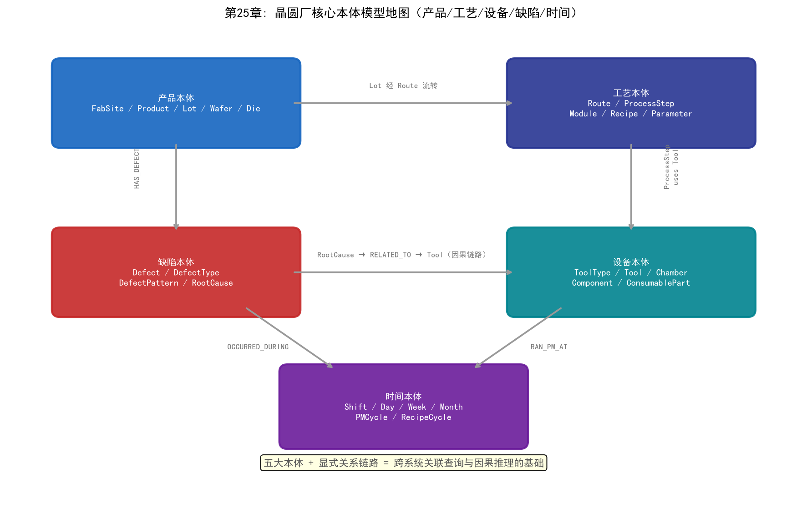
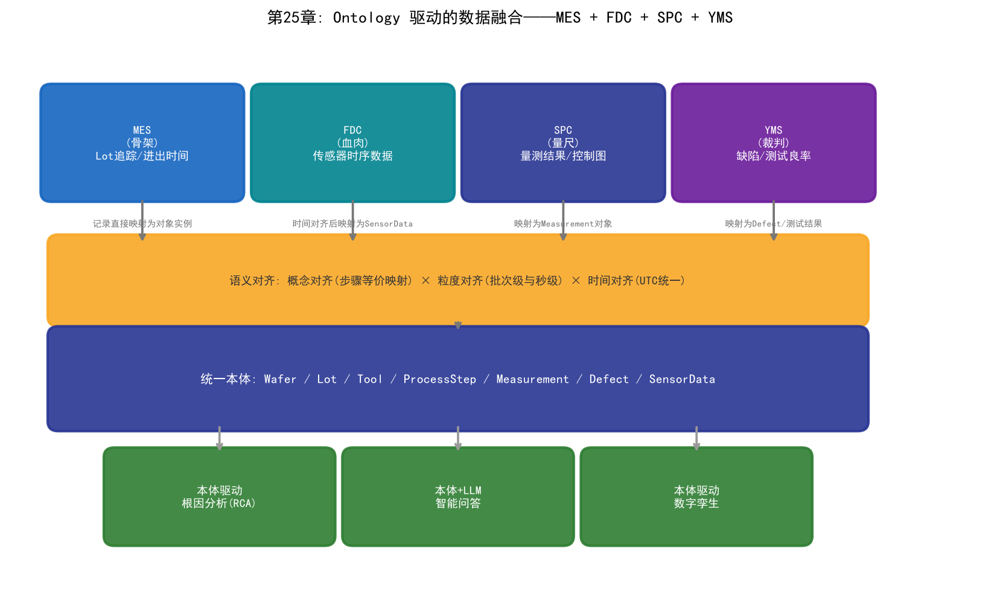
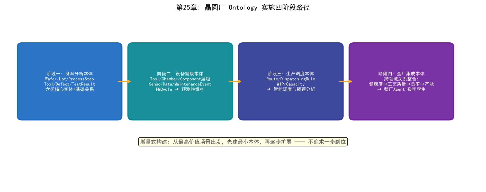

# 第25章 Ontology 在半导体晶圆厂的构建与应用

## 25.1 晶圆厂 Ontology 的设计原则

上一章讲述了Palantir如何用Ontology帮助三星提升良率。本章将视角从"故事"转向"工程"——具体如何在晶圆厂中构建Ontology，以及它能驱动哪些智能应用。

### 以业务实体为核心

晶圆厂Ontology设计的第一个原则是：以业务实体为核心，而非以数据表为核心。

传统的数据建模从"有哪些表"出发——MES有Lot表、Wafer表、Operation表，FDC有SensorData表，SPC有Measurement表。这种方式将数据结构等同于业务语义——但它们不是同一回事。MES中的Operation表和FDC中的Step表可能描述同一个工艺步骤，只是两个系统的命名不同。

Ontology设计从"业务中有哪些实体"出发——Wafer、Tool、Recipe、Defect、ProcessStep。这些实体是业务概念的显式表达，独立于任何IT系统。数据源只是实体的数据提供者——MES提供Lot和Wafer的追踪数据，FDC提供Tool的传感器数据，SPC提供Measurement结果。本体定义"什么是Wafer"，数据源提供"W001是一片具体的Wafer"。

### 动态可演化

晶圆厂的工艺在持续演进——新工艺节点的引入、新设备的安装、新产品的导入都可能引入新的实体类型和关系类型。Ontology必须能够动态演化——在不停止系统运行的情况下添加新的对象类型和关系。

这意味着Ontology的设计不追求"一步到位"，而是采用增量式构建：

1. 先定义核心实体类型（Wafer、Tool、ProcessStep等）和基础关系
2. 随着应用深化，逐步添加新的实体类型（如ConsumablePart、MaintenanceEvent）
3. 关系类型也可以增量添加——初期可能只有`usesTool`，后期添加`causesDefect`、`affectsYield`等语义关系

### 跨系统语义统一

Ontology最根本的职责是跨系统语义统一。一个晶圆厂可能有数十个IT系统，每个系统有自己的数据模型。Ontology不取代这些系统——它在这些系统之上建立一个语义层，让所有系统的数据在同一套概念体系下被理解。

实现语义统一需要做三件事：

**概念对齐：** 确定不同系统中哪些概念是等价的。MES的"Operation"=FDC的"Step"=YMS的"Stage"。这些等价关系在本体中被显式声明——所有三个术语映射到同一个`ProcessStep`对象类型。

**粒度对齐：** 不同系统的数据粒度可能不同——MES按批次记录数据，FDC按秒记录，SPC按批次或按晶圆记录。Ontology需要定义不同粒度数据之间的聚合关系——`Lot`包含多个`Wafer`，`Wafer`经过多个`ProcessStep`，每个`ProcessStep`对应多个`SensorDataPoint`。

**时间对齐：** 不同系统的时间戳可能基于不同时钟或不同时区。Ontology需要定义统一的时间模型——所有时间戳转换为UTC，并标注其来源系统。

## 25.2 晶圆厂核心本体模型

### 产品本体

产品本体描述晶圆厂中的产品实体及其层级关系：

```
对象类型层级:

FabSite (晶圆厂)
  └─ Product (产品)
       └─ Lot (批次)
            └─ Wafer (晶圆)
                 └─ Die (裸片)

关系类型:
  FabSite -[PRODUCES]-> Product
  Product -[CONTAINS]-> Lot
  Lot -[CONTAINS]-> Wafer
  Wafer -[CONTAINS]-> Die

属性示例 (Wafer):
  waferId: string (唯一标识)
  position: integer (在批次中的位置)
  diameter: float (直径, mm)
  thickness: float (厚度, μm)
  status: enum (IN_PROCESS, COMPLETED, SCRAPPED, ON_HOLD)
  startTime: datetime (投片时间)
  endTime: datetime (完成时间, nullable)
```

产品本体的设计要点是层级关系——从FabSite到Die的五层结构覆盖了从工厂级到芯片级的所有粒度。查询可以在任意层级进行——查看整个工厂的产出、某个产品的良率、某个批次的进度、某片晶圆的缺陷分布、某颗芯片的测试结果。



*图25-1：晶圆厂核心本体模型地图——产品/工艺/设备/缺陷/时间五大本体与关系链路*

### 工艺本体

工艺本体描述工艺流程的结构：

```
对象类型:

Route (工艺路线)
  └─ ProcessStep (工艺步骤)
       ├─ Module (工艺模块)
       └─ Recipe (配方)
            └─ Parameter (参数)

关系类型:
  Route -[HAS_STEP]-> ProcessStep
  ProcessStep -[BELONGS_TO]-> Module
  ProcessStep -[USES_RECIPE]-> Recipe
  Recipe -[HAS_PARAMETER]-> Parameter
  ProcessStep -[PRECEDES]-> ProcessStep  (步骤顺序)
  ProcessStep -[REQUIRES_TOOL_TYPE]-> ToolType

属性示例 (ProcessStep):
  stepId: string
  stepOrder: integer (在路线中的序号)
  stepType: enum (LITHO, ETCH, CVD, PVD, CMP, IMP, CLEAN, MEASURE)
  targetCD: float (目标关键尺寸, nm)
  cdTolerance: float (CD允差, nm)
  cycleTime: float (标准加工时间, min)
```

工艺本体的关键设计是步骤间的顺序关系（`PRECEDES`）和步骤与设备的类型约束（`REQUIRES_TOOL_TYPE`）。顺序关系支持正向和反向遍历——给定某个步骤，可以查询其前序步骤（"这个步骤之前发生了什么"）或后序步骤（"这个步骤之后会做什么"）。设备类型约束使得派工系统可以在本体层面检查"某个步骤是否可以在某台设备上执行"。

### 设备本体

设备本体描述设备的层级结构和状态：

```
对象类型层级:

ToolType (设备类型)
  └─ Tool (设备)
       └─ Chamber (腔体)
            └─ Component (部件)
                 └─ ConsumablePart (消耗件)

关系类型:
  ToolType -[INSTANCE]-> Tool
  Tool -[HAS_CHAMBER]-> Chamber
  Chamber -[HAS_COMPONENT]-> Component
  Component -[USES_CONSUMABLE]-> ConsumablePart
  Tool -[LOCATED_AT]-> Bay (设备位于哪个厂区)
  Tool -[CURRENT_STATUS]-> ToolStatus

动作:
  Tool.schedulePM(maintenanceType, scheduledTime)
  Tool.takeOffline(reason)
  Tool.bringOnline()
  Tool.calibrate(parameters)

函数:
  Tool.getOEE(timeRange) -> float
  Tool.getHealthScore() -> float
  Tool.getYieldHistory(timeRange) -> YieldResult
```

设备本体引入了动作和函数——这是从静态知识表示到"可执行本体"的关键一步。`schedulePM`动作封装了设备维护排程的完整逻辑——检查设备当前状态、验证维护窗口、创建维护工单、通知相关人员。AI Agent可以通过调用这个动作来执行设备维护安排，而不需要知道底层MES系统的API细节。

### 缺陷本体

缺陷本体描述缺陷的类型、成因和影响：

```
对象类型:

Defect (缺陷)
  ├─ DefectType (缺陷类型)
  ├─ DefectPattern (缺陷模式)
  └─ RootCause (根因)

关系类型:
  Wafer -[HAS_DEFECT]-> Defect
  Defect -[CLASSIFIED_AS]-> DefectType
  Defect -[EXHIBITS_PATTERN]-> DefectPattern
  Defect -[CAUSED_BY]-> RootCause
  RootCause -[RELATED_TO]-> ProcessStep
  RootCause -[RELATED_TO]-> Tool
  Defect -[IMPACTS]-> Die
  Defect -[DETECTED_BY]-> InspectionTool

属性示例 (Defect):
  defectId: string
  location: (x: float, y: float)  (晶圆上的坐标)
  size: float (尺寸, nm)
  severity: enum (CRITICAL, MAJOR, MINOR, INFO)
  detectionLayer: string (在哪一层检测到)
  timestamp: datetime
```

缺陷本体的核心价值在于因果链路的显式表达——`Defect → CAUSED_BY → RootCause → RELATED_TO → ProcessStep/Tool`。这条链路将"晶圆上某个位置有一个缺陷"与"某个工艺步骤的某台设备导致了这个缺陷"显式关联。当YED工程师查询一个缺陷时，系统可以自动沿这条链路展示完整的因果信息。

### 时间本体

时间本体将时间维度整合到所有实体中：

```
对象类型:

TimePeriod (时间段)
  ├─ Shift (班次)
  ├─ Day (日)
  ├─ Week (周)
  └─ Month (月)

ProcessPeriod (工艺周期)
  ├─ PMCycle (PM周期: 两次PM之间的运行期)
  ├─ RecipeCycle (配方周期: 同一配方连续运行期)
  └─ LotProcessing (批次加工期)

关系类型:
  Wafer -[ENTERED_STEP_AT]-> ProcessStep (with timestamp)
  Wafer -[EXITED_STEP_AT]-> ProcessStep (with timestamp)
  Tool -[RAN_PM_AT]-> PMCycle (with start/end time)
  Defect -[OCCURRED_DURING]-> ProcessPeriod

函数:
  TimePeriod.getYield(product, tool?) -> YieldResult
  PMCycle.getBatchCount() -> integer
  PMCycle.getDegradationTrend() -> TimeSeries
```

时间本体的设计使得"时间维度查询"变得自然——"上周3号机台在第3个PM周期内的良率趋势"是一个沿本体关系链路的复合查询：`TimePeriod(Week) → Tool → PMCycle → YieldResult`。

## 25.3 Ontology 驱动的数据融合

### MES + FDC + SPC + YMS 的数据整合

将四大核心系统的数据融合到统一本体中是Ontology工程的核心任务。每个系统的数据映射方式不同：

**MES → 本体：** MES数据是"骨架"——定义了Lot、Wafer、ProcessStep的存在和它们之间的层级关系。MES中的每条记录直接映射为本体中的对象实例。MES的批次追踪数据是本体的时间轴基础——每个Wafer在每个ProcessStep的进出时间定义了它在时间维度上的完整历史。

**FDC → 本体：** FDC数据是"血肉"——提供了设备运行的详细传感器时序数据。FDC数据映射为Tool对象的属性——具体来说是Tool在某个ProcessStep处理某个Wafer时的SensorData。FDC数据的映射需要处理时间对齐——FDC的时间戳需要与MES的批次进出时间对齐，确定某段传感器数据对应哪个批次的哪个步骤。

**SPC → 本体：** SPC数据是"量尺"——提供了工艺参数的量测结果。SPC数据映射为Measurement对象，关联到对应的ProcessStep和Wafer。SPC数据还包含控制图状态——当参数超出控制限时，触发一个Defect或Alert事件。

**YMS → 本体：** YMS数据是"裁判"——提供了缺陷检测结果和测试良率。YMS数据映射为Defect对象（缺陷实例）和TestResult对象（测试结果）。YMS的晶圆图数据可以映射为Wafer对象的属性——一个二维数组表示每颗Die的通过/失败状态。



*图25-2：Ontology 驱动的数据融合——MES、FDC、SPC、YMS 经语义对齐映射到统一本体*

### 跨系统语义对齐

将四个系统的数据映射到本体时，语义对齐是最关键的工程挑战。以下是几个典型的对齐场景：

**步骤对齐：** MES中一个Lot的工艺路线包含1200步，每步有一个stepId。FDC中也记录了设备运行的步骤信息，但stepId的命名规则可能不同——MES用"OP_045"表示第45步，FDC可能用"STEP_45"表示。本体需要定义映射规则：`MES.OP_045 ≡ FDC.STEP_45 ≡ Ontology.ProcessStep(stepOrder=45)`。

**时间对齐：** MES记录批次进出设备的时间（批次级粒度），FDC记录传感器数据的时间戳（秒级粒度）。对齐方式是：FDC中时间戳落在MES记录的某批进出时间区间内的传感器数据，属于该批次在该步骤的运行数据。

**设备对齐：** MES中的设备ID（如"ETC-03"）与FDC中的设备标识（如"ETCHER_003"）需要统一映射。当设备被PM后更换了部件，新旧部件的ID也需要在本体中关联——`Component(replaced_by: Component)`。

## 25.4 Ontology 驱动的智能应用

### 基于本体的根因分析

当所有数据被融合到本体后，根因分析从"工程师在多个系统中手动查询"变为"在本体图上自动推理"。

一次典型的本体驱动RCA流程：

```
触发: CP良率低于控制限

Step 1: 获取异常批次的完整工艺历史
  查询: Lot(B67890).getProcessHistory()
  结果: 1200个ProcessStep，使用23台Tool

Step 2: 对比正常批次，识别异常参数
  查询: 比较B67890与normal_b67800/normal_b67850的所有Measurement
  结果: Step 623的CD偏差+4%（正常±1%），Step 624的膜厚偏差-3%（正常±1.5%）

Step 3: 沿因果链路搜索关联设备
  查询: Step 623 → USES_TOOL → Tool(ETC-03)
  查询: ETC-03在B67890的SensorData
  结果: RF功率波动2.8%（正常<1%）

Step 4: 检查设备历史趋势
  查询: ETC-03在过去7天的健康度趋势
  结果: RF功率波动过去3天逐步增大

Step 5: 在知识图谱中搜索类似历史案例
  查询: 搜索"RF功率波动→CD偏差→良率下降"的历史案例
  结果: 3个月前ETC-05出现过类似模式，根因为匹配器老化

Step 6: 生成根因假设
  假设: ETC-03匹配器老化导致RF功率波动
  置信度: 82%
  推理路径: [Step2→Step3→Step4→Step5的完整链路]
  建议措施: 检查ETC-03匹配器，安排维护
```

这个过程的每一步都是沿本体中的关系链路进行的图查询——不需要跨系统跳转，不需要人工判断"MES中的step是否对应FDC中的operation"。本体已经将这些语义关系显式定义了。

### 本体驱动的知识推理

本体不仅存储已知事实，还可以通过推理规则发现隐含知识。几个推理示例：

**传递性推理：** 如果`Wafer W001`属于`Lot L123`，且`Lot L123`属于`Product P005`，那么可以推理出`Wafer W001`是`Product P005`的实例。这个推理在本体中是自动的——用户查询Product P005的所有Wafer时，系统自动通过传递性关系返回所有属于该Product的Lot中的所有Wafer。

**一致性检查：** 本体可以定义约束——如"每个Wafer必须属于且仅属于一个Lot"。当数据映射过程中出现一个Wafer被关联到两个Lot的情况时，本体推理引擎自动检测到不一致并报警。这种数据质量校验在传统数据湖中很难实现——因为没有统一的语义模型来定义"什么是合法的数据关系"。

**隐含关联发现：** 本体推理可以发现人类未显式标注的关联。如果`DefectType A`通常`CAUSED_BY` `RootCause X`，而当前分析中`Defect D123`被`CLASSIFIED_AS` `DefectType A`，那么推理引擎可以推导出`Defect D123`的可能根因是`RootCause X`——即使没有人显式标注这个关联。

### 本体 + LLM 的智能问答

Ontology与LLM的结合是当前最前沿的方向。LLM的自然语言理解能力+本体的结构化知识=真正的"工业智能助手"。

在这个架构中，LLM的角色是"自然语言接口"，本体的角色是"知识引擎"：

```
工程师: "最近一周哪台设备的参数波动最大？对良率有什么影响？"
  │
  ├─ LLM解析意图:
  │    查询: 过去7天所有Tool的SensorData波动
  │    分析: 波动最大的Tool
  │    关联: 波动Tool对良率的影响
  │
  ├─ LLM生成本体查询:
  │    Tool.getAll().filter(timeRange=last7days)
  │      .map(t => t.getSensorDataVariance())
  │      .sortBy(variance).top(1)
  │    → 结果: ETC-03, RF功率波动3.2%
  │
  ├─ LLM生成本体关联查询:
  │    ETC-03 → USED_AT → ProcessStep 623
  │    ProcessStep 623 → AFFECTS → CD
  │    CD deviation → IMPACTS → Yield
  │    → 结果: ETC-03的RF波动影响Step 623的CD均匀性，
  │      预计导致良率下降2-3%
  │
  └─ LLM生成自然语言回答:
       "过去7天参数波动最大的设备是ETC-03（刻蚀机），
        其RF功率波动达3.2%，远超正常水平（<1%）。
        该设备用于第623步刻蚀工艺，RF功率波动直接影响
        刻蚀CD的均匀性。根据历史关联分析，类似的RF波动
        通常导致CP良率下降2-3%。
        建议检查ETC-03的匹配器状态并评估是否需要维护。"
```

这个过程展示了LLM+Ontology的三个独特能力：

**LLM理解用户的自然语言意图**——工程师不需要知道本体的schema或查询语言，只需用自然语言提问。

**本体提供结构化的知识和推理能力**——LLM不需要"记住"所有工艺知识（这会导致幻觉），本体作为外部知识库提供准确的事实和关系。

**LLM将结构化查询结果转化为人类可理解的自然语言**——工程师不需要解读表格或图表，LLM直接用语言解释分析结果。

### 本体驱动的数字孪生

当Ontology包含动作和函数时，它本身就构成了一个"可执行的数字孪生"。这个数字孪生不仅映射了晶圆厂的静态结构（有哪些设备、产品、工艺），还映射了动态行为（设备如何运行、工艺如何影响良率、维护如何影响产能）。

数字孪生与Ontology的结合在三个层面发挥作用：

**模拟：** 在本体上模拟"what-if"场景——"如果ETC-03明天停机维护，未来72小时的产能影响是什么？"本体中的函数可以计算这个影响——查询ETC-03上排队的批次、估算路由到备用设备的时间、模拟对交期的影响。

**优化：** 基于本体的优化算法可以找到全局最优策略。因为本体统一了所有数据，优化算法可以在完整的信息空间上搜索——而不像传统方法那样只在单个系统的数据上做局部优化。

**闭环控制：** 本体支持双向数据流——不仅从源系统读取数据到本体，还可以将本体中的决策写回源系统执行。当Agent在本体上调用`Tool.schedulePM()`动作时，这个动作可以自动触发MES中的维护工单创建和排程调整。

## 25.5 实施路径与挑战



*图25-3：晶圆厂 Ontology 实施四阶段路径——增量式构建，从最高价值场景出发*

### 从哪些本体开始构建

不要试图一次构建完整的晶圆厂本体——这是不现实的。应该从最高价值的业务场景出发，构建该场景所需的最小本体，然后逐步扩展。

推荐的构建顺序：

**第一阶段：良率分析本体。** 这是最能体现价值的起点。构建Wafer、Lot、ProcessStep、Tool、Defect、TestResult六类核心实体及其基础关系。这个本体支持第六章描述的根因分析场景——从良率异常出发，沿关系链路定位根因。

**第二阶段：设备健康本体。** 扩展Tool、Chamber、Component的层级结构，添加SensorData、MaintenanceEvent、PMCycle等实体。这个本体支持预测性维护和设备健康监控场景。

**第三阶段：生产调度本体。** 添加Route、DispatchingRule、WIP、Capacity等实体。这个本体支持智能调度和瓶颈分析场景。

**第四阶段：全厂集成本体。** 将前三个阶段的本体整合，添加跨领域的关系——如"设备健康度影响工艺质量影响良率影响产能"的完整因果链路。这个本体支持整厂级Agent架构和数字孪生。

### 与现有 IT 系统的集成

Ontology不取代现有的IT系统——MES、FDC、SPC、YMS继续运行，各自执行自己的功能。Ontology在它们之上提供一个语义层。

集成方式有三种：

**批量ETL：** 每日从源系统批量导出数据到本体的数据存储。适用于不需要实时性的分析场景（如日级良率报告）。优点是简单可靠，缺点是数据有时延。

**流式数据管道：** 通过Kafka等消息队列将源系统的实时数据流映射到本体。适用于需要近实时性的场景（如设备异常监控、实时良率追踪）。FDC的传感器数据适合这种方式——每秒产生的数据通过流式管道映射到本体中的SensorData对象。

**联邦查询：** 不将数据物理移动到本体存储，而是在查询时直接访问源系统。适用于数据量极大或数据安全要求极高的场景。缺点是查询延迟较高。

实践中三种方式通常混合使用——MES数据用批量ETL（每天更新一次足够），FDC数据用流式管道（需要近实时），某些敏感数据用联邦查询（不离开源系统）。

### 组织与文化变革

Ontology的技术挑战是可解决的——OWL、知识图谱、数据管道等技术已经成熟。更大的挑战在组织和文化层面。

**跨部门协作。** 本体的定义需要PID、YED、MFG、PE、EE多个部门达成共识——"什么是ProcessStep"这个看似简单的问题，不同部门可能有不同的理解。推动这种跨部门共识需要高层管理者的支持和专业的本体工程团队。

**数据所有权。** 当所有数据被整合到统一本体后，数据的所有权变得模糊——MES数据"属于"IT部门还是"属于"PID？本体中的数据修改权限如何分配？这些问题需要明确的治理框架。

**投资回报周期。** Ontology项目的ROI不是即时的——本体的价值随着数据积累和应用扩展逐步体现。管理层需要理解这一点，给予足够的耐心和持续投入。三星的案例表明，从引入Palantir到良率显著改善经历了约一年半的时间。

### ROI 评估

Ontology项目的ROI评估需要考虑直接收益和间接收益：

**直接收益：**
- 根因分析时间缩短（从数小时到数十分钟）
- 良率提升（更快的根因定位→更快的工艺修正→更短的良率爬坡周期）
- 设备非计划停机减少（预测性维护的提前预警）
- 产能利用率提升（智能调度减少瓶颈空闲时间）

**间接收益：**
- 工程师经验数字化（隐性知识转化为可复用的本体知识）
- 跨部门协作效率提升（统一语义减少沟通成本）
- AI模型开发加速（本体提供的数据基础设施加速模型训练和部署）
- 新员工培训加速（本体作为培训工具，帮助新人快速理解工艺全貌）

---

## 结语

本书从1956年达特茅斯会议出发，穿越AI七十年的发展历程，沿着符号主义、连接主义、行为主义三大流派，进入了半导体晶圆厂的三大核心部门，最终收束于Ontology——这个被Palantir从军事情报带到工业制造的技术。

这趟旅程揭示了一个核心观点：**AI在晶圆厂的落地，不是某个算法的胜利，而是技术融合的胜利。** 深度学习可以识别缺陷模式，但它不能解释"为什么这个缺陷导致了良率下降"。强化学习可以优化工艺参数，但它不能从海量异构数据中自动发现关联。LLM可以理解工程师的问题，但如果没有准确的知识库支撑，它只会产生幻觉。

Ontology提供了所有这些技术协同工作的语义基础设施——它是晶圆厂的"通用语言"，让不同系统中的数据、不同领域的AI模型、不同部门的工程师能够在同一个知识框架下沟通和协作。

Palantir的故事——从帮助CIA追踪本拉登，到帮助IAEA监控伊朗核设施，再到帮助三星从30%的良率泥潭中爬出来——不是某个公司的商业故事，而是一个技术范式的证明：当数据被正确地组织、语义被显式地定义、关系被结构化地表达时，AI的力量才能真正释放。

半导体制造是人类工业文明的最前沿。每一代技术节点的推进都在挑战物理极限和工程极限。AI不是晶圆厂的附加选项——当工艺复杂性超过人类工程师的认知带宽时，AI成为必需品。而Ontology是让这个必需品能够有效工作的基础设施。

这本书写到此处只是开始。半导体技术在演进，AI技术在爆发，两者的交叉每天都在产生新的实践和故事。本书将随行业发展持续更新——在GitHub上，在每一位读者的参与中。

> **本章配套实验**：第27章提供了本章方法论的两个可运行参照——27.3 节的 Ontology Text2SQL（`demos/experiments/fab_ontology_text2sql`）展示本体语义层如何约束查询生成，是"增量式构建"最小可行起点；27.4 节的晶圆厂 Ontology MVP（`demos/experiments/wafer_ontology_mvp`）展示本体图如何支撑 GraphRAG 推理。
