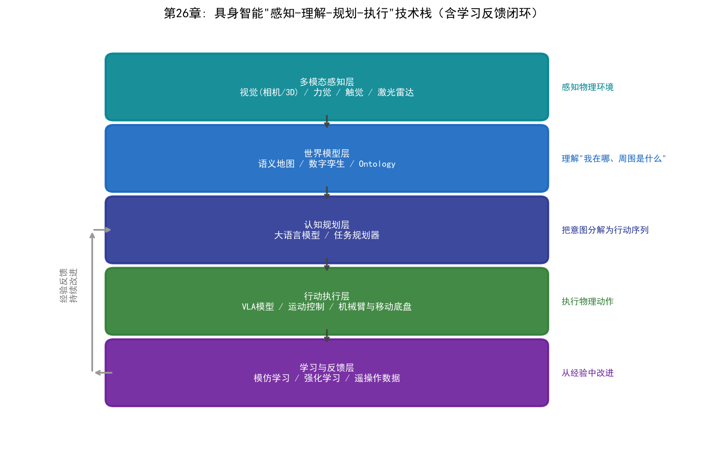
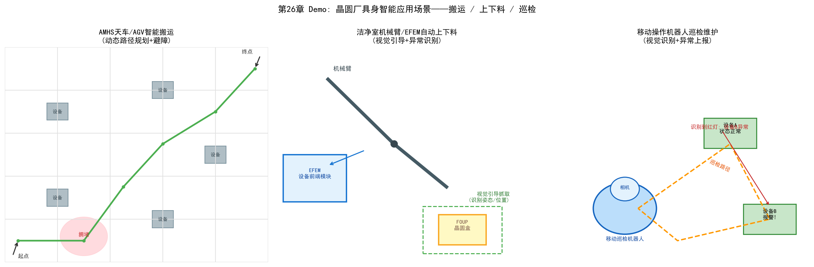

# 第26章 具身智能的应用——当AI走进晶圆厂的物理世界

## 26.1 从"会思考"到"会动手"

前25章讨论的AI应用，绝大多数发生在数字世界：良率预测处理的是数据，智能排程输出的是决策，LLM回答的是问题。它们"会思考"，但不会"动手"——最终执行动作的，仍然是工程师和自动化设备。

具身智能（Embodied AI）要解决的是最后一个环节：**让AI通过物理实体感知真实环境、理解场景语义、并执行物理动作**。第21章讨论的NSA全融合描述了感知-认知-行动的智能闭环，而具身智能正是这一闭环在物理世界的落地形态——"会思考"加上"会动手"。

在晶圆厂语境下，具身智能意味着：AI系统不仅能看懂晶圆图、读懂设备状态，还能通过机械臂、天车、移动机器人等实体，在洁净室中完成搬运、上下料、巡检、维护等物理操作。晶圆厂对具身智能有天然的强需求：

- **洁净室人力昂贵**：无尘服、轮班、严格的培训，人力成本高且易错
- **24/7 连续生产**：深夜班次的人力质量波动直接影响产线稳定
- **精度要求极端**：纳米级工艺对操作稳定性的要求远超人类生理极限
- **自动化基础扎实**：晶圆厂已大量使用 EFEM、AMHS 等自动化设备，是具身智能的天然载体

## 26.2 具身智能的技术栈

具身智能不是单一技术，而是一套"感知-理解-规划-行动"的技术栈：

| 层 | 技术 | 作用 |
| --- | --- | --- |
| 多模态感知 | 视觉（相机/3D）、力觉、触觉、激光雷达 | 感知物理环境 |
| 世界模型 | 语义地图、数字孪生、Ontology | 理解"我在哪、周围是什么" |
| 认知规划 | 大语言模型、任务规划器 | 把意图分解为行动序列 |
| 行动执行 | VLA模型、运动控制、机械臂/移动底盘 | 执行物理动作 |
| 学习与反馈 | 模仿学习、强化学习、遥操作数据 | 从经验中改进 |

其中最具代表性的技术是 **VLA（视觉-语言-行动）模型**：将视觉感知、语言理解和行动决策统一到同一个大模型中——输入"把第3号晶圆盒搬到刻蚀机EFEM的载台上"，模型直接输出机械臂的动作序列。VLA 让机器人的操作从"为每个任务编写程序"走向"用自然语言指挥通用操作"[99]。



*图26-1：具身智能"感知-理解-规划-执行"技术栈，学习反馈闭环持续改进规划与执行层*


*图26-2：VLA（视觉-语言-行动）模型工作流程——视觉输入与自然语言指令端到端统一生成动作序列*

## 26.3 晶圆厂中的具身智能场景

### 场景一：AMHS 天车与 AGV 智能搬运

晶圆厂的天车系统（AMHS）和自动导引车（AGV）负责晶圆在设备间的运输。传统 AMHS 依赖固定轨道和预设路径，遇到拥堵只能排队。具身智能增强的搬运系统具备：

- **动态路径规划**：根据实时交通状况避开拥堵区域
- **避障与交互**：与设备装载口（Load Port）、检修区域的安全交互
- **异常处理**：遇到障碍物或异常时自主判断并上报


*图26-3：AMHS 天车与 AGV 智能搬运闭环——动态路径规划、自主异常处理与反馈闭环*

### 场景二：洁净室机械臂与 EFEM 自动上下料

晶圆加工设备前端的 EFEM（设备前端模块）是机械臂上下料的标准场景。具身智能的介入让上下料从"固定动作"走向"自适应"：

- **视觉引导抓取**：识别晶圆盒（FOUP）姿态，自适应调整抓取角度
- **与MES/APC联动**：根据生产指令自动切换工艺配方
- **异常识别**：发现晶圆破损、位置偏移时立即停止并报警


*图26-4：洁净室机械臂 EFEM 自动上下料工作流——视觉引导抓取 × Ontology 规则校验 × 异常即停*

### 场景三：移动操作机器人巡检与维护

巡检机器人搭载相机和传感器，在洁净室/设备区域移动，执行：

- **设备状态巡检**：读取仪表、识别指示灯状态、检测异常噪音
- **样本送检**：将量测样本自动送到量测设备
- **维护辅助**：在工程师指导下执行简单的清洁、更换消耗件操作

### 场景四：人形机器人（探索阶段）

人形机器人具备在人类工作环境中操作的潜力，是具身智能的前沿探索方向。目前在晶圆厂仍处于概念验证阶段，面临洁净室兼容性（颗粒控制）、运动稳定性、成本等挑战。


*图26-5：具身智能 Agent 三层架构——Ontology 认知层 × LLM/VLA 决策层 × 机器人行动层*

## 26.4 具身智能与 Ontology 的融合

具身智能要"理解"晶圆厂，需要一个关于工厂的世界模型——这正是第24、25章 Ontology 的用武之地。Ontology 为晶圆厂建立了"对象-关系-规则"的语义模型：设备是什么、材料在哪里、工艺流程如何流转、什么操作是允许的。

```
具身智能 Agent 的三层架构:
┌─────────────────────────────────────────────┐
│ 认知层: Ontology 世界模型                    │  ← 理解工厂语义（第24/25章）
│  · 设备/材料/工艺/空间关系的语义建模          │
│  · "刻蚀机E03在哪? 它的EFEM空闲吗?"          │
├─────────────────────────────────────────────┤
│ 决策层: LLM/VLA + 任务规划                   │  ← 把意图分解为行动序列
│  · 从自然语言指令生成操作计划                 │
├─────────────────────────────────────────────┤
│ 行动层: 机械臂/AGV/天车等物理实体             │  ← 执行物理动作并反馈
└─────────────────────────────────────────────┘
```

Ontology 与具身智能的结合带来两个关键价值：

1. **可验证性**：具身智能的行动计划可以对照 Ontology 规则校验——"这个操作是否符合工艺规程？"——避免大模型幻觉导致的危险动作
2. **可编排性**：Ontology 描述的对象和动作可以被具身智能 Agent 调用，正如第23章 Agent 架构与第24章 Palantir AIP 的"对象+动作+函数"模型——具身智能是这些智能体在物理世界的执行端



*图26-6：晶圆厂具身智能应用场景——智能搬运、自动上下料与移动巡检*

## 26.5 实践现状与案例

- **产业现状**：晶圆厂的具身智能应用整体处于"自动化成熟、智能化起步"阶段——机械臂/天车/AGV 已经普及，但"自主感知-决策-执行"的完整闭环仍以试点为主
- **AMHS 智能化**：头部晶圆厂与 AMHS 厂商合作，在搬运调度中加入智能路径规划与预测性维护（呼应第12章成熟期的 AMHS 健康管理）
- **设备厂商探索**：半导体设备厂商在 EFEM、量测设备中加入视觉引导与自动化操作
- **数字孪生+具身智能**：在数字孪生环境中训练和验证机器人操作策略，再部署到物理设备（呼应第21章世界模型与数字孪生）[100]

按第21章的"四阶段演进"看，当前大多数晶圆厂处于 **AI 辅助（AI-Assisted）到 AI 增强（AI-Augmented）** 阶段，具身智能（AI自主的物理执行形态）是演进方向的终点。

## 26.6 挑战与展望

- **技术挑战**：物理操作的精度与可靠性（晶圆极其脆弱）、洁净室兼容（颗粒与静电控制）、人机安全交互
- **成本挑战**：机器人系统的投资回报率（ROI）——目前多数场景下机器人成本仍高于人工，规模化应用需要成本下降
- **组织挑战**：工程师与机器人协作的新工作模式、对自主系统的信任建立
- **展望**：从"单点自动化"走向"具身智能运营"——当 Ontology、LLM/Agent、具身智能三者融合，晶圆厂有望实现从"设备自动化"到"工厂自主运营"的跨越

## 26.7 本章小结

具身智能是本书逻辑的自然延伸：三大流派教会AI思考，融合（NSA）打通感知-认知-行动闭环，LLM与Agent赋予AI语言与协作能力，Ontology 为AI建立工厂的世界模型——而具身智能，让这一切最终落到物理世界的"动手"上。对晶圆厂而言，具身智能不是遥远的科幻，而是自动化体系向"自主感知、自主决策、自主执行"演进的方向。它的落地速度取决于三个因素：技术可靠性、成本曲线和组织变革的接受度。
