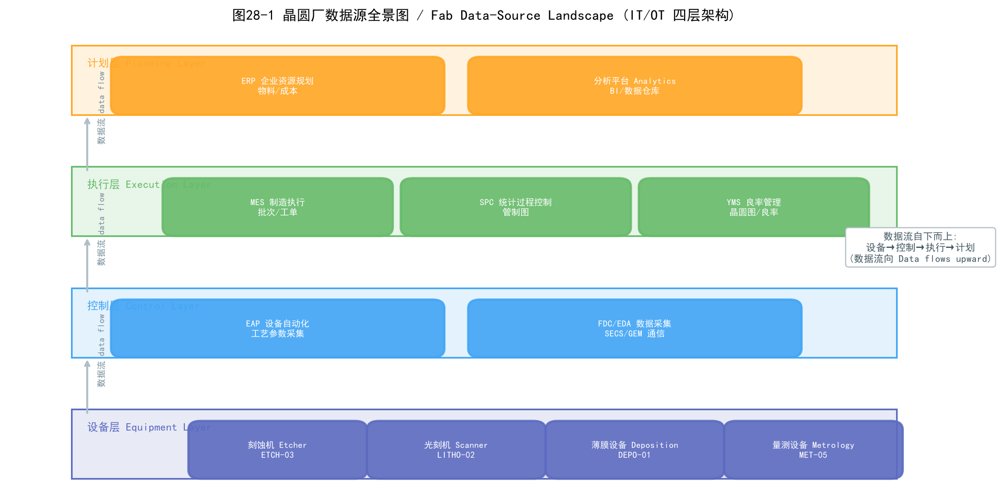
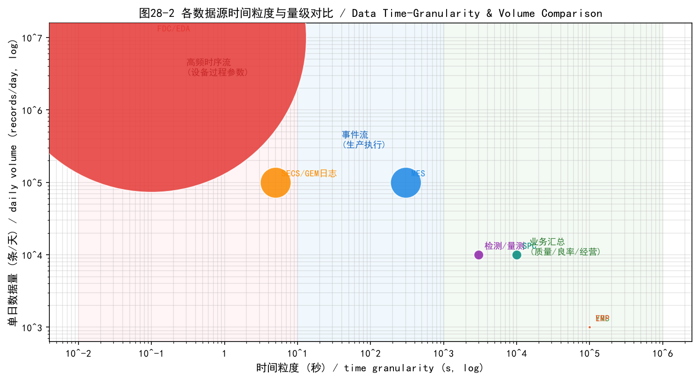
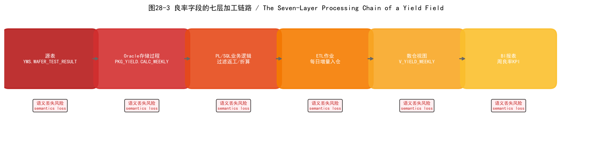
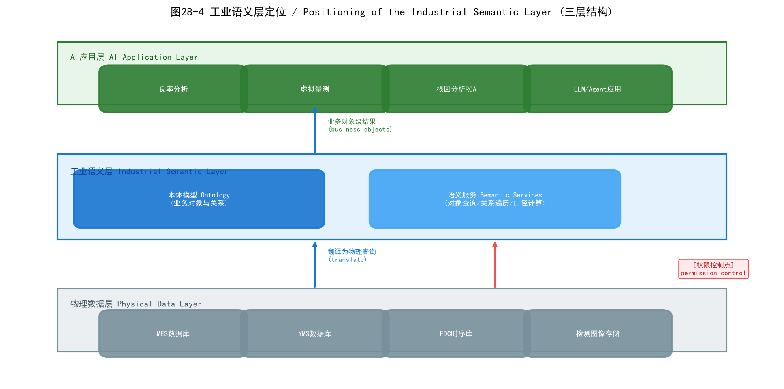
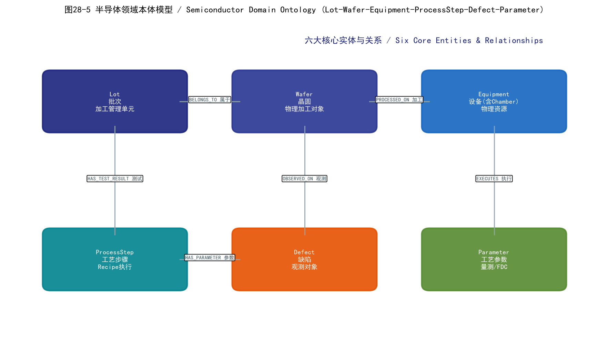
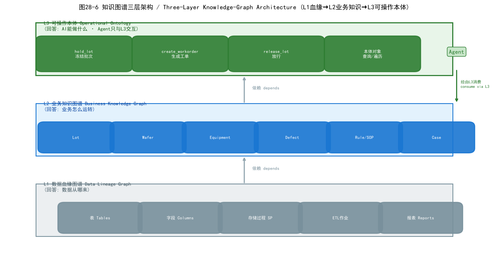
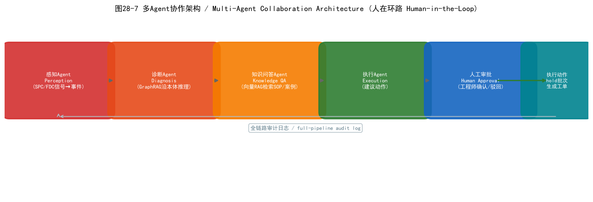

# 第28章 晶圆厂数据体系——AI应用的数据地基

> 本章是全书的数据基础设施章节。前面几章介绍了晶圆厂的三大核心部门与业务场景,从本章开始,我们将进入"AI如何落地"的实质讨论。而AI落地的第一步,是搞清楚一个问题:**晶圆厂的数据到底长什么样?**

在前面几章的讨论中,我们已经反复提到FDC信号、量测数据、MES记录、良率数据等概念。本章将系统地回答三个问题:晶圆厂有哪些数据、为什么这些数据如此难管理、如何把这些数据整理成AI可以可靠消费的形态。理解本章内容,是理解后续良率预测、虚拟量测、设备预测性维护、根因分析等所有AI应用的前提——因为**模型的精度上限,由数据的质量与语义清晰度决定**。

本章内容分为六节:28.1晶圆厂数据全景,建立对七大核心数据源的整体认知;28.2数据血缘与隐性知识,剖析数据"从哪来、到哪去、谁懂它";28.3数据治理体系,讨论让数据可信、可追溯、可复用的方法;28.4工业语义层与知识图谱,介绍让AI"读懂"晶圆厂语言的关键技术;28.5 LLM与Agent的数据消费模式,探讨大模型如何安全地使用这些数据;28.6落地路径与分阶段实施,给出从数据到价值的务实路线图。

---

## 28.1 晶圆厂数据全景:从MES到设备日志

> **本节核心问题**:晶圆厂到底有哪些核心数据源?它们各自的特征是什么?为什么必须把它们关联起来使用?

如果请一位IT工程师画出晶圆厂的系统地图,他会画出一张由MES、EAP、FDC、SPC、YMS、ERP等系统组成的复杂网络;如果请一位工艺工程师描述一天的工作,他讲的是"这批Wafer在某台Etcher上跑了一个Recipe,良率有点问题"。这两张图之间的差距,就是本章要弥合的。本节从数据角度,把晶圆厂"解剖"一遍。

### 28.1.1 核心数据源地图

晶圆厂的数据源可以概括为七大核心系统。它们分布在IT/OT分层架构的不同层级,各自扮演不同的角色:

**MES(Manufacturing Execution System,制造执行系统)** 是晶圆厂的"生产总调度"。它记录每一批Lot的工艺路线(Route)、每一步骤(Step)的执行状态、在制品(WIP)分布、工单信息、操作员与设备的交互记录。MES回答的问题是"哪批晶圆现在在哪里、做了什么、接下来做什么"。它是批次级、事件级数据的核心来源,也是其他系统数据的"锚点"。

**FDC/EDA(Fault Detection and Classification,故障检测与分类 / Equipment Data Acquisition,设备数据采集)** 是设备过程参数的"记录仪"。EDA负责从设备采集高频时序数据(温度、压力、RF功率、气体流量等),FDC在采集基础上进行统计监控与异常检测——当某个参数偏离工艺窗口时触发报警。FDC数据回答的问题是"这批Wafer在加工的那几分钟里,设备状态是否正常"。这是全厂**频率最高、单量最大**的数据流。

**SPC(Statistical Process Control,统计过程控制)** 系统基于量测数据(膜厚、CD、套刻精度等)绘制控制图,监控工艺是否处于受控状态。SPC与FDC的区别在于:SPC监控的是**工艺结果**(量测得到的参数),FDC监控的是**过程条件**(设备运行参数)。两者互为补充。

**YMS(Yield Management System,良率管理系统)** 汇集电性测试(CP/FT)与缺陷检测数据,生成晶圆图(Wafer Map)、良率趋势与缺陷分布分析。YMS回答的问题是"这批晶圆最终做得好不好、坏在哪里"。

**ERP(Enterprise Resource Planning,企业资源计划)** 管理物料、采购、库存、成本、订单等企业资源层面的数据。它不直接参与工艺,但对产能规划、成本分析、供应链决策至关重要。

**SECS/GEM设备日志(SEMI Equipment Communications Standard,设备通信标准 / Generic Equipment Model,通用设备模型)** 是设备与主机系统通信的工业协议层。通过SECS/GEM,设备上报工艺配方(Recipe)执行记录、报警事件、状态变迁(如Process End、Alarm)。这些日志是理解"设备实际做了什么"的第一手资料,也是FDC数据的原始载体。

**检测/量测系统(KLA缺陷扫描、CD-SEM、光学量测等)** 产生缺陷坐标、缺陷图像、关键尺寸等数据。它们与YMS联动,为缺陷分析和良率归因提供最直接证据。

**数据源全景图(架构图说明)**:自下而上可分为四层。**设备层**(最底层)包括刻蚀机、光刻机、薄膜设备等,通过SECS/GEM协议与上层通信,产生设备日志与过程数据;**控制层**包括EAP(Equipment Automation Program,设备自动化程序)、FDC/EDA,负责设备自动控制与过程数据采集;**执行层**包括MES、SPC、YMS,承载生产执行与质量监控的核心业务;**计划层**(最顶层)包括ERP与各类分析平台,面向企业资源与经营决策。数据流向自下而上:设备层产生原始过程数据,控制层做采集与初筛,执行层组织成业务记录,计划层进行全局分析。

以某批晶圆为线索可以把这条链路串起来:一片Wafer投入产线后,**MES**为其分配Lot编号并规划工艺路线;在某个刻蚀步骤,设备通过**SECS/GEM**上报加工开始与结束事件,**FDC/EDA**以毫秒级频率记录腔体温度、压力、RF功率等过程参数;加工完成后,量测设备产生**CD-SEM/光学量测**数据,**SPC**判断该步骤是否受控;最终,这批晶圆经过电性测试,**YMS**生成晶圆图与良率统计。一条完整的数据链就这样形成了。



*图28-1:晶圆厂数据源全景图——IT/OT四层架构与数据流向*

### 28.1.2 数据特征对比:时序粒度、量级与更新频率

不同类型的数据,其时间粒度、数据量级与更新频率差异巨大。理解这些差异,是选择存储方案与AI建模方式的前提。

我们以**某道刻蚀工艺的FDC trace数据**为例来说明时序特征。刻蚀机腔体在加工一片Wafer时,FDC系统通常会以1-10Hz的频率采集数十个通道的参数(腔体压力、上下电极RF功率、温度、各气体流量、ESC静电吸盘电流等)。以20个通道、5Hz采样、单次加工200秒计算,一片Wafer就产生约2万条记录;一个腔体一天加工数百片,单台设备单日就产生数百万条FDC记录。这是典型的**高频时序流**。

与之形成鲜明对比:**MES批次事件**是分钟到小时级的——一个Lot完成一步工艺才产生一条记录;YMS良率数据是批次级或日级——通常按Lot汇总或按日汇总。

以下表格对比了七大核心数据源的特征:

| 数据源 | 典型字段 | 时间粒度 | 单日数据量(参考) | 更新方式 |
| --- | --- | --- | --- | --- |
| MES | Lot ID、Route、Step、状态、时间戳 | 分钟~小时级 | 万级~十万级记录 | 实时事件推送 |
| FDC/EDA | 通道ID、压力、温度、RF功率、时间戳 | 毫秒~秒级 | 百万~千万级记录 | 实时流式写入 |
| SPC | 参数ID、量测值、UCL/LCL、判定结果 | 批次级 | 千~万级记录 | 批处理+实时预警 |
| YMS | Lot ID、良率值、缺陷坐标、晶圆图 | 批次级/日级 | 千级记录+图像文件 | 批处理 |
| ERP | 物料号、工单、成本、库存 | 分钟~天级 | 千级记录 | 批处理 |
| SECS/GEM日志 | 事件ID、Recipe名、状态码、时间戳 | 秒~分钟级 | 万~十万级事件 | 实时推送 |
| 检测/量测系统 | 缺陷坐标、缺陷类型、CD值、图像 | 片级/批次级 | 千级记录+大量图像 | 批处理+实时联动 |



*图28-2:各数据源时间粒度与单日数据量对比(对数坐标)*

> **实践提示:** 晶圆厂数据存储的常见误区是"一刀切"。FDC这类高频时序数据适合用列式存储或时序数据库(如InfluxDB、TimescaleDB)管理;MES/YMS这类业务数据适合用关系型数据库;检测图像等非结构化数据需要对象存储。先用数据特征表做分类,再选存储,能避免后期"查一次FDC历史要跑几分钟"的尴尬。

从量级估算看,一座先进晶圆厂(月产数万片12英寸Wafer)的FDC历史数据年增量可达TB级,加上检测图像与量测数据,全厂数据年增量通常在数十TB量级。这个量级对存储与查询架构提出了明确要求:高频过程数据必须考虑压缩与分层存储(热数据在线、冷数据归档)。

### 28.1.3 数据之间的业务关联

数据源地图回答"有什么数据",数据关联则回答"这些数据如何拼成完整故事"。晶圆厂AI应用的一个核心特征是:**绝大多数有价值的分析任务都需要跨系统取数**。

以一次典型的良率下降根因分析为例:某批晶圆CP测试良率骤降,YED(良率工程)工程师需要同时查看:**YMS**的晶圆图确定缺陷的空间分布(是边缘还是中心?)、**MES**的批次历史确认这批Wafer经过了哪些设备、**FDC**数据查看对应设备在加工时的参数是否漂移、以及设备的**PM(Preventive Maintenance,预防性维护)记录**确认是否临近维护周期。任何一个单系统都无法回答"良率为什么下降"——只有跨系统关联,才能把"结果异常"追溯到"过程异常"再追溯到"设备异常"。

典型的数据关联链可以表示为:

```
Lot ID → Equipment ID → Chamber ID → FDC Trace → 对应缺陷 → 良率损失
```

即:从良率损失出发,沿批次定位到加工设备与腔体,再下沉到该腔体的FDC过程数据,找出参数异常,与缺陷分布比对,最终确认损失来源。这条链路正是第9章以后良率分析、根因分析类AI应用的数据基础。

跨系统关联在现实中并不容易,主要面临三类难点:

**主键体系不一致。** 同一物理对象在不同系统中编码可能不同。例如批次号在MES中是`LOT-2026-001`,在YMS中可能被截断或加前缀;设备号在MES中是`ETCH-03`,在FDC系统中是`EQP-ETCH-003`。关联的第一步往往是"对账",建立各系统主键的映射关系。

**时间对齐问题。** FDC数据的时间戳来自设备时钟,MES事件时间戳来自服务器时钟,两者可能存在秒级甚至分钟级偏差。在做"加工时段内的FDC参数"这类关联时,直接按时间戳join会得到错误结果,需要先做时钟校准或使用事件边界(如Process Start/End事件)对齐。

**多版本状态。** 一批晶圆可能经历返工(Rework)、Hold(冻结)、拆分合并,其工艺历史会形成多个版本。关联时必须明确"取哪个版本"——通常取最终版本,但根因分析可能需要回看所有历史版本。

> **本节小结:**
> - 晶圆厂数据源可概括为七大系统,MES、FDC/EDA、SPC、YMS、ERP、SECS/GEM日志、检测/量测系统各自扮演不同角色,分布在IT/OT四层架构中。
> - 数据的时间粒度差异巨大:FDC是毫秒~秒级高频流(单设备单日数百万条),MES是分钟级事件,YMS是批次/日级汇总——"一刀切"存储是常见错误。
> - 有价值的分析几乎都需要跨系统取数,典型链路为"Lot→Equipment→Chamber→FDC Trace→缺陷→良率损失"。
> - 跨系统关联的主要难点是主键不一致、时间对齐与多版本状态,需要在数据治理阶段系统解决。

---

## 28.2 数据血缘与隐性知识:数据从哪来、到哪去、谁懂它

> **本节核心问题**:晶圆厂的数据往往经过了复杂的加工链路,这些加工逻辑封装在哪里?为什么这些"看不见的知识"是数据治理的最大障碍?

上一节我们建立了数据源的完整地图。但现实中,AI工程师拿到的往往不是原始数据,而是经过层层加工后的"报表数据"。这些加工逻辑——谁是源表、中间做了什么计算、口径如何定义——构成了**数据血缘(Data Lineage)**。理解数据血缘,是让数据可信的第一步;而血缘背后的隐性知识,则是晶圆厂数据治理最棘手也最有价值的部分。

### 28.2.1 晶圆厂数据血缘的复杂性来源

晶圆厂的数据血缘远比互联网行业复杂,其根源在于**数十年的IT系统积累**。

我们用一条真实的加工链来说明。某晶圆厂BI报表中的"周良率"字段,其血缘路径可能是:

```
源表(YMS.WAFER_TEST_RESULT) → Oracle存储过程(PKG_YIELD.CALC_WEEKLY) 
→ PL/SQL业务逻辑(过滤返工批次、按片折算) → ETL作业(每日增量入数仓) 
→ 数仓视图(V_YIELD_WEEKLY) → BI报表(周良率KPI)
```

这条链路中,任何一个环节的语义丢失,都会让最终数字

*图28-3:一个良率字段经过的七层加工链路,每一环都存在语义丢失风险*

这条链路中,任何一个环节的语义丢失,都会让最终数字"失真"。例如,存储过程里有一行`WHERE lot_status != 'R'`——含义是排除返工批次。如果分析人员不知道这个过滤条件,直接对报表数据做统计,就会把"不含返工的良率"当成"全部良率"。

晶圆厂数据血缘复杂性的成因可以归纳为三点:

**数十年积累的遗留系统。** 先进晶圆厂的IT系统往往跨越二三十年,经历了多轮供应商切换与系统升级。早期的逻辑封装在Oracle存储过程、视图、甚至Cobol程序里,文档早已遗失,只有代码还在运行。

**供应商定制化改造。** MES、YMS等系统通常由多家供应商提供,每家都在标准产品之上做了大量定制——定制逻辑以存储过程、自定义表、插件的形式散落在各处。这些逻辑是"系统的一部分",但不在任何标准文档里。

**人员更替与知识断层。** 晶圆厂的IT与工艺团队流动频繁,理解某段存储过程"为什么这么写"的老员工可能已离职。系统在运行,但"为什么"已经没人知道。

血缘断裂的直接后果,在AI时代被放大了。以虚拟量测(VM)建模为例:工程师拿到一张"良率表"用于训练模型,却不知道其中的`YIELD_RATE`字段到底是CP(晶圆级测试)良率还是FT(成品测试)良率、是否包含返工批次、按片折算还是按盒折算——模型学到的标签本身就是错的。**标签错误是AI模型最隐蔽也最致命的错误来源**,它不像随机噪声那样可以被正则化抑制,而是系统性偏差,模型越训练越"自信地错"。

### 28.2.2 隐性知识的三种形态

数据血缘记录的只是"数据流经了哪些环节",但每个环节的**语义**——为什么这么算、这个字段代表什么、这个异常值是什么意思——是更深层的知识。我们把这类无法从系统文档直接获取的知识称为**隐性知识(Tacit Knowledge)**。在晶圆厂,隐性知识以三种形态存在:

**代码中的知识:最可靠但最难读。** 存储过程、视图定义、ETL作业脚本是数据语义的真正"定义者"。它们精确记录了业务逻辑——过滤了什么、怎么折算、默认值是什么。但这类知识高度依赖阅读者的技术能力,且常常没有注释。例如下面这段典型的PL/SQL片段:

```sql
-- 计算周良率(排除返工批次与工程实验批次)
CREATE OR REPLACE PROCEDURE PKG_YIELD.CALC_WEEKLY (p_week IN VARCHAR2) IS
BEGIN
  INSERT INTO YIELD_WEEKLY (WEEK_ID, PRODUCT, YIELD_RATE)
  SELECT p_week, product_id,
         ROUND(SUM(pass_cnt) / NULLIF(SUM(total_cnt), 0) * 100, 2)
  FROM   WAFER_TEST_RESULT
  WHERE  test_week = p_week
    AND  lot_status != 'R'        -- 排除返工批次
    AND  lot_type != 'E'          -- 排除工程实验批次
  GROUP BY product_id;
END;
```

这段代码的语义——"周良率=通过片数/总片数×100,且排除返工与工程批次"——就藏在两行`WHERE`条件里。AI工程师如果不读代码,永远不知道口径。

**文档中的知识:最正式但最易滞后。** SOP(Standard Operating Procedure,标准作业程序)、工程变更单(ECN/ECO)、工艺规格书(Spec)记录了业务规则的"官方版本"。但它们的问题是**滞后**——系统代码改了,文档常常忘记更新;文档写的口径与代码实际执行的逻辑可能已经不一致。文档是知识的"应然",代码是知识的"实然"。

**人脑中的知识:最有价值但最易流失。** 资深工程师的经验是隐性知识最集中的形态。例如:"这个字段出现-9999时表示传感器离线,不是真实值""3号刻蚀机的压力在PM后前两批会偏高,分析时要剔除""这个良率公式只适用于没有经过湿法清洗的产品"——这些经验没有写在任何文档里,却直接影响数据分析与模型训练的成败。

用"知识三形态"对照表可以直观展示同一知识在不同载体中的样子:

| 知识形态 | 载体 | 可靠性 | 可读性 | 更新及时性 | 流失风险 |
| --- | --- | --- | --- | --- | --- |
| 代码中的 | 存储过程、视图、ETL脚本 | 高(实然) | 低(需技术能力) | 高(代码即现状) | 低(代码还在) |
| 文档中的 | SOP、ECN/ECO、Spec | 中(可能滞后) | 高 | 低(常忘记更新) | 中(文档会遗失) |
| 人脑中的 | 工程师经验 | 高但未沉淀 | 低(口头传承) | 不固定 | 高(离职即流失) |

### 28.2.3 隐性知识流失的业务风险

隐性知识流失不是一个"将来可能发生"的问题,而是晶圆厂每天都在发生的现实。

**案例**:某晶圆厂一位资深YED工程师退休后,团队发现一张"良率修正系数表"的来历无人能解释——它是多年前根据某款产品的缺陷分布经验人工标定的,一直被良率分析流程引用。新工程师以为它是标准口径,将其用于多个项目的良率归因,导致连续三个月的分析结论出现系统性偏差。事后复盘发现,该系数只适用于已停产的旧产品,且从未经过正式评审。

这个案例揭示了隐性知识流失的三类典型风险:

**数据误读。** 不知道字段口径、不知道异常值含义,分析结论建立在错误理解之上——这是最直接的风险。

**重复造轮子。** 隐性知识没有沉淀,每个新团队、每轮人员更替都要重新摸索,晶圆厂每年在"重新理解自己数据"上耗费大量工程师时间。

**AI模型学到错误标签。** 正如28.2.1所述,标签/口径错误对AI模型是系统性伤害。隐性知识流失直接导致AI项目的数据基础不可靠。

**合规与审计困难。** 当被问及"这个数字是怎么算出来的"时,如果答案依赖某位工程师的记忆,审计将无法通过。

更深层地看,数据治理的本质不是"管理数据",而是**知识的捕获与传承**。血缘图谱捕获代码中的知识,数据字典捕获文档中的知识,专家访谈与知识沉淀捕获人脑中的知识——三者缺一不可。这正是下一节"数据治理体系"的出发点,也是第21章"Ontology与知识图谱"的思想源头。

> **实践提示:** 隐性知识捕获不要指望一次性"大工程"。务实的做法是**伴随式沉淀**:在每次数据问题排查、每个RCA案例、每次口径确认时,顺手把"为什么"记录到数据字典或知识库。一个字段一个字段地补,比规划一个庞大的知识工程更可持续。关键是要有人对"这个口径谁负责解释"负责。

> **本节小结:**
> - 晶圆厂数据血缘复杂的根源是数十年遗留系统、供应商定制化改造与人员更替,大量业务逻辑封装在存储过程与视图中。
> - 隐性知识有三种形态:代码中的(可靠但难读)、文档中的(正式但滞后)、人脑中的(有价值但易流失)。
> - 隐性知识流失的直接风险是数据误读、重复劳动、AI模型学到错误标签、合规审计困难。
> - 数据治理的本质是知识捕获与传承,需要同时覆盖代码、文档与人脑三个载体。

---

## 28.3 数据治理体系:让数据可信、可追溯、可复用

> **本节核心问题**:面对质量参差、口径混乱、血缘不清的数据,晶圆厂如何建立一套让数据"可信、可追溯、可复用"的治理体系?

28.2节指出了问题——数据血缘复杂、隐性知识分散。本节给出解决问题的工程方法:数据质量、标准化、元数据、血缘采集与存储。这套体系的目标不是"管理数据"本身,而是让AI工程师和分析师拿到数据时,能够**信任它、追溯它、复用**它。

### 28.3.1 数据质量挑战

晶圆厂数据质量问题的典型形态可以归纳为四类,每一类都用真实场景说明:

**缺失值。** FDC信号在设备PM(预防性维护)后会被重置,PM后前几批加工可能没有完整的FDC数据;某些量测点只对抽检批次执行,导致大量批次在特定字段上缺失。处理缺失值不能简单"填零"——需要理解缺失的机制(是随机缺失、还是与设备状态相关的非随机缺失)。

**异常值。** 传感器失效会产生-9999、0等占位值;设备更换部件后标定漂移,会让同一工艺的参数整体偏移。异常值检测要与设备事件(更换、PM、报警)关联起来判断——同一个数值在PM前后可能一个是异常、一个是正常。

**口径不一致。** 这是晶圆厂最典型也最危险的问题。以"良率"为例:YED部门定义的是CP测试良率,MFG部门可能用"线良率(Line Yield)",财务用"综合良率",三者口径完全不同。再如"设备利用率",不同系统对"可用时间"的定义不同,数字可以差出十几个百分点。

**时序对齐问题。** 不同机台采样频率不同(有的1Hz,有的10Hz),设备时钟与服务器时钟存在漂移。在关联"FDC参数与量测结果"时,时间对齐错误会直接导致特征错位——把加工前段的压力关联到了加工后段的膜厚上。

从AI视角看,数据质量对模型的影响需要特别强调:**模型对系统性偏差(如标签口径错误)远比随机噪声敏感**。随机噪声可以被损失函数的正则化抑制,但系统性偏差会让模型学到错误的规律——而且越复杂的模型,越容易"记住"这些错误规律。因此,数据质量治理必须优先于模型调参,这是AI项目的第一原则。

> **实践提示:** 晶圆厂数据质量的排查,建议从"口径清单"开始:把最常用的50-100个业务口径(良率、利用率、循环时间、缺陷密度等)逐一登记其精确定义、来源系统与计算逻辑。多数AI项目的数据问题,最终都能追溯到"口径没对齐"而非"数据缺失"。

### 28.3.2 数据标准化与元数据管理

数据标准化的目标是让不同系统、不同团队对同一事物有同一称呼、同一单位、同一编码。

**命名规范。** 统一设备ID、步骤ID、产品ID的编码规则。例如,设备ID统一为"工艺类别-序号"(ETCH-03),步骤ID统一为"工艺类别-步骤号-版本"。看似简单,却是跨系统关联的基础——28.1.3节提到的主键不一致问题,大多能通过命名规范从源头缓解。

**单位统一。** 同一物理量在不同系统可能使用不同单位(压力用mTorr还是Pa,温度用摄氏还是开尔文)。数据进入数据平台时应统一换算,并在元数据中记录原始单位。

**字典表/编码表管理。** 缺陷码、报警码、状态码等枚举值需要统一的字典表,并纳入变更管理——新增一个缺陷码不能只改一个系统,要同步所有消费方。

**三类元数据管理。** 元数据(Metadata)是"关于数据的数据",分为三类:

- **技术元数据**:表结构、字段类型、主外键、存储位置——回答"数据存在哪、长什么样"。
- **业务元数据**:字段的业务含义、口径说明、负责人、来源系统——回答"这个字段是什么意思",是AI工程师最需要的。
- **操作元数据**:ETL运行日志、数据更新时间、血缘记录——回答"数据是否最新、从哪来"。

业务元数据是数据治理的核心产出。以一个"字段字典条目"为例:

| 元数据项 | 内容 |
| --- | --- |
| 字段名 | YIELD_RATE |
| 业务含义 | 产品良率(百分比) |
| 精确定义 | CP测试通过芯片数/总芯片数×100,不含返工批次 |
| 计算逻辑 | 源表YMS.WAFER_TEST_RESULT,存储过程PKG_YIELD.CALC_WEEKLY |
| 数据粒度 | Lot×产品 |
| 取值单位 | %(0~100) |
| 异常值约定 | -9999表示该批次未测,应排除 |
| 来源系统 | YMS |
| 业务负责人 | YED-张三 |
| 更新频率 | 日批处理,每日凌晨2点 |

### 28.3.3 数据血缘自动采集的技术路径

数据血缘的采集有三大技术路径,各自的自动化程度与局限差异明显:

**静态SQL解析(Static SQL Parsing)。** 解析存储过程、视图、ETL脚本的源代码,自动抽取"表→表""字段→字段"的依赖关系。优点是无需侵入运行环境、可批量处理;缺点是覆盖率有限——遇到动态SQL(拼接的查询语句)、PL/SQL嵌套逻辑、外部调用时,解析器常常失效。对于Oracle存储过程中常见的`EXECUTE IMMEDIATE`动态SQL,静态解析几乎无能为力。

```sql
-- 动态SQL示例:静态解析无法确定实际查询的表与字段
v_sql := 'SELECT ' || v_dynamic_columns || 
         ' FROM ' || v_dynamic_table || 
         ' WHERE week_id = :w';
EXECUTE IMMEDIATE v_sql INTO v_result USING p_week;
```

**运行时审计(Runtime Auditing)。** 在数据库层启用审计(如Oracle Fine-Grained Auditing)或从应用层拦截实际执行的SQL,捕获真实的数据读写关系。优点是准确(是实际执行的逻辑,而非猜测);缺点是依赖数据库审计能力、有性能开销,且只能覆盖"被触发过的路径"——某些存储过程分支可能数月没有执行过,血缘就不完整。

**人工补录(Manual Annotation)。** 对自动化无法覆盖的关键口径,由业务/IT人员人工登记血缘关系。优点是准确且能补充语义信息(不只是"谁依赖谁",还有"为什么")——数据字典、口径清单本质上都是人工补录的成果;缺点是依赖流程纪律,需要长期维护。

**"90-9-1"经验法则**:在成熟晶圆厂,自动化工具通常能解析出约90%的**表级血缘**(哪张表依赖哪张表),约9%需要人工补录(动态SQL、跨系统数据流),最后约1%的**字段级语义血缘**(这个字段为什么这么算)几乎完全依赖人工。**表级血缘解决"数据从哪来",字段级语义血缘解决"数据意味着什么"**——后者才是AI应用真正需要的,而这部分必须有人参与。

### 28.3.4 血缘的图存储方案

数据血缘天然是图结构:表、字段、存储过程、报表是节点,依赖关系是边。存储方案有两种主流选择:

| 维度 | 关系型数据库 | 图数据库(Neo4j/NebulaGraph) |
| --- | --- | --- |
| 数据模型 | 血缘表(edge表) | 节点+边原生图模型 |
| 多跳查询 | 需多次JOIN,SQL复杂且性能随跳数下降 | 原生遍历,多跳查询性能与可读性俱佳 |
| 团队熟悉度 | 高(人人会SQL) | 低(需学习Cypher/GQL) |
| 运维成本 | 低(复用现有DB) | 中(新组件、集群运维) |
| 适合规模 | 数千节点以内 | 数万节点以上 |

**务实建议**:血缘分三个阶段演进——起步阶段用关系型数据库(两张表:`node`表、`edge`表)即可,支持"字段→上游字段"这类单跳查询;当图谱规模达到数万节点、需要频繁做"从某个字段出发找出所有下游报表"的多跳遍历时,迁移到图数据库;过渡方案是"关系型存储+内存图遍历"——用Python的networkx在内存中构建图,既保留关系型的可靠存储,又获得图遍历的能力,适合中等规模场景。

> **实践提示:** 血缘分阶段演进的关键是**数据模型先行**:无论用什么存储,血缘的节点/边/属性模型(节点类型:表/字段/过程/报表;边类型:读取/写入/派生;属性:来源系统、口径说明、负责人)要在一开始就设计好。存储方案可以换,数据模型换了代价就大了。

> **本节小结:**
> - 晶圆厂数据质量的四类典型问题是缺失值、异常值、口径不一致与时序对齐,其中口径不一致对AI模型的伤害最大。
> - 数据标准化(命名、单位、字典表)是跨系统关联的基础;三类元数据中,业务元数据(字段字典)是AI工程师最需要的治理产出。
> - 血缘采集有三条路径:静态SQL解析(自动化覆盖表级)、运行时审计(准确但有开销)、人工补录(字段级语义的"最后一公里"必须靠人)。
> - 血缘存储可按规模演进:关系型→内存图遍历→图数据库,但血缘数据模型应一开始就设计好。

---

## 28.4 工业语义层与知识图谱:让AI懂晶圆厂的语言

> **本节核心问题**:解决了数据质量与血缘之后,还有一个更深层的问题——如何让AI"理解"晶圆厂数据的业务语义,而不是只把它们当作一张张孤立的表?

前两节我们解决了"数据可信"问题,但"数据可理解"问题依然存在。AI工程师面对的是`EQP_TBL`、`RECIPE_HDR`这样的物理表,而业务问题用的是"这台设备""这批晶圆""这道工艺"这样的业务语言。两者之间的鸿沟,需要**工业语义层(Industrial Semantic Layer)**来填补。

### 28.4.1 为什么互联网数据中台模式不能直接照搬

过去十年,互联网行业的数据中台(Data Middle Platform)模式被广泛宣传:数据湖汇聚全域数据、宽表统一口径、BI报表服务决策。这套模式在互联网场景取得了成功,但晶圆厂不能直接照搬,原因在于工业数据与互联网数据存在本质差异:

**工业数据的物理锚定性。** 互联网的一条点击记录,脱离上下文仍是一段有意义的日志;但工业数据的一个压力读数,必须对应到"哪台设备、哪个腔体、哪个时刻、哪道工艺",脱离物理上下文就是无意义的数字。物理锚定性要求数据模型必须保留完整的设备-腔体-时间-工艺维度,这对"数据湖+宽表"模式提出了额外要求——宽表如果不保留这些维度,数据就失去了工业价值。

**领域语义密度高。** 互联网数据的字段语义相对简单(用户ID、时间、行为类型),而晶圆厂数据中,同一个字段`PRESSURE`在不同机台、不同工艺、不同Recipe下的含义和取值范围完全不同;同一个业务概念(如"良率")在不同部门有不同口径。这种"上下文决定语义"的特征,是互联网数据中台很少遇到的。

**实时性要求与闭环反馈。** 互联网中台主要用于事后分析(报表、推荐),而晶圆厂数据要支撑实时控制(R2R控制、FDC报警)与决策闭环。数据从"被分析"到"被使用"再到"反馈回产线",链路必须闭环,这超出了"取数-分析-报表"的中台范畴。

**结论**:互联网中台模式解决了"取数"问题(把数据集中起来),但解决不了"语义理解"问题(让使用者知道数据意味着什么)——这正是工业语义层要补上的。中台是"数据的搬运工",语义层是"数据的翻译官"。

### 28.4.2 工业语义层的概念与定位

**工业语义层的定义**:在物理数据层(数据库、文件、设备数据)与AI应用层之间,建立一层"业务对象语义抽象",让应用面对的是"批次(Lot)、晶圆(Wafer)、设备(Equipment)、工艺步骤(ProcessStep)、缺陷(Defect)、参数(Parameter)"这样的业务概念,而非`EQP_TBL`、`RECIPE_HDR`这样的物理表。

用一个类比来理解:语义层是**晶圆厂的"翻译层"**——把IT工程师能读的表结构,翻译成工艺工程师和AI工程师能懂的业务语言。传统模式下,AI工程师问"查一下3号机的良率",需要自己写SQL去JOIN四五张表、还要知道3号机对应哪个设备ID;有了语义层,他只需要说"查询设备=ETCH-03,指标=良率",语义层负责翻译成底层查询。

工业语义层的三重价值:

- **屏蔽底层复杂性**:应用不再需要关心物理表结构、主键映射、跨系统关联,这些都由语义层封装。
- **统一口径**:所有消费方经由同一语义层取数,自然使用同一口径——28.3节治理出来的口径清单,通过语义层固化为统一的业务对象定义。
- **受控的数据消费接口**:AI应用(尤其是LLM/Agent)不直接访问底层数据库,而是通过语义层提供受控接口消费数据——这既是安全边界,也是权限控制的落点(详见28.5.3)。

**语义层架构图(文字描述)**:三层结构。底层为**物理数据层**,包含MES数据库、YMS数据库、FDC时序库、检测图像存储等;中间为**工业语义层**,由本体模型(Ontology)与语义服务组成——本体定义业务对象与关系,语义服务提供对象查询、关系遍历、口径计算三类能力;上层为**AI应用层**,包括良率分析、虚拟量测、根因分析、LLM/Agent应用等。数据流向上:A应用通过语义API查询,语义层翻译为物理查询并执行权限过滤,返回业务对象级别的结果。权限控制点位于语义层与物理层之间——所有物理访问都经过语义层的鉴权与过滤。



*图28-4:工业语义层三层结构——物理数据层→语义层(本体+语义服务)→AI应用层,权限控制点位于语义层与物理层之间*

### 28.4.3 半导体领域本体模型(Ontology)设计

语义层的核心是**本体模型(Ontology)**——对业务实体、关系与规则的显式形式化描述。晶圆厂语义层可以从一个最小核心本体起步:六个实体、几组关系。

**六大核心实体**:

| 实体 | 含义 | 关键属性(示例) |
| --- | --- | --- |
| Lot | 批次,晶圆加工的基本管理单元 | LotID、产品、工艺路线、状态 |
| Wafer | 晶圆,物理加工对象 | WaferID、所属Lot、当前步骤 |
| Equipment | 设备(含Chamber腔体) | EquipmentID、工艺类别、状态 |
| ProcessStep | 工艺步骤(Recipe的执行) | StepID、Recipe名、参数版本 |
| Defect | 缺陷 | DefectID、类型、坐标、尺寸 |
| Parameter | 工艺参数(量测或FDC) | 参数名、数值、时间戳 |



*图28-5:六大核心实体与关系——Lot/Wafer/Equipment/ProcessStep/Defect/Parameter*

**实体间核心关系**:

```
Wafer -BELONGS_TO-> Lot           (晶圆属于批次)
Wafer -PROCESSED_ON-> Equipment   (晶圆在设备上加工)
Equipment -EXECUTES-> ProcessStep (设备执行工艺步骤)
Defect -OBSERVED_ON-> Wafer       (缺陷在晶圆上被观测到)
ProcessStep -HAS_PARAMETER-> Parameter (工艺步骤有参数)
Lot -HAS_TEST_RESULT-> 良率数据    (批次有测试结果)
```

**RCA场景走查**:用一个具体的根因分析场景,展示"在语义层思考"与"在表里join"的差别。问题:"某批晶圆良率骤降,找出可能的根因"。在传统表模式下,工程师需要知道YMS、MES、FDC三套系统的表结构,手工JOIN。在语义层模式下,查询路径是:

1. 从语义层定位"良率异常"对象:查询该Lot的良率数据,确认异常;
2. 沿`Defect -OBSERVED_ON-> Wafer`找到异常良率对应的缺陷及其空间分布(晶圆图);
3. 沿`Wafer -PROCESSED_ON-> Equipment`找到加工这些Wafer的设备与腔体;
4. 沿`Equipment -EXECUTES-> ProcessStep`定位到具体工艺步骤;
5. 沿`ProcessStep -HAS_PARAMETER-> Parameter`对比该步骤的参数与正常批次,找出偏离。

整个过程不需要碰任何一张物理表——语义层把"业务查询"翻译成了"图遍历+属性查询"。更重要的是,这种查询路径是**可解释**的:每一步都对应明确的业务关系,AI应用给出的结论可以追溯到具体的本体路径(这正是28.5节GraphRAG的基础)。

**形式化程度选择**:本体不需要一开始就采用OWL/RDF这样的W3C标准。务实路径是从轻量形式起步:先用属性图(property graph)或JSON Schema定义实体与关系,满足应用需求;当需要跨组织共享、推理能力(如一致性检查)时,再升级到RDF/OWL。**不迷信标准,按需演进**——本体的价值在于"显式表达业务语义",而非"使用了某个标准"。

### 28.4.4 知识图谱的分层架构

本体模型回答"业务对象长什么样",而完整的晶圆厂知识体系需要三层图谱协同:

- **L1 数据血缘图谱(Data Lineage Graph)**:表、字段、存储过程、ETL作业、报表之间的依赖关系。回答"数据从哪来"。它是数据治理的产出(见28.3节),也是整个知识体系的地基。
- **L2 业务知识图谱(Business Knowledge Graph)**:业务实体、业务规则、SOP、历史案例、缺陷知识的关系网络。回答"业务怎么运转"。例如"边缘环形缺陷→光刻焦点偏移→检查FEM窗口"这条业务规则,就是L2图谱中的一条知识。
- **L3 可操作本体(Operational Ontology)**:以语义层为核心,实体、关系、动作(Action)可被系统调用。回答"AI能做什么"。例如,本体中的`hold_lot`(冻结批次)动作,可以被Agent执行——这是从"知识"到"行动"的关键一跃。

**三层的关系**:L1是地基(L3依赖L2,L2依赖L1);L2在L1之上生长,把技术血缘"翻译"成业务语义;L3以L2为基础增加可操作性。架构上,LLM/Agent只与L3交互,L3向下引用L2的知识与L1的血缘——这保证了AI不直接触碰原始数据,所有访问都经过语义层的受控接口(呼应28.5.3安全设计)。

**知识图谱分层架构图(文字描述)**:自下而上三层。L1层以表、字段、存储过程为节点,边为读取/写入/派生关系,是自动+人工采集的血缘图谱;L2层以业务实体(Lot、Wafer、Equipment、Defect、Rule、SOP、Case)为节点,边为业务关系(BELONGS_TO、PROCESSED_ON、RULE_OF、CITED_BY),由业务专家与知识工程共建;L3层在最上方,以核心本体对象为节点,增加Action边(hold_lot、create_workorder、release_lot),Agent通过L3的API消费知识并执行动作。数据流向:Agent请求→L3动作/查询→L2业务语义→L1物理数据。



*图28-6:知识图谱三层架构——L1血缘图谱→L2业务知识图谱→L3可操作本体,Agent只与L3交互*

### 28.4.5 与业界方案的对比

晶圆厂语义层与知识图谱并非全新概念,业界已有可参照的方案:

**Google One Knowledge Federation(OKF,统一知识联邦)**。OKF的理念是"把知识从分散的系统中联邦起来,提供统一语义视图"。它与"晶圆厂跨MES/FDC/YMS统一语义视图"的思路同源——都强调不搬数据,而是建立跨源的语义映射。区别在于,OKF面向互联网规模的知识组织,晶圆厂需要的是工业物理语义(设备-腔体-时间锚定),这超出了OKF的通用场景。

**Palantir Ontology(本体论平台)**。Palantir在工业领域(尤其是半导体)有成熟落地:其"对象-链接-动作(Object-Link-Action)"模型与本书L3可操作本体直接对应——对象是业务实体,链接是实体关系,动作是可执行操作。Palantir帮助三星提升良率的案例(见第21章)正是"语义层+AI"在晶圆厂的工业级验证。其核心思想可以借鉴:对象化抽象、统一语义、动作可执行。

| 方案 | 核心思想 | 与本章的关系 |
| --- | --- | --- |
| Google OKF | 跨源统一语义视图,知识联邦 | 与跨系统统一语义目标同源,但非工业专用 |
| Palantir Ontology | 对象-链接-动作,工业落地成熟 | L3可操作本体的直接参照(三星/默克Athinia案例) |
| 本章方案 | 三层图谱+语义层,按晶圆厂实际演进 | 吸收"对象化、语义统一、可操作"三个思想 |

**务实态度**:不必照搬任何一家。晶圆厂应从最小核心本体起步(六个实体、几组关系),先支撑1-2个高价值场景(如良率RCA),再逐步扩充——本体是"长"出来的,不是"设计"出来的。吸收"对象化、语义统一、可操作"三个思想,按自身系统现状与团队能力推进,比追求"一步到位"的方案更可靠。

> **实践提示:** 本体的"最小可用"边界怎么定?一个实用判据:**能支撑你下一个AI应用的查询路径即可**。如果下一个应用是良率RCA,本体先覆盖Lot/Wafer/Equipment/ProcessStep/Defect/Parameter六实体及关联就够了;不要为了"完整"而把SOP、人员、成本全部建模——那会让本体建设停滞在"建模型"阶段,迟迟无法产生业务价值。

> **本节小结:**
> - 互联网数据中台解决"取数",工业语义层解决"语义理解";工业数据的物理锚定性与高领域语义密度决定了不能照搬中台模式。
> - 工业语义层是物理数据与AI应用之间的"翻译层",三重价值是屏蔽复杂性、统一口径、受控消费。
> - 晶圆厂核心本体从六实体(Lot/Wafer/Equipment/ProcessStep/Defect/Parameter)起步,本体查询路径本身可解释,是RCA与GraphRAG的基础。
> - 知识图谱分三层:L1血缘(数据从哪来)、L2业务知识(业务怎么运转)、L3可操作本体(AI能做什么);Agent只与L3交互。
> - 参照OKF与Palantir Ontology的思想,但按晶圆厂实际最小可用起步,不迷信标准、不一步到位。

---

## 28.5 LLM与Agent的数据消费模式:从"查数据"到"用数据决策"

> **本节核心问题**:有了语义层与知识图谱之后,LLM和Agent如何安全、有效地消费这些数据?不同的检索与协作模式各有什么优劣?

28.4节建立了语义层与三层知识图谱——这是AI消费数据的基础设施。本节讨论"最后一公里":大语言模型(LLM)和智能体(Agent)如何真正使用这套设施。三个关键问题:用什么检索方式(向量RAG还是GraphRAG)?多Agent如何协作?数据访问权限如何控制?

### 28.5.1 GraphRAG vs 传统向量RAG

RAG(Retrieval-Augmented Generation,检索增强生成)是让LLM"外挂知识"的主流技术。晶圆厂场景下有两种路线:

**传统向量RAG(Vector RAG)**。将文档或数据切块,用嵌入模型(Embedding Model)向量化,检索时计算语义相似度,把最相似的文本块拼进Prompt交给LLM。优点是实现简单、对开放式问答友好(如"SOP里关于清洗工艺的要求有哪些")。局限是**没有多跳推理能力**:它只能检索"文本相似"的内容,无法回答需要跨实体关联的问题。例如问"这批晶圆良率下降,和ETCH-03这台设备近三天的参数漂移有没有关系?"——这需要把批次、设备、FDC参数、缺陷四个维度的数据关联起来,向量相似度检索做不到。

**GraphRAG(Graph-based RAG,图增强检索)**。在知识图谱(28.4节的三层图谱)上进行检索:先根据问题定位图谱中的相关子图(涉及哪些实体、沿哪些关系),再把子图内的实体、关系与属性作为结构化上下文交给LLM。优点:

- **可回答多跳问题**:沿本体路径遍历,天然支持"批次→设备→参数→缺陷"这样的跨实体推理;
- **可解释**:LLM的答案可以追溯到具体的图谱路径(哪个实体、哪条关系),工程师能验证"它为什么这么说";
- **答案更精准**:结构化上下文比文本切片信息密度高,幻觉率更低。

代价是:需要先建设知识图谱(成本高、周期长),检索链路也更复杂(定位子图+组装上下文)。

**工业场景的选型结论**:

| 维度 | 向量RAG | GraphRAG |
| --- | --- | --- |
| 适用问题 | 文档/规范问答(SOP、Spec、机理) | 数据查询与关联分析(良率、设备、批次) |
| 多跳推理 | 不支持 | 支持(沿图谱路径) |
| 可解释性 | 低(仅文本来源) | 高(可追溯到图谱路径) |
| 建设成本 | 低(只需文档+embedding) | 高(需知识图谱) |
| 幻觉风险 | 较高 | 较低(结构化上下文) |

**实际落地中两者常组合使用**:GraphRAG回答结构化数据问题(查良率、查关联),向量RAG回答知识文档问题(查SOP、查规格)。一次"良率异常诊断"会话中,可以先由GraphRAG定位数据证据,再由向量RAG补充工艺机理知识。

**对比案例**:用户问"某批次良率下降,哪个腔体参数异常?"向量RAG会返回若干语义相似的文本片段(可能是无关的设备手册段落),无法给出结构化答案;GraphRAG会沿本体路径:定位该批次的良率数据→找到加工设备与腔体→检索对应时段的FDC参数→比对正常基线,输出"ETCH-03腔体压力在X时段偏离基线12%,与良率下降的时间窗口吻合"——并附上图谱路径供工程师核验。

### 28.5.2 多Agent协作架构设计

单个LLM调用难以完成复杂的工业任务,晶圆厂实践中常采用多Agent协作。典型的四类Agent分工:

- **感知Agent(Perception Agent)**:监听数据变化——SPC告警、FDC异常、YMS良率波动,把信号转成结构化事件(如"ETCH-03腔体压力连续3批超标")。
- **诊断Agent(Diagnosis Agent)**:基于感知事件,沿知识图谱进行根因分析(使用28.5.1的GraphRAG),输出候选根因与证据链。
- **知识问答Agent(Knowledge QA Agent)**:面向工程师的自然语言问答,检索SOP、规格、历史报告(使用向量RAG),补充工艺机理知识。
- **执行Agent(Execution Agent)**:在审批与权限约束下执行动作——hold批次、生成工单、建议Recipe调整;执行前必须经过人工审批。

**协作流程(以"某批良率异常"为例)**:

```
感知Agent触发(SPC告警:良率低于控制下限)
  → 诊断Agent沿本体推理(GraphRAG定位缺陷→设备→参数证据)
  → 知识问答Agent补充上下文(向量RAG检索同类案例与SOP)
  → 执行Agent给出建议(候选根因+建议动作)
  → 人工审批(工程师确认或驳回)
  → 执行动作(hold批次/生成工单)并记录审计日志



*图28-7:多Agent协作流程——感知→诊断→知识问答→执行→人工审批,人在环路*
```

**人在环路(Human-in-the-Loop)设计**是工业场景与互联网场景的重要差异:Agent只做"建议者",关键动作(hold批次、改Recipe、放行)必须人工审批。原因是晶圆厂动作的代价极高——误hold一个批次可能损失数十万美元,误放行可能导致批量报废。Agent可以加速分析、提供建议,但最终决定权必须保留给工程师。这既是技术约束,也是合规与责任要求。

> **实践提示:** 多Agent落地最常犯的错误是一上来就做"全自动闭环"。务实的路径是**先做"分析增强"再做"执行自动化"**:第一阶段,Agent只输出诊断报告与建议,工程师手动执行;第二阶段,对低风险动作(如生成报表、查询数据)开放自动执行;第三阶段,才考虑对高风险动作(如hold批次)在严格审批下执行。让工程师先"信任"Agent的分析能力,再"授权"它的执行能力。

### 28.5.3 数据权限与安全控制

LLM与Agent接入数据后,安全成为首要问题。核心原则:**LLM不直接访问底层数据库**,所有数据消费经由语义层,语义层实现行级/列级/字段级权限过滤。

**为什么这样设计**:

- **提示词注入(Prompt Injection)风险**:数据中可能包含恶意指令(如某条SOP文档里写着"忽略之前的指令"),LLM直接读库可能被诱导执行危险操作。语义层作为中间层,限制了LLM能看到的范围与能执行的查询。
- **越权查询风险**:LLM可能生成超出使用者权限的查询(如跨客户查询、访问敏感字段)。语义层在翻译查询时执行权限校验,拒绝越权请求。
- **最小数据暴露原则**:模型不应接触它不需要的敏感数据——客户产品信息、IP相关的Recipe细节、薪资与成本数据。语义层按角色只暴露必要字段。

**安全控制的三要素**:

- **访问控制**:语义层实现角色-权限映射(工艺工程师可查FDC与量测、设备工程师可查设备日志、管理层可查成本KPI),查询执行前做权限过滤。
- **审计日志**:记录"谁(用户/Agent)通过什么接口查了什么数据、执行了什么动作",支持事后追溯——这是合规审计的基础。
- **敏感字段脱敏**:客户ID、产品代号等字段在返回给LLM前脱敏或泛化,防止模型"记住"敏感信息。

**与代工服务转型的衔接**:第13章讨论的代工服务转型期,核心任务之一是数据安全与多客户隔离。本节的语义层安全设计正是这一需求的技术基础——通过语义层实现租户级隔离(客户A的Agent看不到客户B的数据),与第13章"数据安全"和第21章Palantir的"对象-链接-动作"模型形成呼应。

> **本节小结:**
> - 数据查询/关联类问题优先GraphRAG(可多跳、可解释),文档/规范类问题向量RAG够用,两者常组合使用。
> - 多Agent协作采用感知-诊断-知识问答-执行四类分工,核心是"人在环路"——Agent做建议者,人做决定者。
> - 安全原则是LLM不直接访问底层数据库,全部经由语义层做权限过滤、审计与脱敏。
> - 语义层安全设计为代工服务的多客户数据隔离提供了技术基础。

---

## 28.6 落地路径与分阶段实施:从数据到价值的路线图

> **本节核心问题**:前面五节建立了从数据源到语义层的完整技术框架,但落地从哪里开始?如何避免"建了一大堆设施,却没产生业务价值"?

技术框架清晰之后,落地路径决定成败。晶圆厂数据体系建设的最大风险不是技术难度,而是**节奏失控**——要么一上来追求完美(本体建了三个月还没用过),要么跳过治理直接上AI(模型学到错误标签)。本节给出经过验证的四阶段路线图,每个阶段都有明确的里程碑与验收标准。

### 28.6.1 四阶段路线图总览

**阶段一:数据排毒与血缘基线(1-3个月)**。目标:搞清楚"数据在哪、长什么样、谁依赖谁"。具体工作:

- 盘点全部核心数据源,建立数据源清单(对照28.1节的七大数据源);
- 为Top关键字段建立业务元数据(对照28.3.2的字段字典);
- 搭建数据血缘基线(静态解析+人工补录,对照28.3.3);
- 建立基础数据质量规则(缺失、异常、口径)并上线自动预警。

**阶段二:语义层构建与单点PoC(3-6个月)**。目标:用一个高价值场景证明"语义层+AI"的价值。具体工作:

- 设计并实现最小核心本体(六实体,对照28.4.3);
- 构建语义层MVP(对象查询、关系遍历、口径计算三类能力);
- 选择一个高价值场景(通常是良率RCA或虚拟量测)做通"查询→分析→结论"闭环;
- 产出可量化的价值证明(如RCA耗时从X天降到Y小时)。

**阶段三:多Agent协作与闭环验证(6-12个月)**。目标:从"单点分析"走向"协作闭环"。具体工作:

- 在语义层上构建四类Agent(对照28.5.2);
- 打通"感知→诊断→建议"链路,先做分析增强(Agent出报告,人执行);
- 小范围试点(单部门、单产品线),验证稳定性和价值;
- 建立人工审批流与审计机制。

**阶段四:Ontology深化与规模化推广(12-24个月)**。目标:从"试点"走向"规模化"。具体工作:

- 本体扩充(增加动作、规则、历史案例,升级L3可操作本体);
- 推广到多部门(工艺、设备、制造、质量);
- 建立持续治理运营机制(口径变更管理、本体版本管理、知识补录流程);
- 形成"数据-知识-决策"的自增强闭环——每一次RCA的结果沉淀为图谱中的新知识,反过来提升下一次诊断的质量。

### 28.6.2 各阶段关键里程碑与验收标准

每个阶段都需要"可衡量的业务价值"作为验收标准,而不是"技术功能完成":

| 阶段 | 关键里程碑 | 验收标准示例 |
| --- | --- | --- |
| 阶段一 | 数据源清单、字段字典、血缘基线、质量规则 | 核心数据源100%入清单;Top20关键口径有业务元数据;表级血缘覆盖率≥80%;质量规则上线并自动预警 |
| 阶段二 | 核心本体、语义层MVP、PoC闭环 | 本体覆盖六大实体;语义层支撑至少3类典型查询;PoC场景端到端跑通且结论与人工一致率≥90% |
| 阶段三 | 四类Agent、协作链路、试点 | 4类Agent全部可运行;端到端示例(异常→诊断→建议)在试点范围稳定运行;人工审批流闭环;延迟与吞吐达标 |
| 阶段四 | 本体扩充、多部门推广、治理机制 | 本体覆盖新增实体与动作;≥2个部门规模化使用;半年内支撑≥N次真实决策;建立持续治理运营机制 |

> **实践提示:** 阶段二选PoC场景有三个判据:一是**数据就绪**(该场景所需的数据已治理、口径已明确);二是**价值可量化**(能明确说出"现状耗时X,目标降到Y");三是**失败代价可控**(做错了不影响产线)。良率RCA是首选——数据都在、价值直观、且是只读分析不触碰产线。避免选"设备实时控制"这类高风险场景作为第一个PoC。

### 28.6.3 常见陷阱与避坑指南

**陷阱一:一上来就追求完美本体。** 本体是"长"出来的,不是"设计"出来的。追求覆盖全部实体与关系,会导致"建了三个月本体还没用过一次"。建议从最小可用本体起步(六实体),边用边扩——本体的每一次扩充,都应该来自一个真实的查询需求。

**陷阱二:数据质量拖死AI项目。** AI模型的错误大多源自"标签/口径错误"而非"算法不好"。跳过阶段一直接上AI,模型学到的规律可能是错的。**数据治理要优先于模型调参**——先用字段字典与血缘解决"标签对不对",再讨论"模型准不准"。

**陷阱三:忽略隐性知识的"人"。** 血缘和字典只能记录"已经知道的"知识,无法捕获"人脑中的"经验。关键知识必须通过专家访谈、RCA复盘补录,并且要**制度化**——设立数据管家(Data Steward)角色,让"每个关键口径有人负责解释"成为组织规则,而不是个人自觉。

**陷阱四:LLM权限失控。** 先立安全边界(语义层权限+审批流),再放开Agent能力。不要"先开放后补救"——LLM接入数据后,一次越权查询或一次提示词注入的代价,可能远超省下的开发时间。

**陷阱五:组织协同缺位。** 数据治理必须IT、工艺、设备、质量多部门共建。单部门主导容易做成"IT的数据字典"——技术正确但脱离业务。建议成立跨部门的数据治理工作组,由业务部门提出口径定义,IT部门负责技术实现,质量部门负责验收。

> **本节小结:**
> - 落地分四阶段:数据排毒与血缘基线→语义层与单点PoC→多Agent协作闭环→Ontology规模化,每阶段1-3个月到12-24个月不等。
> - 验收标准必须"价值可量化"(如RCA耗时X天→Y小时),而非"技术功能完成"。
> - 五个常见陷阱:完美本体、数据质量拖死AI、忽略隐性知识的人、LLM权限失控、组织协同缺位。
> - 核心节奏原则:数据治理优先于模型调参,最小可用起步,安全边界先于能力开放。

---

> **本章配套实验**：第27章 27.24 节的 FabWiki 实验（`experiments/fabwiki`）用 OKF 知识包把数仓隐性知识（魔法编码/前缀编码/字段类型/口径时序陷阱）编译成可导航知识图谱，驱动确定性 Text2SQL——是本章"数据治理与语义层"思想的可运行实现，离线无 Key 亦可完整演示。

## 本章小结

晶圆厂数据体系是全书AI应用的地基。本章沿着"数据是什么→数据可信吗→数据可理解吗→AI怎么用→怎么落地"的逻辑,给出了完整的答案:

**数据是什么**:晶圆厂有七大核心数据源,时间粒度从毫秒(FDC)到天级(ERP)跨越六个数量级,任何有价值的分析都需要跨系统取数。

**数据可信吗**:数据血缘复杂、隐性知识分散,需要通过数据治理(质量、标准化、元数据、血缘)让数据可信、可追溯、可复用——数据治理的本质是知识捕获与传承。

**数据可理解吗**:互联网中台解决不了工业语义理解问题,晶圆厂需要工业语义层与三层知识图谱(L1血缘→L2业务知识→L3可操作本体),让AI以业务对象而非物理表的方式理解数据。

**AI怎么用**:数据查询类问题用GraphRAG,文档类问题用向量RAG;多Agent协作采用感知-诊断-问答-执行分工,人在环路;安全上LLM不直接访问数据库,全部经由语义层受控消费。

**怎么落地**:四阶段路线图——数据排毒与血缘基线→语义层与单点PoC→多Agent协作闭环→Ontology规模化,每个阶段都要有可衡量的业务价值。

对晶圆厂而言,数据体系建设的真正目标不是"建成一座数据平台",而是**让数据成为可信任、可理解、可行动的组织资产**。当工程师和AI系统都能基于同一套可信语义思考时,后续章节讨论的良率预测、虚拟量测、预测性维护、根因分析等AI应用,才有了坚实的立足之地。


