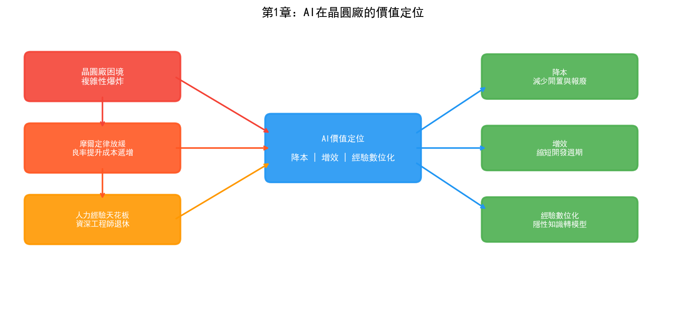

# 第1章 為什麼是 AI × 半導體晶圓廠

## 1.1 摩爾定律的黃昏與 AI 的黎明

2024年，一座先進製程晶圓廠的造價已經攀升到200至300億美元。作為參照，2000年建一座晶圓廠只需10至20億美元——二十五年間，建廠成本翻了十倍以上。單臺EUV微影機的售價超過1.5億美元，新一代High-NA EUV更是突破3.5億美元，而一座3nm晶圓廠需要部署15臺以上這樣的設備。一張3nm製程的光罩套件成本超過2000萬美元。

這些數字背後是一個殘酷的現實：半導體製造正在逼近物理極限，每一代技術節點的推進都比上一代更加艱難。

摩爾定律沒有死，但它正在變貴。台積電3nm製程的電晶體密度相比5nm提升了約70%，但良率爬坡週期顯著拉長，製程步驟從7nm的約800至1200步膨脹到3nm的超過1200步，微影層數從7nm的60至80層增加到3nm的80至120層。每一層都需要經歷清洗、沉積、微影、刻蝕、清洗、量測的核心迴圈，任何一步的微小偏差都可能導致整批晶圓報廢。

與此同時，另一場革命正在發生。

2012年，AlexNet在ImageNet競賽中將錯誤率從26%降至15%，深度學習一戰成名。2022年，ChatGPT發布，大語言模型展現出的湧現能力震驚世界。2024年，Palantir的AI平臺在美國對伊朗的軍事行動中首次實現了"演算法主導的殺傷鏈"——AI定義了目標的識別、時機的選擇和打擊的序列，人類指揮官只做最終批准。

半導體製造和人工智慧，這兩個各自經歷了數十年發展的領域，正在一個特殊的交匯點相遇。晶圓廠積累了海量的製程資料卻無法被充分消化，而AI恰恰具備從海量資料中提取模式、做出預測、最佳化決策的能力。這種匹配不是巧合——當人類工程師的認知能力已經無法處理千步製程、百層結構、萬億參數的複雜性時，機器智慧的介入變得不可迴避。

## 1.2 晶圓廠的困境：複雜性爆炸

### 製程步驟的指數級增長

一顆3nm晶片從晶圓投入到產出需要經歷3至4個月的製造週期，其間經過超過1200道製程步驟。這些步驟並非簡單的線性疊加——前後步驟之間存在複雜的互動效應。某一層的刻蝕深度偏差0.5奈米，可能在二十層之後的電性測試中表現為漏電流超標，而這個關聯往往無法透過單步製程參數的監控來發現。

28nm製程大約包含400至600道工序，3nm GAA架構則超過1200道。工序數量翻倍意味著潛在的參數互動組合呈指數級增長。假設每步製程有10個關鍵參數，每個參數有5個可能的狀態，1200步製程的參數空間就是 $5^{12000}$——這個數字遠超宇宙中的原子總數。當然，實際工程中並非所有參數都相互耦合，但即使只考慮相鄰步驟的互動，需要監控的參數組合也達到了天文數字。

### 良率提升的邊際成本遞增

在成熟製程（28nm及以上）中，良率從50%爬升到90%通常需要6至12個月。但在先進製程中，同樣的爬坡可能需要18至24個月甚至更久。三星的2nm GAA製程在初期的良率一度跌至30%左右，經過與Palantir合作進行資料整合與分析後，到2026年中期良率爬升至約55%——仍然低於60%的量產門檻。每一代新製程的良率爬坡曲線都在變得更陡峭。

良率的經濟意義是直接的。一座月產5萬片的3nm晶圓廠，良率每提升1個百分點，每年增加的利潤可達數千萬美元。反過來，良率每損失1個百分點，意味著同樣的設備和人力投入下產出更少的良品。當一座工廠的年折舊成本以十億美元計時，良率就是一切。

### 人力經驗的天花板

晶圓廠中存在一個難以量化的核心資產：資深工程師的經驗。一位有20年經驗的製程工程師可以透過觀察FDC（故障檢測與分類）圖表的形態判斷某臺機臺是否即將出現異常，可以根據缺陷的空間分佈模式推斷出問題出在哪一步製程的哪個腔體。這種"看一眼就知道"的能力，本質上是人腦對海量歷史資料的高度壓縮表徵——但它有三個致命的侷限。

第一，不可複製。培養一位合格的PID工程師需要5至10年，而先進製程的迭代速度要求人才儲備跟上技術節奏。第二，不可擴充套件。一位工程師同時能監控的機臺數量和製程步驟是有限的。第三，不可傳承。當資深工程師退休或離職，他們腦海中那些從未被文字記錄的關聯規則也隨之消失。

這三個侷限共同指向同一個結論：晶圓廠需要一種能夠從資料中自動提取經驗、將隱性知識顯性化、並可無限複製和擴充套件的技術。這正是AI擅長的。

## 1.3 AI 在晶圓廠的價值定位

AI在晶圓廠的價值不是替代工程師，而是將工程師從低效的資訊處理工作中解放出來，讓他們聚焦於真正需要人類判斷力的決策。具體而言，AI在晶圓廠的價值可以歸結為三個層面。

### 降本：減少機臺閒置與晶圓報廢

一座先進晶圓廠執行著數百臺設備，每臺設備的閒置成本以每小時數千美元計算。傳統的預防性維護（PM）採用固定週期——不管機臺狀態如何，每隔N批次做一次保養。這種方式要麼維護過早（浪費產能），要麼維護過晚（導致異常批次甚至設備停機）。

基於AI的預測性維護透過分析設備的感測器時序資料（溫度、壓力、振動、RF功率等），可以在異常發生前數小時甚至數天發出預警。英特爾在其晶圓廠中部署了基於機器學習的設備監控系統，將非計劃停機時間顯著降低。台積電開發了智慧設備健康度監控系統，透過自學習演算法實現"最嚴格的製程控制標準"。

晶圓報廢的代價更為直接。一片3nm晶圓上有數百顆晶片，按單顆晶片售價計算，一片晶圓的產值可達數萬美元。如果AI能將報廢率降低0.5個百分點，對於一座月產5萬片的工廠來說，每年挽回的損失以百萬美元計。

### 增效：縮短製程開發週期與加速良率爬坡

新產品匯入（NPI）是晶圓廠最耗時也最燒錢的階段。一個先進製程的NPI週期通常需要1至2年，期間需要進行大量的DOE（實驗設計）來尋找最優製程視窗。傳統DOE方法依賴於工程師的經驗和統計方法，面對上千個製程參數和它們之間的非線性互動，效率極低。

AI可以從兩個方向加速這一過程。第一，基於歷史資料的遷移學習——上一代製程的DOE結果可以指導新一代製程的參數搜尋方向。第二，基於貝葉斯最佳化或強化學習的主動實驗設計——AI模型根據已有實驗結果預測最有資訊量的下一組實驗參數，從而用更少的實驗次數覆蓋更大的參數空間。

英特爾在18A製程上應用機器學習後，實現了每月約7%的良率改善速率。這意味著原本可能需要一年的良率爬坡週期被壓縮了數月。英特爾的實踐還包括基於ML的快速根因分析（RCA），將原本耗時數天的缺陷根因定位壓縮到分鐘級別。

### 經驗數字化：將隱性知識轉化為可複用的模型

這是AI在晶圓廠最深層的價值。傳統的製程知識以文件、SOP、工程師腦中的經驗三種形式存在。文件是顯性的但往往過時，SOP是規範的但無法覆蓋所有異常情況，工程師的經驗是最有價值的但最難傳承。

AI可以將這些隱性知識轉化為模型。例如，透過知識圖譜將製程規範、設備參數、缺陷模式、根因記錄整合為一個可推理的語義網路；透過深度學習將工程師"看圖識缺陷"的能力轉化為自動缺陷分類（ADC）模型；透過強化學習將資深工程師的recipe調參策略轉化為R2R控制策略。

這些模型一旦訓練完成，可以同時部署到多臺設備、多個工廠，且永不疲倦、永不離職。三星將其AI最佳化生產描述為"一個連接先前孤立流程的智慧網路"，其HBM4記憶體的製造即受益於這套AI最佳化系統，實現了30%的缺陷檢測改善和15%的晶圓良率提升。

## 1.4 全球晶圓廠 AI 落地現狀

### 台積電

台積電在其官方網站的"工程效能最佳化"板塊中明確表示正在實施AI技術，開發了精確故障檢測與分類系統、智慧先進設備控制和智慧先進製程控制。台積電的AI應用強調"智慧檢測、智慧診斷和自學習"，以實現最嚴格的製程控制標準，確保機臺匹配的一致性和製程穩定性。結合台積電的代工經驗，AI被用於最小化製程參數的收斂偏差。

台積電的AI部署是漸進式的——從單點的缺陷檢測自動化，逐步擴充套件到整線的智慧排程。據SEMI報道，臺中科學園區的一座新建晶圓廠已經實現了AI驅動的排程指令：凌晨3點，一批完成離子注入的晶圓根據AI排程繞過傳統等待區直接送入清洗工段。這種實時排程最佳化在傳統MES系統中是無法實現的。

### 三星

三星半導體是AI在晶圓廠應用最激進的實踐者之一。2024年底，三星電子DS部門做出了一個被業內視為"近乎瘋狂"的決定——將晶圓廠核心製造資料接入美國Palantir公司的AI分析平臺。半導體製程資料比晶片設計圖紙更敏感，台積電和英特爾從未讓第三方觸碰產線資料。三星之所以破例，是因為2nm GAA製程的良率已經跌到30%左右，傳統方法無法突破瓶頸。

Palantir的Foundry平臺透過Ontology（本體論）技術，將分散在MES、SPC、缺陷檢測、電性測試等幾十個異構系統中的資料統一建模為一張因果關聯網路——"晶圓→批次→設備→製程步驟→參數→缺陷→測試結果"之間的所有關係被顯式定義，機器可以直接在這張網路上做關聯查詢和推理。到2026年中期，三星2nm良率爬升至約55%，雖然仍低於60%的量產門檻，但改善速度令業內矚目。

三星同時在其AI Megafactory中部署了大規模AI算力（據報道使用約5萬塊GPU），將AI最佳化貫穿從缺陷檢測到製程參數調優的全流程，其HBM4記憶體產品即由這套AI最佳化系統製造。

### 英特爾

英特爾在半導體製造中大規模部署AI的實踐可以追溯到2018年前後，並在其白皮書《人工智慧在英特爾半導體製造環境中的重要價值》中做了系統闡述。英特爾工廠中部署的AI應用包括：

- 生產線上的缺陷檢測
- 設備/設備群/晶圓廠匹配（Tool Matching）
- 多變數流程控制
- 自動化晶圓圖模式檢測和分類
- 快速根本原因分析（RCA）
- 篩選測試中的異常值檢測

英特爾在18A製程上應用機器學習後，實現了每月約7%的良率改善速率。RCA系統透過整合數十億條異構生產資料，將根因定位時長從數天壓縮到分鐘級。

### 其他玩家

除了三大晶圓代工廠，AI在半導體製造中的應用也在向更廣泛的生態擴散。Google DeepMind的AlphaChip專案使用強化學習結合圖神經網路（GNN）最佳化晶片佈局佈線，實現了佈線長度縮短6.2%，並將原本需要數週的設計過程壓縮到數小時。NVIDIA將視覺語言模型（如Cosmos Reason）應用於晶圓圖缺陷分類，實現了少樣本學習、自然語言解釋和自動資料標註，模型構建時間縮短可達2倍。Via Automation在2025年SEMICON West上發布了基於Agentic AI的Via Connect和Via Co-Pilot平臺，將邊緣資料整合與AI驅動的人機協作結合，目標指向"自愈工廠"。

設備廠商方面，Lam Research推出了Fabtex Yield Optimizer，結合AI和虛擬孿生技術，在虛擬世界中預測故障、定位根因、推薦解決方案——在物理晶圓被蝕刻之前。應用材料（Applied Materials）也在其Equipment Intelligence產品線中整合了AI分析能力。

## 1.5 本書的目標與組織方式

### 目標

本書的目標是系統性地回答一個問題：AI技術如何在半導體晶圓廠中真正落地？

市面上不缺AI技術書籍，也不缺半導體製造書籍，但將兩者深度結合、既講技術原理又講工廠實踐的系統性著作幾乎沒有。本書試圖填補這個空白。

具體而言，本書追求三個目標：

**第一，讓半導體工程師理解AI。** 不堆砌數學公式，而是從"AI能幫你解決什麼問題"出發，講清楚每類AI技術的適用場景、侷限性和實施路徑。一位PID工程師讀完本書應該能判斷：面對一個良率異常問題，是該用知識圖譜做根因推理，還是該用深度學習做缺陷分類，還是該用強化學習做參數最佳化。

**第二，讓AI工程師理解半導體。** 半導體製造不是普通的工業場景——它的資料異構性、製程複雜性、質量嚴苛性和商業敏感性都是獨特的。一位AI演算法工程師讀完本書應該能理解：為什麼在晶圓廠部署一個CNN模型和在網際網路公司部署完全是兩回事，為什麼資料融合比模型精度更關鍵，為什麼Ontology可能是比深度學習更重要的基礎設施。

**第三，為管理層提供決策參考。** 晶圓廠該投哪些AI專案、以什麼順序投、預期回報如何、風險在哪裡——本書的案例和分析試圖為這些問題提供框架性參考。

### 組織方式

本書採用"雙線交織"的結構。

**業務主線**：以晶圓廠三大核心部門為脈絡——製程整合（PID）與良率工程（YED）、製造部（MFG）、製程工程（PE）與設備工程（EE）。這三個部門覆蓋了晶圓廠從製程開發到量產交付的完整價值鏈，每個部門有其獨特的業務場景和AI需求。

**技術主線**：以AI的發展脈絡為骨架——從1956年達特茅斯會議出發，沿著符號主義、連接主義、行為主義三大流派展開，延伸到大語言模型（LLM）與Agent，最終收束於Ontology（本體論）這一被Palantir證明在工業場景中極具價值的技術路線。

兩條線的交叉點在第四部分——AI三大流派分別在三大部門中的應用。這種矩陣式結構確保每一種AI技術和每一個業務場景的組合都被覆蓋到，讀者既可以從技術維度橫向閱讀（比如"連接主義在三個部門的應用"），也可以從業務維度縱向閱讀（比如"PID部門可以用的AI技術有哪些"）。

第六部分是本書的"終章"——Ontology。之所以單獨成章，是因為Ontology可能是半導體晶圓廠AI落地中最被低估、卻可能最具變革性的技術。Palantir用Ontology幫助美軍實現了"演算法主導的殺傷鏈"，又用同一套技術幫助三星從30%的良率泥潭中爬出來。這個故事背後的技術邏輯值得每一個半導體AI從業者深思。

### 閱讀說明

本書各部分之間沒有嚴格的先後依賴。半導體工程師建議從第三部分（晶圓廠業務）開始，找到自己熟悉的場景後再回溯到第二部分（AI技術）和第四部分（交叉應用）。AI工程師建議從第二部分開始，建立技術框架後跳到第四部分看應用。管理層和投資人可以直接跳到第六部分看Palantir的故事，再根據興趣回溯。

本書所有內容在GitHub上開源，歡迎讀者透過Issue反饋錯誤、補充案例、參與章節撰寫。半導體技術迭代極快，本書將隨行業發展持續更新。
