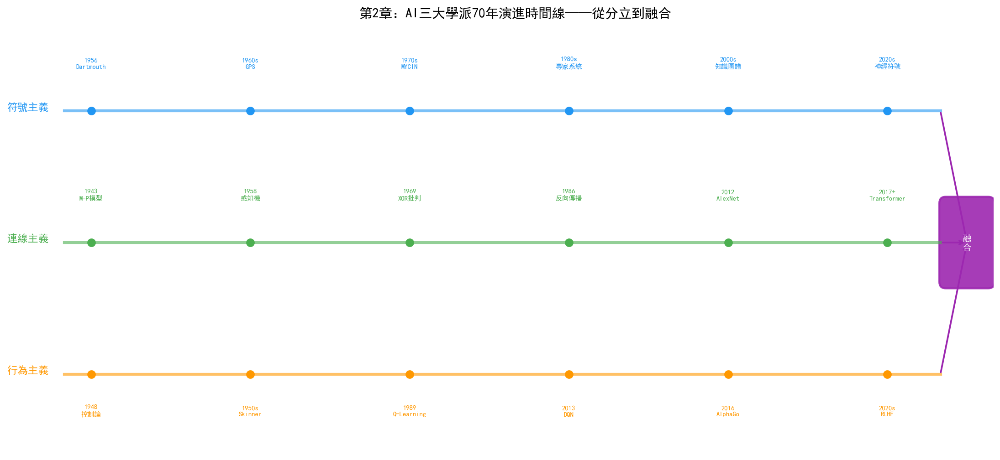
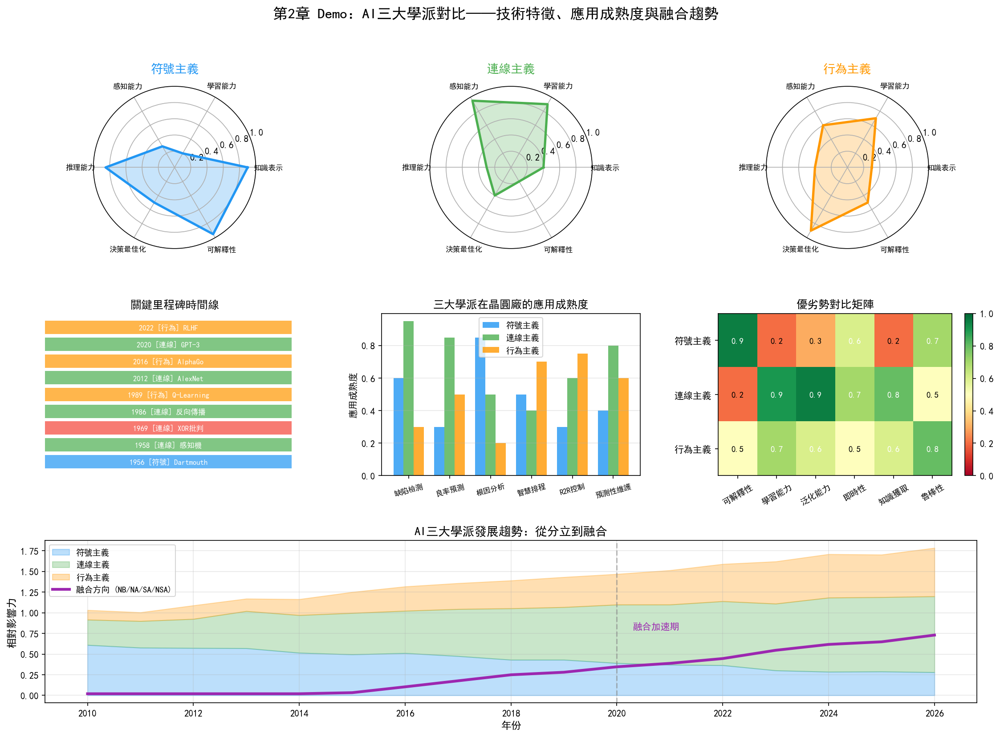

# 第2章 AI 簡史——從 1956 年達特茅斯會議說起

## 2.1 達特茅斯會議：AI 的誕生

1956年夏天，美國新罕布什爾州的達特茅斯學院（Dartmouth College）迎來了一場為期約兩個月的研討會。會議的提案由四位學者聯名提交：約翰·麥卡錫（John McCarthy，當時在達特茅斯任教）、馬文·明斯基（Marvin Minsky，哈佛大學）、克勞德·夏農（Claude Shannon，貝爾實驗室）和納撒尼爾·羅切斯特（Nathaniel Rochester，IBM）。

提案中第一次正式使用了"Artificial Intelligence"這個詞。麥卡錫後來回憶說，他選擇這個詞是為了與"cybernetics"（控制論）和"automata"（自動機）區分開來——他需要一個能夠涵蓋"機器模擬人類智慧各個方面"的統稱。

會議的參與者還包括了赫伯特·西蒙（Herbert Simon）和艾倫·紐厄爾（Allen Newell），他們帶著剛剛完成的"邏輯理論家"（Logic Theorist）程式參會。這個程式能夠證明《數學原理》中前38條定理中的大部分，被後人稱為"第一個AI程式"。阿瑟·塞繆爾（Arthur Samuel）在會議上報告了他的跳棋程式——這個程式透過自我對弈不斷學習，最終達到了業餘高手的水平。塞繆爾在1959年提出了"機器學習"（Machine Learning）這個術語。

達特茅斯會議的意義不在於它解決了什麼問題——事實上會議期間幾乎沒有達成共識——而在於它劃定了一個學科邊界，把分散在邏輯學、控制論、資訊理論、心理學等不同領域的研究者聚集到了"人工智慧"這面旗幟下。從這一刻起，AI作為一個獨立學科開始了它跌宕起伏的七十年。

## 2.2 第一次熱潮與寒冬（1956–1974）

達特茅斯會議之後的十幾年是AI的第一個黃金時代。研究者們充滿樂觀，相信通用人工智慧指日可待。

1958年，紐厄爾和西蒙發布了"通用問題求解器"（General Problem Solver, GPS），試圖模擬人類解決問題的思維過程。GPS採用"手段-目的分析"（means-ends analysis）策略：比較當前狀態與目標狀態的差異，選擇能縮小差異的運算子，遞迴地應用到子問題上。雖然GPS只能解決簡單的邏輯謎題和數學問題，但它的意義在於第一次將"啟發式搜尋"形式化為可計算的框架。

1966年，麻省理工學院的約瑟夫·魏岑鮑姆（Joseph Weizenbaum）編寫了ELIZA——一個模擬心理諮詢師的對話程式。ELIZA的技術極其簡單——透過模式匹配和關鍵詞重寫生成回覆——但效果出人意料地好，很多使用者真的以為自己在和一個人對話。魏岑鮑姆本人對此感到不安，後來寫了《計算機的力量與人類理性》一書，質疑AI的倫理邊界。

1970年，特里·維諾格拉德（Terry Winograd）開發了SHRDLU——一個在虛擬積木世界中執行自然語言指令的系統。使用者可以用英語告訴SHRDLU"把那個紅色的方塊放到藍色立方體上"，系統會理解指令、規劃動作並執行。SHRDLU證明了自然語言理解在受限領域中是可行的，但也暴露了一個問題：當領域的邊界稍微擴大，系統的複雜度就會爆炸。

這段時間最雄心勃勃的專案是麻省理工學院的MAC專案，目標之一是構建一個能夠理解自然語言、進行數學推導、下棋、甚至寫詩的通用AI系統。這個目標顯然過於超前，最終只實現了部分功能。

樂觀情緒在1960年代末達到頂峰。西蒙在1965年預測："二十年內，機器將能夠完成人類能做的一切工作。"明斯基在1967年表示："在一代人之內，創造'人工智慧'的問題將被基本解決。"

這些預測沒能實現。1973年，英國數學家詹姆斯·萊特希爾爵士（Sir James Lighthill）應英國科學委員會要求提交了一份AI領域評估報告。萊特希爾審查了AI研究的實際成果後得出了嚴厲的結論：AI研究未能實現其承諾，基礎研究（如機器翻譯）的實際效果遠不如預期，所謂的"通用問題求解"只能在玩具問題上運作。萊特希爾報告導致英國政府大幅削減AI研究經費，美國國防部高階研究計劃局（DARPA）也隨之收緊了對AI的資助。第一次AI寒冬降臨。

## 2.3 專家系統時代（1974–1987）

寒冬中，AI研究者們反思了第一波熱潮的教訓。一個核心共識是：通用智慧太難，不如先解決特定領域的專業問題。這個思路催生了專家系統。

專家系統的邏輯很簡單：把人類專家的知識編碼成"如果-那麼"規則，儲存在知識庫中，然後用推理引擎根據規則推導結論。與通用問題求解器不同，專家系統不追求通用性，而是在一個狹窄的專業領域中做到專家水平。

1965年（比達特茅斯會議還早），斯坦福大學的愛德華·費根鮑姆（Edward Feigenbaum）開始開發DENDRAL——一個能夠根據質譜資料推斷有機分子結構的系統。DENDRAL內嵌了化學家的啟發式規則，能夠在特定領域超越人類專家。DENDRAL的意義在於它開創了"知識工程"（Knowledge Engineering）這一正規化：AI的核心不是推理演算法（推理引擎可以通用），而是領域知識（知識庫必須由專家構建）。

1970年代中期，斯坦福大學開發了MYCIN——一個診斷細菌感染並推薦抗生素的系統。MYCIN的知識庫包含約600條規則，在血液感染診斷中的準確率達到了約65%，優於初級醫生（約60%）但略低於專科醫生（約70%）。MYCIN還引入了"不確定性推理"——每條規則附帶一個確定性因子（certainty factor），推理結果不是"是"或"否"，而是一個機率值。

DENDRAL和MYCIN的成功引發了專家系統的商業化熱潮。1980年代，DEC公司部署了XCON（又名RI），一個配置VAX計算機系統的專家系統，據說每年為公司節省數千萬美元。從1980年到1987年，專家系統市場規模從數百萬美元增長到數十億美元。

1982年，日本啟動了"第五代計算機系統"（Fifth Generation Computer Systems, FGCS）專案，計劃在十年內投入約8.5億美元，開發基於邏輯程式設計（Prolog）的並行推理計算機。這個專案在全球引發了連鎖反應——美國和歐洲紛紛啟動了自己的"智慧計算機"專案，如美國的MCC（Microelectronics and Computer Technology Corporation）和歐洲的ESPRIT計劃。

然而專家系統有兩個致命的弱點。

第一，知識獲取瓶頸。構建一箇中等規模的專家系統（幾百條規則）需要知識工程師與領域專家花數月甚至數年時間進行"知識抽取"——逐條詢問專家的決策規則並編碼成"如果-那麼"形式。這個過程極其耗時且容易出錯，因為專家的很多知識是隱性的——他們知道怎麼做，但說不清楚為什麼。

第二，脆弱性。專家系統只有知識庫中明確編碼的規則才能推理。遇到規則未覆蓋的情況，系統要麼沉默不語，要麼給出荒謬的答案。它沒有人類那種"差不多就行"的常識推理能力。

1987年，專家系統的市場突然崩塌。原因不是技術本身出了問題，而是商業環境變了——個人電腦的崛起使得昂貴的Lisp專用工作站失去了市場（一臺Lisp機器要5萬至10萬美元，而一臺Macintosh只需2500美元），企業發現維護一個專家系統的成本遠超預期。與此同時，日本的第五代計算機專案在1992年悄然終止——未能實現任何具有實用價值的突破。

第二次AI寒冬比第一次更冷。從1987年到1993年，AI研究幾乎從公眾視野中消失。商業媒體將AI視為又一個過度炒作的技術泡沫，"人工智慧"這個詞本身成了一個帶有貶義的標籤——很多研究者改用"機器學習"、"模式識別"、"智慧系統"等更務實的名字來描述自己的工作。

## 2.4 統計學習與連接主義復興（1987–2012）

寒冬之中，AI研究並沒有停止，只是換了方向。

### 連接主義的地下復甦

1986年，大衛·魯梅爾哈特（David Rumelhart）、傑弗裡·辛頓（Geoffrey Hinton）和羅納德·威廉姆斯（Ronald Williams）在《自然》雜誌上發表論文，系統闡述了反向傳播演算法（Backpropagation）。反向傳播不是他們的原創——保羅·韋伯（Paul Werbos）在1974年的博士論文中就描述了類似演算法——但1986年的論文讓這個演算法被廣泛知曉。

反向傳播解決了多層神經網路的訓練問題。單層感知機無法學習XOR等非線性函式——這正是1969年明斯基和帕珀特在《感知機》一書中指出的致命缺陷。反向傳播透過鏈式法則將輸出誤差逐層傳播回輸入端，使得多層網路可以學習複雜的非線性對映。這個突破為深度學習埋下了種子。

辛頓和他的學生們在接下來的二十年中一直在多倫多大學堅持研究神經網路，當主流AI社群沉浸在支援向量機（SVM）和貝葉斯方法的輝煌中時，這個小組幾乎是連接主義的最後陣地。2006年，辛頓發表了關於"深度信念網路"（Deep Belief Networks）的論文，提出了一種逐層預訓練的策略來克服深層網路的訓練困難。這篇論文重新定義了"深度學習"（Deep Learning）這個術語，並引發了新一輪連接主義研究的浪潮。

### 統計學習的主流地位

1990年代，統計學習方法主導了AI研究。弗拉基米爾·瓦普尼克（Vladimir Vapnik）在1995年提出了支援向量機（SVM），透過將資料對映到高維空間尋找最大間隔超平面，SVM在小樣本分類問題上表現出色，迅速成為機器學習的標準工具。同時，貝葉斯網路作為一種處理不確定性的機率推理框架，在醫療診斷、故障診斷等領域得到了廣泛應用。

這些方法的共同特點是：不試圖模擬人類思維，而是從資料中學習統計規律。它們不追求通用智慧，而是在具體的分類、迴歸、聚類任務上追求可量化的效能指標。這種務實的轉向為後來深度學習的爆發奠定了基礎設施——資料集、評測標準、開源工具鏈都是在這個時期建立的。

### 一個被忽視的領域

值得注意的是，這段時期半導體行業對統計學習的應用已經有了一些早期探索。1990年代，部分晶圓廠開始使用簡單的統計模型進行製程參數監控和缺陷率預測。SPC（統計過程控制）是半導體製造的基礎工具，而SVM等機器學習方法被嘗試用於FDC（故障檢測與分類）和ADC（自動缺陷分類）。但這些應用大多是孤立的、實驗性的，遠未形成系統性的技術體系。連接主義在半導體行業幾乎沒有存在感——當時的資料量和算力都不足以支撐深度學習。

## 2.5 深度學習革命（2012–2020）

### ImageNet 與 AlexNet

2012年9月，ImageNet大規模視覺識別挑戰賽（ILSVRC）的結果震驚了計算機視覺社群。多倫多大學的 Alex Krizhevsky、Ilya Sutskever 和 Geoffrey Hinton 提交的 AlexNet，將影象分類的錯誤率從上一年的26%一舉降到15.3%——領先第二名10.8個百分點。

AlexNet 的技術構成並不新穎——卷積神經網路（CNN）早在1998年就被 Yann LeCun 用於手寫數字識別（LeNet-5），反向傳播也已經存在了二十多年。AlexNet 的成功是三個因素同時成熟的結果：第一，ImageNet 資料集提供了百萬級標註影象；第二，GPU 提供了足夠的算力來訓練深層網路；第三，AlexNet 使用了 ReLU 啟用函式和 Dropout 正則化，解決了深層網路的梯度消失和過擬合問題。

AlexNet 的意義遠超影象分類本身。它證明了"更多的資料 + 更深的網路 + 更強的算力"可以產生質的飛躍，這個發現直接催生了之後十年的AI投資浪潮。

### AlphaGo

2016年3月，DeepMind 開發的 AlphaGo 在首爾以4:1擊敗了圍棋世界冠軍李世石。圍棋曾被認為是AI最難攻克的棋類遊戲——棋局狀態數（約 $10^{170}$）超過了宇宙中的原子總數，傳統的Minimax搜尋完全不可行。

AlphaGo 的技術架構是連接主義和行為主義的完美融合：深度神經網路用於評估棋局和選擇落子位置（策略網路和價值網路），蒙特卡洛樹搜尋（MCTS）用於在搜尋空間中探索。2017年的 AlphaZero 更進一步，完全不依賴人類棋譜，僅透過自我對弈從零開始學習，最終超越了所有人類和AI棋手。

AlphaGo 的勝利在工業界引發了巨大反響。如果AI能在圍棋這種"人類最後的智力堡壘"上勝出，它還有多少領域不能征服？這種樂觀情緒推動了AI在醫療、金融、製造等領域的快速滲透。

### 深度學習向工業領域滲透

2012年到2020年間，深度學習技術在工業場景中的應用開始湧現。在半導體製造領域，幾個方向率先起步：

**缺陷檢測**：CNN 在影象分類上的優勢天然適配晶圓缺陷檢測。傳統的自動缺陷分類（ADC）依賴手工特徵提取和簡單分類器，深度學習模型在複雜缺陷模式識別上的準確率顯著優於傳統方法。

**預測性維護**：LSTM 等迴圈神經網路在時序訊號預測上的能力被應用於設備感測器資料的異常檢測。透過學習正常執行的訊號模式，模型可以在參數偏離正常範圍時發出預警。

**良率預測**：基於深度學習的晶圓圖分析模型能夠從缺陷的空間分佈模式中識別出與特定製程步驟相關的系統性問題，輔助PID工程師進行根因定位。

這些應用雖然還侷限在單點最佳化層面，但已經展現出深度學習在半導體製造中的巨大潛力。

## 2.6 大模型時代（2020 至今）

### Transformer 與 GPT

2017年，Google 的 Ashish Vaswani 等人發表了《Attention is All You Need》，提出了 Transformer 架構。Transformer 完全拋棄了迴圈和卷積結構，僅依賴自注意力（Self-Attention）機制來建模序列中元素之間的關係。這個看似簡單的架構變革產生了深遠的影響——Transformer 成為了之後所有大語言模型的基礎。

OpenAI 的 GPT 系列沿著"擴大規模"這條路堅定前行。GPT-1（2018）有1.17億參數，GPT-2（2019）有15億參數，到 GPT-3（2020）參數量飆升到1750億。GPT-3 的突破不在於架構創新——它用的是標準的 Decoder-only Transformer——而在於規模：當模型和訓練資料大到一定程度後，出現了訓練時未曾顯式教授的"湧現能力"（Emergent Abilities），如少樣本學習、鏈式推理和程式碼生成。

2022年11月，ChatGPT 發布。GPT-3.5 與人類偏好對齊（RLHF）的結合產生了驚人的對話效果，兩個月內使用者突破一億，成為史上增長最快的消費級應用。ChatGPT 的成功將AI從學術研究推向了公眾視野的最前沿。

### Agent 的興起

大語言模型的湧現能力催生了一個新的概念：Agent（智慧體）。與傳統AI系統執行單一任務不同，Agent 旨在透過感知環境、規劃行動、呼叫工具、記憶上下文來自主完成複雜的多步驟任務。

Agent 的核心架構可以概括為四個元件：

- **感知（Perception）**：從環境中獲取資訊，可以是文字輸入、API呼叫結果、感測器資料等
- **規劃（Planning）**：將目標分解為可執行的子任務序列
- **記憶（Memory）**：短期記憶保持當前任務的上下文，長期記憶儲存歷史經驗和知識
- **行動（Action）**：呼叫外部工具（搜尋引擎、資料庫查詢、程式碼執行等）或與人互動

2023年以來，AutoGPT、BabyAGI等開源Agent框架相繼出現，ReAct（Reasoning + Acting）正規化成為主流。在企業場景中，Agent開始被用於自動化資料分析、客戶服務、程式碼開發等任務。

### LLM 在工業場景的探索

大模型在工業領域的應用仍處於早期探索階段，但半導體行業已經展現出了幾個有價值的應用方向：

**製程規範智慧問答**：晶圓廠積累了海量的製程規範文件（SPEC）、設備操作手冊和異常處理流程。傳統方式下工程師需要手動檢索這些文件，效率低下。基於 RAG（檢索增強生成）技術，LLM 可以理解工程師的自然語言提問，從文件庫中檢索相關內容並生成準確的回答。

**報告自動化**：良率報告、異常分析報告、設備狀態報告等在晶圓廠中每天產生大量重複性文件工作。LLM 可以根據結構化資料自動生成這些報告的草稿，工程師只需審閱和修正。

**跨系統資料問答**：工程師可以用自然語言提問"上週3號機臺的刻蝕均勻性有沒有異常"，LLM 配合資料查詢工具自動生成SQL或API呼叫，獲取資料並給出分析。

但LLM在晶圓廠的落地也面臨獨特挑戰：製程資料的保密性要求極高（三星接入Palantir時已屬"破例"），大模型的"幻覺"問題在工業場景中代價更高（一個錯誤的製程參數建議可能導致整批晶圓報廢），以及如何將領域專業知識有效注入大模型。

## 2.7 AI 三大學派的分化與融合

回望AI七十年曆史，三條主線貫穿始終，它們對應著三種不同的智慧觀。

### 符號主義

符號主義認為智慧的核心是符號操作——將知識表示為符號，透過邏輯規則進行推理。從達特茅斯會議到專家系統時代，符號主義是AI的主流。邏輯理論家、GPS、MYCIN都是符號主義的產物。符號主義的優勢是可解釋性——每一步推理都可以追溯到具體的規則——但它的侷限同樣明顯：需要人工編碼知識，無法處理感知層面的模糊性和不確定性，面對"常識"問題時顯得力不從心。

### 連接主義

連接主義認為智慧源於神經元之間的連接——透過調整連接權重來學習資料中的模式。從1958年的感知機到2012年的AlexNet再到今天的GPT，連接主義走過了從被壓制到主導AI領域的曲折道路。連接主義的優勢在於從資料中自動學習特徵表示的能力，但它也因此被批評為"黑箱"——模型做出預測的決策過程不透明。

### 行為主義

行為主義認為智慧在與環境的互動中湧現——透過試錯和反饋來學習最優行為策略。從維納的控制論到強化學習，行為主義在很長一段時間內是AI的邊緣流派。AlphaGo和AlphaZero的成功改變了這一局面——強化學習在序貫決策最佳化上的能力被充分證明。但行為主義的侷限在於樣本效率低（需要大量試錯）和獎勵函式設計困難。

### 從對立到融合

三大學派在歷史上曾相互對立——符號主義者批評連接主義是"黑箱"，連接主義者嘲笑符號主義是" brittle old AI"，行為主義者認為兩者都忽略了智慧體與環境的互動。

但近年的趨勢是融合。神經符號AI（Neuro-Symbolic AI）試圖將符號推理的可解釋性與神經網路的模式識別能力結合。AlphaGo本身就是連接主義（深度神經網路）和行為主義（強化學習）的融合。而LLM+Agent的正規化則同時涉及連接主義（LLM的神經網路基礎）、符號主義（Agent使用工具和規則進行規劃）和行為主義（Agent透過環境反饋調整策略）。

這種融合趨勢對半導體晶圓廠具有重要意義。一個完整的晶圓廠AI系統可能同時需要：知識圖譜來組織製程知識（符號主義）、深度學習來識別缺陷模式（連接主義）、強化學習來最佳化製程參數（行為主義）、LLM來理解工程師的自然語言指令（連接主義）、Ontology來融合跨系統的異構資料（符號主義的延伸）。

本書的第二部分將逐一展開這三大學派的技術細節，第四部分將具體討論它們在晶圓廠三大部門中的應用。而在第六部分，我們將看到Ontology——符號主義在工業場景中最成熟也最被低估的技術——如何透過Palantir在三星晶圓廠中發揮了改變格局的作用。

---

> **本章要點回顧**
>
> | 時期 | 主流流派 | 標誌性事件 | 對半導體的影響 |
> | --- | --- | --- | --- |
> | 1956–1974 | 符號主義 | 達特茅斯會議、GPS、ELIZA | 幾乎無直接影響 |
> | 1974–1987 | 符號主義 | 專家系統（MYCIN、DENDRAL） | 早期製程知識管理探索 |
> | 1987–2012 | 統計學習+連接主義復甦 | SVM、反向傳播 | SPC、FDC中的統計模型應用 |
> | 2012–2020 | 連接主義 | AlexNet、AlphaGo | CNN用於缺陷檢測、LSTM用於預測性維護 |
> | 2020 至今 | 連接主義+融合 | GPT、Agent、Ontology | LLM問答、Agent系統、整廠數字化 |

> **本章配套實驗**：第27章 27.11 節的多 Agent 評估框架（`demos/experiments/fab_agent_test`）以白盒方式演示了 2.6 節所述的 Agent 概念如何落地為可評估的系統——規劃、工具呼叫、反思、編排四模組協作，並即時評估過程品質、資源成本與系統韌性。
